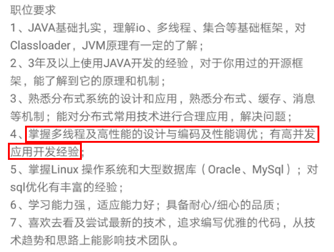
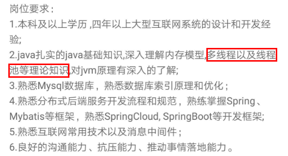

<!DOCTYPE html>
<!-- saved from url=(0046)https://kaiiiz.github.io/hexo-theme-book-demo/ -->
<html xmlns="http://www.w3.org/1999/xhtml">
<head>
    <head>
        <meta http-equiv="Content-Type" content="text/html; charset=UTF-8">
        <meta name="viewport" content="width=device-width, initial-scale=1, maximum-scale=1.0, user-scalable=no">
        <link rel="icon" href="../../static/favicon.png">
        <title>00 由点及面，搭建你的 Java 并发知识网.md</title>
        <!-- Spectre.css framework -->
        <link rel="stylesheet" href="../../static/index.css">
        <!-- theme css & js -->
        <meta name="generator" content="Hexo 4.2.0">
    </head>

<body>

    

        

            <a href="../../index.html">
                
                技术文章摘抄
            </a>
        

        

            <ul class="uncollapsible">
                <li><a href="../../index.html" class="current-tab">首页</a></li>
            </ul>

            <ul class="uncollapsible">
                <li><a href="../index.html">上一级</a></li>
            </ul>

            <ul class="uncollapsible">
                <li>

                    <a class="current-tab" href="00&#32;由点及面，搭建你的&#32;Java&#32;并发知识网.md">00 由点及面，搭建你的 Java 并发知识网.md</a>
                    

                </li>
                <li>

                    
                    <a href="01&#32;为何说只有&#32;1&#32;种实现线程的方法？.md">01 为何说只有 1 种实现线程的方法？.md</a>

                </li>
                <li>

                    
                    <a href="02&#32;如何正确停止线程？为什么&#32;volatile&#32;标记位的停止方法是错误的？.md">02 如何正确停止线程？为什么 volatile 标记位的停止方法是错误的？.md</a>

                </li>
                <li>

                    
                    <a href="03&#32;线程是如何在&#32;6&#32;种状态之间转换的？.md">03 线程是如何在 6 种状态之间转换的？.md</a>

                </li>
                <li>

                    
                    <a href="04&#32;waitnotifynotifyAll&#32;方法的使用注意事项？.md">04 waitnotifynotifyAll 方法的使用注意事项？.md</a>

                </li>
                <li>

                    
                    <a href="05&#32;有哪几种实现生产者消费者模式的方法？.md">05 有哪几种实现生产者消费者模式的方法？.md</a>

                </li>
                <li>

                    
                    <a href="06&#32;一共有哪&#32;3&#32;类线程安全问题？.md">06 一共有哪 3 类线程安全问题？.md</a>

                </li>
                <li>

                    
                    <a href="07&#32;哪些场景需要额外注意线程安全问题？.md">07 哪些场景需要额外注意线程安全问题？.md</a>

                </li>
                <li>

                    
                    <a href="08&#32;为什么多线程会带来性能问题？.md">08 为什么多线程会带来性能问题？.md</a>

                </li>
                <li>

                    
                    <a href="09&#32;使用线程池比手动创建线程好在哪里？.md">09 使用线程池比手动创建线程好在哪里？.md</a>

                </li>
                <li>

                    
                    <a href="10&#32;线程池的各个参数的含义？.md">10 线程池的各个参数的含义？.md</a>

                </li>
                <li>

                    
                    <a href="11&#32;线程池有哪&#32;4&#32;种拒绝策略？.md">11 线程池有哪 4 种拒绝策略？.md</a>

                </li>
                <li>

                    
                    <a href="12&#32;有哪&#32;6&#32;种常见的线程池？什么是&#32;Java8&#32;的&#32;ForkJoinPool？.md">12 有哪 6 种常见的线程池？什么是 Java8 的 ForkJoinPool？.md</a>

                </li>
                <li>

                    
                    <a href="13&#32;线程池常用的阻塞队列有哪些？.md">13 线程池常用的阻塞队列有哪些？.md</a>

                </li>
                <li>

                    
                    <a href="14&#32;为什么不应该自动创建线程池？.md">14 为什么不应该自动创建线程池？.md</a>

                </li>
                <li>

                    
                    <a href="15&#32;合适的线程数量是多少？CPU&#32;核心数和线程数的关系？.md">15 合适的线程数量是多少？CPU 核心数和线程数的关系？.md</a>

                </li>
                <li>

                    
                    <a href="16&#32;如何根据实际需要，定制自己的线程池？.md">16 如何根据实际需要，定制自己的线程池？.md</a>

                </li>
                <li>

                    
                    <a href="17&#32;如何正确关闭线程池？shutdown&#32;和&#32;shutdownNow&#32;的区别？.md">17 如何正确关闭线程池？shutdown 和 shutdownNow 的区别？.md</a>

                </li>
                <li>

                    
                    <a href="18&#32;线程池实现“线程复用”的原理？.md">18 线程池实现“线程复用”的原理？.md</a>

                </li>
                <li>

                    
                    <a href="19&#32;你知道哪几种锁？分别有什么特点？.md">19 你知道哪几种锁？分别有什么特点？.md</a>

                </li>
                <li>

                    
                    <a href="20&#32;悲观锁和乐观锁的本质是什么？.md">20 悲观锁和乐观锁的本质是什么？.md</a>

                </li>
                <li>

                    
                    <a href="21&#32;如何看到&#32;synchronized&#32;背后的“monitor&#32;锁”？.md">21 如何看到 synchronized 背后的“monitor 锁”？.md</a>

                </li>
                <li>

                    
                    <a href="22&#32;synchronized&#32;和&#32;Lock&#32;孰优孰劣，如何选择？.md">22 synchronized 和 Lock 孰优孰劣，如何选择？.md</a>

                </li>
                <li>

                    
                    <a href="23&#32;Lock&#32;有哪几个常用方法？分别有什么用？.md">23 Lock 有哪几个常用方法？分别有什么用？.md</a>

                </li>
                <li>

                    
                    <a href="24&#32;讲一讲公平锁和非公平锁，为什么要“非公平”？.md">24 讲一讲公平锁和非公平锁，为什么要“非公平”？.md</a>

                </li>
                <li>

                    
                    <a href="25&#32;读写锁&#32;ReadWriteLock&#32;获取锁有哪些规则？.md">25 读写锁 ReadWriteLock 获取锁有哪些规则？.md</a>

                </li>
                <li>

                    
                    <a href="26&#32;读锁应该插队吗？什么是读写锁的升降级？.md">26 读锁应该插队吗？什么是读写锁的升降级？.md</a>

                </li>
                <li>

                    
                    <a href="27&#32;什么是自旋锁？自旋的好处和后果是什么呢？.md">27 什么是自旋锁？自旋的好处和后果是什么呢？.md</a>

                </li>
                <li>

                    
                    <a href="28&#32;JVM&#32;对锁进行了哪些优化？.md">28 JVM 对锁进行了哪些优化？.md</a>

                </li>
                <li>

                    
                    <a href="29&#32;HashMap&#32;为什么是线程不安全的？.md">29 HashMap 为什么是线程不安全的？.md</a>

                </li>
                <li>

                    
                    <a href="30&#32;ConcurrentHashMap&#32;在&#32;Java7&#32;和&#32;8&#32;有何不同？.md">30 ConcurrentHashMap 在 Java7 和 8 有何不同？.md</a>

                </li>
                <li>

                    
                    <a href="31&#32;为什么&#32;Map&#32;桶中超过&#32;8&#32;个才转为红黑树？.md">31 为什么 Map 桶中超过 8 个才转为红黑树？.md</a>

                </li>
                <li>

                    
                    <a href="32&#32;同样是线程安全，ConcurrentHashMap&#32;和&#32;Hashtable&#32;的区别.md">32 同样是线程安全，ConcurrentHashMap 和 Hashtable 的区别.md</a>

                </li>
                <li>

                    
                    <a href="33&#32;CopyOnWriteArrayList&#32;有什么特点？.md">33 CopyOnWriteArrayList 有什么特点？.md</a>

                </li>
                <li>

                    
                    <a href="34&#32;什么是阻塞队列？.md">34 什么是阻塞队列？.md</a>

                </li>
                <li>

                    
                    <a href="35&#32;阻塞队列包含哪些常用的方法？add、offer、put&#32;等方法的区别？.md">35 阻塞队列包含哪些常用的方法？add、offer、put 等方法的区别？.md</a>

                </li>
                <li>

                    
                    <a href="36&#32;有哪几种常见的阻塞队列？.md">36 有哪几种常见的阻塞队列？.md</a>

                </li>
                <li>

                    
                    <a href="37&#32;阻塞和非阻塞队列的并发安全原理是什么？.md">37 阻塞和非阻塞队列的并发安全原理是什么？.md</a>

                </li>
                <li>

                    
                    <a href="38&#32;如何选择适合自己的阻塞队列？.md">38 如何选择适合自己的阻塞队列？.md</a>

                </li>
                <li>

                    
                    <a href="39&#32;原子类是如何利用&#32;CAS&#32;保证线程安全的？.md">39 原子类是如何利用 CAS 保证线程安全的？.md</a>

                </li>
                <li>

                    
                    <a href="40&#32;AtomicInteger&#32;在高并发下性能不好，如何解决？为什么？.md">40 AtomicInteger 在高并发下性能不好，如何解决？为什么？.md</a>

                </li>
                <li>

                    
                    <a href="41&#32;原子类和&#32;volatile&#32;有什么异同？.md">41 原子类和 volatile 有什么异同？.md</a>

                </li>
                <li>

                    
                    <a href="42&#32;AtomicInteger&#32;和&#32;synchronized&#32;的异同点？.md">42 AtomicInteger 和 synchronized 的异同点？.md</a>

                </li>
                <li>

                    
                    <a href="43&#32;Java&#32;8&#32;中&#32;Adder&#32;和&#32;Accumulator&#32;有什么区别？.md">43 Java 8 中 Adder 和 Accumulator 有什么区别？.md</a>

                </li>
                <li>

                    
                    <a href="44&#32;ThreadLocal&#32;适合用在哪些实际生产的场景中？.md">44 ThreadLocal 适合用在哪些实际生产的场景中？.md</a>

                </li>
                <li>

                    
                    <a href="45&#32;ThreadLocal&#32;是用来解决共享资源的多线程访问的问题吗？.md">45 ThreadLocal 是用来解决共享资源的多线程访问的问题吗？.md</a>

                </li>
                <li>

                    
                    <a href="46&#32;多个&#32;ThreadLocal&#32;在&#32;Thread&#32;中的&#32;threadlocals&#32;里是怎么存储的？.md">46 多个 ThreadLocal 在 Thread 中的 threadlocals 里是怎么存储的？.md</a>

                </li>
                <li>

                    
                    <a href="47&#32;内存泄漏——为何每次用完&#32;ThreadLocal&#32;都要调用&#32;remove()？.md">47 内存泄漏——为何每次用完 ThreadLocal 都要调用 remove()？.md</a>

                </li>
                <li>

                    
                    <a href="48&#32;Callable&#32;和&#32;Runnable&#32;的不同？.md">48 Callable 和 Runnable 的不同？.md</a>

                </li>
                <li>

                    
                    <a href="49&#32;Future&#32;的主要功能是什么？.md">49 Future 的主要功能是什么？.md</a>

                </li>
                <li>

                    
                    <a href="50&#32;使用&#32;Future&#32;有哪些注意点？Future&#32;产生新的线程了吗？.md">50 使用 Future 有哪些注意点？Future 产生新的线程了吗？.md</a>

                </li>
                <li>

                    
                    <a href="51&#32;如何利用&#32;CompletableFuture&#32;实现“旅游平台”问题？.md">51 如何利用 CompletableFuture 实现“旅游平台”问题？.md</a>

                </li>
                <li>

                    
                    <a href="52&#32;信号量能被&#32;FixedThreadPool&#32;替代吗？.md">52 信号量能被 FixedThreadPool 替代吗？.md</a>

                </li>
                <li>

                    
                    <a href="53&#32;CountDownLatch&#32;是如何安排线程执行顺序的？.md">53 CountDownLatch 是如何安排线程执行顺序的？.md</a>

                </li>
                <li>

                    
                    <a href="54&#32;CyclicBarrier&#32;和&#32;CountdownLatch&#32;有什么异同？.md">54 CyclicBarrier 和 CountdownLatch 有什么异同？.md</a>

                </li>
                <li>

                    
                    <a href="55&#32;Condition、object.wait()&#32;和&#32;notify()&#32;的关系？.md">55 Condition、object.wait() 和 notify() 的关系？.md</a>

                </li>
                <li>

                    
                    <a href="56&#32;讲一讲什么是&#32;Java&#32;内存模型？.md">56 讲一讲什么是 Java 内存模型？.md</a>

                </li>
                <li>

                    
                    <a href="57&#32;什么是指令重排序？为什么要重排序？.md">57 什么是指令重排序？为什么要重排序？.md</a>

                </li>
                <li>

                    
                    <a href="58&#32;Java&#32;中的原子操作有哪些注意事项？.md">58 Java 中的原子操作有哪些注意事项？.md</a>

                </li>
                <li>

                    
                    <a href="59&#32;什么是“内存可见性”问题？.md">59 什么是“内存可见性”问题？.md</a>

                </li>
                <li>

                    
                    <a href="60&#32;主内存和工作内存的关系？.md">60 主内存和工作内存的关系？.md</a>

                </li>
                <li>

                    
                    <a href="61&#32;什么是&#32;happens-before&#32;规则？.md">61 什么是 happens-before 规则？.md</a>

                </li>
                <li>

                    
                    <a href="62&#32;volatile&#32;的作用是什么？与&#32;synchronized&#32;有什么异同？.md">62 volatile 的作用是什么？与 synchronized 有什么异同？.md</a>

                </li>
                <li>

                    
                    <a href="63&#32;单例模式的双重检查锁模式为什么必须加&#32;volatile？.md">63 单例模式的双重检查锁模式为什么必须加 volatile？.md</a>

                </li>
                <li>

                    
                    <a href="64&#32;你知道什么是&#32;CAS&#32;吗？.md">64 你知道什么是 CAS 吗？.md</a>

                </li>
                <li>

                    
                    <a href="65&#32;CAS&#32;和乐观锁的关系，什么时候会用到&#32;CAS？.md">65 CAS 和乐观锁的关系，什么时候会用到 CAS？.md</a>

                </li>
                <li>

                    
                    <a href="66&#32;CAS&#32;有什么缺点？.md">66 CAS 有什么缺点？.md</a>

                </li>
                <li>

                    
                    <a href="67&#32;如何写一个必然死锁的例子？.md">67 如何写一个必然死锁的例子？.md</a>

                </li>
                <li>

                    
                    <a href="68&#32;发生死锁必须满足哪&#32;4&#32;个条件？.md">68 发生死锁必须满足哪 4 个条件？.md</a>

                </li>
                <li>

                    
                    <a href="69&#32;如何用命令行和代码定位死锁？.md">69 如何用命令行和代码定位死锁？.md</a>

                </li>
                <li>

                    
                    <a href="70&#32;有哪些解决死锁问题的策略？.md">70 有哪些解决死锁问题的策略？.md</a>

                </li>
                <li>

                    
                    <a href="71&#32;讲一讲经典的哲学家就餐问题.md">71 讲一讲经典的哲学家就餐问题.md</a>

                </li>
                <li>

                    
                    <a href="72&#32;final&#32;的三种用法是什么？.md">72 final 的三种用法是什么？.md</a>

                </li>
                <li>

                    
                    <a href="73&#32;为什么加了&#32;final&#32;却依然无法拥有“不变性”？.md">73 为什么加了 final 却依然无法拥有“不变性”？.md</a>

                </li>
                <li>

                    
                    <a href="74&#32;为什么&#32;String&#32;被设计为是不可变的？.md">74 为什么 String 被设计为是不可变的？.md</a>

                </li>
                <li>

                    
                    <a href="75&#32;为什么需要&#32;AQS？AQS&#32;的作用和重要性是什么？.md">75 为什么需要 AQS？AQS 的作用和重要性是什么？.md</a>

                </li>
                <li>

                    
                    <a href="76&#32;AQS&#32;的内部原理是什么样的？.md">76 AQS 的内部原理是什么样的？.md</a>

                </li>
                <li>

                    
                    <a href="77&#32;AQS&#32;在&#32;CountDownLatch&#32;等类中的应用原理是什么？.md">77 AQS 在 CountDownLatch 等类中的应用原理是什么？.md</a>

                </li>
                <li>

                    
                    <a href="78&#32;一份独家的&#32;Java&#32;并发工具图谱.md">78 一份独家的 Java 并发工具图谱.md</a>

                </li>
            </ul>

        

    

    

        

    

    

    

        

            

                

                    <!-- For Responsive Layout -->
                    <header class="navbar">
                        <section class="navbar-section">
                            <a onclick="open_sidebar()">
                                <i class="icon icon-menu"></i>
                            </a>
                        </section>
                    </header>
                

                

                    

                        

                        
<h1>00 由点及面，搭建你的 Java 并发知识网</h1>

你好，欢迎学习《Java 并发编程核心 78 讲》，我是讲师徐隆曦，硕士毕业于德国慕尼黑工业大学，现就职于滴滴出行，负责小桔车服驾驶安全平台开发。

<h6><strong>扎实的理论基础，宝贵的并发实践经验</strong></h6>

工作期间，因为业务需要，我所开发和负责的场景大多数都是大流量和高并发的，其中有很多是对 Java 并发知识的实际应用。学习如逆旅，从小白成长为并发大神，困难重重，既然不能逃避，那么唯有改变对它的态度。

从一开始面对线程池导致的 OOM 问题的不知所措，到后来可以深入剖析 JUC 源码，并精准定位、复现、修复线上的并发问题，再到现在可以应对千万级流量的业务场景，并预判和发现隐藏在其中的线程安全隐患，这期间，我走过一些弯路，踩过一些坑，也积累了很多宝贵的并发经验。

此外，在对并发问题的逐个解决过程中，在系统的设计和实施过程中，我详细研读了大量的国内外经典并发书籍和资料，把涉及的代码一一落实、验证，并应用到业务里，这期间让我逐渐建立起了完善的 Java 并发知识体系。

<h6><strong>为什么并发编程这么重要呢</strong></h6>

随着接触和负责的系统越来越复杂，我逐渐发现，无论是对于优秀的系统设计，还是对于程序员的成长提高、职业发展，并发编程都是必须要跨过去的“坎”，而一旦你跨过了这道“坎”，便会豁然开朗，原来一切都如此简单，职业发展也会更上一层楼。

<ul>
<li><strong>并发已经逐渐成为基本技能</strong></li>
</ul>

流量稍大的系统，随着数据和用户量的不断增加，并发量轻松过万，如果不使用并发编程，那么性能很快就会成为瓶颈。而随着近年来服务器 CPU 性能和核心数的不断提高，又给并发编程带来了广阔的施展拳脚的空间。可谓是<strong>有需求，同时又有资源****保障</strong>，兼具<strong>天时地利</strong>。

<ul>
<li><strong>并发几乎是</strong> <strong>Java</strong> <strong>面试必考的内容</strong></li>
</ul>

而随着互联网进入下半场，好公司对程序员的要求也水涨船高，各大互联网公司的岗位描述中，并发几乎是逃不掉的关键词，我们举几个来自拉勾网的 JD 实例。

你会发现，Java 高级工程师岗位要求中并发编程几乎成为了必须掌握的技能点，而在面经里涉及的并发编程的知识也数不胜数，本专栏各课时涉及的知识点，也正是各大厂 Java 高级工程师面试的高频考题。

<h6>如何学好并发编程</h6>

在此邀请你做一个小测试，看看目录里的问题，你能否回答全面？相信你看到问题后大部分会感觉很熟悉，但要组织答案却又模棱两可，不敢太确定，那么接下来就带你了解如何学好 Java 高并发并攻克这些难题。

<ul>
<li><strong>Java</strong> <strong>编程是众多框架的原理和基础</strong></li>
</ul>

无论是 Spring、tomcat 中对线程池的应用、数据库中的乐观锁思想，还是 Log4j2 对阻塞队列的应用等，无不体现着并发编程的思想，并发编程应用广泛，各大框架都和并发编程有着千丝万缕的联系。

并发编程就像是<strong>地基</strong>，掌握好以后，可以做到<strong>一通百通</strong>。

<strong>不过，要想学好并发编程，却不是一件容易的事，你有没有以下的感受？</strong>

<ul>
<li><strong>并发的知识太多、太杂了</strong></li>
</ul>

常见的并发工具类数不尽数：例如，线程池、各种 Lock、synchronized 关键字、ConcurrentHashMap、CopyOnWriteArrayList、ArrayBlockingQueue、ThreadLocal、原子类、CountDownLatch、Semaphore，等等，而它们的原理又包括 CAS、AQS、Java 内存模型等等。

从刚才那一长串的名字中可以看出，并发工具的数量很多，而且功能也不尽相同，不容易完全掌握。确实，并发涉及的知识点太琐碎了，大家或多或少都学习过一些并发的知识，但是总感觉一直学不完，东一榔头西一棒槌，很零散，也不知道尽头在哪里，导致学完以后，真正能记住的内容却很少。而且如果学到并发底层原理，就不只涉及 Java 语言，更涉及 JVM、JMM、操作系统、内存、CPU 指令等，令人一头雾水。

<ul>
<li><strong>不容易找到清晰易懂的学习资料</strong></li>
</ul>

在我学习的过程中，我总是有一种感受，那就是较少有资料能够把 Java 并发编程讲得非常清楚，例如我们学习一个工具类，希望了解它的诞生背景、使用场景，用法、注意点，最后理解原理，以及它和其他工具类的联系，这一系列的内容其实都是我们需要掌握的。

反观现有的网络相关资料，往往水平参差不齐，真伪难辨，而且经常含有错误，如果我们先入为主地接受了错误的观点，那就得不偿失了。

我希望本门课程可以把 Java 并发编程的这些复杂、难理解的概念，用通俗易懂、丰富的图示和例子的方式和大家分享出来，不仅知道怎么用，还能知道背后的原理。

利用**“全局思维+单点突破”**的理念，建立起并发的知识体系，同时又对各种常见的工具类有深刻认识，以后我们的知识就可以从点到线，从线到面，浑然一体。

<h6><strong>学习了本门课，你会有以下收获</strong></h6>
<ul>
<li><strong>你可以建立完整的</strong> <strong>Java</strong> <strong>并发知识网</strong></li>
</ul>

通过这门课程，你可以系统地学习 Java 并发编程知识，而不再是碎片化获取，建立起知识脉络后，每一个工具类在我们心中就不再高高在上，而仅仅是我们并发知识体系中的一块块“拼图”，相信你对并发的理解会更深入一个层次。

建立完整的知识网络后，今后即便是遇到新推出的并发工具类，也可以迅速定位到它应处的位置，并且结合已有的知识，很快就能把它掌握。

<ul>
<li><strong>你可以掌握常用的并发工具类：</strong></li>
</ul>

课程中包含了实际生产中常用的大多数并发工具类所对应的并发知识，包括线程池、synchronized、Lock 锁，悲观锁和乐观锁、可重入锁、公平锁和非公平锁、读写锁、ConcurrentHashMap、CopyOnWriteArrayList、ThreadLocal、6 种原子类、CAS 原理、线程协作的 CountDownLatch、CyclicBarrier、Semaphore、AQS 框架、Java 内存模型、happens-before 原则、volatile 关键字、线程创建和停止的正确方法、线程的 6 种状态、如何解决死锁等问题。从用法到原理，再到面试常见问题，一次性掌握透彻。

<ul>
<li><strong>面试中获取</strong> <strong>Offer</strong> <strong>的利****器</strong></li>
</ul>

本课程的各小节，都是从高频常考的面试问题出发，首先给出对应的参考解答，然后引申出背后所关联的知识。不但能够让你回答好面试官的问题，而且还可以在面试问题的基础上，做进一步的升华，让面试官眼前一亮。

我还会和你分享面试经验和技巧，如何把面试官往我们的思路上“引导”，最终帮助你拿到心仪的Offer，向更高阶的岗位迈进。

可以说并发编程是成为 Java 高级、资深工程师的必经之路。现在几乎所有的程序都或多或少的需要用到并发和多线程，如果你平时只能接触到 CRUD 的项目，想要进一步提高技术水平；或者是长期一线，只是不断地把业务逻辑“翻译”成代码；想要跳槽加薪，面试却屡屡碰壁，那么学习并发将会帮助你突破“瓶颈”，进阶到下一个层级。

                    

                    

                        
                        

                            <a href="01&#32;为何说只有&#32;1&#32;种实现线程的方法？.md">下一页</a>
                        

                    

                

            

        

    

    

</body>
<!-- Global site tag (gtag.js) - Google Analytics -->

</html>
