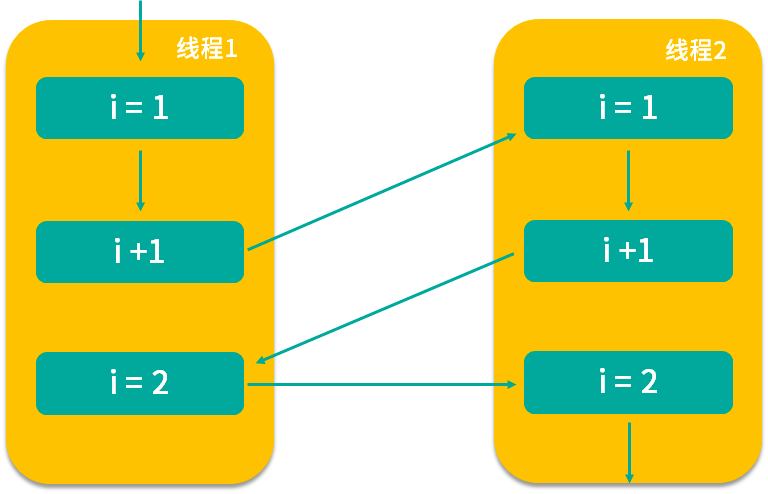

<!DOCTYPE html>
<!-- saved from url=(0046)https://kaiiiz.github.io/hexo-theme-book-demo/ -->
<html xmlns="http://www.w3.org/1999/xhtml">
<head>
    <head>
        <meta http-equiv="Content-Type" content="text/html; charset=UTF-8">
        <meta name="viewport" content="width=device-width, initial-scale=1, maximum-scale=1.0, user-scalable=no">
        <link rel="icon" href="../../static/favicon.png">
        <title>06 一共有哪 3 类线程安全问题？.md</title>
        <!-- Spectre.css framework -->
        <link rel="stylesheet" href="../../static/index.css">
        <!-- theme css & js -->
        <meta name="generator" content="Hexo 4.2.0">
    </head>

<body>

    

        

            <a href="../../index.html">
                
                技术文章摘抄
            </a>
        

        

            <ul class="uncollapsible">
                <li><a href="../../index.html" class="current-tab">首页</a></li>
            </ul>

            <ul class="uncollapsible">
                <li><a href="../index.html">上一级</a></li>
            </ul>

            <ul class="uncollapsible">
                <li>

                    
                    <a href="00&#32;由点及面，搭建你的&#32;Java&#32;并发知识网.md">00 由点及面，搭建你的 Java 并发知识网.md</a>

                </li>
                <li>

                    
                    <a href="01&#32;为何说只有&#32;1&#32;种实现线程的方法？.md">01 为何说只有 1 种实现线程的方法？.md</a>

                </li>
                <li>

                    
                    <a href="02&#32;如何正确停止线程？为什么&#32;volatile&#32;标记位的停止方法是错误的？.md">02 如何正确停止线程？为什么 volatile 标记位的停止方法是错误的？.md</a>

                </li>
                <li>

                    
                    <a href="03&#32;线程是如何在&#32;6&#32;种状态之间转换的？.md">03 线程是如何在 6 种状态之间转换的？.md</a>

                </li>
                <li>

                    
                    <a href="04&#32;waitnotifynotifyAll&#32;方法的使用注意事项？.md">04 waitnotifynotifyAll 方法的使用注意事项？.md</a>

                </li>
                <li>

                    
                    <a href="05&#32;有哪几种实现生产者消费者模式的方法？.md">05 有哪几种实现生产者消费者模式的方法？.md</a>

                </li>
                <li>

                    <a class="current-tab" href="06&#32;一共有哪&#32;3&#32;类线程安全问题？.md">06 一共有哪 3 类线程安全问题？.md</a>
                    

                </li>
                <li>

                    
                    <a href="07&#32;哪些场景需要额外注意线程安全问题？.md">07 哪些场景需要额外注意线程安全问题？.md</a>

                </li>
                <li>

                    
                    <a href="08&#32;为什么多线程会带来性能问题？.md">08 为什么多线程会带来性能问题？.md</a>

                </li>
                <li>

                    
                    <a href="09&#32;使用线程池比手动创建线程好在哪里？.md">09 使用线程池比手动创建线程好在哪里？.md</a>

                </li>
                <li>

                    
                    <a href="10&#32;线程池的各个参数的含义？.md">10 线程池的各个参数的含义？.md</a>

                </li>
                <li>

                    
                    <a href="11&#32;线程池有哪&#32;4&#32;种拒绝策略？.md">11 线程池有哪 4 种拒绝策略？.md</a>

                </li>
                <li>

                    
                    <a href="12&#32;有哪&#32;6&#32;种常见的线程池？什么是&#32;Java8&#32;的&#32;ForkJoinPool？.md">12 有哪 6 种常见的线程池？什么是 Java8 的 ForkJoinPool？.md</a>

                </li>
                <li>

                    
                    <a href="13&#32;线程池常用的阻塞队列有哪些？.md">13 线程池常用的阻塞队列有哪些？.md</a>

                </li>
                <li>

                    
                    <a href="14&#32;为什么不应该自动创建线程池？.md">14 为什么不应该自动创建线程池？.md</a>

                </li>
                <li>

                    
                    <a href="15&#32;合适的线程数量是多少？CPU&#32;核心数和线程数的关系？.md">15 合适的线程数量是多少？CPU 核心数和线程数的关系？.md</a>

                </li>
                <li>

                    
                    <a href="16&#32;如何根据实际需要，定制自己的线程池？.md">16 如何根据实际需要，定制自己的线程池？.md</a>

                </li>
                <li>

                    
                    <a href="17&#32;如何正确关闭线程池？shutdown&#32;和&#32;shutdownNow&#32;的区别？.md">17 如何正确关闭线程池？shutdown 和 shutdownNow 的区别？.md</a>

                </li>
                <li>

                    
                    <a href="18&#32;线程池实现“线程复用”的原理？.md">18 线程池实现“线程复用”的原理？.md</a>

                </li>
                <li>

                    
                    <a href="19&#32;你知道哪几种锁？分别有什么特点？.md">19 你知道哪几种锁？分别有什么特点？.md</a>

                </li>
                <li>

                    
                    <a href="20&#32;悲观锁和乐观锁的本质是什么？.md">20 悲观锁和乐观锁的本质是什么？.md</a>

                </li>
                <li>

                    
                    <a href="21&#32;如何看到&#32;synchronized&#32;背后的“monitor&#32;锁”？.md">21 如何看到 synchronized 背后的“monitor 锁”？.md</a>

                </li>
                <li>

                    
                    <a href="22&#32;synchronized&#32;和&#32;Lock&#32;孰优孰劣，如何选择？.md">22 synchronized 和 Lock 孰优孰劣，如何选择？.md</a>

                </li>
                <li>

                    
                    <a href="23&#32;Lock&#32;有哪几个常用方法？分别有什么用？.md">23 Lock 有哪几个常用方法？分别有什么用？.md</a>

                </li>
                <li>

                    
                    <a href="24&#32;讲一讲公平锁和非公平锁，为什么要“非公平”？.md">24 讲一讲公平锁和非公平锁，为什么要“非公平”？.md</a>

                </li>
                <li>

                    
                    <a href="25&#32;读写锁&#32;ReadWriteLock&#32;获取锁有哪些规则？.md">25 读写锁 ReadWriteLock 获取锁有哪些规则？.md</a>

                </li>
                <li>

                    
                    <a href="26&#32;读锁应该插队吗？什么是读写锁的升降级？.md">26 读锁应该插队吗？什么是读写锁的升降级？.md</a>

                </li>
                <li>

                    
                    <a href="27&#32;什么是自旋锁？自旋的好处和后果是什么呢？.md">27 什么是自旋锁？自旋的好处和后果是什么呢？.md</a>

                </li>
                <li>

                    
                    <a href="28&#32;JVM&#32;对锁进行了哪些优化？.md">28 JVM 对锁进行了哪些优化？.md</a>

                </li>
                <li>

                    
                    <a href="29&#32;HashMap&#32;为什么是线程不安全的？.md">29 HashMap 为什么是线程不安全的？.md</a>

                </li>
                <li>

                    
                    <a href="30&#32;ConcurrentHashMap&#32;在&#32;Java7&#32;和&#32;8&#32;有何不同？.md">30 ConcurrentHashMap 在 Java7 和 8 有何不同？.md</a>

                </li>
                <li>

                    
                    <a href="31&#32;为什么&#32;Map&#32;桶中超过&#32;8&#32;个才转为红黑树？.md">31 为什么 Map 桶中超过 8 个才转为红黑树？.md</a>

                </li>
                <li>

                    
                    <a href="32&#32;同样是线程安全，ConcurrentHashMap&#32;和&#32;Hashtable&#32;的区别.md">32 同样是线程安全，ConcurrentHashMap 和 Hashtable 的区别.md</a>

                </li>
                <li>

                    
                    <a href="33&#32;CopyOnWriteArrayList&#32;有什么特点？.md">33 CopyOnWriteArrayList 有什么特点？.md</a>

                </li>
                <li>

                    
                    <a href="34&#32;什么是阻塞队列？.md">34 什么是阻塞队列？.md</a>

                </li>
                <li>

                    
                    <a href="35&#32;阻塞队列包含哪些常用的方法？add、offer、put&#32;等方法的区别？.md">35 阻塞队列包含哪些常用的方法？add、offer、put 等方法的区别？.md</a>

                </li>
                <li>

                    
                    <a href="36&#32;有哪几种常见的阻塞队列？.md">36 有哪几种常见的阻塞队列？.md</a>

                </li>
                <li>

                    
                    <a href="37&#32;阻塞和非阻塞队列的并发安全原理是什么？.md">37 阻塞和非阻塞队列的并发安全原理是什么？.md</a>

                </li>
                <li>

                    
                    <a href="38&#32;如何选择适合自己的阻塞队列？.md">38 如何选择适合自己的阻塞队列？.md</a>

                </li>
                <li>

                    
                    <a href="39&#32;原子类是如何利用&#32;CAS&#32;保证线程安全的？.md">39 原子类是如何利用 CAS 保证线程安全的？.md</a>

                </li>
                <li>

                    
                    <a href="40&#32;AtomicInteger&#32;在高并发下性能不好，如何解决？为什么？.md">40 AtomicInteger 在高并发下性能不好，如何解决？为什么？.md</a>

                </li>
                <li>

                    
                    <a href="41&#32;原子类和&#32;volatile&#32;有什么异同？.md">41 原子类和 volatile 有什么异同？.md</a>

                </li>
                <li>

                    
                    <a href="42&#32;AtomicInteger&#32;和&#32;synchronized&#32;的异同点？.md">42 AtomicInteger 和 synchronized 的异同点？.md</a>

                </li>
                <li>

                    
                    <a href="43&#32;Java&#32;8&#32;中&#32;Adder&#32;和&#32;Accumulator&#32;有什么区别？.md">43 Java 8 中 Adder 和 Accumulator 有什么区别？.md</a>

                </li>
                <li>

                    
                    <a href="44&#32;ThreadLocal&#32;适合用在哪些实际生产的场景中？.md">44 ThreadLocal 适合用在哪些实际生产的场景中？.md</a>

                </li>
                <li>

                    
                    <a href="45&#32;ThreadLocal&#32;是用来解决共享资源的多线程访问的问题吗？.md">45 ThreadLocal 是用来解决共享资源的多线程访问的问题吗？.md</a>

                </li>
                <li>

                    
                    <a href="46&#32;多个&#32;ThreadLocal&#32;在&#32;Thread&#32;中的&#32;threadlocals&#32;里是怎么存储的？.md">46 多个 ThreadLocal 在 Thread 中的 threadlocals 里是怎么存储的？.md</a>

                </li>
                <li>

                    
                    <a href="47&#32;内存泄漏——为何每次用完&#32;ThreadLocal&#32;都要调用&#32;remove()？.md">47 内存泄漏——为何每次用完 ThreadLocal 都要调用 remove()？.md</a>

                </li>
                <li>

                    
                    <a href="48&#32;Callable&#32;和&#32;Runnable&#32;的不同？.md">48 Callable 和 Runnable 的不同？.md</a>

                </li>
                <li>

                    
                    <a href="49&#32;Future&#32;的主要功能是什么？.md">49 Future 的主要功能是什么？.md</a>

                </li>
                <li>

                    
                    <a href="50&#32;使用&#32;Future&#32;有哪些注意点？Future&#32;产生新的线程了吗？.md">50 使用 Future 有哪些注意点？Future 产生新的线程了吗？.md</a>

                </li>
                <li>

                    
                    <a href="51&#32;如何利用&#32;CompletableFuture&#32;实现“旅游平台”问题？.md">51 如何利用 CompletableFuture 实现“旅游平台”问题？.md</a>

                </li>
                <li>

                    
                    <a href="52&#32;信号量能被&#32;FixedThreadPool&#32;替代吗？.md">52 信号量能被 FixedThreadPool 替代吗？.md</a>

                </li>
                <li>

                    
                    <a href="53&#32;CountDownLatch&#32;是如何安排线程执行顺序的？.md">53 CountDownLatch 是如何安排线程执行顺序的？.md</a>

                </li>
                <li>

                    
                    <a href="54&#32;CyclicBarrier&#32;和&#32;CountdownLatch&#32;有什么异同？.md">54 CyclicBarrier 和 CountdownLatch 有什么异同？.md</a>

                </li>
                <li>

                    
                    <a href="55&#32;Condition、object.wait()&#32;和&#32;notify()&#32;的关系？.md">55 Condition、object.wait() 和 notify() 的关系？.md</a>

                </li>
                <li>

                    
                    <a href="56&#32;讲一讲什么是&#32;Java&#32;内存模型？.md">56 讲一讲什么是 Java 内存模型？.md</a>

                </li>
                <li>

                    
                    <a href="57&#32;什么是指令重排序？为什么要重排序？.md">57 什么是指令重排序？为什么要重排序？.md</a>

                </li>
                <li>

                    
                    <a href="58&#32;Java&#32;中的原子操作有哪些注意事项？.md">58 Java 中的原子操作有哪些注意事项？.md</a>

                </li>
                <li>

                    
                    <a href="59&#32;什么是“内存可见性”问题？.md">59 什么是“内存可见性”问题？.md</a>

                </li>
                <li>

                    
                    <a href="60&#32;主内存和工作内存的关系？.md">60 主内存和工作内存的关系？.md</a>

                </li>
                <li>

                    
                    <a href="61&#32;什么是&#32;happens-before&#32;规则？.md">61 什么是 happens-before 规则？.md</a>

                </li>
                <li>

                    
                    <a href="62&#32;volatile&#32;的作用是什么？与&#32;synchronized&#32;有什么异同？.md">62 volatile 的作用是什么？与 synchronized 有什么异同？.md</a>

                </li>
                <li>

                    
                    <a href="63&#32;单例模式的双重检查锁模式为什么必须加&#32;volatile？.md">63 单例模式的双重检查锁模式为什么必须加 volatile？.md</a>

                </li>
                <li>

                    
                    <a href="64&#32;你知道什么是&#32;CAS&#32;吗？.md">64 你知道什么是 CAS 吗？.md</a>

                </li>
                <li>

                    
                    <a href="65&#32;CAS&#32;和乐观锁的关系，什么时候会用到&#32;CAS？.md">65 CAS 和乐观锁的关系，什么时候会用到 CAS？.md</a>

                </li>
                <li>

                    
                    <a href="66&#32;CAS&#32;有什么缺点？.md">66 CAS 有什么缺点？.md</a>

                </li>
                <li>

                    
                    <a href="67&#32;如何写一个必然死锁的例子？.md">67 如何写一个必然死锁的例子？.md</a>

                </li>
                <li>

                    
                    <a href="68&#32;发生死锁必须满足哪&#32;4&#32;个条件？.md">68 发生死锁必须满足哪 4 个条件？.md</a>

                </li>
                <li>

                    
                    <a href="69&#32;如何用命令行和代码定位死锁？.md">69 如何用命令行和代码定位死锁？.md</a>

                </li>
                <li>

                    
                    <a href="70&#32;有哪些解决死锁问题的策略？.md">70 有哪些解决死锁问题的策略？.md</a>

                </li>
                <li>

                    
                    <a href="71&#32;讲一讲经典的哲学家就餐问题.md">71 讲一讲经典的哲学家就餐问题.md</a>

                </li>
                <li>

                    
                    <a href="72&#32;final&#32;的三种用法是什么？.md">72 final 的三种用法是什么？.md</a>

                </li>
                <li>

                    
                    <a href="73&#32;为什么加了&#32;final&#32;却依然无法拥有“不变性”？.md">73 为什么加了 final 却依然无法拥有“不变性”？.md</a>

                </li>
                <li>

                    
                    <a href="74&#32;为什么&#32;String&#32;被设计为是不可变的？.md">74 为什么 String 被设计为是不可变的？.md</a>

                </li>
                <li>

                    
                    <a href="75&#32;为什么需要&#32;AQS？AQS&#32;的作用和重要性是什么？.md">75 为什么需要 AQS？AQS 的作用和重要性是什么？.md</a>

                </li>
                <li>

                    
                    <a href="76&#32;AQS&#32;的内部原理是什么样的？.md">76 AQS 的内部原理是什么样的？.md</a>

                </li>
                <li>

                    
                    <a href="77&#32;AQS&#32;在&#32;CountDownLatch&#32;等类中的应用原理是什么？.md">77 AQS 在 CountDownLatch 等类中的应用原理是什么？.md</a>

                </li>
                <li>

                    
                    <a href="78&#32;一份独家的&#32;Java&#32;并发工具图谱.md">78 一份独家的 Java 并发工具图谱.md</a>

                </li>
            </ul>

        

    

    

        

    

    

    

        

            

                

                    <!-- For Responsive Layout -->
                    <header class="navbar">
                        <section class="navbar-section">
                            <a onclick="open_sidebar()">
                                <i class="icon icon-menu"></i>
                            </a>
                        </section>
                    </header>
                

                

                    

                        

                        
<h1>06 一共有哪 3 类线程安全问题？</h1>

本课时我们学习 3 类线程安全问题。

<h3>什么是线程安全</h3>

要想弄清楚有哪 3 类线程安全问题，首先需要了解什么是线程安全，线程安全经常在工作中被提到，比如：你的对象不是线程安全的，你的线程发生了安全错误，虽然线程安全经常被提到，但我们可能对线程安全并没有一个明确的定义。

《Java Concurrency In Practice》的作者 Brian Goetz 对线程安全是这样理解的，当多个线程访问一个对象时，如果不用考虑这些线程在运行时环境下的调度和交替执行问题，也不需要进行额外的同步，而调用这个对象的行为都可以获得正确的结果，那这个对象便是线程安全的。

事实上，Brian Goetz 想表达的意思是，如果某个对象是线程安全的，那么对于使用者而言，在使用时就不需要考虑方法间的协调问题，比如不需要考虑不能同时写入或读写不能并行的问题，也不需要考虑任何额外的同步问题，比如不需要额外自己加 synchronized 锁，那么它才是线程安全的，可以看出对线程安全的定义还是非常苛刻的。

而我们在实际开发中经常会遇到线程不安全的情况，那么一共有哪 3 种典型的线程安全问题呢？

<ol>
<li>运行结果错误；</li>
<li>发布和初始化导致线程安全问题；</li>
<li>活跃性问题。</li>
</ol>
<h3>运行结果错误</h3>

首先，来看多线程同时操作一个变量导致的运行结果错误。

<pre><code class="language-java">public class WrongResult {

   volatile static int i;

   public static void main(String[] args) throws InterruptedException {

       Runnable r = new Runnable() {

           @Override

           public void run() {

               for (int j = 0; j &lt; 10000; j++) {

                   i++;

               }

           }

       };

       Thread thread1 = new Thread(r);

       thread1.start();

       Thread thread2 = new Thread(r);

       thread2.start();

       thread1.join();

       thread2.join();

       System.out.println(i);

    }

}
</code></pre>

如代码所示，首先定义了一个 int 类型的静态变量 i，然后启动两个线程，分别对变量 i 进行 10000 次 i++ 操作。理论上得到的结果应该是 20000，但实际结果却远小于理论结果，比如可能是12996，也可能是13323，每次的结果都还不一样，这是为什么呢？

是因为在多线程下，CPU 的调度是以时间片为单位进行分配的，每个线程都可以得到一定量的时间片。但如果线程拥有的时间片耗尽，它将会被暂停执行并让出 CPU 资源给其他线程，这样就有可能发生线程安全问题。比如 i++ 操作，表面上看只是一行代码，但实际上它并不是一个原子操作，它的执行步骤主要分为三步，而且在每步操作之间都有可能被打断。

<ul>
<li>第一个步骤是读取；</li>
<li>第二个步骤是增加；</li>
<li>第三个步骤是保存。</li>
</ul>

那么我们接下来看如何发生的线程不安全问题。

我们根据箭头指向依次看，线程 1 首先拿到 i=1 的结果，然后进行 i+1 操作，但此时 i+1 的结果并没有保存下来，线程 1 就被切换走了，于是 CPU 开始执行线程 2，它所做的事情和线程 1 是一样的 i++ 操作，但此时我们想一下，它拿到的 i 是多少？实际上和线程 1 拿到的 i 的结果一样都是 1，为什么呢？因为线程 1 虽然对 i 进行了 +1 操作，但结果没有保存，所以线程 2 看不到修改后的结果。

然后假设等线程 2 对 i 进行 +1 操作后，又切换到线程 1，让线程 1 完成未完成的操作，即将 i+1 的结果 2 保存下来，然后又切换到线程 2 完成 i=2 的保存操作，虽然两个线程都执行了对 i 进行 +1 的操作，但结果却最终保存了 i=2 的结果，而不是我们期望的 i=3，这样就发生了线程安全问题，导致了数据结果错误，这也是最典型的线程安全问题。

<h3>发布和初始化导致线程安全问题</h3>

第二种是对象发布和初始化时导致的线程安全问题，我们创建对象并进行发布和初始化供其他类或对象使用是常见的操作，但如果我们操作的时间或地点不对，就可能导致线程安全问题。如代码所示。

<pre><code class="language-java">public class WrongInit {

    private Map&lt;Integer, String&gt; students;

    public WrongInit() {

        new Thread(new Runnable() {

            @Override

            public void run() {

                students = new HashMap&lt;&gt;();

                students.put(1, &quot;王小美&quot;);

                students.put(2, &quot;钱二宝&quot;);

                students.put(3, &quot;周三&quot;);

                students.put(4, &quot;赵四&quot;);

            }

        }).start();

     }

    public Map&lt;Integer, String&gt; getStudents() {

        return students;

    }

    public static void main(String[] args) throws InterruptedException {

        WrongInit multiThreadsError6 = new WrongInit();

        System.out.println(multiThreadsError6.getStudents().get(1));

    }

}
</code></pre>

在类中，定义一个类型为 Map 的成员变量 students，Integer 是学号，String 是姓名。然后在构造函数中启动一个新线程，并在线程中为 students 赋值。

<ul>
<li>学号：1，姓名：王小美；</li>
<li>学号：2，姓名：钱二宝；</li>
<li>学号：3，姓名：周三；</li>
<li>学号：4，姓名：赵四。</li>
</ul>

只有当线程运行完 run() 方法中的全部赋值操作后，4 名同学的全部信息才算是初始化完毕，可是我们看在主函数 mian() 中，初始化 WrongInit 类之后并没有进行任何休息就直接打印 1 号同学的信息，试想这个时候程序会出现什么情况？实际上会发生空指针异常。

<pre><code class="language-java">Exception in thread &quot;main&quot; java.lang.NullPointerException

at lesson6.WrongInit.main(WrongInit.java:32)
</code></pre>

这又是为什么呢？因为 students 这个成员变量是在构造函数中新建的线程中进行的初始化和赋值操作，而线程的启动需要一定的时间，但是我们的 main 函数并没有进行等待就直接获取数据，导致 getStudents 获取的结果为 null，这就是在错误的时间或地点发布或初始化造成的线程安全问题。

<h3>活跃性问题</h3>

第三种线程安全问题统称为活跃性问题，最典型的有三种，分别为死锁、活锁和饥饿。

什么是活跃性问题呢，活跃性问题就是程序始终得不到运行的最终结果，相比于前面两种线程安全问题带来的数据错误或报错，活跃性问题带来的后果可能更严重，比如发生死锁会导致程序完全卡死，无法向下运行。

<h4>死锁</h4>

最常见的活跃性问题是死锁，死锁是指两个线程之间相互等待对方资源，但同时又互不相让，都想自己先执行，如代码所示。

<pre><code class="language-java"> public class MayDeadLock {

    Object o1 = new Object();

    Object o2 = new Object();

    public void thread1() throws InterruptedException {

        synchronized (o1) {

            Thread.sleep(500);

            synchronized (o2) {

                System.out.println(&quot;线程1成功拿到两把锁&quot;);

           }

        }

    }

    public void thread2() throws InterruptedException {

        synchronized (o2) {

            Thread.sleep(500);

            synchronized (o1) {

                System.out.println(&quot;线程2成功拿到两把锁&quot;);

            }

        }

    }

    public static void main(String[] args) {

        MayDeadLock mayDeadLock = new MayDeadLock();

        new Thread(new Runnable() {

            @Override

            public void run() {

                try {

                    mayDeadLock.thread1();

                } catch (InterruptedException e) {

                    e.printStackTrace();

                }

            }

        }).start();

        new Thread(new Runnable() {

            @Override

            public void run() {

                try {

                    mayDeadLock.thread2();

                } catch (InterruptedException e) {

                    e.printStackTrace();

                }

            }

        }).start();

    }

}
</code></pre>

首先，代码中创建了两个 Object 作为 synchronized 锁的对象，线程 1 先获取 o1 锁，sleep(500) 之后，获取 o2 锁；线程 2 与线程 1 执行顺序相反，先获取 o2 锁，sleep(500) 之后，获取 o1 锁。  假设两个线程几乎同时进入休息，休息完后，线程 1 想获取 o2 锁，线程 2 想获取 o1 锁，这时便发生了死锁，两个线程不主动调和，也不主动退出，就这样死死地等待对方先释放资源，导致程序得不到任何结果也不能停止运行。

<h4>活锁</h4>

第二种活跃性问题是活锁，活锁与死锁非常相似，也是程序一直等不到结果，但对比于死锁，活锁是活的，什么意思呢？因为正在运行的线程并没有阻塞，它始终在运行中，却一直得不到结果。

举一个例子，假设有一个消息队列，队列里放着各种各样需要被处理的消息，而某个消息由于自身被写错了导致不能被正确处理，执行时会报错，可是队列的重试机制会重新把它放在队列头进行优先重试处理，但这个消息本身无论被执行多少次，都无法被正确处理，每次报错后又会被放到队列头进行重试，周而复始，最终导致线程一直处于忙碌状态，但程序始终得不到结果，便发生了活锁问题。

<h4>饥饿</h4>

第三个典型的活跃性问题是饥饿，饥饿是指线程需要某些资源时始终得不到，尤其是CPU 资源，就会导致线程一直不能运行而产生的问题。在 Java 中有线程优先级的概念，Java 中优先级分为 1 到 10，1 最低，10 最高。如果我们把某个线程的优先级设置为 1，这是最低的优先级，在这种情况下，这个线程就有可能始终分配不到 CPU 资源，而导致长时间无法运行。或者是某个线程始终持有某个文件的锁，而其他线程想要修改文件就必须先获取锁，这样想要修改文件的线程就会陷入饥饿，长时间不能运行。

好了，今天的内容就全部讲完了，通过本课时的学习我们知道了线程安全问题主要有 3 种，i++ 等情况导致的运行结果错误，通常是因为并发读写导致的，第二种是对象没有在正确的时间、地点被发布或初始化，而第三种线程安全问题就是活跃性问题，包括死锁、活锁和饥饿。

                    

                    

                        

                            <a href="05&#32;有哪几种实现生产者消费者模式的方法？.md">上一页</a>
                        

                        

                            <a href="07&#32;哪些场景需要额外注意线程安全问题？.md">下一页</a>
                        

                    

                

            

        

    

    

</body>
<!-- Global site tag (gtag.js) - Google Analytics -->

</html>
