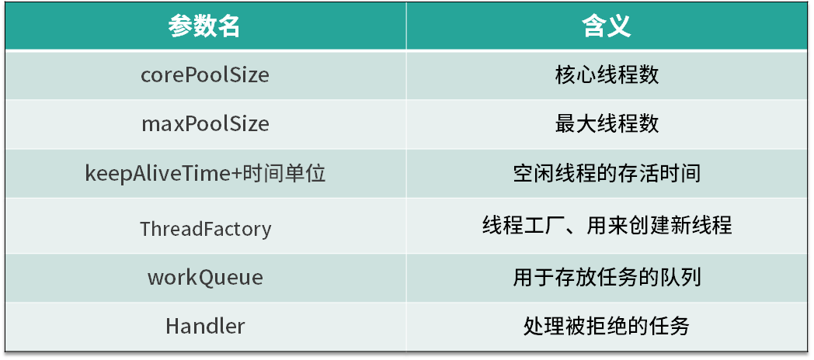

<!DOCTYPE html>
<!-- saved from url=(0046)https://kaiiiz.github.io/hexo-theme-book-demo/ -->
<html xmlns="http://www.w3.org/1999/xhtml">
<head>
    <head>
        <meta http-equiv="Content-Type" content="text/html; charset=UTF-8">
        <meta name="viewport" content="width=device-width, initial-scale=1, maximum-scale=1.0, user-scalable=no">
        <link rel="icon" href="../../static/favicon.png">
        <title>10 线程池的各个参数的含义？.md</title>
        <!-- Spectre.css framework -->
        <link rel="stylesheet" href="../../static/index.css">
        <!-- theme css & js -->
        <meta name="generator" content="Hexo 4.2.0">
    </head>

<body>

    

        

            <a href="../../index.html">
                
                技术文章摘抄
            </a>
        

        

            <ul class="uncollapsible">
                <li><a href="../../index.html" class="current-tab">首页</a></li>
            </ul>

            <ul class="uncollapsible">
                <li><a href="../index.html">上一级</a></li>
            </ul>

            <ul class="uncollapsible">
                <li>

                    
                    <a href="00&#32;由点及面，搭建你的&#32;Java&#32;并发知识网.md">00 由点及面，搭建你的 Java 并发知识网.md</a>

                </li>
                <li>

                    
                    <a href="01&#32;为何说只有&#32;1&#32;种实现线程的方法？.md">01 为何说只有 1 种实现线程的方法？.md</a>

                </li>
                <li>

                    
                    <a href="02&#32;如何正确停止线程？为什么&#32;volatile&#32;标记位的停止方法是错误的？.md">02 如何正确停止线程？为什么 volatile 标记位的停止方法是错误的？.md</a>

                </li>
                <li>

                    
                    <a href="03&#32;线程是如何在&#32;6&#32;种状态之间转换的？.md">03 线程是如何在 6 种状态之间转换的？.md</a>

                </li>
                <li>

                    
                    <a href="04&#32;waitnotifynotifyAll&#32;方法的使用注意事项？.md">04 waitnotifynotifyAll 方法的使用注意事项？.md</a>

                </li>
                <li>

                    
                    <a href="05&#32;有哪几种实现生产者消费者模式的方法？.md">05 有哪几种实现生产者消费者模式的方法？.md</a>

                </li>
                <li>

                    
                    <a href="06&#32;一共有哪&#32;3&#32;类线程安全问题？.md">06 一共有哪 3 类线程安全问题？.md</a>

                </li>
                <li>

                    
                    <a href="07&#32;哪些场景需要额外注意线程安全问题？.md">07 哪些场景需要额外注意线程安全问题？.md</a>

                </li>
                <li>

                    
                    <a href="08&#32;为什么多线程会带来性能问题？.md">08 为什么多线程会带来性能问题？.md</a>

                </li>
                <li>

                    
                    <a href="09&#32;使用线程池比手动创建线程好在哪里？.md">09 使用线程池比手动创建线程好在哪里？.md</a>

                </li>
                <li>

                    <a class="current-tab" href="10&#32;线程池的各个参数的含义？.md">10 线程池的各个参数的含义？.md</a>
                    

                </li>
                <li>

                    
                    <a href="11&#32;线程池有哪&#32;4&#32;种拒绝策略？.md">11 线程池有哪 4 种拒绝策略？.md</a>

                </li>
                <li>

                    
                    <a href="12&#32;有哪&#32;6&#32;种常见的线程池？什么是&#32;Java8&#32;的&#32;ForkJoinPool？.md">12 有哪 6 种常见的线程池？什么是 Java8 的 ForkJoinPool？.md</a>

                </li>
                <li>

                    
                    <a href="13&#32;线程池常用的阻塞队列有哪些？.md">13 线程池常用的阻塞队列有哪些？.md</a>

                </li>
                <li>

                    
                    <a href="14&#32;为什么不应该自动创建线程池？.md">14 为什么不应该自动创建线程池？.md</a>

                </li>
                <li>

                    
                    <a href="15&#32;合适的线程数量是多少？CPU&#32;核心数和线程数的关系？.md">15 合适的线程数量是多少？CPU 核心数和线程数的关系？.md</a>

                </li>
                <li>

                    
                    <a href="16&#32;如何根据实际需要，定制自己的线程池？.md">16 如何根据实际需要，定制自己的线程池？.md</a>

                </li>
                <li>

                    
                    <a href="17&#32;如何正确关闭线程池？shutdown&#32;和&#32;shutdownNow&#32;的区别？.md">17 如何正确关闭线程池？shutdown 和 shutdownNow 的区别？.md</a>

                </li>
                <li>

                    
                    <a href="18&#32;线程池实现“线程复用”的原理？.md">18 线程池实现“线程复用”的原理？.md</a>

                </li>
                <li>

                    
                    <a href="19&#32;你知道哪几种锁？分别有什么特点？.md">19 你知道哪几种锁？分别有什么特点？.md</a>

                </li>
                <li>

                    
                    <a href="20&#32;悲观锁和乐观锁的本质是什么？.md">20 悲观锁和乐观锁的本质是什么？.md</a>

                </li>
                <li>

                    
                    <a href="21&#32;如何看到&#32;synchronized&#32;背后的“monitor&#32;锁”？.md">21 如何看到 synchronized 背后的“monitor 锁”？.md</a>

                </li>
                <li>

                    
                    <a href="22&#32;synchronized&#32;和&#32;Lock&#32;孰优孰劣，如何选择？.md">22 synchronized 和 Lock 孰优孰劣，如何选择？.md</a>

                </li>
                <li>

                    
                    <a href="23&#32;Lock&#32;有哪几个常用方法？分别有什么用？.md">23 Lock 有哪几个常用方法？分别有什么用？.md</a>

                </li>
                <li>

                    
                    <a href="24&#32;讲一讲公平锁和非公平锁，为什么要“非公平”？.md">24 讲一讲公平锁和非公平锁，为什么要“非公平”？.md</a>

                </li>
                <li>

                    
                    <a href="25&#32;读写锁&#32;ReadWriteLock&#32;获取锁有哪些规则？.md">25 读写锁 ReadWriteLock 获取锁有哪些规则？.md</a>

                </li>
                <li>

                    
                    <a href="26&#32;读锁应该插队吗？什么是读写锁的升降级？.md">26 读锁应该插队吗？什么是读写锁的升降级？.md</a>

                </li>
                <li>

                    
                    <a href="27&#32;什么是自旋锁？自旋的好处和后果是什么呢？.md">27 什么是自旋锁？自旋的好处和后果是什么呢？.md</a>

                </li>
                <li>

                    
                    <a href="28&#32;JVM&#32;对锁进行了哪些优化？.md">28 JVM 对锁进行了哪些优化？.md</a>

                </li>
                <li>

                    
                    <a href="29&#32;HashMap&#32;为什么是线程不安全的？.md">29 HashMap 为什么是线程不安全的？.md</a>

                </li>
                <li>

                    
                    <a href="30&#32;ConcurrentHashMap&#32;在&#32;Java7&#32;和&#32;8&#32;有何不同？.md">30 ConcurrentHashMap 在 Java7 和 8 有何不同？.md</a>

                </li>
                <li>

                    
                    <a href="31&#32;为什么&#32;Map&#32;桶中超过&#32;8&#32;个才转为红黑树？.md">31 为什么 Map 桶中超过 8 个才转为红黑树？.md</a>

                </li>
                <li>

                    
                    <a href="32&#32;同样是线程安全，ConcurrentHashMap&#32;和&#32;Hashtable&#32;的区别.md">32 同样是线程安全，ConcurrentHashMap 和 Hashtable 的区别.md</a>

                </li>
                <li>

                    
                    <a href="33&#32;CopyOnWriteArrayList&#32;有什么特点？.md">33 CopyOnWriteArrayList 有什么特点？.md</a>

                </li>
                <li>

                    
                    <a href="34&#32;什么是阻塞队列？.md">34 什么是阻塞队列？.md</a>

                </li>
                <li>

                    
                    <a href="35&#32;阻塞队列包含哪些常用的方法？add、offer、put&#32;等方法的区别？.md">35 阻塞队列包含哪些常用的方法？add、offer、put 等方法的区别？.md</a>

                </li>
                <li>

                    
                    <a href="36&#32;有哪几种常见的阻塞队列？.md">36 有哪几种常见的阻塞队列？.md</a>

                </li>
                <li>

                    
                    <a href="37&#32;阻塞和非阻塞队列的并发安全原理是什么？.md">37 阻塞和非阻塞队列的并发安全原理是什么？.md</a>

                </li>
                <li>

                    
                    <a href="38&#32;如何选择适合自己的阻塞队列？.md">38 如何选择适合自己的阻塞队列？.md</a>

                </li>
                <li>

                    
                    <a href="39&#32;原子类是如何利用&#32;CAS&#32;保证线程安全的？.md">39 原子类是如何利用 CAS 保证线程安全的？.md</a>

                </li>
                <li>

                    
                    <a href="40&#32;AtomicInteger&#32;在高并发下性能不好，如何解决？为什么？.md">40 AtomicInteger 在高并发下性能不好，如何解决？为什么？.md</a>

                </li>
                <li>

                    
                    <a href="41&#32;原子类和&#32;volatile&#32;有什么异同？.md">41 原子类和 volatile 有什么异同？.md</a>

                </li>
                <li>

                    
                    <a href="42&#32;AtomicInteger&#32;和&#32;synchronized&#32;的异同点？.md">42 AtomicInteger 和 synchronized 的异同点？.md</a>

                </li>
                <li>

                    
                    <a href="43&#32;Java&#32;8&#32;中&#32;Adder&#32;和&#32;Accumulator&#32;有什么区别？.md">43 Java 8 中 Adder 和 Accumulator 有什么区别？.md</a>

                </li>
                <li>

                    
                    <a href="44&#32;ThreadLocal&#32;适合用在哪些实际生产的场景中？.md">44 ThreadLocal 适合用在哪些实际生产的场景中？.md</a>

                </li>
                <li>

                    
                    <a href="45&#32;ThreadLocal&#32;是用来解决共享资源的多线程访问的问题吗？.md">45 ThreadLocal 是用来解决共享资源的多线程访问的问题吗？.md</a>

                </li>
                <li>

                    
                    <a href="46&#32;多个&#32;ThreadLocal&#32;在&#32;Thread&#32;中的&#32;threadlocals&#32;里是怎么存储的？.md">46 多个 ThreadLocal 在 Thread 中的 threadlocals 里是怎么存储的？.md</a>

                </li>
                <li>

                    
                    <a href="47&#32;内存泄漏——为何每次用完&#32;ThreadLocal&#32;都要调用&#32;remove()？.md">47 内存泄漏——为何每次用完 ThreadLocal 都要调用 remove()？.md</a>

                </li>
                <li>

                    
                    <a href="48&#32;Callable&#32;和&#32;Runnable&#32;的不同？.md">48 Callable 和 Runnable 的不同？.md</a>

                </li>
                <li>

                    
                    <a href="49&#32;Future&#32;的主要功能是什么？.md">49 Future 的主要功能是什么？.md</a>

                </li>
                <li>

                    
                    <a href="50&#32;使用&#32;Future&#32;有哪些注意点？Future&#32;产生新的线程了吗？.md">50 使用 Future 有哪些注意点？Future 产生新的线程了吗？.md</a>

                </li>
                <li>

                    
                    <a href="51&#32;如何利用&#32;CompletableFuture&#32;实现“旅游平台”问题？.md">51 如何利用 CompletableFuture 实现“旅游平台”问题？.md</a>

                </li>
                <li>

                    
                    <a href="52&#32;信号量能被&#32;FixedThreadPool&#32;替代吗？.md">52 信号量能被 FixedThreadPool 替代吗？.md</a>

                </li>
                <li>

                    
                    <a href="53&#32;CountDownLatch&#32;是如何安排线程执行顺序的？.md">53 CountDownLatch 是如何安排线程执行顺序的？.md</a>

                </li>
                <li>

                    
                    <a href="54&#32;CyclicBarrier&#32;和&#32;CountdownLatch&#32;有什么异同？.md">54 CyclicBarrier 和 CountdownLatch 有什么异同？.md</a>

                </li>
                <li>

                    
                    <a href="55&#32;Condition、object.wait()&#32;和&#32;notify()&#32;的关系？.md">55 Condition、object.wait() 和 notify() 的关系？.md</a>

                </li>
                <li>

                    
                    <a href="56&#32;讲一讲什么是&#32;Java&#32;内存模型？.md">56 讲一讲什么是 Java 内存模型？.md</a>

                </li>
                <li>

                    
                    <a href="57&#32;什么是指令重排序？为什么要重排序？.md">57 什么是指令重排序？为什么要重排序？.md</a>

                </li>
                <li>

                    
                    <a href="58&#32;Java&#32;中的原子操作有哪些注意事项？.md">58 Java 中的原子操作有哪些注意事项？.md</a>

                </li>
                <li>

                    
                    <a href="59&#32;什么是“内存可见性”问题？.md">59 什么是“内存可见性”问题？.md</a>

                </li>
                <li>

                    
                    <a href="60&#32;主内存和工作内存的关系？.md">60 主内存和工作内存的关系？.md</a>

                </li>
                <li>

                    
                    <a href="61&#32;什么是&#32;happens-before&#32;规则？.md">61 什么是 happens-before 规则？.md</a>

                </li>
                <li>

                    
                    <a href="62&#32;volatile&#32;的作用是什么？与&#32;synchronized&#32;有什么异同？.md">62 volatile 的作用是什么？与 synchronized 有什么异同？.md</a>

                </li>
                <li>

                    
                    <a href="63&#32;单例模式的双重检查锁模式为什么必须加&#32;volatile？.md">63 单例模式的双重检查锁模式为什么必须加 volatile？.md</a>

                </li>
                <li>

                    
                    <a href="64&#32;你知道什么是&#32;CAS&#32;吗？.md">64 你知道什么是 CAS 吗？.md</a>

                </li>
                <li>

                    
                    <a href="65&#32;CAS&#32;和乐观锁的关系，什么时候会用到&#32;CAS？.md">65 CAS 和乐观锁的关系，什么时候会用到 CAS？.md</a>

                </li>
                <li>

                    
                    <a href="66&#32;CAS&#32;有什么缺点？.md">66 CAS 有什么缺点？.md</a>

                </li>
                <li>

                    
                    <a href="67&#32;如何写一个必然死锁的例子？.md">67 如何写一个必然死锁的例子？.md</a>

                </li>
                <li>

                    
                    <a href="68&#32;发生死锁必须满足哪&#32;4&#32;个条件？.md">68 发生死锁必须满足哪 4 个条件？.md</a>

                </li>
                <li>

                    
                    <a href="69&#32;如何用命令行和代码定位死锁？.md">69 如何用命令行和代码定位死锁？.md</a>

                </li>
                <li>

                    
                    <a href="70&#32;有哪些解决死锁问题的策略？.md">70 有哪些解决死锁问题的策略？.md</a>

                </li>
                <li>

                    
                    <a href="71&#32;讲一讲经典的哲学家就餐问题.md">71 讲一讲经典的哲学家就餐问题.md</a>

                </li>
                <li>

                    
                    <a href="72&#32;final&#32;的三种用法是什么？.md">72 final 的三种用法是什么？.md</a>

                </li>
                <li>

                    
                    <a href="73&#32;为什么加了&#32;final&#32;却依然无法拥有“不变性”？.md">73 为什么加了 final 却依然无法拥有“不变性”？.md</a>

                </li>
                <li>

                    
                    <a href="74&#32;为什么&#32;String&#32;被设计为是不可变的？.md">74 为什么 String 被设计为是不可变的？.md</a>

                </li>
                <li>

                    
                    <a href="75&#32;为什么需要&#32;AQS？AQS&#32;的作用和重要性是什么？.md">75 为什么需要 AQS？AQS 的作用和重要性是什么？.md</a>

                </li>
                <li>

                    
                    <a href="76&#32;AQS&#32;的内部原理是什么样的？.md">76 AQS 的内部原理是什么样的？.md</a>

                </li>
                <li>

                    
                    <a href="77&#32;AQS&#32;在&#32;CountDownLatch&#32;等类中的应用原理是什么？.md">77 AQS 在 CountDownLatch 等类中的应用原理是什么？.md</a>

                </li>
                <li>

                    
                    <a href="78&#32;一份独家的&#32;Java&#32;并发工具图谱.md">78 一份独家的 Java 并发工具图谱.md</a>

                </li>
            </ul>

        

    

    

        

    

    

    

        

            

                

                    <!-- For Responsive Layout -->
                    <header class="navbar">
                        <section class="navbar-section">
                            <a onclick="open_sidebar()">
                                <i class="icon icon-menu"></i>
                            </a>
                        </section>
                    </header>
                

                

                    

                        

                        
<h1>10 线程池的各个参数的含义？</h1>

本课时我们主要学习线程池各个参数的含义，并重点掌握线程池中线程是在什么时机被创建和销毁的。

<h2>线程池的参数</h2>

首先，我们来看下线程池中各个参数的含义，如表所示线程池主要有 6 个参数，其中第 3 个参数由 keepAliveTime + 时间单位组成。我们逐一看下它们各自的含义，corePoolSize 是核心线程数，也就是常驻线程池的线程数量，与它对应的是 maximumPoolSize，表示线程池最大线程数量，当我们的任务特别多而 corePoolSize 核心线程数无法满足需求的时候，就会向线程池中增加线程，以便应对任务突增的情况。

<h2>线程创建的时机</h2>

接下来，我们来具体看下这两个参数所代表的含义，以及线程池中创建线程的时机。如上图所示，当提交任务后，线程池首先会检查当前线程数，如果此时线程数小于核心线程数，比如最开始线程数量为 0，则新建线程并执行任务，随着任务的不断增加，线程数会逐渐增加并达到核心线程数，此时如果仍有任务被不断提交，就会被放入 workQueue 任务队列中，等待核心线程执行完当前任务后重新从 workQueue 中提取正在等待被执行的任务。

此时，假设我们的任务特别的多，已经达到了 workQueue 的容量上限，这时线程池就会启动后备力量，也就是 maximumPoolSize 最大线程数，线程池会在 corePoolSize 核心线程数的基础上继续创建线程来执行任务，假设任务被不断提交，线程池会持续创建线程直到线程数达到 maximumPoolSize 最大线程数，如果依然有任务被提交，这就超过了线程池的最大处理能力，这个时候线程池就会拒绝这些任务，我们可以看到实际上任务进来之后，线程池会逐一判断 corePoolSize、workQueue、maximumPoolSize，如果依然不能满足需求，则会拒绝任务。

<h2>corePoolSize 与 maximumPoolSize</h2>

通过上面的流程图，我们了解了 corePoolSize 和 maximumPoolSize 的具体含义，corePoolSize 指的是核心线程数，线程池初始化时线程数默认为 0，当有新的任务提交后，会创建新线程执行任务，如果不做特殊设置，此后线程数通常不会再小于 corePoolSize ，因为它们是核心线程，即便未来可能没有可执行的任务也不会被销毁。随着任务量的增加，在任务队列满了之后，线程池会进一步创建新线程，最多可以达到 maximumPoolSize 来应对任务多的场景，如果未来线程有空闲，大于 corePoolSize 的线程会被合理回收。所以正常情况下，线程池中的线程数量会处在 corePoolSize 与 maximumPoolSize 的闭区间内。

<h2>“长工”与“临时工”</h2>

我们可以把 corePoolSize 与 maximumPoolSize 比喻成长工与临时工，通常古代一个大户人家会有几个固定的长工，负责日常的工作，而大户人家起初肯定也是从零开始雇佣长工的。假如长工数量被老爷设定为 5 人，也就对应了 corePoolSize，不管这 5 个长工是忙碌还是空闲，都会一直在大户人家待着，可到了农忙或春节，长工的人手显然就不够用了，这时就需要雇佣更多的临时工，这些临时工就相当于在 corePoolSize 的基础上继续创建新线程，但临时工也是有上限的，也就对应了 maximumPoolSize，随着农忙或春节结束，老爷考虑到人工成本便会解约掉这些临时工，家里工人数量便会从 maximumPoolSize 降到 corePoolSize，所以老爷家的工人数量会一致保持在 corePoolSize 和 maximumPoolSize 的区间。

在这里我们用一个动画把整个线程池变化过程生动地描述出来，比如线程池的 corePoolSize 为 5，maximumPoolSize 为 10，任务队列容量为 100，随着任务被提交，我们的线程数量会从 0 慢慢增长到 5，然后就不再增长了，新的任务会被放入队列中，直到队列被塞满，然后在 corePoolSize 的基础上继续创建新线程来执行队列中的任务，线程会逐渐增加到 maximumPoolSize， 然后线程数不再增加，如果此时仍有任务被不断提交，线程池就会拒绝任务。随着队列中任务被执行完，被创建的 10 个线程现在无事可做了，这时线程池会根据 keepAliveTime 参数来销毁线程，已达到减少内存占用的目的。

通过对流程图的理解和动画演示，我们总结出线程池的几个特点。

<ul>
<li>线程池希望保持较少的线程数，并且只有在负载变得很大时才增加线程。</li>
<li>线程池只有在任务队列填满时才创建多于 corePoolSize 的线程，如果使用的是无界队列（例如 LinkedBlockingQueue），那么由于队列不会满，所以线程数不会超过 corePoolSize。</li>
<li>通过设置 corePoolSize 和 maximumPoolSize 为相同的值，就可以创建固定大小的线程池。</li>
<li>通过设置 maximumPoolSize 为很高的值，例如 Integer.MAX_VALUE，就可以允许线程池创建任意多的线程。</li>
</ul>
<h2>keepAliveTime+时间单位</h2>

第三个参数是 keepAliveTime + 时间单位，当线程池中线程数量多于核心线程数时，而此时又没有任务可做，线程池就会检测线程的 keepAliveTime，如果超过规定的时间，无事可做的线程就会被销毁，以便减少内存的占用和资源消耗。如果后期任务又多了起来，线程池也会根据规则重新创建线程，所以这是一个可伸缩的过程，比较灵活，我们也可以用 setKeepAliveTime 方法动态改变 keepAliveTime 的参数值。

<h2>ThreadFactory</h2>

第四个参数是 ThreadFactory，ThreadFactory 实际上是一个线程工厂，它的作用是生产线程以便执行任务。我们可以选择使用默认的线程工厂，创建的线程都会在同一个线程组，并拥有一样的优先级，且都不是守护线程，我们也可以选择自己定制线程工厂，以方便给线程自定义命名，不同的线程池内的线程通常会根据具体业务来定制不同的线程名。

<h2>workQueue 和 Handler</h2>

最后两个参数是 workQueue 和 Handler，它们分别对应阻塞队列和任务拒绝策略，在后面的课时会对它们进行详细展开讲解。

在本课时，介绍了线程池的各个参数的含义，以及如果有任务提交，线程池是如何应对的，新线程是在什么时机下被创建和销毁等内容，你有没有觉得线程池的设计很巧妙呢？

                    

                    

                        

                            <a href="09&#32;使用线程池比手动创建线程好在哪里？.md">上一页</a>
                        

                        

                            <a href="11&#32;线程池有哪&#32;4&#32;种拒绝策略？.md">下一页</a>
                        

                    

                

            

        

    

    

</body>
<!-- Global site tag (gtag.js) - Google Analytics -->

</html>
