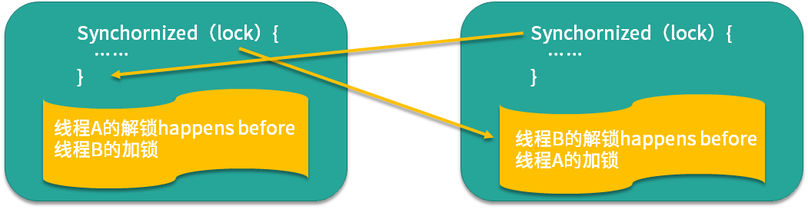

<!DOCTYPE html>
<!-- saved from url=(0046)https://kaiiiz.github.io/hexo-theme-book-demo/ -->
<html xmlns="http://www.w3.org/1999/xhtml">
<head>
    <head>
        <meta http-equiv="Content-Type" content="text/html; charset=UTF-8">
        <meta name="viewport" content="width=device-width, initial-scale=1, maximum-scale=1.0, user-scalable=no">
        <link rel="icon" href="../../static/favicon.png">
        <title>22 synchronized 和 Lock 孰优孰劣，如何选择？.md</title>
        <!-- Spectre.css framework -->
        <link rel="stylesheet" href="../../static/index.css">
        <!-- theme css & js -->
        <meta name="generator" content="Hexo 4.2.0">
    </head>

<body>

    

        

            <a href="../../index.html">
                
                技术文章摘抄
            </a>
        

        

            <ul class="uncollapsible">
                <li><a href="../../index.html" class="current-tab">首页</a></li>
            </ul>

            <ul class="uncollapsible">
                <li><a href="../index.html">上一级</a></li>
            </ul>

            <ul class="uncollapsible">
                <li>

                    
                    <a href="00&#32;由点及面，搭建你的&#32;Java&#32;并发知识网.md">00 由点及面，搭建你的 Java 并发知识网.md</a>

                </li>
                <li>

                    
                    <a href="01&#32;为何说只有&#32;1&#32;种实现线程的方法？.md">01 为何说只有 1 种实现线程的方法？.md</a>

                </li>
                <li>

                    
                    <a href="02&#32;如何正确停止线程？为什么&#32;volatile&#32;标记位的停止方法是错误的？.md">02 如何正确停止线程？为什么 volatile 标记位的停止方法是错误的？.md</a>

                </li>
                <li>

                    
                    <a href="03&#32;线程是如何在&#32;6&#32;种状态之间转换的？.md">03 线程是如何在 6 种状态之间转换的？.md</a>

                </li>
                <li>

                    
                    <a href="04&#32;waitnotifynotifyAll&#32;方法的使用注意事项？.md">04 waitnotifynotifyAll 方法的使用注意事项？.md</a>

                </li>
                <li>

                    
                    <a href="05&#32;有哪几种实现生产者消费者模式的方法？.md">05 有哪几种实现生产者消费者模式的方法？.md</a>

                </li>
                <li>

                    
                    <a href="06&#32;一共有哪&#32;3&#32;类线程安全问题？.md">06 一共有哪 3 类线程安全问题？.md</a>

                </li>
                <li>

                    
                    <a href="07&#32;哪些场景需要额外注意线程安全问题？.md">07 哪些场景需要额外注意线程安全问题？.md</a>

                </li>
                <li>

                    
                    <a href="08&#32;为什么多线程会带来性能问题？.md">08 为什么多线程会带来性能问题？.md</a>

                </li>
                <li>

                    
                    <a href="09&#32;使用线程池比手动创建线程好在哪里？.md">09 使用线程池比手动创建线程好在哪里？.md</a>

                </li>
                <li>

                    
                    <a href="10&#32;线程池的各个参数的含义？.md">10 线程池的各个参数的含义？.md</a>

                </li>
                <li>

                    
                    <a href="11&#32;线程池有哪&#32;4&#32;种拒绝策略？.md">11 线程池有哪 4 种拒绝策略？.md</a>

                </li>
                <li>

                    
                    <a href="12&#32;有哪&#32;6&#32;种常见的线程池？什么是&#32;Java8&#32;的&#32;ForkJoinPool？.md">12 有哪 6 种常见的线程池？什么是 Java8 的 ForkJoinPool？.md</a>

                </li>
                <li>

                    
                    <a href="13&#32;线程池常用的阻塞队列有哪些？.md">13 线程池常用的阻塞队列有哪些？.md</a>

                </li>
                <li>

                    
                    <a href="14&#32;为什么不应该自动创建线程池？.md">14 为什么不应该自动创建线程池？.md</a>

                </li>
                <li>

                    
                    <a href="15&#32;合适的线程数量是多少？CPU&#32;核心数和线程数的关系？.md">15 合适的线程数量是多少？CPU 核心数和线程数的关系？.md</a>

                </li>
                <li>

                    
                    <a href="16&#32;如何根据实际需要，定制自己的线程池？.md">16 如何根据实际需要，定制自己的线程池？.md</a>

                </li>
                <li>

                    
                    <a href="17&#32;如何正确关闭线程池？shutdown&#32;和&#32;shutdownNow&#32;的区别？.md">17 如何正确关闭线程池？shutdown 和 shutdownNow 的区别？.md</a>

                </li>
                <li>

                    
                    <a href="18&#32;线程池实现“线程复用”的原理？.md">18 线程池实现“线程复用”的原理？.md</a>

                </li>
                <li>

                    
                    <a href="19&#32;你知道哪几种锁？分别有什么特点？.md">19 你知道哪几种锁？分别有什么特点？.md</a>

                </li>
                <li>

                    
                    <a href="20&#32;悲观锁和乐观锁的本质是什么？.md">20 悲观锁和乐观锁的本质是什么？.md</a>

                </li>
                <li>

                    
                    <a href="21&#32;如何看到&#32;synchronized&#32;背后的“monitor&#32;锁”？.md">21 如何看到 synchronized 背后的“monitor 锁”？.md</a>

                </li>
                <li>

                    <a class="current-tab" href="22&#32;synchronized&#32;和&#32;Lock&#32;孰优孰劣，如何选择？.md">22 synchronized 和 Lock 孰优孰劣，如何选择？.md</a>
                    

                </li>
                <li>

                    
                    <a href="23&#32;Lock&#32;有哪几个常用方法？分别有什么用？.md">23 Lock 有哪几个常用方法？分别有什么用？.md</a>

                </li>
                <li>

                    
                    <a href="24&#32;讲一讲公平锁和非公平锁，为什么要“非公平”？.md">24 讲一讲公平锁和非公平锁，为什么要“非公平”？.md</a>

                </li>
                <li>

                    
                    <a href="25&#32;读写锁&#32;ReadWriteLock&#32;获取锁有哪些规则？.md">25 读写锁 ReadWriteLock 获取锁有哪些规则？.md</a>

                </li>
                <li>

                    
                    <a href="26&#32;读锁应该插队吗？什么是读写锁的升降级？.md">26 读锁应该插队吗？什么是读写锁的升降级？.md</a>

                </li>
                <li>

                    
                    <a href="27&#32;什么是自旋锁？自旋的好处和后果是什么呢？.md">27 什么是自旋锁？自旋的好处和后果是什么呢？.md</a>

                </li>
                <li>

                    
                    <a href="28&#32;JVM&#32;对锁进行了哪些优化？.md">28 JVM 对锁进行了哪些优化？.md</a>

                </li>
                <li>

                    
                    <a href="29&#32;HashMap&#32;为什么是线程不安全的？.md">29 HashMap 为什么是线程不安全的？.md</a>

                </li>
                <li>

                    
                    <a href="30&#32;ConcurrentHashMap&#32;在&#32;Java7&#32;和&#32;8&#32;有何不同？.md">30 ConcurrentHashMap 在 Java7 和 8 有何不同？.md</a>

                </li>
                <li>

                    
                    <a href="31&#32;为什么&#32;Map&#32;桶中超过&#32;8&#32;个才转为红黑树？.md">31 为什么 Map 桶中超过 8 个才转为红黑树？.md</a>

                </li>
                <li>

                    
                    <a href="32&#32;同样是线程安全，ConcurrentHashMap&#32;和&#32;Hashtable&#32;的区别.md">32 同样是线程安全，ConcurrentHashMap 和 Hashtable 的区别.md</a>

                </li>
                <li>

                    
                    <a href="33&#32;CopyOnWriteArrayList&#32;有什么特点？.md">33 CopyOnWriteArrayList 有什么特点？.md</a>

                </li>
                <li>

                    
                    <a href="34&#32;什么是阻塞队列？.md">34 什么是阻塞队列？.md</a>

                </li>
                <li>

                    
                    <a href="35&#32;阻塞队列包含哪些常用的方法？add、offer、put&#32;等方法的区别？.md">35 阻塞队列包含哪些常用的方法？add、offer、put 等方法的区别？.md</a>

                </li>
                <li>

                    
                    <a href="36&#32;有哪几种常见的阻塞队列？.md">36 有哪几种常见的阻塞队列？.md</a>

                </li>
                <li>

                    
                    <a href="37&#32;阻塞和非阻塞队列的并发安全原理是什么？.md">37 阻塞和非阻塞队列的并发安全原理是什么？.md</a>

                </li>
                <li>

                    
                    <a href="38&#32;如何选择适合自己的阻塞队列？.md">38 如何选择适合自己的阻塞队列？.md</a>

                </li>
                <li>

                    
                    <a href="39&#32;原子类是如何利用&#32;CAS&#32;保证线程安全的？.md">39 原子类是如何利用 CAS 保证线程安全的？.md</a>

                </li>
                <li>

                    
                    <a href="40&#32;AtomicInteger&#32;在高并发下性能不好，如何解决？为什么？.md">40 AtomicInteger 在高并发下性能不好，如何解决？为什么？.md</a>

                </li>
                <li>

                    
                    <a href="41&#32;原子类和&#32;volatile&#32;有什么异同？.md">41 原子类和 volatile 有什么异同？.md</a>

                </li>
                <li>

                    
                    <a href="42&#32;AtomicInteger&#32;和&#32;synchronized&#32;的异同点？.md">42 AtomicInteger 和 synchronized 的异同点？.md</a>

                </li>
                <li>

                    
                    <a href="43&#32;Java&#32;8&#32;中&#32;Adder&#32;和&#32;Accumulator&#32;有什么区别？.md">43 Java 8 中 Adder 和 Accumulator 有什么区别？.md</a>

                </li>
                <li>

                    
                    <a href="44&#32;ThreadLocal&#32;适合用在哪些实际生产的场景中？.md">44 ThreadLocal 适合用在哪些实际生产的场景中？.md</a>

                </li>
                <li>

                    
                    <a href="45&#32;ThreadLocal&#32;是用来解决共享资源的多线程访问的问题吗？.md">45 ThreadLocal 是用来解决共享资源的多线程访问的问题吗？.md</a>

                </li>
                <li>

                    
                    <a href="46&#32;多个&#32;ThreadLocal&#32;在&#32;Thread&#32;中的&#32;threadlocals&#32;里是怎么存储的？.md">46 多个 ThreadLocal 在 Thread 中的 threadlocals 里是怎么存储的？.md</a>

                </li>
                <li>

                    
                    <a href="47&#32;内存泄漏——为何每次用完&#32;ThreadLocal&#32;都要调用&#32;remove()？.md">47 内存泄漏——为何每次用完 ThreadLocal 都要调用 remove()？.md</a>

                </li>
                <li>

                    
                    <a href="48&#32;Callable&#32;和&#32;Runnable&#32;的不同？.md">48 Callable 和 Runnable 的不同？.md</a>

                </li>
                <li>

                    
                    <a href="49&#32;Future&#32;的主要功能是什么？.md">49 Future 的主要功能是什么？.md</a>

                </li>
                <li>

                    
                    <a href="50&#32;使用&#32;Future&#32;有哪些注意点？Future&#32;产生新的线程了吗？.md">50 使用 Future 有哪些注意点？Future 产生新的线程了吗？.md</a>

                </li>
                <li>

                    
                    <a href="51&#32;如何利用&#32;CompletableFuture&#32;实现“旅游平台”问题？.md">51 如何利用 CompletableFuture 实现“旅游平台”问题？.md</a>

                </li>
                <li>

                    
                    <a href="52&#32;信号量能被&#32;FixedThreadPool&#32;替代吗？.md">52 信号量能被 FixedThreadPool 替代吗？.md</a>

                </li>
                <li>

                    
                    <a href="53&#32;CountDownLatch&#32;是如何安排线程执行顺序的？.md">53 CountDownLatch 是如何安排线程执行顺序的？.md</a>

                </li>
                <li>

                    
                    <a href="54&#32;CyclicBarrier&#32;和&#32;CountdownLatch&#32;有什么异同？.md">54 CyclicBarrier 和 CountdownLatch 有什么异同？.md</a>

                </li>
                <li>

                    
                    <a href="55&#32;Condition、object.wait()&#32;和&#32;notify()&#32;的关系？.md">55 Condition、object.wait() 和 notify() 的关系？.md</a>

                </li>
                <li>

                    
                    <a href="56&#32;讲一讲什么是&#32;Java&#32;内存模型？.md">56 讲一讲什么是 Java 内存模型？.md</a>

                </li>
                <li>

                    
                    <a href="57&#32;什么是指令重排序？为什么要重排序？.md">57 什么是指令重排序？为什么要重排序？.md</a>

                </li>
                <li>

                    
                    <a href="58&#32;Java&#32;中的原子操作有哪些注意事项？.md">58 Java 中的原子操作有哪些注意事项？.md</a>

                </li>
                <li>

                    
                    <a href="59&#32;什么是“内存可见性”问题？.md">59 什么是“内存可见性”问题？.md</a>

                </li>
                <li>

                    
                    <a href="60&#32;主内存和工作内存的关系？.md">60 主内存和工作内存的关系？.md</a>

                </li>
                <li>

                    
                    <a href="61&#32;什么是&#32;happens-before&#32;规则？.md">61 什么是 happens-before 规则？.md</a>

                </li>
                <li>

                    
                    <a href="62&#32;volatile&#32;的作用是什么？与&#32;synchronized&#32;有什么异同？.md">62 volatile 的作用是什么？与 synchronized 有什么异同？.md</a>

                </li>
                <li>

                    
                    <a href="63&#32;单例模式的双重检查锁模式为什么必须加&#32;volatile？.md">63 单例模式的双重检查锁模式为什么必须加 volatile？.md</a>

                </li>
                <li>

                    
                    <a href="64&#32;你知道什么是&#32;CAS&#32;吗？.md">64 你知道什么是 CAS 吗？.md</a>

                </li>
                <li>

                    
                    <a href="65&#32;CAS&#32;和乐观锁的关系，什么时候会用到&#32;CAS？.md">65 CAS 和乐观锁的关系，什么时候会用到 CAS？.md</a>

                </li>
                <li>

                    
                    <a href="66&#32;CAS&#32;有什么缺点？.md">66 CAS 有什么缺点？.md</a>

                </li>
                <li>

                    
                    <a href="67&#32;如何写一个必然死锁的例子？.md">67 如何写一个必然死锁的例子？.md</a>

                </li>
                <li>

                    
                    <a href="68&#32;发生死锁必须满足哪&#32;4&#32;个条件？.md">68 发生死锁必须满足哪 4 个条件？.md</a>

                </li>
                <li>

                    
                    <a href="69&#32;如何用命令行和代码定位死锁？.md">69 如何用命令行和代码定位死锁？.md</a>

                </li>
                <li>

                    
                    <a href="70&#32;有哪些解决死锁问题的策略？.md">70 有哪些解决死锁问题的策略？.md</a>

                </li>
                <li>

                    
                    <a href="71&#32;讲一讲经典的哲学家就餐问题.md">71 讲一讲经典的哲学家就餐问题.md</a>

                </li>
                <li>

                    
                    <a href="72&#32;final&#32;的三种用法是什么？.md">72 final 的三种用法是什么？.md</a>

                </li>
                <li>

                    
                    <a href="73&#32;为什么加了&#32;final&#32;却依然无法拥有“不变性”？.md">73 为什么加了 final 却依然无法拥有“不变性”？.md</a>

                </li>
                <li>

                    
                    <a href="74&#32;为什么&#32;String&#32;被设计为是不可变的？.md">74 为什么 String 被设计为是不可变的？.md</a>

                </li>
                <li>

                    
                    <a href="75&#32;为什么需要&#32;AQS？AQS&#32;的作用和重要性是什么？.md">75 为什么需要 AQS？AQS 的作用和重要性是什么？.md</a>

                </li>
                <li>

                    
                    <a href="76&#32;AQS&#32;的内部原理是什么样的？.md">76 AQS 的内部原理是什么样的？.md</a>

                </li>
                <li>

                    
                    <a href="77&#32;AQS&#32;在&#32;CountDownLatch&#32;等类中的应用原理是什么？.md">77 AQS 在 CountDownLatch 等类中的应用原理是什么？.md</a>

                </li>
                <li>

                    
                    <a href="78&#32;一份独家的&#32;Java&#32;并发工具图谱.md">78 一份独家的 Java 并发工具图谱.md</a>

                </li>
            </ul>

        

    

    

        

    

    

    

        

            

                

                    <!-- For Responsive Layout -->
                    <header class="navbar">
                        <section class="navbar-section">
                            <a onclick="open_sidebar()">
                                <i class="icon icon-menu"></i>
                            </a>
                        </section>
                    </header>
                

                

                    

                        

                        
<h1>22 synchronized 和 Lock 孰优孰劣，如何选择？</h1>

本课时我们主要学习 synchronized 和 Lock 的异同点，以及该如何选择。

<h3>相同点</h3>

synchronized 和 Lock 的相同点非常多，我们这里重点讲解 3 个比较大的相同点。

<ul>
<li>synchronized 和 Lock 都是用来保护资源线程安全的。</li>
</ul>

这一点毋庸置疑，这是它们的基本作用。

<ul>
<li>都可以保证可见性。</li>
</ul>

对于 synchronized 而言，线程 A 在进入 synchronized 块之前或在 synchronized 块内进行操作，对于后续的获得同一个 monitor 锁的线程 B 是可见的，也就是线程 B 是可以看到线程 A 之前的操作的，这也体现了 happens-before 针对 synchronized 的一个原则。

而对于 Lock 而言，它和 synchronized 是一样，都可以保证可见性，如图所示，在解锁之前的所有操作对加锁之后的所有操作都是可见的。

如果你之前不了解什么是可见性，此时理解可能会有一定的困难，可以在学习本专栏的 Java 内存模型相关内容后，再复习本课时，就会豁然开朗。

<ul>
<li>synchronized 和 ReentrantLock 都拥有可重入的特点。</li>
</ul>

这里的 ReentrantLock 是 Lock 接口的一个最主要的实现类，在对比 synchronized 和 Lock 的时候，也会选择 Lock 的主要实现类来进行对比。可重入指的是某个线程如果已经获得了一个锁，现在试图再次请求这个它已经获得的锁，如果它无需提前释放这个锁，而是直接可以继续使用持有的这个锁，那么就是可重入的。如果必须释放锁后才能再次申请这个锁，就是不可重入的。而 synchronized 和 ReentrantLock 都具有可重入的特性。

<h3>不同点</h3>

下面我们来看下 synchronized 和 Lock 的区别，和相同点一样，它们之间也有非常多的区别，这里讲解其中比较大的 7 点不同。

<ul>
<li>用法区别</li>
</ul>

synchronized 关键字可以加在方法上，不需要指定锁对象（此时的锁对象为 this），也可以新建一个同步代码块并且自定义 monitor 锁对象；而 Lock 接口必须显示用 Lock 锁对象开始加锁 lock() 和解锁 unlock()，并且一般会在 finally 块中确保用 unlock() 来解锁，以防发生死锁。

与 Lock 显式的加锁和解锁不同的是 synchronized 的加解锁是隐式的，尤其是抛异常的时候也能保证释放锁，但是 Java 代码中并没有相关的体现。

<ul>
<li>加解锁顺序不同</li>
</ul>

对于 Lock 而言如果有多把 Lock 锁，Lock 可以不完全按照加锁的反序解锁，比如我们可以先获取 Lock1 锁，再获取 Lock2 锁，解锁时则先解锁 Lock1，再解锁 Lock2，加解锁有一定的灵活度，如代码所示。

<pre><code class="language-java">lock1.lock();

lock2.lock();

...

lock1.unlock();

lock2.unlock();
</code></pre>

但是 synchronized 无法做到，synchronized 解锁的顺序和加锁的顺序必须完全相反，例如：

<pre><code class="language-java">synchronized(obj1){

    synchronized(obj2){

        ...

    }

}
</code></pre>

那么在这里，顺序就是先对 obj1 加锁，然后对 obj2 加锁，然后对 obj2 解锁，最后解锁 obj1。这是因为 synchronized 加解锁是由 JVM 实现的，在执行完 synchronized 块后会自动解锁，所以会按照 synchronized 的嵌套顺序加解锁，不能自行控制。

<ul>
<li>synchronized 锁不够灵活</li>
</ul>

一旦 synchronized 锁已经被某个线程获得了，此时其他线程如果还想获得，那它只能被阻塞，直到持有锁的线程运行完毕或者发生异常从而释放这个锁。如果持有锁的线程持有很长时间才释放，那么整个程序的运行效率就会降低，而且如果持有锁的线程永远不释放锁，那么尝试获取锁的线程只能永远等下去。

相比之下，Lock 类在等锁的过程中，如果使用的是 lockInterruptibly 方法，那么如果觉得等待的时间太长了不想再继续等待，可以中断退出，也可以用 tryLock() 等方法尝试获取锁，如果获取不到锁也可以做别的事，更加灵活。

<ul>
<li>synchronized 锁只能同时被一个线程拥有，但是 Lock 锁没有这个限制</li>
</ul>

例如在读写锁中的读锁，是可以同时被多个线程持有的，可是 synchronized 做不到。

<ul>
<li>原理区别
synchronized 是内置锁，由 JVM 实现获取锁和释放锁的原理，还分为偏向锁、轻量级锁、重量级锁。</li>
</ul>

Lock 根据实现不同，有不同的原理，例如 ReentrantLock 内部是通过 AQS 来获取和释放锁的。

<ul>
<li>是否可以设置公平/非公平</li>
</ul>

公平锁是指多个线程在等待同一个锁时，根据先来后到的原则依次获得锁。ReentrantLock 等 Lock 实现类可以根据自己的需要来设置公平或非公平，synchronized 则不能设置。

<ul>
<li>性能区别</li>
</ul>

在 Java 5 以及之前，synchronized 的性能比较低，但是到了 Java 6 以后，发生了变化，因为 JDK 对 synchronized 进行了很多优化，比如自适应自旋、锁消除、锁粗化、轻量级锁、偏向锁等，所以后期的 Java 版本里的 synchronized 的性能并不比 Lock 差。

<h3>如何选择</h3>

讲完了 synchronized 和 Lock 的相同点和区别，最后我们再来看下如何选择它们，在 Java 并发编程实战和 Java 核心技术里都认为：

<ol>
<li>如果能不用最好既不使用 Lock 也不使用 synchronized。因为在许多情况下你可以使用 java.util.concurrent 包中的机制，它会为你处理所有的加锁和解锁操作，也就是推荐优先使用工具类来加解锁。</li>
<li>如果 synchronized 关键字适合你的程序， 那么请尽量使用它，这样可以减少编写代码的数量，减少出错的概率。因为一旦忘记在 finally 里 unlock，代码可能会出很大的问题，而使用 synchronized 更安全。</li>
<li>如果特别需要 Lock 的特殊功能，比如尝试获取锁、可中断、超时功能等，才使用 Lock。</li>
</ol>

                    

                    

                        

                            <a href="21&#32;如何看到&#32;synchronized&#32;背后的“monitor&#32;锁”？.md">上一页</a>
                        

                        

                            <a href="23&#32;Lock&#32;有哪几个常用方法？分别有什么用？.md">下一页</a>
                        

                    

                

            

        

    

    

</body>
<!-- Global site tag (gtag.js) - Google Analytics -->

</html>
