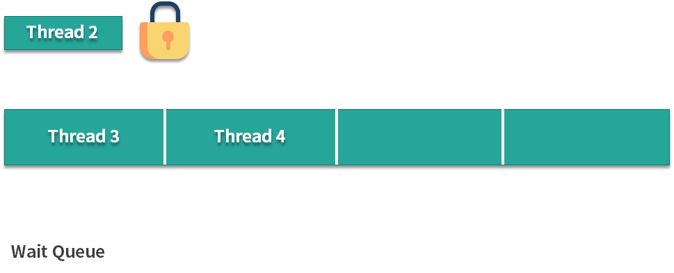

<!DOCTYPE html>
<!-- saved from url=(0046)https://kaiiiz.github.io/hexo-theme-book-demo/ -->
<html xmlns="http://www.w3.org/1999/xhtml">
<head>
    <head>
        <meta http-equiv="Content-Type" content="text/html; charset=UTF-8">
        <meta name="viewport" content="width=device-width, initial-scale=1, maximum-scale=1.0, user-scalable=no">
        <link rel="icon" href="../../static/favicon.png">
        <title>24 讲一讲公平锁和非公平锁，为什么要“非公平”？.md</title>
        <!-- Spectre.css framework -->
        <link rel="stylesheet" href="../../static/index.css">
        <!-- theme css & js -->
        <meta name="generator" content="Hexo 4.2.0">
    </head>

<body>

    

        

            <a href="../../index.html">
                
                技术文章摘抄
            </a>
        

        

            <ul class="uncollapsible">
                <li><a href="../../index.html" class="current-tab">首页</a></li>
            </ul>

            <ul class="uncollapsible">
                <li><a href="../index.html">上一级</a></li>
            </ul>

            <ul class="uncollapsible">
                <li>

                    
                    <a href="00&#32;由点及面，搭建你的&#32;Java&#32;并发知识网.md">00 由点及面，搭建你的 Java 并发知识网.md</a>

                </li>
                <li>

                    
                    <a href="01&#32;为何说只有&#32;1&#32;种实现线程的方法？.md">01 为何说只有 1 种实现线程的方法？.md</a>

                </li>
                <li>

                    
                    <a href="02&#32;如何正确停止线程？为什么&#32;volatile&#32;标记位的停止方法是错误的？.md">02 如何正确停止线程？为什么 volatile 标记位的停止方法是错误的？.md</a>

                </li>
                <li>

                    
                    <a href="03&#32;线程是如何在&#32;6&#32;种状态之间转换的？.md">03 线程是如何在 6 种状态之间转换的？.md</a>

                </li>
                <li>

                    
                    <a href="04&#32;waitnotifynotifyAll&#32;方法的使用注意事项？.md">04 waitnotifynotifyAll 方法的使用注意事项？.md</a>

                </li>
                <li>

                    
                    <a href="05&#32;有哪几种实现生产者消费者模式的方法？.md">05 有哪几种实现生产者消费者模式的方法？.md</a>

                </li>
                <li>

                    
                    <a href="06&#32;一共有哪&#32;3&#32;类线程安全问题？.md">06 一共有哪 3 类线程安全问题？.md</a>

                </li>
                <li>

                    
                    <a href="07&#32;哪些场景需要额外注意线程安全问题？.md">07 哪些场景需要额外注意线程安全问题？.md</a>

                </li>
                <li>

                    
                    <a href="08&#32;为什么多线程会带来性能问题？.md">08 为什么多线程会带来性能问题？.md</a>

                </li>
                <li>

                    
                    <a href="09&#32;使用线程池比手动创建线程好在哪里？.md">09 使用线程池比手动创建线程好在哪里？.md</a>

                </li>
                <li>

                    
                    <a href="10&#32;线程池的各个参数的含义？.md">10 线程池的各个参数的含义？.md</a>

                </li>
                <li>

                    
                    <a href="11&#32;线程池有哪&#32;4&#32;种拒绝策略？.md">11 线程池有哪 4 种拒绝策略？.md</a>

                </li>
                <li>

                    
                    <a href="12&#32;有哪&#32;6&#32;种常见的线程池？什么是&#32;Java8&#32;的&#32;ForkJoinPool？.md">12 有哪 6 种常见的线程池？什么是 Java8 的 ForkJoinPool？.md</a>

                </li>
                <li>

                    
                    <a href="13&#32;线程池常用的阻塞队列有哪些？.md">13 线程池常用的阻塞队列有哪些？.md</a>

                </li>
                <li>

                    
                    <a href="14&#32;为什么不应该自动创建线程池？.md">14 为什么不应该自动创建线程池？.md</a>

                </li>
                <li>

                    
                    <a href="15&#32;合适的线程数量是多少？CPU&#32;核心数和线程数的关系？.md">15 合适的线程数量是多少？CPU 核心数和线程数的关系？.md</a>

                </li>
                <li>

                    
                    <a href="16&#32;如何根据实际需要，定制自己的线程池？.md">16 如何根据实际需要，定制自己的线程池？.md</a>

                </li>
                <li>

                    
                    <a href="17&#32;如何正确关闭线程池？shutdown&#32;和&#32;shutdownNow&#32;的区别？.md">17 如何正确关闭线程池？shutdown 和 shutdownNow 的区别？.md</a>

                </li>
                <li>

                    
                    <a href="18&#32;线程池实现“线程复用”的原理？.md">18 线程池实现“线程复用”的原理？.md</a>

                </li>
                <li>

                    
                    <a href="19&#32;你知道哪几种锁？分别有什么特点？.md">19 你知道哪几种锁？分别有什么特点？.md</a>

                </li>
                <li>

                    
                    <a href="20&#32;悲观锁和乐观锁的本质是什么？.md">20 悲观锁和乐观锁的本质是什么？.md</a>

                </li>
                <li>

                    
                    <a href="21&#32;如何看到&#32;synchronized&#32;背后的“monitor&#32;锁”？.md">21 如何看到 synchronized 背后的“monitor 锁”？.md</a>

                </li>
                <li>

                    
                    <a href="22&#32;synchronized&#32;和&#32;Lock&#32;孰优孰劣，如何选择？.md">22 synchronized 和 Lock 孰优孰劣，如何选择？.md</a>

                </li>
                <li>

                    
                    <a href="23&#32;Lock&#32;有哪几个常用方法？分别有什么用？.md">23 Lock 有哪几个常用方法？分别有什么用？.md</a>

                </li>
                <li>

                    <a class="current-tab" href="24&#32;讲一讲公平锁和非公平锁，为什么要“非公平”？.md">24 讲一讲公平锁和非公平锁，为什么要“非公平”？.md</a>
                    

                </li>
                <li>

                    
                    <a href="25&#32;读写锁&#32;ReadWriteLock&#32;获取锁有哪些规则？.md">25 读写锁 ReadWriteLock 获取锁有哪些规则？.md</a>

                </li>
                <li>

                    
                    <a href="26&#32;读锁应该插队吗？什么是读写锁的升降级？.md">26 读锁应该插队吗？什么是读写锁的升降级？.md</a>

                </li>
                <li>

                    
                    <a href="27&#32;什么是自旋锁？自旋的好处和后果是什么呢？.md">27 什么是自旋锁？自旋的好处和后果是什么呢？.md</a>

                </li>
                <li>

                    
                    <a href="28&#32;JVM&#32;对锁进行了哪些优化？.md">28 JVM 对锁进行了哪些优化？.md</a>

                </li>
                <li>

                    
                    <a href="29&#32;HashMap&#32;为什么是线程不安全的？.md">29 HashMap 为什么是线程不安全的？.md</a>

                </li>
                <li>

                    
                    <a href="30&#32;ConcurrentHashMap&#32;在&#32;Java7&#32;和&#32;8&#32;有何不同？.md">30 ConcurrentHashMap 在 Java7 和 8 有何不同？.md</a>

                </li>
                <li>

                    
                    <a href="31&#32;为什么&#32;Map&#32;桶中超过&#32;8&#32;个才转为红黑树？.md">31 为什么 Map 桶中超过 8 个才转为红黑树？.md</a>

                </li>
                <li>

                    
                    <a href="32&#32;同样是线程安全，ConcurrentHashMap&#32;和&#32;Hashtable&#32;的区别.md">32 同样是线程安全，ConcurrentHashMap 和 Hashtable 的区别.md</a>

                </li>
                <li>

                    
                    <a href="33&#32;CopyOnWriteArrayList&#32;有什么特点？.md">33 CopyOnWriteArrayList 有什么特点？.md</a>

                </li>
                <li>

                    
                    <a href="34&#32;什么是阻塞队列？.md">34 什么是阻塞队列？.md</a>

                </li>
                <li>

                    
                    <a href="35&#32;阻塞队列包含哪些常用的方法？add、offer、put&#32;等方法的区别？.md">35 阻塞队列包含哪些常用的方法？add、offer、put 等方法的区别？.md</a>

                </li>
                <li>

                    
                    <a href="36&#32;有哪几种常见的阻塞队列？.md">36 有哪几种常见的阻塞队列？.md</a>

                </li>
                <li>

                    
                    <a href="37&#32;阻塞和非阻塞队列的并发安全原理是什么？.md">37 阻塞和非阻塞队列的并发安全原理是什么？.md</a>

                </li>
                <li>

                    
                    <a href="38&#32;如何选择适合自己的阻塞队列？.md">38 如何选择适合自己的阻塞队列？.md</a>

                </li>
                <li>

                    
                    <a href="39&#32;原子类是如何利用&#32;CAS&#32;保证线程安全的？.md">39 原子类是如何利用 CAS 保证线程安全的？.md</a>

                </li>
                <li>

                    
                    <a href="40&#32;AtomicInteger&#32;在高并发下性能不好，如何解决？为什么？.md">40 AtomicInteger 在高并发下性能不好，如何解决？为什么？.md</a>

                </li>
                <li>

                    
                    <a href="41&#32;原子类和&#32;volatile&#32;有什么异同？.md">41 原子类和 volatile 有什么异同？.md</a>

                </li>
                <li>

                    
                    <a href="42&#32;AtomicInteger&#32;和&#32;synchronized&#32;的异同点？.md">42 AtomicInteger 和 synchronized 的异同点？.md</a>

                </li>
                <li>

                    
                    <a href="43&#32;Java&#32;8&#32;中&#32;Adder&#32;和&#32;Accumulator&#32;有什么区别？.md">43 Java 8 中 Adder 和 Accumulator 有什么区别？.md</a>

                </li>
                <li>

                    
                    <a href="44&#32;ThreadLocal&#32;适合用在哪些实际生产的场景中？.md">44 ThreadLocal 适合用在哪些实际生产的场景中？.md</a>

                </li>
                <li>

                    
                    <a href="45&#32;ThreadLocal&#32;是用来解决共享资源的多线程访问的问题吗？.md">45 ThreadLocal 是用来解决共享资源的多线程访问的问题吗？.md</a>

                </li>
                <li>

                    
                    <a href="46&#32;多个&#32;ThreadLocal&#32;在&#32;Thread&#32;中的&#32;threadlocals&#32;里是怎么存储的？.md">46 多个 ThreadLocal 在 Thread 中的 threadlocals 里是怎么存储的？.md</a>

                </li>
                <li>

                    
                    <a href="47&#32;内存泄漏——为何每次用完&#32;ThreadLocal&#32;都要调用&#32;remove()？.md">47 内存泄漏——为何每次用完 ThreadLocal 都要调用 remove()？.md</a>

                </li>
                <li>

                    
                    <a href="48&#32;Callable&#32;和&#32;Runnable&#32;的不同？.md">48 Callable 和 Runnable 的不同？.md</a>

                </li>
                <li>

                    
                    <a href="49&#32;Future&#32;的主要功能是什么？.md">49 Future 的主要功能是什么？.md</a>

                </li>
                <li>

                    
                    <a href="50&#32;使用&#32;Future&#32;有哪些注意点？Future&#32;产生新的线程了吗？.md">50 使用 Future 有哪些注意点？Future 产生新的线程了吗？.md</a>

                </li>
                <li>

                    
                    <a href="51&#32;如何利用&#32;CompletableFuture&#32;实现“旅游平台”问题？.md">51 如何利用 CompletableFuture 实现“旅游平台”问题？.md</a>

                </li>
                <li>

                    
                    <a href="52&#32;信号量能被&#32;FixedThreadPool&#32;替代吗？.md">52 信号量能被 FixedThreadPool 替代吗？.md</a>

                </li>
                <li>

                    
                    <a href="53&#32;CountDownLatch&#32;是如何安排线程执行顺序的？.md">53 CountDownLatch 是如何安排线程执行顺序的？.md</a>

                </li>
                <li>

                    
                    <a href="54&#32;CyclicBarrier&#32;和&#32;CountdownLatch&#32;有什么异同？.md">54 CyclicBarrier 和 CountdownLatch 有什么异同？.md</a>

                </li>
                <li>

                    
                    <a href="55&#32;Condition、object.wait()&#32;和&#32;notify()&#32;的关系？.md">55 Condition、object.wait() 和 notify() 的关系？.md</a>

                </li>
                <li>

                    
                    <a href="56&#32;讲一讲什么是&#32;Java&#32;内存模型？.md">56 讲一讲什么是 Java 内存模型？.md</a>

                </li>
                <li>

                    
                    <a href="57&#32;什么是指令重排序？为什么要重排序？.md">57 什么是指令重排序？为什么要重排序？.md</a>

                </li>
                <li>

                    
                    <a href="58&#32;Java&#32;中的原子操作有哪些注意事项？.md">58 Java 中的原子操作有哪些注意事项？.md</a>

                </li>
                <li>

                    
                    <a href="59&#32;什么是“内存可见性”问题？.md">59 什么是“内存可见性”问题？.md</a>

                </li>
                <li>

                    
                    <a href="60&#32;主内存和工作内存的关系？.md">60 主内存和工作内存的关系？.md</a>

                </li>
                <li>

                    
                    <a href="61&#32;什么是&#32;happens-before&#32;规则？.md">61 什么是 happens-before 规则？.md</a>

                </li>
                <li>

                    
                    <a href="62&#32;volatile&#32;的作用是什么？与&#32;synchronized&#32;有什么异同？.md">62 volatile 的作用是什么？与 synchronized 有什么异同？.md</a>

                </li>
                <li>

                    
                    <a href="63&#32;单例模式的双重检查锁模式为什么必须加&#32;volatile？.md">63 单例模式的双重检查锁模式为什么必须加 volatile？.md</a>

                </li>
                <li>

                    
                    <a href="64&#32;你知道什么是&#32;CAS&#32;吗？.md">64 你知道什么是 CAS 吗？.md</a>

                </li>
                <li>

                    
                    <a href="65&#32;CAS&#32;和乐观锁的关系，什么时候会用到&#32;CAS？.md">65 CAS 和乐观锁的关系，什么时候会用到 CAS？.md</a>

                </li>
                <li>

                    
                    <a href="66&#32;CAS&#32;有什么缺点？.md">66 CAS 有什么缺点？.md</a>

                </li>
                <li>

                    
                    <a href="67&#32;如何写一个必然死锁的例子？.md">67 如何写一个必然死锁的例子？.md</a>

                </li>
                <li>

                    
                    <a href="68&#32;发生死锁必须满足哪&#32;4&#32;个条件？.md">68 发生死锁必须满足哪 4 个条件？.md</a>

                </li>
                <li>

                    
                    <a href="69&#32;如何用命令行和代码定位死锁？.md">69 如何用命令行和代码定位死锁？.md</a>

                </li>
                <li>

                    
                    <a href="70&#32;有哪些解决死锁问题的策略？.md">70 有哪些解决死锁问题的策略？.md</a>

                </li>
                <li>

                    
                    <a href="71&#32;讲一讲经典的哲学家就餐问题.md">71 讲一讲经典的哲学家就餐问题.md</a>

                </li>
                <li>

                    
                    <a href="72&#32;final&#32;的三种用法是什么？.md">72 final 的三种用法是什么？.md</a>

                </li>
                <li>

                    
                    <a href="73&#32;为什么加了&#32;final&#32;却依然无法拥有“不变性”？.md">73 为什么加了 final 却依然无法拥有“不变性”？.md</a>

                </li>
                <li>

                    
                    <a href="74&#32;为什么&#32;String&#32;被设计为是不可变的？.md">74 为什么 String 被设计为是不可变的？.md</a>

                </li>
                <li>

                    
                    <a href="75&#32;为什么需要&#32;AQS？AQS&#32;的作用和重要性是什么？.md">75 为什么需要 AQS？AQS 的作用和重要性是什么？.md</a>

                </li>
                <li>

                    
                    <a href="76&#32;AQS&#32;的内部原理是什么样的？.md">76 AQS 的内部原理是什么样的？.md</a>

                </li>
                <li>

                    
                    <a href="77&#32;AQS&#32;在&#32;CountDownLatch&#32;等类中的应用原理是什么？.md">77 AQS 在 CountDownLatch 等类中的应用原理是什么？.md</a>

                </li>
                <li>

                    
                    <a href="78&#32;一份独家的&#32;Java&#32;并发工具图谱.md">78 一份独家的 Java 并发工具图谱.md</a>

                </li>
            </ul>

        

    

    

        

    

    

    

        

            

                

                    <!-- For Responsive Layout -->
                    <header class="navbar">
                        <section class="navbar-section">
                            <a onclick="open_sidebar()">
                                <i class="icon icon-menu"></i>
                            </a>
                        </section>
                    </header>
                

                

                    

                        

                        
<h1>24 讲一讲公平锁和非公平锁，为什么要“非公平”？</h1>

本课时我们主要讲一讲公平锁和非公平锁，以及为什么要“非公平”？

<h3>什么是公平和非公平</h3>

首先，我们来看下什么是公平锁和非公平锁，公平锁指的是按照线程请求的顺序，来分配锁；而非公平锁指的是不完全按照请求的顺序，在一定情况下，可以允许插队。但需要注意这里的非公平并不是指完全的随机，不是说线程可以任意插队，而是仅仅“在合适的时机”插队。

那么什么时候是合适的时机呢？假设当前线程在请求获取锁的时候，恰巧前一个持有锁的线程释放了这把锁，那么当前申请锁的线程就可以不顾已经等待的线程而选择立刻插队。但是如果当前线程请求的时候，前一个线程并没有在那一时刻释放锁，那么当前线程还是一样会进入等待队列。

为了能够更好的理解公平锁和非公平锁，我们举一个生活中的例子，假设我们还在学校读书，去食堂排队买饭，我排在队列的第二个，我前面还有一位同学，但此时我脑子里想的不是午饭，而是上午的一道数学题并陷入深思，所以当前面的同学打完饭之后轮到我时我走神了，并也没注意到现在轮到我了，此时前面的同学突然又回来插队，说“不好意思，阿姨麻烦给我加个鸡腿”，像这样的行为就可以类比我们的公平锁和非公平锁。

看到这里，你可能不解，为什么要设置非公平策略呢，而且非公平还是 ReentrantLock的默认策略，如果我们不加以设置的话默认就是非公平的，难道我的这些排队的时间都白白浪费了吗，为什么别人比我有优先权呢？毕竟公平是一种很好的行为，而非公平是一种不好的行为。

让我们考虑一种情况，假设线程 A 持有一把锁，线程 B 请求这把锁，由于线程 A 已经持有这把锁了，所以线程 B 会陷入等待，在等待的时候线程 B 会被挂起，也就是进入阻塞状态，那么当线程 A 释放锁的时候，本该轮到线程 B 苏醒获取锁，但如果此时突然有一个线程 C 插队请求这把锁，那么根据非公平的策略，会把这把锁给线程 C，这是因为唤醒线程 B 是需要很大开销的，很有可能在唤醒之前，线程 C 已经拿到了这把锁并且执行完任务释放了这把锁。相比于等待唤醒线程 B 的漫长过程，插队的行为会让线程 C 本身跳过陷入阻塞的过程，如果在锁代码中执行的内容不多的话，线程 C 就可以很快完成任务，并且在线程 B 被完全唤醒之前，就把这个锁交出去，这样是一个双赢的局面，对于线程 C 而言，不需要等待提高了它的效率，而对于线程 B 而言，它获得锁的时间并没有推迟，因为等它被唤醒的时候，线程 C 早就释放锁了，因为线程 C 的执行速度相比于线程 B 的唤醒速度，是很快的，所以 Java 设计者设计非公平锁，是为了提高整体的运行效率。

<h3>公平的场景</h3>

下面我们用图示来说明公平和非公平的场景，先来看公平的情况。假设我们创建了一个公平锁，此时有 4 个线程按顺序来请求公平锁，线程 1 在拿到这把锁之后，线程 2、3、4 会在等待队列中开始等待，然后等线程 1 释放锁之后，线程 2、3、4 会依次去获取这把锁，线程 2 先获取到的原因是它等待的时间最长。

<h3>不公平的场景</h3>

下面我们再来看看非公平的情况，假设线程 1 在解锁的时候，突然有线程 5 尝试获取这把锁，那么根据我们的非公平策略，线程 5 是可以拿到这把锁的，尽管它没有进入等待队列，而且线程 2、3、4 等待的时间都比线程 5 要长，但是从整体效率考虑，这把锁此时还是会交给线程 5 持有。

<h3>代码案例：演示公平和非公平的效果</h3>

下面我们来用代码演示看下公平和非公平的实际效果，代码如下：

<pre><code class="language-java">/**

 * 描述：演示公平锁，分别展示公平和不公平的情况，非公平锁会让现在持有锁的线程优先再次获取到锁。代码借鉴自Java并发编程实战手册2.7。

 */

public class FairAndUnfair {

    public static void main(String args[]) {

        PrintQueue printQueue = new PrintQueue();

        Thread thread[] = new Thread[10];

        for (int i = 0; i &lt; 10; i++) {

            thread[i] = new Thread(new Job(printQueue), &quot;Thread &quot; + i);

        }

        for (int i = 0; i &lt; 10; i++) {

            thread[i].start();

            try {

                Thread.sleep(100);

            } catch (InterruptedException e) {

                e.printStackTrace();

            }

        }

    }

}

class Job implements Runnable {

    private PrintQueue printQueue;

    public Job(PrintQueue printQueue) {

        this.printQueue = printQueue;

    }

    @Override

    public void run() {

        System.out.printf(&quot;%s: Going to print a job\n&quot;, Thread.currentThread().getName());

        printQueue.printJob(new Object());

        System.out.printf(&quot;%s: The document has been printed\n&quot;, Thread.currentThread().getName());

    }

}

class PrintQueue {

    private final Lock queueLock = new ReentrantLock(false);

    public void printJob(Object document) {

        queueLock.lock();

        try {

            Long duration = (long) (Math.random() * 10000);

            System.out.printf(&quot;%s: PrintQueue: Printing a Job during %d seconds\n&quot;,

                    Thread.currentThread().getName(), (duration / 1000));

            Thread.sleep(duration);

        } catch (InterruptedException e) {

            e.printStackTrace();

        } finally {

            queueLock.unlock();

        }

        queueLock.lock();

        try {

            Long duration = (long) (Math.random() * 10000);

            System.out.printf(&quot;%s: PrintQueue: Printing a Job during %d seconds\n&quot;,

                    Thread.currentThread().getName(), (duration / 1000));

            Thread.sleep(duration);

        } catch (InterruptedException e) {

            e.printStackTrace();

        } finally {

            queueLock.unlock();

            }

    }

}
</code></pre>

我们可以通过改变 new ReentrantLock(false) 中的参数来设置公平/非公平锁。以上代码在公平的情况下的输出：

<pre><code class="language-java">Thread 0: Going to print a job

Thread 0: PrintQueue: Printing a Job during 5 seconds

Thread 1: Going to print a job

Thread 2: Going to print a job

Thread 3: Going to print a job

Thread 4: Going to print a job

Thread 5: Going to print a job

Thread 6: Going to print a job

Thread 7: Going to print a job

Thread 8: Going to print a job

Thread 9: Going to print a job

Thread 1: PrintQueue: Printing a Job during 3 seconds

Thread 2: PrintQueue: Printing a Job during 4 seconds

Thread 3: PrintQueue: Printing a Job during 3 seconds

Thread 4: PrintQueue: Printing a Job during 9 seconds

Thread 5: PrintQueue: Printing a Job during 5 seconds

Thread 6: PrintQueue: Printing a Job during 7 seconds

Thread 7: PrintQueue: Printing a Job during 3 seconds

Thread 8: PrintQueue: Printing a Job during 9 seconds

Thread 9: PrintQueue: Printing a Job during 5 seconds

Thread 0: PrintQueue: Printing a Job during 8 seconds

Thread 0: The document has been printed

Thread 1: PrintQueue: Printing a Job during 1 seconds

Thread 1: The document has been printed

Thread 2: PrintQueue: Printing a Job during 8 seconds

Thread 2: The document has been printed

Thread 3: PrintQueue: Printing a Job during 2 seconds

Thread 3: The document has been printed

Thread 4: PrintQueue: Printing a Job during 0 seconds

Thread 4: The document has been printed

Thread 5: PrintQueue: Printing a Job during 7 seconds

Thread 5: The document has been printed

Thread 6: PrintQueue: Printing a Job during 3 seconds

Thread 6: The document has been printed

Thread 7: PrintQueue: Printing a Job during 9 seconds

Thread 7: The document has been printed

Thread 8: PrintQueue: Printing a Job during 5 seconds

Thread 8: The document has been printed

Thread 9: PrintQueue: Printing a Job during 9 seconds

Thread 9: The document has been printed
</code></pre>

可以看出，线程直接获取锁的顺序是完全公平的，先到先得。

而以上代码在非公平的情况下的输出是这样的：

<pre><code class="language-java">Thread 0: Going to print a job

Thread 0: PrintQueue: Printing a Job during 6 seconds

Thread 1: Going to print a job

Thread 2: Going to print a job

Thread 3: Going to print a job

Thread 4: Going to print a job

Thread 5: Going to print a job

Thread 6: Going to print a job

Thread 7: Going to print a job

Thread 8: Going to print a job

Thread 9: Going to print a job

Thread 0: PrintQueue: Printing a Job during 8 seconds

Thread 0: The document has been printed

Thread 1: PrintQueue: Printing a Job during 9 seconds

Thread 1: PrintQueue: Printing a Job during 8 seconds

Thread 1: The document has been printed

Thread 2: PrintQueue: Printing a Job during 6 seconds

Thread 2: PrintQueue: Printing a Job during 4 seconds

Thread 2: The document has been printed

Thread 3: PrintQueue: Printing a Job during 9 seconds

Thread 3: PrintQueue: Printing a Job during 8 seconds

Thread 3: The document has been printed

Thread 4: PrintQueue: Printing a Job during 4 seconds

Thread 4: PrintQueue: Printing a Job during 2 seconds

Thread 4: The document has been printed

Thread 5: PrintQueue: Printing a Job during 2 seconds

Thread 5: PrintQueue: Printing a Job during 5 seconds

Thread 5: The document has been printed

Thread 6: PrintQueue: Printing a Job during 2 seconds

Thread 6: PrintQueue: Printing a Job during 6 seconds

Thread 6: The document has been printed

Thread 7: PrintQueue: Printing a Job during 6 seconds

Thread 7: PrintQueue: Printing a Job during 4 seconds

Thread 7: The document has been printed

Thread 8: PrintQueue: Printing a Job during 3 seconds

Thread 8: PrintQueue: Printing a Job during 6 seconds

Thread 8: The document has been printed

Thread 9: PrintQueue: Printing a Job during 3 seconds

Thread 9: PrintQueue: Printing a Job during 5 seconds

Thread 9: The document has been printed
</code></pre>

可以看出，非公平情况下，存在抢锁“插队”的现象，比如Thread 0 在释放锁后又能优先获取到锁，虽然此时在等待队列中已经有 Thread 1 ~ Thread 9 在排队了。

<h3>对比公平和非公平的优缺点</h3>

我们接下来对比公平和非公平的优缺点，如表格所示。

公平锁的优点在于各个线程公平平等，每个线程等待一段时间后，都有执行的机会，而它的缺点就在于整体执行速度更慢，吞吐量更小，相反非公平锁的优势就在于整体执行速度更快，吞吐量更大，但同时也可能产生线程饥饿问题，也就是说如果一直有线程插队，那么在等待队列中的线程可能长时间得不到运行。

<h3>源码分析</h3>

下面我们来分析公平和非公平锁的源码，具体看下它们是怎样实现的，可以看到在 ReentrantLock 类包含一个 Sync 类，这个类继承自AQS（AbstractQueuedSynchronizer），代码如下：

<pre><code class="language-java">public class ReentrantLock implements Lock, java.io.Serializable {

private static final long serialVersionUID = 7373984872572414699L;

/** Synchronizer providing all implementation mechanics */

private final Sync sync;
</code></pre>

Sync 类的代码：

<pre><code class="language-java">abstract static class Sync extends AbstractQueuedSynchronizer {...}
</code></pre>

根据代码可知，Sync 有公平锁 FairSync 和非公平锁 NonfairSync两个子类：

<pre><code class="language-java">static final class NonfairSync extends Sync {...}

static final class FairSync extends Sync {...}
</code></pre>

下面我们来看一下公平锁与非公平锁的加锁方法的源码。

公平锁的锁获取源码如下：

<pre><code class="language-java">protected final boolean tryAcquire(int acquires) {

    final Thread current = Thread.currentThread();

    int c = getState();

    if (c == 0) {

        if (!hasQueuedPredecessors() &amp;&amp; //这里判断了 hasQueuedPredecessors()

                compareAndSetState(0, acquires)) {

            setExclusiveOwnerThread(current);

            return true;

        }

    } else if (current == getExclusiveOwnerThread()) {

        int nextc = c + acquires;

        if (nextc &lt; 0) {

            throw new Error(&quot;Maximum lock count exceeded&quot;);

        }

        setState(nextc);

        return true;

    }

    return false;

}
</code></pre>

非公平锁的锁获取源码如下：

<pre><code class="language-java">final boolean nonfairTryAcquire(int acquires) {

    final Thread current = Thread.currentThread();

    int c = getState();

    if (c == 0) {

        if (compareAndSetState(0, acquires)) { //这里没有判断      hasQueuedPredecessors()

            setExclusiveOwnerThread(current);

            return true;

        }

    }

    else if (current == getExclusiveOwnerThread()) {

        int nextc = c + acquires;

        if (nextc &lt; 0) // overflow

        throw new Error(&quot;Maximum lock count exceeded&quot;);

        setState(nextc);

        return true;

    }

    return false;

}
</code></pre>

通过对比，我们可以明显的看出公平锁与非公平锁的 lock() 方法唯一的区别就在于公平锁在获取锁时多了一个限制条件：hasQueuedPredecessors() 为 false，这个方法就是判断在等待队列中是否已经有线程在排队了。这也就是公平锁和非公平锁的核心区别，如果是公平锁，那么一旦已经有线程在排队了，当前线程就不再尝试获取锁；对于非公平锁而言，无论是否已经有线程在排队，都会尝试获取一下锁，获取不到的话，再去排队。

这里有一个特例需要我们注意，针对 tryLock() 方法，它不遵守设定的公平原则。

例如，当有线程执行 tryLock() 方法的时候，一旦有线程释放了锁，那么这个正在 tryLock 的线程就能获取到锁，即使设置的是公平锁模式，即使在它之前已经有其他正在等待队列中等待的线程，简单地说就是 tryLock 可以插队。

看它的源码就会发现：

<pre><code class="language-java">public boolean tryLock() {

    return sync.nonfairTryAcquire(1);

}
</code></pre>

这里调用的就是 nonfairTryAcquire()，表明了是不公平的，和锁本身是否是公平锁无关。

综上所述，公平锁就是会按照多个线程申请锁的顺序来获取锁，从而实现公平的特性。非公平锁加锁时不考虑排队等待情况，直接尝试获取锁，所以存在后申请却先获得锁的情况，但由此也提高了整体的效率。

                    

                    

                        

                            <a href="23&#32;Lock&#32;有哪几个常用方法？分别有什么用？.md">上一页</a>
                        

                        

                            <a href="25&#32;读写锁&#32;ReadWriteLock&#32;获取锁有哪些规则？.md">下一页</a>
                        

                    

                

            

        

    

    

</body>
<!-- Global site tag (gtag.js) - Google Analytics -->

</html>
