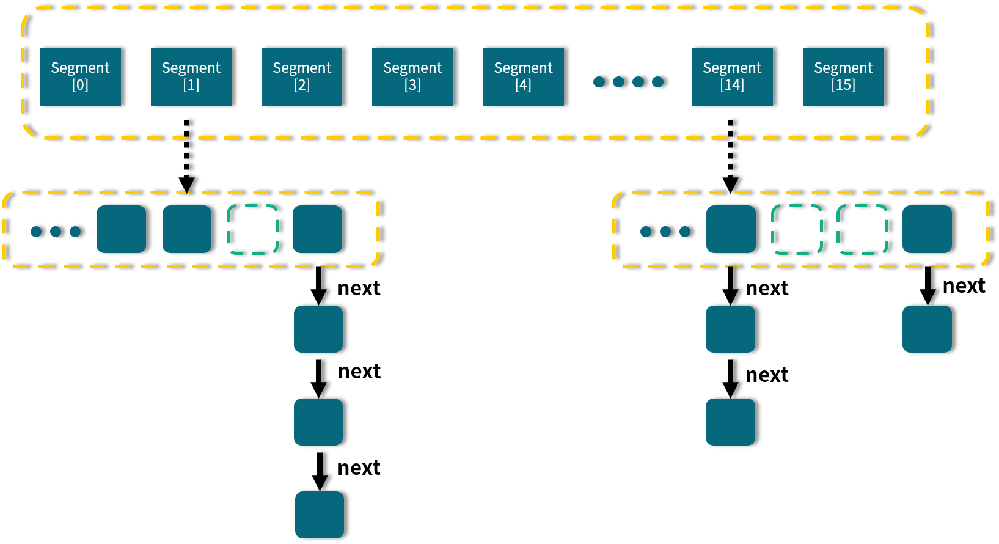

<!DOCTYPE html>
<!-- saved from url=(0046)https://kaiiiz.github.io/hexo-theme-book-demo/ -->
<html xmlns="http://www.w3.org/1999/xhtml">
<head>
    <head>
        <meta http-equiv="Content-Type" content="text/html; charset=UTF-8">
        <meta name="viewport" content="width=device-width, initial-scale=1, maximum-scale=1.0, user-scalable=no">
        <link rel="icon" href="../../static/favicon.png">
        <title>30 ConcurrentHashMap 在 Java7 和 8 有何不同？.md</title>
        <!-- Spectre.css framework -->
        <link rel="stylesheet" href="../../static/index.css">
        <!-- theme css & js -->
        <meta name="generator" content="Hexo 4.2.0">
    </head>

<body>

    

        

            <a href="../../index.html">
                
                技术文章摘抄
            </a>
        

        

            <ul class="uncollapsible">
                <li><a href="../../index.html" class="current-tab">首页</a></li>
            </ul>

            <ul class="uncollapsible">
                <li><a href="../index.html">上一级</a></li>
            </ul>

            <ul class="uncollapsible">
                <li>

                    
                    <a href="00&#32;由点及面，搭建你的&#32;Java&#32;并发知识网.md">00 由点及面，搭建你的 Java 并发知识网.md</a>

                </li>
                <li>

                    
                    <a href="01&#32;为何说只有&#32;1&#32;种实现线程的方法？.md">01 为何说只有 1 种实现线程的方法？.md</a>

                </li>
                <li>

                    
                    <a href="02&#32;如何正确停止线程？为什么&#32;volatile&#32;标记位的停止方法是错误的？.md">02 如何正确停止线程？为什么 volatile 标记位的停止方法是错误的？.md</a>

                </li>
                <li>

                    
                    <a href="03&#32;线程是如何在&#32;6&#32;种状态之间转换的？.md">03 线程是如何在 6 种状态之间转换的？.md</a>

                </li>
                <li>

                    
                    <a href="04&#32;waitnotifynotifyAll&#32;方法的使用注意事项？.md">04 waitnotifynotifyAll 方法的使用注意事项？.md</a>

                </li>
                <li>

                    
                    <a href="05&#32;有哪几种实现生产者消费者模式的方法？.md">05 有哪几种实现生产者消费者模式的方法？.md</a>

                </li>
                <li>

                    
                    <a href="06&#32;一共有哪&#32;3&#32;类线程安全问题？.md">06 一共有哪 3 类线程安全问题？.md</a>

                </li>
                <li>

                    
                    <a href="07&#32;哪些场景需要额外注意线程安全问题？.md">07 哪些场景需要额外注意线程安全问题？.md</a>

                </li>
                <li>

                    
                    <a href="08&#32;为什么多线程会带来性能问题？.md">08 为什么多线程会带来性能问题？.md</a>

                </li>
                <li>

                    
                    <a href="09&#32;使用线程池比手动创建线程好在哪里？.md">09 使用线程池比手动创建线程好在哪里？.md</a>

                </li>
                <li>

                    
                    <a href="10&#32;线程池的各个参数的含义？.md">10 线程池的各个参数的含义？.md</a>

                </li>
                <li>

                    
                    <a href="11&#32;线程池有哪&#32;4&#32;种拒绝策略？.md">11 线程池有哪 4 种拒绝策略？.md</a>

                </li>
                <li>

                    
                    <a href="12&#32;有哪&#32;6&#32;种常见的线程池？什么是&#32;Java8&#32;的&#32;ForkJoinPool？.md">12 有哪 6 种常见的线程池？什么是 Java8 的 ForkJoinPool？.md</a>

                </li>
                <li>

                    
                    <a href="13&#32;线程池常用的阻塞队列有哪些？.md">13 线程池常用的阻塞队列有哪些？.md</a>

                </li>
                <li>

                    
                    <a href="14&#32;为什么不应该自动创建线程池？.md">14 为什么不应该自动创建线程池？.md</a>

                </li>
                <li>

                    
                    <a href="15&#32;合适的线程数量是多少？CPU&#32;核心数和线程数的关系？.md">15 合适的线程数量是多少？CPU 核心数和线程数的关系？.md</a>

                </li>
                <li>

                    
                    <a href="16&#32;如何根据实际需要，定制自己的线程池？.md">16 如何根据实际需要，定制自己的线程池？.md</a>

                </li>
                <li>

                    
                    <a href="17&#32;如何正确关闭线程池？shutdown&#32;和&#32;shutdownNow&#32;的区别？.md">17 如何正确关闭线程池？shutdown 和 shutdownNow 的区别？.md</a>

                </li>
                <li>

                    
                    <a href="18&#32;线程池实现“线程复用”的原理？.md">18 线程池实现“线程复用”的原理？.md</a>

                </li>
                <li>

                    
                    <a href="19&#32;你知道哪几种锁？分别有什么特点？.md">19 你知道哪几种锁？分别有什么特点？.md</a>

                </li>
                <li>

                    
                    <a href="20&#32;悲观锁和乐观锁的本质是什么？.md">20 悲观锁和乐观锁的本质是什么？.md</a>

                </li>
                <li>

                    
                    <a href="21&#32;如何看到&#32;synchronized&#32;背后的“monitor&#32;锁”？.md">21 如何看到 synchronized 背后的“monitor 锁”？.md</a>

                </li>
                <li>

                    
                    <a href="22&#32;synchronized&#32;和&#32;Lock&#32;孰优孰劣，如何选择？.md">22 synchronized 和 Lock 孰优孰劣，如何选择？.md</a>

                </li>
                <li>

                    
                    <a href="23&#32;Lock&#32;有哪几个常用方法？分别有什么用？.md">23 Lock 有哪几个常用方法？分别有什么用？.md</a>

                </li>
                <li>

                    
                    <a href="24&#32;讲一讲公平锁和非公平锁，为什么要“非公平”？.md">24 讲一讲公平锁和非公平锁，为什么要“非公平”？.md</a>

                </li>
                <li>

                    
                    <a href="25&#32;读写锁&#32;ReadWriteLock&#32;获取锁有哪些规则？.md">25 读写锁 ReadWriteLock 获取锁有哪些规则？.md</a>

                </li>
                <li>

                    
                    <a href="26&#32;读锁应该插队吗？什么是读写锁的升降级？.md">26 读锁应该插队吗？什么是读写锁的升降级？.md</a>

                </li>
                <li>

                    
                    <a href="27&#32;什么是自旋锁？自旋的好处和后果是什么呢？.md">27 什么是自旋锁？自旋的好处和后果是什么呢？.md</a>

                </li>
                <li>

                    
                    <a href="28&#32;JVM&#32;对锁进行了哪些优化？.md">28 JVM 对锁进行了哪些优化？.md</a>

                </li>
                <li>

                    
                    <a href="29&#32;HashMap&#32;为什么是线程不安全的？.md">29 HashMap 为什么是线程不安全的？.md</a>

                </li>
                <li>

                    <a class="current-tab" href="30&#32;ConcurrentHashMap&#32;在&#32;Java7&#32;和&#32;8&#32;有何不同？.md">30 ConcurrentHashMap 在 Java7 和 8 有何不同？.md</a>
                    

                </li>
                <li>

                    
                    <a href="31&#32;为什么&#32;Map&#32;桶中超过&#32;8&#32;个才转为红黑树？.md">31 为什么 Map 桶中超过 8 个才转为红黑树？.md</a>

                </li>
                <li>

                    
                    <a href="32&#32;同样是线程安全，ConcurrentHashMap&#32;和&#32;Hashtable&#32;的区别.md">32 同样是线程安全，ConcurrentHashMap 和 Hashtable 的区别.md</a>

                </li>
                <li>

                    
                    <a href="33&#32;CopyOnWriteArrayList&#32;有什么特点？.md">33 CopyOnWriteArrayList 有什么特点？.md</a>

                </li>
                <li>

                    
                    <a href="34&#32;什么是阻塞队列？.md">34 什么是阻塞队列？.md</a>

                </li>
                <li>

                    
                    <a href="35&#32;阻塞队列包含哪些常用的方法？add、offer、put&#32;等方法的区别？.md">35 阻塞队列包含哪些常用的方法？add、offer、put 等方法的区别？.md</a>

                </li>
                <li>

                    
                    <a href="36&#32;有哪几种常见的阻塞队列？.md">36 有哪几种常见的阻塞队列？.md</a>

                </li>
                <li>

                    
                    <a href="37&#32;阻塞和非阻塞队列的并发安全原理是什么？.md">37 阻塞和非阻塞队列的并发安全原理是什么？.md</a>

                </li>
                <li>

                    
                    <a href="38&#32;如何选择适合自己的阻塞队列？.md">38 如何选择适合自己的阻塞队列？.md</a>

                </li>
                <li>

                    
                    <a href="39&#32;原子类是如何利用&#32;CAS&#32;保证线程安全的？.md">39 原子类是如何利用 CAS 保证线程安全的？.md</a>

                </li>
                <li>

                    
                    <a href="40&#32;AtomicInteger&#32;在高并发下性能不好，如何解决？为什么？.md">40 AtomicInteger 在高并发下性能不好，如何解决？为什么？.md</a>

                </li>
                <li>

                    
                    <a href="41&#32;原子类和&#32;volatile&#32;有什么异同？.md">41 原子类和 volatile 有什么异同？.md</a>

                </li>
                <li>

                    
                    <a href="42&#32;AtomicInteger&#32;和&#32;synchronized&#32;的异同点？.md">42 AtomicInteger 和 synchronized 的异同点？.md</a>

                </li>
                <li>

                    
                    <a href="43&#32;Java&#32;8&#32;中&#32;Adder&#32;和&#32;Accumulator&#32;有什么区别？.md">43 Java 8 中 Adder 和 Accumulator 有什么区别？.md</a>

                </li>
                <li>

                    
                    <a href="44&#32;ThreadLocal&#32;适合用在哪些实际生产的场景中？.md">44 ThreadLocal 适合用在哪些实际生产的场景中？.md</a>

                </li>
                <li>

                    
                    <a href="45&#32;ThreadLocal&#32;是用来解决共享资源的多线程访问的问题吗？.md">45 ThreadLocal 是用来解决共享资源的多线程访问的问题吗？.md</a>

                </li>
                <li>

                    
                    <a href="46&#32;多个&#32;ThreadLocal&#32;在&#32;Thread&#32;中的&#32;threadlocals&#32;里是怎么存储的？.md">46 多个 ThreadLocal 在 Thread 中的 threadlocals 里是怎么存储的？.md</a>

                </li>
                <li>

                    
                    <a href="47&#32;内存泄漏——为何每次用完&#32;ThreadLocal&#32;都要调用&#32;remove()？.md">47 内存泄漏——为何每次用完 ThreadLocal 都要调用 remove()？.md</a>

                </li>
                <li>

                    
                    <a href="48&#32;Callable&#32;和&#32;Runnable&#32;的不同？.md">48 Callable 和 Runnable 的不同？.md</a>

                </li>
                <li>

                    
                    <a href="49&#32;Future&#32;的主要功能是什么？.md">49 Future 的主要功能是什么？.md</a>

                </li>
                <li>

                    
                    <a href="50&#32;使用&#32;Future&#32;有哪些注意点？Future&#32;产生新的线程了吗？.md">50 使用 Future 有哪些注意点？Future 产生新的线程了吗？.md</a>

                </li>
                <li>

                    
                    <a href="51&#32;如何利用&#32;CompletableFuture&#32;实现“旅游平台”问题？.md">51 如何利用 CompletableFuture 实现“旅游平台”问题？.md</a>

                </li>
                <li>

                    
                    <a href="52&#32;信号量能被&#32;FixedThreadPool&#32;替代吗？.md">52 信号量能被 FixedThreadPool 替代吗？.md</a>

                </li>
                <li>

                    
                    <a href="53&#32;CountDownLatch&#32;是如何安排线程执行顺序的？.md">53 CountDownLatch 是如何安排线程执行顺序的？.md</a>

                </li>
                <li>

                    
                    <a href="54&#32;CyclicBarrier&#32;和&#32;CountdownLatch&#32;有什么异同？.md">54 CyclicBarrier 和 CountdownLatch 有什么异同？.md</a>

                </li>
                <li>

                    
                    <a href="55&#32;Condition、object.wait()&#32;和&#32;notify()&#32;的关系？.md">55 Condition、object.wait() 和 notify() 的关系？.md</a>

                </li>
                <li>

                    
                    <a href="56&#32;讲一讲什么是&#32;Java&#32;内存模型？.md">56 讲一讲什么是 Java 内存模型？.md</a>

                </li>
                <li>

                    
                    <a href="57&#32;什么是指令重排序？为什么要重排序？.md">57 什么是指令重排序？为什么要重排序？.md</a>

                </li>
                <li>

                    
                    <a href="58&#32;Java&#32;中的原子操作有哪些注意事项？.md">58 Java 中的原子操作有哪些注意事项？.md</a>

                </li>
                <li>

                    
                    <a href="59&#32;什么是“内存可见性”问题？.md">59 什么是“内存可见性”问题？.md</a>

                </li>
                <li>

                    
                    <a href="60&#32;主内存和工作内存的关系？.md">60 主内存和工作内存的关系？.md</a>

                </li>
                <li>

                    
                    <a href="61&#32;什么是&#32;happens-before&#32;规则？.md">61 什么是 happens-before 规则？.md</a>

                </li>
                <li>

                    
                    <a href="62&#32;volatile&#32;的作用是什么？与&#32;synchronized&#32;有什么异同？.md">62 volatile 的作用是什么？与 synchronized 有什么异同？.md</a>

                </li>
                <li>

                    
                    <a href="63&#32;单例模式的双重检查锁模式为什么必须加&#32;volatile？.md">63 单例模式的双重检查锁模式为什么必须加 volatile？.md</a>

                </li>
                <li>

                    
                    <a href="64&#32;你知道什么是&#32;CAS&#32;吗？.md">64 你知道什么是 CAS 吗？.md</a>

                </li>
                <li>

                    
                    <a href="65&#32;CAS&#32;和乐观锁的关系，什么时候会用到&#32;CAS？.md">65 CAS 和乐观锁的关系，什么时候会用到 CAS？.md</a>

                </li>
                <li>

                    
                    <a href="66&#32;CAS&#32;有什么缺点？.md">66 CAS 有什么缺点？.md</a>

                </li>
                <li>

                    
                    <a href="67&#32;如何写一个必然死锁的例子？.md">67 如何写一个必然死锁的例子？.md</a>

                </li>
                <li>

                    
                    <a href="68&#32;发生死锁必须满足哪&#32;4&#32;个条件？.md">68 发生死锁必须满足哪 4 个条件？.md</a>

                </li>
                <li>

                    
                    <a href="69&#32;如何用命令行和代码定位死锁？.md">69 如何用命令行和代码定位死锁？.md</a>

                </li>
                <li>

                    
                    <a href="70&#32;有哪些解决死锁问题的策略？.md">70 有哪些解决死锁问题的策略？.md</a>

                </li>
                <li>

                    
                    <a href="71&#32;讲一讲经典的哲学家就餐问题.md">71 讲一讲经典的哲学家就餐问题.md</a>

                </li>
                <li>

                    
                    <a href="72&#32;final&#32;的三种用法是什么？.md">72 final 的三种用法是什么？.md</a>

                </li>
                <li>

                    
                    <a href="73&#32;为什么加了&#32;final&#32;却依然无法拥有“不变性”？.md">73 为什么加了 final 却依然无法拥有“不变性”？.md</a>

                </li>
                <li>

                    
                    <a href="74&#32;为什么&#32;String&#32;被设计为是不可变的？.md">74 为什么 String 被设计为是不可变的？.md</a>

                </li>
                <li>

                    
                    <a href="75&#32;为什么需要&#32;AQS？AQS&#32;的作用和重要性是什么？.md">75 为什么需要 AQS？AQS 的作用和重要性是什么？.md</a>

                </li>
                <li>

                    
                    <a href="76&#32;AQS&#32;的内部原理是什么样的？.md">76 AQS 的内部原理是什么样的？.md</a>

                </li>
                <li>

                    
                    <a href="77&#32;AQS&#32;在&#32;CountDownLatch&#32;等类中的应用原理是什么？.md">77 AQS 在 CountDownLatch 等类中的应用原理是什么？.md</a>

                </li>
                <li>

                    
                    <a href="78&#32;一份独家的&#32;Java&#32;并发工具图谱.md">78 一份独家的 Java 并发工具图谱.md</a>

                </li>
            </ul>

        

    

    

        

    

    

    

        

            

                

                    <!-- For Responsive Layout -->
                    <header class="navbar">
                        <section class="navbar-section">
                            <a onclick="open_sidebar()">
                                <i class="icon icon-menu"></i>
                            </a>
                        </section>
                    </header>
                

                

                    

                        

                        
<h1>30 ConcurrentHashMap 在 Java7 和 8 有何不同？</h1>

在 Java 8 中，对于 ConcurrentHashMap 这个常用的工具类进行了很大的升级，对比之前 Java 7 版本在诸多方面都进行了调整和变化。不过，在 Java 7 中的 Segment 的设计思想依然具有参考和学习的价值，所以在很多情况下面试官都会问你：ConcurrentHashMap 在 Java 7 和 Java 8 中的结构分别是什么？它们有什么相同点和不同点？所以本课时就对 ConcurrentHashMap 在这两个版本的特点和性质进行对比和介绍。

<h3>Java 7 版本的 ConcurrentHashMap</h3>

我们首先来看一下 Java 7 版本中的 ConcurrentHashMap 的结构示意图：

从图中我们可以看出，在 ConcurrentHashMap 内部进行了 Segment 分段，Segment 继承了 ReentrantLock，可以理解为一把锁，各个 Segment 之间都是相互独立上锁的，互不影响。相比于之前的 Hashtable 每次操作都需要把整个对象锁住而言，大大提高了并发效率。因为它的锁与锁之间是独立的，而不是整个对象只有一把锁。

每个 Segment 的底层数据结构与 HashMap 类似，仍然是数组和链表组成的拉链法结构。默认有 0~15 共 16 个 Segment，所以最多可以同时支持 16 个线程并发操作（操作分别分布在不同的 Segment 上）。16 这个默认值可以在初始化的时候设置为其他值，但是一旦确认初始化以后，是不可以扩容的。

<h3>Java 8 版本的 ConcurrentHashMap</h3>

在 Java 8 中，几乎完全重写了 ConcurrentHashMap，代码量从原来 Java 7 中的 1000 多行，变成了现在的 6000 多行，所以也大大提高了源码的阅读难度。而为了方便我们理解，我们还是先从整体的结构示意图出发，看一看总体的设计思路，然后再去深入细节。

图中的节点有三种类型。

<ul>
<li>第一种是最简单的，空着的位置代表当前还没有元素来填充。</li>
<li>第二种就是和 HashMap 非常类似的拉链法结构，在每一个槽中会首先填入第一个节点，但是后续如果计算出相同的 Hash 值，就用链表的形式往后进行延伸。</li>
<li>第三种结构就是红黑树结构，这是 Java 7 的 ConcurrentHashMap 中所没有的结构，在此之前我们可能也很少接触这样的数据结构。</li>
</ul>

当第二种情况的链表长度大于某一个阈值（默认为 8），且同时满足一定的容量要求的时候，ConcurrentHashMap 便会把这个链表从链表的形式转化为红黑树的形式，目的是进一步提高它的查找性能。所以，Java 8 的一个重要变化就是引入了红黑树的设计，由于红黑树并不是一种常见的数据结构，所以我们在此简要介绍一下红黑树的特点。

红黑树是每个节点都带有颜色属性的二叉查找树，颜色为红色或黑色，红黑树的本质是对二叉查找树 BST 的一种平衡策略，我们可以理解为是一种平衡二叉查找树，查找效率高，会自动平衡，防止极端不平衡从而影响查找效率的情况发生。

由于自平衡的特点，即左右子树高度几乎一致，所以其查找性能近似于二分查找，时间复杂度是 O(log(n)) 级别；反观链表，它的时间复杂度就不一样了，如果发生了最坏的情况，可能需要遍历整个链表才能找到目标元素，时间复杂度为 O(n)，远远大于红黑树的 O(log(n))，尤其是在节点越来越多的情况下，O(log(n)) 体现出的优势会更加明显。

红黑树的一些其他特点：

<ul>
<li>每个节点要么是红色，要么是黑色，但根节点永远是黑色的。</li>
<li>红色节点不能连续，也就是说，红色节点的子和父都不能是红色的。</li>
<li>从任一节点到其每个叶子节点的路径都包含相同数量的黑色节点。</li>
</ul>

正是由于这些规则和要求的限制，红黑树保证了较高的查找效率，所以现在就可以理解为什么 Java 8 的 ConcurrentHashMap 要引入红黑树了。好处就是避免在极端的情况下冲突链表变得很长，在查询的时候，效率会非常慢。而红黑树具有自平衡的特点，所以，即便是极端情况下，也可以保证查询效率在 O(log(n))。

<h3>分析 Java 8 版本的 ConcurrentHashMap 的重要源码</h3>

前面我们讲解了 Java 7 和 Java 8 中 ConcurrentHashMap 的主体结构，下面我们深入源码分析。由于 Java 7 版本已经过时了，所以我们把重点放在 Java 8 版本的源码分析上。

<h4>Node 节点</h4>

我们先来看看最基础的内部存储结构 Node，这就是一个一个的节点，如这段代码所示：

<pre><code class="language-java">static class Node&lt;K,V&gt; implements Map.Entry&lt;K,V&gt; {

    final int hash;

    final K key;

    volatile V val;

    volatile Node&lt;K,V&gt; next;

    // ...

}
</code></pre>

可以看出，每个 Node 里面是 key-value 的形式，并且把 value 用 volatile 修饰，以便保证可见性，同时内部还有一个指向下一个节点的 next 指针，方便产生链表结构。

下面我们看两个最重要、最核心的方法。

<h4>put 方法源码分析</h4>

put 方法的核心是 putVal 方法，为了方便阅读，我把重要步骤的解读用注释的形式补充在下面的源码中。我们逐步分析这个最重要的方法，这个方法相对有些长，我们一步一步把它看清楚。

<pre><code class="language-java">final V putVal(K key, V value, boolean onlyIfAbsent) {

    if (key == null || value == null) {

        throw new NullPointerException();

    }

    //计算 hash 值

    int hash = spread(key.hashCode());

    int binCount = 0;

    for (Node&lt;K, V&gt;[] tab = table; ; ) {

        Node&lt;K, V&gt; f;

        int n, i, fh;

        //如果数组是空的，就进行初始化

        if (tab == null || (n = tab.length) == 0) {

            tab = initTable();

        }

        // 找该 hash 值对应的数组下标

        else if ((f = tabAt(tab, i = (n - 1) &amp; hash)) == null) {

            //如果该位置是空的，就用 CAS 的方式放入新值

            if (casTabAt(tab, i, null,

                    new Node&lt;K, V&gt;(hash, key, value, null))) {

                break;

            }

        }

        //hash值等于 MOVED 代表在扩容

        else if ((fh = f.hash) == MOVED) {

            tab = helpTransfer(tab, f);

        }

        //槽点上是有值的情况

        else {

            V oldVal = null;

            //用 synchronized 锁住当前槽点，保证并发安全

            synchronized (f) {

                if (tabAt(tab, i) == f) {

                    //如果是链表的形式

                    if (fh &gt;= 0) {

                        binCount = 1;

                        //遍历链表

                        for (Node&lt;K, V&gt; e = f; ; ++binCount) {

                            K ek;

                            //如果发现该 key 已存在，就判断是否需要进行覆盖，然后返回

                            if (e.hash == hash &amp;&amp;

                                    ((ek = e.key) == key ||

                                            (ek != null &amp;&amp; key.equals(ek)))) {

                                oldVal = e.val;

                                if (!onlyIfAbsent) {

                                    e.val = value;

                                }

                                break;

                            }

                            Node&lt;K, V&gt; pred = e;

                            //到了链表的尾部也没有发现该 key，说明之前不存在，就把新值添加到链表的最后

                            if ((e = e.next) == null) {

                                pred.next = new Node&lt;K, V&gt;(hash, key,

                                        value, null);

                                break;

                            }

                        }

                    }

                    //如果是红黑树的形式

                    else if (f instanceof TreeBin) {

                        Node&lt;K, V&gt; p;

                        binCount = 2;

                        //调用 putTreeVal 方法往红黑树里增加数据

                        if ((p = ((TreeBin&lt;K, V&gt;) f).putTreeVal(hash, key,

                                value)) != null) {

                            oldVal = p.val;

                            if (!onlyIfAbsent) {

                                p.val = value;

                            }

                        }

                    }

                }

            }

            if (binCount != 0) {

                //检查是否满足条件并把链表转换为红黑树的形式，默认的 TREEIFY_THRESHOLD 阈值是 8

                if (binCount &gt;= TREEIFY_THRESHOLD) {

                    treeifyBin(tab, i);

                }

                //putVal 的返回是添加前的旧值，所以返回 oldVal

                if (oldVal != null) {

                    return oldVal;

                }

                break;

            }

        }

    }

    addCount(1L, binCount);

    return null;

}
</code></pre>

通过以上的源码分析，我们对于 putVal 方法有了详细的认识，可以看出，方法中会逐步根据当前槽点是未初始化、空、扩容、链表、红黑树等不同情况做出不同的处理。

<h4>get 方法源码分析</h4>

get 方法比较简单，我们同样用源码注释的方式来分析一下：

<pre><code class="language-java">public V get(Object key) {

    Node&lt;K,V&gt;[] tab; Node&lt;K,V&gt; e, p; int n, eh; K ek;

    //计算 hash 值

    int h = spread(key.hashCode());

    //如果整个数组是空的，或者当前槽点的数据是空的，说明 key 对应的 value 不存在，直接返回 null

    if ((tab = table) != null &amp;&amp; (n = tab.length) &gt; 0 &amp;&amp;

            (e = tabAt(tab, (n - 1) &amp; h)) != null) {

        //判断头结点是否就是我们需要的节点，如果是则直接返回

        if ((eh = e.hash) == h) {

            if ((ek = e.key) == key || (ek != null &amp;&amp; key.equals(ek)))

                return e.val;

        }

        //如果头结点 hash 值小于 0，说明是红黑树或者正在扩容，就用对应的 find 方法来查找

        else if (eh &lt; 0)

            return (p = e.find(h, key)) != null ? p.val : null;

        //遍历链表来查找

        while ((e = e.next) != null) {

            if (e.hash == h &amp;&amp;

                    ((ek = e.key) == key || (ek != null &amp;&amp; key.equals(ek))))

                return e.val;

        }

    }

    return null;

}
</code></pre>

总结一下 get 的过程：

<ol>
<li>计算 Hash 值，并由此值找到对应的槽点；</li>
<li>如果数组是空的或者该位置为 null，那么直接返回 null 就可以了；</li>
<li>如果该位置处的节点刚好就是我们需要的，直接返回该节点的值；</li>
<li>如果该位置节点是红黑树或者正在扩容，就用 find 方法继续查找；</li>
<li>否则那就是链表，就进行遍历链表查找。</li>
</ol>
<h3>对比Java7 和Java8 的异同和优缺点</h3>
<h4>数据结构</h4>

正如本课时最开始的两个结构示意图所示，Java 7 采用 Segment 分段锁来实现，而 Java 8 中的 ConcurrentHashMap 使用数组 + 链表 + 红黑树，在这一点上它们的差别非常大。

<h4>并发度</h4>

Java 7 中，每个 Segment 独立加锁，最大并发个数就是 Segment 的个数，默认是 16。

但是到了 Java 8 中，锁粒度更细，理想情况下 table 数组元素的个数（也就是数组长度）就是其支持并发的最大个数，并发度比之前有提高。

<h4>保证并发安全的原理</h4>

Java 7 采用 Segment 分段锁来保证安全，而 Segment 是继承自 ReentrantLock。

Java 8 中放弃了 Segment 的设计，采用 Node + CAS + synchronized 保证线程安全。

<h4>遇到 Hash 碰撞</h4>

Java 7 在 Hash 冲突时，会使用拉链法，也就是链表的形式。

Java 8 先使用拉链法，在链表长度超过一定阈值时，将链表转换为红黑树，来提高查找效率。

<h4>查询时间复杂度</h4>

Java 7 遍历链表的时间复杂度是 O(n)，n 为链表长度。

Java 8 如果变成遍历红黑树，那么时间复杂度降低为 O(log(n))，n 为树的节点个数。

                    

                    

                        

                            <a href="29&#32;HashMap&#32;为什么是线程不安全的？.md">上一页</a>
                        

                        

                            <a href="31&#32;为什么&#32;Map&#32;桶中超过&#32;8&#32;个才转为红黑树？.md">下一页</a>
                        

                    

                

            

        

    

    

</body>
<!-- Global site tag (gtag.js) - Google Analytics -->

</html>
