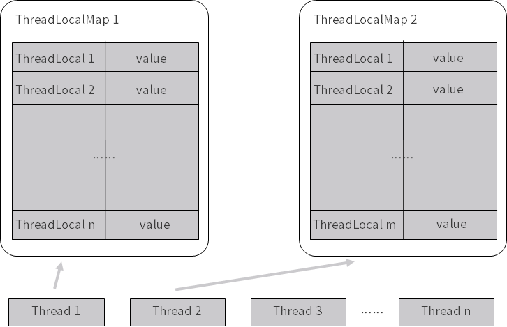

<!DOCTYPE html>
<!-- saved from url=(0046)https://kaiiiz.github.io/hexo-theme-book-demo/ -->
<html xmlns="http://www.w3.org/1999/xhtml">
<head>
    <head>
        <meta http-equiv="Content-Type" content="text/html; charset=UTF-8">
        <meta name="viewport" content="width=device-width, initial-scale=1, maximum-scale=1.0, user-scalable=no">
        <link rel="icon" href="../../static/favicon.png">
        <title>46 多个 ThreadLocal 在 Thread 中的 threadlocals 里是怎么存储的？.md</title>
        <!-- Spectre.css framework -->
        <link rel="stylesheet" href="../../static/index.css">
        <!-- theme css & js -->
        <meta name="generator" content="Hexo 4.2.0">
    </head>

<body>

    

        

            <a href="../../index.html">
                
                技术文章摘抄
            </a>
        

        

            <ul class="uncollapsible">
                <li><a href="../../index.html" class="current-tab">首页</a></li>
            </ul>

            <ul class="uncollapsible">
                <li><a href="../index.html">上一级</a></li>
            </ul>

            <ul class="uncollapsible">
                <li>

                    
                    <a href="00&#32;由点及面，搭建你的&#32;Java&#32;并发知识网.md">00 由点及面，搭建你的 Java 并发知识网.md</a>

                </li>
                <li>

                    
                    <a href="01&#32;为何说只有&#32;1&#32;种实现线程的方法？.md">01 为何说只有 1 种实现线程的方法？.md</a>

                </li>
                <li>

                    
                    <a href="02&#32;如何正确停止线程？为什么&#32;volatile&#32;标记位的停止方法是错误的？.md">02 如何正确停止线程？为什么 volatile 标记位的停止方法是错误的？.md</a>

                </li>
                <li>

                    
                    <a href="03&#32;线程是如何在&#32;6&#32;种状态之间转换的？.md">03 线程是如何在 6 种状态之间转换的？.md</a>

                </li>
                <li>

                    
                    <a href="04&#32;waitnotifynotifyAll&#32;方法的使用注意事项？.md">04 waitnotifynotifyAll 方法的使用注意事项？.md</a>

                </li>
                <li>

                    
                    <a href="05&#32;有哪几种实现生产者消费者模式的方法？.md">05 有哪几种实现生产者消费者模式的方法？.md</a>

                </li>
                <li>

                    
                    <a href="06&#32;一共有哪&#32;3&#32;类线程安全问题？.md">06 一共有哪 3 类线程安全问题？.md</a>

                </li>
                <li>

                    
                    <a href="07&#32;哪些场景需要额外注意线程安全问题？.md">07 哪些场景需要额外注意线程安全问题？.md</a>

                </li>
                <li>

                    
                    <a href="08&#32;为什么多线程会带来性能问题？.md">08 为什么多线程会带来性能问题？.md</a>

                </li>
                <li>

                    
                    <a href="09&#32;使用线程池比手动创建线程好在哪里？.md">09 使用线程池比手动创建线程好在哪里？.md</a>

                </li>
                <li>

                    
                    <a href="10&#32;线程池的各个参数的含义？.md">10 线程池的各个参数的含义？.md</a>

                </li>
                <li>

                    
                    <a href="11&#32;线程池有哪&#32;4&#32;种拒绝策略？.md">11 线程池有哪 4 种拒绝策略？.md</a>

                </li>
                <li>

                    
                    <a href="12&#32;有哪&#32;6&#32;种常见的线程池？什么是&#32;Java8&#32;的&#32;ForkJoinPool？.md">12 有哪 6 种常见的线程池？什么是 Java8 的 ForkJoinPool？.md</a>

                </li>
                <li>

                    
                    <a href="13&#32;线程池常用的阻塞队列有哪些？.md">13 线程池常用的阻塞队列有哪些？.md</a>

                </li>
                <li>

                    
                    <a href="14&#32;为什么不应该自动创建线程池？.md">14 为什么不应该自动创建线程池？.md</a>

                </li>
                <li>

                    
                    <a href="15&#32;合适的线程数量是多少？CPU&#32;核心数和线程数的关系？.md">15 合适的线程数量是多少？CPU 核心数和线程数的关系？.md</a>

                </li>
                <li>

                    
                    <a href="16&#32;如何根据实际需要，定制自己的线程池？.md">16 如何根据实际需要，定制自己的线程池？.md</a>

                </li>
                <li>

                    
                    <a href="17&#32;如何正确关闭线程池？shutdown&#32;和&#32;shutdownNow&#32;的区别？.md">17 如何正确关闭线程池？shutdown 和 shutdownNow 的区别？.md</a>

                </li>
                <li>

                    
                    <a href="18&#32;线程池实现“线程复用”的原理？.md">18 线程池实现“线程复用”的原理？.md</a>

                </li>
                <li>

                    
                    <a href="19&#32;你知道哪几种锁？分别有什么特点？.md">19 你知道哪几种锁？分别有什么特点？.md</a>

                </li>
                <li>

                    
                    <a href="20&#32;悲观锁和乐观锁的本质是什么？.md">20 悲观锁和乐观锁的本质是什么？.md</a>

                </li>
                <li>

                    
                    <a href="21&#32;如何看到&#32;synchronized&#32;背后的“monitor&#32;锁”？.md">21 如何看到 synchronized 背后的“monitor 锁”？.md</a>

                </li>
                <li>

                    
                    <a href="22&#32;synchronized&#32;和&#32;Lock&#32;孰优孰劣，如何选择？.md">22 synchronized 和 Lock 孰优孰劣，如何选择？.md</a>

                </li>
                <li>

                    
                    <a href="23&#32;Lock&#32;有哪几个常用方法？分别有什么用？.md">23 Lock 有哪几个常用方法？分别有什么用？.md</a>

                </li>
                <li>

                    
                    <a href="24&#32;讲一讲公平锁和非公平锁，为什么要“非公平”？.md">24 讲一讲公平锁和非公平锁，为什么要“非公平”？.md</a>

                </li>
                <li>

                    
                    <a href="25&#32;读写锁&#32;ReadWriteLock&#32;获取锁有哪些规则？.md">25 读写锁 ReadWriteLock 获取锁有哪些规则？.md</a>

                </li>
                <li>

                    
                    <a href="26&#32;读锁应该插队吗？什么是读写锁的升降级？.md">26 读锁应该插队吗？什么是读写锁的升降级？.md</a>

                </li>
                <li>

                    
                    <a href="27&#32;什么是自旋锁？自旋的好处和后果是什么呢？.md">27 什么是自旋锁？自旋的好处和后果是什么呢？.md</a>

                </li>
                <li>

                    
                    <a href="28&#32;JVM&#32;对锁进行了哪些优化？.md">28 JVM 对锁进行了哪些优化？.md</a>

                </li>
                <li>

                    
                    <a href="29&#32;HashMap&#32;为什么是线程不安全的？.md">29 HashMap 为什么是线程不安全的？.md</a>

                </li>
                <li>

                    
                    <a href="30&#32;ConcurrentHashMap&#32;在&#32;Java7&#32;和&#32;8&#32;有何不同？.md">30 ConcurrentHashMap 在 Java7 和 8 有何不同？.md</a>

                </li>
                <li>

                    
                    <a href="31&#32;为什么&#32;Map&#32;桶中超过&#32;8&#32;个才转为红黑树？.md">31 为什么 Map 桶中超过 8 个才转为红黑树？.md</a>

                </li>
                <li>

                    
                    <a href="32&#32;同样是线程安全，ConcurrentHashMap&#32;和&#32;Hashtable&#32;的区别.md">32 同样是线程安全，ConcurrentHashMap 和 Hashtable 的区别.md</a>

                </li>
                <li>

                    
                    <a href="33&#32;CopyOnWriteArrayList&#32;有什么特点？.md">33 CopyOnWriteArrayList 有什么特点？.md</a>

                </li>
                <li>

                    
                    <a href="34&#32;什么是阻塞队列？.md">34 什么是阻塞队列？.md</a>

                </li>
                <li>

                    
                    <a href="35&#32;阻塞队列包含哪些常用的方法？add、offer、put&#32;等方法的区别？.md">35 阻塞队列包含哪些常用的方法？add、offer、put 等方法的区别？.md</a>

                </li>
                <li>

                    
                    <a href="36&#32;有哪几种常见的阻塞队列？.md">36 有哪几种常见的阻塞队列？.md</a>

                </li>
                <li>

                    
                    <a href="37&#32;阻塞和非阻塞队列的并发安全原理是什么？.md">37 阻塞和非阻塞队列的并发安全原理是什么？.md</a>

                </li>
                <li>

                    
                    <a href="38&#32;如何选择适合自己的阻塞队列？.md">38 如何选择适合自己的阻塞队列？.md</a>

                </li>
                <li>

                    
                    <a href="39&#32;原子类是如何利用&#32;CAS&#32;保证线程安全的？.md">39 原子类是如何利用 CAS 保证线程安全的？.md</a>

                </li>
                <li>

                    
                    <a href="40&#32;AtomicInteger&#32;在高并发下性能不好，如何解决？为什么？.md">40 AtomicInteger 在高并发下性能不好，如何解决？为什么？.md</a>

                </li>
                <li>

                    
                    <a href="41&#32;原子类和&#32;volatile&#32;有什么异同？.md">41 原子类和 volatile 有什么异同？.md</a>

                </li>
                <li>

                    
                    <a href="42&#32;AtomicInteger&#32;和&#32;synchronized&#32;的异同点？.md">42 AtomicInteger 和 synchronized 的异同点？.md</a>

                </li>
                <li>

                    
                    <a href="43&#32;Java&#32;8&#32;中&#32;Adder&#32;和&#32;Accumulator&#32;有什么区别？.md">43 Java 8 中 Adder 和 Accumulator 有什么区别？.md</a>

                </li>
                <li>

                    
                    <a href="44&#32;ThreadLocal&#32;适合用在哪些实际生产的场景中？.md">44 ThreadLocal 适合用在哪些实际生产的场景中？.md</a>

                </li>
                <li>

                    
                    <a href="45&#32;ThreadLocal&#32;是用来解决共享资源的多线程访问的问题吗？.md">45 ThreadLocal 是用来解决共享资源的多线程访问的问题吗？.md</a>

                </li>
                <li>

                    <a class="current-tab" href="46&#32;多个&#32;ThreadLocal&#32;在&#32;Thread&#32;中的&#32;threadlocals&#32;里是怎么存储的？.md">46 多个 ThreadLocal 在 Thread 中的 threadlocals 里是怎么存储的？.md</a>
                    

                </li>
                <li>

                    
                    <a href="47&#32;内存泄漏——为何每次用完&#32;ThreadLocal&#32;都要调用&#32;remove()？.md">47 内存泄漏——为何每次用完 ThreadLocal 都要调用 remove()？.md</a>

                </li>
                <li>

                    
                    <a href="48&#32;Callable&#32;和&#32;Runnable&#32;的不同？.md">48 Callable 和 Runnable 的不同？.md</a>

                </li>
                <li>

                    
                    <a href="49&#32;Future&#32;的主要功能是什么？.md">49 Future 的主要功能是什么？.md</a>

                </li>
                <li>

                    
                    <a href="50&#32;使用&#32;Future&#32;有哪些注意点？Future&#32;产生新的线程了吗？.md">50 使用 Future 有哪些注意点？Future 产生新的线程了吗？.md</a>

                </li>
                <li>

                    
                    <a href="51&#32;如何利用&#32;CompletableFuture&#32;实现“旅游平台”问题？.md">51 如何利用 CompletableFuture 实现“旅游平台”问题？.md</a>

                </li>
                <li>

                    
                    <a href="52&#32;信号量能被&#32;FixedThreadPool&#32;替代吗？.md">52 信号量能被 FixedThreadPool 替代吗？.md</a>

                </li>
                <li>

                    
                    <a href="53&#32;CountDownLatch&#32;是如何安排线程执行顺序的？.md">53 CountDownLatch 是如何安排线程执行顺序的？.md</a>

                </li>
                <li>

                    
                    <a href="54&#32;CyclicBarrier&#32;和&#32;CountdownLatch&#32;有什么异同？.md">54 CyclicBarrier 和 CountdownLatch 有什么异同？.md</a>

                </li>
                <li>

                    
                    <a href="55&#32;Condition、object.wait()&#32;和&#32;notify()&#32;的关系？.md">55 Condition、object.wait() 和 notify() 的关系？.md</a>

                </li>
                <li>

                    
                    <a href="56&#32;讲一讲什么是&#32;Java&#32;内存模型？.md">56 讲一讲什么是 Java 内存模型？.md</a>

                </li>
                <li>

                    
                    <a href="57&#32;什么是指令重排序？为什么要重排序？.md">57 什么是指令重排序？为什么要重排序？.md</a>

                </li>
                <li>

                    
                    <a href="58&#32;Java&#32;中的原子操作有哪些注意事项？.md">58 Java 中的原子操作有哪些注意事项？.md</a>

                </li>
                <li>

                    
                    <a href="59&#32;什么是“内存可见性”问题？.md">59 什么是“内存可见性”问题？.md</a>

                </li>
                <li>

                    
                    <a href="60&#32;主内存和工作内存的关系？.md">60 主内存和工作内存的关系？.md</a>

                </li>
                <li>

                    
                    <a href="61&#32;什么是&#32;happens-before&#32;规则？.md">61 什么是 happens-before 规则？.md</a>

                </li>
                <li>

                    
                    <a href="62&#32;volatile&#32;的作用是什么？与&#32;synchronized&#32;有什么异同？.md">62 volatile 的作用是什么？与 synchronized 有什么异同？.md</a>

                </li>
                <li>

                    
                    <a href="63&#32;单例模式的双重检查锁模式为什么必须加&#32;volatile？.md">63 单例模式的双重检查锁模式为什么必须加 volatile？.md</a>

                </li>
                <li>

                    
                    <a href="64&#32;你知道什么是&#32;CAS&#32;吗？.md">64 你知道什么是 CAS 吗？.md</a>

                </li>
                <li>

                    
                    <a href="65&#32;CAS&#32;和乐观锁的关系，什么时候会用到&#32;CAS？.md">65 CAS 和乐观锁的关系，什么时候会用到 CAS？.md</a>

                </li>
                <li>

                    
                    <a href="66&#32;CAS&#32;有什么缺点？.md">66 CAS 有什么缺点？.md</a>

                </li>
                <li>

                    
                    <a href="67&#32;如何写一个必然死锁的例子？.md">67 如何写一个必然死锁的例子？.md</a>

                </li>
                <li>

                    
                    <a href="68&#32;发生死锁必须满足哪&#32;4&#32;个条件？.md">68 发生死锁必须满足哪 4 个条件？.md</a>

                </li>
                <li>

                    
                    <a href="69&#32;如何用命令行和代码定位死锁？.md">69 如何用命令行和代码定位死锁？.md</a>

                </li>
                <li>

                    
                    <a href="70&#32;有哪些解决死锁问题的策略？.md">70 有哪些解决死锁问题的策略？.md</a>

                </li>
                <li>

                    
                    <a href="71&#32;讲一讲经典的哲学家就餐问题.md">71 讲一讲经典的哲学家就餐问题.md</a>

                </li>
                <li>

                    
                    <a href="72&#32;final&#32;的三种用法是什么？.md">72 final 的三种用法是什么？.md</a>

                </li>
                <li>

                    
                    <a href="73&#32;为什么加了&#32;final&#32;却依然无法拥有“不变性”？.md">73 为什么加了 final 却依然无法拥有“不变性”？.md</a>

                </li>
                <li>

                    
                    <a href="74&#32;为什么&#32;String&#32;被设计为是不可变的？.md">74 为什么 String 被设计为是不可变的？.md</a>

                </li>
                <li>

                    
                    <a href="75&#32;为什么需要&#32;AQS？AQS&#32;的作用和重要性是什么？.md">75 为什么需要 AQS？AQS 的作用和重要性是什么？.md</a>

                </li>
                <li>

                    
                    <a href="76&#32;AQS&#32;的内部原理是什么样的？.md">76 AQS 的内部原理是什么样的？.md</a>

                </li>
                <li>

                    
                    <a href="77&#32;AQS&#32;在&#32;CountDownLatch&#32;等类中的应用原理是什么？.md">77 AQS 在 CountDownLatch 等类中的应用原理是什么？.md</a>

                </li>
                <li>

                    
                    <a href="78&#32;一份独家的&#32;Java&#32;并发工具图谱.md">78 一份独家的 Java 并发工具图谱.md</a>

                </li>
            </ul>

        

    

    

        

    

    

    

        

            

                

                    <!-- For Responsive Layout -->
                    <header class="navbar">
                        <section class="navbar-section">
                            <a onclick="open_sidebar()">
                                <i class="icon icon-menu"></i>
                            </a>
                        </section>
                    </header>
                

                

                    

                        

                        
<h1>46 多个 ThreadLocal 在 Thread 中的 threadlocals 里是怎么存储的？</h1>

本课时我们主要分析一下在 Thread 中多个 ThreadLocal 是怎么存储的。

<h3>Thread、 ThreadLocal 及 ThreadLocalMap 三者之间的关系</h3>

在讲解本课时之前，先要搞清楚 Thread、 ThreadLocal 及 ThreadLocalMap 三者之间的关系。我们用最直观、最容易理解的图画的方式来看看它们三者的关系：

我们看到最左下角的 Thread 1，这是一个线程，它的箭头指向了  ThreadLocalMap 1，其要表达的意思是，每个 Thread 对象中都持有一个 ThreadLocalMap 类型的成员变量，在这里 Thread 1 所拥有的成员变量就是 ThreadLocalMap 1。

而这个 ThreadLocalMap 自身类似于是一个 Map，里面会有一个个 key value 形式的键值对。那么我们就来看一下它的 key 和 value 分别是什么。可以看到这个表格的左侧是 ThreadLocal 1、ThreadLocal 2…… ThreadLocal n，能看出这里的 key 就是 ThreadLocal 的引用。

而在表格的右侧是一个一个的 value，这就是我们希望 ThreadLocal 存储的内容，例如 user 对象等。

这里需要重点看到它们的数量对应关系：一个 Thread 里面只有一个ThreadLocalMap ，而在一个 ThreadLocalMap 里面却可以有很多的 ThreadLocal，每一个 ThreadLocal 都对应一个 value。因为一个 Thread 是可以调用多个 ThreadLocal 的，所以 Thread 内部就采用了 ThreadLocalMap 这样 Map 的数据结构来存放 ThreadLocal 和 value。

通过这张图片，我们就可以搞清楚 Thread、 ThreadLocal 及 ThreadLocalMap 三者在宏观上的关系了。

<h3>源码分析</h3>

知道了它们的关系之后，我们再来进行源码分析，来进一步地看到它们内部的实现。

<h4>get 方法</h4>

首先我们来看一下 get 方法，源码如下所示：

<pre><code class="language-java">public T get() {

    //获取到当前线程

    Thread t = Thread.currentThread();

    //获取到当前线程内的 ThreadLocalMap 对象，每个线程内都有一个 ThreadLocalMap 对象

    ThreadLocalMap map = getMap(t);

    if (map != null) {

        //获取 ThreadLocalMap 中的 Entry 对象并拿到 Value

        ThreadLocalMap.Entry e = map.getEntry(this);

        if (e != null) {

            @SuppressWarnings(&quot;unchecked&quot;)

            T result = (T)e.value;

            return result;

        }

    }

    //如果线程内之前没创建过 ThreadLocalMap，就创建

    return setInitialValue();

}
</code></pre>

这是 ThreadLocal 的 get 方法，可以看出它利用了 Thread.currentThread 来获取当前线程的引用，并且把这个引用传入到了 getMap 方法里面，来拿到当前线程的 ThreadLocalMap。

然后就是一个 if ( map != null ) 条件语句，那我们先来看看 if (map == null) 的情况，如果 map == null，则说明之前这个线程中没有创建过 ThreadLocalMap，于是就去调用 setInitialValue 来创建；如果 map != null，我们就应该通过 this 这个引用（也就是当前的 ThreadLocal 对象的引用）来获取它所对应的 Entry，同时再通过这个 Entry 拿到里面的 value，最终作为结果返回。

值得注意的是，这里的 ThreadLocalMap 是保存在线程 Thread 类中的，而不是保存在 ThreadLocal 中的。

<h4>getMap 方法</h4>

下面我们来看一下 getMap 方法，源码如下所示：

<pre><code class="language-java">ThreadLocalMap getMap(Thread t) {

    return t.threadLocals;

}
</code></pre>

可以看到，这个方法很清楚地表明了 Thread 和 ThreadLocalMap 的关系，可以看出 ThreadLocalMap 是线程的一个成员变量。这个方法的作用就是获取到当前线程内的 ThreadLocalMap 对象，每个线程都有 ThreadLocalMap 对象，而这个对象的名字就叫作 threadLocals，初始值为 null，代码如下：

<pre><code class="language-java">ThreadLocal.ThreadLocalMap threadLocals = null;
</code></pre>
<h4>set 方法</h4>

下面我们再来看一下 set 方法，源码如下所示：

<pre><code class="language-java">public void set(T value) {

    Thread t = Thread.currentThread();

    ThreadLocalMap map = getMap(t);

    if (map != null)

        map.set(this, value);

    else

        createMap(t, value);

}
</code></pre>

set 方法的作用是把我们想要存储的 value 给保存进去。可以看出，首先，它还是需要获取到当前线程的引用，并且利用这个引用来获取到 ThreadLocalMap ；然后，如果 map == null 则去创建这个 map，而当 map != null 的时候就利用 map.set 方法，把 value 给 set 进去。

可以看出，map.set(this, value)  传入的这两个参数中，第一个参数是 this，就是当前 ThreadLocal 的引用，这也再次体现了，在 ThreadLocalMap 中，它的 key 的类型是 ThreadLocal；而第二个参数就是我们所传入的 value，这样一来就可以把这个键值对保存到 ThreadLocalMap 中去了。

<h4>ThreadLocalMap 类，也就是 Thread.threadLocals</h4>

下面我们来看一下 ThreadLocalMap 这个类，下面这段代码截取自定义在 ThreadLocal 类中的 ThreadLocalMap 类：

<pre><code class="language-java">static class ThreadLocalMap {

    static class Entry extends WeakReference&lt;ThreadLocal&lt;?&gt;&gt; {

        /** The value associated with this ThreadLocal. */

        Object value;

        Entry(ThreadLocal&lt;?&gt; k, Object v) {

            super(k);

            value = v;

        }

    }

   private Entry[] table;

//...

}
</code></pre>

ThreadLocalMap 类是每个线程 Thread 类里面的一个成员变量，其中最重要的就是截取出的这段代码中的 Entry 内部类。在 ThreadLocalMap 中会有一个 Entry 类型的数组，名字叫 table。我们可以把 Entry 理解为一个 map，其键值对为：

<ul>
<li>键，当前的 ThreadLocal；</li>
<li>值，实际需要存储的变量，比如 user 用户对象或者 simpleDateFormat 对象等。</li>
</ul>

ThreadLocalMap 既然类似于 Map，所以就和 HashMap 一样，也会有包括 set、get、rehash、resize 等一系列标准操作。但是，虽然思路和 HashMap 是类似的，但是具体实现会有一些不同。

比如其中一个不同点就是，我们知道 HashMap 在面对 hash 冲突的时候，采用的是拉链法。它会先把对象 hash 到一个对应的格子中，如果有冲突就用链表的形式往下链，如下图所示：

但是 ThreadLocalMap 解决 hash 冲突的方式是不一样的，它采用的是线性探测法。如果发生冲突，并不会用链表的形式往下链，而是会继续寻找下一个空的格子。这是 ThreadLocalMap 和 HashMap 在处理冲突时不一样的点。

以上就是本节课的内容。

在本节课中，我们主要分析了 Thread、 ThreadLocal 和 ThreadLocalMap 这三个非常重要的类的关系。用图画的方式表明了它们之间的关系：一个 Thread 有一个 ThreadLocalMap，而 ThreadLocalMap 的 key 就是一个个的 ThreadLocal，它们就是用这样的关系来存储并维护内容的。之后我们对于 ThreadLocal 的一些重要方法进行了源码分析。

                    

                    

                        

                            <a href="45&#32;ThreadLocal&#32;是用来解决共享资源的多线程访问的问题吗？.md">上一页</a>
                        

                        

                            <a href="47&#32;内存泄漏——为何每次用完&#32;ThreadLocal&#32;都要调用&#32;remove()？.md">下一页</a>
                        

                    

                

            

        

    

    

</body>
<!-- Global site tag (gtag.js) - Google Analytics -->

</html>
