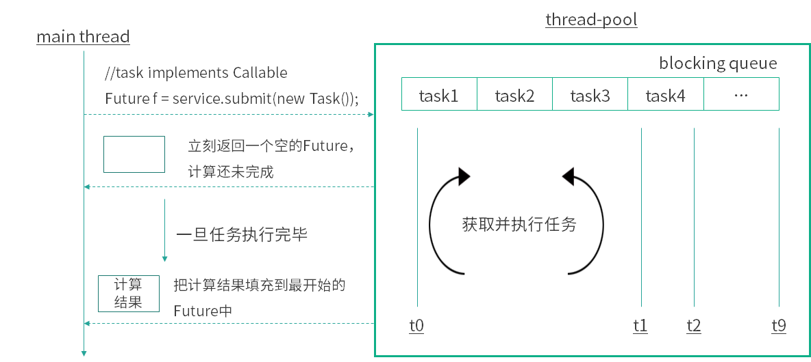

<!DOCTYPE html>
<!-- saved from url=(0046)https://kaiiiz.github.io/hexo-theme-book-demo/ -->
<html xmlns="http://www.w3.org/1999/xhtml">
<head>
    <head>
        <meta http-equiv="Content-Type" content="text/html; charset=UTF-8">
        <meta name="viewport" content="width=device-width, initial-scale=1, maximum-scale=1.0, user-scalable=no">
        <link rel="icon" href="../../static/favicon.png">
        <title>49 Future 的主要功能是什么？.md</title>
        <!-- Spectre.css framework -->
        <link rel="stylesheet" href="../../static/index.css">
        <!-- theme css & js -->
        <meta name="generator" content="Hexo 4.2.0">
    </head>

<body>

    

        

            <a href="../../index.html">
                
                技术文章摘抄
            </a>
        

        

            <ul class="uncollapsible">
                <li><a href="../../index.html" class="current-tab">首页</a></li>
            </ul>

            <ul class="uncollapsible">
                <li><a href="../index.html">上一级</a></li>
            </ul>

            <ul class="uncollapsible">
                <li>

                    
                    <a href="00&#32;由点及面，搭建你的&#32;Java&#32;并发知识网.md">00 由点及面，搭建你的 Java 并发知识网.md</a>

                </li>
                <li>

                    
                    <a href="01&#32;为何说只有&#32;1&#32;种实现线程的方法？.md">01 为何说只有 1 种实现线程的方法？.md</a>

                </li>
                <li>

                    
                    <a href="02&#32;如何正确停止线程？为什么&#32;volatile&#32;标记位的停止方法是错误的？.md">02 如何正确停止线程？为什么 volatile 标记位的停止方法是错误的？.md</a>

                </li>
                <li>

                    
                    <a href="03&#32;线程是如何在&#32;6&#32;种状态之间转换的？.md">03 线程是如何在 6 种状态之间转换的？.md</a>

                </li>
                <li>

                    
                    <a href="04&#32;waitnotifynotifyAll&#32;方法的使用注意事项？.md">04 waitnotifynotifyAll 方法的使用注意事项？.md</a>

                </li>
                <li>

                    
                    <a href="05&#32;有哪几种实现生产者消费者模式的方法？.md">05 有哪几种实现生产者消费者模式的方法？.md</a>

                </li>
                <li>

                    
                    <a href="06&#32;一共有哪&#32;3&#32;类线程安全问题？.md">06 一共有哪 3 类线程安全问题？.md</a>

                </li>
                <li>

                    
                    <a href="07&#32;哪些场景需要额外注意线程安全问题？.md">07 哪些场景需要额外注意线程安全问题？.md</a>

                </li>
                <li>

                    
                    <a href="08&#32;为什么多线程会带来性能问题？.md">08 为什么多线程会带来性能问题？.md</a>

                </li>
                <li>

                    
                    <a href="09&#32;使用线程池比手动创建线程好在哪里？.md">09 使用线程池比手动创建线程好在哪里？.md</a>

                </li>
                <li>

                    
                    <a href="10&#32;线程池的各个参数的含义？.md">10 线程池的各个参数的含义？.md</a>

                </li>
                <li>

                    
                    <a href="11&#32;线程池有哪&#32;4&#32;种拒绝策略？.md">11 线程池有哪 4 种拒绝策略？.md</a>

                </li>
                <li>

                    
                    <a href="12&#32;有哪&#32;6&#32;种常见的线程池？什么是&#32;Java8&#32;的&#32;ForkJoinPool？.md">12 有哪 6 种常见的线程池？什么是 Java8 的 ForkJoinPool？.md</a>

                </li>
                <li>

                    
                    <a href="13&#32;线程池常用的阻塞队列有哪些？.md">13 线程池常用的阻塞队列有哪些？.md</a>

                </li>
                <li>

                    
                    <a href="14&#32;为什么不应该自动创建线程池？.md">14 为什么不应该自动创建线程池？.md</a>

                </li>
                <li>

                    
                    <a href="15&#32;合适的线程数量是多少？CPU&#32;核心数和线程数的关系？.md">15 合适的线程数量是多少？CPU 核心数和线程数的关系？.md</a>

                </li>
                <li>

                    
                    <a href="16&#32;如何根据实际需要，定制自己的线程池？.md">16 如何根据实际需要，定制自己的线程池？.md</a>

                </li>
                <li>

                    
                    <a href="17&#32;如何正确关闭线程池？shutdown&#32;和&#32;shutdownNow&#32;的区别？.md">17 如何正确关闭线程池？shutdown 和 shutdownNow 的区别？.md</a>

                </li>
                <li>

                    
                    <a href="18&#32;线程池实现“线程复用”的原理？.md">18 线程池实现“线程复用”的原理？.md</a>

                </li>
                <li>

                    
                    <a href="19&#32;你知道哪几种锁？分别有什么特点？.md">19 你知道哪几种锁？分别有什么特点？.md</a>

                </li>
                <li>

                    
                    <a href="20&#32;悲观锁和乐观锁的本质是什么？.md">20 悲观锁和乐观锁的本质是什么？.md</a>

                </li>
                <li>

                    
                    <a href="21&#32;如何看到&#32;synchronized&#32;背后的“monitor&#32;锁”？.md">21 如何看到 synchronized 背后的“monitor 锁”？.md</a>

                </li>
                <li>

                    
                    <a href="22&#32;synchronized&#32;和&#32;Lock&#32;孰优孰劣，如何选择？.md">22 synchronized 和 Lock 孰优孰劣，如何选择？.md</a>

                </li>
                <li>

                    
                    <a href="23&#32;Lock&#32;有哪几个常用方法？分别有什么用？.md">23 Lock 有哪几个常用方法？分别有什么用？.md</a>

                </li>
                <li>

                    
                    <a href="24&#32;讲一讲公平锁和非公平锁，为什么要“非公平”？.md">24 讲一讲公平锁和非公平锁，为什么要“非公平”？.md</a>

                </li>
                <li>

                    
                    <a href="25&#32;读写锁&#32;ReadWriteLock&#32;获取锁有哪些规则？.md">25 读写锁 ReadWriteLock 获取锁有哪些规则？.md</a>

                </li>
                <li>

                    
                    <a href="26&#32;读锁应该插队吗？什么是读写锁的升降级？.md">26 读锁应该插队吗？什么是读写锁的升降级？.md</a>

                </li>
                <li>

                    
                    <a href="27&#32;什么是自旋锁？自旋的好处和后果是什么呢？.md">27 什么是自旋锁？自旋的好处和后果是什么呢？.md</a>

                </li>
                <li>

                    
                    <a href="28&#32;JVM&#32;对锁进行了哪些优化？.md">28 JVM 对锁进行了哪些优化？.md</a>

                </li>
                <li>

                    
                    <a href="29&#32;HashMap&#32;为什么是线程不安全的？.md">29 HashMap 为什么是线程不安全的？.md</a>

                </li>
                <li>

                    
                    <a href="30&#32;ConcurrentHashMap&#32;在&#32;Java7&#32;和&#32;8&#32;有何不同？.md">30 ConcurrentHashMap 在 Java7 和 8 有何不同？.md</a>

                </li>
                <li>

                    
                    <a href="31&#32;为什么&#32;Map&#32;桶中超过&#32;8&#32;个才转为红黑树？.md">31 为什么 Map 桶中超过 8 个才转为红黑树？.md</a>

                </li>
                <li>

                    
                    <a href="32&#32;同样是线程安全，ConcurrentHashMap&#32;和&#32;Hashtable&#32;的区别.md">32 同样是线程安全，ConcurrentHashMap 和 Hashtable 的区别.md</a>

                </li>
                <li>

                    
                    <a href="33&#32;CopyOnWriteArrayList&#32;有什么特点？.md">33 CopyOnWriteArrayList 有什么特点？.md</a>

                </li>
                <li>

                    
                    <a href="34&#32;什么是阻塞队列？.md">34 什么是阻塞队列？.md</a>

                </li>
                <li>

                    
                    <a href="35&#32;阻塞队列包含哪些常用的方法？add、offer、put&#32;等方法的区别？.md">35 阻塞队列包含哪些常用的方法？add、offer、put 等方法的区别？.md</a>

                </li>
                <li>

                    
                    <a href="36&#32;有哪几种常见的阻塞队列？.md">36 有哪几种常见的阻塞队列？.md</a>

                </li>
                <li>

                    
                    <a href="37&#32;阻塞和非阻塞队列的并发安全原理是什么？.md">37 阻塞和非阻塞队列的并发安全原理是什么？.md</a>

                </li>
                <li>

                    
                    <a href="38&#32;如何选择适合自己的阻塞队列？.md">38 如何选择适合自己的阻塞队列？.md</a>

                </li>
                <li>

                    
                    <a href="39&#32;原子类是如何利用&#32;CAS&#32;保证线程安全的？.md">39 原子类是如何利用 CAS 保证线程安全的？.md</a>

                </li>
                <li>

                    
                    <a href="40&#32;AtomicInteger&#32;在高并发下性能不好，如何解决？为什么？.md">40 AtomicInteger 在高并发下性能不好，如何解决？为什么？.md</a>

                </li>
                <li>

                    
                    <a href="41&#32;原子类和&#32;volatile&#32;有什么异同？.md">41 原子类和 volatile 有什么异同？.md</a>

                </li>
                <li>

                    
                    <a href="42&#32;AtomicInteger&#32;和&#32;synchronized&#32;的异同点？.md">42 AtomicInteger 和 synchronized 的异同点？.md</a>

                </li>
                <li>

                    
                    <a href="43&#32;Java&#32;8&#32;中&#32;Adder&#32;和&#32;Accumulator&#32;有什么区别？.md">43 Java 8 中 Adder 和 Accumulator 有什么区别？.md</a>

                </li>
                <li>

                    
                    <a href="44&#32;ThreadLocal&#32;适合用在哪些实际生产的场景中？.md">44 ThreadLocal 适合用在哪些实际生产的场景中？.md</a>

                </li>
                <li>

                    
                    <a href="45&#32;ThreadLocal&#32;是用来解决共享资源的多线程访问的问题吗？.md">45 ThreadLocal 是用来解决共享资源的多线程访问的问题吗？.md</a>

                </li>
                <li>

                    
                    <a href="46&#32;多个&#32;ThreadLocal&#32;在&#32;Thread&#32;中的&#32;threadlocals&#32;里是怎么存储的？.md">46 多个 ThreadLocal 在 Thread 中的 threadlocals 里是怎么存储的？.md</a>

                </li>
                <li>

                    
                    <a href="47&#32;内存泄漏——为何每次用完&#32;ThreadLocal&#32;都要调用&#32;remove()？.md">47 内存泄漏——为何每次用完 ThreadLocal 都要调用 remove()？.md</a>

                </li>
                <li>

                    
                    <a href="48&#32;Callable&#32;和&#32;Runnable&#32;的不同？.md">48 Callable 和 Runnable 的不同？.md</a>

                </li>
                <li>

                    <a class="current-tab" href="49&#32;Future&#32;的主要功能是什么？.md">49 Future 的主要功能是什么？.md</a>
                    

                </li>
                <li>

                    
                    <a href="50&#32;使用&#32;Future&#32;有哪些注意点？Future&#32;产生新的线程了吗？.md">50 使用 Future 有哪些注意点？Future 产生新的线程了吗？.md</a>

                </li>
                <li>

                    
                    <a href="51&#32;如何利用&#32;CompletableFuture&#32;实现“旅游平台”问题？.md">51 如何利用 CompletableFuture 实现“旅游平台”问题？.md</a>

                </li>
                <li>

                    
                    <a href="52&#32;信号量能被&#32;FixedThreadPool&#32;替代吗？.md">52 信号量能被 FixedThreadPool 替代吗？.md</a>

                </li>
                <li>

                    
                    <a href="53&#32;CountDownLatch&#32;是如何安排线程执行顺序的？.md">53 CountDownLatch 是如何安排线程执行顺序的？.md</a>

                </li>
                <li>

                    
                    <a href="54&#32;CyclicBarrier&#32;和&#32;CountdownLatch&#32;有什么异同？.md">54 CyclicBarrier 和 CountdownLatch 有什么异同？.md</a>

                </li>
                <li>

                    
                    <a href="55&#32;Condition、object.wait()&#32;和&#32;notify()&#32;的关系？.md">55 Condition、object.wait() 和 notify() 的关系？.md</a>

                </li>
                <li>

                    
                    <a href="56&#32;讲一讲什么是&#32;Java&#32;内存模型？.md">56 讲一讲什么是 Java 内存模型？.md</a>

                </li>
                <li>

                    
                    <a href="57&#32;什么是指令重排序？为什么要重排序？.md">57 什么是指令重排序？为什么要重排序？.md</a>

                </li>
                <li>

                    
                    <a href="58&#32;Java&#32;中的原子操作有哪些注意事项？.md">58 Java 中的原子操作有哪些注意事项？.md</a>

                </li>
                <li>

                    
                    <a href="59&#32;什么是“内存可见性”问题？.md">59 什么是“内存可见性”问题？.md</a>

                </li>
                <li>

                    
                    <a href="60&#32;主内存和工作内存的关系？.md">60 主内存和工作内存的关系？.md</a>

                </li>
                <li>

                    
                    <a href="61&#32;什么是&#32;happens-before&#32;规则？.md">61 什么是 happens-before 规则？.md</a>

                </li>
                <li>

                    
                    <a href="62&#32;volatile&#32;的作用是什么？与&#32;synchronized&#32;有什么异同？.md">62 volatile 的作用是什么？与 synchronized 有什么异同？.md</a>

                </li>
                <li>

                    
                    <a href="63&#32;单例模式的双重检查锁模式为什么必须加&#32;volatile？.md">63 单例模式的双重检查锁模式为什么必须加 volatile？.md</a>

                </li>
                <li>

                    
                    <a href="64&#32;你知道什么是&#32;CAS&#32;吗？.md">64 你知道什么是 CAS 吗？.md</a>

                </li>
                <li>

                    
                    <a href="65&#32;CAS&#32;和乐观锁的关系，什么时候会用到&#32;CAS？.md">65 CAS 和乐观锁的关系，什么时候会用到 CAS？.md</a>

                </li>
                <li>

                    
                    <a href="66&#32;CAS&#32;有什么缺点？.md">66 CAS 有什么缺点？.md</a>

                </li>
                <li>

                    
                    <a href="67&#32;如何写一个必然死锁的例子？.md">67 如何写一个必然死锁的例子？.md</a>

                </li>
                <li>

                    
                    <a href="68&#32;发生死锁必须满足哪&#32;4&#32;个条件？.md">68 发生死锁必须满足哪 4 个条件？.md</a>

                </li>
                <li>

                    
                    <a href="69&#32;如何用命令行和代码定位死锁？.md">69 如何用命令行和代码定位死锁？.md</a>

                </li>
                <li>

                    
                    <a href="70&#32;有哪些解决死锁问题的策略？.md">70 有哪些解决死锁问题的策略？.md</a>

                </li>
                <li>

                    
                    <a href="71&#32;讲一讲经典的哲学家就餐问题.md">71 讲一讲经典的哲学家就餐问题.md</a>

                </li>
                <li>

                    
                    <a href="72&#32;final&#32;的三种用法是什么？.md">72 final 的三种用法是什么？.md</a>

                </li>
                <li>

                    
                    <a href="73&#32;为什么加了&#32;final&#32;却依然无法拥有“不变性”？.md">73 为什么加了 final 却依然无法拥有“不变性”？.md</a>

                </li>
                <li>

                    
                    <a href="74&#32;为什么&#32;String&#32;被设计为是不可变的？.md">74 为什么 String 被设计为是不可变的？.md</a>

                </li>
                <li>

                    
                    <a href="75&#32;为什么需要&#32;AQS？AQS&#32;的作用和重要性是什么？.md">75 为什么需要 AQS？AQS 的作用和重要性是什么？.md</a>

                </li>
                <li>

                    
                    <a href="76&#32;AQS&#32;的内部原理是什么样的？.md">76 AQS 的内部原理是什么样的？.md</a>

                </li>
                <li>

                    
                    <a href="77&#32;AQS&#32;在&#32;CountDownLatch&#32;等类中的应用原理是什么？.md">77 AQS 在 CountDownLatch 等类中的应用原理是什么？.md</a>

                </li>
                <li>

                    
                    <a href="78&#32;一份独家的&#32;Java&#32;并发工具图谱.md">78 一份独家的 Java 并发工具图谱.md</a>

                </li>
            </ul>

        

    

    

        

    

    

    

        

            

                

                    <!-- For Responsive Layout -->
                    <header class="navbar">
                        <section class="navbar-section">
                            <a onclick="open_sidebar()">
                                <i class="icon icon-menu"></i>
                            </a>
                        </section>
                    </header>
                

                

                    

                        

                        
<h1>49 Future 的主要功能是什么？</h1>

在本课时我们将讲解 Future 的主要功能是什么。

<h3>Future 类</h3>
<h4>Future 的作用</h4>

Future 最主要的作用是，比如当做一定运算的时候，运算过程可能比较耗时，有时会去查数据库，或是繁重的计算，比如压缩、加密等，在这种情况下，如果我们一直在原地等待方法返回，显然是不明智的，整体程序的运行效率会大大降低。我们可以把运算的过程放到子线程去执行，再通过 Future 去控制子线程执行的计算过程，最后获取到计算结果。这样一来就可以把整个程序的运行效率提高，是一种异步的思想。

<h4>Callable 和 Future 的关系</h4>

接下来我们介绍下 Callable 和 Future 的关系，前面讲过，Callable 接口相比于 Runnable 的一大优势是可以有返回结果，那这个返回结果怎么获取呢？就可以用 Future 类的 get 方法来获取 。因此，Future 相当于一个存储器，它存储了 Callable 的 call 方法的任务结果。除此之外，我们还可以通过 Future 的 isDone 方法来判断任务是否已经执行完毕了，还可以通过 cancel 方法取消这个任务，或限时获取任务的结果等，总之 Future 的功能比较丰富。有了这样一个从宏观上的概念之后，我们就来具体看一下 Future 类的主要方法。

<h4>Future 的方法和用法</h4>

首先看一下 Future 接口的代码，一共有 5 个方法，代码如下所示：

<pre><code class="language-java">public interface Future&lt;V&gt; {

    boolean cancel(boolean mayInterruptIfRunning);

    boolean isCancelled();

    boolean isDone();

    V get() throws InterruptedException, ExecutionException;

    V get(long timeout, TimeUnit unit)

        throws InterruptedException, ExecutionException, TimeoutExceptio

}
</code></pre>

其中，第 5 个方法是对第 4 个方法的重载，方法名一样，但是参数不一样。

<h4>get() 方法：获取结果</h4>

get 方法最主要的作用就是获取任务执行的结果，该方法在执行时的行为取决于 Callable 任务的状态，可能会发生以下 5 种情况。

（1）最常见的就是<strong>当执行 get 的时候，任务已经执行完毕了</strong>，可以立刻返回，获取到任务执行的结果。

（2）<strong>任务还没有结果</strong>，这是有可能的，比如我们往线程池中放一个任务，线程池中可能积压了很多任务，还没轮到我去执行的时候，就去 get 了，在这种情况下，相当于任务还没开始；还有一种情况是<strong>任务正在执行中</strong>，但是执行过程比较长，所以我去 get 的时候，它依然在执行的过程中。无论是任务还没开始或在进行中，我们去调用 get 的时候，都会把当前的线程阻塞，直到任务完成再把结果返回回来。

（3）<strong>任务执行过程中抛出异常</strong>，一旦这样，我们再去调用 get 的时候，就会抛出 ExecutionException 异常，不管我们执行 call 方法时里面抛出的异常类型是什么，在执行 get 方法时所获得的异常都是 ExecutionException。

（4）<strong>任务被取消了</strong>，如果任务被取消，我们用 get 方法去获取结果时则会抛出 CancellationException。

（5）<strong>任务超时</strong>，我们知道 get 方法有一个重载方法，那就是带延迟参数的，调用了这个带延迟参数的 get 方法之后，如果 call 方法在规定时间内正常顺利完成了任务，那么 get 会正常返回；但是如果到达了指定时间依然没有完成任务，get 方法则会抛出 TimeoutException，代表超时了。

下面用图的形式让过程更清晰：

在图中，右侧是一个线程池，线程池中有一些线程来执行任务。重点在图的左侧，可以看到有一个 submit 方法，该方法往线程池中提交了一个 Task，这个 Task 实现了 Callable 接口，当我们去给线程池提交这个任务的时候，调用 submit 方法会立刻返回一个 Future 类型的对象，这个对象目前内容是空的，其中还不包含计算结果，因为此时计算还没有完成。

当计算一旦完成时，也就是当我们可以获取结果的时候，线程池便会把这个结果填入到之前返回的 Future 中去（也就是 f 对象），而不是在此时新建一个新的 Future。这时就可以利用 Future 的 get 方法来获取到任务的执行结果了。

我们来看一个代码示例：

<pre><code class="language-java">/**

 * 描述：     演示一个 Future 的使用方法

 */

public class OneFuture {

    public static void main(String[] args) {

        ExecutorService service = Executors.newFixedThreadPool(10);

        Future&lt;Integer&gt; future = service.submit(new CallableTask());

        try {

            System.out.println(future.get());

        } catch (InterruptedException e) {

            e.printStackTrace();

        } catch (ExecutionException e) {

            e.printStackTrace();

        }

        service.shutdown();

    }

    static class CallableTask implements Callable&lt;Integer&gt; {

        @Override

        public Integer call() throws Exception {

            Thread.sleep(3000);

            return new Random().nextInt();

        }

    }

}
</code></pre>

在这段代码中，main 方法新建了一个 10 个线程的线程池，并且用 submit 方法把一个任务提交进去。这个任务如代码的最下方所示，它实现了 Callable 接口，它所做的内容就是先休眠三秒钟，然后返回一个随机数。接下来我们就直接把 future.get 结果打印出来，其结果是正常打印出一个随机数，比如 100192 等。这段代码对应了我们刚才那个图示的讲解，这也是 Future 最常用的一种用法。

<h4>isDone() 方法：判断是否执行完毕</h4>

下面我们再接着看看 Future 的一些其他方法，比如说 isDone() 方法，该方法是用来判断当前这个任务是否执行完毕了。

<strong>需要注意的是</strong>，这个方法如果返回 true 则代表执行完成了；如果返回 false 则代表还没完成。但这里如果返回 true，并不代表这个任务是成功执行的，比如说任务执行到一半抛出了异常。那么在这种情况下，对于这个 isDone 方法而言，它其实也是会返回 true 的，因为对它来说，虽然有异常发生了，但是这个任务在未来也不会再被执行，它确实已经执行完毕了。所以 isDone 方法在返回 true 的时候，不代表这个任务是成功执行的，只代表它执行完毕了。

我们用一个代码示例来看一看，代码如下所示：

<pre><code class="language-java">public class GetException {

    public static void main(String[] args) {

        ExecutorService service = Executors.newFixedThreadPool(20);

        Future&lt;Integer&gt; future = service.submit(new CallableTask());

        try {

            for (int i = 0; i &lt; 5; i++) {

                System.out.println(i);

                Thread.sleep(500);

            }

            System.out.println(future.isDone());

            future.get();

        } catch (InterruptedException e) {

            e.printStackTrace();

        } catch (ExecutionException e) {

            e.printStackTrace();

        }

    }

    static class CallableTask implements Callable&lt;Integer&gt; {

        @Override

        public Integer call() throws Exception {

            throw new IllegalArgumentException(&quot;Callable抛出异常&quot;);

        }

    }

}
</code></pre>

在这段代码中，可以看到有一个线程池，并且往线程池中去提交任务，这个任务会直接抛出一个异常。那么接下来我们就用一个 for 循环去休眠，同时让它慢慢打印出 0 ~ 4 这 5 个数字，这样做的目的是起到了一定的延迟作用。在这个执行完毕之后，再去调用 isDone() 方法，并且把这个结果打印出来，然后再去调用 future.get()。

这段代码的执行结果是这样的：

<pre><code class="language-java">0

1

2

3

4

true

java.util.concurrent.ExecutionException: java.lang.IllegalArgumentException: Callable抛出异常

...
</code></pre>

<strong>这里要注意</strong>，我们知道这个异常实际上是在任务刚被执行的时候就抛出了，因为我们的计算任务中是没有其他逻辑的，只有抛出异常。我们再来看，控制台是什么时候打印出异常的呢？它是在 true 打印完毕后才打印出异常信息的，也就是说，在调用 get 方法时打印出的异常。

<strong>这段代码证明了三件事情</strong>：第一件事情，即便任务抛出异常，isDone 方法依然会返回 true；第二件事情，虽然抛出的异常是 IllegalArgumentException，但是对于 get 而言，它抛出的异常依然是 ExecutionException；第三个事情，虽然在任务执行一开始时就抛出了异常，但是真正要等到我们执行 get 的时候，才看到了异常。

<h4>cancel 方法：取消任务的执行</h4>

下面我们再来看一下 cancel 方法，如果不想执行某个任务了，则可以使用 cancel 方法，会有以下三种情况：

第一种情况最简单，那就是当任务还没有开始执行时，一旦调用 cancel，这个任务就会被正常取消，未来也不会被执行，那么 cancel 方法返回 true。

第二种情况也比较简单。如果任务已经完成，或者之前已经被取消过了，那么执行 cancel 方法则代表取消失败，返回 false。因为任务无论是已完成还是已经被取消过了，都不能再被取消了。

第三种情况比较特殊，就是这个任务正在执行，这个时候执行 cancel 方法是不会直接取消这个任务的，而是会根据我们传入的参数做判断。cancel 方法是必须传入一个参数，该参数叫作  <strong>mayInterruptIfRunning</strong>，它是什么含义呢？如果传入的参数是 true，执行任务的线程就会收到一个中断的信号，正在执行的任务可能会有一些处理中断的逻辑，进而停止，这个比较好理解。如果传入的是 false 则就代表不中断正在运行的任务，也就是说，本次 cancel 不会有任何效果，同时 cancel 方法会返回 false。

那么如何选择传入 true 还是 false 呢？

传入 true 适用的情况是，明确知道这个任务能够处理中断。

传入 false 适用于什么情况呢？

<ul>
<li>如果我们明确知道这个线程不能处理中断，那应该传入 false。</li>
<li>我们不知道这个任务是否支持取消（是否能响应中断），因为在大多数情况下代码是多人协作的，对于这个任务是否支持中断，我们不一定有十足的把握，那么在这种情况下也应该传入 false。</li>
<li>如果这个任务一旦开始运行，我们就希望它完全的执行完毕。在这种情况下，也应该传入 false。</li>
</ul>

这就是传入 true 和 false 的不同含义和选择方法。

<h4>isCancelled() 方法：判断是否被取消</h4>

最后一个方法是 isCancelled 方法，判断是否被取消，它和 cancel 方法配合使用，比较简单。

以上就是关于 Future 的主要方法的介绍了。

<h4>用 FutureTask 来创建 Future</h4>

除了用线程池的 submit 方法会返回一个 future 对象之外，同样还可以用 FutureTask 来获取 Future 类和任务的结果。

FutureTask 首先是一个任务（Task），然后具有 Future 接口的语义，因为它可以在将来（Future）得到执行的结果。

我们来看一下 FutureTask 的代码实现：

<pre><code class="language-java">public class FutureTask&lt;V&gt; implements RunnableFuture&lt;V&gt;{

 ...

}
</code></pre>

可以看到，它实现了一个接口，这个接口叫作 <strong>RunnableFuture</strong>。我们再来看一下 RunnableFuture 接口的代码实现：

<pre><code class="language-java">public interface RunnableFuture&lt;V&gt; extends Runnable, Future&lt;V&gt; {

    void run();

}
</code></pre>

可以看出，它是 extends Runnable 和 Future 这两个接口的，它们的关系如下图所示：

既然 RunnableFuture 继承了 Runnable 接口和 Future 接口，而 FutureTask 又实现了 RunnableFuture 接口，所以 FutureTask 既可以作为 Runnable 被线程执行，又可以作为 Future 得到 Callable 的返回值。

典型用法是，把 Callable 实例当作 FutureTask 构造函数的参数，生成 FutureTask 的对象，然后把这个对象当作一个 Runnable 对象，放到线程池中或另起线程去执行，最后还可以通过 FutureTask 获取任务执行的结果。

下面我们就用代码来演示一下：

<pre><code class="language-java">/**

 * 描述：     演示 FutureTask 的用法

 */

public class FutureTaskDemo {

    public static void main(String[] args) {

        Task task = new Task();

        FutureTask&lt;Integer&gt; integerFutureTask = new FutureTask&lt;&gt;(task);

        new Thread(integerFutureTask).start();

        try {

            System.out.println(&quot;task运行结果：&quot;+integerFutureTask.get());

        } catch (InterruptedException e) {

            e.printStackTrace();

        } catch (ExecutionException e) {

            e.printStackTrace();

        }

    }

}

class Task implements Callable&lt;Integer&gt; {

    @Override

    public Integer call() throws Exception {

        System.out.println(&quot;子线程正在计算&quot;);

        int sum = 0;

        for (int i = 0; i &lt; 100; i++) {

            sum += i;

        }

        return sum;

    }

}
</code></pre>

在这段代码中可以看出，首先创建了一个实现了 Callable 接口的 Task，然后把这个 Task 实例传入到 FutureTask 的构造函数中去，创建了一个 FutureTask 实例，并且把这个实例当作一个 Runnable 放到 new Thread() 中去执行，最后再用 FutureTask 的 get 得到结果，并打印出来。

执行结果是 4950，正是任务里 0+1+2+...+99 的结果。

<h3>总结</h3>

最后对本课时进行一下总结，在本课时中，我们首先在宏观上讲解了 Future 的作用，然后讲解了 Callable 和 Future 的关系，接着对于 Future 的各个方法进行了详细介绍，最后还给出了 FutureTask 这种方法来创建 Future 的用法。

                    

                    

                        

                            <a href="48&#32;Callable&#32;和&#32;Runnable&#32;的不同？.md">上一页</a>
                        

                        

                            <a href="50&#32;使用&#32;Future&#32;有哪些注意点？Future&#32;产生新的线程了吗？.md">下一页</a>
                        

                    

                

            

        

    

    

</body>
<!-- Global site tag (gtag.js) - Google Analytics -->

</html>
