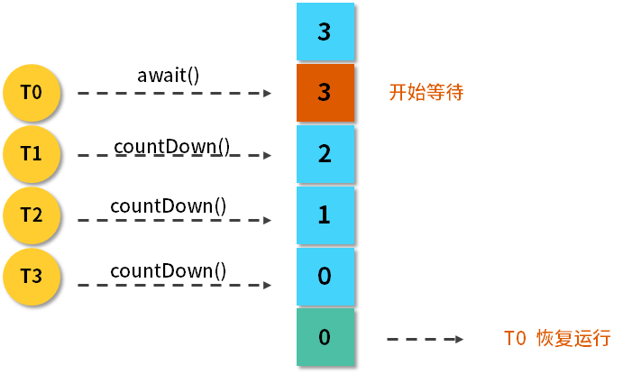

<!DOCTYPE html>
<!-- saved from url=(0046)https://kaiiiz.github.io/hexo-theme-book-demo/ -->
<html xmlns="http://www.w3.org/1999/xhtml">
<head>
    <head>
        <meta http-equiv="Content-Type" content="text/html; charset=UTF-8">
        <meta name="viewport" content="width=device-width, initial-scale=1, maximum-scale=1.0, user-scalable=no">
        <link rel="icon" href="../../static/favicon.png">
        <title>53 CountDownLatch 是如何安排线程执行顺序的？.md</title>
        <!-- Spectre.css framework -->
        <link rel="stylesheet" href="../../static/index.css">
        <!-- theme css & js -->
        <meta name="generator" content="Hexo 4.2.0">
    </head>

<body>

    

        

            <a href="../../index.html">
                
                技术文章摘抄
            </a>
        

        

            <ul class="uncollapsible">
                <li><a href="../../index.html" class="current-tab">首页</a></li>
            </ul>

            <ul class="uncollapsible">
                <li><a href="../index.html">上一级</a></li>
            </ul>

            <ul class="uncollapsible">
                <li>

                    
                    <a href="00&#32;由点及面，搭建你的&#32;Java&#32;并发知识网.md">00 由点及面，搭建你的 Java 并发知识网.md</a>

                </li>
                <li>

                    
                    <a href="01&#32;为何说只有&#32;1&#32;种实现线程的方法？.md">01 为何说只有 1 种实现线程的方法？.md</a>

                </li>
                <li>

                    
                    <a href="02&#32;如何正确停止线程？为什么&#32;volatile&#32;标记位的停止方法是错误的？.md">02 如何正确停止线程？为什么 volatile 标记位的停止方法是错误的？.md</a>

                </li>
                <li>

                    
                    <a href="03&#32;线程是如何在&#32;6&#32;种状态之间转换的？.md">03 线程是如何在 6 种状态之间转换的？.md</a>

                </li>
                <li>

                    
                    <a href="04&#32;waitnotifynotifyAll&#32;方法的使用注意事项？.md">04 waitnotifynotifyAll 方法的使用注意事项？.md</a>

                </li>
                <li>

                    
                    <a href="05&#32;有哪几种实现生产者消费者模式的方法？.md">05 有哪几种实现生产者消费者模式的方法？.md</a>

                </li>
                <li>

                    
                    <a href="06&#32;一共有哪&#32;3&#32;类线程安全问题？.md">06 一共有哪 3 类线程安全问题？.md</a>

                </li>
                <li>

                    
                    <a href="07&#32;哪些场景需要额外注意线程安全问题？.md">07 哪些场景需要额外注意线程安全问题？.md</a>

                </li>
                <li>

                    
                    <a href="08&#32;为什么多线程会带来性能问题？.md">08 为什么多线程会带来性能问题？.md</a>

                </li>
                <li>

                    
                    <a href="09&#32;使用线程池比手动创建线程好在哪里？.md">09 使用线程池比手动创建线程好在哪里？.md</a>

                </li>
                <li>

                    
                    <a href="10&#32;线程池的各个参数的含义？.md">10 线程池的各个参数的含义？.md</a>

                </li>
                <li>

                    
                    <a href="11&#32;线程池有哪&#32;4&#32;种拒绝策略？.md">11 线程池有哪 4 种拒绝策略？.md</a>

                </li>
                <li>

                    
                    <a href="12&#32;有哪&#32;6&#32;种常见的线程池？什么是&#32;Java8&#32;的&#32;ForkJoinPool？.md">12 有哪 6 种常见的线程池？什么是 Java8 的 ForkJoinPool？.md</a>

                </li>
                <li>

                    
                    <a href="13&#32;线程池常用的阻塞队列有哪些？.md">13 线程池常用的阻塞队列有哪些？.md</a>

                </li>
                <li>

                    
                    <a href="14&#32;为什么不应该自动创建线程池？.md">14 为什么不应该自动创建线程池？.md</a>

                </li>
                <li>

                    
                    <a href="15&#32;合适的线程数量是多少？CPU&#32;核心数和线程数的关系？.md">15 合适的线程数量是多少？CPU 核心数和线程数的关系？.md</a>

                </li>
                <li>

                    
                    <a href="16&#32;如何根据实际需要，定制自己的线程池？.md">16 如何根据实际需要，定制自己的线程池？.md</a>

                </li>
                <li>

                    
                    <a href="17&#32;如何正确关闭线程池？shutdown&#32;和&#32;shutdownNow&#32;的区别？.md">17 如何正确关闭线程池？shutdown 和 shutdownNow 的区别？.md</a>

                </li>
                <li>

                    
                    <a href="18&#32;线程池实现“线程复用”的原理？.md">18 线程池实现“线程复用”的原理？.md</a>

                </li>
                <li>

                    
                    <a href="19&#32;你知道哪几种锁？分别有什么特点？.md">19 你知道哪几种锁？分别有什么特点？.md</a>

                </li>
                <li>

                    
                    <a href="20&#32;悲观锁和乐观锁的本质是什么？.md">20 悲观锁和乐观锁的本质是什么？.md</a>

                </li>
                <li>

                    
                    <a href="21&#32;如何看到&#32;synchronized&#32;背后的“monitor&#32;锁”？.md">21 如何看到 synchronized 背后的“monitor 锁”？.md</a>

                </li>
                <li>

                    
                    <a href="22&#32;synchronized&#32;和&#32;Lock&#32;孰优孰劣，如何选择？.md">22 synchronized 和 Lock 孰优孰劣，如何选择？.md</a>

                </li>
                <li>

                    
                    <a href="23&#32;Lock&#32;有哪几个常用方法？分别有什么用？.md">23 Lock 有哪几个常用方法？分别有什么用？.md</a>

                </li>
                <li>

                    
                    <a href="24&#32;讲一讲公平锁和非公平锁，为什么要“非公平”？.md">24 讲一讲公平锁和非公平锁，为什么要“非公平”？.md</a>

                </li>
                <li>

                    
                    <a href="25&#32;读写锁&#32;ReadWriteLock&#32;获取锁有哪些规则？.md">25 读写锁 ReadWriteLock 获取锁有哪些规则？.md</a>

                </li>
                <li>

                    
                    <a href="26&#32;读锁应该插队吗？什么是读写锁的升降级？.md">26 读锁应该插队吗？什么是读写锁的升降级？.md</a>

                </li>
                <li>

                    
                    <a href="27&#32;什么是自旋锁？自旋的好处和后果是什么呢？.md">27 什么是自旋锁？自旋的好处和后果是什么呢？.md</a>

                </li>
                <li>

                    
                    <a href="28&#32;JVM&#32;对锁进行了哪些优化？.md">28 JVM 对锁进行了哪些优化？.md</a>

                </li>
                <li>

                    
                    <a href="29&#32;HashMap&#32;为什么是线程不安全的？.md">29 HashMap 为什么是线程不安全的？.md</a>

                </li>
                <li>

                    
                    <a href="30&#32;ConcurrentHashMap&#32;在&#32;Java7&#32;和&#32;8&#32;有何不同？.md">30 ConcurrentHashMap 在 Java7 和 8 有何不同？.md</a>

                </li>
                <li>

                    
                    <a href="31&#32;为什么&#32;Map&#32;桶中超过&#32;8&#32;个才转为红黑树？.md">31 为什么 Map 桶中超过 8 个才转为红黑树？.md</a>

                </li>
                <li>

                    
                    <a href="32&#32;同样是线程安全，ConcurrentHashMap&#32;和&#32;Hashtable&#32;的区别.md">32 同样是线程安全，ConcurrentHashMap 和 Hashtable 的区别.md</a>

                </li>
                <li>

                    
                    <a href="33&#32;CopyOnWriteArrayList&#32;有什么特点？.md">33 CopyOnWriteArrayList 有什么特点？.md</a>

                </li>
                <li>

                    
                    <a href="34&#32;什么是阻塞队列？.md">34 什么是阻塞队列？.md</a>

                </li>
                <li>

                    
                    <a href="35&#32;阻塞队列包含哪些常用的方法？add、offer、put&#32;等方法的区别？.md">35 阻塞队列包含哪些常用的方法？add、offer、put 等方法的区别？.md</a>

                </li>
                <li>

                    
                    <a href="36&#32;有哪几种常见的阻塞队列？.md">36 有哪几种常见的阻塞队列？.md</a>

                </li>
                <li>

                    
                    <a href="37&#32;阻塞和非阻塞队列的并发安全原理是什么？.md">37 阻塞和非阻塞队列的并发安全原理是什么？.md</a>

                </li>
                <li>

                    
                    <a href="38&#32;如何选择适合自己的阻塞队列？.md">38 如何选择适合自己的阻塞队列？.md</a>

                </li>
                <li>

                    
                    <a href="39&#32;原子类是如何利用&#32;CAS&#32;保证线程安全的？.md">39 原子类是如何利用 CAS 保证线程安全的？.md</a>

                </li>
                <li>

                    
                    <a href="40&#32;AtomicInteger&#32;在高并发下性能不好，如何解决？为什么？.md">40 AtomicInteger 在高并发下性能不好，如何解决？为什么？.md</a>

                </li>
                <li>

                    
                    <a href="41&#32;原子类和&#32;volatile&#32;有什么异同？.md">41 原子类和 volatile 有什么异同？.md</a>

                </li>
                <li>

                    
                    <a href="42&#32;AtomicInteger&#32;和&#32;synchronized&#32;的异同点？.md">42 AtomicInteger 和 synchronized 的异同点？.md</a>

                </li>
                <li>

                    
                    <a href="43&#32;Java&#32;8&#32;中&#32;Adder&#32;和&#32;Accumulator&#32;有什么区别？.md">43 Java 8 中 Adder 和 Accumulator 有什么区别？.md</a>

                </li>
                <li>

                    
                    <a href="44&#32;ThreadLocal&#32;适合用在哪些实际生产的场景中？.md">44 ThreadLocal 适合用在哪些实际生产的场景中？.md</a>

                </li>
                <li>

                    
                    <a href="45&#32;ThreadLocal&#32;是用来解决共享资源的多线程访问的问题吗？.md">45 ThreadLocal 是用来解决共享资源的多线程访问的问题吗？.md</a>

                </li>
                <li>

                    
                    <a href="46&#32;多个&#32;ThreadLocal&#32;在&#32;Thread&#32;中的&#32;threadlocals&#32;里是怎么存储的？.md">46 多个 ThreadLocal 在 Thread 中的 threadlocals 里是怎么存储的？.md</a>

                </li>
                <li>

                    
                    <a href="47&#32;内存泄漏——为何每次用完&#32;ThreadLocal&#32;都要调用&#32;remove()？.md">47 内存泄漏——为何每次用完 ThreadLocal 都要调用 remove()？.md</a>

                </li>
                <li>

                    
                    <a href="48&#32;Callable&#32;和&#32;Runnable&#32;的不同？.md">48 Callable 和 Runnable 的不同？.md</a>

                </li>
                <li>

                    
                    <a href="49&#32;Future&#32;的主要功能是什么？.md">49 Future 的主要功能是什么？.md</a>

                </li>
                <li>

                    
                    <a href="50&#32;使用&#32;Future&#32;有哪些注意点？Future&#32;产生新的线程了吗？.md">50 使用 Future 有哪些注意点？Future 产生新的线程了吗？.md</a>

                </li>
                <li>

                    
                    <a href="51&#32;如何利用&#32;CompletableFuture&#32;实现“旅游平台”问题？.md">51 如何利用 CompletableFuture 实现“旅游平台”问题？.md</a>

                </li>
                <li>

                    
                    <a href="52&#32;信号量能被&#32;FixedThreadPool&#32;替代吗？.md">52 信号量能被 FixedThreadPool 替代吗？.md</a>

                </li>
                <li>

                    <a class="current-tab" href="53&#32;CountDownLatch&#32;是如何安排线程执行顺序的？.md">53 CountDownLatch 是如何安排线程执行顺序的？.md</a>
                    

                </li>
                <li>

                    
                    <a href="54&#32;CyclicBarrier&#32;和&#32;CountdownLatch&#32;有什么异同？.md">54 CyclicBarrier 和 CountdownLatch 有什么异同？.md</a>

                </li>
                <li>

                    
                    <a href="55&#32;Condition、object.wait()&#32;和&#32;notify()&#32;的关系？.md">55 Condition、object.wait() 和 notify() 的关系？.md</a>

                </li>
                <li>

                    
                    <a href="56&#32;讲一讲什么是&#32;Java&#32;内存模型？.md">56 讲一讲什么是 Java 内存模型？.md</a>

                </li>
                <li>

                    
                    <a href="57&#32;什么是指令重排序？为什么要重排序？.md">57 什么是指令重排序？为什么要重排序？.md</a>

                </li>
                <li>

                    
                    <a href="58&#32;Java&#32;中的原子操作有哪些注意事项？.md">58 Java 中的原子操作有哪些注意事项？.md</a>

                </li>
                <li>

                    
                    <a href="59&#32;什么是“内存可见性”问题？.md">59 什么是“内存可见性”问题？.md</a>

                </li>
                <li>

                    
                    <a href="60&#32;主内存和工作内存的关系？.md">60 主内存和工作内存的关系？.md</a>

                </li>
                <li>

                    
                    <a href="61&#32;什么是&#32;happens-before&#32;规则？.md">61 什么是 happens-before 规则？.md</a>

                </li>
                <li>

                    
                    <a href="62&#32;volatile&#32;的作用是什么？与&#32;synchronized&#32;有什么异同？.md">62 volatile 的作用是什么？与 synchronized 有什么异同？.md</a>

                </li>
                <li>

                    
                    <a href="63&#32;单例模式的双重检查锁模式为什么必须加&#32;volatile？.md">63 单例模式的双重检查锁模式为什么必须加 volatile？.md</a>

                </li>
                <li>

                    
                    <a href="64&#32;你知道什么是&#32;CAS&#32;吗？.md">64 你知道什么是 CAS 吗？.md</a>

                </li>
                <li>

                    
                    <a href="65&#32;CAS&#32;和乐观锁的关系，什么时候会用到&#32;CAS？.md">65 CAS 和乐观锁的关系，什么时候会用到 CAS？.md</a>

                </li>
                <li>

                    
                    <a href="66&#32;CAS&#32;有什么缺点？.md">66 CAS 有什么缺点？.md</a>

                </li>
                <li>

                    
                    <a href="67&#32;如何写一个必然死锁的例子？.md">67 如何写一个必然死锁的例子？.md</a>

                </li>
                <li>

                    
                    <a href="68&#32;发生死锁必须满足哪&#32;4&#32;个条件？.md">68 发生死锁必须满足哪 4 个条件？.md</a>

                </li>
                <li>

                    
                    <a href="69&#32;如何用命令行和代码定位死锁？.md">69 如何用命令行和代码定位死锁？.md</a>

                </li>
                <li>

                    
                    <a href="70&#32;有哪些解决死锁问题的策略？.md">70 有哪些解决死锁问题的策略？.md</a>

                </li>
                <li>

                    
                    <a href="71&#32;讲一讲经典的哲学家就餐问题.md">71 讲一讲经典的哲学家就餐问题.md</a>

                </li>
                <li>

                    
                    <a href="72&#32;final&#32;的三种用法是什么？.md">72 final 的三种用法是什么？.md</a>

                </li>
                <li>

                    
                    <a href="73&#32;为什么加了&#32;final&#32;却依然无法拥有“不变性”？.md">73 为什么加了 final 却依然无法拥有“不变性”？.md</a>

                </li>
                <li>

                    
                    <a href="74&#32;为什么&#32;String&#32;被设计为是不可变的？.md">74 为什么 String 被设计为是不可变的？.md</a>

                </li>
                <li>

                    
                    <a href="75&#32;为什么需要&#32;AQS？AQS&#32;的作用和重要性是什么？.md">75 为什么需要 AQS？AQS 的作用和重要性是什么？.md</a>

                </li>
                <li>

                    
                    <a href="76&#32;AQS&#32;的内部原理是什么样的？.md">76 AQS 的内部原理是什么样的？.md</a>

                </li>
                <li>

                    
                    <a href="77&#32;AQS&#32;在&#32;CountDownLatch&#32;等类中的应用原理是什么？.md">77 AQS 在 CountDownLatch 等类中的应用原理是什么？.md</a>

                </li>
                <li>

                    
                    <a href="78&#32;一份独家的&#32;Java&#32;并发工具图谱.md">78 一份独家的 Java 并发工具图谱.md</a>

                </li>
            </ul>

        

    

    

        

    

    

    

        

            

                

                    <!-- For Responsive Layout -->
                    <header class="navbar">
                        <section class="navbar-section">
                            <a onclick="open_sidebar()">
                                <i class="icon icon-menu"></i>
                            </a>
                        </section>
                    </header>
                

                

                    

                        

                        
<h1>53 CountDownLatch 是如何安排线程执行顺序的？</h1>

本课时我们主要介绍 CountDownLatch 是如何安排线程执行顺序的。

我们先来介绍一下 CountDownLatch，它是 JDK 提供的<strong>并发流程控制</strong>的工具类，它是在 java.util.concurrent 包下，在 JDK1.5 以后加入的。下面举个例子来说明它主要在什么场景下使用。

比如我们去游乐园坐激流勇进，有的时候游乐园里人不是那么多，这时，管理员会让你稍等一下，等人坐满了再开船，这样的话可以在一定程度上节约游乐园的成本。座位有多少，就需要等多少人，这就是 <strong>CountDownLatch</strong> 的核心思想，等到一个设定的数值达到之后，才能出发。

<h3>流程图</h3>

我们把激流勇进的例子用流程图的方式来表示：

可以看到，最开始 CountDownLatch 设置的初始值为 3，然后 T0 线程上来就调用 await 方法，它的作用是让这个线程开始等待，等待后面的 T1、T2、T3，它们每一次调用 countDown 方法，3 这个数值就会减 1，也就是从 3 减到 2，从 2 减到 1，从 1 减到 0，一旦减到 0 之后，这个 T0 就相当于达到了自己触发继续运行的条件，于是它就恢复运行了。

<h3>主要方法介绍</h3>

下面介绍一下 CountDownLatch 的主要方法。

<strong>（1）构造函数</strong>：public CountDownLatch(int count) {  };

它的构造函数是传入一个参数，该参数 count 是需要倒数的数值。

<strong>（2）await()</strong>：调用 await() 方法的线程开始等待，直到倒数结束，也就是 count 值为 0 的时候才会继续执行。

<strong>（3）await(long timeout, TimeUnit unit)</strong>：await() 有一个重载的方法，里面会传入超时参数，这个方法的作用和 await() 类似，但是这里可以设置超时时间，如果超时就不再等待了。

<strong>（4）countDown()</strong>：把数值倒数 1，也就是将 count 值减 1，直到减为 0 时，之前等待的线程会被唤起。

<h3>用法</h3>

接着来介绍一下 CountDownLatch 的两个典型用法。

<h4>用法一：一个线程等待其他多个线程都执行完毕，再继续自己的工作</h4>

在实际场景中，很多情况下需要我们初始化一系列的前置条件（比如建立连接、准备数据），在这些准备条件都完成之前，是不能进行下一步工作的，所以这就是利用 CountDownLatch 的一个很好场景，我们可以让应用程序的主线程在其他线程都准备完毕之后再继续执行。

举个生活中的例子，那就是运动员跑步的场景，比如在比赛跑步时有 5 个运动员参赛，终点有一个裁判员，什么时候比赛结束呢？那就是当所有人都跑到终点之后，这相当于裁判员等待 5 个运动员都跑到终点，宣布比赛结束。我们用代码的形式来写出运动员跑步的场景，代码如下：

<pre><code class="language-java">public class RunDemo1 {

    public static void main(String[] args) throws InterruptedException {

        CountDownLatch latch = new CountDownLatch(5);

        ExecutorService service = Executors.newFixedThreadPool(5);

        for (int i = 0; i &lt; 5; i++) {

            final int no = i + 1;

            Runnable runnable = new Runnable() {

                @Override

                public void run() {

                    try {

                        Thread.sleep((long) (Math.random() * 10000));

                        System.out.println(no + &quot;号运动员完成了比赛。&quot;);

                    } catch (InterruptedException e) {

                        e.printStackTrace();

                    } finally {

                        latch.countDown();

                    }

                }

            };

            service.submit(runnable);

        }

        System.out.println(&quot;等待5个运动员都跑完.....&quot;);

        latch.await();

        System.out.println(&quot;所有人都跑完了，比赛结束。&quot;);

    }

}
</code></pre>

在这段代码中，我们新建了一个初始值为 5 的 CountDownLatch，然后建立了一个固定 5 线程的线程池，用一个 for 循环往这个线程池中提交 5 个任务，每个任务代表一个运动员，这个运动员会首先随机等待一段时间，代表他在跑步，然后打印出他完成了比赛，在跑完了之后，同样会调用 countDown 方法来把计数减 1。

之后我们再回到主线程，主线程打印完“等待 5 个运动员都跑完”这句话后，会调用 await() 方法，代表让主线程开始等待，在等待之前的那几个子线程都执行完毕后，它才会认为所有人都跑完了比赛。这段程序的运行结果如下所示：

<pre><code class="language-java">等待5个运动员都跑完.....

4号运动员完成了比赛。

3号运动员完成了比赛。

1号运动员完成了比赛。

5号运动员完成了比赛。

2号运动员完成了比赛。

所有人都跑完了，比赛结束。
</code></pre>

可以看出，直到 5 个运动员都完成了比赛之后，主线程才会继续，而且由于子线程等待的时间是随机的，所以各个运动员完成比赛的次序也是随机的。

<h4>用法二：多个线程等待某一个线程的信号，同时开始执行</h4>

这和第一个用法有点相反，我们再列举一个实际的场景，比如在运动会上，刚才说的是裁判员等运动员，现在是运动员等裁判员。在运动员起跑之前都会等待裁判员发号施令，一声令下运动员统一起跑，我们用代码把这件事情描述出来，如下所示：

<pre><code class="language-java">public class RunDemo2 {

    public static void main(String[] args) throws InterruptedException {

        System.out.println(&quot;运动员有5秒的准备时间&quot;);

        CountDownLatch countDownLatch = new CountDownLatch(1);

        ExecutorService service = Executors.newFixedThreadPool(5);

        for (int i = 0; i &lt; 5; i++) {

            final int no = i + 1;

            Runnable runnable = new Runnable() {

                @Override

                public void run() {

                    System.out.println(no + &quot;号运动员准备完毕，等待裁判员的发令枪&quot;);

                    try {

                        countDownLatch.await();

                        System.out.println(no + &quot;号运动员开始跑步了&quot;);

                    } catch (InterruptedException e) {

                        e.printStackTrace();

                    }

                }

            };

            service.submit(runnable);

        }

        Thread.sleep(5000);

        System.out.println(&quot;5秒准备时间已过，发令枪响，比赛开始！&quot;);

        countDownLatch.countDown();

    }

}
</code></pre>

在这段代码中，首先打印出了运动员有 5 秒的准备时间，然后新建了一个 CountDownLatch，其倒数值只有 1；接着，同样是一个 5 线程的线程池，并且用 for 循环的方式往里提交 5 个任务，而这 5 个任务在一开始时就让它调用 await() 方法开始等待。

接下来我们再回到主线程。主线程会首先等待 5 秒钟，这意味着裁判员正在做准备工作，比如他会喊“各就各位，预备”这样的话语；然后 5 秒之后，主线程会打印出“5 秒钟准备时间已过，发令枪响，比赛开始”的信号，紧接着会调用 countDown 方法，一旦主线程调用了该方法，那么之前那 5 个已经调用了 await() 方法的线程都会被唤醒，所以这段程序的运行结果如下：

<pre><code class="language-java">运动员有5秒的准备时间

2号运动员准备完毕，等待裁判员的发令枪

1号运动员准备完毕，等待裁判员的发令枪

3号运动员准备完毕，等待裁判员的发令枪

4号运动员准备完毕，等待裁判员的发令枪

5号运动员准备完毕，等待裁判员的发令枪

5秒准备时间已过，发令枪响，比赛开始！

2号运动员开始跑步了

1号运动员开始跑步了

5号运动员开始跑步了

4号运动员开始跑步了

3号运动员开始跑步了
</code></pre>

可以看到，运动员首先会有 5 秒钟的准备时间，然后 5 个运动员分别都准备完毕了，等待发令枪响，紧接着 5 秒之后，发令枪响，比赛开始，于是 5 个子线程几乎同时开始跑步了。

<h3>注意点</h3>

下面来讲一下 CountDownLatch 的注意点：

<ul>
<li>刚才讲了两种用法，其实这两种用法并不是孤立的，甚至可以把这两种用法结合起来，比如利用两个 CountDownLatch，第一个初始值为多个，第二个初始值为 1，这样就可以应对更复杂的业务场景了；</li>
<li>CountDownLatch 是不能够重用的，比如已经完成了倒数，那可不可以在下一次继续去重新倒数呢？这是做不到的，如果你有这个需求的话，可以考虑使用 CyclicBarrier 或者创建一个新的 CountDownLatch 实例。</li>
</ul>
<h3>总结</h3>

CountDownLatch 类在创建实例的时候，需要在构造函数中传入倒数次数，然后由需要等待的线程去调用 await 方法开始等待，而每一次其他线程调用了 countDown 方法之后，计数便会减 1，直到减为 0 时，之前等待的线程便会继续运行

                    

                    

                        

                            <a href="52&#32;信号量能被&#32;FixedThreadPool&#32;替代吗？.md">上一页</a>
                        

                        

                            <a href="54&#32;CyclicBarrier&#32;和&#32;CountdownLatch&#32;有什么异同？.md">下一页</a>
                        

                    

                

            

        

    

    

</body>
<!-- Global site tag (gtag.js) - Google Analytics -->

</html>
