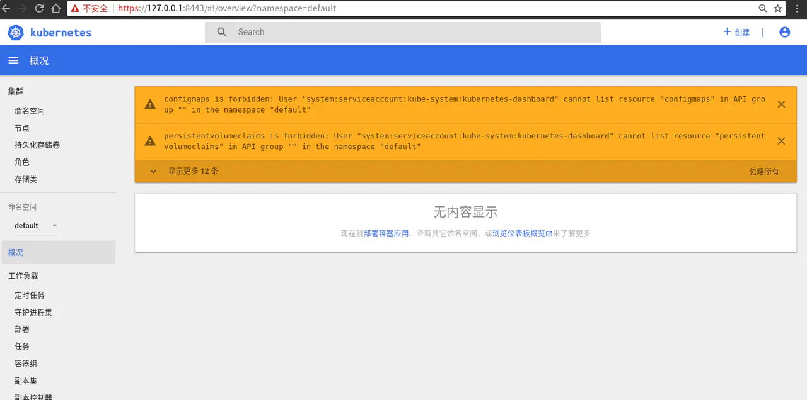
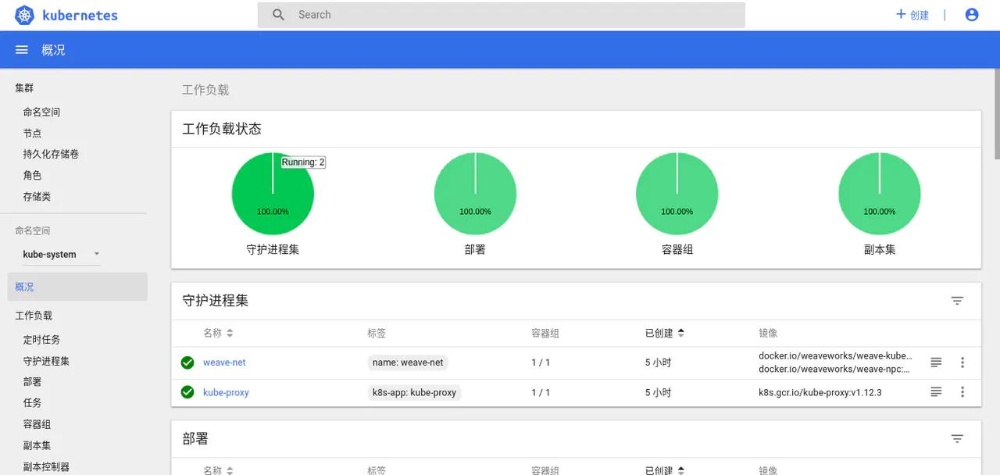
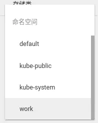

<!DOCTYPE html>
<!-- saved from url=(0046)https://kaiiiz.github.io/hexo-theme-book-demo/ -->
<html xmlns="http://www.w3.org/1999/xhtml">
<head>
    <head>
        <meta http-equiv="Content-Type" content="text/html; charset=UTF-8">
        <meta name="viewport" content="width=device-width, initial-scale=1, maximum-scale=1.0, user-scalable=no">
        <link rel="icon" href="../../static/favicon.png">
        <title>20 扩展增强：Dashboard.md</title>
        <!-- Spectre.css framework -->
        <link rel="stylesheet" href="../../static/index.css">
        <!-- theme css & js -->
        <meta name="generator" content="Hexo 4.2.0">
    </head>

<body>

    

        

            <a href="../../index.html">
                
                技术文章摘抄
            </a>
        

        

            <ul class="uncollapsible">
                <li><a href="../../index.html" class="current-tab">首页</a></li>
            </ul>

            <ul class="uncollapsible">
                <li><a href="../index.html">上一级</a></li>
            </ul>

            <ul class="uncollapsible">
                <li>

                    
                    <a href="01&#32;&#32;开篇：&#32;Kubernetes&#32;是什么以及为什么需要它.md">01  开篇： Kubernetes 是什么以及为什么需要它.md</a>

                </li>
                <li>

                    
                    <a href="02&#32;初步认识：Kubernetes&#32;基础概念.md">02 初步认识：Kubernetes 基础概念.md</a>

                </li>
                <li>

                    
                    <a href="03&#32;宏观认识：整体架构.md">03 宏观认识：整体架构.md</a>

                </li>
                <li>

                    
                    <a href="04&#32;搭建&#32;Kubernetes&#32;集群&#32;-&#32;本地快速搭建.md">04 搭建 Kubernetes 集群 - 本地快速搭建.md</a>

                </li>
                <li>

                    
                    <a href="05&#32;动手实践：搭建一个&#32;Kubernetes&#32;集群&#32;-&#32;生产可用.md">05 动手实践：搭建一个 Kubernetes 集群 - 生产可用.md</a>

                </li>
                <li>

                    
                    <a href="06&#32;集群管理：初识&#32;kubectl.md">06 集群管理：初识 kubectl.md</a>

                </li>
                <li>

                    
                    <a href="07&#32;集群管理：以&#32;Redis&#32;为例-部署及访问.md">07 集群管理：以 Redis 为例-部署及访问.md</a>

                </li>
                <li>

                    
                    <a href="08&#32;安全重点&#32;认证和授权.md">08 安全重点 认证和授权.md</a>

                </li>
                <li>

                    
                    <a href="09&#32;应用发布：部署实际项目.md">09 应用发布：部署实际项目.md</a>

                </li>
                <li>

                    
                    <a href="10&#32;应用管理：初识&#32;Helm.md">10 应用管理：初识 Helm.md</a>

                </li>
                <li>

                    
                    <a href="11&#32;部署实践：以&#32;Helm&#32;部署项目.md">11 部署实践：以 Helm 部署项目.md</a>

                </li>
                <li>

                    
                    <a href="12&#32;庖丁解牛：kube-apiserver.md">12 庖丁解牛：kube-apiserver.md</a>

                </li>
                <li>

                    
                    <a href="13&#32;庖丁解牛：etcd.md">13 庖丁解牛：etcd.md</a>

                </li>
                <li>

                    
                    <a href="14&#32;庖丁解牛：controller-manager.md">14 庖丁解牛：controller-manager.md</a>

                </li>
                <li>

                    
                    <a href="15&#32;庖丁解牛：kube-scheduler.md">15 庖丁解牛：kube-scheduler.md</a>

                </li>
                <li>

                    
                    <a href="16&#32;庖丁解牛：kubelet.md">16 庖丁解牛：kubelet.md</a>

                </li>
                <li>

                    
                    <a href="17&#32;庖丁解牛：kube-proxy.md">17 庖丁解牛：kube-proxy.md</a>

                </li>
                <li>

                    
                    <a href="18&#32;&#32;庖丁解牛：Container&#32;Runtime&#32;（Docker）.md">18  庖丁解牛：Container Runtime （Docker）.md</a>

                </li>
                <li>

                    
                    <a href="19&#32;Troubleshoot.md">19 Troubleshoot.md</a>

                </li>
                <li>

                    <a class="current-tab" href="20&#32;扩展增强：Dashboard.md">20 扩展增强：Dashboard.md</a>
                    

                </li>
                <li>

                    
                    <a href="21&#32;扩展增强：CoreDNS.md">21 扩展增强：CoreDNS.md</a>

                </li>
                <li>

                    
                    <a href="22&#32;服务增强：Ingress.md">22 服务增强：Ingress.md</a>

                </li>
                <li>

                    
                    <a href="23&#32;监控实践：对&#32;K8S&#32;集群进行监控.md">23 监控实践：对 K8S 集群进行监控.md</a>

                </li>
                <li>

                    
                    <a href="24&#32;总结.md">24 总结.md</a>

                </li>
            </ul>

        

    

    

        

    

    

    

        

            

                

                    <!-- For Responsive Layout -->
                    <header class="navbar">
                        <section class="navbar-section">
                            <a onclick="open_sidebar()">
                                <i class="icon icon-menu"></i>
                            </a>
                        </section>
                    </header>
                

                

                    

                        

                        
<h1>20 扩展增强：Dashboard</h1>
<h2>整体概览</h2>

通过前面的介绍，想必你已经迫不及待的想要将应用部署至 K8S 中，但总是使用 <code>kubectl</code> 或者 <code>Helm</code> 等命令行工具也许不太直观，你可能想要一眼就看到集群当前的状态，或者想要更方便的对集群进行管理。

本节将介绍一个 Web 项目 <a href="https://github.com/kubernetes/dashboard"><code>Dashboard</code></a> 可用于部署容器化的应用程序，管理集群中的资源，甚至是排查和解决问题。

当然它和大多数 Dashboard 类的项目类似，也为集群的状态提供了一个很直观的展示。

<h2>如何安装</h2>

要想使用 Dashboard，首先我们需要安装它，而 Dashboard 的安装其实也很简单。不过对于国内用户需要注意的是需要解决网络问题，或替换镜像地址等。

这里我们安装当前最新版 <code>v1.10.1</code> 的 Dashboard：

<ul>
<li>

对于已经解决网络问题的用户：

可使用官方推荐做法进行安装，以下链接是使用了我提交了 path 的版本，由于官方最近的一次更新导致配置文件中的镜像搞错了。

<pre><code>master $ kubectl apply -f https://raw.githubusercontent.com/tao12345666333/dashboard/67970554aa9275cccec1d1ee5fbf89ae81b3b614/aio/deploy/recommended/kubernetes-dashboard.yaml
secret/kubernetes-dashboard-certs created
serviceaccount/kubernetes-dashboard created
role.rbac.authorization.k8s.io/kubernetes-dashboard-minimal created
rolebinding.rbac.authorization.k8s.io/kubernetes-dashboard-minimal created
deployment.apps/kubernetes-dashboard created
service/kubernetes-dashboard created
</code></pre>
</li>
<li>

也可使用我修改过的这份（使用 Docker Hub 同步了镜像）仓库地址 <a href="https://github.com/tao12345666333/k8s-dashboard">GitHub</a>, 国内 <a href="https://gitee.com/K8S-release/k8s-dashboard">Gitee</a>：

<pre><code>master $ kubectl apply -f https://gitee.com/K8S-release/k8s-dashboard/raw/master/kubernetes-dashboard.yaml
secret/kubernetes-dashboard-certs created
serviceaccount/kubernetes-dashboard created
role.rbac.authorization.k8s.io/kubernetes-dashboard-minimal created
rolebinding.rbac.authorization.k8s.io/kubernetes-dashboard-minimal created
deployment.apps/kubernetes-dashboard created
service/kubernetes-dashboard created
</code></pre>
</li>
</ul>

当已经执行完以上步骤后，可检查下是否安装成功：

<pre><code>master $ kubectl -n kube-system get all  -l k8s-app=kubernetes-dashboard
NAME                                        READY     STATUS    RESTARTS   AGE
pod/kubernetes-dashboard-67896bc598-dhdpz   1/1       Running   0          3m

NAME                           TYPE        CLUSTER-IP      EXTERNAL-IP   PORT(S)   AGE
service/kubernetes-dashboard   ClusterIP   10.109.92.207   &lt;none&gt;        443/TCP   3m

NAME                                   DESIRED   CURRENT   UP-TO-DATE   AVAILABLE   AGE
deployment.apps/kubernetes-dashboard   1         1         1            1           3m

NAME                                              DESIRED   CURRENT   READY     AGE
replicaset.apps/kubernetes-dashboard-67896bc598   1         1         1         3m
</code></pre>

可以看到 <code>Pod</code> 已经在正常运行，接下来便是访问 Dashboard.

<h2>访问 Dashboard</h2>

以当前的部署方式，<code>Service</code> 使用了 <code>ClusterIP</code> 的类型，所以在集群外不能直接访问。我们先使用 <code>kubectl</code> 提供的 <code>port-forward</code> 功能进行访问。

<pre><code>master $ kubectl -n kube-system port-forward pod/kubernetes-dashboard-67896bc598-dhdpz 8443
Forwarding from 127.0.0.1:8443 -&gt; 8443
Forwarding from [::1]:8443 -&gt; 8443
</code></pre>

还记得，我们在第 5 节时候安装过一个名为 <code>socat</code> 的依赖项吗？ <code>socat</code> 的主要功能便是端口转发。

现在在浏览器打开 <a href="https://127.0.0.1:8443/"><code>https://127.0.0.1:8443</code></a> 便可看到如下的登录界面。

对于我们的 <strong>新版本</strong> 而言，我们 <strong>使用令牌登录</strong> 的方式。

<h3>查找 Token</h3>
<pre><code>master $ kubectl -n kube-system get serviceaccount -l k8s-app=kubernetes-dashboard -o yaml
apiVersion: v1
items:
- apiVersion: v1
  kind: ServiceAccount
  metadata:
    annotations:
      kubectl.kubernetes.io/last-applied-configuration: |
        {&quot;apiVersion&quot;:&quot;v1&quot;,&quot;kind&quot;:&quot;ServiceAccount&quot;,&quot;metadata&quot;:{&quot;annotations&quot;:{},&quot;labels&quot;:{&quot;k8s-app&quot;:&quot;kubernetes-dashboard&quot;},&quot;name&quot;:&quot;kubernetes-dashboard&quot;,&quot;namespace&quot;:&quot;kube-system&quot;}}
    creationTimestamp: 2018-12-20T17:27:14Z
    labels:
      k8s-app: kubernetes-dashboard
    name: kubernetes-dashboard
    namespace: kube-system
    resourceVersion: &quot;1400&quot;
    selfLink: /api/v1/namespaces/kube-system/serviceaccounts/kubernetes-dashboard
    uid: 7e01ddda-047c-11e9-b55c-0242ac11002a
  secrets:
  - name: kubernetes-dashboard-token-6ck2l
kind: List
metadata:
  resourceVersion: &quot;&quot;
  selfLink: &quot;&quot;
</code></pre>

首先，我们查看刚才创建出的 <code>serviceaccount</code> 可以看到其中有配置 <code>secrets</code> 。

查看该 <code>secret</code> 详情获得 Token

<pre><code>master $ kubectl -n kube-system describe secrets kubernetes-dashboard-token-6ck2l
Name:         kubernetes-dashboard-token-6ck2l
Namespace:    kube-system
Labels:       &lt;none&gt;
Annotations:  kubernetes.io/service-account.name=kubernetes-dashboard
              kubernetes.io/service-account.uid=7e01ddda-047c-11e9-b55c-0242ac11002a

Type:  kubernetes.io/service-account-token

Data
====
ca.crt:     1025 bytes
namespace:  11 bytes
token:      eyJhbGciOiJSUzI1NiIsImtpZCI6IiJ9.eyJpc3MiOiJrdWJlcm5ldGVzL3NlcnZpY2VhY2NvdW50Iiwia3ViZXJuZXRlcy5pby9zZXJ2aWNlYWNjb3VudC9uYW1lc3BhY2UiOiJrdWJlLXN5c3RlbSIsImt1YmVybmV0ZXMuaW8vc2VydmljZWFjY291bnQvc2VjcmV0Lm5hbWUiOiJrdWJlcm5ldGVzLWRhc2hib2FyZC10b2tlbi02Y2sybCIsImt1YmVybmV0ZXMuaW8vc2VydmljZWFjY291bnQvc2VydmljZS1hY2NvdW50Lm5hbWUiOiJrdWJlcm5ldGVzLWRhc2hib2FyZCIsImt1YmVybmV0ZXMuaW8vc2VydmljZWFjY291bnQvc2VydmljZS1hY2NvdW50LnVpZCI6IjdlMDFkZGRhLTA0N2MtMTFlOS1iNTVjLTAyNDJhYzExMDAyYSIsInN1YiI6InN5c3RlbTpzZXJ2aWNlYWNjb3VudDprdWJlLXN5c3RlbTprdWJlcm5ldGVzLWRhc2hib2FyZCJ9.WZ5YRUkGlKRSpkBFCk3BrZ6p2t1qVxEs7Kb18DP5X2C2lfMhDrB931PeN05uByLD6biz_4IQvKh4xmvY2RqekfV1BLCfcIiMUbc1lcXGbhH4g4vrsjYx3NZifaBh_5HuBlEL5zs5e_zFkPEhhIqjsY3KueFEuGwxTAsqGBQwawc-v6wqzB3Gzb01o1iN5aTb37PVG5gTTE8cQLih_urKhvdNEKBSRg_zHQlYjFrtUUWYRYMlYz_sWmamYVXHy_7NvKrBfw44WU5tLxMITkoUEGVwROBnHf_BcWVedozLg2uLVontB12YvhmTfJCDEAJ8o937bS-Fq3tLfu_xM40fqw
</code></pre>

将此处的 token 填入输入框内便可登录，<strong>注意这里使用的是 describe。</strong>

<h3>修正权限</h3>

但是我们注意到这里有很多提示 <code>configmaps is forbidden: User &quot;system:serviceaccount:kube-system:kubernetes-dashboard&quot; cannot list resource &quot;configmaps&quot; in API group &quot;&quot; in the namespace &quot;default&quot;</code> 。根据我们前面的介绍，这很明显就是用户权限不足。

我们已经知道，当前我们的集群是开启了 <code>RBAC</code> 的，所以这里我们还是以前面学到的方法创建一个用户并进行授权。

<ul>
<li>

创建 ServiceAccount：

<pre><code>apiVersion: v1
kind: ServiceAccount
metadata:
  name: admin-user
  namespace: kube-system
</code></pre>
</li>
<li>

创建 RoleBinding: 这里为了方便直接绑定了 <code>cluster-admin</code> 的 ClusterRole ，但是生产环境下，请按照实际情况进行授权，参考前面第 8 节相关的内容。

<pre><code>apiVersion: rbac.authorization.k8s.io/v1
kind: ClusterRoleBinding
metadata:
  name: admin-user
roleRef:
  apiGroup: rbac.authorization.k8s.io
  kind: ClusterRole
  name: cluster-admin
subjects:
- kind: ServiceAccount
  name: admin-user
  namespace: kube-system
</code></pre>
</li>
</ul>

使用以上配置创建了用户和绑定，然后还是同样的办法获取 Token。

点击 Dashboard 右上角，退出登录后，重新使用新的 Token 进行登录。登录完成后便可看到如下图：

<h2>部署应用</h2>

点击右上角的 <strong>+创建</strong> 可进入创建页面，现在支持三种模式：从文本框输入；从文件创建；直接创建应用。

我们仍然以我们的示例项目 <a href="https://github.com/tao12345666333/saythx">SayThx</a> 为例。先 <code>clone</code> 该项目，并进入项目的 <code>deploy</code> 目录中。将 <code>namespace.yaml</code> 的内容复制进输入框，点击上传按钮，便可创建名为 <code>work</code> 的 <code>Namespace</code> 了。

通过以下命令验证：

<pre><code>master $ kubectl get ns
NAME          STATUS    AGE
default       Active    2h
kube-public   Active    2h
kube-system   Active    2h
work          Active    10s
</code></pre>

可以看到 Namespace 已经创建成功。或者刷新下网页，点击左侧的命名空间即可看到当前的所有 <code>Namespace</code> 。

我们先将左侧的命名空间选择为 <strong>全部命名空间</strong> 或 <strong>work</strong> (当刷新过网页后) ，接下来继续点击右上角的 <strong>+创建</strong> 按钮，将 <code>redis-deployment.yaml</code> 的内容复制进输入框，点击上传按钮，部署 Redis 。

部署成功后，点击 部署 ，点击刚才的 <code>saythx-redis</code> 便可看到其详情。

点击左侧的容器组，便可看到刚才部署的 Pod，

在此页面的右上角，可以点击命令行按钮，打开新标签页进入其内部执行命令。

或者是点击日志按钮，可打开新标签页，查看日志。

<h2>总结</h2>

本节我们介绍了 <code>Kubernetes Dashboard</code> 的基本功能，以及如何安装和使用它。

Dashboard 相比 <code>kubectl</code> 为用户提供了一种相对直观的 Web 端操作方式，但是并不能完全取代 <code>kubectl</code>，这两者应该是相辅相成的。

如果你所需的功能相对简单或是想要给某些用户提供一种通过 Web 操作的方式，那便推荐使用 Dashboard。Dashboard 的后端使用了 K8S 的 <a href="https://github.com/kubernetes/client-go"><code>client-go</code></a> ，前端主要使用了 <a href="https://angular.io/">Angular</a>，有兴趣可以大致看看其源代码，对于开发基于 K8S 的云平台会有些启发。

下节，我们将介绍用于 DNS 和服务发现的插件 <a href="https://coredns.io/">CoreDNS</a>，学习如何利用它完成这些需求。并且它在 K8S 1.13 版本中，已经成为了默认的 DNS server。

                    

                    

                        

                            <a href="19&#32;Troubleshoot.md">上一页</a>
                        

                        

                            <a href="21&#32;扩展增强：CoreDNS.md">下一页</a>
                        

                    

                

            

        

    

    

</body>
<!-- Global site tag (gtag.js) - Google Analytics -->

</html>
