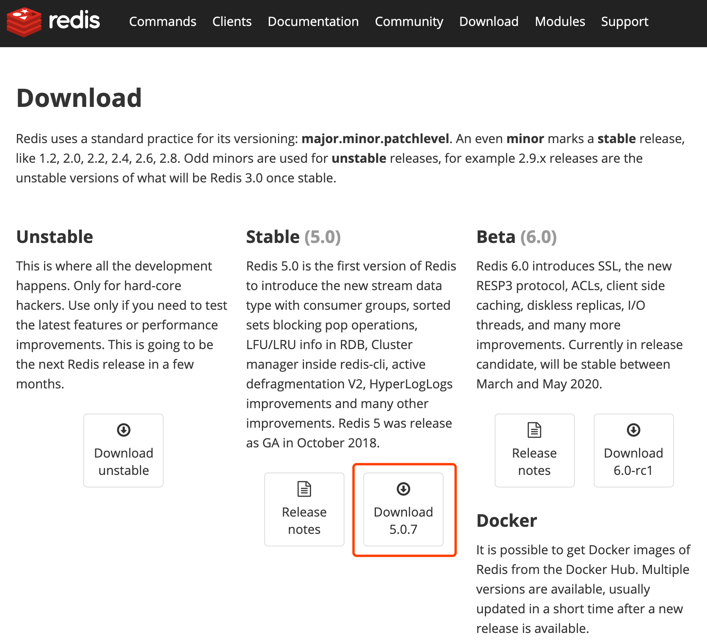
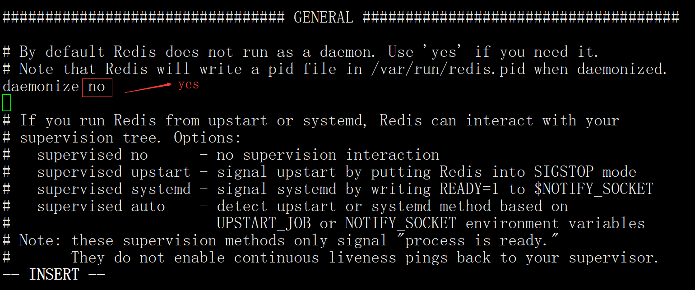

<!DOCTYPE html>
<!-- saved from url=(0046)https://kaiiiz.github.io/hexo-theme-book-demo/ -->
<html xmlns="http://www.w3.org/1999/xhtml">
<head>
    <head>
        <meta http-equiv="Content-Type" content="text/html; charset=UTF-8">
        <meta name="viewport" content="width=device-width, initial-scale=1, maximum-scale=1.0, user-scalable=no">
        <link rel="icon" href="../../static/favicon.png">
        <title>02 Redis 快速搭建与使用.md</title>
        <!-- Spectre.css framework -->
        <link rel="stylesheet" href="../../static/index.css">
        <!-- theme css & js -->
        <meta name="generator" content="Hexo 4.2.0">
    </head>

<body>

    

        

            <a href="../../index.html">
                
                技术文章摘抄
            </a>
        

        

            <ul class="uncollapsible">
                <li><a href="../../index.html" class="current-tab">首页</a></li>
            </ul>

            <ul class="uncollapsible">
                <li><a href="../index.html">上一级</a></li>
            </ul>

            <ul class="uncollapsible">
                <li>

                    
                    <a href="01&#32;Redis&#32;是如何执行的.md">01 Redis 是如何执行的.md</a>

                </li>
                <li>

                    <a class="current-tab" href="02&#32;Redis&#32;快速搭建与使用.md">02 Redis 快速搭建与使用.md</a>
                    

                </li>
                <li>

                    
                    <a href="03&#32;Redis&#32;持久化——RDB.md">03 Redis 持久化——RDB.md</a>

                </li>
                <li>

                    
                    <a href="04&#32;Redis&#32;持久化——AOF.md">04 Redis 持久化——AOF.md</a>

                </li>
                <li>

                    
                    <a href="05&#32;Redis&#32;持久化——混合持久化.md">05 Redis 持久化——混合持久化.md</a>

                </li>
                <li>

                    
                    <a href="06&#32;字符串使用与内部实现原理.md">06 字符串使用与内部实现原理.md</a>

                </li>
                <li>

                    
                    <a href="07&#32;附录：更多字符串操作命令.md">07 附录：更多字符串操作命令.md</a>

                </li>
                <li>

                    
                    <a href="08&#32;字典使用与内部实现原理.md">08 字典使用与内部实现原理.md</a>

                </li>
                <li>

                    
                    <a href="09&#32;附录：更多字典操作命令.md">09 附录：更多字典操作命令.md</a>

                </li>
                <li>

                    
                    <a href="10&#32;列表使用与内部实现原理.md">10 列表使用与内部实现原理.md</a>

                </li>
                <li>

                    
                    <a href="11&#32;附录：更多列表操作命令.md">11 附录：更多列表操作命令.md</a>

                </li>
                <li>

                    
                    <a href="12&#32;集合使用与内部实现原理.md">12 集合使用与内部实现原理.md</a>

                </li>
                <li>

                    
                    <a href="13&#32;附录：更多集合操作命令.md">13 附录：更多集合操作命令.md</a>

                </li>
                <li>

                    
                    <a href="14&#32;有序集合使用与内部实现原理.md">14 有序集合使用与内部实现原理.md</a>

                </li>
                <li>

                    
                    <a href="15&#32;附录：更多有序集合操作命令.md">15 附录：更多有序集合操作命令.md</a>

                </li>
                <li>

                    
                    <a href="16&#32;Redis&#32;事务深入解析.md">16 Redis 事务深入解析.md</a>

                </li>
                <li>

                    
                    <a href="17&#32;Redis&#32;键值过期操作.md">17 Redis 键值过期操作.md</a>

                </li>
                <li>

                    
                    <a href="18&#32;Redis&#32;过期策略与源码分析.md">18 Redis 过期策略与源码分析.md</a>

                </li>
                <li>

                    
                    <a href="19&#32;Redis&#32;管道技术——Pipeline.md">19 Redis 管道技术——Pipeline.md</a>

                </li>
                <li>

                    
                    <a href="20&#32;查询附近的人——GEO.md">20 查询附近的人——GEO.md</a>

                </li>
                <li>

                    
                    <a href="21&#32;游标迭代器（过滤器）——Scan.md">21 游标迭代器（过滤器）——Scan.md</a>

                </li>
                <li>

                    
                    <a href="22&#32;优秀的基数统计算法——HyperLogLog.md">22 优秀的基数统计算法——HyperLogLog.md</a>

                </li>
                <li>

                    
                    <a href="23&#32;内存淘汰机制与算法.md">23 内存淘汰机制与算法.md</a>

                </li>
                <li>

                    
                    <a href="24&#32;消息队列——发布订阅模式.md">24 消息队列——发布订阅模式.md</a>

                </li>
                <li>

                    
                    <a href="25&#32;消息队列的其他实现方式.md">25 消息队列的其他实现方式.md</a>

                </li>
                <li>

                    
                    <a href="26&#32;消息队列终极解决方案——Stream（上）.md">26 消息队列终极解决方案——Stream（上）.md</a>

                </li>
                <li>

                    
                    <a href="27&#32;消息队列终极解决方案——Stream（下）.md">27 消息队列终极解决方案——Stream（下）.md</a>

                </li>
                <li>

                    
                    <a href="28&#32;实战：分布式锁详解与代码.md">28 实战：分布式锁详解与代码.md</a>

                </li>
                <li>

                    
                    <a href="29&#32;实战：布隆过滤器安装与使用及原理分析.md">29 实战：布隆过滤器安装与使用及原理分析.md</a>

                </li>
                <li>

                    
                    <a href="30&#32;完整案例：实现延迟队列的两种方法.md">30 完整案例：实现延迟队列的两种方法.md</a>

                </li>
                <li>

                    
                    <a href="31&#32;实战：定时任务案例.md">31 实战：定时任务案例.md</a>

                </li>
                <li>

                    
                    <a href="32&#32;实战：RediSearch&#32;高性能的全文搜索引擎.md">32 实战：RediSearch 高性能的全文搜索引擎.md</a>

                </li>
                <li>

                    
                    <a href="33&#32;实战：Redis&#32;性能测试.md">33 实战：Redis 性能测试.md</a>

                </li>
                <li>

                    
                    <a href="34&#32;实战：Redis&#32;慢查询.md">34 实战：Redis 慢查询.md</a>

                </li>
                <li>

                    
                    <a href="35&#32;实战：Redis&#32;性能优化方案.md">35 实战：Redis 性能优化方案.md</a>

                </li>
                <li>

                    
                    <a href="36&#32;实战：Redis&#32;主从同步.md">36 实战：Redis 主从同步.md</a>

                </li>
                <li>

                    
                    <a href="37&#32;实战：Redis哨兵模式（上）.md">37 实战：Redis哨兵模式（上）.md</a>

                </li>
                <li>

                    
                    <a href="38&#32;实战：Redis&#32;哨兵模式（下）.md">38 实战：Redis 哨兵模式（下）.md</a>

                </li>
                <li>

                    
                    <a href="39&#32;实战：Redis&#32;集群模式（上）.md">39 实战：Redis 集群模式（上）.md</a>

                </li>
                <li>

                    
                    <a href="40&#32;实战：Redis&#32;集群模式（下）.md">40 实战：Redis 集群模式（下）.md</a>

                </li>
                <li>

                    
                    <a href="41&#32;案例：Redis&#32;问题汇总和相关解决方案.md">41 案例：Redis 问题汇总和相关解决方案.md</a>

                </li>
                <li>

                    
                    <a href="42&#32;技能学习指南.md">42 技能学习指南.md</a>

                </li>
                <li>

                    
                    <a href="43&#32;加餐：Redis&#32;的可视化管理工具.md">43 加餐：Redis 的可视化管理工具.md</a>

                </li>
            </ul>

        

    

    

        

    

    

    

        

            

                

                    <!-- For Responsive Layout -->
                    <header class="navbar">
                        <section class="navbar-section">
                            <a onclick="open_sidebar()">
                                <i class="icon icon-menu"></i>
                            </a>
                        </section>
                    </header>
                

                

                    

                        

                        
<h1>02 Redis 快速搭建与使用</h1>

Redis 是由 C 语言开发的开源内存数据存储器，经常被用作数据库、缓存以及消息队列等。 Redis 因为其强大的功能和简洁的设计，深受广大开发者和公司的喜爱，几乎占领了内存数据库市场的所有份额。

<h3>1 Redis 特性</h3>

Redis 有很多优秀的特性，这也是它最受欢迎的原因。

<h4>1）多种数据类型支持</h4>

Redis 支持多种数据类型，例如字符串、散列、列表、集合、有序集合、HyperLogLog、流、地理坐标等，每种类型都有对应的使用场景，同时也满足了所有开发者的需要。

<h4>2）功能完善</h4>

Redis 提供了很多的功能，例如消息队列、自动过期删除、事务、数据持久化、分布式锁、附近的人、慢查询分析、Sentinel 和集群等多项功能。

<h4>3）高性能</h4>

Redis 是一款内存型数据库，因此在性能方面有天生的优势(内存操作比磁盘操作要快很多)，并且 Redis 在底层使用了更加高效的算法和数据结构，以最大限度的提高了 Redis 的性能。

<h4>4）广泛的编程语言支持</h4>

Redis 客户端有众多的开发者提供了相应的支持，这些客户端可以在 https://redis.io/clients 上找到，支持是编程语言，如下图所示：  可以看出几乎所有的编程语言，都有相应的客户端支持。

<h4>5）使用简单</h4>

Redis 的 API 虽然比较丰富，但操作的方法都非常的简便，并且需要传递的参数也不多，这样开发者就能更快的上手使用，而且 Redis 官方也提供了比较完整的说明文档。

<h4>6）活跃性高/版本迭代快</h4>

Redis 活跃度很高，这点可以在 Redis 的开源项目 <a href="https://github.com/antirez/redis">https://github.com/antirez/redis</a> 中发现，并且 Redis 的版本迭代也很快，到目前为止 Redis 的发布版本就已经有二百多个了。

<h4>7）I/O 多路复用模型</h4>

Redis 使用了多路 I/O 复用模型，“多路”指的是多个网络连接，“复用”指的是复用同一个线程，采用多路 I/O 复用技术可以让单个线程高效的处理多个连接请求，这样就减少了创建和销毁线程所带来的时间消耗，从而到达高效处理大量并发请求的目的。

<h3>2 Redis 发展历程</h3>

Redis 的发展大概经过了以下几个过程：

<ul>
<li>2009 年 5 月发布 Redis 初始版本；</li>
<li>2012 年发布 Redis 2.6，重构了大量的核心代码，去掉了所有和集群相关的代码；</li>
<li>2013 年 11 月发布 Redis 2.8，增加了部分主从复制功能；</li>
<li>2015 年 4 月发布 Redis 3.0，增加了集群功能；</li>
<li>2017 年 7 月发布 Redis 4.0 ，优化了复制功能和新增了混合持久化；</li>
<li>2018 年 10 月发布 Redis 5.0，增加了 Stream 数据类型；</li>
<li>2020 年 3-5 月计划发布 Redis 6.0 稳定版。</li>
</ul>
<h3>3 Redis 安装</h3>

Redis 官方提供了 Linux 和 MacOS 服务端安装包，对于 Windows 还有提供正式的支持，之所以不支持 Windows 平台是因为目前 Linux 版本已经很稳定，并且也有大量的用户，如果开发 Windows 版本可能会带来很多的兼容性问题，但 Windows 平台还是有很多种方法可以安装 Redis 的，本文的下半部分会说到，我们先来看 Redis 在 Linux 和 MacOS 平台的安装。

<h4>1）源码安装</h4>
<h5>① 下载源码包</h5>

进入网址：<a href="https://redis.io/download">https://redis.io/download</a> 选择需要安装的版本，点击 <code>Download</code> 按钮，如下图所示： 

<h5>② 解压安装包</h5>

使用命令：tar zxvf redis-5.0.7.tar.gz

<h5>③ 切换到 Redis 目录</h5>

使用命令：cd /usr/local/redis-5.0.7/

<h5>④ 编译安装</h5>

使用命令：sudo make install 安装完成，如下图所示：  如果没有异常信息输出，向上图所示，则表示 Redis 已经安装成功。

<h4>2）Docker 安装</h4>

Docker 的使用前提是必须先有 Docker，如果本机没有安装 Docker，对于 Linux 用户来说，可使用命令 <code>yum -y install docker</code> 在线安装 docker，如果是非 Linux 平台需要在官网下载并安装 Docker Desker，下载地址：<a href="https://docs.docker.com/get-started/">https://docs.docker.com/get-started/</a> 如下图所示：  选择相应的平台，下载安装即可。 有了 Docker 之后，就可以在 Docker 上安装 Redis 服务端了，具体步骤如下：

<h5>① 拉取 Reids 镜像</h5>

使用命令：

<blockquote>

docker pull redis

</blockquote>

如果要安装其他版本的 Redis，可使用 <code>docker pull redis:版本号</code> 的方式来安装。

<h5>② 运行 Redis 容器</h5>

使用命令：

<blockquote>

docker run --name myredis -d -p 6379:6379 redis

</blockquote>

其中：

<ul>
<li>--name：设置别名</li>
<li>-p：映射宿主端口到容器端口</li>
<li>-d：表示后台运行</li>
</ul>

执行完成后截图如下：  如图所示，则证明 Redis 已经正常启动了。 如果要查询 Redis 的安装版本，可遵循下图的执行流程，先进入容器，在进入 Redis 的安装目录，执行 <code>redis-server -v</code> 命令，如图如下： 

<h5>③ 执行命令</h5>

Docker 版的 Redis 命令执行和其他方式安装的 Redis 不太一样，所以这里需要单独讲一下，我们要使用 redis-cli 工具，需要执行以下命令：

<blockquote>

docker exec -it myredis redis-cli

</blockquote>

其中“myredis”指的是容器中 Redis 服务端的别名。

<h4>3）在线安装</h4>

在线安装的执行步骤最简单，只需要执行 <code>xxx install redis</code> 命令即可直接安装，例如 MacOS 使用 <code>brew install redis</code> 、Ubuntu 使用 <code>apt-get install redis</code> 、CentOS 使用 <code>yum install redis</code> 等。

<h3>3 Windows 系统安装 Redis</h3>

上面我们提到了，官方并没有提供 Windows 的支持版本，但 Windows 平台依旧有很多种方法，可以用来安装 Redis 服务端，例如 Docker 方式、虚拟机方式、Windows 10 子系统方式和第三方提供的 Redis 版本等。

其中 Docker 方式和本文上半部分介绍的安装方式相同，这里就不再赘述，当然你也可以使用虚拟机安装 Linux 的方式，或者是使用 Windows 10 下的自带的 Linux 子系统的方式进行安装。

如果你还想要更简单的方式，就可以使用第三方提供的 Redis 安装包进行安装，例如可以使用微软官方支持并维护的一个 Win64 的 Redis 开源项目，目前支持的最新版本为 3.2，项目地址：https://github.com/MicrosoftArchive/redis/releases 下载 .msi 和 .zip 文件安装即可。

<h3>4 Redis 使用</h3>

Redis 安装完之后，在 src 目录和 /usr/local/bin 目录下有几个很重要的可执行文件，这些可执行文件可以做很多事，如下表所示：

<table>
<thead>
<tr>
<th align="left">可执行文件</th>
<th align="left">功能</th>
</tr>
</thead>
<tbody>
<tr>
<td align="left">redis-server</td>
<td align="left">启动 Redis</td>
</tr>
<tr>
<td align="left">redis-cli</td>
<td align="left">Redis 命令行工具</td>
</tr>
<tr>
<td align="left">redis-benchmark</td>
<td align="left">基准测试工具</td>
</tr>
<tr>
<td align="left">redis-check-aof</td>
<td align="left">AOF 持久化文件检测工具和修复工具</td>
</tr>
<tr>
<td align="left">redis-check-dump</td>
<td align="left">RDB 持久化文件检测工具和修复工具</td>
</tr>
<tr>
<td align="left">redis-sentinel</td>
<td align="left">启动 redis-sentinel</td>
</tr>
</tbody>
</table>
<h4>1）启动 Redis</h4>

下面我们就用可执行文件 <code>redis-server</code> 来启动 Redis 服务器，我们在 Redis 的安装目录执行 <code>src/redis-server</code> 命令就可以启动 Redis 服务了，如下图所示：  可以看出 Redis 已经正常启动了，但这种启动方式，会使得 Redis 服务随着控制台的关闭而退出，因为 Redis 服务默认是非后台启动的，我们需要修改配置文件(redis.conf)，找到 <code>daemonize no</code> 改为 <code>daemonize yes</code> ，然后重启服务，此时 Redis 就是以后台运行方式启动了，并且不会随着控制台的关闭而退出。

daemonize 配置如下： 

<h4>2）使用可视化工具操作 Redis</h4>

Redis 启动之后就可以使用一些客户端工具进行链接和操作，如下图所示：  (注：我们本文使用的是 Redis Desktop Manager 工具链接的，更多 Redis 可视化工具，在本课程的后面有介绍。) 可以看出 Redis 服务器默认有 16 个数据库实例，从 db0 到 db15，但这个数据库实例和传统的关系型数据库实例是不一样的。传统型数据库实例是通过连接字符串配置的，而 Redis 数据库连接字符串只有一个，并不能指定要使用的数据库实例。

在 Redis 中如果要切换数据库实例，只需要执行 <code>select n</code> 命令即可，例如需要连接 db1 ，使用 <code>select 1</code> 命令选择即可，默认连接的数据库实例是 db0。

<blockquote>

小贴士：当使用了 <code>flushall</code> 清空 Redis 数据库时，此数据库下的所有数据都会被清除。

</blockquote>

Redis 数据库的实例个数也可以通过配置文件更改，在 redis.conf 中找到 <code>databases 16</code> ，修改后面的数字重启 Redis 服务就会生效。

<h4>3）使用 redis-cli 操作 Redis</h4>

redis-cli 是官方自带的客户端链接工具，它可以配合命令行来对 Redis 进行操作，在 Redis 的安装目录使用 <code>src/redis-cli</code> 命令即可链接并操作 Redis，如下图所示： 

<h3>5 小结</h3>

本文介绍了 Redis 的特性及其发展历程，以及 Redis 在 Windows、Linux、MacOS 下的安装，其中 Docker 安装方式，对所有平台都是通用的，在 Linux、MacOS 平台下可以在线安装或者使用源码安装，Windows 平台可以使用虚拟机或子系统以及第三方提供的 Redis 安装包进行安装。安装成功之后可以使用 redis-server 来启动 Redis 服务，并使用 redis-cli 来链接和操作 Redis 服务器，redis-server 默认是非后台运行 Redis，需要修改配置 daemonize yes 来设置 Redis 为后台运行模式，这样就可以快速上手使用 Redis 了。

                    

                    

                        

                            <a href="01&#32;Redis&#32;是如何执行的.md">上一页</a>
                        

                        

                            <a href="03&#32;Redis&#32;持久化——RDB.md">下一页</a>
                        

                    

                

            

        

    

    

</body>
<!-- Global site tag (gtag.js) - Google Analytics -->

</html>
