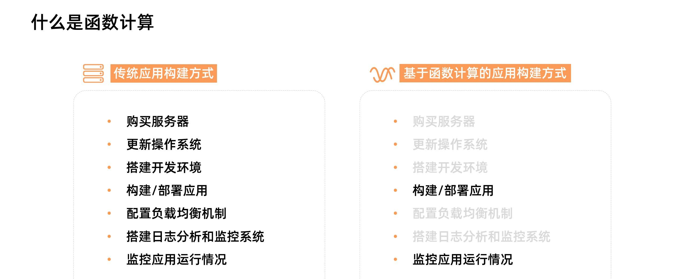

<!DOCTYPE html>
<!-- saved from url=(0046)https://kaiiiz.github.io/hexo-theme-book-demo/ -->
<html xmlns="http://www.w3.org/1999/xhtml">
<head>
    <head>
        <meta http-equiv="Content-Type" content="text/html; charset=UTF-8">
        <meta name="viewport" content="width=device-width, initial-scale=1, maximum-scale=1.0, user-scalable=no">
        <link rel="icon" href="../../static/favicon.png">
        <title>05 函数计算简介.md</title>
        <!-- Spectre.css framework -->
        <link rel="stylesheet" href="../../static/index.css">
        <!-- theme css & js -->
        <meta name="generator" content="Hexo 4.2.0">
    </head>

<body>

    

        

            <a href="../../index.html">
                
                技术文章摘抄
            </a>
        

        

            <ul class="uncollapsible">
                <li><a href="../../index.html" class="current-tab">首页</a></li>
            </ul>

            <ul class="uncollapsible">
                <li><a href="../index.html">上一级</a></li>
            </ul>

            <ul class="uncollapsible">
                <li>

                    
                    <a href="01&#32;架构的演进.md">01 架构的演进.md</a>

                </li>
                <li>

                    
                    <a href="02&#32;Serverless&#32;的价值.md">02 Serverless 的价值.md</a>

                </li>
                <li>

                    
                    <a href="03&#32;常见&#32;Serverless&#32;架构模式.md">03 常见 Serverless 架构模式.md</a>

                </li>
                <li>

                    
                    <a href="04&#32;Serverless&#32;技术选型.md">04 Serverless 技术选型.md</a>

                </li>
                <li>

                    <a class="current-tab" href="05&#32;函数计算简介.md">05 函数计算简介.md</a>
                    

                </li>
                <li>

                    
                    <a href="06&#32;函数计算是如何工作的？.md">06 函数计算是如何工作的？.md</a>

                </li>
                <li>

                    
                    <a href="07&#32;函数粘合云服务提供端到端解决方案.md">07 函数粘合云服务提供端到端解决方案.md</a>

                </li>
                <li>

                    
                    <a href="08&#32;函数计算的开发与配置.md">08 函数计算的开发与配置.md</a>

                </li>
                <li>

                    
                    <a href="09&#32;函数的调试与部署.md">09 函数的调试与部署.md</a>

                </li>
                <li>

                    
                    <a href="10&#32;自动化&#32;CI&amp;CD&#32;与灰度发布.md">10 自动化 CI&amp;CD 与灰度发布.md</a>

                </li>
                <li>

                    
                    <a href="11&#32;函数计算的可观测性.md">11 函数计算的可观测性.md</a>

                </li>
                <li>

                    
                    <a href="12&#32;典型案例&#32;1：函数计算在音视频场景实践.md">12 典型案例 1：函数计算在音视频场景实践.md</a>

                </li>
                <li>

                    
                    <a href="13&#32;典型案例&#32;3：十分钟搭建弹性可扩展的&#32;Web&#32;API.md">13 典型案例 3：十分钟搭建弹性可扩展的 Web API.md</a>

                </li>
                <li>

                    
                    <a href="14&#32;Serverless&#32;Kubernetes&#32;容器服务介绍.md">14 Serverless Kubernetes 容器服务介绍.md</a>

                </li>
                <li>

                    
                    <a href="15&#32;Serverless&#32;Kubernetes&#32;应用部署及扩缩容.md">15 Serverless Kubernetes 应用部署及扩缩容.md</a>

                </li>
                <li>

                    
                    <a href="16&#32;使用&#32;Spot&#32;低成本运行&#32;Job&#32;任务.md">16 使用 Spot 低成本运行 Job 任务.md</a>

                </li>
                <li>

                    
                    <a href="17&#32;低成本运行&#32;Spark&#32;数据计算.md">17 低成本运行 Spark 数据计算.md</a>

                </li>
                <li>

                    
                    <a href="18&#32;GPU&#32;机器学习开箱即用.md">18 GPU 机器学习开箱即用.md</a>

                </li>
                <li>

                    
                    <a href="19&#32;基于&#32;Knative&#32;低成本部署在线应用，灵活自动伸缩.md">19 基于 Knative 低成本部署在线应用，灵活自动伸缩.md</a>

                </li>
                <li>

                    
                    <a href="20&#32;快速构建&#32;JenkinsGitlab&#32;持续集成环境.md">20 快速构建 JenkinsGitlab 持续集成环境.md</a>

                </li>
                <li>

                    
                    <a href="21&#32;在线应用的&#32;Serverless&#32;实践.md">21 在线应用的 Serverless 实践.md</a>

                </li>
                <li>

                    
                    <a href="22&#32;通过&#32;IDEMaven&#32;部署&#32;Serverless&#32;应用实践.md">22 通过 IDEMaven 部署 Serverless 应用实践.md</a>

                </li>
                <li>

                    
                    <a href="23&#32;企业级&#32;CICD&#32;工具部署&#32;Serverless&#32;应用的落地实践.md">23 企业级 CICD 工具部署 Serverless 应用的落地实践.md</a>

                </li>
                <li>

                    
                    <a href="24&#32;Serverless&#32;应用如何管理日志&amp;持久化数据.md">24 Serverless 应用如何管理日志&amp;持久化数据.md</a>

                </li>
                <li>

                    
                    <a href="25&#32;Serverless&#32;应用引擎产品的流量负载均衡和路由策略配置实践.md">25 Serverless 应用引擎产品的流量负载均衡和路由策略配置实践.md</a>

                </li>
                <li>

                    
                    <a href="26&#32;Spring&#32;CloudDubbo&#32;应用无缝迁移到&#32;Serverless&#32;架构.md">26 Spring CloudDubbo 应用无缝迁移到 Serverless 架构.md</a>

                </li>
                <li>

                    
                    <a href="27&#32;SAE&#32;应用分批发布与无损下线的最佳实践.md">27 SAE 应用分批发布与无损下线的最佳实践.md</a>

                </li>
                <li>

                    
                    <a href="https://learn.lianglianglee.com/%E4%B8%93%E6%A0%8F/Serverless%20%E6%8A%80%E6%9C%AF%E5%85%AC%E5%BC%80%E8%AF%BE%EF%BC%88%E5%AE%8C%EF%BC%89/28%20%E5%A6%82%E4%BD%95%E9%80%9A%E8%BF%87%E5%8E%8B%E6%B5%8B%E5%B7%A5%E5%85%B7+%20SAE%20%E5%BC%B9%E6%80%A7%E8%83%BD%E5%8A%9B%E8%BD%BB%E6%9D%BE%E5%BA%94%E5%AF%B9%E5%A4%A7%E4%BF%83.md">28 如何通过压测工具+ SAE 弹性能力轻松应对大促.md</a>

                </li>
                <li>

                    
                    <a href="29&#32;SAE&#32;极致应用部署效率.md">29 SAE 极致应用部署效率.md</a>

                </li>
            </ul>

        

    

    

        

    

    

    

        

            

                

                    <!-- For Responsive Layout -->
                    <header class="navbar">
                        <section class="navbar-section">
                            <a onclick="open_sidebar()">
                                <i class="icon icon-menu"></i>
                            </a>
                        </section>
                    </header>
                

                

                    

                        

                        
<h1>05 函数计算简介</h1>
<h3>什么是函数计算</h3>

大家都了解，Serverless 并不是没有服务器，而是开发者不再需要关心服务器。下图是一个应用从开发到上线的对比图：

在传统 Serverful 架构下，部署一个应用需要购买服务器，部署操作系统，搭建开发环境，编写代码，构建应用，部署应用，配置负载均衡机制，搭建日志分析与监控系统，应用上线后，继续监控应用的运行情况。而在 Serverless 架构下，开发者只需要关注应用的开发构建和部署，无需关心服务器相关操作与运维，在函数计算架构下，开发者只需要编写业务代码并监控业务运行情况。这将开发者从繁重的运维工作中解放出来，把精力投入到更有意义的业务开发上。

上图展示了函数计算的使用方式。从用户角度，他需要做的只是编码，然后把代码上传到函数计算中。上传代码就意味着应用部署。当有高并发请求涌入时，开发者也无需手动扩容，函数计算会根据请求量毫秒级自动扩容，弹性可靠地运行任务，并内置日志查询、性能监控、报警等功能帮助开发者发现问题并定位问题。

<h3>函数计算核心优势</h3>

<h4>敏捷开发</h4>
<ul>
<li>使用函数计算时，用户只需聚焦于业务逻辑的开发，编写最重要的 “核心代码”；</li>
<li>不再需要关心服务器购买、负载均衡、自动伸缩等运维操作；</li>
<li>极大地降低了服务搭建的复杂性，有效提升开发和迭代的速度。</li>
</ul>
<h4>弹性扩容</h4>
<ul>
<li>函数计算根据请求量自动进行弹性扩容，无需任何手动配置；</li>
<li>毫秒级调度计算资源，轻松应对业务洪峰。</li>
</ul>
<h4>稳定好可用</h4>
<ul>
<li>函数计算分布式集群化部署，支持多可用区；</li>
<li>如果某个可用区因自然灾害或电力故障导致瘫痪，函数计算会迅速切换到同区域其他可用区的基础设施运行函数，确保服务高可用。</li>
</ul>
<h4>有竞争力的成本</h4>
<ul>
<li>函数计算提供了丰富的计量模式，帮助您在不同场景获得显著成本优势；</li>
<li>后付费模型按实际使用计算资源计费，不占用计算资源则不计费，资源利用率高达 100% ；</li>
<li>预付费模型根据业务负载估算提前预购计算力，单价更低，组合使用后付费和预付费方式将有效降低成本。</li>
</ul>
<h3>函数计算使用场景</h3>

从使用场景来说，主要有三类：

<ul>
<li><strong>Web 应用：</strong> 可以是各种语言写的，这种可以是使用 Serverless 框架新编写的程序，也可以是已有的应用。比如可能是小程序后端，也可能是 Web API；</li>
<li><strong>对计算能力有很强的弹性诉求的应用：</strong> 比如 AI 推理、音视频处理、图文转换等；</li>
<li><strong>事件驱动型的应用：</strong> 比如通过其他阿里云产品驱动的场景，Web Hook、定时任务等。</li>
</ul>

函数计算已经与很多产品进行了打通，比如对象存储、表格存储、定时器、CDN、日志服务、云监控等十几个产品，可以非常快速地组装出一些业务逻辑。

                    

                    

                        

                            <a href="04&#32;Serverless&#32;技术选型.md">上一页</a>
                        

                        

                            <a href="06&#32;函数计算是如何工作的？.md">下一页</a>
                        

                    

                

            

        

    

    

</body>
<!-- Global site tag (gtag.js) - Google Analytics -->

</html>
