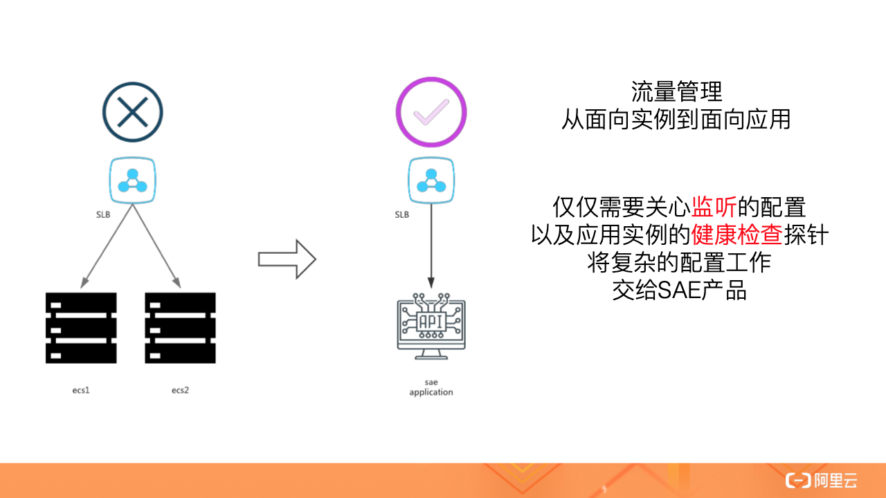
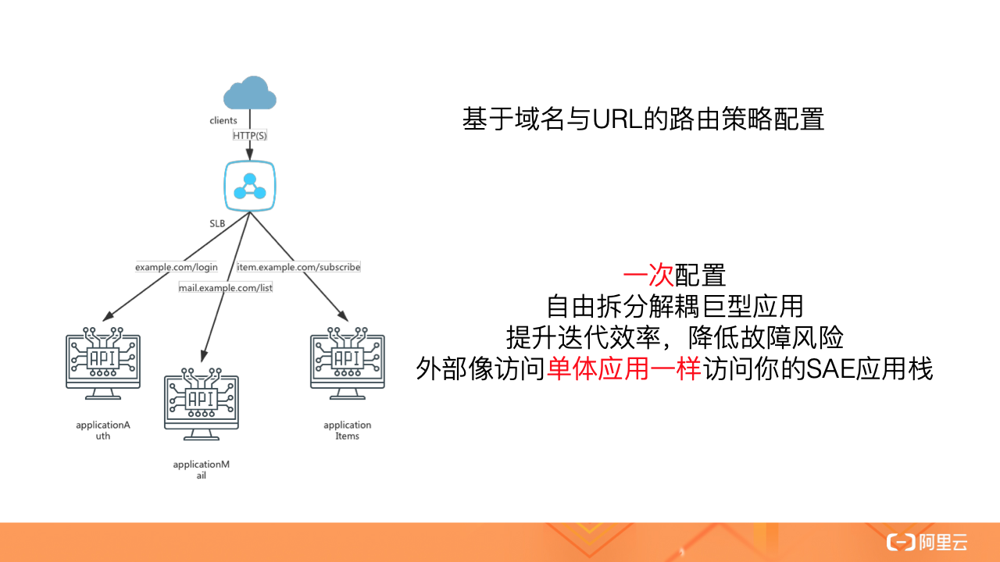
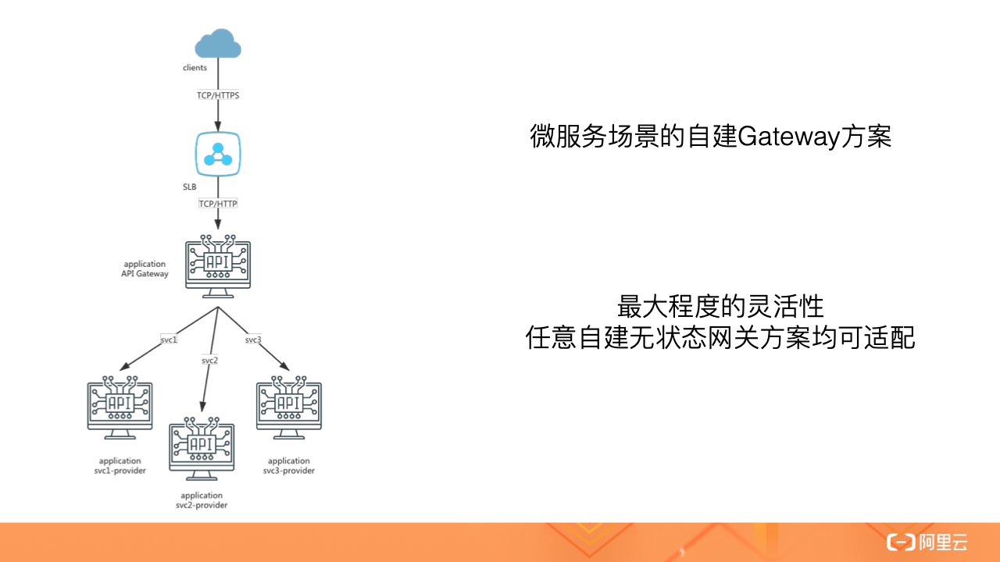

<!DOCTYPE html>
<!-- saved from url=(0046)https://kaiiiz.github.io/hexo-theme-book-demo/ -->
<html xmlns="http://www.w3.org/1999/xhtml">
<head>
    <head>
        <meta http-equiv="Content-Type" content="text/html; charset=UTF-8">
        <meta name="viewport" content="width=device-width, initial-scale=1, maximum-scale=1.0, user-scalable=no">
        <link rel="icon" href="../../static/favicon.png">
        <title>25 Serverless 应用引擎产品的流量负载均衡和路由策略配置实践.md</title>
        <!-- Spectre.css framework -->
        <link rel="stylesheet" href="../../static/index.css">
        <!-- theme css & js -->
        <meta name="generator" content="Hexo 4.2.0">
    </head>

<body>

    

        

            <a href="../../index.html">
                
                技术文章摘抄
            </a>
        

        

            <ul class="uncollapsible">
                <li><a href="../../index.html" class="current-tab">首页</a></li>
            </ul>

            <ul class="uncollapsible">
                <li><a href="../index.html">上一级</a></li>
            </ul>

            <ul class="uncollapsible">
                <li>

                    
                    <a href="01&#32;架构的演进.md">01 架构的演进.md</a>

                </li>
                <li>

                    
                    <a href="02&#32;Serverless&#32;的价值.md">02 Serverless 的价值.md</a>

                </li>
                <li>

                    
                    <a href="03&#32;常见&#32;Serverless&#32;架构模式.md">03 常见 Serverless 架构模式.md</a>

                </li>
                <li>

                    
                    <a href="04&#32;Serverless&#32;技术选型.md">04 Serverless 技术选型.md</a>

                </li>
                <li>

                    
                    <a href="05&#32;函数计算简介.md">05 函数计算简介.md</a>

                </li>
                <li>

                    
                    <a href="06&#32;函数计算是如何工作的？.md">06 函数计算是如何工作的？.md</a>

                </li>
                <li>

                    
                    <a href="07&#32;函数粘合云服务提供端到端解决方案.md">07 函数粘合云服务提供端到端解决方案.md</a>

                </li>
                <li>

                    
                    <a href="08&#32;函数计算的开发与配置.md">08 函数计算的开发与配置.md</a>

                </li>
                <li>

                    
                    <a href="09&#32;函数的调试与部署.md">09 函数的调试与部署.md</a>

                </li>
                <li>

                    
                    <a href="10&#32;自动化&#32;CI&amp;CD&#32;与灰度发布.md">10 自动化 CI&amp;CD 与灰度发布.md</a>

                </li>
                <li>

                    
                    <a href="11&#32;函数计算的可观测性.md">11 函数计算的可观测性.md</a>

                </li>
                <li>

                    
                    <a href="12&#32;典型案例&#32;1：函数计算在音视频场景实践.md">12 典型案例 1：函数计算在音视频场景实践.md</a>

                </li>
                <li>

                    
                    <a href="13&#32;典型案例&#32;3：十分钟搭建弹性可扩展的&#32;Web&#32;API.md">13 典型案例 3：十分钟搭建弹性可扩展的 Web API.md</a>

                </li>
                <li>

                    
                    <a href="14&#32;Serverless&#32;Kubernetes&#32;容器服务介绍.md">14 Serverless Kubernetes 容器服务介绍.md</a>

                </li>
                <li>

                    
                    <a href="15&#32;Serverless&#32;Kubernetes&#32;应用部署及扩缩容.md">15 Serverless Kubernetes 应用部署及扩缩容.md</a>

                </li>
                <li>

                    
                    <a href="16&#32;使用&#32;Spot&#32;低成本运行&#32;Job&#32;任务.md">16 使用 Spot 低成本运行 Job 任务.md</a>

                </li>
                <li>

                    
                    <a href="17&#32;低成本运行&#32;Spark&#32;数据计算.md">17 低成本运行 Spark 数据计算.md</a>

                </li>
                <li>

                    
                    <a href="18&#32;GPU&#32;机器学习开箱即用.md">18 GPU 机器学习开箱即用.md</a>

                </li>
                <li>

                    
                    <a href="19&#32;基于&#32;Knative&#32;低成本部署在线应用，灵活自动伸缩.md">19 基于 Knative 低成本部署在线应用，灵活自动伸缩.md</a>

                </li>
                <li>

                    
                    <a href="20&#32;快速构建&#32;JenkinsGitlab&#32;持续集成环境.md">20 快速构建 JenkinsGitlab 持续集成环境.md</a>

                </li>
                <li>

                    
                    <a href="21&#32;在线应用的&#32;Serverless&#32;实践.md">21 在线应用的 Serverless 实践.md</a>

                </li>
                <li>

                    
                    <a href="22&#32;通过&#32;IDEMaven&#32;部署&#32;Serverless&#32;应用实践.md">22 通过 IDEMaven 部署 Serverless 应用实践.md</a>

                </li>
                <li>

                    
                    <a href="23&#32;企业级&#32;CICD&#32;工具部署&#32;Serverless&#32;应用的落地实践.md">23 企业级 CICD 工具部署 Serverless 应用的落地实践.md</a>

                </li>
                <li>

                    
                    <a href="24&#32;Serverless&#32;应用如何管理日志&amp;持久化数据.md">24 Serverless 应用如何管理日志&amp;持久化数据.md</a>

                </li>
                <li>

                    <a class="current-tab" href="25&#32;Serverless&#32;应用引擎产品的流量负载均衡和路由策略配置实践.md">25 Serverless 应用引擎产品的流量负载均衡和路由策略配置实践.md</a>
                    

                </li>
                <li>

                    
                    <a href="26&#32;Spring&#32;CloudDubbo&#32;应用无缝迁移到&#32;Serverless&#32;架构.md">26 Spring CloudDubbo 应用无缝迁移到 Serverless 架构.md</a>

                </li>
                <li>

                    
                    <a href="27&#32;SAE&#32;应用分批发布与无损下线的最佳实践.md">27 SAE 应用分批发布与无损下线的最佳实践.md</a>

                </li>
                <li>

                    
                    <a href="https://learn.lianglianglee.com/%E4%B8%93%E6%A0%8F/Serverless%20%E6%8A%80%E6%9C%AF%E5%85%AC%E5%BC%80%E8%AF%BE%EF%BC%88%E5%AE%8C%EF%BC%89/28%20%E5%A6%82%E4%BD%95%E9%80%9A%E8%BF%87%E5%8E%8B%E6%B5%8B%E5%B7%A5%E5%85%B7+%20SAE%20%E5%BC%B9%E6%80%A7%E8%83%BD%E5%8A%9B%E8%BD%BB%E6%9D%BE%E5%BA%94%E5%AF%B9%E5%A4%A7%E4%BF%83.md">28 如何通过压测工具+ SAE 弹性能力轻松应对大促.md</a>

                </li>
                <li>

                    
                    <a href="29&#32;SAE&#32;极致应用部署效率.md">29 SAE 极致应用部署效率.md</a>

                </li>
            </ul>

        

    

    

        

    

    

    

        

            

                

                    <!-- For Responsive Layout -->
                    <header class="navbar">
                        <section class="navbar-section">
                            <a onclick="open_sidebar()">
                                <i class="icon icon-menu"></i>
                            </a>
                        </section>
                    </header>
                

                

                    

                        

                        
<h1>25 Serverless 应用引擎产品的流量负载均衡和路由策略配置实践</h1>
<h3>流量管理从面向实例到面向应用</h3>

在 Serverless 场景下，由于弹性能力以及底层计算实例易变的特性，后端应用实例需要频繁上下线，传统的 ECS 场景下的负载均衡管理方式不再适用。

SAE 产品提供给用户面向应用的流量管理方式，不再需要关心弹性场景以及发布场景的实例上下线，仅仅需要关心监听的配置以及应用实例的健康检查探针，将面向实例的复杂配置工作交给 SAE 产品。

<h3>单应用的负载均衡配置</h3>

对于单个应用，SAE 产品支持将应用服务通过公网或私网 SLB 实例监听暴露，目前支持仅支持 TCP 协议。考虑到传统的 HTTP 类型应用存在 HTTPS 改造的需求，SAE 还支持配置 HTTPS 监听，让 HTTP 服务器无需修改就能够对外提供 HTTPS 服务。

公网 SLB 用于互联网客户端访问，会同时产生规格费与流量费用；私网 SLB 用于 VPC 内客户端访问，会产生规格费用。

为了让 SAE 产品能够准确控制实例上下线时机，用户需要在部署时正确地配置探针，避免业务出现损失。

<h3>多应用的路由策略配置</h3>

大中型企业在实践中，常常会将业务拆分成不同的应用或者服务，例如将登陆服务、账单服务等关联度较高的部分，单独拆分为应用，独立进行研发以及运维，再对外通过统一的网关服务进行暴露，对用户来说就像使用单体应用一样。

SAE 提供基于 SLB 实例的网关，将流量按照域名以及 HTTP Path 转发到不同的应用的实例上，从功能上对标业界的 Nginx 网关。

公网 SLB 实例实现的网关用于互联网客户端访问，会同时产生规格费与流量费用；私网 SLB 实例实现的网关用于 VPC 内客户端访问，会产生规格费用。

<h3>自建微服务网关</h3>

对于微服务场景中常见的微服务网关，SAE 并没有提供产品化的支持，但用户依然可以自由发挥，在 SAE 中部署自建的微服务网关。

实践中，微服务网关也可以作为一个应用，部署到 SAE 中。微服务网关会根据用户自定义的配置，将业务流量转发到提供微服务的实例中。微服务网关作为应用，也是可以通过 SLB 实例对公网以及私网暴露服务。

<h3>结语</h3>

不管是传统的单应用场景，还是拆分后的多应用场景，以及现在比较流行的微服务场景，在流量管理以及路由策略上，SAE 产品都提供了完整的解决方案，依赖可靠的云产品提供基础网络设施，并尽可能地降低用户的使用成本。用户只需要极低的学习成本，即可在 SAE 控制台白屏化管理自己的流量，或者部署自建的网关应用。

<h3>实操演示</h3>

演示内容（点击可查看参考文档）：

<ul>
<li><a href="https://help.aliyun.com/document_detail/96713.html">实例健康检查配置</a></li>
<li><a href="https://help.aliyun.com/document_detail/113305.html">应用绑定 SLB 配置</a></li>
<li><a href="https://help.aliyun.com/document_detail/148129.html">网关路由配置</a></li>
</ul>

演示内容请点击视频课观看：<a href="https://developer.aliyun.com/lesson_2026_19007">https://developer.aliyun.com/lesson<em>2026</em>19007</a>

                    

                    

                        

                            <a href="24&#32;Serverless&#32;应用如何管理日志&amp;持久化数据.md">上一页</a>
                        

                        

                            <a href="26&#32;Spring&#32;CloudDubbo&#32;应用无缝迁移到&#32;Serverless&#32;架构.md">下一页</a>
                        

                    

                

            

        

    

    

</body>
<!-- Global site tag (gtag.js) - Google Analytics -->

</html>
