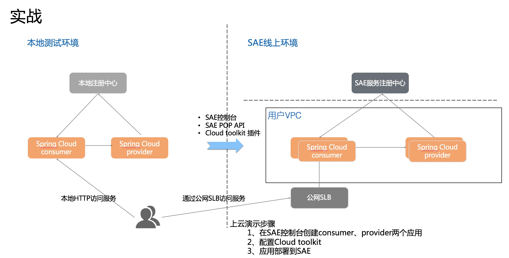

<!DOCTYPE html>
<!-- saved from url=(0046)https://kaiiiz.github.io/hexo-theme-book-demo/ -->
<html xmlns="http://www.w3.org/1999/xhtml">
<head>
    <head>
        <meta http-equiv="Content-Type" content="text/html; charset=UTF-8">
        <meta name="viewport" content="width=device-width, initial-scale=1, maximum-scale=1.0, user-scalable=no">
        <link rel="icon" href="../../static/favicon.png">
        <title>26 Spring CloudDubbo 应用无缝迁移到 Serverless 架构.md</title>
        <!-- Spectre.css framework -->
        <link rel="stylesheet" href="../../static/index.css">
        <!-- theme css & js -->
        <meta name="generator" content="Hexo 4.2.0">
    </head>

<body>

    

        

            <a href="../../index.html">
                
                技术文章摘抄
            </a>
        

        

            <ul class="uncollapsible">
                <li><a href="../../index.html" class="current-tab">首页</a></li>
            </ul>

            <ul class="uncollapsible">
                <li><a href="../index.html">上一级</a></li>
            </ul>

            <ul class="uncollapsible">
                <li>

                    
                    <a href="01&#32;架构的演进.md">01 架构的演进.md</a>

                </li>
                <li>

                    
                    <a href="02&#32;Serverless&#32;的价值.md">02 Serverless 的价值.md</a>

                </li>
                <li>

                    
                    <a href="03&#32;常见&#32;Serverless&#32;架构模式.md">03 常见 Serverless 架构模式.md</a>

                </li>
                <li>

                    
                    <a href="04&#32;Serverless&#32;技术选型.md">04 Serverless 技术选型.md</a>

                </li>
                <li>

                    
                    <a href="05&#32;函数计算简介.md">05 函数计算简介.md</a>

                </li>
                <li>

                    
                    <a href="06&#32;函数计算是如何工作的？.md">06 函数计算是如何工作的？.md</a>

                </li>
                <li>

                    
                    <a href="07&#32;函数粘合云服务提供端到端解决方案.md">07 函数粘合云服务提供端到端解决方案.md</a>

                </li>
                <li>

                    
                    <a href="08&#32;函数计算的开发与配置.md">08 函数计算的开发与配置.md</a>

                </li>
                <li>

                    
                    <a href="09&#32;函数的调试与部署.md">09 函数的调试与部署.md</a>

                </li>
                <li>

                    
                    <a href="10&#32;自动化&#32;CI&amp;CD&#32;与灰度发布.md">10 自动化 CI&amp;CD 与灰度发布.md</a>

                </li>
                <li>

                    
                    <a href="11&#32;函数计算的可观测性.md">11 函数计算的可观测性.md</a>

                </li>
                <li>

                    
                    <a href="12&#32;典型案例&#32;1：函数计算在音视频场景实践.md">12 典型案例 1：函数计算在音视频场景实践.md</a>

                </li>
                <li>

                    
                    <a href="13&#32;典型案例&#32;3：十分钟搭建弹性可扩展的&#32;Web&#32;API.md">13 典型案例 3：十分钟搭建弹性可扩展的 Web API.md</a>

                </li>
                <li>

                    
                    <a href="14&#32;Serverless&#32;Kubernetes&#32;容器服务介绍.md">14 Serverless Kubernetes 容器服务介绍.md</a>

                </li>
                <li>

                    
                    <a href="15&#32;Serverless&#32;Kubernetes&#32;应用部署及扩缩容.md">15 Serverless Kubernetes 应用部署及扩缩容.md</a>

                </li>
                <li>

                    
                    <a href="16&#32;使用&#32;Spot&#32;低成本运行&#32;Job&#32;任务.md">16 使用 Spot 低成本运行 Job 任务.md</a>

                </li>
                <li>

                    
                    <a href="17&#32;低成本运行&#32;Spark&#32;数据计算.md">17 低成本运行 Spark 数据计算.md</a>

                </li>
                <li>

                    
                    <a href="18&#32;GPU&#32;机器学习开箱即用.md">18 GPU 机器学习开箱即用.md</a>

                </li>
                <li>

                    
                    <a href="19&#32;基于&#32;Knative&#32;低成本部署在线应用，灵活自动伸缩.md">19 基于 Knative 低成本部署在线应用，灵活自动伸缩.md</a>

                </li>
                <li>

                    
                    <a href="20&#32;快速构建&#32;JenkinsGitlab&#32;持续集成环境.md">20 快速构建 JenkinsGitlab 持续集成环境.md</a>

                </li>
                <li>

                    
                    <a href="21&#32;在线应用的&#32;Serverless&#32;实践.md">21 在线应用的 Serverless 实践.md</a>

                </li>
                <li>

                    
                    <a href="22&#32;通过&#32;IDEMaven&#32;部署&#32;Serverless&#32;应用实践.md">22 通过 IDEMaven 部署 Serverless 应用实践.md</a>

                </li>
                <li>

                    
                    <a href="23&#32;企业级&#32;CICD&#32;工具部署&#32;Serverless&#32;应用的落地实践.md">23 企业级 CICD 工具部署 Serverless 应用的落地实践.md</a>

                </li>
                <li>

                    
                    <a href="24&#32;Serverless&#32;应用如何管理日志&amp;持久化数据.md">24 Serverless 应用如何管理日志&amp;持久化数据.md</a>

                </li>
                <li>

                    
                    <a href="25&#32;Serverless&#32;应用引擎产品的流量负载均衡和路由策略配置实践.md">25 Serverless 应用引擎产品的流量负载均衡和路由策略配置实践.md</a>

                </li>
                <li>

                    <a class="current-tab" href="26&#32;Spring&#32;CloudDubbo&#32;应用无缝迁移到&#32;Serverless&#32;架构.md">26 Spring CloudDubbo 应用无缝迁移到 Serverless 架构.md</a>
                    

                </li>
                <li>

                    
                    <a href="27&#32;SAE&#32;应用分批发布与无损下线的最佳实践.md">27 SAE 应用分批发布与无损下线的最佳实践.md</a>

                </li>
                <li>

                    
                    <a href="https://learn.lianglianglee.com/%E4%B8%93%E6%A0%8F/Serverless%20%E6%8A%80%E6%9C%AF%E5%85%AC%E5%BC%80%E8%AF%BE%EF%BC%88%E5%AE%8C%EF%BC%89/28%20%E5%A6%82%E4%BD%95%E9%80%9A%E8%BF%87%E5%8E%8B%E6%B5%8B%E5%B7%A5%E5%85%B7+%20SAE%20%E5%BC%B9%E6%80%A7%E8%83%BD%E5%8A%9B%E8%BD%BB%E6%9D%BE%E5%BA%94%E5%AF%B9%E5%A4%A7%E4%BF%83.md">28 如何通过压测工具+ SAE 弹性能力轻松应对大促.md</a>

                </li>
                <li>

                    
                    <a href="29&#32;SAE&#32;极致应用部署效率.md">29 SAE 极致应用部署效率.md</a>

                </li>
            </ul>

        

    

    

        

    

    

    

        

            

                

                    <!-- For Responsive Layout -->
                    <header class="navbar">
                        <section class="navbar-section">
                            <a onclick="open_sidebar()">
                                <i class="icon icon-menu"></i>
                            </a>
                        </section>
                    </header>
                

                

                    

                        

                        
<h1>26 Spring CloudDubbo 应用无缝迁移到 Serverless 架构</h1>
<h3>背景</h3>

通过前面几节课程的学习，相信大家对于 SAE 平台已经有了一定的了解，SAE 基于 IaaS 层资源构建的一款 Serverles 应用托管产品，免除了客户很多复杂的运维工作，开箱即用、按用量付费；并且提供了丰富的 Open API 可以很容易地与其他平台做集成。

本文将为大家介绍 SAE 在微服务方面的一些能力，SAE 产品把 Serverless 技术和微服务做了很好的结合，天然支持 Java 微服务应用的托管和服务治理，对 SpringCloud/Dubbo 微服务应用能够在只修改配置和依赖，不修改代码的情况下迁移到 SAE 上，并提供服务治理能力，比如基于租户的微服务隔离环境、服务列表、无损下线、离群摘除、应用监控以及调用链分析等。

本次课程分为三部分来介绍，分别介绍微服务应用迁移到 SAE 的优势，如何迁移 SpringCloud/Dubbo 应用到 SAE 上，以及针对 SpringCloud 应用迁移的实践演示。

<h3>迁移到 SAE 的优势</h3>

在介绍迁移之前，先介绍下 SpringCloud/Dubbo 应用迁移到 SAE 的优势：

<ul>
<li>**SAE 内置注册中心：**所有用户共享注册中心组件，SAE 帮助用户运维，这就节省了用户的部署、运维成本；在服务注册和发现的过程中进行链路加密，无需担心被未授权的服务发现。</li>
<li>**服务治理：**SAE 有命名空间的概念，是基于微服务租户的逻辑隔离环境，用户可以使用不同的命名空间来隔离微服务的注册、发现和调用，提供无损下线、离群摘除和限流降级等服务治理能力。</li>
<li>**应用监控：**SAE 针对微服务应用提供主机监控、异常栈分析以及分布式调用链路分析等能力，可以提升微服务应用的可观测性和诊断能力。</li>
<li>**零代码改造：**简单接入就可以享受免运维体验。</li>
</ul>
<h3>SpringCloud/Dubbo 迁移方案</h3>

那如何迁移 SpringCloud/Dubbo 应用到 SAE 呢？我们只需要修改添加依赖和配置，就可以把应用部署到 SAE 上。

Dubbo 应用需要添加 dubbo-register-nacos 和 nacos-client 依赖；SpringCloud 应用需要添加 spring-cloud-starter-alibaba-nacos-discovery 即可。

<h3>SpringCloud/Dubbo 应用迁移实战</h3>

Spring Cloud 提供了简化应用开发的一系列标准和规范。

目前业界流行的 Spring Cloud 具体实现有 Spring Cloud Netflix、Spring Cloud Consul、Spring Cloud Gateway 和 Spring Cloud Alibaba 等。

如果您熟悉 Spring Cloud 中的 Eureka、Consul 和 ZooKeeper 等服务注册组件，但未使用过 Spring Cloud Alibaba 的服务注册组件 Nacos Discovery，那么您仅需将服务注册组件的服务依赖关系和服务配置替换成 Spring Cloud Alibaba Nacos Discovery，无需修改任何代码。

Spring Cloud Alibaba Nacos Discovery 同样实现了 Spring Cloud Registry 的标准接口与规范，与您之前使用 Spring Cloud 接入服务注册与发现的方式基本一致。

接下来针对 SpringCloud 应用迁移过程进行演示，演示过程请点击视频课：https://developer.aliyun.com/lesson<em>2026</em>19003 进行观看。

                    

                    

                        

                            <a href="25&#32;Serverless&#32;应用引擎产品的流量负载均衡和路由策略配置实践.md">上一页</a>
                        

                        

                            <a href="27&#32;SAE&#32;应用分批发布与无损下线的最佳实践.md">下一页</a>
                        

                    

                

            

        

    

    

</body>
<!-- Global site tag (gtag.js) - Google Analytics -->

</html>
