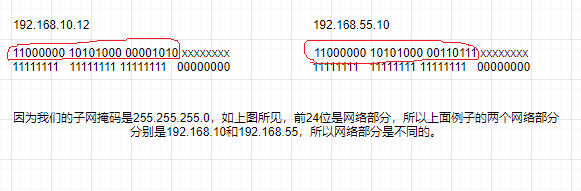

<!DOCTYPE html>
<!-- saved from url=(0046)https://kaiiiz.github.io/hexo-theme-book-demo/ -->
<html xmlns="http://www.w3.org/1999/xhtml">
<head>
    <head>
        <meta http-equiv="Content-Type" content="text/html; charset=UTF-8">
        <meta name="viewport" content="width=device-width, initial-scale=1, maximum-scale=1.0, user-scalable=no">
        <link rel="icon" href="../../static/favicon.png">
        <title>11 我已经没地方住了吗 - IPv6.md</title>
        <!-- Spectre.css framework -->
        <link rel="stylesheet" href="../../static/index.css">
        <!-- theme css & js -->
        <meta name="generator" content="Hexo 4.2.0">
    </head>

<body>

    

        

            <a href="../../index.html">
                
                技术文章摘抄
            </a>
        

        

            <ul class="uncollapsible">
                <li><a href="../../index.html" class="current-tab">首页</a></li>
            </ul>

            <ul class="uncollapsible">
                <li><a href="../index.html">上一级</a></li>
            </ul>

            <ul class="uncollapsible">
                <li>

                    
                    <a href="01&#32;我应该站在谁的肩膀上&#32;-&#32;OSI&#32;vs&#32;TCPIP模型.md">01 我应该站在谁的肩膀上 - OSI vs TCPIP模型.md</a>

                </li>
                <li>

                    
                    <a href="https://learn.lianglianglee.com/%E4%B8%93%E6%A0%8F/%E5%85%A8%E8%A7%A3%E7%BD%91%E7%BB%9C%E5%8D%8F%E8%AE%AE/02%20%E4%B8%87%E4%B8%88%E9%AB%98%E6%A5%BC%E5%B9%B3%E5%9C%B0%E8%B5%B7-%20%E7%89%A9%E7%90%86%E5%B1%82%20+%20%E6%95%B0%E6%8D%AE%E9%93%BE%E8%B7%AF%E5%B1%82.md">02 万丈高楼平地起- 物理层 + 数据链路层.md</a>

                </li>
                <li>

                    
                    <a href="03&#32;OSI的灵魂就是我&#32;-&#32;网络层.md">03 OSI的灵魂就是我 - 网络层.md</a>

                </li>
                <li>

                    
                    <a href="04&#32;要快还是要稳你说好了&#32;-&#32;传输层.md">04 要快还是要稳你说好了 - 传输层.md</a>

                </li>
                <li>

                    
                    <a href="05&#32;是时候展现真正的技术了&#32;-&#32;应用层.md">05 是时候展现真正的技术了 - 应用层.md</a>

                </li>
                <li>

                    
                    <a href="06&#32;重回小学课堂&#32;-&#32;二进制101.md">06 重回小学课堂 - 二进制101.md</a>

                </li>
                <li>

                    
                    <a href="https://learn.lianglianglee.com/%E4%B8%93%E6%A0%8F/%E5%85%A8%E8%A7%A3%E7%BD%91%E7%BB%9C%E5%8D%8F%E8%AE%AE/07%201+1%20=%202%E5%90%97%EF%BC%9F%20-%20%E4%BA%8C%E8%BF%9B%E5%88%B6%E7%9A%84%E8%AE%A1%E7%AE%97.md">07 1+1 = 2吗？ - 二进制的计算.md</a>

                </li>
                <li>

                    
                    <a href="08&#32;16进制又是个什么鬼？&#32;-&#32;16进制的讲解.md">08 16进制又是个什么鬼？ - 16进制的讲解.md</a>

                </li>
                <li>

                    
                    <a href="09&#32;我想有个家&#32;-&#32;什么是IP地址.md">09 我想有个家 - 什么是IP地址.md</a>

                </li>
                <li>

                    
                    <a href="10&#32;我可是住二环的人&#32;-&#32;IP地址的组成和分类.md">10 我可是住二环的人 - IP地址的组成和分类.md</a>

                </li>
                <li>

                    <a class="current-tab" href="11&#32;我已经没地方住了吗&#32;-&#32;IPv6.md">11 我已经没地方住了吗 - IPv6.md</a>
                    

                </li>
                <li>

                    
                    <a href="12&#32;向左还是向右&#32;-&#32;IP路由.md">12 向左还是向右 - IP路由.md</a>

                </li>
                <li>

                    
                    <a href="13&#32;我能给你安全感&#32;-&#32;TCP（一）.md">13 我能给你安全感 - TCP（一）.md</a>

                </li>
                <li>

                    
                    <a href="14&#32;我那不为人知的秘密是什么&#32;-&#32;TCP（二）.md">14 我那不为人知的秘密是什么 - TCP（二）.md</a>

                </li>
                <li>

                    
                    <a href="15&#32;不问收没收到，就问快不快&#32;-&#32;UDP.md">15 不问收没收到，就问快不快 - UDP.md</a>

                </li>
                <li>

                    
                    <a href="16&#32;我为什么与众不同&#32;-&#32;TCP高级篇（拥塞模型）.md">16 我为什么与众不同 - TCP高级篇（拥塞模型）.md</a>

                </li>
                <li>

                    
                    <a href="17&#32;来，先看看我的家谱&#32;-&#32;HTTP的身世.md">17 来，先看看我的家谱 - HTTP的身世.md</a>

                </li>
                <li>

                    
                    <a href="18&#32;我都这么成功了，你却说我不行&#32;-&#32;HTTP&#32;的特点和缺点.md">18 我都这么成功了，你却说我不行 - HTTP 的特点和缺点.md</a>

                </li>
                <li>

                    
                    <a href="19&#32;我老了，让我儿子来吧&#32;-&#32;HTTP2.md">19 我老了，让我儿子来吧 - HTTP2.md</a>

                </li>
                <li>

                    
                    <a href="20&#32;稳重的大外甥&#32;-&#32;HTTPS.md">20 稳重的大外甥 - HTTPS.md</a>

                </li>
                <li>

                    
                    <a href="21&#32;HTTP的高级篇&#32;-&#32;HTTPClient（Java）.md">21 HTTP的高级篇 - HTTPClient（Java）.md</a>

                </li>
                <li>

                    
                    <a href="22&#32;想来我家，你自己查呀&#32;-&#32;DNS.md">22 想来我家，你自己查呀 - DNS.md</a>

                </li>
                <li>

                    
                    <a href="23&#32;来的早，不如来得巧&#32;-&#32;NAT.md">23 来的早，不如来得巧 - NAT.md</a>

                </li>
                <li>

                    
                    <a href="24&#32;辛苦的邮政&#32;-&#32;SMTP.md">24 辛苦的邮政 - SMTP.md</a>

                </li>
                <li>

                    
                    <a href="25&#32;你就是看不见我&#32;-&#32;VPN.md">25 你就是看不见我 - VPN.md</a>

                </li>
                <li>

                    
                    <a href="26&#32;黑客的好帮手&#32;-&#32;SSH.md">26 黑客的好帮手 - SSH.md</a>

                </li>
                <li>

                    
                    <a href="27&#32;你可以得到我的心，却得不到我的人&#32;-&#32;物理安全设备.md">27 你可以得到我的心，却得不到我的人 - 物理安全设备.md</a>

                </li>
                <li>

                    
                    <a href="28&#32;你怎么证明你就是你&#32;-&#32;身份验证和访问控制.md">28 你怎么证明你就是你 - 身份验证和访问控制.md</a>

                </li>
                <li>

                    
                    <a href="29&#32;我要怎么藏好我的考研资料&#32;-&#32;网络攻击（一）.md">29 我要怎么藏好我的考研资料 - 网络攻击（一）.md</a>

                </li>
                <li>

                    
                    <a href="30&#32;我要怎么藏好我的考研资料&#32;-&#32;网络攻击（二）.md">30 我要怎么藏好我的考研资料 - 网络攻击（二）.md</a>

                </li>
                <li>

                    
                    <a href="31&#32;如何保护我的考研资料&#32;-&#32;网络攻击防范.md">31 如何保护我的考研资料 - 网络攻击防范.md</a>

                </li>
                <li>

                    
                    <a href="32&#32;Linux网络安全&#32;-&#32;安全实战.md">32 Linux网络安全 - 安全实战.md</a>

                </li>
                <li>

                    
                    <a href="33&#32;结语.md">33 结语.md</a>

                </li>
            </ul>

        

    

    

        

    

    

    

        

            

                

                    <!-- For Responsive Layout -->
                    <header class="navbar">
                        <section class="navbar-section">
                            <a onclick="open_sidebar()">
                                <i class="icon icon-menu"></i>
                            </a>
                        </section>
                    </header>
                

                

                    

                        

                        
<h1>11 我已经没地方住了吗 - IPv6</h1>
<h3>IPV6的成长史</h3>

IPV6其实已经是一位80后。它生于八十年代后期，当时的工程师们已经意识到IPV4的空间正在迅速耗尽。然后到了1995年左右，IPV4进行了一次挣扎。那就是实现了子网技术（我们前面有讲过），这样就可以缓解IP地址不足和遍及全球的问题。从那时起已经过去了20多年，我们现在才刚刚开始看到IPV6在世界上的快速发展和部署。（我记得我2011年的时候想要去考CCNA，IPV6的知识设计的很少）。那么这是否意味着我们将立即转成IPV6吗？那当然是极不可能的。比如在医疗保健领域。IT的技术不是那么的先进。整个商业领域中尚不支持IPV6。因此，我们必须要找到一种折中的办法。你先去洗一下脸，清醒一下。忘记IPV6已经三十多岁了还一事无成。忘记某些领域完全不支持IPV6。我希望当你读到这篇文章的时候，内心是充满希望，是充满着对明天美好的憧憬。我们来看一下IPV6的工作原理。他本身是一个阳光帅气的中年大叔（每位大叔都是潜力股）。只是还没有完全的开花。

<h3>IPV4 vs IPV6</h3>

俗话说的话，没有对比就没有伤害，但是不对比，我们又怎么能知道两者的区别以及强弱呢。那我们就来无情的对比一下IPV4和IPV6。

<h4>IPV4</h4>

首先IPV4是32字节长，有4个八位位组。 比如192.168.0.10。转成二进制就是11000000 1010100 00000000 00001010

<h4>IPV6</h4>

IPV6呢却比IPV4要长很多。有128位。表示的方式呢，也是16进制的。比如这个例子2001:0DB8:0123:007D:0000:0000:00A5:53B5。

IPV6的话，也同样分为网络部分和主机部分。一般是前64位作为网络部分，这个不是必须的。却是极力推荐的，因为IPV6就是这么设计的。可能你会觉得这个IPV6的地址太长了，这是不是太难记了。这位80后的钻石王老五已经想到了。为了可以吸引更多的漂亮妹子。它做了一些改变。比如前缀0优化。这是什么意思呢？

<pre><code>比如说你现在手上有1元，那你写成01元还有001元还有0001元有区别吗？是不是都等于1元。
但是如果0在后面比如10元，100元，1000元，还等于1元吗？当然不等于是不是。所以前置的0是可以省略的。那么我们上面的IPV6地址就可以写成
2001:0DB8:0123:007D:0000:0000:00A5:53B5 全写
2001:DB8:123:7D:0:0:A5:53B5 简写 还可以写成更简写
2001:DB8:123:7D::A5:53B5

复制
</code></pre>

这里提示一个潜在的错误，那就是：：这种简写只能用一次。比如下面这个例子就是错误的

<pre><code>2001:DB8:123::A5::53B5 (X) 你想一下这个为什么是错误的呢？
因为你无法判断前面和后面0的个数
2001:DB8:123:0:A5:0:0:53B5 (第一种可能)
2001:DB8:123:0:0:A5:0:53B5（第二种可能）

复制
</code></pre>

如果你都无法判断，你怎么可能要求计算机知道哪种是你需要的呢？所以这个是要切记的点。

我们知道了IPV6的结构，那IPV6是怎么运作的呢，理论上来说和IPV4运作非常相似。如果有两台设备用电缆连接在一起。他们想要互相通信的话，这些地址的网络部分必须匹配。比如这个例子

<pre><code>192.168.10.10
255.255.255.0 
和
192.168.10.12
255.255.255.0

复制
</code></pre>

如果我的IPV4不具有相同的网络部分，那么这些设备就无法就行通信。比如下面这个例子。

<pre><code>192.168.55.10
255.255.255.0 
和
192.168.10.12
255.255.255.0

复制
</code></pre>

从这个图的红色范围里，你可以清楚的看到两个IP地址的网络部分是完全不同的。所以无法直接进行通信。除非你在中间添加一个路由器。

IPV6和IPV4的原理是相似的。如果网络部分相同，之间是可以互相通信的。比如

<pre><code>2001：CA7:3:B::10/64
和
2001：CA7:3:B::11/64

复制
</code></pre>

如果我稍微的修改一下，比如下面这样，那他们就不能直接通信了。当然路由器还是可以解决问题的

<pre><code>2001：CA7:3:A::10/64
和
2001：CA7:3:B::11/64

复制
</code></pre>

我们来放大我们的场景到Internet。当在Internet上进行通信时，我们需要使用的是称为IPV6的全球单播地址，用于全球通信。还需要一个链路本地地址来进行本地的通信。让我们继续向下一起来看一下IPV6的地址类型。

<h3>IPV6的地址类型</h3>
<ul>
<li>单播地址
<ul>
<li>全球单播地址</li>
<li>链路本地地址 - 用于本地的通信。格式必须是FE80::/10</li>
<li>环回地址 - ::1/128 (还记得IPV4的环回地址是多少吗127.0.0.1)</li>
<li>未指定地址 ::/128</li>
<li>唯一本地地址 FC00::/7, 这个地址是不可以和公共网络进行交流的，这点和IPV4不同，IPV4的话，即使是私有地址，通过NAT还是可以和公网通信。但是在IPV6中，却无法左到这一点。所以这个唯一本地地址对你做实验和练习的时候比较有用，但是不适合设置你的网络环境来和公网通信。</li>
</ul>
</li>
<li>组播地址
<ul>
<li>一对多的通信。主要用于企业内部</li>
</ul>
</li>
<li>任播地址
<ul>
<li>一个IPV6地址赋给多态机器（Wait a Sec。这时候你是不是会有疑惑，这样是不是违规了？你的猜测是正确的，那你开动脑瓜想一想，有什么场景可以这么使用）--&gt; 负载均衡（Load Balancing）</li>
</ul>
</li>
</ul>
<h3>IPV6的地址数量</h3>

你是不是会有一个疑问？就是我们之所以使用IPV6就是因为IPV4的地址太少了，快被用完了，所以才有了IPV6，那么IPV6有多少地址呢？我可以负责任的告诉你，很多很多。真的是太难以计算了，我们来看一个单一的网络地址吧。比如网络部分已经确定了，然后只考虑主机部分的64位。就是说一个确定的IPV6网络地址上有多少个主机地址可以分配，就是2的64次方，计算出来是18,446,744,073,709,600,000。我已经不知道这个数字怎么念出来了，所以就给你一个“准确的”数字，那就是很多很多。你觉得IPV6会用尽吗？我只能说世事无绝对，但是基本上我们这一代是不用操心这个问题了。估计你不需要学习IPV8了。

                    

                    

                        

                            <a href="10&#32;我可是住二环的人&#32;-&#32;IP地址的组成和分类.md">上一页</a>
                        

                        

                            <a href="12&#32;向左还是向右&#32;-&#32;IP路由.md">下一页</a>
                        

                    

                

            

        

    

    

</body>
<!-- Global site tag (gtag.js) - Google Analytics -->

</html>
