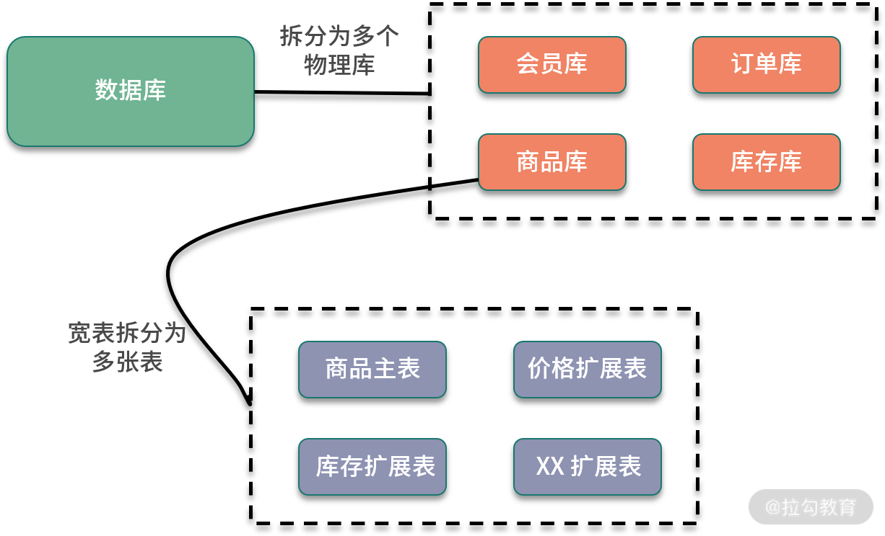

<!DOCTYPE html>
<!-- saved from url=(0046)https://kaiiiz.github.io/hexo-theme-book-demo/ -->
<html xmlns="http://www.w3.org/1999/xhtml">
<head>
    <head>
        <meta http-equiv="Content-Type" content="text/html; charset=UTF-8">
        <meta name="viewport" content="width=device-width, initial-scale=1, maximum-scale=1.0, user-scalable=no">
        <link rel="icon" href="../../static/favicon.png">
        <title>24 为什么需要分库分表，如何实现？.md</title>
        <!-- Spectre.css framework -->
        <link rel="stylesheet" href="../../static/index.css">
        <!-- theme css & js -->
        <meta name="generator" content="Hexo 4.2.0">
    </head>

<body>

    

        

            <a href="../../index.html">
                
                技术文章摘抄
            </a>
        

        

            <ul class="uncollapsible">
                <li><a href="../../index.html" class="current-tab">首页</a></li>
            </ul>

            <ul class="uncollapsible">
                <li><a href="../index.html">上一级</a></li>
            </ul>

            <ul class="uncollapsible">
                <li>

                    
                    <a href="00&#32;开篇词：搭建分布式知识体系，挑战高薪&#32;Offer.md">00 开篇词：搭建分布式知识体系，挑战高薪 Offer.md</a>

                </li>
                <li>

                    
                    <a href="01&#32;如何证明分布式系统的&#32;CAP&#32;理论？.md">01 如何证明分布式系统的 CAP 理论？.md</a>

                </li>
                <li>

                    
                    <a href="02&#32;不同数据一致性模型有哪些应用？.md">02 不同数据一致性模型有哪些应用？.md</a>

                </li>
                <li>

                    
                    <a href="03&#32;如何透彻理解&#32;Paxos&#32;算法？.md">03 如何透彻理解 Paxos 算法？.md</a>

                </li>
                <li>

                    
                    <a href="04&#32;ZooKeeper&#32;如何保证数据一致性？.md">04 ZooKeeper 如何保证数据一致性？.md</a>

                </li>
                <li>

                    
                    <a href="05&#32;共识问题：区块链如何确认记账权？.md">05 共识问题：区块链如何确认记账权？.md</a>

                </li>
                <li>

                    
                    <a href="06&#32;如何准备一线互联网公司面试？.md">06 如何准备一线互联网公司面试？.md</a>

                </li>
                <li>

                    
                    <a href="07&#32;分布式事务有哪些解决方案？.md">07 分布式事务有哪些解决方案？.md</a>

                </li>
                <li>

                    
                    <a href="08&#32;对比两阶段提交，三阶段协议有哪些改进？.md">08 对比两阶段提交，三阶段协议有哪些改进？.md</a>

                </li>
                <li>

                    
                    <a href="09&#32;MySQL&#32;数据库如何实现&#32;XA&#32;规范？.md">09 MySQL 数据库如何实现 XA 规范？.md</a>

                </li>
                <li>

                    
                    <a href="10&#32;如何在业务中体现&#32;TCC&#32;事务模型？.md">10 如何在业务中体现 TCC 事务模型？.md</a>

                </li>
                <li>

                    
                    <a href="11&#32;分布式锁有哪些应用场景和实现？.md">11 分布式锁有哪些应用场景和实现？.md</a>

                </li>
                <li>

                    
                    <a href="12&#32;如何使用&#32;Redis&#32;快速实现分布式锁？.md">12 如何使用 Redis 快速实现分布式锁？.md</a>

                </li>
                <li>

                    
                    <a href="https://learn.lianglianglee.com/%E4%B8%93%E6%A0%8F/%E5%88%86%E5%B8%83%E5%BC%8F%E6%8A%80%E6%9C%AF%E5%8E%9F%E7%90%86%E4%B8%8E%E5%AE%9E%E6%88%9845%E8%AE%B2-%E5%AE%8C/13%20%E5%88%86%E5%B8%83%E5%BC%8F%E4%BA%8B%E5%8A%A1%E8%80%83%E7%82%B9%E6%A2%B3%E7%90%86%20+%20%E9%AB%98%E9%A2%91%E9%9D%A2%E8%AF%95%E9%A2%98.md">13 分布式事务考点梳理 + 高频面试题.md</a>

                </li>
                <li>

                    
                    <a href="14&#32;如何理解&#32;RPC&#32;远程服务调用？.md">14 如何理解 RPC 远程服务调用？.md</a>

                </li>
                <li>

                    
                    <a href="15&#32;为什么微服务需要&#32;API&#32;网关？.md">15 为什么微服务需要 API 网关？.md</a>

                </li>
                <li>

                    
                    <a href="16&#32;如何实现服务注册与发现？.md">16 如何实现服务注册与发现？.md</a>

                </li>
                <li>

                    
                    <a href="17&#32;如何实现分布式调用跟踪？.md">17 如何实现分布式调用跟踪？.md</a>

                </li>
                <li>

                    
                    <a href="18&#32;分布式下如何实现配置管理？.md">18 分布式下如何实现配置管理？.md</a>

                </li>
                <li>

                    
                    <a href="19&#32;容器化升级对服务有哪些影响？.md">19 容器化升级对服务有哪些影响？.md</a>

                </li>
                <li>

                    
                    <a href="20&#32;ServiceMesh：服务网格有哪些应用？.md">20 ServiceMesh：服务网格有哪些应用？.md</a>

                </li>
                <li>

                    
                    <a href="21&#32;Dubbo&#32;vs&#32;Spring&#32;Cloud：两大技术栈如何选型？.md">21 Dubbo vs Spring Cloud：两大技术栈如何选型？.md</a>

                </li>
                <li>

                    
                    <a href="https://learn.lianglianglee.com/%E4%B8%93%E6%A0%8F/%E5%88%86%E5%B8%83%E5%BC%8F%E6%8A%80%E6%9C%AF%E5%8E%9F%E7%90%86%E4%B8%8E%E5%AE%9E%E6%88%9845%E8%AE%B2-%E5%AE%8C/22%20%E5%88%86%E5%B8%83%E5%BC%8F%E6%9C%8D%E5%8A%A1%E8%80%83%E7%82%B9%E6%A2%B3%E7%90%86%20+%20%E9%AB%98%E9%A2%91%E9%9D%A2%E8%AF%95%E9%A2%98.md">22 分布式服务考点梳理 + 高频面试题.md</a>

                </li>
                <li>

                    
                    <a href="23&#32;读写分离如何在业务中落地？.md">23 读写分离如何在业务中落地？.md</a>

                </li>
                <li>

                    <a class="current-tab" href="24&#32;为什么需要分库分表，如何实现？.md">24 为什么需要分库分表，如何实现？.md</a>
                    

                </li>
                <li>

                    
                    <a href="25&#32;存储拆分后，如何解决唯一主键问题？.md">25 存储拆分后，如何解决唯一主键问题？.md</a>

                </li>
                <li>

                    
                    <a href="26&#32;分库分表以后，如何实现扩容？.md">26 分库分表以后，如何实现扩容？.md</a>

                </li>
                <li>

                    
                    <a href="27&#32;NoSQL&#32;数据库有哪些典型应用？.md">27 NoSQL 数据库有哪些典型应用？.md</a>

                </li>
                <li>

                    
                    <a href="28&#32;ElasticSearch&#32;是如何建立索引的？.md">28 ElasticSearch 是如何建立索引的？.md</a>

                </li>
                <li>

                    
                    <a href="https://learn.lianglianglee.com/%E4%B8%93%E6%A0%8F/%E5%88%86%E5%B8%83%E5%BC%8F%E6%8A%80%E6%9C%AF%E5%8E%9F%E7%90%86%E4%B8%8E%E5%AE%9E%E6%88%9845%E8%AE%B2-%E5%AE%8C/29%20%E5%88%86%E5%B8%83%E5%BC%8F%E5%AD%98%E5%82%A8%E8%80%83%E7%82%B9%E6%A2%B3%E7%90%86%20+%20%E9%AB%98%E9%A2%91%E9%9D%A2%E8%AF%95%E9%A2%98.md">29 分布式存储考点梳理 + 高频面试题.md</a>

                </li>
                <li>

                    
                    <a href="30&#32;消息队列有哪些应用场景？.md">30 消息队列有哪些应用场景？.md</a>

                </li>
                <li>

                    
                    <a href="31&#32;集群消费和广播消费有什么区别？.md">31 集群消费和广播消费有什么区别？.md</a>

                </li>
                <li>

                    
                    <a href="32&#32;业务上需要顺序消费，怎么保证时序性？.md">32 业务上需要顺序消费，怎么保证时序性？.md</a>

                </li>
                <li>

                    
                    <a href="33&#32;消息幂等：如何保证消息不被重复消费？.md">33 消息幂等：如何保证消息不被重复消费？.md</a>

                </li>
                <li>

                    
                    <a href="34&#32;高可用：如何实现消息队列的&#32;HA？.md">34 高可用：如何实现消息队列的 HA？.md</a>

                </li>
                <li>

                    
                    <a href="35&#32;消息队列选型：Kafka&#32;如何实现高性能？.md">35 消息队列选型：Kafka 如何实现高性能？.md</a>

                </li>
                <li>

                    
                    <a href="36&#32;消息队列选型：RocketMQ&#32;适用哪些场景？.md">36 消息队列选型：RocketMQ 适用哪些场景？.md</a>

                </li>
                <li>

                    
                    <a href="https://learn.lianglianglee.com/%E4%B8%93%E6%A0%8F/%E5%88%86%E5%B8%83%E5%BC%8F%E6%8A%80%E6%9C%AF%E5%8E%9F%E7%90%86%E4%B8%8E%E5%AE%9E%E6%88%9845%E8%AE%B2-%E5%AE%8C/37%20%E6%B6%88%E6%81%AF%E9%98%9F%E5%88%97%E8%80%83%E7%82%B9%E6%A2%B3%E7%90%86%20+%20%E9%AB%98%E9%A2%91%E9%9D%A2%E8%AF%95%E9%A2%98.md">37 消息队列考点梳理 + 高频面试题.md</a>

                </li>
                <li>

                    
                    <a href="38&#32;不止业务缓存，分布式系统中还有哪些缓存？.md">38 不止业务缓存，分布式系统中还有哪些缓存？.md</a>

                </li>
                <li>

                    
                    <a href="39&#32;如何避免缓存穿透、缓存击穿、缓存雪崩？.md">39 如何避免缓存穿透、缓存击穿、缓存雪崩？.md</a>

                </li>
                <li>

                    
                    <a href="40&#32;经典问题：先更新数据库，还是先更新缓存？.md">40 经典问题：先更新数据库，还是先更新缓存？.md</a>

                </li>
                <li>

                    
                    <a href="41&#32;失效策略：缓存过期都有哪些策略？.md">41 失效策略：缓存过期都有哪些策略？.md</a>

                </li>
                <li>

                    
                    <a href="42&#32;负载均衡：一致性哈希解决了哪些问题？.md">42 负载均衡：一致性哈希解决了哪些问题？.md</a>

                </li>
                <li>

                    
                    <a href="43&#32;缓存高可用：缓存如何保证高可用？.md">43 缓存高可用：缓存如何保证高可用？.md</a>

                </li>
                <li>

                    
                    <a href="https://learn.lianglianglee.com/%E4%B8%93%E6%A0%8F/%E5%88%86%E5%B8%83%E5%BC%8F%E6%8A%80%E6%9C%AF%E5%8E%9F%E7%90%86%E4%B8%8E%E5%AE%9E%E6%88%9845%E8%AE%B2-%E5%AE%8C/44%20%E5%88%86%E5%B8%83%E5%BC%8F%E7%BC%93%E5%AD%98%E8%80%83%E7%82%B9%E6%A2%B3%E7%90%86%20+%20%E9%AB%98%E9%A2%91%E9%9D%A2%E8%AF%95%E9%A2%98.md">44 分布式缓存考点梳理 + 高频面试题.md</a>

                </li>
                <li>

                    
                    <a href="45&#32;从双十一看高可用的保障方式.md">45 从双十一看高可用的保障方式.md</a>

                </li>
                <li>

                    
                    <a href="46&#32;高并发场景下如何实现系统限流？.md">46 高并发场景下如何实现系统限流？.md</a>

                </li>
                <li>

                    
                    <a href="47&#32;降级和熔断：如何增强服务稳定性？.md">47 降级和熔断：如何增强服务稳定性？.md</a>

                </li>
                <li>

                    
                    <a href="48&#32;如何选择适合业务的负载均衡策略？.md">48 如何选择适合业务的负载均衡策略？.md</a>

                </li>
                <li>

                    
                    <a href="49&#32;线上服务有哪些稳定性指标？.md">49 线上服务有哪些稳定性指标？.md</a>

                </li>
                <li>

                    
                    <a href="50&#32;分布式下有哪些好用的监控组件？.md">50 分布式下有哪些好用的监控组件？.md</a>

                </li>
                <li>

                    
                    <a href="51&#32;分布式下如何实现统一日志系统？.md">51 分布式下如何实现统一日志系统？.md</a>

                </li>
                <li>

                    
                    <a href="52&#32;分布式路漫漫，厚积薄发才是王道.md">52 分布式路漫漫，厚积薄发才是王道.md</a>

                </li>
            </ul>

        

    

    

        

    

    

    

        

            

                

                    <!-- For Responsive Layout -->
                    <header class="navbar">
                        <section class="navbar-section">
                            <a onclick="open_sidebar()">
                                <i class="icon icon-menu"></i>
                            </a>
                        </section>
                    </header>
                

                

                    

                        

                        
<h1>24 为什么需要分库分表，如何实现？</h1>

你好，欢迎来到第 21 课时，本课时我们主要讲解“为什么需要分库分表，如何实现”。

在上一课时中讲到了读写分离，读写分离优化了互联网<strong>读多写少</strong>场景下的性能问题，考虑一个业务场景，如果读库的数据规模非常大，除了增加多个从库之外，还有其他的手段吗？

方法总比问题多，实现<strong>数据库高可用</strong>，还有另外一个撒手锏，就是<strong>分库分表</strong>，分库分表也是面试的常客，今天一起来看一下相关的知识。

<h3>分库分表的背景</h3>

互联网业务的一个特点就是用户量巨大，BAT等头部公司都是亿级用户，产生的数据规模也飞速增长，传统的单库单表架构不足以支撑业务发展，存在下面的性能瓶颈：

<h4>读写的数据量限制</h4>

数据库的数据量增大会直接影响读写的性能，比如一次查询操作，扫描 5 万条数据和 500 万条数据，查询速度肯定是不同的。

关于 MySQL 单库和单表的数据量限制，和不同的服务器配置，以及不同结构的数据存储有关，并没有一个确切的数字。这里参考阿里巴巴的《Java 开发手册》中数据库部分的建表规约：

<blockquote>

单表行数超过 500 万行或者单表容量超过 2GB，才推荐进行分库分表。

</blockquote>

<strong>基于阿里巴巴的海量业务数据和多年实践</strong>，这一条数据库规约，可以认为是数据库应用中的一个最佳实践。也就是在新业务建表规划时，或者当前数据库单表已经超过对应的限制，可以进行分库分表，同时也要避免过度设计。因为分库分表虽然可以提高性能，但是盲目地进行分库分表只会增加系统的复杂度。

<h4>数据库连接限制</h4>

数据库的连接是有限制的，不能无限制创建，比如 MySQL 中可以使用 max_connections 查看默认的最大连接数，当访问连接数过多时，就会导致连接失败。以电商为例，假设存储没有进行分库，用户、商品、订单和交易，所有的业务请求都访问同一个数据库，产生的连接数是非常可观的，可能导致数据库无法支持业务请求。

使用数据库连接池，可以优化连接数问题，但是更好的方式是通过分库等手段，避免数据库连接成为业务瓶颈。

除了这些，如果不进行数据库拆分，大量数据访问都集中在单台机器上，对磁盘 IO、CPU 负载等都会产生很大的压力，并且直接影响业务操作的性能。

<h3>分库分表原理</h3>

分库分表，顾名思义，就是将原本存储于单个数据库上的数据拆分到多个数据库，把原来存储在单张数据表的数据拆分到多张数据表中，实现数据切分，从而提升数据库操作性能。分库分表的实现可以分为两种方式：垂直切分和水平切分。

<h4>垂直切分</h4>

垂直拆分一般是按照业务和功能的维度进行拆分，把数据分别放到不同的数据库中。

垂直分库针对的是一个系统中对不同的业务进行拆分，根据业务维度进行数据的分离，剥离为多个数据库。比如电商网站早期，商品数据、会员数据、订单数据都是集中在一个数据库中，随着业务的发展，单库处理能力已成为瓶颈，这个时候就需要进行相关的优化，进行业务维度的拆分，分离出会员数据库、商品数据库和订单数据库等。

垂直分表是针对业务上的字段比较多的大表进行的，一般是把业务宽表中比较独立的字段，或者不常用的字段拆分到单独的数据表中。比如早期的商品表中，可能包含了商品信息、价格、库存等，可以拆分出来价格扩展表、库存扩展表等。

<h4>水平切分</h4>

水平拆分是把相同的表结构分散到不同的数据库和不同的数据表中，避免访问集中的单个数据库或者单张数据表，具体的分库和分表规则，一般是通过业务主键，进行哈希取模操作。

例如，电商业务中的订单信息访问频繁，可以将订单表分散到多个数据库中，实现分库；在每个数据库中，继续进行拆分到多个数据表中，实现分表。路由策略可以使用订单 ID 或者用户 ID，进行取模运算，路由到不同的数据库和数据表中。

<h3>分库分表后引入的问题</h3>

下面看一下，引入分库分表后额外增加了哪些系统设计的问题。

<ul>
<li>分布式事务问题</li>
</ul>

对业务进行分库之后，同一个操作会分散到多个数据库中，涉及跨库执行 SQL 语句，也就出现了分布式事务问题。

比如数据库拆分后，订单和库存在两个库中，一个下单减库存的操作，就涉及跨库事务。关于分布式事务的处理，我们在专栏“分布式事务”的模块中也介绍过，可以使用分布式事务中间件，实现 TCC 等事务模型；也可以使用基于本地消息表的分布式事务实现。如果对这部分印象不深，你可以回顾下前面讲过的内容。

<ul>
<li>跨库关联查询问题</li>
</ul>

分库分表后，跨库和跨表的查询操作实现起来会比较复杂，性能也无法保证。在实际开发中，针对这种需要跨库访问的业务场景，一般会使用额外的存储，比如维护一份文件索引。另一个方案是通过合理的数据库字段冗余，避免出现跨库查询。

<ul>
<li>跨库跨表的合并和排序问题</li>
</ul>

分库分表以后，数据分散存储到不同的数据库和表中，如果查询指定数据列表，或者需要对数据列表进行排序时，就变得异常复杂，则需要在内存中进行处理，整体性能会比较差，一般来说，会限制这类型的操作。具体的实现，可以依赖开源的分库分表中间件来处理，下面就来介绍一下。

<h3>分库分表中间件实现</h3>

业务中实现分库分表，需要自己去实现路由规则，实现跨库合并排序等操作，具有一定的开发成本，可以考虑使用开源的分库分表中间件。这里比较推荐 Apache ShardingSphere，另外也可以参考淘宝的 TDDL 等。

其中，ShardingSphere 的前身是当当开源的 Sharding-JDBC，目前更名为 ShardingSphere，并且已经加入 Apache 基金会。ShardingSphere 在 Sharding-JDBC 的基础上，额外提供了 Sharding-Proxy，以及正在规划中的 Sharding-Sidecar。其中 Sharding-JDBC 用来实现分库分表，另外也添加了对分布式事务等的支持。关于 ShardingSphere 的具体应用，感兴趣的同学可以去浏览 <a href="https://shardingsphere.apache.org/document/current/cn/overview/">《ShardingSphere 用户手册》</a>。

另一款 TDDL（Taobao Distributed Data Layer）是淘宝团队开发的数据库中间件，用于解决分库分表场景下的访问路由，TDDL 在淘宝大规模应用，遗憾的是开源部分还不太完善，社区已经很长时间都没有更新，可以在 <a href="https://github.com/alibaba/tb_tddl">TDDL 项目</a>仓库了解更多的信息。

<h3>总结</h3>

这一课时分享了分库分表相关的知识点，包括分库分表的业务背景，水平切分和垂直切分的不同方式，分库分表以后增加的系统复杂性问题，以及可以使用哪些开源的分库分表中间件解决对应问题。

你可以考察下目前项目里是否有应用分库分表，以及是如何实现分库分表，比如自研或者使用开源组件，并且留言分享。

                    

                    

                        

                            <a href="23&#32;读写分离如何在业务中落地？.md">上一页</a>
                        

                        

                            <a href="25&#32;存储拆分后，如何解决唯一主键问题？.md">下一页</a>
                        

                    

                

            

        

    

    

</body>
<!-- Global site tag (gtag.js) - Google Analytics -->

</html>
