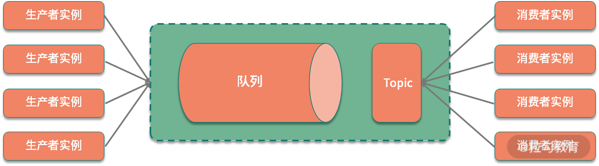
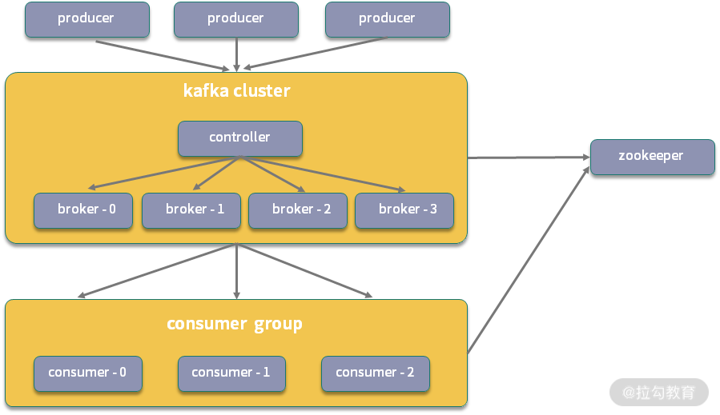

<!DOCTYPE html>
<!-- saved from url=(0046)https://kaiiiz.github.io/hexo-theme-book-demo/ -->
<html xmlns="http://www.w3.org/1999/xhtml">
<head>
    <head>
        <meta http-equiv="Content-Type" content="text/html; charset=UTF-8">
        <meta name="viewport" content="width=device-width, initial-scale=1, maximum-scale=1.0, user-scalable=no">
        <link rel="icon" href="../../static/favicon.png">
        <title>31 集群消费和广播消费有什么区别？.md</title>
        <!-- Spectre.css framework -->
        <link rel="stylesheet" href="../../static/index.css">
        <!-- theme css & js -->
        <meta name="generator" content="Hexo 4.2.0">
    </head>

<body>

    

        

            <a href="../../index.html">
                
                技术文章摘抄
            </a>
        

        

            <ul class="uncollapsible">
                <li><a href="../../index.html" class="current-tab">首页</a></li>
            </ul>

            <ul class="uncollapsible">
                <li><a href="../index.html">上一级</a></li>
            </ul>

            <ul class="uncollapsible">
                <li>

                    
                    <a href="00&#32;开篇词：搭建分布式知识体系，挑战高薪&#32;Offer.md">00 开篇词：搭建分布式知识体系，挑战高薪 Offer.md</a>

                </li>
                <li>

                    
                    <a href="01&#32;如何证明分布式系统的&#32;CAP&#32;理论？.md">01 如何证明分布式系统的 CAP 理论？.md</a>

                </li>
                <li>

                    
                    <a href="02&#32;不同数据一致性模型有哪些应用？.md">02 不同数据一致性模型有哪些应用？.md</a>

                </li>
                <li>

                    
                    <a href="03&#32;如何透彻理解&#32;Paxos&#32;算法？.md">03 如何透彻理解 Paxos 算法？.md</a>

                </li>
                <li>

                    
                    <a href="04&#32;ZooKeeper&#32;如何保证数据一致性？.md">04 ZooKeeper 如何保证数据一致性？.md</a>

                </li>
                <li>

                    
                    <a href="05&#32;共识问题：区块链如何确认记账权？.md">05 共识问题：区块链如何确认记账权？.md</a>

                </li>
                <li>

                    
                    <a href="06&#32;如何准备一线互联网公司面试？.md">06 如何准备一线互联网公司面试？.md</a>

                </li>
                <li>

                    
                    <a href="07&#32;分布式事务有哪些解决方案？.md">07 分布式事务有哪些解决方案？.md</a>

                </li>
                <li>

                    
                    <a href="08&#32;对比两阶段提交，三阶段协议有哪些改进？.md">08 对比两阶段提交，三阶段协议有哪些改进？.md</a>

                </li>
                <li>

                    
                    <a href="09&#32;MySQL&#32;数据库如何实现&#32;XA&#32;规范？.md">09 MySQL 数据库如何实现 XA 规范？.md</a>

                </li>
                <li>

                    
                    <a href="10&#32;如何在业务中体现&#32;TCC&#32;事务模型？.md">10 如何在业务中体现 TCC 事务模型？.md</a>

                </li>
                <li>

                    
                    <a href="11&#32;分布式锁有哪些应用场景和实现？.md">11 分布式锁有哪些应用场景和实现？.md</a>

                </li>
                <li>

                    
                    <a href="12&#32;如何使用&#32;Redis&#32;快速实现分布式锁？.md">12 如何使用 Redis 快速实现分布式锁？.md</a>

                </li>
                <li>

                    
                    <a href="https://learn.lianglianglee.com/%E4%B8%93%E6%A0%8F/%E5%88%86%E5%B8%83%E5%BC%8F%E6%8A%80%E6%9C%AF%E5%8E%9F%E7%90%86%E4%B8%8E%E5%AE%9E%E6%88%9845%E8%AE%B2-%E5%AE%8C/13%20%E5%88%86%E5%B8%83%E5%BC%8F%E4%BA%8B%E5%8A%A1%E8%80%83%E7%82%B9%E6%A2%B3%E7%90%86%20+%20%E9%AB%98%E9%A2%91%E9%9D%A2%E8%AF%95%E9%A2%98.md">13 分布式事务考点梳理 + 高频面试题.md</a>

                </li>
                <li>

                    
                    <a href="14&#32;如何理解&#32;RPC&#32;远程服务调用？.md">14 如何理解 RPC 远程服务调用？.md</a>

                </li>
                <li>

                    
                    <a href="15&#32;为什么微服务需要&#32;API&#32;网关？.md">15 为什么微服务需要 API 网关？.md</a>

                </li>
                <li>

                    
                    <a href="16&#32;如何实现服务注册与发现？.md">16 如何实现服务注册与发现？.md</a>

                </li>
                <li>

                    
                    <a href="17&#32;如何实现分布式调用跟踪？.md">17 如何实现分布式调用跟踪？.md</a>

                </li>
                <li>

                    
                    <a href="18&#32;分布式下如何实现配置管理？.md">18 分布式下如何实现配置管理？.md</a>

                </li>
                <li>

                    
                    <a href="19&#32;容器化升级对服务有哪些影响？.md">19 容器化升级对服务有哪些影响？.md</a>

                </li>
                <li>

                    
                    <a href="20&#32;ServiceMesh：服务网格有哪些应用？.md">20 ServiceMesh：服务网格有哪些应用？.md</a>

                </li>
                <li>

                    
                    <a href="21&#32;Dubbo&#32;vs&#32;Spring&#32;Cloud：两大技术栈如何选型？.md">21 Dubbo vs Spring Cloud：两大技术栈如何选型？.md</a>

                </li>
                <li>

                    
                    <a href="https://learn.lianglianglee.com/%E4%B8%93%E6%A0%8F/%E5%88%86%E5%B8%83%E5%BC%8F%E6%8A%80%E6%9C%AF%E5%8E%9F%E7%90%86%E4%B8%8E%E5%AE%9E%E6%88%9845%E8%AE%B2-%E5%AE%8C/22%20%E5%88%86%E5%B8%83%E5%BC%8F%E6%9C%8D%E5%8A%A1%E8%80%83%E7%82%B9%E6%A2%B3%E7%90%86%20+%20%E9%AB%98%E9%A2%91%E9%9D%A2%E8%AF%95%E9%A2%98.md">22 分布式服务考点梳理 + 高频面试题.md</a>

                </li>
                <li>

                    
                    <a href="23&#32;读写分离如何在业务中落地？.md">23 读写分离如何在业务中落地？.md</a>

                </li>
                <li>

                    
                    <a href="24&#32;为什么需要分库分表，如何实现？.md">24 为什么需要分库分表，如何实现？.md</a>

                </li>
                <li>

                    
                    <a href="25&#32;存储拆分后，如何解决唯一主键问题？.md">25 存储拆分后，如何解决唯一主键问题？.md</a>

                </li>
                <li>

                    
                    <a href="26&#32;分库分表以后，如何实现扩容？.md">26 分库分表以后，如何实现扩容？.md</a>

                </li>
                <li>

                    
                    <a href="27&#32;NoSQL&#32;数据库有哪些典型应用？.md">27 NoSQL 数据库有哪些典型应用？.md</a>

                </li>
                <li>

                    
                    <a href="28&#32;ElasticSearch&#32;是如何建立索引的？.md">28 ElasticSearch 是如何建立索引的？.md</a>

                </li>
                <li>

                    
                    <a href="https://learn.lianglianglee.com/%E4%B8%93%E6%A0%8F/%E5%88%86%E5%B8%83%E5%BC%8F%E6%8A%80%E6%9C%AF%E5%8E%9F%E7%90%86%E4%B8%8E%E5%AE%9E%E6%88%9845%E8%AE%B2-%E5%AE%8C/29%20%E5%88%86%E5%B8%83%E5%BC%8F%E5%AD%98%E5%82%A8%E8%80%83%E7%82%B9%E6%A2%B3%E7%90%86%20+%20%E9%AB%98%E9%A2%91%E9%9D%A2%E8%AF%95%E9%A2%98.md">29 分布式存储考点梳理 + 高频面试题.md</a>

                </li>
                <li>

                    
                    <a href="30&#32;消息队列有哪些应用场景？.md">30 消息队列有哪些应用场景？.md</a>

                </li>
                <li>

                    <a class="current-tab" href="31&#32;集群消费和广播消费有什么区别？.md">31 集群消费和广播消费有什么区别？.md</a>
                    

                </li>
                <li>

                    
                    <a href="32&#32;业务上需要顺序消费，怎么保证时序性？.md">32 业务上需要顺序消费，怎么保证时序性？.md</a>

                </li>
                <li>

                    
                    <a href="33&#32;消息幂等：如何保证消息不被重复消费？.md">33 消息幂等：如何保证消息不被重复消费？.md</a>

                </li>
                <li>

                    
                    <a href="34&#32;高可用：如何实现消息队列的&#32;HA？.md">34 高可用：如何实现消息队列的 HA？.md</a>

                </li>
                <li>

                    
                    <a href="35&#32;消息队列选型：Kafka&#32;如何实现高性能？.md">35 消息队列选型：Kafka 如何实现高性能？.md</a>

                </li>
                <li>

                    
                    <a href="36&#32;消息队列选型：RocketMQ&#32;适用哪些场景？.md">36 消息队列选型：RocketMQ 适用哪些场景？.md</a>

                </li>
                <li>

                    
                    <a href="https://learn.lianglianglee.com/%E4%B8%93%E6%A0%8F/%E5%88%86%E5%B8%83%E5%BC%8F%E6%8A%80%E6%9C%AF%E5%8E%9F%E7%90%86%E4%B8%8E%E5%AE%9E%E6%88%9845%E8%AE%B2-%E5%AE%8C/37%20%E6%B6%88%E6%81%AF%E9%98%9F%E5%88%97%E8%80%83%E7%82%B9%E6%A2%B3%E7%90%86%20+%20%E9%AB%98%E9%A2%91%E9%9D%A2%E8%AF%95%E9%A2%98.md">37 消息队列考点梳理 + 高频面试题.md</a>

                </li>
                <li>

                    
                    <a href="38&#32;不止业务缓存，分布式系统中还有哪些缓存？.md">38 不止业务缓存，分布式系统中还有哪些缓存？.md</a>

                </li>
                <li>

                    
                    <a href="39&#32;如何避免缓存穿透、缓存击穿、缓存雪崩？.md">39 如何避免缓存穿透、缓存击穿、缓存雪崩？.md</a>

                </li>
                <li>

                    
                    <a href="40&#32;经典问题：先更新数据库，还是先更新缓存？.md">40 经典问题：先更新数据库，还是先更新缓存？.md</a>

                </li>
                <li>

                    
                    <a href="41&#32;失效策略：缓存过期都有哪些策略？.md">41 失效策略：缓存过期都有哪些策略？.md</a>

                </li>
                <li>

                    
                    <a href="42&#32;负载均衡：一致性哈希解决了哪些问题？.md">42 负载均衡：一致性哈希解决了哪些问题？.md</a>

                </li>
                <li>

                    
                    <a href="43&#32;缓存高可用：缓存如何保证高可用？.md">43 缓存高可用：缓存如何保证高可用？.md</a>

                </li>
                <li>

                    
                    <a href="https://learn.lianglianglee.com/%E4%B8%93%E6%A0%8F/%E5%88%86%E5%B8%83%E5%BC%8F%E6%8A%80%E6%9C%AF%E5%8E%9F%E7%90%86%E4%B8%8E%E5%AE%9E%E6%88%9845%E8%AE%B2-%E5%AE%8C/44%20%E5%88%86%E5%B8%83%E5%BC%8F%E7%BC%93%E5%AD%98%E8%80%83%E7%82%B9%E6%A2%B3%E7%90%86%20+%20%E9%AB%98%E9%A2%91%E9%9D%A2%E8%AF%95%E9%A2%98.md">44 分布式缓存考点梳理 + 高频面试题.md</a>

                </li>
                <li>

                    
                    <a href="45&#32;从双十一看高可用的保障方式.md">45 从双十一看高可用的保障方式.md</a>

                </li>
                <li>

                    
                    <a href="46&#32;高并发场景下如何实现系统限流？.md">46 高并发场景下如何实现系统限流？.md</a>

                </li>
                <li>

                    
                    <a href="47&#32;降级和熔断：如何增强服务稳定性？.md">47 降级和熔断：如何增强服务稳定性？.md</a>

                </li>
                <li>

                    
                    <a href="48&#32;如何选择适合业务的负载均衡策略？.md">48 如何选择适合业务的负载均衡策略？.md</a>

                </li>
                <li>

                    
                    <a href="49&#32;线上服务有哪些稳定性指标？.md">49 线上服务有哪些稳定性指标？.md</a>

                </li>
                <li>

                    
                    <a href="50&#32;分布式下有哪些好用的监控组件？.md">50 分布式下有哪些好用的监控组件？.md</a>

                </li>
                <li>

                    
                    <a href="51&#32;分布式下如何实现统一日志系统？.md">51 分布式下如何实现统一日志系统？.md</a>

                </li>
                <li>

                    
                    <a href="52&#32;分布式路漫漫，厚积薄发才是王道.md">52 分布式路漫漫，厚积薄发才是王道.md</a>

                </li>
            </ul>

        

    

    

        

    

    

    

        

            

                

                    <!-- For Responsive Layout -->
                    <header class="navbar">
                        <section class="navbar-section">
                            <a onclick="open_sidebar()">
                                <i class="icon icon-menu"></i>
                            </a>
                        </section>
                    </header>
                

                

                    

                        

                        
<h1>31 集群消费和广播消费有什么区别？</h1>

为了规范消息队列中生产者和消费者的行为，消息中间件的构建中会实现不同的消费模型。这一课时讨论的话题来自 RocketMQ 中具体的两种消费模式，是消息队列中两种典型消费模型的实现。接下来我们就一起来看一下消息队列都有哪些消费模型，以及对应的具体实现。

<h3>消息队列的消费模型</h3>

先来看一下消息队列的两种基础模型，也就是<strong>点对点</strong>和<strong>发布订阅方式。</strong>

这两种模型来源于消息队列的 JMS 实现标准，消息队列有不同的实现标准，比如 AMQP 和 JMS，其中 JMS（Java Message Service）是 Java 语言平台的一个消息队列规范，上一课时中讲过的 ActiveMQ 就是其典型实现。

AMQP 和 JMS 的区别是，AMQP 额外引入了 Exchange 的 Binding 的角色，生产者首先将消息发送给 Exchange，经过 Binding 分发给不同的队列。

和 JMS 一样，AMQP 也定义了几种不同的消息模型，包括 direct exchange、topic change、headers exchange、system exchange 等。其中 direct exchange 可以类比点对点，其他的模型可以类比发布订阅，这里不做展开介绍了，具体可参考 AMPQ 的其他资料查阅。

<h4>点到点模型</h4>

在点对点模型下，生产者向一个特定的队列发布消息，消费者从该队列中读取消息，每条消息只会被一个消费者处理。

<h4>发布/订阅模型</h4>

大部分人在浏览资讯网站时会订阅喜欢的频道，比如人文社科，或者娱乐新闻，消息队列的发布订阅也是这种机制。在发布订阅模型中，消费者通过一个 Topic 来订阅消息，生产者将消息发布到指定的队列中。如果存在多个消费者，那么一条消息就会被多个消费者都消费一次。

点对点模型和发布订阅模型，主要区别是消息能否被多次消费，发布订阅模型实现的是广播机制。如果只有一个消费者，则可以认为是点对点模型的一个特例。

现代消息队列基本都支持上面的两种消费模型，但由于消息队列自身的一些特性，以及不同的应用场景，具体实现上还有许多的区别。下面看一下几种代表性的消息队列。

<h3>Kafka 的消费模式</h3>

先来看一下 Kafka，在分析 Kafka 消费模式之前，先来了解一下 Kafka 的应用设计。

Kafka 系统中的角色可以分为以下几种：

<ul>
<li>Producer：消息生产者，负责发布消息到 broker。</li>
<li>Consumer：消息消费者，从 broker 中读取消息。</li>
<li>Broker：Broker 在 Kafka 中是消息处理的节点，可以对比服务器，一个节点就是一个 broker，Kafka 集群由一个或多个 broker 组成。</li>
<li>Topic：Topic 的语义和发布订阅模型中的主题是一致的，Kafka 通过 Topic 对消息进行归类，每一条消息都需要指定一个 Topic。</li>
<li>ConsumerGroup：消费组是对消费端的进一步拆分，每个消费者都属于一个特定的消费组，如果没有指定，则属于默认的消费组。</li>
</ul>

上面是一个 Kafka 集群的示意图，图中的 ZooKeeper 在 Kafka 中主要用于维护 Offset 偏移量，以及集群下的 Leader 选举，节点管理等。ZooKeeper 在 Kafka 中的作用，也是消息队列面试中的一个高频问题，感兴趣的同学可以去扩展一下。

从上面的分析中可以看到，Kafka 的消费是基于 Topic 的，属于发布订阅机制，它会持久化消息，消息消费完后不会立即删除，会保留历史消息，可以比较好地支持多消费者订阅。

<h3>RocketMQ 的消费模式</h3>

RocketMQ 实现的也是典型的发布订阅模型，在细节上和 Kafka 又有一些区别。RocketMQ 的系统设计主要由 NameServer、Broker、Producer 及 Consumer 几部分构成。

NameServer 在 RocketMQ 集群中作为节点的路由中心，可以管理 Broker 集群，以及节点间的通信，在后面的消息队列高可用课时，我会进一步分析集群下的高可用实现。

具体的消费模式中，RocketMQ 和 Kafka 类似，除了 Producer 和 Consumer，主要分为 Message、Topic、Queue 及 ConsumerGroup 这几部分，同时，RocketMQ 额外支持 Tag 类型的划分。

<ul>
<li>Topic：在 RocketMQ 中，Topic 表示消息的第一级归属，每条消息都要有一个 Topic，一个 Group 可以订阅多个主题的消息。对于电商业务，根据业务不同，可以分为商品创建消息、订单消息、物流消息等。</li>
<li>Tag：RocetMQ 提供了二级消息分类，也就是 Tag，使用起来更加灵活。比如在电商业务中，一个订单消息可以分为订单完成消息、订单创建消息等，Tag 的添加，使得 RokcetMQ 中对消息的订阅更加方便。</li>
<li>ConsumerGroup：一个消费组可以订阅多个 Topic，这个是对订阅模式的扩展。</li>
</ul>

在 RocketMQ 中，一个 Topic 下可以有多个 Queue，正是因为 Queue 的引入，使得 RocketMQ 的集群具有了水平扩展能力。

在上一课时中提过， Kafka 使用 Scala 实现、RabbitMQ 使用 Erlang 实现，而 RokcetMQ 是使用 Java 语言实现的。从编程语言的角度，RocketMQ 的源码学习起来比较方便，也推荐你看一下 RokcetMQ 的源码，<a href="https://github.com/apache/rocketmq">点击这里查看源码</a>。

RocketMQ 的消费模式分为<strong>集群消费</strong>和<strong>广播消费</strong>两种，默认是集群消费。那么，在 RocketMQ 中这两种模式有什么区别呢?

集群消费实现了对点对点模型的扩展，任意一条消息只需要被集群内的任意一个消费者处理即可，同一个消费组下的各个消费端，会使用负载均衡的方式消费。对应 Topic 下的信息，集群消费模式的示意图如下。

广播消费实现的是发布订阅模式，发送到消费组中的消息，会被多个消费者分别处理一次。在集群消费中，为了将消息分发给消费组中的多个实例，需要实现消息的路由，也就是我们常说的负载均衡，在 RocketMQ 中，支持多种负载均衡的策略，主要包括以下几种：

<ul>
<li>平均分配策略，默认的策略</li>
<li>环形分配策略</li>
<li>手动配置分配策略</li>
<li>机房分配策略</li>
<li>一致性哈希分配策略</li>
</ul>

以上的几种策略，可以在 RocketMQ 的源码中 AllocateMessageQueueStrategy 接口相关的实现中：

<h3>总结</h3>

这一课时分析了消息队列中的两种消息模型，以及不同消息模型在 Kafka 和 RocketMQ 等消息队列中的具体实现。

消息模型的概念是分布式消息的基础知识，不同的消息模型会影响消息队列的设计，进而影响消息队列在消息一致性、时序性，以及传输可靠性上的实现方式。了解了这些，才能更好地展开关于消息队列各种特性的讨论。

在分布式系统中，为了保证高可用，引入了各种集群和副本技术，使得实际消息队列中的实现往往要比模型定义中复杂很多。上面提到的 Kafka 和 RocketMQ 实现的都是以发布订阅模式为主，但是在另外一个消息队列 RabbitMQ 中，实现的就是点对点的消息传输模式。RabbitMQ 是 AMQP 模型的典型实现，那么 RabbitMQ 是如何实现集群扩展的呢，以及集群模式有哪些区别？感兴趣的同学可以找相关的资料来了解一下，欢迎留言分享。

                    

                    

                        

                            <a href="30&#32;消息队列有哪些应用场景？.md">上一页</a>
                        

                        

                            <a href="32&#32;业务上需要顺序消费，怎么保证时序性？.md">下一页</a>
                        

                    

                

            

        

    

    

</body>
<!-- Global site tag (gtag.js) - Google Analytics -->

</html>
