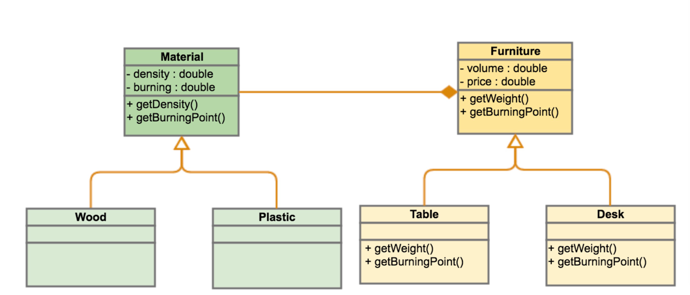
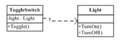
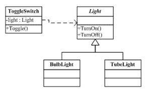
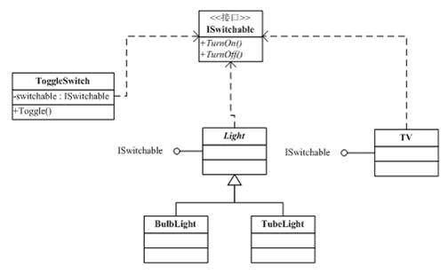

<!DOCTYPE html>
<!-- saved from url=(0046)https://kaiiiz.github.io/hexo-theme-book-demo/ -->
<html xmlns="http://www.w3.org/1999/xhtml">
<head>
    <head>
        <meta http-equiv="Content-Type" content="text/html; charset=UTF-8">
        <meta name="viewport" content="width=device-width, initial-scale=1, maximum-scale=1.0, user-scalable=no">
        <link rel="icon" href="../../static/favicon.png">
        <title>035  编程范式游记（6）- 面向对象编程.md</title>
        <!-- Spectre.css framework -->
        <link rel="stylesheet" href="../../static/index.css">
        <!-- theme css & js -->
        <meta name="generator" content="Hexo 4.2.0">
    </head>

<body>

    

        

            <a href="../../index.html">
                
                技术文章摘抄
            </a>
        

        

            <ul class="uncollapsible">
                <li><a href="../../index.html" class="current-tab">首页</a></li>
            </ul>

            <ul class="uncollapsible">
                <li><a href="../index.html">上一级</a></li>
            </ul>

            <ul class="uncollapsible">
                <li>

                    
                    <a href="000&#32;开篇词&#32;&#32;洞悉技术的本质，享受科技的乐趣.md">000 开篇词  洞悉技术的本质，享受科技的乐趣.md</a>

                </li>
                <li>

                    
                    <a href="001&#32;&#32;程序员如何用技术变现（上）.md">001  程序员如何用技术变现（上）.md</a>

                </li>
                <li>

                    
                    <a href="002&#32;&#32;程序员如何用技术变现（下）.md">002  程序员如何用技术变现（下）.md</a>

                </li>
                <li>

                    
                    <a href="003&#32;&#32;Equifax信息泄露始末.md">003  Equifax信息泄露始末.md</a>

                </li>
                <li>

                    
                    <a href="004&#32;&#32;从Equifax信息泄露看数据安全.md">004  从Equifax信息泄露看数据安全.md</a>

                </li>
                <li>

                    
                    <a href="005&#32;&#32;何为技术领导力.md">005  何为技术领导力.md</a>

                </li>
                <li>

                    
                    <a href="006&#32;&#32;如何拥有技术领导力.md">006  如何拥有技术领导力.md</a>

                </li>
                <li>

                    
                    <a href="007&#32;&#32;推荐阅读：每个程序员都该知道的事.md">007  推荐阅读：每个程序员都该知道的事.md</a>

                </li>
                <li>

                    
                    <a href="008&#32;&#32;Go语言，Docker和新技术.md">008  Go语言，Docker和新技术.md</a>

                </li>
                <li>

                    
                    <a href="009&#32;&#32;答疑解惑：渴望、热情和选择.md">009  答疑解惑：渴望、热情和选择.md</a>

                </li>
                <li>

                    
                    <a href="010&#32;&#32;如何成为一个大家愿意追随的Leader？.md">010  如何成为一个大家愿意追随的Leader？.md</a>

                </li>
                <li>

                    
                    <a href="011&#32;&#32;程序中的错误处理：错误返回码和异常捕捉.md">011  程序中的错误处理：错误返回码和异常捕捉.md</a>

                </li>
                <li>

                    
                    <a href="012&#32;&#32;程序中的错误处理：异步编程和最佳实践.md">012  程序中的错误处理：异步编程和最佳实践.md</a>

                </li>
                <li>

                    
                    <a href="013&#32;&#32;魔数&#32;0x5f3759df.md">013  魔数 0x5f3759df.md</a>

                </li>
                <li>

                    
                    <a href="014&#32;&#32;推荐阅读：机器学习101.md">014  推荐阅读：机器学习101.md</a>

                </li>
                <li>

                    
                    <a href="015&#32;&#32;时间管理：同扭曲时间的事儿抗争.md">015  时间管理：同扭曲时间的事儿抗争.md</a>

                </li>
                <li>

                    
                    <a href="016&#32;&#32;时间管理：投资赚取时间.md">016  时间管理：投资赚取时间.md</a>

                </li>
                <li>

                    
                    <a href="017&#32;&#32;故障处理最佳实践：应对故障.md">017  故障处理最佳实践：应对故障.md</a>

                </li>
                <li>

                    
                    <a href="018&#32;&#32;故障处理最佳实践：故障改进.md">018  故障处理最佳实践：故障改进.md</a>

                </li>
                <li>

                    
                    <a href="019&#32;&#32;答疑解惑：我们应该能够识别的表象和本质.md">019  答疑解惑：我们应该能够识别的表象和本质.md</a>

                </li>
                <li>

                    
                    <a href="020&#32;&#32;分布式系统架构的冰与火.md">020  分布式系统架构的冰与火.md</a>

                </li>
                <li>

                    
                    <a href="021&#32;&#32;从亚马逊的实践，谈分布式系统的难点.md">021  从亚马逊的实践，谈分布式系统的难点.md</a>

                </li>
                <li>

                    
                    <a href="022&#32;&#32;分布式系统的技术栈.md">022  分布式系统的技术栈.md</a>

                </li>
                <li>

                    
                    <a href="023&#32;&#32;分布式系统关键技术：全栈监控.md">023  分布式系统关键技术：全栈监控.md</a>

                </li>
                <li>

                    
                    <a href="024&#32;&#32;分布式系统关键技术：服务调度.md">024  分布式系统关键技术：服务调度.md</a>

                </li>
                <li>

                    
                    <a href="025&#32;&#32;分布式系统关键技术：流量与数据调度.md">025  分布式系统关键技术：流量与数据调度.md</a>

                </li>
                <li>

                    
                    <a href="026&#32;&#32;洞悉PaaS平台的本质.md">026  洞悉PaaS平台的本质.md</a>

                </li>
                <li>

                    
                    <a href="027&#32;&#32;推荐阅读：分布式系统架构经典资料.md">027  推荐阅读：分布式系统架构经典资料.md</a>

                </li>
                <li>

                    
                    <a href="028&#32;&#32;编程范式游记（1）-&#32;起源.md">028  编程范式游记（1）- 起源.md</a>

                </li>
                <li>

                    
                    <a href="029&#32;&#32;编程范式游记（2）-&#32;泛型编程.md">029  编程范式游记（2）- 泛型编程.md</a>

                </li>
                <li>

                    
                    <a href="030&#32;&#32;编程范式游记（3）&#32;-&#32;类型系统和泛型的本质.md">030  编程范式游记（3） - 类型系统和泛型的本质.md</a>

                </li>
                <li>

                    
                    <a href="031&#32;&#32;Git协同工作流，你该怎样选.md">031  Git协同工作流，你该怎样选.md</a>

                </li>
                <li>

                    
                    <a href="032&#32;&#32;推荐阅读：分布式数据调度相关论文.md">032  推荐阅读：分布式数据调度相关论文.md</a>

                </li>
                <li>

                    
                    <a href="033&#32;&#32;编程范式游记（4）-&#32;函数式编程.md">033  编程范式游记（4）- 函数式编程.md</a>

                </li>
                <li>

                    
                    <a href="034&#32;&#32;编程范式游记（5）-&#32;修饰器模式.md">034  编程范式游记（5）- 修饰器模式.md</a>

                </li>
                <li>

                    <a class="current-tab" href="035&#32;&#32;编程范式游记（6）-&#32;面向对象编程.md">035  编程范式游记（6）- 面向对象编程.md</a>
                    

                </li>
                <li>

                    
                    <a href="036&#32;&#32;编程范式游记（7）-&#32;基于原型的编程范式.md">036  编程范式游记（7）- 基于原型的编程范式.md</a>

                </li>
                <li>

                    
                    <a href="037&#32;&#32;编程范式游记（8）-&#32;Go&#32;语言的委托模式.md">037  编程范式游记（8）- Go 语言的委托模式.md</a>

                </li>
                <li>

                    
                    <a href="038&#32;&#32;编程范式游记（9）-&#32;编程的本质.md">038  编程范式游记（9）- 编程的本质.md</a>

                </li>
                <li>

                    
                    <a href="039&#32;&#32;编程范式游记（10）-&#32;逻辑编程范式.md">039  编程范式游记（10）- 逻辑编程范式.md</a>

                </li>
                <li>

                    
                    <a href="040&#32;&#32;编程范式游记（11）-&#32;程序世界里的编程范式.md">040  编程范式游记（11）- 程序世界里的编程范式.md</a>

                </li>
                <li>

                    
                    <a href="041&#32;&#32;弹力设计篇之“认识故障和弹力设计”.md">041  弹力设计篇之“认识故障和弹力设计”.md</a>

                </li>
                <li>

                    
                    <a href="042&#32;&#32;弹力设计篇之“隔离设计”.md">042  弹力设计篇之“隔离设计”.md</a>

                </li>
                <li>

                    
                    <a href="043&#32;&#32;弹力设计篇之“异步通讯设计”.md">043  弹力设计篇之“异步通讯设计”.md</a>

                </li>
                <li>

                    
                    <a href="044&#32;&#32;弹力设计篇之“幂等性设计”.md">044  弹力设计篇之“幂等性设计”.md</a>

                </li>
                <li>

                    
                    <a href="045&#32;&#32;弹力设计篇之“服务的状态”.md">045  弹力设计篇之“服务的状态”.md</a>

                </li>
                <li>

                    
                    <a href="046&#32;&#32;弹力设计篇之“补偿事务”.md">046  弹力设计篇之“补偿事务”.md</a>

                </li>
                <li>

                    
                    <a href="047&#32;&#32;弹力设计篇之“重试设计”.md">047  弹力设计篇之“重试设计”.md</a>

                </li>
                <li>

                    
                    <a href="048&#32;&#32;弹力设计篇之“熔断设计”.md">048  弹力设计篇之“熔断设计”.md</a>

                </li>
                <li>

                    
                    <a href="049&#32;&#32;弹力设计篇之“限流设计”.md">049  弹力设计篇之“限流设计”.md</a>

                </li>
                <li>

                    
                    <a href="050&#32;&#32;弹力设计篇之“降级设计”.md">050  弹力设计篇之“降级设计”.md</a>

                </li>
                <li>

                    
                    <a href="051&#32;&#32;弹力设计篇之“弹力设计总结”.md">051  弹力设计篇之“弹力设计总结”.md</a>

                </li>
                <li>

                    
                    <a href="052&#32;&#32;区块链技术&#32;-&#32;区块链的革命性及技术概要.md">052  区块链技术 - 区块链的革命性及技术概要.md</a>

                </li>
                <li>

                    
                    <a href="053&#32;&#32;区块链技术&#32;-&#32;区块链技术细节&#32;-&#32;哈希算法.md">053  区块链技术 - 区块链技术细节 - 哈希算法.md</a>

                </li>
                <li>

                    
                    <a href="054&#32;&#32;区块链技术&#32;-&#32;区块链技术细节&#32;-&#32;加密和挖矿.md">054  区块链技术 - 区块链技术细节 - 加密和挖矿.md</a>

                </li>
                <li>

                    
                    <a href="055&#32;&#32;区块链技术&#32;-&#32;去中心化的共识机制.md">055  区块链技术 - 去中心化的共识机制.md</a>

                </li>
                <li>

                    
                    <a href="056&#32;&#32;区块链技术&#32;-&#32;智能合约.md">056  区块链技术 - 智能合约.md</a>

                </li>
                <li>

                    
                    <a href="057&#32;&#32;区块链技术&#32;-&#32;传统金融和虚拟货币.md">057  区块链技术 - 传统金融和虚拟货币.md</a>

                </li>
                <li>

                    
                    <a href="058&#32;&#32;管理设计篇之分布式锁.md">058  管理设计篇之分布式锁.md</a>

                </li>
                <li>

                    
                    <a href="059&#32;&#32;管理设计篇之配置中心.md">059  管理设计篇之配置中心.md</a>

                </li>
                <li>

                    
                    <a href="060&#32;&#32;管理设计篇之边车模式.md">060  管理设计篇之边车模式.md</a>

                </li>
                <li>

                    
                    <a href="061&#32;&#32;管理设计篇之服务网格.md">061  管理设计篇之服务网格.md</a>

                </li>
                <li>

                    
                    <a href="062&#32;&#32;管理设计篇之网关模式.md">062  管理设计篇之网关模式.md</a>

                </li>
                <li>

                    
                    <a href="063&#32;&#32;管理设计篇之部署升级策略.md">063  管理设计篇之部署升级策略.md</a>

                </li>
                <li>

                    
                    <a href="064&#32;&#32;性能设计篇之缓存.md">064  性能设计篇之缓存.md</a>

                </li>
                <li>

                    
                    <a href="065&#32;&#32;性能设计篇之异步处理.md">065  性能设计篇之异步处理.md</a>

                </li>
                <li>

                    
                    <a href="066&#32;&#32;性能设计篇之数据库扩展.md">066  性能设计篇之数据库扩展.md</a>

                </li>
                <li>

                    
                    <a href="067&#32;&#32;性能设计篇之秒杀.md">067  性能设计篇之秒杀.md</a>

                </li>
                <li>

                    
                    <a href="068&#32;&#32;性能设计篇之边缘计算.md">068  性能设计篇之边缘计算.md</a>

                </li>
                <li>

                    
                    <a href="069&#32;&#32;程序员练级攻略（2018）：开篇词.md">069  程序员练级攻略（2018）：开篇词.md</a>

                </li>
                <li>

                    
                    <a href="070&#32;&#32;程序员练级攻略（2018）：零基础启蒙.md">070  程序员练级攻略（2018）：零基础启蒙.md</a>

                </li>
                <li>

                    
                    <a href="071&#32;&#32;程序员练级攻略（2018）：正式入门.md">071  程序员练级攻略（2018）：正式入门.md</a>

                </li>
                <li>

                    
                    <a href="072&#32;&#32;程序员练级攻略（2018）：程序员修养.md">072  程序员练级攻略（2018）：程序员修养.md</a>

                </li>
                <li>

                    
                    <a href="073&#32;&#32;程序员练级攻略（2018）：编程语言.md">073  程序员练级攻略（2018）：编程语言.md</a>

                </li>
                <li>

                    
                    <a href="074&#32;&#32;程序员练级攻略：理论学科.md">074  程序员练级攻略：理论学科.md</a>

                </li>
                <li>

                    
                    <a href="075&#32;&#32;程序员练级攻略（2018）：系统知识.md">075  程序员练级攻略（2018）：系统知识.md</a>

                </li>
                <li>

                    
                    <a href="076&#32;&#32;程序员练级攻略（2018）：软件设计.md">076  程序员练级攻略（2018）：软件设计.md</a>

                </li>
                <li>

                    
                    <a href="077&#32;&#32;程序员练级攻略（2018）：Linux系统、内存和网络.md">077  程序员练级攻略（2018）：Linux系统、内存和网络.md</a>

                </li>
                <li>

                    
                    <a href="078&#32;&#32;程序员练级攻略（2018）：异步IO模型和Lock-Free编程.md">078  程序员练级攻略（2018）：异步IO模型和Lock-Free编程.md</a>

                </li>
                <li>

                    
                    <a href="079&#32;&#32;程序员练级攻略（2018）：Java底层知识.md">079  程序员练级攻略（2018）：Java底层知识.md</a>

                </li>
                <li>

                    
                    <a href="080&#32;&#32;程序员练级攻略（2018）：数据库.md">080  程序员练级攻略（2018）：数据库.md</a>

                </li>
                <li>

                    
                    <a href="081&#32;&#32;程序员练级攻略（2018）：分布式架构入门.md">081  程序员练级攻略（2018）：分布式架构入门.md</a>

                </li>
                <li>

                    
                    <a href="082&#32;&#32;程序员练级攻略（2018）：分布式架构经典图书和论文.md">082  程序员练级攻略（2018）：分布式架构经典图书和论文.md</a>

                </li>
                <li>

                    
                    <a href="083&#32;&#32;程序员练级攻略（2018）：分布式架构工程设计.md">083  程序员练级攻略（2018）：分布式架构工程设计.md</a>

                </li>
                <li>

                    
                    <a href="084&#32;&#32;程序员练级攻略（2018）：微服务.md">084  程序员练级攻略（2018）：微服务.md</a>

                </li>
                <li>

                    
                    <a href="085&#32;&#32;程序员练级攻略（2018）：容器化和自动化运维.md">085  程序员练级攻略（2018）：容器化和自动化运维.md</a>

                </li>
                <li>

                    
                    <a href="086&#32;&#32;程序员练级攻略（2018）：机器学习和人工智能.md">086  程序员练级攻略（2018）：机器学习和人工智能.md</a>

                </li>
                <li>

                    
                    <a href="087&#32;&#32;程序员练级攻略（2018）：前端基础和底层原理.md">087  程序员练级攻略（2018）：前端基础和底层原理.md</a>

                </li>
                <li>

                    
                    <a href="088&#32;&#32;程序员练级攻略（2018）：前端性能优化和框架.md">088  程序员练级攻略（2018）：前端性能优化和框架.md</a>

                </li>
                <li>

                    
                    <a href="089&#32;&#32;程序员练级攻略（2018）：UIUX设计.md">089  程序员练级攻略（2018）：UIUX设计.md</a>

                </li>
                <li>

                    
                    <a href="090&#32;&#32;程序员练级攻略（2018）：技术资源集散地.md">090  程序员练级攻略（2018）：技术资源集散地.md</a>

                </li>
                <li>

                    
                    <a href="091&#32;&#32;程序员面试攻略：面试前的准备.md">091  程序员面试攻略：面试前的准备.md</a>

                </li>
                <li>

                    
                    <a href="092&#32;&#32;程序员面试攻略：面试中的技巧.md">092  程序员面试攻略：面试中的技巧.md</a>

                </li>
                <li>

                    
                    <a href="093&#32;&#32;程序员面试攻略：面试风格.md">093  程序员面试攻略：面试风格.md</a>

                </li>
                <li>

                    
                    <a href="094&#32;&#32;程序员面试攻略：实力才是王中王.md">094  程序员面试攻略：实力才是王中王.md</a>

                </li>
                <li>

                    
                    <a href="095&#32;&#32;高效学习：端正学习态度.md">095  高效学习：端正学习态度.md</a>

                </li>
                <li>

                    
                    <a href="096&#32;&#32;高效学习：源头、原理和知识地图.md">096  高效学习：源头、原理和知识地图.md</a>

                </li>
                <li>

                    
                    <a href="097&#32;&#32;高效学习：深度，归纳和坚持实践.md">097  高效学习：深度，归纳和坚持实践.md</a>

                </li>
                <li>

                    
                    <a href="098&#32;&#32;高效学习：如何学习和阅读代码.md">098  高效学习：如何学习和阅读代码.md</a>

                </li>
                <li>

                    
                    <a href="099&#32;&#32;高效学习：面对枯燥和量大的知识.md">099  高效学习：面对枯燥和量大的知识.md</a>

                </li>
                <li>

                    
                    <a href="100&#32;&#32;高效沟通：Talk和Code同等重要.md">100  高效沟通：Talk和Code同等重要.md</a>

                </li>
                <li>

                    
                    <a href="101&#32;&#32;高效沟通：沟通阻碍和应对方法.md">101  高效沟通：沟通阻碍和应对方法.md</a>

                </li>
                <li>

                    
                    <a href="102&#32;&#32;高效沟通：沟通方式及技巧.md">102  高效沟通：沟通方式及技巧.md</a>

                </li>
                <li>

                    
                    <a href="103&#32;&#32;高效沟通：沟通技术.md">103  高效沟通：沟通技术.md</a>

                </li>
                <li>

                    
                    <a href="104&#32;&#32;高效沟通：好老板要善于提问.md">104  高效沟通：好老板要善于提问.md</a>

                </li>
                <li>

                    
                    <a href="105&#32;&#32;高效沟通：好好说话的艺术.md">105  高效沟通：好好说话的艺术.md</a>

                </li>
                <li>

                    
                    <a href="106&#32;加餐&#32;&#32;谈谈我的“三观”.md">106 加餐  谈谈我的“三观”.md</a>

                </li>
                <li>

                    
                    <a href="107&#32;结束语&#32;&#32;业精于勤，行成于思.md">107 结束语  业精于勤，行成于思.md</a>

                </li>
            </ul>

        

    

    

        

    

    

    

        

            

                

                    <!-- For Responsive Layout -->
                    <header class="navbar">
                        <section class="navbar-section">
                            <a onclick="open_sidebar()">
                                <i class="icon icon-menu"></i>
                            </a>
                        </section>
                    </header>
                

                

                    

                        

                        
<h1>035  编程范式游记（6）- 面向对象编程</h1>

前面讲完了函数式编程，主要讲的是把一些功能或逻辑代码通过函数的拼装方式来组织的玩法。其中涉及最多的是函数，也就是编程中的代码逻辑。但我们知道，代码中还是需要处理数据的，这些就是所谓的“状态”，函数式编程需要我们写出无状态的代码。

而这天下并不存在没有状态没有数据的代码，如果函数式编程不处理状态这些东西，那么，状态会放在什么地方呢？总是需要一个地方放这些数据的。

对于状态和数据的处理，我们有必要提一下“面向对象编程”（Object-oriented programming，缩写为 OOP）这个编程范式了。我们知道，<strong>面向对象的编程有三大特性：封装、继承和多态</strong>。

面向对象编程是种具有对象概念的程序编程范型，同时也是一种程序开发的抽象方针。它可能包含数据、属性、代码与方法。对象则指的是类的实例。它将对象作为程序的基本单元，将程序和数据封装其中，以提高软件的可重用性、灵活性和可扩展性，对象里的程序可以访问及修改对象相关联的数据。在面向对象编程里，计算机程序会被设计成彼此相关的对象。

面向对象程序设计可以看作一种在程序中包含各种独立而又互相调用的对象的思想，这与传统的思想刚好相反：传统的程序设计主张将程序看作一系列函数的集合，或者直接就是一系列对计算机下达的指令。面向对象程序设计中的每一个对象都应该能够接受数据、处理数据并将数据传达给其它对象，因此它们都可以被看作一个小型的“机器”，即对象。

目前已经被证实的是，面向对象程序设计推广了程序的灵活性和可维护性，并且在大型项目设计中广为应用。此外，支持者声称面向对象程序设计要比以往的做法更加便于学习，因为它能够让人们更简单地设计并维护程序，使得程序更加便于分析、设计、理解。

现在，几乎所有的主流语言都支持面向对象，比如：Common Lisp、Python、C++、Objective-C、Smalltalk、Delphi、Java、Swift、C#、Perl、Ruby 与 PHP 等。

说起面向对象，就不得不提由 Erich Gamma、Richard Helm、Ralph Johnson 和 John Vlissides 合作出版的《<a href="https://book.douban.com/subject/1052241/">设计模式：可复用面向对象软件的基础</a>》（Design Patterns - Elements of Reusable Object-Oriented Software）一书，在此书中共收录了 23 种设计模式。

这本书的 23 个经典的设计模式，基本上就是说了两个面向对象的核心理念。

<ul>
<li>&quot;Program to an ‘interface’, not an ‘implementation’.&quot;
<ul>
<li>使用者不需要知道数据类型、结构、算法的细节。</li>
<li>使用者不需要知道实现细节，只需要知道提供的接口。</li>
<li>利于抽象、封装、动态绑定、多态。</li>
<li>符合面向对象的特质和理念。</li>
</ul>
</li>
<li>&quot;Favor ‘object composition’ over ‘class inheritance’.&quot;
<ul>
<li>继承需要给子类暴露一些父类的设计和实现细节。</li>
<li>父类实现的改变会造成子类也需要改变。</li>
<li>我们以为继承主要是为了代码重用，但实际上在子类中需要重新实现很多父类的方法。</li>
<li>继承更多的应该是为了多态。</li>
</ul>
</li>
</ul>
<h1>示例一：拼装对象</h1>

好，我们先来看一个示例，假设我们有如下的描述：

<ul>
<li><strong>四个物体</strong>：木头桌子、木头椅子、塑料桌子、塑料椅子</li>
<li><strong>四个属性</strong>：燃点、密度、价格、重量</li>
</ul>

那么，我们怎么用面向对象的方式来设计我们的类呢？

参看下图：

<ul>
<li>图的左边是“材质类” Material。其属性有燃点和密度。</li>
<li>图的右边是“家具类” Furniture。其属性有价格和体积。</li>
<li>在 Furniture 中耦合了 Material。而具体的 Material 是 Wood 还是 Plastic，这是在构造对象的时候注入到 Furniture 里就好了。</li>
<li>这样，在家具类中，通过材料的密度属性和家具的体积属性就可以计算出重量属性。</li>
</ul>

这样设计的优点显而易见，它能和现实世界相对应起来。而且，材料类是可以重用的。这个模式也表现了面向对象的拼装数据的另一个精髓——喜欢组合，而不是继承。这个模式在设计模式里叫“桥接模式”。

和函数式编程来比较，函数式强调于动词，而面向对象强调于名词，面向对象更多的关注于接口间的关系，而通过多态来适配不同的具体实现。

<h1>示例二：拼装功能</h1>

再来看一个示例。我们的需求是这样的——处理订单，处理订单有一个关键的动作就是计算订单的价格。有的订单需要打折，有的则不打折。

在进行面向对象编程时，假设我们用 Java 语言，我们需要先写一个接口—— <code>BillingStrategy</code>，其中就是一个方法：<code>GetActPrice(double rawPrice)</code>，输入一个原始的价格，输出一个根据相应的策略计算出来的价格。

<pre><code>interface BillingStrategy {
    public double GetActPrice(double rawPrice);
}
</code></pre>

这个接口很简单，只是对接口的抽象，而与实现无关。现在我们需要对这个接口进行实现。

<pre><code>// Normal billing strategy (unchanged price)
class NormalStrategy implements BillingStrategy {
    @Override
    public double GetActPrice(double rawPrice) {
        return rawPrice;
    }
}
 
// Strategy for Happy hour (50% discount)
class HappyHourStrategy implements BillingStrategy {
    @Override
    public double GetActPrice(double rawPrice) {
        return rawPrice * 0.5;
    }
}
</code></pre>

上面的代码实现了两个策略，一个是不打折的：<code>NormalStrategy</code>，一个是打了 5 折的：<code>HappyHourStrategy</code>。

于是，我们先封装订单项 <code>OrderItem</code>，其包含了每个商品的原始价格和数量，以及计算价格的策略。

<pre><code>class OrderItem {
    public String Name;
    public double Price;
    public int Quantity;
    public BillingStrategy Strategy;
    public OrderItem(String name, double price, int quantity, BillingStrategy strategy) {
        this.Name = name;
        this.Price = price;
        this.Quantity = quantity;
        this.Strategy = strategy;
    }
}
</code></pre>

然后，在我们的订单类—— <code>Order</code> 中封装了 <code>OrderItem</code> 的列表，即商品列表。并在操作订单添加购买商品时，加入一个计算价格的 <code>BillingStrategy</code>。

<pre><code>class Order {
    private List&lt;OrderItem&gt; orderItems = new ArrayList&lt;OrderItem&gt;();
    private BillingStrategy strategy = new NormalStrategy();
 
    public void Add(String name, double price, int quantity, BillingStrategy strategy) {
        orderItems.add(new OrderItem(name, price, quantity, strategy));
    }
    
    // Payment of bill
    public void PayBill() {
        double sum = 0;
        for (OrderItem item : orderItems) {
            
            actPrice = item.Strategy.GetActPrice(item.price * item.quantity);
            sum += actPrice;
            
            System.out.println(&quot;%s -- %f(%d) - %f&quot;, 
            		item.name, item.price, item.quantity, actPrice);
        }
        System.out.println(&quot;Total due: &quot; + sum);
    }
}
 
</code></pre>

最终，我们在 <code>PayBill()</code> 函数中，把整个订单的价格明细和总价打印出来。

在上面这个示例中，可以看到，我把订价策略和订单处理的流程分开了。这么做的好处是，我们可以随时给不同的商品注入不同的价格计算策略，这样一来就有很高的灵活度了。剩下的事就交给我们的运营人员来配置不同的商品使用什么样的价格计算的策略了。

注意，现实社会中，订单价格计算会比这个事复杂得多，比如：有会员价，有打折卡，还有商品的打包价等，而且还可以叠加不同的策略（叠加策略用前面说的函数式的 pipeline 或 decorator 就可以实现）。我们这里只是为了说明面向对象编程范式，所以故意简单化了。

其实，这个设计模式叫——策略模式。我认为，这是设计模式中最为经典的模式了，其充分体现了面向对象编程的方式。

<h1>示例三：资源管理</h1>

先看一段代码：

<pre><code>mutex m;
 
void foo() {
    m.lock();
    Func();
    if ( ! everythingOk() ) return; 
    ...
    ...
    m.unlock();
}
</code></pre>

可以看到，上面这段代码是有问题的，原因是，那个 <code>if</code> 语句返回时没有把锁给 unlock 掉，这会导致锁没有被释放。如果我们要把代码写对，需要在 return 前 unlock 一下。

<pre><code>mutex m;
 
void foo() {
    m.lock();
    Func();
    if ( ! everythingOk() ) {
        m.unlock();
        return;
    } 
    ...
    ...
    m.unlock();
}
</code></pre>

但是，在所有的函数退出的地方都要加上 <code>m.unlock();</code> 语句，这会让我们很难维护代码。于是可以使用面向对象的编程模式，我们先设计一个代理类。

<pre><code>class lock_guard {
	private: 
		mutex &amp;_m;
	public:
		lock_guard(mutex &amp;m):_m(m) { _m.lock(); }
		~lock_guard() { _m.unlock(); }
};
</code></pre>

然后，我们的代码就可以这样写了：

<pre><code>mutex m;
 
void foo() {
	lock_guard guard(m);
	Func();
	if ( ! everythingOk() ) {
		return;
	} 
	...
	...
}
</code></pre>

这个技术叫 RAII（Resource Acquisition Is Initialization）， 是 C++ 中的一个利用了面向对象的技术。这个设计模式叫“代理模式”。我们可以把一些控制资源分配和释放的逻辑交给这些代理类，然后，就只需要关注业务逻辑代码了。而且，在我们的业务逻辑代码中，减少了这些和业务逻辑不相关的程序控制的代码。

从上面的代码中，我们可以看到下面几个面向对象的事情。

<ul>
<li>我们使用接口抽象了具体的实现类。</li>
<li>然后其它类耦合的是接口而不是实现类。这就是多态，其增加了程序的可扩展性。</li>
<li>因为这就是接口编程，所谓接口也就是一种“协议”，就像 HTTP 协议一样。浏览器和后端的程序都依赖于这一种协议，而不是具体实现（如果是依赖具体实现，那么浏览器就要依赖后端的编程语言或中间件了，这就太恶心了）。于是，浏览器和后端的程序就完全解开依赖关系，而去依赖于一个标准的协议。</li>
<li>这就是面向对象的编程范式的精髓！同样也是 IoC/DIP（控制反转 / 依赖倒置）的本质。</li>
</ul>
<h1>IoC 控制反转</h1>

关于 IoC 的的概念提出来已经很多年了，其被用于一种面向对象的设计。我在这里再简单地回顾一下这个概念。我先谈技术，再说管理。

话说，我们有一个开关要控制一个灯的开和关这两个动作，最常见也是最没有技术含量的实现会是这个样子：

然后，有一天，我们发现需要对灯泡扩展一下，于是做了个抽象类：

但是，如果有一天，我们发现这个开关可能还要控制别的不单单是灯泡的东西，就会发现这个开关耦合了灯泡这种类别，非常不利于扩展，于是反转控制出现了。

就像现实世界一样，造开关的工厂根本不关心要控制的东西是什么，它只做一个开关应该做好的事，就是把电接通，把电断开（不管是手动的，还是声控的，还是光控，还是遥控的）。而我们造的各种各样的灯泡（不管是日光灯，白炽灯）的工厂也不关心你用什么样的开关，反正我只管把灯的电源接口给做出来。然后，开关厂和电灯厂依赖于一个标准的通电和断电的接口。于是产生了 IoC 控制反转，如下图。

所谓控制反转的意思是，开关从以前设备的专用开关，转变到了控制电源的开关，而以前的设备要反过来依赖于开关厂声明的电源连接接口。只要符合开关厂定义的电源连接的接口，这个开关可以控制所有符合这个电源连接接口的设备。也就是说，开关从依赖设备这种情况，变成了，设备反过来依赖于开关所定义的接口。

这样的例子在生活中太多见了。比如说：

<ul>
<li>钱就是一个很好的例子。以前大家都是“以物易物”，所以，在各种物品之前都需要相应的“交易策略”，比如：一头羊换 2 袋米，一袋米换一斤猪后腿肉……这种换算太复杂了。于是，“钱”就出来了，所谓“钱”，其实就是一种交易协议，所有的商品都依赖这个协议，而不用再互相依赖了。于是整个世界的运作就简单了很多。</li>
<li>在交易的过程中，卖家向买家卖东西，一手交钱一手交货，所以，基本上来说卖家和买家必需强耦合（必需见面）。这个时候，银行出来做担保，买家把钱先垫到银行，银行让卖家发货，买家验货后，银行再把钱打给卖家。这就是反转控制。买卖双方把对对方的直接依赖和控制，反转到了让对方来依赖一个标准的交易模型的接口。股票交易也是一样的，证交所就是买卖双方的标准交易模型接口。</li>
<li>上面这个例子，可能还不明显，再举一个例子。海尔公司作为一个电器制商需要把自己的商品分销到全国各地，但是发现，不同的分销渠道有不同的玩法，于是派出了各种销售代表玩不同的玩法。随着渠道越来越多，发现，每增加一个渠道就要新增一批人和一个新的流程，严重耦合并依赖各渠道商的玩法。</li>
</ul>

实在受不了了，于是制定业务标准，开发分销信息化系统，只有符合这个标准的渠道商才能成为海尔的分销商。让各个渠道商反过来依赖自己标准。反转了控制，倒置了依赖。

这个思维方式其实还深远地影响了很多东西，比如我们的系统架构。

<ul>
<li>云计算平台中有很多的云产品线。一些底层服务的开发团队只管开发底层的技术，然后什么也不管了，就交给上层的开发人员。上层开发人员在底层团队开发出来的产品上面开发各种管理这个底层资源的东西，比如：生产底层资源的业务，底层资源的控制台，底层资源的监控系统。</li>
</ul>

然而，随着接入的资源的越来越多，上层为各个云资源控制生产，开发控制台和监控的团队，完全干不过来了。这个时候依赖倒置和反转控制又可以解决问题了。为了有统一一致的云产品体验，各个云产品线需要遵从一定的协议或规范来开发。比如，每个云产品团队需要按照标准定义相关资源的生命周期管理，提供控制台，接入整体监控系统，通过标准的协议开发控制系统。

<ul>
<li>集中式处理电子商务订单的流程。各个垂直业务线都需要通过这个平台来处理自己的交易业务，但是垂直业务线上的个性化需求太多。于是，这个技术平台开始发现，对来自各个业务方的需求应接不暇，各种变态需求严重干扰系统，各种技术决策越来越不好做，导致需求排期排不过来。</li>
</ul>

这个时候，也可以使用依赖倒置和反转控制的思想来解决问题：开发一个插件模型、工作流引擎和 Pub/Sub 系统，让业务方的个性化需求可以以插件的方式插入订单流程中。业务方自己的数据存在自己的库中，业务逻辑也不要侵入系统，并可以使用工作流引擎或 Pub/Sub 的协议标准来自己定义工作流的各个步骤（甚至把工作流引擎的各个步骤的 decider 交给各个业务方自行处理）。

让各个业务方来依赖于标准插件和工作流接口，反转控制，让它们来控制系统，依赖倒置，让它们来依赖标准。

上面这些我想说什么？我想说的是：

<ul>
<li>我们每天都在标准化和定制化中纠结。我们痛苦于哪些应该是平台要做的，哪些应该要甩出去的。</li>
<li>这里面会出现大量的与业务无关的软件或中间件，包括协议、数据、接口……</li>
<li>通过面向对象的这些方式，我们可以通过抽象来解耦，通过中间件来解耦，这样可以降低软件的复杂度。</li>
</ul>

总而言之，我们就是想通过一种标准来让业务更为规范。

<h1>小结</h1>

不过，我们也需要知道面向对象的优缺点。

<ul>
<li><strong>优点</strong>
<ul>
<li>能和真实的世界交相辉映，符合人的直觉。</li>
<li>面向对象和数据库模型设计类型，更多地关注对象间的模型设计。</li>
<li>强调于“名词”而不是“动词”，更多地关注对象和对象间的接口。</li>
<li>根据业务的特征形成一个个高内聚的对象，有效地分离了抽象和具体实现，增强了可重用性和可扩展性。</li>
<li>拥有大量非常优秀的设计原则和设计模式。</li>
<li>S.O.L.I.D（单一功能、开闭原则、里氏替换、接口隔离以及依赖反转，是面向对象设计的五个基本原则）、IoC/DIP……</li>
</ul>
</li>
<li><strong>缺点</strong>
<ul>
<li>代码都需要附着在一个类上，从一侧面上说，其鼓励了类型。</li>
<li>代码需要通过对象来达到抽象的效果，导致了相当厚重的“代码粘合层”。</li>
<li>因为太多的封装以及对状态的鼓励，导致了大量不透明并在并发下出现很多问题。</li>
</ul>
</li>
</ul>

还是好多人并不是喜欢面向对象，尤其是喜欢函数式和泛型那些人，似乎都是非常讨厌面向对象的。

通过对象来达到抽象结果，把代码分散在不同的类里面，然后，要让它们执行起来，就需要把这些类粘合起来。所以，它另外一方面鼓励相当厚重的代码黏合层（代码黏合层就是把代码黏合到这里面）。

在 Java 里有很多注入方式，像 Spring 那些注入，鼓励黏合，导致了大量的封装，完全不知道里面在干什么事情。而且封装屏蔽了细节，具体发生啥事你还不知道。这些都是面向对象不太好的地方。

                    

                    

                        

                            <a href="034&#32;&#32;编程范式游记（5）-&#32;修饰器模式.md">上一页</a>
                        

                        

                            <a href="036&#32;&#32;编程范式游记（7）-&#32;基于原型的编程范式.md">下一页</a>
                        

                    

                

            

        

    

    

</body>
<!-- Global site tag (gtag.js) - Google Analytics -->

</html>
