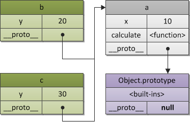
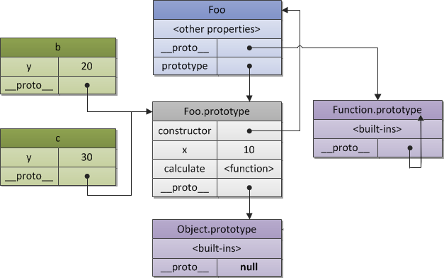

<!DOCTYPE html>
<!-- saved from url=(0046)https://kaiiiz.github.io/hexo-theme-book-demo/ -->
<html xmlns="http://www.w3.org/1999/xhtml">
<head>
    <head>
        <meta http-equiv="Content-Type" content="text/html; charset=UTF-8">
        <meta name="viewport" content="width=device-width, initial-scale=1, maximum-scale=1.0, user-scalable=no">
        <link rel="icon" href="../../static/favicon.png">
        <title>036  编程范式游记（7）- 基于原型的编程范式.md</title>
        <!-- Spectre.css framework -->
        <link rel="stylesheet" href="../../static/index.css">
        <!-- theme css & js -->
        <meta name="generator" content="Hexo 4.2.0">
    </head>

<body>

    

        

            <a href="../../index.html">
                
                技术文章摘抄
            </a>
        

        

            <ul class="uncollapsible">
                <li><a href="../../index.html" class="current-tab">首页</a></li>
            </ul>

            <ul class="uncollapsible">
                <li><a href="../index.html">上一级</a></li>
            </ul>

            <ul class="uncollapsible">
                <li>

                    
                    <a href="000&#32;开篇词&#32;&#32;洞悉技术的本质，享受科技的乐趣.md">000 开篇词  洞悉技术的本质，享受科技的乐趣.md</a>

                </li>
                <li>

                    
                    <a href="001&#32;&#32;程序员如何用技术变现（上）.md">001  程序员如何用技术变现（上）.md</a>

                </li>
                <li>

                    
                    <a href="002&#32;&#32;程序员如何用技术变现（下）.md">002  程序员如何用技术变现（下）.md</a>

                </li>
                <li>

                    
                    <a href="003&#32;&#32;Equifax信息泄露始末.md">003  Equifax信息泄露始末.md</a>

                </li>
                <li>

                    
                    <a href="004&#32;&#32;从Equifax信息泄露看数据安全.md">004  从Equifax信息泄露看数据安全.md</a>

                </li>
                <li>

                    
                    <a href="005&#32;&#32;何为技术领导力.md">005  何为技术领导力.md</a>

                </li>
                <li>

                    
                    <a href="006&#32;&#32;如何拥有技术领导力.md">006  如何拥有技术领导力.md</a>

                </li>
                <li>

                    
                    <a href="007&#32;&#32;推荐阅读：每个程序员都该知道的事.md">007  推荐阅读：每个程序员都该知道的事.md</a>

                </li>
                <li>

                    
                    <a href="008&#32;&#32;Go语言，Docker和新技术.md">008  Go语言，Docker和新技术.md</a>

                </li>
                <li>

                    
                    <a href="009&#32;&#32;答疑解惑：渴望、热情和选择.md">009  答疑解惑：渴望、热情和选择.md</a>

                </li>
                <li>

                    
                    <a href="010&#32;&#32;如何成为一个大家愿意追随的Leader？.md">010  如何成为一个大家愿意追随的Leader？.md</a>

                </li>
                <li>

                    
                    <a href="011&#32;&#32;程序中的错误处理：错误返回码和异常捕捉.md">011  程序中的错误处理：错误返回码和异常捕捉.md</a>

                </li>
                <li>

                    
                    <a href="012&#32;&#32;程序中的错误处理：异步编程和最佳实践.md">012  程序中的错误处理：异步编程和最佳实践.md</a>

                </li>
                <li>

                    
                    <a href="013&#32;&#32;魔数&#32;0x5f3759df.md">013  魔数 0x5f3759df.md</a>

                </li>
                <li>

                    
                    <a href="014&#32;&#32;推荐阅读：机器学习101.md">014  推荐阅读：机器学习101.md</a>

                </li>
                <li>

                    
                    <a href="015&#32;&#32;时间管理：同扭曲时间的事儿抗争.md">015  时间管理：同扭曲时间的事儿抗争.md</a>

                </li>
                <li>

                    
                    <a href="016&#32;&#32;时间管理：投资赚取时间.md">016  时间管理：投资赚取时间.md</a>

                </li>
                <li>

                    
                    <a href="017&#32;&#32;故障处理最佳实践：应对故障.md">017  故障处理最佳实践：应对故障.md</a>

                </li>
                <li>

                    
                    <a href="018&#32;&#32;故障处理最佳实践：故障改进.md">018  故障处理最佳实践：故障改进.md</a>

                </li>
                <li>

                    
                    <a href="019&#32;&#32;答疑解惑：我们应该能够识别的表象和本质.md">019  答疑解惑：我们应该能够识别的表象和本质.md</a>

                </li>
                <li>

                    
                    <a href="020&#32;&#32;分布式系统架构的冰与火.md">020  分布式系统架构的冰与火.md</a>

                </li>
                <li>

                    
                    <a href="021&#32;&#32;从亚马逊的实践，谈分布式系统的难点.md">021  从亚马逊的实践，谈分布式系统的难点.md</a>

                </li>
                <li>

                    
                    <a href="022&#32;&#32;分布式系统的技术栈.md">022  分布式系统的技术栈.md</a>

                </li>
                <li>

                    
                    <a href="023&#32;&#32;分布式系统关键技术：全栈监控.md">023  分布式系统关键技术：全栈监控.md</a>

                </li>
                <li>

                    
                    <a href="024&#32;&#32;分布式系统关键技术：服务调度.md">024  分布式系统关键技术：服务调度.md</a>

                </li>
                <li>

                    
                    <a href="025&#32;&#32;分布式系统关键技术：流量与数据调度.md">025  分布式系统关键技术：流量与数据调度.md</a>

                </li>
                <li>

                    
                    <a href="026&#32;&#32;洞悉PaaS平台的本质.md">026  洞悉PaaS平台的本质.md</a>

                </li>
                <li>

                    
                    <a href="027&#32;&#32;推荐阅读：分布式系统架构经典资料.md">027  推荐阅读：分布式系统架构经典资料.md</a>

                </li>
                <li>

                    
                    <a href="028&#32;&#32;编程范式游记（1）-&#32;起源.md">028  编程范式游记（1）- 起源.md</a>

                </li>
                <li>

                    
                    <a href="029&#32;&#32;编程范式游记（2）-&#32;泛型编程.md">029  编程范式游记（2）- 泛型编程.md</a>

                </li>
                <li>

                    
                    <a href="030&#32;&#32;编程范式游记（3）&#32;-&#32;类型系统和泛型的本质.md">030  编程范式游记（3） - 类型系统和泛型的本质.md</a>

                </li>
                <li>

                    
                    <a href="031&#32;&#32;Git协同工作流，你该怎样选.md">031  Git协同工作流，你该怎样选.md</a>

                </li>
                <li>

                    
                    <a href="032&#32;&#32;推荐阅读：分布式数据调度相关论文.md">032  推荐阅读：分布式数据调度相关论文.md</a>

                </li>
                <li>

                    
                    <a href="033&#32;&#32;编程范式游记（4）-&#32;函数式编程.md">033  编程范式游记（4）- 函数式编程.md</a>

                </li>
                <li>

                    
                    <a href="034&#32;&#32;编程范式游记（5）-&#32;修饰器模式.md">034  编程范式游记（5）- 修饰器模式.md</a>

                </li>
                <li>

                    
                    <a href="035&#32;&#32;编程范式游记（6）-&#32;面向对象编程.md">035  编程范式游记（6）- 面向对象编程.md</a>

                </li>
                <li>

                    <a class="current-tab" href="036&#32;&#32;编程范式游记（7）-&#32;基于原型的编程范式.md">036  编程范式游记（7）- 基于原型的编程范式.md</a>
                    

                </li>
                <li>

                    
                    <a href="037&#32;&#32;编程范式游记（8）-&#32;Go&#32;语言的委托模式.md">037  编程范式游记（8）- Go 语言的委托模式.md</a>

                </li>
                <li>

                    
                    <a href="038&#32;&#32;编程范式游记（9）-&#32;编程的本质.md">038  编程范式游记（9）- 编程的本质.md</a>

                </li>
                <li>

                    
                    <a href="039&#32;&#32;编程范式游记（10）-&#32;逻辑编程范式.md">039  编程范式游记（10）- 逻辑编程范式.md</a>

                </li>
                <li>

                    
                    <a href="040&#32;&#32;编程范式游记（11）-&#32;程序世界里的编程范式.md">040  编程范式游记（11）- 程序世界里的编程范式.md</a>

                </li>
                <li>

                    
                    <a href="041&#32;&#32;弹力设计篇之“认识故障和弹力设计”.md">041  弹力设计篇之“认识故障和弹力设计”.md</a>

                </li>
                <li>

                    
                    <a href="042&#32;&#32;弹力设计篇之“隔离设计”.md">042  弹力设计篇之“隔离设计”.md</a>

                </li>
                <li>

                    
                    <a href="043&#32;&#32;弹力设计篇之“异步通讯设计”.md">043  弹力设计篇之“异步通讯设计”.md</a>

                </li>
                <li>

                    
                    <a href="044&#32;&#32;弹力设计篇之“幂等性设计”.md">044  弹力设计篇之“幂等性设计”.md</a>

                </li>
                <li>

                    
                    <a href="045&#32;&#32;弹力设计篇之“服务的状态”.md">045  弹力设计篇之“服务的状态”.md</a>

                </li>
                <li>

                    
                    <a href="046&#32;&#32;弹力设计篇之“补偿事务”.md">046  弹力设计篇之“补偿事务”.md</a>

                </li>
                <li>

                    
                    <a href="047&#32;&#32;弹力设计篇之“重试设计”.md">047  弹力设计篇之“重试设计”.md</a>

                </li>
                <li>

                    
                    <a href="048&#32;&#32;弹力设计篇之“熔断设计”.md">048  弹力设计篇之“熔断设计”.md</a>

                </li>
                <li>

                    
                    <a href="049&#32;&#32;弹力设计篇之“限流设计”.md">049  弹力设计篇之“限流设计”.md</a>

                </li>
                <li>

                    
                    <a href="050&#32;&#32;弹力设计篇之“降级设计”.md">050  弹力设计篇之“降级设计”.md</a>

                </li>
                <li>

                    
                    <a href="051&#32;&#32;弹力设计篇之“弹力设计总结”.md">051  弹力设计篇之“弹力设计总结”.md</a>

                </li>
                <li>

                    
                    <a href="052&#32;&#32;区块链技术&#32;-&#32;区块链的革命性及技术概要.md">052  区块链技术 - 区块链的革命性及技术概要.md</a>

                </li>
                <li>

                    
                    <a href="053&#32;&#32;区块链技术&#32;-&#32;区块链技术细节&#32;-&#32;哈希算法.md">053  区块链技术 - 区块链技术细节 - 哈希算法.md</a>

                </li>
                <li>

                    
                    <a href="054&#32;&#32;区块链技术&#32;-&#32;区块链技术细节&#32;-&#32;加密和挖矿.md">054  区块链技术 - 区块链技术细节 - 加密和挖矿.md</a>

                </li>
                <li>

                    
                    <a href="055&#32;&#32;区块链技术&#32;-&#32;去中心化的共识机制.md">055  区块链技术 - 去中心化的共识机制.md</a>

                </li>
                <li>

                    
                    <a href="056&#32;&#32;区块链技术&#32;-&#32;智能合约.md">056  区块链技术 - 智能合约.md</a>

                </li>
                <li>

                    
                    <a href="057&#32;&#32;区块链技术&#32;-&#32;传统金融和虚拟货币.md">057  区块链技术 - 传统金融和虚拟货币.md</a>

                </li>
                <li>

                    
                    <a href="058&#32;&#32;管理设计篇之分布式锁.md">058  管理设计篇之分布式锁.md</a>

                </li>
                <li>

                    
                    <a href="059&#32;&#32;管理设计篇之配置中心.md">059  管理设计篇之配置中心.md</a>

                </li>
                <li>

                    
                    <a href="060&#32;&#32;管理设计篇之边车模式.md">060  管理设计篇之边车模式.md</a>

                </li>
                <li>

                    
                    <a href="061&#32;&#32;管理设计篇之服务网格.md">061  管理设计篇之服务网格.md</a>

                </li>
                <li>

                    
                    <a href="062&#32;&#32;管理设计篇之网关模式.md">062  管理设计篇之网关模式.md</a>

                </li>
                <li>

                    
                    <a href="063&#32;&#32;管理设计篇之部署升级策略.md">063  管理设计篇之部署升级策略.md</a>

                </li>
                <li>

                    
                    <a href="064&#32;&#32;性能设计篇之缓存.md">064  性能设计篇之缓存.md</a>

                </li>
                <li>

                    
                    <a href="065&#32;&#32;性能设计篇之异步处理.md">065  性能设计篇之异步处理.md</a>

                </li>
                <li>

                    
                    <a href="066&#32;&#32;性能设计篇之数据库扩展.md">066  性能设计篇之数据库扩展.md</a>

                </li>
                <li>

                    
                    <a href="067&#32;&#32;性能设计篇之秒杀.md">067  性能设计篇之秒杀.md</a>

                </li>
                <li>

                    
                    <a href="068&#32;&#32;性能设计篇之边缘计算.md">068  性能设计篇之边缘计算.md</a>

                </li>
                <li>

                    
                    <a href="069&#32;&#32;程序员练级攻略（2018）：开篇词.md">069  程序员练级攻略（2018）：开篇词.md</a>

                </li>
                <li>

                    
                    <a href="070&#32;&#32;程序员练级攻略（2018）：零基础启蒙.md">070  程序员练级攻略（2018）：零基础启蒙.md</a>

                </li>
                <li>

                    
                    <a href="071&#32;&#32;程序员练级攻略（2018）：正式入门.md">071  程序员练级攻略（2018）：正式入门.md</a>

                </li>
                <li>

                    
                    <a href="072&#32;&#32;程序员练级攻略（2018）：程序员修养.md">072  程序员练级攻略（2018）：程序员修养.md</a>

                </li>
                <li>

                    
                    <a href="073&#32;&#32;程序员练级攻略（2018）：编程语言.md">073  程序员练级攻略（2018）：编程语言.md</a>

                </li>
                <li>

                    
                    <a href="074&#32;&#32;程序员练级攻略：理论学科.md">074  程序员练级攻略：理论学科.md</a>

                </li>
                <li>

                    
                    <a href="075&#32;&#32;程序员练级攻略（2018）：系统知识.md">075  程序员练级攻略（2018）：系统知识.md</a>

                </li>
                <li>

                    
                    <a href="076&#32;&#32;程序员练级攻略（2018）：软件设计.md">076  程序员练级攻略（2018）：软件设计.md</a>

                </li>
                <li>

                    
                    <a href="077&#32;&#32;程序员练级攻略（2018）：Linux系统、内存和网络.md">077  程序员练级攻略（2018）：Linux系统、内存和网络.md</a>

                </li>
                <li>

                    
                    <a href="078&#32;&#32;程序员练级攻略（2018）：异步IO模型和Lock-Free编程.md">078  程序员练级攻略（2018）：异步IO模型和Lock-Free编程.md</a>

                </li>
                <li>

                    
                    <a href="079&#32;&#32;程序员练级攻略（2018）：Java底层知识.md">079  程序员练级攻略（2018）：Java底层知识.md</a>

                </li>
                <li>

                    
                    <a href="080&#32;&#32;程序员练级攻略（2018）：数据库.md">080  程序员练级攻略（2018）：数据库.md</a>

                </li>
                <li>

                    
                    <a href="081&#32;&#32;程序员练级攻略（2018）：分布式架构入门.md">081  程序员练级攻略（2018）：分布式架构入门.md</a>

                </li>
                <li>

                    
                    <a href="082&#32;&#32;程序员练级攻略（2018）：分布式架构经典图书和论文.md">082  程序员练级攻略（2018）：分布式架构经典图书和论文.md</a>

                </li>
                <li>

                    
                    <a href="083&#32;&#32;程序员练级攻略（2018）：分布式架构工程设计.md">083  程序员练级攻略（2018）：分布式架构工程设计.md</a>

                </li>
                <li>

                    
                    <a href="084&#32;&#32;程序员练级攻略（2018）：微服务.md">084  程序员练级攻略（2018）：微服务.md</a>

                </li>
                <li>

                    
                    <a href="085&#32;&#32;程序员练级攻略（2018）：容器化和自动化运维.md">085  程序员练级攻略（2018）：容器化和自动化运维.md</a>

                </li>
                <li>

                    
                    <a href="086&#32;&#32;程序员练级攻略（2018）：机器学习和人工智能.md">086  程序员练级攻略（2018）：机器学习和人工智能.md</a>

                </li>
                <li>

                    
                    <a href="087&#32;&#32;程序员练级攻略（2018）：前端基础和底层原理.md">087  程序员练级攻略（2018）：前端基础和底层原理.md</a>

                </li>
                <li>

                    
                    <a href="088&#32;&#32;程序员练级攻略（2018）：前端性能优化和框架.md">088  程序员练级攻略（2018）：前端性能优化和框架.md</a>

                </li>
                <li>

                    
                    <a href="089&#32;&#32;程序员练级攻略（2018）：UIUX设计.md">089  程序员练级攻略（2018）：UIUX设计.md</a>

                </li>
                <li>

                    
                    <a href="090&#32;&#32;程序员练级攻略（2018）：技术资源集散地.md">090  程序员练级攻略（2018）：技术资源集散地.md</a>

                </li>
                <li>

                    
                    <a href="091&#32;&#32;程序员面试攻略：面试前的准备.md">091  程序员面试攻略：面试前的准备.md</a>

                </li>
                <li>

                    
                    <a href="092&#32;&#32;程序员面试攻略：面试中的技巧.md">092  程序员面试攻略：面试中的技巧.md</a>

                </li>
                <li>

                    
                    <a href="093&#32;&#32;程序员面试攻略：面试风格.md">093  程序员面试攻略：面试风格.md</a>

                </li>
                <li>

                    
                    <a href="094&#32;&#32;程序员面试攻略：实力才是王中王.md">094  程序员面试攻略：实力才是王中王.md</a>

                </li>
                <li>

                    
                    <a href="095&#32;&#32;高效学习：端正学习态度.md">095  高效学习：端正学习态度.md</a>

                </li>
                <li>

                    
                    <a href="096&#32;&#32;高效学习：源头、原理和知识地图.md">096  高效学习：源头、原理和知识地图.md</a>

                </li>
                <li>

                    
                    <a href="097&#32;&#32;高效学习：深度，归纳和坚持实践.md">097  高效学习：深度，归纳和坚持实践.md</a>

                </li>
                <li>

                    
                    <a href="098&#32;&#32;高效学习：如何学习和阅读代码.md">098  高效学习：如何学习和阅读代码.md</a>

                </li>
                <li>

                    
                    <a href="099&#32;&#32;高效学习：面对枯燥和量大的知识.md">099  高效学习：面对枯燥和量大的知识.md</a>

                </li>
                <li>

                    
                    <a href="100&#32;&#32;高效沟通：Talk和Code同等重要.md">100  高效沟通：Talk和Code同等重要.md</a>

                </li>
                <li>

                    
                    <a href="101&#32;&#32;高效沟通：沟通阻碍和应对方法.md">101  高效沟通：沟通阻碍和应对方法.md</a>

                </li>
                <li>

                    
                    <a href="102&#32;&#32;高效沟通：沟通方式及技巧.md">102  高效沟通：沟通方式及技巧.md</a>

                </li>
                <li>

                    
                    <a href="103&#32;&#32;高效沟通：沟通技术.md">103  高效沟通：沟通技术.md</a>

                </li>
                <li>

                    
                    <a href="104&#32;&#32;高效沟通：好老板要善于提问.md">104  高效沟通：好老板要善于提问.md</a>

                </li>
                <li>

                    
                    <a href="105&#32;&#32;高效沟通：好好说话的艺术.md">105  高效沟通：好好说话的艺术.md</a>

                </li>
                <li>

                    
                    <a href="106&#32;加餐&#32;&#32;谈谈我的“三观”.md">106 加餐  谈谈我的“三观”.md</a>

                </li>
                <li>

                    
                    <a href="107&#32;结束语&#32;&#32;业精于勤，行成于思.md">107 结束语  业精于勤，行成于思.md</a>

                </li>
            </ul>

        

    

    

        

    

    

    

        

            

                

                    <!-- For Responsive Layout -->
                    <header class="navbar">
                        <section class="navbar-section">
                            <a onclick="open_sidebar()">
                                <i class="icon icon-menu"></i>
                            </a>
                        </section>
                    </header>
                

                

                    

                        

                        
<h1>036  编程范式游记（7）- 基于原型的编程范式</h1>

基于原型（prototype）的编程其实也是面向对象编程的一种方式。没有 class 化的，直接使用对象。又叫，基于实例的编程。其主流的语言就是 JavaScript。与传统的面对象编程的比较如下。

<ul>
<li>在基于类的编程当中，对象总共有两种类型。类定义了对象的基本布局和函数特性，而接口是“可以使用的”对象，它基于特定类的样式。在此模型中，类表现为行为和结构的集合，对所有接口来说这些类的行为和结构都是相同的。因而，区分规则首先是基于行为和结构，而后才是状态。</li>
<li>原型编程的主张者经常争论说，基于类的语言提倡使用一个关注分类和类之间关系的开发模型。与此相对，原型编程看起来提倡程序员关注一系列对象实例的行为，而之后才关心如何将这些对象划分到最近的使用方式相似的原型对象，而不是分成类。</li>
</ul>

因为如此，很多基于原型的系统提倡运行时原型的修改，而只有极少数基于类的面向对象系统（比如第一个动态面向对象的系统 Smalltalk）允许类在程序运行时被修改。

<ul>
<li>在基于类的语言中，一个新的实例通过类构造器和构造器可选的参数来构造，结果实例由类选定的行为和布局创建模型。</li>
<li>在基于原型的系统中构造对象有两种方法，通过复制已有的对象或者通过扩展空对象创建。很多基于原型的系统提倡运行时原型的修改，而基于类的面向对象系统只有动态语言允许类在运行时被修改（Common Lisp、Dylan、Objective-C、Perl、Python、Ruby 和 Smalltalk）。</li>
</ul>
<h1>JavaScript 的原型概念</h1>

这里，我们主要以 JavaScript 举例，面向对象里面要有个 Class。但是 JavaScript 觉得不是这样的，它就是要基于原型编程，就不要 Class，就直接在对象上改就行了。基于编程的修改，直接对类型进行修改。

我们先来看一个示例。

<pre><code>var foo = {name: &quot;foo&quot;, one: 1, two: 2};
 
var bar = {three: 3};
</code></pre>

每个对象都有一个 <code>__proto__</code> 的属性，这个就是“原型”。对于上面的两个对象，如果我们把 <code>foo</code> 赋值给 <code>bar.__proto__</code>，那就意味着，<code>bar</code> 的原型就成了 <code>foo</code>的。

<pre><code>bar.__proto__ = foo; // foo is now the prototype of bar.

</code></pre>

于是，我们就可以在 <code>bar</code> 里面访问 <code>foo</code> 的属性了。

<pre><code>// If we try to access foo's properties from bar 
// from now on, we'll succeed. 
bar.one // Resolves to 1.
 
// The child object's properties are also accessible.
bar.three // Resolves to 3.
 
// Own properties shadow prototype properties
bar.name = &quot;bar&quot;;
foo.name; // unaffected, resolves to &quot;foo&quot;
bar.name; // Resolves to &quot;bar&quot;
</code></pre>

需要解释一下 JavaScript 的两个东西，一个是 <code>__proto__</code>，另一个是 <code>prototype</code>，这两个东西很容易混淆。这里说明一下：

<ul>
<li><strong><strong>proto</strong></strong> 主要是安放在一个实际的对象中，用它来产生一个链接，一个原型链连，用于寻找方法名或属性，等等。</li>
<li><strong>prototype</strong> 是用 <code>new</code> 来创建一个对象时构造 <code>__proto__</code> 用的。它是构造函数的一个属性。</li>
</ul>

在 JavaScript 中，对象有两种表现形式， 一种是 <code>Object</code> (<a href="https://www.ecma-international.org/ecma-262/5.1/#sec-15.2">ES5 关于 Object 的文档</a>)，一种是 <code>Function</code> （<a href="https://www.ecma-international.org/ecma-262/5.1/#sec-15.2">ES5 关于 Function 的文档</a>）。

我们可以简单地认为，<code>__proto__</code> 是所有对象用于链接原型的一个指针，而 <code>prototype</code> 则是 Function 对象的属性，其主要是用来当需要 new 一个对象时让 <code>__proto__</code> 指针所指向的地方。 对于超级对象 <code>Function</code> 而言， <code>Function.__proto__</code> 就是 <code>Function.prototype</code>。

比如我们有如下的代码：

<pre><code>var a = {
  x: 10,
  calculate: function (z) {
    return this.x + this.y + z;
  }
};
 
var b = {
  y: 20,
  __proto__: a
};
 
var c = {
  y: 30,
  __proto__: a
};
 
// call the inherited method
b.calculate(30); // 60
c.calculate(40); // 80
</code></pre>

其中的“原型链”如下所示：

注意：ES5 中，规定原型继承需要使用 <code>Object.create()</code> 函数。如下所示：

<pre><code>var b = Object.create(a, {y: {value: 20}});
var c = Object.create(a, {y: {value: 30}});
</code></pre>

好了，我们再来看一段代码：

<pre><code>// 一种构造函数写法
function Foo(y) {
  this.y = y;
}
 
// 修改 Foo 的 prototype，加入一个成员变量 x
Foo.prototype.x = 10;
 
// 修改 Foo 的 prototype，加入一个成员函数 calculate
Foo.prototype.calculate = function (z) {
  return this.x + this.y + z;
};
 
// 现在，我们用 Foo 这个原型来创建 b 和 c
var b = new Foo(20);
var c = new Foo(30);
 
// 调用原型中的方法，可以得到正确的值
b.calculate(30); // 60
c.calculate(40); // 80
</code></pre>

那么，在内存中的布局是怎么样的呢？大概是下面这个样子。

这个图应该可以让你很好地看明白 <code>__proto__</code> 和 <code>prototype</code> 的差别了。

我们可以测试一下：

<pre><code>b.__proto__ === Foo.prototype, // true
c.__proto__ === Foo.prototype, // true
 
b.constructor === Foo, // true
c.constructor === Foo, // true
Foo.prototype.constructor === Foo, // true
 
b.calculate === b.__proto__.calculate, // true
b.__proto__.calculate === Foo.prototype.calculate // true
</code></pre>

这里需要说明的是——

<strong>Foo.prototype 自动创建了一个属性 constructor，这是一个指向函数自己的一个 reference。这样一来，对于实例 b 或 c 来说，就能访问到这个继承的 constructor 了。</strong>

有了这些基本概念，我们就可以讲一下 JavaScript 的面向对象编程了。

<blockquote>

注： 上面示例和图示来源于 <a href="http://dmitrysoshnikov.com/ecmascript/javascript-the-core/">JavaScript, The Core</a> 一文。

</blockquote>
<h1>JavaScript 原型编程的面向对象</h1>

我们再来重温一下上面讲述的内容：

<pre><code>function Person(){}
var p = new Person();
 
Person.prototype.name = &quot;Hao Chen&quot;;
Person.prototype.sayHello = function(){
    console.log(&quot;Hi, I am &quot; + this.name);
}
 
console.log(p.name); // &quot;Hao Chen&quot;
p.sayHello(); // &quot;Hi, I am Hao Chen&quot;
</code></pre>

在上面这个例子中：

<ul>
<li>我们先生成了一个空的函数对象 <code>Person()</code>；</li>
<li>然后将这个空的函数对象 <code>new</code> 出另一个对象，存在 <code>p</code> 中；</li>
<li>这时再改变 <code>Person.prototype</code>，让其有一个 <code>name</code> 的属性和一个 <code>sayHello()</code> 的方法；</li>
<li>我们发现，另外那个 <code>p</code> 的对象也跟着一起改变了。</li>
</ul>

注意一下，

<ul>
<li>当创建 <code>function Person(){}</code> 时，<code>Person.__proto__</code> 指向 <code>Function.prototype</code>;</li>
<li>当创建 <code>var p = new Person()</code> 时，<code>p.__proto__</code> 指向 <code>Person.prototype</code>;</li>
<li>当修改了 <code>Person.prototype</code> 的内容后，<code>p.__proto__</code> 的内容也就被改变了。</li>
</ul>

好了，我们再来看一下“原型编程”中面向对象的编程玩法。

首先，我们定义一个 <code>Person</code> 类。

<pre><code>//Define human class
var Person = function (fullName, email) {
  this.fullName = fullName;
  this.email = email;
  
  this.speak = function(){
    console.log(&quot;I speak English!&quot;);
  };
  this.introduction = function(){
    console.log(&quot;Hi, I am &quot; + this.fullName);
  };
}
</code></pre>

上面这个对象中，包含了：

<ul>
<li>属性： <code>fullName</code> 和 <code>email</code>；</li>
<li>方法： <code>speak()</code> 和 <code>introduction()</code>。</li>
</ul>

其实，所谓的方法也是属性。

然后，我们可以定义一个 <code>Student</code> 对象。

<pre><code>//Define Student class
var Student = function(fullName, email, school, courses) {
 
  Person.call(this, fullName, email);
 
  // Initialize our Student properties
  this.school = school;
  this.courses = courses;
  
  // override the &quot;introduction&quot; method
  this.introduction= function(){
	console.log(&quot;Hi, I am &quot; + this.fullName + 
				&quot;. I am a student of &quot; + this.school + 
				&quot;, I study &quot;+ this.courses +&quot;.&quot;);
  };
  
  // Add a &quot;exams&quot; method
  this.takeExams = function(){
    console.log(&quot;This is my exams time!&quot;);
  };
};
</code></pre>

在上面的代码中：

<ul>
<li>使用了 <code>Person.call(this, fullName, email)</code>，<code>call()</code> 或 <code>apply()</code> 都是为了动态改变 <code>this</code> 所指向的对象的内容而出现的。这里的 <code>this</code> 就是 <code>Student</code>。</li>
<li>上面的例子中，我们重载了 <code>introduction()</code> 方法，并新增加了一个 <code>takeExams()</code>的方法。</li>
</ul>

虽然，我们这样定义了 <code>Student</code>，但是它还没有和 <code>Person</code> 发生继承关系。为了要让它们发生关系，我们就需要修改 <code>Student</code> 的原型。

我们可以简单粗暴地做赋值：<code>Student.__proto__ = Person.prototype</code> ，但是，这太粗暴了。

我们还是使用比较规范的方式：

<ul>
<li>先用 <code>Object.create()</code> 来将<code>Person.prototype</code> 和 <code>Student.prototype</code> 关联上。</li>
<li>然后，修改一下构造函数 <code>Student.prototype.constructor = Student;</code>。</li>
</ul>
<pre><code>// Create a Student.prototype object that inherits 
// from Person.prototype.
Student.prototype = Object.create(Person.prototype); 
 
// Set the &quot;constructor&quot; property to refer to Student
Student.prototype.constructor = Student;
</code></pre>

这样，我们就可以这样使用了。

<pre><code>var student = new Student(&quot;Hao Chen&quot;, 
						  &quot;<a href="../../cdn-cgi/l/email-protection" class="__cf_email__" data-cfemail="7d151c1218113d151209101c1411531e1210">[email&#160;protected]</a>&quot;,
						  &quot;XYZ University&quot;, 
						  &quot;Computer Science&quot;);
student.introduction();   
student.speak();       
student.takeExams(); 
 
// Check that instanceof works correctly
console.log(student instanceof Person);  // true 
console.log(student instanceof Student); // true
</code></pre>

上述就是基于原型的面向对象编程的玩法了。

<blockquote>

注：在 ECMAScript 标准的第四版开始寻求使 JavaScript 提供基于类的构造，且 ECMAScript 第六版有提供 &quot;class&quot;(类) 作为原有的原型架构之上的语法糖，提供构建对象与处理继承时的另一种语法。

</blockquote>
<h1>小结</h1>

我们可以看到，这种玩法就是一种委托的方式。在使用委托的基于原型的语言中，运行时语言可以仅仅通过循着一个序列的指针直到找到匹配这样的方式来定位属性或者寻找正确的数据。所有这些创建行为共享的行为需要的是委托指针。

不像是基于类的面向对象语言中类和接口的关系，原型和它的分支之间的关系并不要求子对象有相似的内存结构，因为如此，子对象可以继续修改而无需像基于类的系统那样整理结构。还有一个要提到的地方是，不仅仅是数据，方法也能被修改。因为这个原因，大多数基于原型的语言把数据和方法提作“slots”。

这种在对象里面直接修改的玩法，虽然这个特性可以带来运行时的灵活性，我们可以在运行时修改一个 prototype，给它增加甚至删除属性和方法。但是其带来了执行的不确定性，也有安全性的问题，而代码还变得不可预测，这有点黑科技的味道了。因为这些不像静态类型系统，没有一个不可变的契约对代码的确定性有保证，所以，需要使用者来自己保证。

                    

                    

                        

                            <a href="035&#32;&#32;编程范式游记（6）-&#32;面向对象编程.md">上一页</a>
                        

                        

                            <a href="037&#32;&#32;编程范式游记（8）-&#32;Go&#32;语言的委托模式.md">下一页</a>
                        

                    

                

            

        

    

    

</body>
<!-- Global site tag (gtag.js) - Google Analytics -->

</html>
