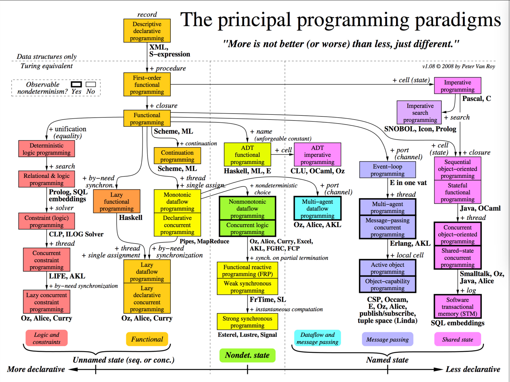
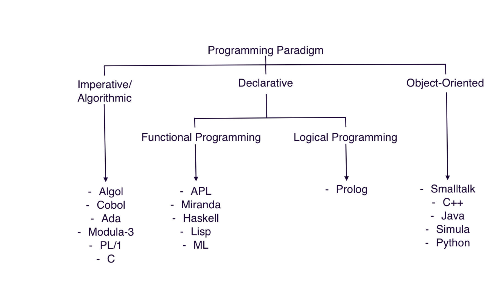
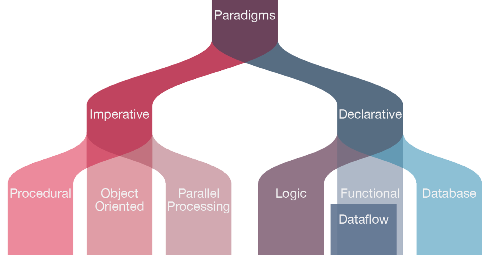
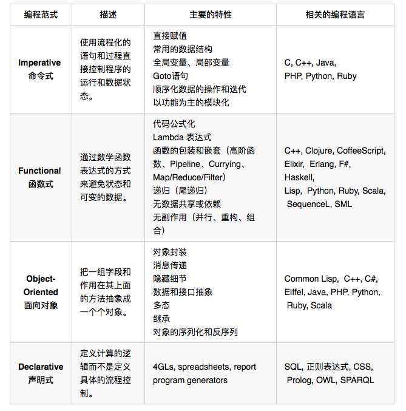

<!DOCTYPE html>
<!-- saved from url=(0046)https://kaiiiz.github.io/hexo-theme-book-demo/ -->
<html xmlns="http://www.w3.org/1999/xhtml">
<head>
    <head>
        <meta http-equiv="Content-Type" content="text/html; charset=UTF-8">
        <meta name="viewport" content="width=device-width, initial-scale=1, maximum-scale=1.0, user-scalable=no">
        <link rel="icon" href="../../static/favicon.png">
        <title>040  编程范式游记（11）- 程序世界里的编程范式.md</title>
        <!-- Spectre.css framework -->
        <link rel="stylesheet" href="../../static/index.css">
        <!-- theme css & js -->
        <meta name="generator" content="Hexo 4.2.0">
    </head>

<body>

    

        

            <a href="../../index.html">
                
                技术文章摘抄
            </a>
        

        

            <ul class="uncollapsible">
                <li><a href="../../index.html" class="current-tab">首页</a></li>
            </ul>

            <ul class="uncollapsible">
                <li><a href="../index.html">上一级</a></li>
            </ul>

            <ul class="uncollapsible">
                <li>

                    
                    <a href="000&#32;开篇词&#32;&#32;洞悉技术的本质，享受科技的乐趣.md">000 开篇词  洞悉技术的本质，享受科技的乐趣.md</a>

                </li>
                <li>

                    
                    <a href="001&#32;&#32;程序员如何用技术变现（上）.md">001  程序员如何用技术变现（上）.md</a>

                </li>
                <li>

                    
                    <a href="002&#32;&#32;程序员如何用技术变现（下）.md">002  程序员如何用技术变现（下）.md</a>

                </li>
                <li>

                    
                    <a href="003&#32;&#32;Equifax信息泄露始末.md">003  Equifax信息泄露始末.md</a>

                </li>
                <li>

                    
                    <a href="004&#32;&#32;从Equifax信息泄露看数据安全.md">004  从Equifax信息泄露看数据安全.md</a>

                </li>
                <li>

                    
                    <a href="005&#32;&#32;何为技术领导力.md">005  何为技术领导力.md</a>

                </li>
                <li>

                    
                    <a href="006&#32;&#32;如何拥有技术领导力.md">006  如何拥有技术领导力.md</a>

                </li>
                <li>

                    
                    <a href="007&#32;&#32;推荐阅读：每个程序员都该知道的事.md">007  推荐阅读：每个程序员都该知道的事.md</a>

                </li>
                <li>

                    
                    <a href="008&#32;&#32;Go语言，Docker和新技术.md">008  Go语言，Docker和新技术.md</a>

                </li>
                <li>

                    
                    <a href="009&#32;&#32;答疑解惑：渴望、热情和选择.md">009  答疑解惑：渴望、热情和选择.md</a>

                </li>
                <li>

                    
                    <a href="010&#32;&#32;如何成为一个大家愿意追随的Leader？.md">010  如何成为一个大家愿意追随的Leader？.md</a>

                </li>
                <li>

                    
                    <a href="011&#32;&#32;程序中的错误处理：错误返回码和异常捕捉.md">011  程序中的错误处理：错误返回码和异常捕捉.md</a>

                </li>
                <li>

                    
                    <a href="012&#32;&#32;程序中的错误处理：异步编程和最佳实践.md">012  程序中的错误处理：异步编程和最佳实践.md</a>

                </li>
                <li>

                    
                    <a href="013&#32;&#32;魔数&#32;0x5f3759df.md">013  魔数 0x5f3759df.md</a>

                </li>
                <li>

                    
                    <a href="014&#32;&#32;推荐阅读：机器学习101.md">014  推荐阅读：机器学习101.md</a>

                </li>
                <li>

                    
                    <a href="015&#32;&#32;时间管理：同扭曲时间的事儿抗争.md">015  时间管理：同扭曲时间的事儿抗争.md</a>

                </li>
                <li>

                    
                    <a href="016&#32;&#32;时间管理：投资赚取时间.md">016  时间管理：投资赚取时间.md</a>

                </li>
                <li>

                    
                    <a href="017&#32;&#32;故障处理最佳实践：应对故障.md">017  故障处理最佳实践：应对故障.md</a>

                </li>
                <li>

                    
                    <a href="018&#32;&#32;故障处理最佳实践：故障改进.md">018  故障处理最佳实践：故障改进.md</a>

                </li>
                <li>

                    
                    <a href="019&#32;&#32;答疑解惑：我们应该能够识别的表象和本质.md">019  答疑解惑：我们应该能够识别的表象和本质.md</a>

                </li>
                <li>

                    
                    <a href="020&#32;&#32;分布式系统架构的冰与火.md">020  分布式系统架构的冰与火.md</a>

                </li>
                <li>

                    
                    <a href="021&#32;&#32;从亚马逊的实践，谈分布式系统的难点.md">021  从亚马逊的实践，谈分布式系统的难点.md</a>

                </li>
                <li>

                    
                    <a href="022&#32;&#32;分布式系统的技术栈.md">022  分布式系统的技术栈.md</a>

                </li>
                <li>

                    
                    <a href="023&#32;&#32;分布式系统关键技术：全栈监控.md">023  分布式系统关键技术：全栈监控.md</a>

                </li>
                <li>

                    
                    <a href="024&#32;&#32;分布式系统关键技术：服务调度.md">024  分布式系统关键技术：服务调度.md</a>

                </li>
                <li>

                    
                    <a href="025&#32;&#32;分布式系统关键技术：流量与数据调度.md">025  分布式系统关键技术：流量与数据调度.md</a>

                </li>
                <li>

                    
                    <a href="026&#32;&#32;洞悉PaaS平台的本质.md">026  洞悉PaaS平台的本质.md</a>

                </li>
                <li>

                    
                    <a href="027&#32;&#32;推荐阅读：分布式系统架构经典资料.md">027  推荐阅读：分布式系统架构经典资料.md</a>

                </li>
                <li>

                    
                    <a href="028&#32;&#32;编程范式游记（1）-&#32;起源.md">028  编程范式游记（1）- 起源.md</a>

                </li>
                <li>

                    
                    <a href="029&#32;&#32;编程范式游记（2）-&#32;泛型编程.md">029  编程范式游记（2）- 泛型编程.md</a>

                </li>
                <li>

                    
                    <a href="030&#32;&#32;编程范式游记（3）&#32;-&#32;类型系统和泛型的本质.md">030  编程范式游记（3） - 类型系统和泛型的本质.md</a>

                </li>
                <li>

                    
                    <a href="031&#32;&#32;Git协同工作流，你该怎样选.md">031  Git协同工作流，你该怎样选.md</a>

                </li>
                <li>

                    
                    <a href="032&#32;&#32;推荐阅读：分布式数据调度相关论文.md">032  推荐阅读：分布式数据调度相关论文.md</a>

                </li>
                <li>

                    
                    <a href="033&#32;&#32;编程范式游记（4）-&#32;函数式编程.md">033  编程范式游记（4）- 函数式编程.md</a>

                </li>
                <li>

                    
                    <a href="034&#32;&#32;编程范式游记（5）-&#32;修饰器模式.md">034  编程范式游记（5）- 修饰器模式.md</a>

                </li>
                <li>

                    
                    <a href="035&#32;&#32;编程范式游记（6）-&#32;面向对象编程.md">035  编程范式游记（6）- 面向对象编程.md</a>

                </li>
                <li>

                    
                    <a href="036&#32;&#32;编程范式游记（7）-&#32;基于原型的编程范式.md">036  编程范式游记（7）- 基于原型的编程范式.md</a>

                </li>
                <li>

                    
                    <a href="037&#32;&#32;编程范式游记（8）-&#32;Go&#32;语言的委托模式.md">037  编程范式游记（8）- Go 语言的委托模式.md</a>

                </li>
                <li>

                    
                    <a href="038&#32;&#32;编程范式游记（9）-&#32;编程的本质.md">038  编程范式游记（9）- 编程的本质.md</a>

                </li>
                <li>

                    
                    <a href="039&#32;&#32;编程范式游记（10）-&#32;逻辑编程范式.md">039  编程范式游记（10）- 逻辑编程范式.md</a>

                </li>
                <li>

                    <a class="current-tab" href="040&#32;&#32;编程范式游记（11）-&#32;程序世界里的编程范式.md">040  编程范式游记（11）- 程序世界里的编程范式.md</a>
                    

                </li>
                <li>

                    
                    <a href="041&#32;&#32;弹力设计篇之“认识故障和弹力设计”.md">041  弹力设计篇之“认识故障和弹力设计”.md</a>

                </li>
                <li>

                    
                    <a href="042&#32;&#32;弹力设计篇之“隔离设计”.md">042  弹力设计篇之“隔离设计”.md</a>

                </li>
                <li>

                    
                    <a href="043&#32;&#32;弹力设计篇之“异步通讯设计”.md">043  弹力设计篇之“异步通讯设计”.md</a>

                </li>
                <li>

                    
                    <a href="044&#32;&#32;弹力设计篇之“幂等性设计”.md">044  弹力设计篇之“幂等性设计”.md</a>

                </li>
                <li>

                    
                    <a href="045&#32;&#32;弹力设计篇之“服务的状态”.md">045  弹力设计篇之“服务的状态”.md</a>

                </li>
                <li>

                    
                    <a href="046&#32;&#32;弹力设计篇之“补偿事务”.md">046  弹力设计篇之“补偿事务”.md</a>

                </li>
                <li>

                    
                    <a href="047&#32;&#32;弹力设计篇之“重试设计”.md">047  弹力设计篇之“重试设计”.md</a>

                </li>
                <li>

                    
                    <a href="048&#32;&#32;弹力设计篇之“熔断设计”.md">048  弹力设计篇之“熔断设计”.md</a>

                </li>
                <li>

                    
                    <a href="049&#32;&#32;弹力设计篇之“限流设计”.md">049  弹力设计篇之“限流设计”.md</a>

                </li>
                <li>

                    
                    <a href="050&#32;&#32;弹力设计篇之“降级设计”.md">050  弹力设计篇之“降级设计”.md</a>

                </li>
                <li>

                    
                    <a href="051&#32;&#32;弹力设计篇之“弹力设计总结”.md">051  弹力设计篇之“弹力设计总结”.md</a>

                </li>
                <li>

                    
                    <a href="052&#32;&#32;区块链技术&#32;-&#32;区块链的革命性及技术概要.md">052  区块链技术 - 区块链的革命性及技术概要.md</a>

                </li>
                <li>

                    
                    <a href="053&#32;&#32;区块链技术&#32;-&#32;区块链技术细节&#32;-&#32;哈希算法.md">053  区块链技术 - 区块链技术细节 - 哈希算法.md</a>

                </li>
                <li>

                    
                    <a href="054&#32;&#32;区块链技术&#32;-&#32;区块链技术细节&#32;-&#32;加密和挖矿.md">054  区块链技术 - 区块链技术细节 - 加密和挖矿.md</a>

                </li>
                <li>

                    
                    <a href="055&#32;&#32;区块链技术&#32;-&#32;去中心化的共识机制.md">055  区块链技术 - 去中心化的共识机制.md</a>

                </li>
                <li>

                    
                    <a href="056&#32;&#32;区块链技术&#32;-&#32;智能合约.md">056  区块链技术 - 智能合约.md</a>

                </li>
                <li>

                    
                    <a href="057&#32;&#32;区块链技术&#32;-&#32;传统金融和虚拟货币.md">057  区块链技术 - 传统金融和虚拟货币.md</a>

                </li>
                <li>

                    
                    <a href="058&#32;&#32;管理设计篇之分布式锁.md">058  管理设计篇之分布式锁.md</a>

                </li>
                <li>

                    
                    <a href="059&#32;&#32;管理设计篇之配置中心.md">059  管理设计篇之配置中心.md</a>

                </li>
                <li>

                    
                    <a href="060&#32;&#32;管理设计篇之边车模式.md">060  管理设计篇之边车模式.md</a>

                </li>
                <li>

                    
                    <a href="061&#32;&#32;管理设计篇之服务网格.md">061  管理设计篇之服务网格.md</a>

                </li>
                <li>

                    
                    <a href="062&#32;&#32;管理设计篇之网关模式.md">062  管理设计篇之网关模式.md</a>

                </li>
                <li>

                    
                    <a href="063&#32;&#32;管理设计篇之部署升级策略.md">063  管理设计篇之部署升级策略.md</a>

                </li>
                <li>

                    
                    <a href="064&#32;&#32;性能设计篇之缓存.md">064  性能设计篇之缓存.md</a>

                </li>
                <li>

                    
                    <a href="065&#32;&#32;性能设计篇之异步处理.md">065  性能设计篇之异步处理.md</a>

                </li>
                <li>

                    
                    <a href="066&#32;&#32;性能设计篇之数据库扩展.md">066  性能设计篇之数据库扩展.md</a>

                </li>
                <li>

                    
                    <a href="067&#32;&#32;性能设计篇之秒杀.md">067  性能设计篇之秒杀.md</a>

                </li>
                <li>

                    
                    <a href="068&#32;&#32;性能设计篇之边缘计算.md">068  性能设计篇之边缘计算.md</a>

                </li>
                <li>

                    
                    <a href="069&#32;&#32;程序员练级攻略（2018）：开篇词.md">069  程序员练级攻略（2018）：开篇词.md</a>

                </li>
                <li>

                    
                    <a href="070&#32;&#32;程序员练级攻略（2018）：零基础启蒙.md">070  程序员练级攻略（2018）：零基础启蒙.md</a>

                </li>
                <li>

                    
                    <a href="071&#32;&#32;程序员练级攻略（2018）：正式入门.md">071  程序员练级攻略（2018）：正式入门.md</a>

                </li>
                <li>

                    
                    <a href="072&#32;&#32;程序员练级攻略（2018）：程序员修养.md">072  程序员练级攻略（2018）：程序员修养.md</a>

                </li>
                <li>

                    
                    <a href="073&#32;&#32;程序员练级攻略（2018）：编程语言.md">073  程序员练级攻略（2018）：编程语言.md</a>

                </li>
                <li>

                    
                    <a href="074&#32;&#32;程序员练级攻略：理论学科.md">074  程序员练级攻略：理论学科.md</a>

                </li>
                <li>

                    
                    <a href="075&#32;&#32;程序员练级攻略（2018）：系统知识.md">075  程序员练级攻略（2018）：系统知识.md</a>

                </li>
                <li>

                    
                    <a href="076&#32;&#32;程序员练级攻略（2018）：软件设计.md">076  程序员练级攻略（2018）：软件设计.md</a>

                </li>
                <li>

                    
                    <a href="077&#32;&#32;程序员练级攻略（2018）：Linux系统、内存和网络.md">077  程序员练级攻略（2018）：Linux系统、内存和网络.md</a>

                </li>
                <li>

                    
                    <a href="078&#32;&#32;程序员练级攻略（2018）：异步IO模型和Lock-Free编程.md">078  程序员练级攻略（2018）：异步IO模型和Lock-Free编程.md</a>

                </li>
                <li>

                    
                    <a href="079&#32;&#32;程序员练级攻略（2018）：Java底层知识.md">079  程序员练级攻略（2018）：Java底层知识.md</a>

                </li>
                <li>

                    
                    <a href="080&#32;&#32;程序员练级攻略（2018）：数据库.md">080  程序员练级攻略（2018）：数据库.md</a>

                </li>
                <li>

                    
                    <a href="081&#32;&#32;程序员练级攻略（2018）：分布式架构入门.md">081  程序员练级攻略（2018）：分布式架构入门.md</a>

                </li>
                <li>

                    
                    <a href="082&#32;&#32;程序员练级攻略（2018）：分布式架构经典图书和论文.md">082  程序员练级攻略（2018）：分布式架构经典图书和论文.md</a>

                </li>
                <li>

                    
                    <a href="083&#32;&#32;程序员练级攻略（2018）：分布式架构工程设计.md">083  程序员练级攻略（2018）：分布式架构工程设计.md</a>

                </li>
                <li>

                    
                    <a href="084&#32;&#32;程序员练级攻略（2018）：微服务.md">084  程序员练级攻略（2018）：微服务.md</a>

                </li>
                <li>

                    
                    <a href="085&#32;&#32;程序员练级攻略（2018）：容器化和自动化运维.md">085  程序员练级攻略（2018）：容器化和自动化运维.md</a>

                </li>
                <li>

                    
                    <a href="086&#32;&#32;程序员练级攻略（2018）：机器学习和人工智能.md">086  程序员练级攻略（2018）：机器学习和人工智能.md</a>

                </li>
                <li>

                    
                    <a href="087&#32;&#32;程序员练级攻略（2018）：前端基础和底层原理.md">087  程序员练级攻略（2018）：前端基础和底层原理.md</a>

                </li>
                <li>

                    
                    <a href="088&#32;&#32;程序员练级攻略（2018）：前端性能优化和框架.md">088  程序员练级攻略（2018）：前端性能优化和框架.md</a>

                </li>
                <li>

                    
                    <a href="089&#32;&#32;程序员练级攻略（2018）：UIUX设计.md">089  程序员练级攻略（2018）：UIUX设计.md</a>

                </li>
                <li>

                    
                    <a href="090&#32;&#32;程序员练级攻略（2018）：技术资源集散地.md">090  程序员练级攻略（2018）：技术资源集散地.md</a>

                </li>
                <li>

                    
                    <a href="091&#32;&#32;程序员面试攻略：面试前的准备.md">091  程序员面试攻略：面试前的准备.md</a>

                </li>
                <li>

                    
                    <a href="092&#32;&#32;程序员面试攻略：面试中的技巧.md">092  程序员面试攻略：面试中的技巧.md</a>

                </li>
                <li>

                    
                    <a href="093&#32;&#32;程序员面试攻略：面试风格.md">093  程序员面试攻略：面试风格.md</a>

                </li>
                <li>

                    
                    <a href="094&#32;&#32;程序员面试攻略：实力才是王中王.md">094  程序员面试攻略：实力才是王中王.md</a>

                </li>
                <li>

                    
                    <a href="095&#32;&#32;高效学习：端正学习态度.md">095  高效学习：端正学习态度.md</a>

                </li>
                <li>

                    
                    <a href="096&#32;&#32;高效学习：源头、原理和知识地图.md">096  高效学习：源头、原理和知识地图.md</a>

                </li>
                <li>

                    
                    <a href="097&#32;&#32;高效学习：深度，归纳和坚持实践.md">097  高效学习：深度，归纳和坚持实践.md</a>

                </li>
                <li>

                    
                    <a href="098&#32;&#32;高效学习：如何学习和阅读代码.md">098  高效学习：如何学习和阅读代码.md</a>

                </li>
                <li>

                    
                    <a href="099&#32;&#32;高效学习：面对枯燥和量大的知识.md">099  高效学习：面对枯燥和量大的知识.md</a>

                </li>
                <li>

                    
                    <a href="100&#32;&#32;高效沟通：Talk和Code同等重要.md">100  高效沟通：Talk和Code同等重要.md</a>

                </li>
                <li>

                    
                    <a href="101&#32;&#32;高效沟通：沟通阻碍和应对方法.md">101  高效沟通：沟通阻碍和应对方法.md</a>

                </li>
                <li>

                    
                    <a href="102&#32;&#32;高效沟通：沟通方式及技巧.md">102  高效沟通：沟通方式及技巧.md</a>

                </li>
                <li>

                    
                    <a href="103&#32;&#32;高效沟通：沟通技术.md">103  高效沟通：沟通技术.md</a>

                </li>
                <li>

                    
                    <a href="104&#32;&#32;高效沟通：好老板要善于提问.md">104  高效沟通：好老板要善于提问.md</a>

                </li>
                <li>

                    
                    <a href="105&#32;&#32;高效沟通：好好说话的艺术.md">105  高效沟通：好好说话的艺术.md</a>

                </li>
                <li>

                    
                    <a href="106&#32;加餐&#32;&#32;谈谈我的“三观”.md">106 加餐  谈谈我的“三观”.md</a>

                </li>
                <li>

                    
                    <a href="107&#32;结束语&#32;&#32;业精于勤，行成于思.md">107 结束语  业精于勤，行成于思.md</a>

                </li>
            </ul>

        

    

    

        

    

    

    

        

            

                

                    <!-- For Responsive Layout -->
                    <header class="navbar">
                        <section class="navbar-section">
                            <a onclick="open_sidebar()">
                                <i class="icon icon-menu"></i>
                            </a>
                        </section>
                    </header>
                

                

                    

                        

                        
<h1>040  编程范式游记（11）- 程序世界里的编程范式</h1>

这个世界到今天有很多很多的编程范式，相当复杂。下面这个图比较好地表现了这些各式各样的编程范式。这个图越往左边就越是“声明式的”，越往右边就越不是“声明式的”（指令式的），我们可以看到，函数式编程、逻辑编程，都在左边，而右边是指令式的，有状态的，有类型的。

上面这个图有点乱，不过总体说来，我们可以简单地把这世界上纷乱的编程范式，分成这几类：<strong>声明式</strong>、<strong>命名式</strong>、<strong>逻辑的</strong>、<strong>函数式</strong>、<strong>面向对象的</strong>、<strong>面向过程的</strong>。

于是我们归纳一下，就可以得到下面这个简单的图。简单描述一下，

<ul>
<li>中间两个声明式编程范式（函数式和逻辑式）偏向于你定义要什么，而不是去怎么做。</li>
<li>而两边的命令式编程范式和面向对象编程范式，偏向于怎么做，而不是要做什么。</li>
</ul>

我们再归纳一下，基本上来说，就是两大分支，一边是在解决数据和算法，一边是在解决逻辑和控制。

下面再给一张表格说明一下这世界上四大编程范式的类别，它们的特性和主要的编程语言。

程序编程范式。一个是左脑，一个右脑。我们程序员基本上是在用左脑，左脑是理性分析，喜欢数据证据，线性思维，陷入细节，具体化的，不抽象。但是实际上玩儿出这些东西的都在右脑，函数式，还有像逻辑式的抽象能力都在右脑。所以我们非线性的想象力都在这边，而标准化教育把我们这边已经全部干掉了，我们只剩左边。我们陷入细节，我一说 Java 是最好的程序设计语言，一堆人就来了，找各种各样的细节问题跟你纠缠。

离我们最近的是函数式编程，但既然函数式编程这么好，为什么函数式编程火不起来呢？首先，这里有个逻辑上的问题，并不是用的人越多的东西就越好。因为还要看是不是大多数人都能理解的东西。函数式编程或是声明式编程，需要的是用我们的右脑，而指令式的则需要用我们的左脑。

参看下图：

我们可以看到，

<strong>人的左脑的特性是</strong>：

<ul>
<li>理性分析型</li>
<li>喜欢数据证据</li>
<li>线性思维</li>
<li>陷入细节</li>
<li>具体化的</li>
</ul>

<strong>人的右脑的特性是</strong>：

<ul>
<li>直觉型</li>
<li>想象力</li>
<li>非线性</li>
<li>宏观思维</li>
<li>抽象化的</li>
</ul>

人类社会中，绝大多数人都是左脑型的人，而只有少数人是右脑型的人，比如那些哲学家、艺术家，以及能够创造理论知识的人。这些人在这个世界上太少了。

这是为什么很多人理解和使用声明式的编程范式比较有困难，因为这要用你的右脑，但是我们习惯于用我们的左脑，左脑用多了以后右脑就有点跟不上了。

说到人类的大脑了，已经到了不是我专长的地方了，这个话题太大了，所以，也是时候结束《编程范式游记》这一系列文章了。希望你能从这一系列文章中有所收获。如果有什么疑问或是我有什么没有讲对的，还希望得到你的批评和指正。先谢谢了。

                    

                    

                        

                            <a href="039&#32;&#32;编程范式游记（10）-&#32;逻辑编程范式.md">上一页</a>
                        

                        

                            <a href="041&#32;&#32;弹力设计篇之“认识故障和弹力设计”.md">下一页</a>
                        

                    

                

            

        

    

    

</body>
<!-- Global site tag (gtag.js) - Google Analytics -->

</html>
