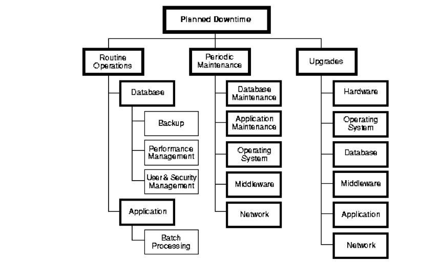

<!DOCTYPE html>
<!-- saved from url=(0046)https://kaiiiz.github.io/hexo-theme-book-demo/ -->
<html xmlns="http://www.w3.org/1999/xhtml">
<head>
    <head>
        <meta http-equiv="Content-Type" content="text/html; charset=UTF-8">
        <meta name="viewport" content="width=device-width, initial-scale=1, maximum-scale=1.0, user-scalable=no">
        <link rel="icon" href="../../static/favicon.png">
        <title>041  弹力设计篇之“认识故障和弹力设计”.md</title>
        <!-- Spectre.css framework -->
        <link rel="stylesheet" href="../../static/index.css">
        <!-- theme css & js -->
        <meta name="generator" content="Hexo 4.2.0">
    </head>

<body>

    

        

            <a href="../../index.html">
                
                技术文章摘抄
            </a>
        

        

            <ul class="uncollapsible">
                <li><a href="../../index.html" class="current-tab">首页</a></li>
            </ul>

            <ul class="uncollapsible">
                <li><a href="../index.html">上一级</a></li>
            </ul>

            <ul class="uncollapsible">
                <li>

                    
                    <a href="000&#32;开篇词&#32;&#32;洞悉技术的本质，享受科技的乐趣.md">000 开篇词  洞悉技术的本质，享受科技的乐趣.md</a>

                </li>
                <li>

                    
                    <a href="001&#32;&#32;程序员如何用技术变现（上）.md">001  程序员如何用技术变现（上）.md</a>

                </li>
                <li>

                    
                    <a href="002&#32;&#32;程序员如何用技术变现（下）.md">002  程序员如何用技术变现（下）.md</a>

                </li>
                <li>

                    
                    <a href="003&#32;&#32;Equifax信息泄露始末.md">003  Equifax信息泄露始末.md</a>

                </li>
                <li>

                    
                    <a href="004&#32;&#32;从Equifax信息泄露看数据安全.md">004  从Equifax信息泄露看数据安全.md</a>

                </li>
                <li>

                    
                    <a href="005&#32;&#32;何为技术领导力.md">005  何为技术领导力.md</a>

                </li>
                <li>

                    
                    <a href="006&#32;&#32;如何拥有技术领导力.md">006  如何拥有技术领导力.md</a>

                </li>
                <li>

                    
                    <a href="007&#32;&#32;推荐阅读：每个程序员都该知道的事.md">007  推荐阅读：每个程序员都该知道的事.md</a>

                </li>
                <li>

                    
                    <a href="008&#32;&#32;Go语言，Docker和新技术.md">008  Go语言，Docker和新技术.md</a>

                </li>
                <li>

                    
                    <a href="009&#32;&#32;答疑解惑：渴望、热情和选择.md">009  答疑解惑：渴望、热情和选择.md</a>

                </li>
                <li>

                    
                    <a href="010&#32;&#32;如何成为一个大家愿意追随的Leader？.md">010  如何成为一个大家愿意追随的Leader？.md</a>

                </li>
                <li>

                    
                    <a href="011&#32;&#32;程序中的错误处理：错误返回码和异常捕捉.md">011  程序中的错误处理：错误返回码和异常捕捉.md</a>

                </li>
                <li>

                    
                    <a href="012&#32;&#32;程序中的错误处理：异步编程和最佳实践.md">012  程序中的错误处理：异步编程和最佳实践.md</a>

                </li>
                <li>

                    
                    <a href="013&#32;&#32;魔数&#32;0x5f3759df.md">013  魔数 0x5f3759df.md</a>

                </li>
                <li>

                    
                    <a href="014&#32;&#32;推荐阅读：机器学习101.md">014  推荐阅读：机器学习101.md</a>

                </li>
                <li>

                    
                    <a href="015&#32;&#32;时间管理：同扭曲时间的事儿抗争.md">015  时间管理：同扭曲时间的事儿抗争.md</a>

                </li>
                <li>

                    
                    <a href="016&#32;&#32;时间管理：投资赚取时间.md">016  时间管理：投资赚取时间.md</a>

                </li>
                <li>

                    
                    <a href="017&#32;&#32;故障处理最佳实践：应对故障.md">017  故障处理最佳实践：应对故障.md</a>

                </li>
                <li>

                    
                    <a href="018&#32;&#32;故障处理最佳实践：故障改进.md">018  故障处理最佳实践：故障改进.md</a>

                </li>
                <li>

                    
                    <a href="019&#32;&#32;答疑解惑：我们应该能够识别的表象和本质.md">019  答疑解惑：我们应该能够识别的表象和本质.md</a>

                </li>
                <li>

                    
                    <a href="020&#32;&#32;分布式系统架构的冰与火.md">020  分布式系统架构的冰与火.md</a>

                </li>
                <li>

                    
                    <a href="021&#32;&#32;从亚马逊的实践，谈分布式系统的难点.md">021  从亚马逊的实践，谈分布式系统的难点.md</a>

                </li>
                <li>

                    
                    <a href="022&#32;&#32;分布式系统的技术栈.md">022  分布式系统的技术栈.md</a>

                </li>
                <li>

                    
                    <a href="023&#32;&#32;分布式系统关键技术：全栈监控.md">023  分布式系统关键技术：全栈监控.md</a>

                </li>
                <li>

                    
                    <a href="024&#32;&#32;分布式系统关键技术：服务调度.md">024  分布式系统关键技术：服务调度.md</a>

                </li>
                <li>

                    
                    <a href="025&#32;&#32;分布式系统关键技术：流量与数据调度.md">025  分布式系统关键技术：流量与数据调度.md</a>

                </li>
                <li>

                    
                    <a href="026&#32;&#32;洞悉PaaS平台的本质.md">026  洞悉PaaS平台的本质.md</a>

                </li>
                <li>

                    
                    <a href="027&#32;&#32;推荐阅读：分布式系统架构经典资料.md">027  推荐阅读：分布式系统架构经典资料.md</a>

                </li>
                <li>

                    
                    <a href="028&#32;&#32;编程范式游记（1）-&#32;起源.md">028  编程范式游记（1）- 起源.md</a>

                </li>
                <li>

                    
                    <a href="029&#32;&#32;编程范式游记（2）-&#32;泛型编程.md">029  编程范式游记（2）- 泛型编程.md</a>

                </li>
                <li>

                    
                    <a href="030&#32;&#32;编程范式游记（3）&#32;-&#32;类型系统和泛型的本质.md">030  编程范式游记（3） - 类型系统和泛型的本质.md</a>

                </li>
                <li>

                    
                    <a href="031&#32;&#32;Git协同工作流，你该怎样选.md">031  Git协同工作流，你该怎样选.md</a>

                </li>
                <li>

                    
                    <a href="032&#32;&#32;推荐阅读：分布式数据调度相关论文.md">032  推荐阅读：分布式数据调度相关论文.md</a>

                </li>
                <li>

                    
                    <a href="033&#32;&#32;编程范式游记（4）-&#32;函数式编程.md">033  编程范式游记（4）- 函数式编程.md</a>

                </li>
                <li>

                    
                    <a href="034&#32;&#32;编程范式游记（5）-&#32;修饰器模式.md">034  编程范式游记（5）- 修饰器模式.md</a>

                </li>
                <li>

                    
                    <a href="035&#32;&#32;编程范式游记（6）-&#32;面向对象编程.md">035  编程范式游记（6）- 面向对象编程.md</a>

                </li>
                <li>

                    
                    <a href="036&#32;&#32;编程范式游记（7）-&#32;基于原型的编程范式.md">036  编程范式游记（7）- 基于原型的编程范式.md</a>

                </li>
                <li>

                    
                    <a href="037&#32;&#32;编程范式游记（8）-&#32;Go&#32;语言的委托模式.md">037  编程范式游记（8）- Go 语言的委托模式.md</a>

                </li>
                <li>

                    
                    <a href="038&#32;&#32;编程范式游记（9）-&#32;编程的本质.md">038  编程范式游记（9）- 编程的本质.md</a>

                </li>
                <li>

                    
                    <a href="039&#32;&#32;编程范式游记（10）-&#32;逻辑编程范式.md">039  编程范式游记（10）- 逻辑编程范式.md</a>

                </li>
                <li>

                    
                    <a href="040&#32;&#32;编程范式游记（11）-&#32;程序世界里的编程范式.md">040  编程范式游记（11）- 程序世界里的编程范式.md</a>

                </li>
                <li>

                    <a class="current-tab" href="041&#32;&#32;弹力设计篇之“认识故障和弹力设计”.md">041  弹力设计篇之“认识故障和弹力设计”.md</a>
                    

                </li>
                <li>

                    
                    <a href="042&#32;&#32;弹力设计篇之“隔离设计”.md">042  弹力设计篇之“隔离设计”.md</a>

                </li>
                <li>

                    
                    <a href="043&#32;&#32;弹力设计篇之“异步通讯设计”.md">043  弹力设计篇之“异步通讯设计”.md</a>

                </li>
                <li>

                    
                    <a href="044&#32;&#32;弹力设计篇之“幂等性设计”.md">044  弹力设计篇之“幂等性设计”.md</a>

                </li>
                <li>

                    
                    <a href="045&#32;&#32;弹力设计篇之“服务的状态”.md">045  弹力设计篇之“服务的状态”.md</a>

                </li>
                <li>

                    
                    <a href="046&#32;&#32;弹力设计篇之“补偿事务”.md">046  弹力设计篇之“补偿事务”.md</a>

                </li>
                <li>

                    
                    <a href="047&#32;&#32;弹力设计篇之“重试设计”.md">047  弹力设计篇之“重试设计”.md</a>

                </li>
                <li>

                    
                    <a href="048&#32;&#32;弹力设计篇之“熔断设计”.md">048  弹力设计篇之“熔断设计”.md</a>

                </li>
                <li>

                    
                    <a href="049&#32;&#32;弹力设计篇之“限流设计”.md">049  弹力设计篇之“限流设计”.md</a>

                </li>
                <li>

                    
                    <a href="050&#32;&#32;弹力设计篇之“降级设计”.md">050  弹力设计篇之“降级设计”.md</a>

                </li>
                <li>

                    
                    <a href="051&#32;&#32;弹力设计篇之“弹力设计总结”.md">051  弹力设计篇之“弹力设计总结”.md</a>

                </li>
                <li>

                    
                    <a href="052&#32;&#32;区块链技术&#32;-&#32;区块链的革命性及技术概要.md">052  区块链技术 - 区块链的革命性及技术概要.md</a>

                </li>
                <li>

                    
                    <a href="053&#32;&#32;区块链技术&#32;-&#32;区块链技术细节&#32;-&#32;哈希算法.md">053  区块链技术 - 区块链技术细节 - 哈希算法.md</a>

                </li>
                <li>

                    
                    <a href="054&#32;&#32;区块链技术&#32;-&#32;区块链技术细节&#32;-&#32;加密和挖矿.md">054  区块链技术 - 区块链技术细节 - 加密和挖矿.md</a>

                </li>
                <li>

                    
                    <a href="055&#32;&#32;区块链技术&#32;-&#32;去中心化的共识机制.md">055  区块链技术 - 去中心化的共识机制.md</a>

                </li>
                <li>

                    
                    <a href="056&#32;&#32;区块链技术&#32;-&#32;智能合约.md">056  区块链技术 - 智能合约.md</a>

                </li>
                <li>

                    
                    <a href="057&#32;&#32;区块链技术&#32;-&#32;传统金融和虚拟货币.md">057  区块链技术 - 传统金融和虚拟货币.md</a>

                </li>
                <li>

                    
                    <a href="058&#32;&#32;管理设计篇之分布式锁.md">058  管理设计篇之分布式锁.md</a>

                </li>
                <li>

                    
                    <a href="059&#32;&#32;管理设计篇之配置中心.md">059  管理设计篇之配置中心.md</a>

                </li>
                <li>

                    
                    <a href="060&#32;&#32;管理设计篇之边车模式.md">060  管理设计篇之边车模式.md</a>

                </li>
                <li>

                    
                    <a href="061&#32;&#32;管理设计篇之服务网格.md">061  管理设计篇之服务网格.md</a>

                </li>
                <li>

                    
                    <a href="062&#32;&#32;管理设计篇之网关模式.md">062  管理设计篇之网关模式.md</a>

                </li>
                <li>

                    
                    <a href="063&#32;&#32;管理设计篇之部署升级策略.md">063  管理设计篇之部署升级策略.md</a>

                </li>
                <li>

                    
                    <a href="064&#32;&#32;性能设计篇之缓存.md">064  性能设计篇之缓存.md</a>

                </li>
                <li>

                    
                    <a href="065&#32;&#32;性能设计篇之异步处理.md">065  性能设计篇之异步处理.md</a>

                </li>
                <li>

                    
                    <a href="066&#32;&#32;性能设计篇之数据库扩展.md">066  性能设计篇之数据库扩展.md</a>

                </li>
                <li>

                    
                    <a href="067&#32;&#32;性能设计篇之秒杀.md">067  性能设计篇之秒杀.md</a>

                </li>
                <li>

                    
                    <a href="068&#32;&#32;性能设计篇之边缘计算.md">068  性能设计篇之边缘计算.md</a>

                </li>
                <li>

                    
                    <a href="069&#32;&#32;程序员练级攻略（2018）：开篇词.md">069  程序员练级攻略（2018）：开篇词.md</a>

                </li>
                <li>

                    
                    <a href="070&#32;&#32;程序员练级攻略（2018）：零基础启蒙.md">070  程序员练级攻略（2018）：零基础启蒙.md</a>

                </li>
                <li>

                    
                    <a href="071&#32;&#32;程序员练级攻略（2018）：正式入门.md">071  程序员练级攻略（2018）：正式入门.md</a>

                </li>
                <li>

                    
                    <a href="072&#32;&#32;程序员练级攻略（2018）：程序员修养.md">072  程序员练级攻略（2018）：程序员修养.md</a>

                </li>
                <li>

                    
                    <a href="073&#32;&#32;程序员练级攻略（2018）：编程语言.md">073  程序员练级攻略（2018）：编程语言.md</a>

                </li>
                <li>

                    
                    <a href="074&#32;&#32;程序员练级攻略：理论学科.md">074  程序员练级攻略：理论学科.md</a>

                </li>
                <li>

                    
                    <a href="075&#32;&#32;程序员练级攻略（2018）：系统知识.md">075  程序员练级攻略（2018）：系统知识.md</a>

                </li>
                <li>

                    
                    <a href="076&#32;&#32;程序员练级攻略（2018）：软件设计.md">076  程序员练级攻略（2018）：软件设计.md</a>

                </li>
                <li>

                    
                    <a href="077&#32;&#32;程序员练级攻略（2018）：Linux系统、内存和网络.md">077  程序员练级攻略（2018）：Linux系统、内存和网络.md</a>

                </li>
                <li>

                    
                    <a href="078&#32;&#32;程序员练级攻略（2018）：异步IO模型和Lock-Free编程.md">078  程序员练级攻略（2018）：异步IO模型和Lock-Free编程.md</a>

                </li>
                <li>

                    
                    <a href="079&#32;&#32;程序员练级攻略（2018）：Java底层知识.md">079  程序员练级攻略（2018）：Java底层知识.md</a>

                </li>
                <li>

                    
                    <a href="080&#32;&#32;程序员练级攻略（2018）：数据库.md">080  程序员练级攻略（2018）：数据库.md</a>

                </li>
                <li>

                    
                    <a href="081&#32;&#32;程序员练级攻略（2018）：分布式架构入门.md">081  程序员练级攻略（2018）：分布式架构入门.md</a>

                </li>
                <li>

                    
                    <a href="082&#32;&#32;程序员练级攻略（2018）：分布式架构经典图书和论文.md">082  程序员练级攻略（2018）：分布式架构经典图书和论文.md</a>

                </li>
                <li>

                    
                    <a href="083&#32;&#32;程序员练级攻略（2018）：分布式架构工程设计.md">083  程序员练级攻略（2018）：分布式架构工程设计.md</a>

                </li>
                <li>

                    
                    <a href="084&#32;&#32;程序员练级攻略（2018）：微服务.md">084  程序员练级攻略（2018）：微服务.md</a>

                </li>
                <li>

                    
                    <a href="085&#32;&#32;程序员练级攻略（2018）：容器化和自动化运维.md">085  程序员练级攻略（2018）：容器化和自动化运维.md</a>

                </li>
                <li>

                    
                    <a href="086&#32;&#32;程序员练级攻略（2018）：机器学习和人工智能.md">086  程序员练级攻略（2018）：机器学习和人工智能.md</a>

                </li>
                <li>

                    
                    <a href="087&#32;&#32;程序员练级攻略（2018）：前端基础和底层原理.md">087  程序员练级攻略（2018）：前端基础和底层原理.md</a>

                </li>
                <li>

                    
                    <a href="088&#32;&#32;程序员练级攻略（2018）：前端性能优化和框架.md">088  程序员练级攻略（2018）：前端性能优化和框架.md</a>

                </li>
                <li>

                    
                    <a href="089&#32;&#32;程序员练级攻略（2018）：UIUX设计.md">089  程序员练级攻略（2018）：UIUX设计.md</a>

                </li>
                <li>

                    
                    <a href="090&#32;&#32;程序员练级攻略（2018）：技术资源集散地.md">090  程序员练级攻略（2018）：技术资源集散地.md</a>

                </li>
                <li>

                    
                    <a href="091&#32;&#32;程序员面试攻略：面试前的准备.md">091  程序员面试攻略：面试前的准备.md</a>

                </li>
                <li>

                    
                    <a href="092&#32;&#32;程序员面试攻略：面试中的技巧.md">092  程序员面试攻略：面试中的技巧.md</a>

                </li>
                <li>

                    
                    <a href="093&#32;&#32;程序员面试攻略：面试风格.md">093  程序员面试攻略：面试风格.md</a>

                </li>
                <li>

                    
                    <a href="094&#32;&#32;程序员面试攻略：实力才是王中王.md">094  程序员面试攻略：实力才是王中王.md</a>

                </li>
                <li>

                    
                    <a href="095&#32;&#32;高效学习：端正学习态度.md">095  高效学习：端正学习态度.md</a>

                </li>
                <li>

                    
                    <a href="096&#32;&#32;高效学习：源头、原理和知识地图.md">096  高效学习：源头、原理和知识地图.md</a>

                </li>
                <li>

                    
                    <a href="097&#32;&#32;高效学习：深度，归纳和坚持实践.md">097  高效学习：深度，归纳和坚持实践.md</a>

                </li>
                <li>

                    
                    <a href="098&#32;&#32;高效学习：如何学习和阅读代码.md">098  高效学习：如何学习和阅读代码.md</a>

                </li>
                <li>

                    
                    <a href="099&#32;&#32;高效学习：面对枯燥和量大的知识.md">099  高效学习：面对枯燥和量大的知识.md</a>

                </li>
                <li>

                    
                    <a href="100&#32;&#32;高效沟通：Talk和Code同等重要.md">100  高效沟通：Talk和Code同等重要.md</a>

                </li>
                <li>

                    
                    <a href="101&#32;&#32;高效沟通：沟通阻碍和应对方法.md">101  高效沟通：沟通阻碍和应对方法.md</a>

                </li>
                <li>

                    
                    <a href="102&#32;&#32;高效沟通：沟通方式及技巧.md">102  高效沟通：沟通方式及技巧.md</a>

                </li>
                <li>

                    
                    <a href="103&#32;&#32;高效沟通：沟通技术.md">103  高效沟通：沟通技术.md</a>

                </li>
                <li>

                    
                    <a href="104&#32;&#32;高效沟通：好老板要善于提问.md">104  高效沟通：好老板要善于提问.md</a>

                </li>
                <li>

                    
                    <a href="105&#32;&#32;高效沟通：好好说话的艺术.md">105  高效沟通：好好说话的艺术.md</a>

                </li>
                <li>

                    
                    <a href="106&#32;加餐&#32;&#32;谈谈我的“三观”.md">106 加餐  谈谈我的“三观”.md</a>

                </li>
                <li>

                    
                    <a href="107&#32;结束语&#32;&#32;业精于勤，行成于思.md">107 结束语  业精于勤，行成于思.md</a>

                </li>
            </ul>

        

    

    

        

    

    

    

        

            

                

                    <!-- For Responsive Layout -->
                    <header class="navbar">
                        <section class="navbar-section">
                            <a onclick="open_sidebar()">
                                <i class="icon icon-menu"></i>
                            </a>
                        </section>
                    </header>
                

                

                    

                        

                        
<h1>041  弹力设计篇之“认识故障和弹力设计”</h1>

我前面写的《分布式系统架构的本质》系列文章，从分布式系统的业务层、中间件层、数据库层等各个层面介绍了高并发架构、异地多活架构、容器化架构、微服务架构、高可用架构、弹性化架构等，也就是所谓的“纲”。通过这个“纲”，你能够按图索骥，掌握分布式系统中每个部件的用途与总体架构思路。

为了让你更深入地了解分布式系统，在接下来的几期中，我想谈谈分布式系统中一些比较关键的设计模式，其中包括容错、性能、管理等几个方面。

<ul>
<li><strong>容错设计又叫弹力设计</strong>，其中着眼于分布式系统的各种“容忍”能力，包括容错能力（服务隔离、异步调用、请求幂等性）、可伸缩性（有 / 无状态的服务）、一致性（补偿事务、重试）、应对大流量的能力（熔断、降级）。可以看到，在确保系统正确性的前提下，系统的可用性是弹力设计保障的重点。</li>
<li><strong>管理篇</strong>会讲述一些管理分布式系统架构的一些设计模式，比如网关方面的，边车模式，还有一些刚刚开始流行的，如 Service Mesh 相关的设计模式。</li>
<li><strong>性能设计篇</strong>会讲述一些缓存、CQRS、索引表、优先级队列、业务分片等相关的架构模式。</li>
</ul>

我相信，你在掌握了这些设计模式之后，无论是对于部署一个分布式系统，开发一个分布式的业务模块，还是研发一个新的分布式系统中间件，都会有所裨益。

今天分享的就是《分布式系统设计模式》系列文章中的第一篇《弹力设计篇之“认识故障和弹力设计”》。

<h1>系统可用性测量</h1>

对于分布式系统的容错设计，在英文中又叫 Resiliency（弹力）。意思是，系统在不健康、不顺，甚至出错的情况下有能力 hold 得住，挺得住，还有能在这种逆境下力挽狂澜的能力。

要做好一个设计，我们需要一个设计目标，或是一个基准线，通过这个基准线或目标来指导我们的设计，否则在没有明确的基准线的指导下，设计会变得非常不明确和不可预测或不可测量。可测试和可测量性是软件设计中非常重要的事情。

我们知道，容错主要是为了可用性，那么，我们是怎样计算一个系统的可用性的呢？下面是一个工业界里使用的一个公式：

Availability=MTTFMTTF+MTTRAvailability=MTTFMTTF+MTTR

其中，

<ul>
<li>MTTF 是 Mean Time To Failure，平均故障前的时间，即系统平均能够正常运行多长时间才发生一次故障。系统的可靠性越高，MTTF 越长。（注意：从字面上来说，看上去有 Failure 的字样，但其实是正常运行的时间。）</li>
<li>MTTR 是 Mean Time To Recovery，平均修复时间，即从故障出现到故障修复的这段时间，这段时间越短越好。</li>
</ul>

这个公式就是计算系统可用性的，也就是我们常说的，多少个 9，如下表所示。

根据上面的这个公式，为了提高可用性，我们要么提高系统的无故障时间，要么减少系统的故障恢复时间。

然而，我们要明白，我们运行的是一个分布式系统，对于一个分布式系统来说，要不出故障简直是太难了。

<h1>故障原因</h1>

老实说，我们很难计算我们设计的系统有多少的可用性，因为影响一个系统的因素实在是太多了，除了软件设计，还有硬件，还有第三方服务（如电信联通的宽带 SLA），当然包括“建筑施工队的挖掘机”。

所以，正如 SLA 的定义，这不只是一个技术指标，而是一种服务提供商和用户之间的 contract 或契约。这种工业级的玩法，就像飞机一样，并不是把飞机造出来就好了，还有大量的无比专业的配套设施、工具、流程、管理和运营。

简而言之，SLA 的几个 9 就是能持续提供可用服务的级别。不过，工业界中，会把服务不可用的因素分成两种：一种是有计划的，一种是无计划的。

无计划的宕机原因。下图来自 Oracle 的 <a href="https://docs.oracle.com/cd/A91202_01/901_doc/rac.901/a89867/pshavdtl.htm">High Availability Concepts and Best Practices</a>。

有计划的宕机原因。下图来自 Oracle 的<a href="https://docs.oracle.com/cd/A91202_01/901_doc/rac.901/a89867/pshavdtl.htm">High Availability Concepts and Best Practices</a>。

可以看到，宕机原因主要有以下这些。

<strong>无计划的</strong>

<ul>
<li>系统级故障，包括主机、操作系统、中间件、数据库、网络、电源以及外围设备。</li>
<li>数据和中介的故障，包括人员误操作、硬盘故障、数据乱了。</li>
<li>还有自然灾害、人为破坏，以及供电问题等。</li>
</ul>

<strong>有计划的</strong>

<ul>
<li>日常任务：备份，容量规划，用户和安全管理，后台批处理应用。</li>
<li>运维相关：数据库维护、应用维护、中间件维护、操作系统维护、网络维护。</li>
<li>升级相关：数据库、应用、中间件、操作系统、网络，包括硬件升级。</li>
</ul>

我们再给它们归个类。

<ol>
<li><strong>网络问题</strong>。网络链接出现问题，网络带宽出现拥塞……</li>
<li><strong>性能问题</strong>。数据库慢 SQL、Java Full GC、硬盘 IO 过大、CPU 飙高、内存不足……</li>
<li><strong>安全问题</strong>。被网络攻击，如 DDoS 等。</li>
<li><strong>运维问题</strong>。系统总是在被更新和修改，架构也在不断地被调整，监控问题……</li>
<li><strong>管理问题</strong>。没有梳理出关键服务以及服务的依赖关系，运行信息没有和控制系统同步……</li>
<li><strong>硬件问题</strong>。硬盘损坏、网卡出问题、交换机出问题、机房掉电、挖掘机问题……</li>
</ol>
<h1>故障不可避免</h1>

如果你看过我写过的《分布式系统架构的本质》和《故障处理》这两个系列的文章，就会知道要管理好一个分布式系统是一件非常难的事。对于大规模的分布式系统，出现故障基本上就是常态，甚至还有些你根本就不知道会出问题的地方。

在今天来说，一个分布式系统的故障已经非常复杂了，因为故障是分布式的、多米诺骨牌式的。就像我在《分布式系统架构的本质》中展示过的这个图一样。

如果你在云平台上，或者使用了“微服务”，面对大量的 IoT 设备以及不受控制的用户流量，那么系统故障会更为复杂和变态。因为上面这些因素增加了整个系统的复杂度。

所以，要充分地意识到下面两个事。

<ul>
<li><strong>故障是正常的，而且是常见的</strong>。</li>
<li><strong>故障是不可预测突发的，而且相当难缠</strong>。</li>
</ul>

所以，亚马逊的 AWS 才会把 Design for Failure 做为其七大 Design Principle 的重点。这告诉我们，不要尝试着去避免故障，而是要把处理故障的代码当成正常的功能做在架构里写在代码里。

因为我们要干的事儿就是想尽一切手段来降低 MTTR——故障的修复时间。

这就是为什么我们把这个设计叫做弹力（Resiliency）。

<ul>
<li>一方面，在好的情况下，这个事对于我们的用户和内部运维来说是完全透明的，系统自动修复不需要人的干预。</li>
<li>另一方面，如果修复不了，系统能够做自我保护，而不让事态变糟糕。</li>
</ul>

这就是所谓的“弹力”——能上能下。这让我想到三国杀里赵云的技能——“能进能退乃真正法器”，哈哈。

<h1>小结</h1>

好了，今天的内容就到这里。相信通过今天的学习，你应该已经明白了弹力设计的真正目的，并对系统可用性的衡量指标和故障的各种原因有所了解。下一篇文章，我们将开始罗列一些相关的设计模式。

在文章的最后，很想听听大家在设计一个分布式系统时，设定了多高的可用性指标？实现的难点在哪里？踩过什么样的坑？你是如何应对的？

                    

                    

                        

                            <a href="040&#32;&#32;编程范式游记（11）-&#32;程序世界里的编程范式.md">上一页</a>
                        

                        

                            <a href="042&#32;&#32;弹力设计篇之“隔离设计”.md">下一页</a>
                        

                    

                

            

        

    

    

</body>
<!-- Global site tag (gtag.js) - Google Analytics -->

</html>
