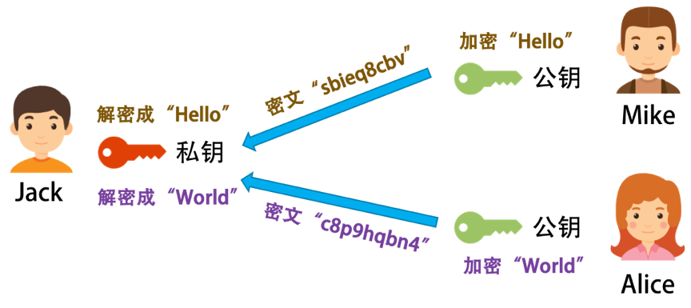

<!DOCTYPE html>
<!-- saved from url=(0046)https://kaiiiz.github.io/hexo-theme-book-demo/ -->
<html xmlns="http://www.w3.org/1999/xhtml">
<head>
    <head>
        <meta http-equiv="Content-Type" content="text/html; charset=UTF-8">
        <meta name="viewport" content="width=device-width, initial-scale=1, maximum-scale=1.0, user-scalable=no">
        <link rel="icon" href="../../static/favicon.png">
        <title>054  区块链技术 - 区块链技术细节 - 加密和挖矿.md</title>
        <!-- Spectre.css framework -->
        <link rel="stylesheet" href="../../static/index.css">
        <!-- theme css & js -->
        <meta name="generator" content="Hexo 4.2.0">
    </head>

<body>

    

        

            <a href="../../index.html">
                
                技术文章摘抄
            </a>
        

        

            <ul class="uncollapsible">
                <li><a href="../../index.html" class="current-tab">首页</a></li>
            </ul>

            <ul class="uncollapsible">
                <li><a href="../index.html">上一级</a></li>
            </ul>

            <ul class="uncollapsible">
                <li>

                    
                    <a href="000&#32;开篇词&#32;&#32;洞悉技术的本质，享受科技的乐趣.md">000 开篇词  洞悉技术的本质，享受科技的乐趣.md</a>

                </li>
                <li>

                    
                    <a href="001&#32;&#32;程序员如何用技术变现（上）.md">001  程序员如何用技术变现（上）.md</a>

                </li>
                <li>

                    
                    <a href="002&#32;&#32;程序员如何用技术变现（下）.md">002  程序员如何用技术变现（下）.md</a>

                </li>
                <li>

                    
                    <a href="003&#32;&#32;Equifax信息泄露始末.md">003  Equifax信息泄露始末.md</a>

                </li>
                <li>

                    
                    <a href="004&#32;&#32;从Equifax信息泄露看数据安全.md">004  从Equifax信息泄露看数据安全.md</a>

                </li>
                <li>

                    
                    <a href="005&#32;&#32;何为技术领导力.md">005  何为技术领导力.md</a>

                </li>
                <li>

                    
                    <a href="006&#32;&#32;如何拥有技术领导力.md">006  如何拥有技术领导力.md</a>

                </li>
                <li>

                    
                    <a href="007&#32;&#32;推荐阅读：每个程序员都该知道的事.md">007  推荐阅读：每个程序员都该知道的事.md</a>

                </li>
                <li>

                    
                    <a href="008&#32;&#32;Go语言，Docker和新技术.md">008  Go语言，Docker和新技术.md</a>

                </li>
                <li>

                    
                    <a href="009&#32;&#32;答疑解惑：渴望、热情和选择.md">009  答疑解惑：渴望、热情和选择.md</a>

                </li>
                <li>

                    
                    <a href="010&#32;&#32;如何成为一个大家愿意追随的Leader？.md">010  如何成为一个大家愿意追随的Leader？.md</a>

                </li>
                <li>

                    
                    <a href="011&#32;&#32;程序中的错误处理：错误返回码和异常捕捉.md">011  程序中的错误处理：错误返回码和异常捕捉.md</a>

                </li>
                <li>

                    
                    <a href="012&#32;&#32;程序中的错误处理：异步编程和最佳实践.md">012  程序中的错误处理：异步编程和最佳实践.md</a>

                </li>
                <li>

                    
                    <a href="013&#32;&#32;魔数&#32;0x5f3759df.md">013  魔数 0x5f3759df.md</a>

                </li>
                <li>

                    
                    <a href="014&#32;&#32;推荐阅读：机器学习101.md">014  推荐阅读：机器学习101.md</a>

                </li>
                <li>

                    
                    <a href="015&#32;&#32;时间管理：同扭曲时间的事儿抗争.md">015  时间管理：同扭曲时间的事儿抗争.md</a>

                </li>
                <li>

                    
                    <a href="016&#32;&#32;时间管理：投资赚取时间.md">016  时间管理：投资赚取时间.md</a>

                </li>
                <li>

                    
                    <a href="017&#32;&#32;故障处理最佳实践：应对故障.md">017  故障处理最佳实践：应对故障.md</a>

                </li>
                <li>

                    
                    <a href="018&#32;&#32;故障处理最佳实践：故障改进.md">018  故障处理最佳实践：故障改进.md</a>

                </li>
                <li>

                    
                    <a href="019&#32;&#32;答疑解惑：我们应该能够识别的表象和本质.md">019  答疑解惑：我们应该能够识别的表象和本质.md</a>

                </li>
                <li>

                    
                    <a href="020&#32;&#32;分布式系统架构的冰与火.md">020  分布式系统架构的冰与火.md</a>

                </li>
                <li>

                    
                    <a href="021&#32;&#32;从亚马逊的实践，谈分布式系统的难点.md">021  从亚马逊的实践，谈分布式系统的难点.md</a>

                </li>
                <li>

                    
                    <a href="022&#32;&#32;分布式系统的技术栈.md">022  分布式系统的技术栈.md</a>

                </li>
                <li>

                    
                    <a href="023&#32;&#32;分布式系统关键技术：全栈监控.md">023  分布式系统关键技术：全栈监控.md</a>

                </li>
                <li>

                    
                    <a href="024&#32;&#32;分布式系统关键技术：服务调度.md">024  分布式系统关键技术：服务调度.md</a>

                </li>
                <li>

                    
                    <a href="025&#32;&#32;分布式系统关键技术：流量与数据调度.md">025  分布式系统关键技术：流量与数据调度.md</a>

                </li>
                <li>

                    
                    <a href="026&#32;&#32;洞悉PaaS平台的本质.md">026  洞悉PaaS平台的本质.md</a>

                </li>
                <li>

                    
                    <a href="027&#32;&#32;推荐阅读：分布式系统架构经典资料.md">027  推荐阅读：分布式系统架构经典资料.md</a>

                </li>
                <li>

                    
                    <a href="028&#32;&#32;编程范式游记（1）-&#32;起源.md">028  编程范式游记（1）- 起源.md</a>

                </li>
                <li>

                    
                    <a href="029&#32;&#32;编程范式游记（2）-&#32;泛型编程.md">029  编程范式游记（2）- 泛型编程.md</a>

                </li>
                <li>

                    
                    <a href="030&#32;&#32;编程范式游记（3）&#32;-&#32;类型系统和泛型的本质.md">030  编程范式游记（3） - 类型系统和泛型的本质.md</a>

                </li>
                <li>

                    
                    <a href="031&#32;&#32;Git协同工作流，你该怎样选.md">031  Git协同工作流，你该怎样选.md</a>

                </li>
                <li>

                    
                    <a href="032&#32;&#32;推荐阅读：分布式数据调度相关论文.md">032  推荐阅读：分布式数据调度相关论文.md</a>

                </li>
                <li>

                    
                    <a href="033&#32;&#32;编程范式游记（4）-&#32;函数式编程.md">033  编程范式游记（4）- 函数式编程.md</a>

                </li>
                <li>

                    
                    <a href="034&#32;&#32;编程范式游记（5）-&#32;修饰器模式.md">034  编程范式游记（5）- 修饰器模式.md</a>

                </li>
                <li>

                    
                    <a href="035&#32;&#32;编程范式游记（6）-&#32;面向对象编程.md">035  编程范式游记（6）- 面向对象编程.md</a>

                </li>
                <li>

                    
                    <a href="036&#32;&#32;编程范式游记（7）-&#32;基于原型的编程范式.md">036  编程范式游记（7）- 基于原型的编程范式.md</a>

                </li>
                <li>

                    
                    <a href="037&#32;&#32;编程范式游记（8）-&#32;Go&#32;语言的委托模式.md">037  编程范式游记（8）- Go 语言的委托模式.md</a>

                </li>
                <li>

                    
                    <a href="038&#32;&#32;编程范式游记（9）-&#32;编程的本质.md">038  编程范式游记（9）- 编程的本质.md</a>

                </li>
                <li>

                    
                    <a href="039&#32;&#32;编程范式游记（10）-&#32;逻辑编程范式.md">039  编程范式游记（10）- 逻辑编程范式.md</a>

                </li>
                <li>

                    
                    <a href="040&#32;&#32;编程范式游记（11）-&#32;程序世界里的编程范式.md">040  编程范式游记（11）- 程序世界里的编程范式.md</a>

                </li>
                <li>

                    
                    <a href="041&#32;&#32;弹力设计篇之“认识故障和弹力设计”.md">041  弹力设计篇之“认识故障和弹力设计”.md</a>

                </li>
                <li>

                    
                    <a href="042&#32;&#32;弹力设计篇之“隔离设计”.md">042  弹力设计篇之“隔离设计”.md</a>

                </li>
                <li>

                    
                    <a href="043&#32;&#32;弹力设计篇之“异步通讯设计”.md">043  弹力设计篇之“异步通讯设计”.md</a>

                </li>
                <li>

                    
                    <a href="044&#32;&#32;弹力设计篇之“幂等性设计”.md">044  弹力设计篇之“幂等性设计”.md</a>

                </li>
                <li>

                    
                    <a href="045&#32;&#32;弹力设计篇之“服务的状态”.md">045  弹力设计篇之“服务的状态”.md</a>

                </li>
                <li>

                    
                    <a href="046&#32;&#32;弹力设计篇之“补偿事务”.md">046  弹力设计篇之“补偿事务”.md</a>

                </li>
                <li>

                    
                    <a href="047&#32;&#32;弹力设计篇之“重试设计”.md">047  弹力设计篇之“重试设计”.md</a>

                </li>
                <li>

                    
                    <a href="048&#32;&#32;弹力设计篇之“熔断设计”.md">048  弹力设计篇之“熔断设计”.md</a>

                </li>
                <li>

                    
                    <a href="049&#32;&#32;弹力设计篇之“限流设计”.md">049  弹力设计篇之“限流设计”.md</a>

                </li>
                <li>

                    
                    <a href="050&#32;&#32;弹力设计篇之“降级设计”.md">050  弹力设计篇之“降级设计”.md</a>

                </li>
                <li>

                    
                    <a href="051&#32;&#32;弹力设计篇之“弹力设计总结”.md">051  弹力设计篇之“弹力设计总结”.md</a>

                </li>
                <li>

                    
                    <a href="052&#32;&#32;区块链技术&#32;-&#32;区块链的革命性及技术概要.md">052  区块链技术 - 区块链的革命性及技术概要.md</a>

                </li>
                <li>

                    
                    <a href="053&#32;&#32;区块链技术&#32;-&#32;区块链技术细节&#32;-&#32;哈希算法.md">053  区块链技术 - 区块链技术细节 - 哈希算法.md</a>

                </li>
                <li>

                    <a class="current-tab" href="054&#32;&#32;区块链技术&#32;-&#32;区块链技术细节&#32;-&#32;加密和挖矿.md">054  区块链技术 - 区块链技术细节 - 加密和挖矿.md</a>
                    

                </li>
                <li>

                    
                    <a href="055&#32;&#32;区块链技术&#32;-&#32;去中心化的共识机制.md">055  区块链技术 - 去中心化的共识机制.md</a>

                </li>
                <li>

                    
                    <a href="056&#32;&#32;区块链技术&#32;-&#32;智能合约.md">056  区块链技术 - 智能合约.md</a>

                </li>
                <li>

                    
                    <a href="057&#32;&#32;区块链技术&#32;-&#32;传统金融和虚拟货币.md">057  区块链技术 - 传统金融和虚拟货币.md</a>

                </li>
                <li>

                    
                    <a href="058&#32;&#32;管理设计篇之分布式锁.md">058  管理设计篇之分布式锁.md</a>

                </li>
                <li>

                    
                    <a href="059&#32;&#32;管理设计篇之配置中心.md">059  管理设计篇之配置中心.md</a>

                </li>
                <li>

                    
                    <a href="060&#32;&#32;管理设计篇之边车模式.md">060  管理设计篇之边车模式.md</a>

                </li>
                <li>

                    
                    <a href="061&#32;&#32;管理设计篇之服务网格.md">061  管理设计篇之服务网格.md</a>

                </li>
                <li>

                    
                    <a href="062&#32;&#32;管理设计篇之网关模式.md">062  管理设计篇之网关模式.md</a>

                </li>
                <li>

                    
                    <a href="063&#32;&#32;管理设计篇之部署升级策略.md">063  管理设计篇之部署升级策略.md</a>

                </li>
                <li>

                    
                    <a href="064&#32;&#32;性能设计篇之缓存.md">064  性能设计篇之缓存.md</a>

                </li>
                <li>

                    
                    <a href="065&#32;&#32;性能设计篇之异步处理.md">065  性能设计篇之异步处理.md</a>

                </li>
                <li>

                    
                    <a href="066&#32;&#32;性能设计篇之数据库扩展.md">066  性能设计篇之数据库扩展.md</a>

                </li>
                <li>

                    
                    <a href="067&#32;&#32;性能设计篇之秒杀.md">067  性能设计篇之秒杀.md</a>

                </li>
                <li>

                    
                    <a href="068&#32;&#32;性能设计篇之边缘计算.md">068  性能设计篇之边缘计算.md</a>

                </li>
                <li>

                    
                    <a href="069&#32;&#32;程序员练级攻略（2018）：开篇词.md">069  程序员练级攻略（2018）：开篇词.md</a>

                </li>
                <li>

                    
                    <a href="070&#32;&#32;程序员练级攻略（2018）：零基础启蒙.md">070  程序员练级攻略（2018）：零基础启蒙.md</a>

                </li>
                <li>

                    
                    <a href="071&#32;&#32;程序员练级攻略（2018）：正式入门.md">071  程序员练级攻略（2018）：正式入门.md</a>

                </li>
                <li>

                    
                    <a href="072&#32;&#32;程序员练级攻略（2018）：程序员修养.md">072  程序员练级攻略（2018）：程序员修养.md</a>

                </li>
                <li>

                    
                    <a href="073&#32;&#32;程序员练级攻略（2018）：编程语言.md">073  程序员练级攻略（2018）：编程语言.md</a>

                </li>
                <li>

                    
                    <a href="074&#32;&#32;程序员练级攻略：理论学科.md">074  程序员练级攻略：理论学科.md</a>

                </li>
                <li>

                    
                    <a href="075&#32;&#32;程序员练级攻略（2018）：系统知识.md">075  程序员练级攻略（2018）：系统知识.md</a>

                </li>
                <li>

                    
                    <a href="076&#32;&#32;程序员练级攻略（2018）：软件设计.md">076  程序员练级攻略（2018）：软件设计.md</a>

                </li>
                <li>

                    
                    <a href="077&#32;&#32;程序员练级攻略（2018）：Linux系统、内存和网络.md">077  程序员练级攻略（2018）：Linux系统、内存和网络.md</a>

                </li>
                <li>

                    
                    <a href="078&#32;&#32;程序员练级攻略（2018）：异步IO模型和Lock-Free编程.md">078  程序员练级攻略（2018）：异步IO模型和Lock-Free编程.md</a>

                </li>
                <li>

                    
                    <a href="079&#32;&#32;程序员练级攻略（2018）：Java底层知识.md">079  程序员练级攻略（2018）：Java底层知识.md</a>

                </li>
                <li>

                    
                    <a href="080&#32;&#32;程序员练级攻略（2018）：数据库.md">080  程序员练级攻略（2018）：数据库.md</a>

                </li>
                <li>

                    
                    <a href="081&#32;&#32;程序员练级攻略（2018）：分布式架构入门.md">081  程序员练级攻略（2018）：分布式架构入门.md</a>

                </li>
                <li>

                    
                    <a href="082&#32;&#32;程序员练级攻略（2018）：分布式架构经典图书和论文.md">082  程序员练级攻略（2018）：分布式架构经典图书和论文.md</a>

                </li>
                <li>

                    
                    <a href="083&#32;&#32;程序员练级攻略（2018）：分布式架构工程设计.md">083  程序员练级攻略（2018）：分布式架构工程设计.md</a>

                </li>
                <li>

                    
                    <a href="084&#32;&#32;程序员练级攻略（2018）：微服务.md">084  程序员练级攻略（2018）：微服务.md</a>

                </li>
                <li>

                    
                    <a href="085&#32;&#32;程序员练级攻略（2018）：容器化和自动化运维.md">085  程序员练级攻略（2018）：容器化和自动化运维.md</a>

                </li>
                <li>

                    
                    <a href="086&#32;&#32;程序员练级攻略（2018）：机器学习和人工智能.md">086  程序员练级攻略（2018）：机器学习和人工智能.md</a>

                </li>
                <li>

                    
                    <a href="087&#32;&#32;程序员练级攻略（2018）：前端基础和底层原理.md">087  程序员练级攻略（2018）：前端基础和底层原理.md</a>

                </li>
                <li>

                    
                    <a href="088&#32;&#32;程序员练级攻略（2018）：前端性能优化和框架.md">088  程序员练级攻略（2018）：前端性能优化和框架.md</a>

                </li>
                <li>

                    
                    <a href="089&#32;&#32;程序员练级攻略（2018）：UIUX设计.md">089  程序员练级攻略（2018）：UIUX设计.md</a>

                </li>
                <li>

                    
                    <a href="090&#32;&#32;程序员练级攻略（2018）：技术资源集散地.md">090  程序员练级攻略（2018）：技术资源集散地.md</a>

                </li>
                <li>

                    
                    <a href="091&#32;&#32;程序员面试攻略：面试前的准备.md">091  程序员面试攻略：面试前的准备.md</a>

                </li>
                <li>

                    
                    <a href="092&#32;&#32;程序员面试攻略：面试中的技巧.md">092  程序员面试攻略：面试中的技巧.md</a>

                </li>
                <li>

                    
                    <a href="093&#32;&#32;程序员面试攻略：面试风格.md">093  程序员面试攻略：面试风格.md</a>

                </li>
                <li>

                    
                    <a href="094&#32;&#32;程序员面试攻略：实力才是王中王.md">094  程序员面试攻略：实力才是王中王.md</a>

                </li>
                <li>

                    
                    <a href="095&#32;&#32;高效学习：端正学习态度.md">095  高效学习：端正学习态度.md</a>

                </li>
                <li>

                    
                    <a href="096&#32;&#32;高效学习：源头、原理和知识地图.md">096  高效学习：源头、原理和知识地图.md</a>

                </li>
                <li>

                    
                    <a href="097&#32;&#32;高效学习：深度，归纳和坚持实践.md">097  高效学习：深度，归纳和坚持实践.md</a>

                </li>
                <li>

                    
                    <a href="098&#32;&#32;高效学习：如何学习和阅读代码.md">098  高效学习：如何学习和阅读代码.md</a>

                </li>
                <li>

                    
                    <a href="099&#32;&#32;高效学习：面对枯燥和量大的知识.md">099  高效学习：面对枯燥和量大的知识.md</a>

                </li>
                <li>

                    
                    <a href="100&#32;&#32;高效沟通：Talk和Code同等重要.md">100  高效沟通：Talk和Code同等重要.md</a>

                </li>
                <li>

                    
                    <a href="101&#32;&#32;高效沟通：沟通阻碍和应对方法.md">101  高效沟通：沟通阻碍和应对方法.md</a>

                </li>
                <li>

                    
                    <a href="102&#32;&#32;高效沟通：沟通方式及技巧.md">102  高效沟通：沟通方式及技巧.md</a>

                </li>
                <li>

                    
                    <a href="103&#32;&#32;高效沟通：沟通技术.md">103  高效沟通：沟通技术.md</a>

                </li>
                <li>

                    
                    <a href="104&#32;&#32;高效沟通：好老板要善于提问.md">104  高效沟通：好老板要善于提问.md</a>

                </li>
                <li>

                    
                    <a href="105&#32;&#32;高效沟通：好好说话的艺术.md">105  高效沟通：好好说话的艺术.md</a>

                </li>
                <li>

                    
                    <a href="106&#32;加餐&#32;&#32;谈谈我的“三观”.md">106 加餐  谈谈我的“三观”.md</a>

                </li>
                <li>

                    
                    <a href="107&#32;结束语&#32;&#32;业精于勤，行成于思.md">107 结束语  业精于勤，行成于思.md</a>

                </li>
            </ul>

        

    

    

        

    

    

    

        

            

                

                    <!-- For Responsive Layout -->
                    <header class="navbar">
                        <section class="navbar-section">
                            <a onclick="open_sidebar()">
                                <i class="icon icon-menu"></i>
                            </a>
                        </section>
                    </header>
                

                

                    

                        

                        
<h1>054  区块链技术 - 区块链技术细节 - 加密和挖矿</h1>

前面一篇文章中讲的技术解决了交易信息不能被篡改的问题。但还有一个比较重要的问题，那就是，我们每个人只能发起和自己有关的交易，也就是能发起自己对别人付钱的交易，我们不能发起别人对我付钱，或是别人向别人付钱的交易。

那么，在比特币中是怎么解决这个问题的？让我们先看一些基础的加密技术。

<h1>比特币的加密方法</h1>
<h2>密钥对 / 签名 / 证书</h2>

所谓密钥对，也就是一种非对称加密技术。这种技术，在对信息进行加密和解密时，使用两个不同的密钥。这样一来，我们就可以把其中一个密钥公布出去，称之为公钥，另一个密钥私密地保管好，称之为私钥。

现实社会中，有人使用公钥加密，私钥解密，也有反过来用私钥加密，公钥解密，这得看具体的场景。（比特币使用了非对称加密的技术，其使用了<a href="https://en.wikipedia.org/wiki/Elliptic_Curve_Digital_Signature_Algorithm">ECDSA</a> 密钥对比技术。）

比如，我把我加密的密钥发布给所有人，然后大家都用这个公钥加密信息，但其他人没有私钥，所以他们解不了密文，只有我能解密文，也只有我能看得懂别人用我的公钥加密后发给我的密文。如下图所示。

但是，这会有个问题，那就是每个人都有我的公钥，别人可以截获 Mike 发给我的信息，然后自己用我的公钥加密一个别的信息，伪装成 Mike 发给我， 这样我就被黑了。于是，我们需要对 Mike 的身份进行验证，此时就需要用到 &quot; 数字签名 &quot; 的概念了。

Mike 也有一对密钥对，一个公钥给了我，私钥自己保留。

<ul>
<li>Mike 发自己想要的信息，做个 SHA 或 MD5 的 hash，得到一个 hash 串，又叫 Digest。</li>
<li>Mike 用自己的私钥，把 Digest 加密，得到一段 Digest 的密文。我们把这个事叫数字签名，Signature。</li>
<li>然后，Mike 把他想发给我的信息用我的公钥加密后，连同他的数字签名一同发给我。</li>
<li>我用我的私钥解密 Mike 发给我的密文，然后用 Mike 的公钥解密其数字签名得到 Digest。然后，我用 SHA 或 MD5 对解开的密文做 Hash。如果结果和 Digest 一致，就说明，这个信息是 Mike 发给我的，没有人更改过。</li>
</ul>

这个过程如下图所示。

但是问题还没完。假设有个黑客偷偷地把 Jack 电脑上的 Mike 的公钥给换了，换成自己的，然后截获 Mike 发出来的信息，用自己的密钥加密一段自己的信息，以及自己的数字签名。

于是，对于 Jack 来看，因为他用了黑客的公钥，而不是 Mike 的，那么对他来说，他就以为信息来自 Mike，于是黑客可以用自己的私钥伪装成 Mike 给 Jack 通信。反之亦然，于是黑客就可以在中间伪装成 Jack 或 Mike 来通信，这就是中间人攻击。如下图所示。

这个时候就比较麻烦了。Mike 看到有人在伪造他的公钥，想了想，他只能和 Jack 找了个大家都相信的永不作恶的权威的可信机构来认证他的公钥。这个权威机构，用自己的私钥把 Mike 的公钥和其相关信息一起加密，生成一个证书。

此时，Jack 就可以放心地使用这个权威机构的证书了。Mike 只需要在发布其信息的时候放上这个权威机构发的数字证书，然后 Jack 用这个权威机构的公钥解密这个证书，得到 Mike 的公钥，再用 Mike 的公钥来验证 Mike 的数字签名。

上面就是整个密钥对、签名和证书的全部基础细节。比特币也用了这样的基础技术来认证用户的身份的。下面，我们来看看比特币的一些细节。

<h2>比特币的加密</h2>

在比特币的世界里，每一笔交易的 From 和 To 都是每个用户的公钥（Public Key）。也就是说，使用用户的公钥来做交易的账户。于是，这个过程很简单。

<ul>
<li>交易的发起方只能是支付方，支付方需要用自己的私钥来加密交易信息并制作相关的交易签名。</li>
<li>网络上其他人会用你的公钥（也就是交易的支出方）来做解密来验证。</li>
</ul>

为什么不需要那个证书机构呢？不怕中间人攻击吗？这是因为，如果黑客想要伪造一笔别人的交易，那么他需要换掉半数以上结点上的被攻击者的公钥，这不太现实。与其这样做，还不如去偷被攻击者的私钥，可能还简单一些。

下面是一个交易链的图示。这个交易链的钱从 A -&gt; B -&gt; C -&gt; D，一共 3 笔交易。

图片来源：<a href="http://www.righto.com/2014/02/bitcoins-hard-way-using-raw-bitcoin.html">Ken Shirriff Blog</a>

<ul>
<li><strong>发起交易</strong>。我们从第一笔交易可以看到，A 用自己的私钥为交易信息和自己的地址生成了交易的签名，然后把交易信息、自己的地址、交易签名和自己的公钥放出去，这样方便别人来验证的确是 A 发起的。</li>
<li><strong>验证交易</strong>。在验证时，使用 A 的公钥解密交易签名，得到交易的 hash 值。把交易信息和自己的地址做 hash，看看是不是和签名解密后的 hash 值一致。</li>
</ul>

这里需要注意一个细节，比特币的地址是由我们的公钥生成的，生成规则比较复杂，可以参看 Bitcoin 的 Wiki 页 - <a href="https://en.bitcoin.it/wiki/Technical_background_of_version_1_Bitcoin_addresses">Technical background of version 1 Bitcoin addresses</a>。

<h1>比特币的挖矿</h1>

前面说到，在比特币的区块 hash 算法中，要确保下面这个公式成立：

<pre><code>SHA-256(SHA-256 (Block Header)) &lt; Target

</code></pre>

而在区块头中，可以完全自由修改的只有一个字段，就是 Nonce，其他的 Timestamp 可以在特定范围内修改，Merkle Root 和你需要记录的交易信息有关系（所有的矿工可以自由地从待确认交易列表中挑选自己想要的交易打包）。

所以，基本上来说，你要找到某个数字，让整个 hash 值小于 Target。这个 Target 是一个数，<strong>其决定了，我们计算出来的 hash 值的字符串最前面有几个零</strong>。我们知道，hash 值本身就是一串相对比较随机的字符串。但是要让这个随机的字符串有规律，是一件很困难的事，除了使用暴力破解，没有其他办法。在计算机世界里，我们把这个事叫 &quot; 哈希碰撞 &quot;(hash collision)，碰撞前几个位都是 0 的哈希值。

下面是一个示例。我想找到一个数，其和 &quot;ChenHao&quot; 加起来被 hash 后的值前面有 5 个零。

测试程序如下：

<pre><code>import hashlib
 
data=&quot;ChenHao&quot;
 
n=1
while n &lt; 2**32:
    str = data + `n`
    hash = hashlib.sha256(str).hexdigest()
    hash = hashlib.sha256(hash).hexdigest()
    if hash.startswith('00000'):
        print  str, hash
        break
    n = n + 1
</code></pre>

这是一个暴力破解的算法。这个程序在我的 MacBook Pro 上基本要 10 秒钟才跑得出来结果。

找到 1192481 时，找到了第一个解，如下所示：

<pre><code>ChenHao1192481   
00000669e0eeb33ee5dbb672d3bd2deb0c32ef9879ef260f0debbdcb80121160
</code></pre>

那么，控制前面有多个 0 的那个 Target 又是怎么来的呢？是由 Bits 这个字段控制的，也就是难度系数，前面需要的 0 越多，难度也就越大。其中的算法你可以看一下 Bitcoin 的 Wiki 上的<a href="https://en.bitcoin.it/wiki/Difficulty">Difficulty 词条</a>，这里我就不多说了。

<strong>这个难度系数，会在每出 2016 个区块后就调整一次。现在，这个难度是要在前面找到有 18 个零。如下所示 (一个真实的区块链的 Hash 值)</strong>：

<a href="https://blockchain.info/block/000000000000000000424118cc80622cb26c07b69fbe2bdafe57fea7d5f59d68">000000000000000000424118cc80622cb26c07b69fbe2bdafe57fea7d5f59d68</a>

<strong>一个 SHA-256 算法算出来的哈希值有 $2^{256}$ 种可能性，而前面有 18 个零意味着前面有 72 个 bits 是零。于是，满足条件的哈希值是有 $2^{184}$ 种可能性，概率是 $\frac{1}{2^{72}}$</strong> 。

是的，很有可能你穷举完 Nonce 后还找不到，那就只能调整 Timestamp 和 Merkle Root（调整不同的记账交易）了。

所以，一般的挖矿流程如下。

<ul>
<li>从网络上取得之前的区块信息。</li>
<li>从 &quot; 待记账区 &quot; 中获取一组交易数据（有优先级，比如成长时间、矿工小费等）。</li>
<li>形成区块头（计算 Merkle Root 并设计记账时间 Timestamp 等）。</li>
<li>开始穷举 Nonce，来计算区块头的 hash 值。如果前面有 18 个零（小于 Target），那么记账成功。如果没有，则从第一步重新开始。</li>
<li>一旦某矿工成功打包一个区块，他就会告诉其他矿工。收到消息的矿工会停下手上的工作，开始验证，验证通过后，广播给其他矿工。</li>
</ul>

所以，满足条件的这个难度系数成为了挖矿的关键。设置这个难度系数就是为了让全网产生的区域名平均在 10 分钟一块。而根据比特币无中心服务器的架构，也就是其挖矿的机器数量是想来就来想走就走的，计算力可能会不一样。因此，为了保证每 10 分钟产生一个区块，当算力不足的时候，难度下降，当算力充足的时候，难度提高。

今天的这 18 个零，基本上来说，一般的电脑和服务器就不用想了，必须要算力非常非常高的机器才能搞定。所以，在今天，挖矿这个事，已经不是一般老百姓能玩的了。

下图展示了整个比特币的难度历史。

（图片来源：<a href="http://bitcoin.sipa.be/">http://bitcoin.sipa.be</a> ）

上面这个图只是算力的表现，可能并不直观。我们还是用其耗电量来说可能会更好一些。根据 &quot;Bitcoin Energy Consumption Index&quot; 统计，截至 2017 年 11 月 20 日，比特币过去一年挖矿的电力总消耗已累计达 29.51 TWh（1TWh = $10^{12}$ Wh），约占全球总电力消耗的 0.13%。该数字甚至已经超过近 160 个国家或地区一年的电力消耗，包含冰岛和尼日利亚。若全球的比特币矿工自成一国，该国的电力消耗排名可排到全球第 61 名。

看到这里，你一定要问，为什么要挖矿呢，不就是记个账呗。为了系统地说明这个问题，我们下面来看看去中心化的共识机制。

                    

                    

                        

                            <a href="053&#32;&#32;区块链技术&#32;-&#32;区块链技术细节&#32;-&#32;哈希算法.md">上一页</a>
                        

                        

                            <a href="055&#32;&#32;区块链技术&#32;-&#32;去中心化的共识机制.md">下一页</a>
                        

                    

                

            

        

    

    

</body>
<!-- Global site tag (gtag.js) - Google Analytics -->

</html>
