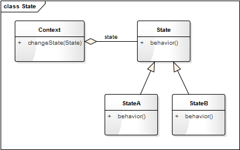

<!DOCTYPE html>
<!-- saved from url=(0046)https://kaiiiz.github.io/hexo-theme-book-demo/ -->
<html xmlns="http://www.w3.org/1999/xhtml">
<head>
    <head>
        <meta http-equiv="Content-Type" content="text/html; charset=UTF-8">
        <meta name="viewport" content="width=device-width, initial-scale=1, maximum-scale=1.0, user-scalable=no">
        <link rel="icon" href="../../static/favicon.png">
        <title>25 谈谈我对设计模式的理解.md</title>
        <!-- Spectre.css framework -->
        <link rel="stylesheet" href="../../static/index.css">
        <!-- theme css & js -->
        <meta name="generator" content="Hexo 4.2.0">
    </head>

<body>

    

        

            <a href="../../index.html">
                
                技术文章摘抄
            </a>
        

        

            <ul class="uncollapsible">
                <li><a href="../../index.html" class="current-tab">首页</a></li>
            </ul>

            <ul class="uncollapsible">
                <li><a href="../index.html">上一级</a></li>
            </ul>

            <ul class="uncollapsible">
                <li>

                    
                    <a href="00&#32;生活中的设计模式：启程之前，请不要错过我.md">00 生活中的设计模式：启程之前，请不要错过我.md</a>

                </li>
                <li>

                    
                    <a href="01&#32;监听模式：坑爹的热水器.md">01 监听模式：坑爹的热水器.md</a>

                </li>
                <li>

                    
                    <a href="02&#32;适配模式：身高不够鞋来凑.md">02 适配模式：身高不够鞋来凑.md</a>

                </li>
                <li>

                    
                    <a href="03&#32;状态模式：人与水的三态.md">03 状态模式：人与水的三态.md</a>

                </li>
                <li>

                    
                    <a href="04&#32;单例模式：你是我生命的唯一.md">04 单例模式：你是我生命的唯一.md</a>

                </li>
                <li>

                    
                    <a href="05&#32;职责模式：我的假条去哪了.md">05 职责模式：我的假条去哪了.md</a>

                </li>
                <li>

                    
                    <a href="06&#32;中介模式：找房子问中介.md">06 中介模式：找房子问中介.md</a>

                </li>
                <li>

                    
                    <a href="07&#32;代理模式：帮我拿一下快递.md">07 代理模式：帮我拿一下快递.md</a>

                </li>
                <li>

                    
                    <a href="08&#32;装饰模式：你想怎么穿就怎么穿.md">08 装饰模式：你想怎么穿就怎么穿.md</a>

                </li>
                <li>

                    
                    <a href="09&#32;工厂模式：你要拿铁还是摩卡.md">09 工厂模式：你要拿铁还是摩卡.md</a>

                </li>
                <li>

                    
                    <a href="10&#32;迭代模式：下一个就是你了.md">10 迭代模式：下一个就是你了.md</a>

                </li>
                <li>

                    
                    <a href="11&#32;组合模式：自己组装电脑.md">11 组合模式：自己组装电脑.md</a>

                </li>
                <li>

                    
                    <a href="12&#32;构建模式：想要车还是庄园.md">12 构建模式：想要车还是庄园.md</a>

                </li>
                <li>

                    
                    <a href="13&#32;克隆模式：给你一个分身术.md">13 克隆模式：给你一个分身术.md</a>

                </li>
                <li>

                    
                    <a href="14&#32;策略模式：怎么来不重要，人到就行.md">14 策略模式：怎么来不重要，人到就行.md</a>

                </li>
                <li>

                    
                    <a href="15&#32;命令模式：大闸蟹，走起！.md">15 命令模式：大闸蟹，走起！.md</a>

                </li>
                <li>

                    
                    <a href="16&#32;备忘模式：好记性不如烂笔头.md">16 备忘模式：好记性不如烂笔头.md</a>

                </li>
                <li>

                    
                    <a href="17&#32;享元模式：颜料很贵必须充分利用.md">17 享元模式：颜料很贵必须充分利用.md</a>

                </li>
                <li>

                    
                    <a href="18&#32;外观模式：学妹别慌，学长帮你.md">18 外观模式：学妹别慌，学长帮你.md</a>

                </li>
                <li>

                    
                    <a href="19&#32;访问模式：一千个读者一千个哈姆雷特.md">19 访问模式：一千个读者一千个哈姆雷特.md</a>

                </li>
                <li>

                    
                    <a href="20&#32;生活中的设计模式：与经典设计模式的不解渊源.md">20 生活中的设计模式：与经典设计模式的不解渊源.md</a>

                </li>
                <li>

                    
                    <a href="21&#32;生活中的设计模式：那些未完待续的设计模式.md">21 生活中的设计模式：那些未完待续的设计模式.md</a>

                </li>
                <li>

                    
                    <a href="22&#32;深入解读过滤器模式：制作一杯鲜纯细腻的豆浆.md">22 深入解读过滤器模式：制作一杯鲜纯细腻的豆浆.md</a>

                </li>
                <li>

                    
                    <a href="23&#32;深入解读对象池技术：共享让生活更便捷.md">23 深入解读对象池技术：共享让生活更便捷.md</a>

                </li>
                <li>

                    
                    <a href="24&#32;深入解读回调机制：把你技能亮出来.md">24 深入解读回调机制：把你技能亮出来.md</a>

                </li>
                <li>

                    <a class="current-tab" href="25&#32;谈谈我对设计模式的理解.md">25 谈谈我对设计模式的理解.md</a>
                    

                </li>
                <li>

                    
                    <a href="26&#32;谈谈我对设计原则的思考.md">26 谈谈我对设计原则的思考.md</a>

                </li>
                <li>

                    
                    <a href="27&#32;谈谈我对项目重构的看法.md">27 谈谈我对项目重构的看法.md</a>

                </li>
            </ul>

        

    

    

        

    

    

    

        

            

                

                    <!-- For Responsive Layout -->
                    <header class="navbar">
                        <section class="navbar-section">
                            <a onclick="open_sidebar()">
                                <i class="icon icon-menu"></i>
                            </a>
                        </section>
                    </header>
                

                

                    

                        

                        
<h1>25 谈谈我对设计模式的理解</h1>
<h3>众多书籍之下为何还要写这一课程</h3>

设计模式可谓是老生常谈的不能再老生常谈了，我曾经思考过很长一段时间要不要去写这系列的文章，因为这一主题的书籍实在太多了，网上免费的资料也非常的多。思考再三，最终决定写它，主要有以下几个原因：

<ul>
<li>网上的资料虽然非常多，但就如同你所知：网上资料一大抄！内容极其雷同而且粗浅。</li>
<li>讲设计模式的书籍虽然非常多，但用 Python 来描述的非常的少，有那么几本也是从国外翻译过来的，内容多少会有些变味。</li>
<li>能把抽象难懂的设计模式讲的通俗易懂、妙趣横生的很少。</li>
</ul>
<h3>设计模式玄吗</h3>

我觉得它玄，也不玄！

怎么讲呢？《孙子兵法》玄不玄？也玄！因为芸芸众生中能看懂悟透的人很少，能真正灵活应用的人更少！而且战争的成败受众多因素的影响，如天时、地利、人和。但你要问中国历代名将中有哪个不读《孙子兵法》的？几乎没有，如三国的曹操、南宋的岳飞、明代的戚继光，这些人可谓是把兵法用的出神入化了。那两千多年来世界其他国家没看过《孙子兵法》的是怎么打仗的？照样打。没学过兵法的人就不会使用里面的计策吗？当然会用，而且经常用。比如“借刀杀人”，相信这个人们在耍小聪明的时候都用过；“打草惊蛇”这个计策估计连小孩都会用，这样的例子还有很多。只是你不知道古代已经有人把它总结成“战争模式”了。所以说《孙子兵法》其实也不玄。

同样的道理，“设计模式”是一套被反复使用、多数人知晓的、无数工程师实践的代码设计经验的总结。因此它比较抽象，没有一定的编程经验很难读懂，更不能理解其精髓。所以很多人觉得它玄，但真正的架构师和优秀的程序员，几乎没有不看设计模式的。能把设计模式应用的如火纯青的，那就是大神。同样的问题：没有学过设计模式就不会使用设计模式了吗？当然不是！只要你有两年以上的编程经验，像模板模式、单例模式、适配器（Wrapper）模式，这些你肯定用过（那怕你没有看一本设计模式的书），只是你不知道有前人已经总结成书了，所以说设计模式其实也不玄！

网上看到一句话，我还是很赞同这种说法的：

<blockquote>

对于 10w 行以下的代码量的汉子来说，设计模式 = 玄学。

对于 10w ~ 50w 行代码量的汉子来说，设计模式 = 科学。

对于 50w 行以上代码量的汉子来说，设计模式 = 文学。

</blockquote>
<h3>如何区分不同的模式</h3>

设计模式是对面向对象思想的常见使用场景的模型总结和归纳。<strong>设计模式之间的区分，要更多地从我们含义和应用场景去区别，而不应该从他们的类图结构来区分。</strong>

看策略模式、状态模式、桥接模式这三种模式的类图几乎是完全一样的（如下图）。从面向的对象的继承、多态、封装的角度来分析，他们是完全一样的。

但他们的实际应用场景却不同、侧重点不同。策略侧重的算法的变更导致执行结果的差异，状态侧重的是对象本身状态的改变而导致行为的变化，而桥接强调的是实现与抽象的分离。

<h3>编程思想的三重境界</h3>

所以有人说：<strong>设计模式这东西很虚！</strong> 要我说，<strong>它确实也虚！</strong> 如果它看得见摸得着，那我就没必要讲了。我说过，设计模式是一套被反复使用、多数人知晓的、无数工程师实践的代码设计经验的总结，它是面向对象思想的高度提炼和模板化。既然是思想，能不虚吗？它就想道家里面的“道”的理念，每个人对道的理解是不样的，对道的认知也有不同的境界，而不同的境界对应着不同的修为。

宋代禅宗大师青原行思提出参禅的三重境界：

<blockquote>

参禅之初，看山是山，看水是水；

禅有悟时，看山不是山，看水不是水；

禅中彻悟，看山仍是山，看水仍是水。

</blockquote>

上面讲述的是对禅道的认识的三重不同境界，设计模式既然是一种编程思想，那也会有不同的境界，我这里也概括它为三重境界：

<ul>
<li>**一重境界：**依葫芦画瓢。这属于初学阶段，以为设计模式只有书中提到的那几种模式，模式名称也能倒背如流。但真正要用时，还得去翻书，依关类图照般照改。</li>
<li>**二重境界：**灵活运用。这属于中级阶段，对每一种设计模式都非常熟悉，有较深入的思考，而且能够根据实际的业务场景选择合适的模式，并对相应的模式进行恰当的修改以符合实际需求。</li>
<li><strong>三重境界：<strong>心中无模式。这算终于阶段，这里说无模式并非他不用设计模式，而是设计模式的理念已经融入他的灵魂和血液，他已经不在乎哪种具体的通用模式了，每一处代码都遵循了设计的原则，能灵活地创造和使用新的模式（可能这种模式他自己也不知道该叫什么名）。这就是所谓的</strong>心中无模式却处处是模式</strong>。</li>
</ul>

                    

                    

                        

                            <a href="24&#32;深入解读回调机制：把你技能亮出来.md">上一页</a>
                        

                        

                            <a href="26&#32;谈谈我对设计原则的思考.md">下一页</a>
                        

                    

                

            

        

    

    

</body>
<!-- Global site tag (gtag.js) - Google Analytics -->

</html>
