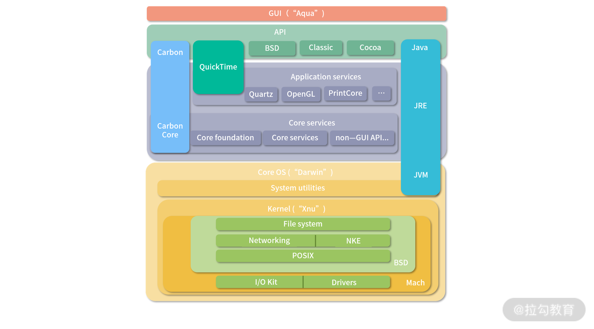

<!DOCTYPE html>
<!-- saved from url=(0046)https://kaiiiz.github.io/hexo-theme-book-demo/ -->
<html xmlns="http://www.w3.org/1999/xhtml">
<head>
    <head>
        <meta http-equiv="Content-Type" content="text/html; charset=UTF-8">
        <meta name="viewport" content="width=device-width, initial-scale=1, maximum-scale=1.0, user-scalable=no">
        <link rel="icon" href="../../static/favicon.png">
        <title>16 (1)加餐  练习题详解（三）.md</title>
        <!-- Spectre.css framework -->
        <link rel="stylesheet" href="../../static/index.css">
        <!-- theme css & js -->
        <meta name="generator" content="Hexo 4.2.0">
    </head>

<body>

    

        

            <a href="../../index.html">
                
                技术文章摘抄
            </a>
        

        

            <ul class="uncollapsible">
                <li><a href="../../index.html" class="current-tab">首页</a></li>
            </ul>

            <ul class="uncollapsible">
                <li><a href="../index.html">上一级</a></li>
            </ul>

            <ul class="uncollapsible">
                <li>

                    
                    <a href="00&#32;开篇词&#32;&#32;为什么大厂面试必考操作系统？.md">00 开篇词  为什么大厂面试必考操作系统？.md</a>

                </li>
                <li>

                    
                    <a href="00&#32;课前必读&#32;&#32;构建知识体系，可以这样做！.md">00 课前必读  构建知识体系，可以这样做！.md</a>

                </li>
                <li>

                    
                    <a href="01&#32;&#32;计算机是什么：“如何把程序写好”这个问题是可计算的吗？.md">01  计算机是什么：“如何把程序写好”这个问题是可计算的吗？.md</a>

                </li>
                <li>

                    
                    <a href="02&#32;&#32;程序的执行：相比&#32;32&#32;位，64&#32;位的优势是什么？（上）.md">02  程序的执行：相比 32 位，64 位的优势是什么？（上）.md</a>

                </li>
                <li>

                    
                    <a href="03&#32;&#32;程序的执行：相比&#32;32&#32;位，64&#32;位的优势是什么？（下）.md">03  程序的执行：相比 32 位，64 位的优势是什么？（下）.md</a>

                </li>
                <li>

                    
                    <a href="04&#32;&#32;构造复杂的程序：将一个递归函数转成非递归函数的通用方法.md">04  构造复杂的程序：将一个递归函数转成非递归函数的通用方法.md</a>

                </li>
                <li>

                    
                    <a href="05&#32;&#32;存储器分级：L1&#32;Cache&#32;比内存和&#32;SSD&#32;快多少倍？.md">05  存储器分级：L1 Cache 比内存和 SSD 快多少倍？.md</a>

                </li>
                <li>

                    
                    <a href="05&#32;(1)&#32;加餐&#32;&#32;练习题详解（一）.md">05 (1) 加餐  练习题详解（一）.md</a>

                </li>
                <li>

                    
                    <a href="06&#32;&#32;目录结构和文件管理指令：rm&#32;&#32;-rf&#32;指令的作用是？.md">06  目录结构和文件管理指令：rm  -rf 指令的作用是？.md</a>

                </li>
                <li>

                    
                    <a href="07&#32;&#32;进程、重定向和管道指令：xargs&#32;指令的作用是？.md">07  进程、重定向和管道指令：xargs 指令的作用是？.md</a>

                </li>
                <li>

                    
                    <a href="08&#32;&#32;用户和权限管理指令：&#32;请简述&#32;Linux&#32;权限划分的原则？.md">08  用户和权限管理指令： 请简述 Linux 权限划分的原则？.md</a>

                </li>
                <li>

                    
                    <a href="09&#32;&#32;Linux&#32;中的网络指令：如何查看一个域名有哪些&#32;NS&#32;记录？.md">09  Linux 中的网络指令：如何查看一个域名有哪些 NS 记录？.md</a>

                </li>
                <li>

                    
                    <a href="10&#32;&#32;软件的安装：&#32;编译安装和包管理器安装有什么优势和劣势？.md">10  软件的安装： 编译安装和包管理器安装有什么优势和劣势？.md</a>

                </li>
                <li>

                    
                    <a href="11&#32;&#32;高级技巧之日志分析：利用&#32;Linux&#32;指令分析&#32;Web&#32;日志.md">11  高级技巧之日志分析：利用 Linux 指令分析 Web 日志.md</a>

                </li>
                <li>

                    
                    <a href="12&#32;&#32;高级技巧之集群部署：利用&#32;Linux&#32;指令同时在多台机器部署程序.md">12  高级技巧之集群部署：利用 Linux 指令同时在多台机器部署程序.md</a>

                </li>
                <li>

                    
                    <a href="12&#32;(1)加餐&#32;&#32;练习题详解（二）.md">12 (1)加餐  练习题详解（二）.md</a>

                </li>
                <li>

                    
                    <a href="13&#32;&#32;操作系统内核：Linux&#32;内核和&#32;Windows&#32;内核有什么区别？.md">13  操作系统内核：Linux 内核和 Windows 内核有什么区别？.md</a>

                </li>
                <li>

                    
                    <a href="14&#32;&#32;用户态和内核态：用户态线程和内核态线程有什么区别？.md">14  用户态和内核态：用户态线程和内核态线程有什么区别？.md</a>

                </li>
                <li>

                    
                    <a href="15&#32;&#32;中断和中断向量：Javajs&#32;等语言为什么可以捕获到键盘输入？.md">15  中断和中断向量：Javajs 等语言为什么可以捕获到键盘输入？.md</a>

                </li>
                <li>

                    
                    <a href="16&#32;&#32;WinMacUnixLinux&#32;的区别和联系：为什么&#32;Debian&#32;漏洞排名第一还这么多人用？.md">16  WinMacUnixLinux 的区别和联系：为什么 Debian 漏洞排名第一还这么多人用？.md</a>

                </li>
                <li>

                    <a class="current-tab" href="16&#32;(1)加餐&#32;&#32;练习题详解（三）.md">16 (1)加餐  练习题详解（三）.md</a>
                    

                </li>
                <li>

                    
                    <a href="17&#32;&#32;进程和线程：进程的开销比线程大在了哪里？.md">17  进程和线程：进程的开销比线程大在了哪里？.md</a>

                </li>
                <li>

                    
                    <a href="18&#32;&#32;锁、信号量和分布式锁：如何控制同一时间只有&#32;2&#32;个线程运行？.md">18  锁、信号量和分布式锁：如何控制同一时间只有 2 个线程运行？.md</a>

                </li>
                <li>

                    
                    <a href="19&#32;&#32;乐观锁、区块链：除了上锁还有哪些并发控制方法？.md">19  乐观锁、区块链：除了上锁还有哪些并发控制方法？.md</a>

                </li>
                <li>

                    
                    <a href="20&#32;&#32;线程的调度：线程调度都有哪些方法？.md">20  线程的调度：线程调度都有哪些方法？.md</a>

                </li>
                <li>

                    
                    <a href="21&#32;&#32;哲学家就餐问题：什么情况下会触发饥饿和死锁？.md">21  哲学家就餐问题：什么情况下会触发饥饿和死锁？.md</a>

                </li>
                <li>

                    
                    <a href="22&#32;&#32;进程间通信：&#32;进程间通信都有哪些方法？.md">22  进程间通信： 进程间通信都有哪些方法？.md</a>

                </li>
                <li>

                    
                    <a href="23&#32;&#32;分析服务的特性：我的服务应该开多少个进程、多少个线程？.md">23  分析服务的特性：我的服务应该开多少个进程、多少个线程？.md</a>

                </li>
                <li>

                    
                    <a href="23&#32;(1)加餐&#32;&#32;练习题详解（四）.md">23 (1)加餐  练习题详解（四）.md</a>

                </li>
                <li>

                    
                    <a href="24&#32;&#32;虚拟内存&#32;：一个程序最多能使用多少内存？.md">24  虚拟内存 ：一个程序最多能使用多少内存？.md</a>

                </li>
                <li>

                    
                    <a href="25&#32;&#32;内存管理单元：&#32;什么情况下使用大内存分页？.md">25  内存管理单元： 什么情况下使用大内存分页？.md</a>

                </li>
                <li>

                    
                    <a href="26&#32;&#32;缓存置换算法：&#32;LRU&#32;用什么数据结构实现更合理？.md">26  缓存置换算法： LRU 用什么数据结构实现更合理？.md</a>

                </li>
                <li>

                    
                    <a href="27&#32;&#32;内存回收上篇：如何解决内存的循环引用问题？.md">27  内存回收上篇：如何解决内存的循环引用问题？.md</a>

                </li>
                <li>

                    
                    <a href="28&#32;&#32;内存回收下篇：三色标记-清除算法是怎么回事？.md">28  内存回收下篇：三色标记-清除算法是怎么回事？.md</a>

                </li>
                <li>

                    
                    <a href="28&#32;(1)加餐&#32;&#32;练习题详解（五）.md">28 (1)加餐  练习题详解（五）.md</a>

                </li>
                <li>

                    
                    <a href="29&#32;&#32;Linux&#32;下的各个目录有什么作用？.md">29  Linux 下的各个目录有什么作用？.md</a>

                </li>
                <li>

                    
                    <a href="30&#32;&#32;文件系统的底层实现：FAT、NTFS&#32;和&#32;Ext3&#32;有什么区别？.md">30  文件系统的底层实现：FAT、NTFS 和 Ext3 有什么区别？.md</a>

                </li>
                <li>

                    
                    <a href="https://learn.lianglianglee.com/%E4%B8%93%E6%A0%8F/%E9%87%8D%E5%AD%A6%E6%93%8D%E4%BD%9C%E7%B3%BB%E7%BB%9F-%E5%AE%8C/31%20%20%E6%95%B0%E6%8D%AE%E5%BA%93%E6%96%87%E4%BB%B6%E7%B3%BB%E7%BB%9F%E5%AE%9E%E4%BE%8B%EF%BC%9AMySQL%20%E4%B8%AD%20B%20%E6%A0%91%E5%92%8C%20B+%20%E6%A0%91%E6%9C%89%E4%BB%80%E4%B9%88%E5%8C%BA%E5%88%AB%EF%BC%9F.md">31  数据库文件系统实例：MySQL 中 B 树和 B+ 树有什么区别？.md</a>

                </li>
                <li>

                    
                    <a href="32&#32;&#32;HDFS&#32;介绍：分布式文件系统是怎么回事？.md">32  HDFS 介绍：分布式文件系统是怎么回事？.md</a>

                </li>
                <li>

                    
                    <a href="32&#32;(1)加餐&#32;&#32;练习题详解（六）.md">32 (1)加餐  练习题详解（六）.md</a>

                </li>
                <li>

                    
                    <a href="33&#32;&#32;互联网协议群（TCPIP）：多路复用是怎么回事？.md">33  互联网协议群（TCPIP）：多路复用是怎么回事？.md</a>

                </li>
                <li>

                    
                    <a href="34&#32;&#32;UDP&#32;协议：UDP&#32;和&#32;TCP&#32;相比快在哪里？.md">34  UDP 协议：UDP 和 TCP 相比快在哪里？.md</a>

                </li>
                <li>

                    
                    <a href="35&#32;&#32;Linux&#32;的&#32;IO&#32;模式：selectpollepoll&#32;有什么区别？.md">35  Linux 的 IO 模式：selectpollepoll 有什么区别？.md</a>

                </li>
                <li>

                    
                    <a href="36&#32;&#32;公私钥体系和网络安全：什么是中间人攻击？.md">36  公私钥体系和网络安全：什么是中间人攻击？.md</a>

                </li>
                <li>

                    
                    <a href="36&#32;(1)加餐&#32;&#32;练习题详解（七）.md">36 (1)加餐  练习题详解（七）.md</a>

                </li>
                <li>

                    
                    <a href="37&#32;&#32;虚拟化技术介绍：VMware&#32;和&#32;Docker&#32;的区别？.md">37  虚拟化技术介绍：VMware 和 Docker 的区别？.md</a>

                </li>
                <li>

                    
                    <a href="38&#32;&#32;容器编排技术：如何利用&#32;K8s&#32;和&#32;Docker&#32;Swarm&#32;管理微服务？.md">38  容器编排技术：如何利用 K8s 和 Docker Swarm 管理微服务？.md</a>

                </li>
                <li>

                    
                    <a href="39&#32;&#32;Linux&#32;架构优秀在哪里.md">39  Linux 架构优秀在哪里.md</a>

                </li>
                <li>

                    
                    <a href="40&#32;&#32;商业操作系统：电商操作系统是不是一个噱头？.md">40  商业操作系统：电商操作系统是不是一个噱头？.md</a>

                </li>
                <li>

                    
                    <a href="40&#32;(1)加餐&#32;&#32;练习题详解（八）.md">40 (1)加餐  练习题详解（八）.md</a>

                </li>
                <li>

                    
                    <a href="41&#32;结束语&#32;&#32;论程序员的发展——信仰、选择和博弈.md">41 结束语  论程序员的发展——信仰、选择和博弈.md</a>

                </li>
            </ul>

        

    

    

        

    

    

    

        

            

                

                    <!-- For Responsive Layout -->
                    <header class="navbar">
                        <section class="navbar-section">
                            <a onclick="open_sidebar()">
                                <i class="icon icon-menu"></i>
                            </a>
                        </section>
                    </header>
                

                

                    

                        

                        
<h1>16 (1)加餐  练习题详解（三）</h1>

今天我会带你把《模块三：操作系统基础知识》中涉及的课后练习题，逐一讲解，并给出每个课时练习题的解题思路和答案。

<h3>练习题详解</h3>
<h4>13 | 操作系统内核：Linux 内核和 Windows 内核有什么区别？</h4>

<strong>【问题】</strong> Unix 和 Mac OS 内核属于哪种类型？

<strong>【解析】</strong> Unix 和 Linux 非常类似，也是宏内核。Mac OS 用的是 XNU 内核， XNU 是一种混合型内核。为了帮助你理解，我找了一张 Mac OS 的内核架构图。 如下图所示，可以看到内部是一个叫作 XNU 的宏内核。XNU 是 X is not Unix 的意思， 是一个受 Unix 影响很大的内核。

Mac OS 内核架构图

<h4>14 | 用户态和内核态：用户态线程和内核态线程有什么区别？</h4>

<strong>【问题】</strong> JVM 的线程是用户态线程还是内核态线程？

<strong>【解析】</strong> JVM 自己本身有一个线程模型。在 JDK 1.1 的时候，JVM 自己管理用户级线程。这样做缺点非常明显，操作系统只调度内核级线程，用户级线程相当于基于操作系统分配到进程主线程的时间片，再次拆分，因此无法利用多核特性。

为了解决这个问题，后来 Java 改用线程映射模型，因此，需要操作系统支持。在 Windows 上是 1 对 1 的模型，在 Linux 上是 n 对 m 的模型。顺便说一句，Linux 的PThreadAPI 创建的是用户级线程，如果 Linux 要创建内核级线程有KThreadAPI。映射关系是操作系统自动完成的，用户不需要管。

<h4>15 | 中断和中断向量：Java/JS 等语言为什么可以捕获到键盘输入？</h4>

<strong>【问题】</strong> 操作系统可以处理键盘按键，这很好理解，但是在开机的时候系统还没有载入内存，为什么可以使用键盘呢？这个怎么解释？

<strong>【解析】</strong> 主板的一块 ROM 上往往还有一个简化版的操作系统，叫 BIOS（Basic Input/Ouput System）。在 OS 还没有接管计算机前，先由 BIOS 管理机器，并协助加载 OS 到内存。早期的 OS 还会利用 BIOS 的能力，现代的 OS 接管后，就会替换掉 BIOS 的中断向量。

<h4>16 | Win/Mac/Unix/Linux 的区别和联系：为什么 Debian 漏洞排名第一还这么多人用？</h4>

<strong>【问题】</strong> 林纳斯 21 岁写出 Linux，那么开发一个操作系统的难度到底大不大？

<strong>【解析】</strong> 毫无疑问能在 21 岁就写出 Linux 的人定是天赋异禀，林纳斯是参照一个 Minix 系统写的 Linux 内核。如果你对此感兴趣，可以参考这个 <a href="https://github.com/zavg/linux-0.01">1991 年的源代码</a>。

写一个操作系统本身并不是非常困难。需要了解一些基础的数据结构与算法，硬件设备工作原理。关键是要有参照，比如核心部分可以参考前人的内核。

但是随着硬件、软件技术发展了这么多年，如果想再写一个大家能够接受的内核，是一件非常困难的事情。内核的能力在上升，硬件的种类在上升，所以 Android 和很多后来的操作系统都是拿 Linux 改装。

<h3>总结</h3>

操作系统中的程序，除去内核部分，剩下绝大多数都可以称为应用。应用是千变万化的，内核是统一而稳定的。操作系统分成 3 层：应用层、内核层、硬件层。因此，内核是连接应用和硬件的桥梁。

内核需要公平的对待每个 CPU，于是有了用户态和内核态的切换；为了实现切换，需要中断；为了保护内存资源，需要划分用户态和内核态；为了更好地使用计算资源，需要划分线程——而线程需要操作系统内核调度。本模块所讲的内容，还只是对内核理解的冰山一角，后面我们还会从多线程、内存管理、文件系统、虚拟化的角度，重新审视内核的设计。

最后，我再跟你分享一下我自己的一点小小心得：在给你讲解操作系统的过程中，我仿佛也回到了 20 世纪 70 年代那个风起云涌的时代。在整理操作系统、编程语言、个人电脑领域的大黑客、发明家、企业家们的故事时，我发现这些程序员，强大的不仅仅是技术和创造力，更多的还是对时机的把握。我觉得从这个角度来看，除了要提升自身的技术能力，你也要重视人文知识的学习，这可以帮助你在以后的工作中做得更好。

好的，操作系统基本概念部分就告一段落。接下来，我们将开始多线程并发相关学习，请和我一起来学习“<strong>模块四：进程和线程</strong>”吧。

                    

                    

                        

                            <a href="16&#32;&#32;WinMacUnixLinux&#32;的区别和联系：为什么&#32;Debian&#32;漏洞排名第一还这么多人用？.md">上一页</a>
                        

                        

                            <a href="17&#32;&#32;进程和线程：进程的开销比线程大在了哪里？.md">下一页</a>
                        

                    

                

            

        

    

    

</body>
<!-- Global site tag (gtag.js) - Google Analytics -->

</html>
