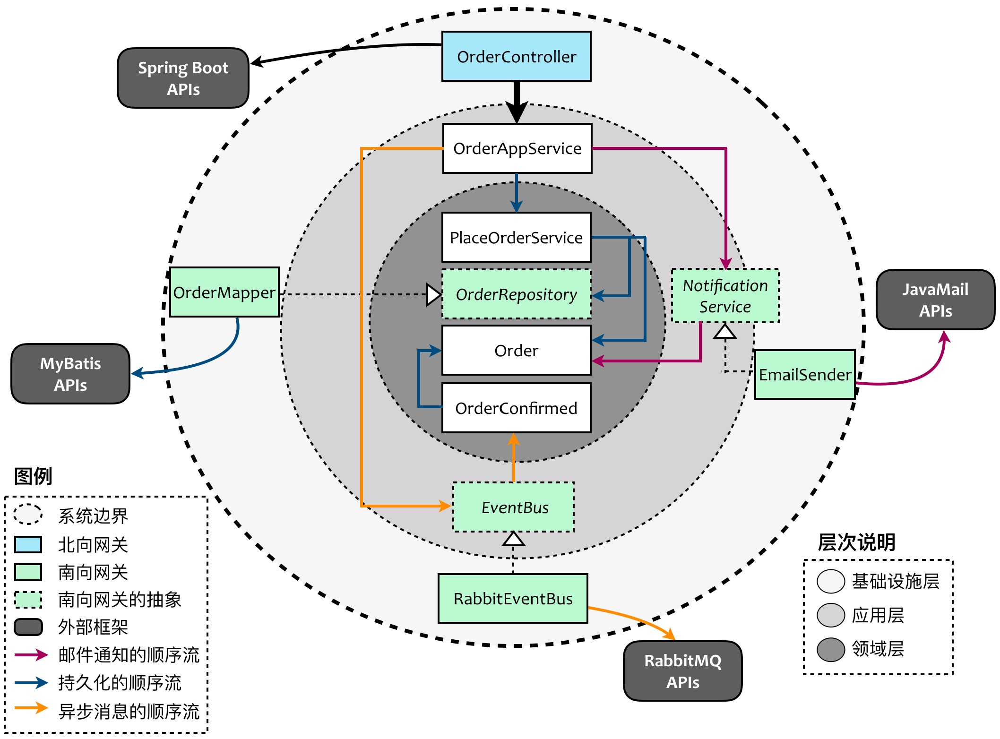

<!DOCTYPE html>
<!-- saved from url=(0046)https://kaiiiz.github.io/hexo-theme-book-demo/ -->
<html xmlns="http://www.w3.org/1999/xhtml">
<head>
    <head>
        <meta http-equiv="Content-Type" content="text/html; charset=UTF-8">
        <meta name="viewport" content="width=device-width, initial-scale=1, maximum-scale=1.0, user-scalable=no">
        <link rel="icon" href="../../static/favicon.png">
        <title>025 案例  层次的职责与协作关系（图文篇）.md</title>
        <!-- Spectre.css framework -->
        <link rel="stylesheet" href="../../static/index.css">
        <!-- theme css & js -->
        <meta name="generator" content="Hexo 4.2.0">
    </head>

<body>

    

        

            <a href="../../index.html">
                
                技术文章摘抄
            </a>
        

        

            <ul class="uncollapsible">
                <li><a href="../../index.html" class="current-tab">首页</a></li>
            </ul>

            <ul class="uncollapsible">
                <li><a href="../index.html">上一级</a></li>
            </ul>

            <ul class="uncollapsible">
                <li>

                    
                    <a href="001&#32;「战略篇」访谈&#32;&#32;DDD&#32;和微服务是什么关系？.md">001 「战略篇」访谈  DDD 和微服务是什么关系？.md</a>

                </li>
                <li>

                    
                    <a href="002&#32;「战略篇」开篇词：领域驱动设计，重焕青春的设计经典.md">002 「战略篇」开篇词：领域驱动设计，重焕青春的设计经典.md</a>

                </li>
                <li>

                    
                    <a href="003&#32;领域驱动设计概览.md">003 领域驱动设计概览.md</a>

                </li>
                <li>

                    
                    <a href="004&#32;深入分析软件的复杂度.md">004 深入分析软件的复杂度.md</a>

                </li>
                <li>

                    
                    <a href="005&#32;控制软件复杂度的原则.md">005 控制软件复杂度的原则.md</a>

                </li>
                <li>

                    
                    <a href="006&#32;领域驱动设计对软件复杂度的应对（上）.md">006 领域驱动设计对软件复杂度的应对（上）.md</a>

                </li>
                <li>

                    
                    <a href="007&#32;领域驱动设计对软件复杂度的应对（下）.md">007 领域驱动设计对软件复杂度的应对（下）.md</a>

                </li>
                <li>

                    
                    <a href="008&#32;软件开发团队的沟通与协作.md">008 软件开发团队的沟通与协作.md</a>

                </li>
                <li>

                    
                    <a href="009&#32;运用领域场景分析提炼领域知识（上）.md">009 运用领域场景分析提炼领域知识（上）.md</a>

                </li>
                <li>

                    
                    <a href="010&#32;运用领域场景分析提炼领域知识（下）.md">010 运用领域场景分析提炼领域知识（下）.md</a>

                </li>
                <li>

                    
                    <a href="011&#32;建立统一语言.md">011 建立统一语言.md</a>

                </li>
                <li>

                    
                    <a href="012&#32;理解限界上下文.md">012 理解限界上下文.md</a>

                </li>
                <li>

                    
                    <a href="013&#32;限界上下文的控制力（上）.md">013 限界上下文的控制力（上）.md</a>

                </li>
                <li>

                    
                    <a href="014&#32;限界上下文的控制力（下）.md">014 限界上下文的控制力（下）.md</a>

                </li>
                <li>

                    
                    <a href="015&#32;识别限界上下文（上）.md">015 识别限界上下文（上）.md</a>

                </li>
                <li>

                    
                    <a href="016&#32;识别限界上下文（下）.md">016 识别限界上下文（下）.md</a>

                </li>
                <li>

                    
                    <a href="017&#32;理解上下文映射.md">017 理解上下文映射.md</a>

                </li>
                <li>

                    
                    <a href="018&#32;上下文映射的团队协作模式.md">018 上下文映射的团队协作模式.md</a>

                </li>
                <li>

                    
                    <a href="019&#32;上下文映射的通信集成模式.md">019 上下文映射的通信集成模式.md</a>

                </li>
                <li>

                    
                    <a href="020&#32;辨别限界上下文的协作关系（上）.md">020 辨别限界上下文的协作关系（上）.md</a>

                </li>
                <li>

                    
                    <a href="021&#32;辨别限界上下文的协作关系（下）.md">021 辨别限界上下文的协作关系（下）.md</a>

                </li>
                <li>

                    
                    <a href="022&#32;认识分层架构.md">022 认识分层架构.md</a>

                </li>
                <li>

                    
                    <a href="023&#32;分层架构的演化.md">023 分层架构的演化.md</a>

                </li>
                <li>

                    
                    <a href="024&#32;领域驱动架构的演进.md">024 领域驱动架构的演进.md</a>

                </li>
                <li>

                    <a class="current-tab" href="025&#32;案例&#32;&#32;层次的职责与协作关系（图文篇）.md">025 案例  层次的职责与协作关系（图文篇）.md</a>
                    

                </li>
                <li>

                    
                    <a href="026&#32;限界上下文与架构.md">026 限界上下文与架构.md</a>

                </li>
                <li>

                    
                    <a href="027&#32;限界上下文对架构的影响.md">027 限界上下文对架构的影响.md</a>

                </li>
                <li>

                    
                    <a href="028&#32;领域驱动设计的代码模型.md">028 领域驱动设计的代码模型.md</a>

                </li>
                <li>

                    
                    <a href="029&#32;代码模型的架构决策.md">029 代码模型的架构决策.md</a>

                </li>
                <li>

                    
                    <a href="030&#32;实践&#32;&#32;先启阶段的需求分析.md">030 实践  先启阶段的需求分析.md</a>

                </li>
                <li>

                    
                    <a href="031&#32;实践&#32;&#32;先启阶段的领域场景分析（上）.md">031 实践  先启阶段的领域场景分析（上）.md</a>

                </li>
                <li>

                    
                    <a href="032&#32;实践&#32;&#32;先启阶段的领域场景分析（下）.md">032 实践  先启阶段的领域场景分析（下）.md</a>

                </li>
                <li>

                    
                    <a href="033&#32;实践&#32;&#32;识别限界上下文.md">033 实践  识别限界上下文.md</a>

                </li>
                <li>

                    
                    <a href="034&#32;实践&#32;&#32;确定限界上下文的协作关系.md">034 实践  确定限界上下文的协作关系.md</a>

                </li>
                <li>

                    
                    <a href="035&#32;实践&#32;&#32;EAS&#32;的整体架构.md">035 实践  EAS 的整体架构.md</a>

                </li>
                <li>

                    
                    <a href="036&#32;「战术篇」访谈：DDD&#32;能帮开发团队提高设计水平吗？.md">036 「战术篇」访谈：DDD 能帮开发团队提高设计水平吗？.md</a>

                </li>
                <li>

                    
                    <a href="037&#32;「战术篇」开篇词：领域驱动设计的不确定性.md">037 「战术篇」开篇词：领域驱动设计的不确定性.md</a>

                </li>
                <li>

                    
                    <a href="038&#32;什么是模型.md">038 什么是模型.md</a>

                </li>
                <li>

                    
                    <a href="039&#32;数据分析模型.md">039 数据分析模型.md</a>

                </li>
                <li>

                    
                    <a href="040&#32;数据设计模型.md">040 数据设计模型.md</a>

                </li>
                <li>

                    
                    <a href="041&#32;数据模型与对象模型.md">041 数据模型与对象模型.md</a>

                </li>
                <li>

                    
                    <a href="042&#32;数据实现模型.md">042 数据实现模型.md</a>

                </li>
                <li>

                    
                    <a href="043&#32;案例&#32;&#32;培训管理系统.md">043 案例  培训管理系统.md</a>

                </li>
                <li>

                    
                    <a href="044&#32;服务资源模型.md">044 服务资源模型.md</a>

                </li>
                <li>

                    
                    <a href="045&#32;服务行为模型.md">045 服务行为模型.md</a>

                </li>
                <li>

                    
                    <a href="046&#32;服务设计模型.md">046 服务设计模型.md</a>

                </li>
                <li>

                    
                    <a href="047&#32;领域模型驱动设计.md">047 领域模型驱动设计.md</a>

                </li>
                <li>

                    
                    <a href="048&#32;领域实现模型.md">048 领域实现模型.md</a>

                </li>
                <li>

                    
                    <a href="049&#32;理解领域模型.md">049 理解领域模型.md</a>

                </li>
                <li>

                    
                    <a href="050&#32;领域模型与结构范式.md">050 领域模型与结构范式.md</a>

                </li>
                <li>

                    
                    <a href="051&#32;领域模型与对象范式（上）.md">051 领域模型与对象范式（上）.md</a>

                </li>
                <li>

                    
                    <a href="052&#32;领域模型与对象范式（中）.md">052 领域模型与对象范式（中）.md</a>

                </li>
                <li>

                    
                    <a href="053&#32;领域模型与对象范式（下）.md">053 领域模型与对象范式（下）.md</a>

                </li>
                <li>

                    
                    <a href="054&#32;领域模型与函数范式.md">054 领域模型与函数范式.md</a>

                </li>
                <li>

                    
                    <a href="055&#32;领域驱动分层架构与对象模型.md">055 领域驱动分层架构与对象模型.md</a>

                </li>
                <li>

                    
                    <a href="056&#32;统一语言与领域分析模型.md">056 统一语言与领域分析模型.md</a>

                </li>
                <li>

                    
                    <a href="057&#32;精炼领域分析模型.md">057 精炼领域分析模型.md</a>

                </li>
                <li>

                    
                    <a href="058&#32;彩色&#32;UML&#32;与彩色建模.md">058 彩色 UML 与彩色建模.md</a>

                </li>
                <li>

                    
                    <a href="059&#32;四色建模法.md">059 四色建模法.md</a>

                </li>
                <li>

                    
                    <a href="060&#32;案例&#32;&#32;订单核心流程的四色建模.md">060 案例  订单核心流程的四色建模.md</a>

                </li>
                <li>

                    
                    <a href="061&#32;事件风暴与业务全景探索.md">061 事件风暴与业务全景探索.md</a>

                </li>
                <li>

                    
                    <a href="062&#32;事件风暴与领域分析建模.md">062 事件风暴与领域分析建模.md</a>

                </li>
                <li>

                    
                    <a href="063&#32;案例&#32;&#32;订单核心流程的事件风暴.md">063 案例  订单核心流程的事件风暴.md</a>

                </li>
                <li>

                    
                    <a href="064&#32;表达领域设计模型.md">064 表达领域设计模型.md</a>

                </li>
                <li>

                    
                    <a href="065&#32;实体.md">065 实体.md</a>

                </li>
                <li>

                    
                    <a href="066&#32;值对象.md">066 值对象.md</a>

                </li>
                <li>

                    
                    <a href="067&#32;对象图与聚合.md">067 对象图与聚合.md</a>

                </li>
                <li>

                    
                    <a href="068&#32;聚合设计原则.md">068 聚合设计原则.md</a>

                </li>
                <li>

                    
                    <a href="069&#32;聚合之间的关系.md">069 聚合之间的关系.md</a>

                </li>
                <li>

                    
                    <a href="070&#32;聚合的设计过程.md">070 聚合的设计过程.md</a>

                </li>
                <li>

                    
                    <a href="071&#32;案例&#32;&#32;培训领域模型的聚合设计.md">071 案例  培训领域模型的聚合设计.md</a>

                </li>
                <li>

                    
                    <a href="072&#32;领域模型对象的生命周期-工厂.md">072 领域模型对象的生命周期-工厂.md</a>

                </li>
                <li>

                    
                    <a href="073&#32;领域模型对象的生命周期-资源库.md">073 领域模型对象的生命周期-资源库.md</a>

                </li>
                <li>

                    
                    <a href="074&#32;领域服务.md">074 领域服务.md</a>

                </li>
                <li>

                    
                    <a href="075&#32;案例&#32;&#32;领域设计模型的价值.md">075 案例  领域设计模型的价值.md</a>

                </li>
                <li>

                    
                    <a href="076&#32;应用服务.md">076 应用服务.md</a>

                </li>
                <li>

                    
                    <a href="077&#32;场景的设计驱动力.md">077 场景的设计驱动力.md</a>

                </li>
                <li>

                    
                    <a href="078&#32;案例&#32;&#32;薪资管理系统的场景驱动设计.md">078 案例  薪资管理系统的场景驱动设计.md</a>

                </li>
                <li>

                    
                    <a href="079&#32;场景驱动设计与&#32;DCI&#32;模式.md">079 场景驱动设计与 DCI 模式.md</a>

                </li>
                <li>

                    
                    <a href="080&#32;领域事件.md">080 领域事件.md</a>

                </li>
                <li>

                    
                    <a href="081&#32;发布者—订阅者模式.md">081 发布者—订阅者模式.md</a>

                </li>
                <li>

                    
                    <a href="082&#32;事件溯源模式.md">082 事件溯源模式.md</a>

                </li>
                <li>

                    
                    <a href="083&#32;测试优先的领域实现建模.md">083 测试优先的领域实现建模.md</a>

                </li>
                <li>

                    
                    <a href="084&#32;深入理解简单设计.md">084 深入理解简单设计.md</a>

                </li>
                <li>

                    
                    <a href="085&#32;案例&#32;&#32;薪资管理系统的测试驱动开发（上）.md">085 案例  薪资管理系统的测试驱动开发（上）.md</a>

                </li>
                <li>

                    
                    <a href="086&#32;案例&#32;&#32;薪资管理系统的测试驱动开发（下）.md">086 案例  薪资管理系统的测试驱动开发（下）.md</a>

                </li>
                <li>

                    
                    <a href="087&#32;对象关系映射（上）.md">087 对象关系映射（上）.md</a>

                </li>
                <li>

                    
                    <a href="088&#32;对象关系映射（下）.md">088 对象关系映射（下）.md</a>

                </li>
                <li>

                    
                    <a href="089&#32;领域模型与数据模型.md">089 领域模型与数据模型.md</a>

                </li>
                <li>

                    
                    <a href="090&#32;领域驱动设计对持久化的影响.md">090 领域驱动设计对持久化的影响.md</a>

                </li>
                <li>

                    
                    <a href="091&#32;领域驱动设计体系.md">091 领域驱动设计体系.md</a>

                </li>
                <li>

                    
                    <a href="092&#32;子领域与限界上下文.md">092 子领域与限界上下文.md</a>

                </li>
                <li>

                    
                    <a href="093&#32;限界上下文的边界与协作.md">093 限界上下文的边界与协作.md</a>

                </li>
                <li>

                    
                    <a href="094&#32;限界上下文之间的分布式通信.md">094 限界上下文之间的分布式通信.md</a>

                </li>
                <li>

                    
                    <a href="095&#32;命令查询职责分离.md">095 命令查询职责分离.md</a>

                </li>
                <li>

                    
                    <a href="096&#32;分布式柔性事务.md">096 分布式柔性事务.md</a>

                </li>
                <li>

                    
                    <a href="097&#32;设计概念的统一语言.md">097 设计概念的统一语言.md</a>

                </li>
                <li>

                    
                    <a href="098&#32;模型对象.md">098 模型对象.md</a>

                </li>
                <li>

                    
                    <a href="099&#32;领域驱动设计参考过程模型.md">099 领域驱动设计参考过程模型.md</a>

                </li>
                <li>

                    
                    <a href="100&#32;领域驱动设计的精髓.md">100 领域驱动设计的精髓.md</a>

                </li>
                <li>

                    
                    <a href="101&#32;实践&#32;&#32;员工上下文的领域建模.md">101 实践  员工上下文的领域建模.md</a>

                </li>
                <li>

                    
                    <a href="102&#32;实践&#32;&#32;考勤上下文的领域建模.md">102 实践  考勤上下文的领域建模.md</a>

                </li>
                <li>

                    
                    <a href="103&#32;实践&#32;&#32;项目上下文的领域建模.md">103 实践  项目上下文的领域建模.md</a>

                </li>
                <li>

                    
                    <a href="104&#32;实践&#32;&#32;培训上下文的业务需求.md">104 实践  培训上下文的业务需求.md</a>

                </li>
                <li>

                    
                    <a href="105&#32;实践&#32;&#32;培训上下文的领域分析建模.md">105 实践  培训上下文的领域分析建模.md</a>

                </li>
                <li>

                    
                    <a href="106&#32;实践&#32;&#32;培训上下文的领域设计建模.md">106 实践  培训上下文的领域设计建模.md</a>

                </li>
                <li>

                    
                    <a href="107&#32;实践&#32;&#32;培训上下文的领域实现建模.md">107 实践  培训上下文的领域实现建模.md</a>

                </li>
                <li>

                    
                    <a href="108&#32;实践&#32;&#32;EAS&#32;系统的代码模型.md">108 实践  EAS 系统的代码模型.md</a>

                </li>
                <li>

                    
                    <a href="109&#32;后记：如何学习领域驱动设计.md">109 后记：如何学习领域驱动设计.md</a>

                </li>
            </ul>

        

    

    

        

    

    

    

        

            

                

                    <!-- For Responsive Layout -->
                    <header class="navbar">
                        <section class="navbar-section">
                            <a onclick="open_sidebar()">
                                <i class="icon icon-menu"></i>
                            </a>
                        </section>
                    </header>
                

                

                    

                        

                        
<h1>025 案例  层次的职责与协作关系（图文篇）</h1>

经历多次演进，我们已经初步得到了符合领域驱动设计思想的分层架构，但这种架构仅仅是一种静态的逻辑划分，在实现一个业务用例时，各层之间是怎么协作的，我们似乎还不得而知。辨别这种动态的协作关系，还是应该从职责的角度入手，即必须清楚地理解分层架构中每个逻辑层的职责。

一味的理论讲解可能已经让爱好案例与代码的程序员昏昏欲睡了，何况用纯理论知识来讲解职责与协作，也让我力有未逮。不如通过一个具体案例，来说明层次的职责以及层次之间的协作关系。还是以电商系统的下订单场景为例，在买家提交订单时，除了与订单直接有关的业务之外，还需要执行以下操作。

<ul>
<li>订单数据的持久化：OrderRepository 提供插入订单功能。它属于支撑订单提交业务的基础功能，但将订单持久化到数据库的实现 OrderMapper 并不属于该业务范畴。</li>
<li>发送通知邮件：NotificationService 提供通知服务。它属于支撑通知业务的基础功能，但邮件发送的实现 EmailSender 却不属于该业务范畴。</li>
<li>异步发送消息给仓储系统：提交订单成功后需要异步发送消息 OrderConfirmed 给仓储系统，这一通信模式是通过消息队列来完成的。EventBus 发送 OrderConfirmed 事件属于支撑订单提交成功的基础功能，但发送该事件到 RabbitMQ 消息队列的 RabbitEventBus 则不属于该业务范畴。</li>
</ul>

同时，为了用户界面客户端或第三方服务的分布式调用，需要通过 OrderController 暴露 RESTful 服务。它本身不提供任何业务实现，而是通过将请求委派给应用层的 OrderAppService 来完成订单的提交。

下图体现了前述三个流程在各层之间以及系统内外部之间的协作关系。<strong>注意，在这里我将牵涉到的类型放在了同一个限界上下文中，如果牵涉到多个限界上下文之间的协作，实现会略有不同，对应的代码模型也将有所调整</strong>。我会在后续内容中深入探讨限界上下文之间的协作对代码模型的影响。

基础设施层的 OrderController 扮演了北向网关的角色，承担了与用户界面层或第三方服务交互的进出口职责。它通过 Spring Boot 来完成对 HTTP 请求的响应、路由和请求/响应消息的序列化与反序列化。它的自有职责仅仅是对请求/响应消息的验证，以及对 OrderAppService 的调用。或许有人会质疑处于后端顶层的控制器为何属于基础设施层？但我认为这样的分配是合理的，因为 Controller 要做的事情与基础设施层所要履行的职责完全匹配，即它提供的是 REST 服务的基础功能。

基础设施层南向网关包括 OrderMapper、EmailSender 和 RabbitEventBus，它们对内为具体的某个业务提供支撑功能，对外则需要借助框架或驱动器访问外部资源。与北向网关不同，对它们的调用由属于内层的应用服务 OrderAppService 发起，因此需要为它们建立抽象来解除内层对外层的依赖。前面已经分析，由于 Repository 提供的方法分属领域逻辑，故而将 OrderMapper 所要实现的接口 OrderRepository 放到核心的领域层。至于 EmailSender 与 RabbitEventBus 各自的抽象 NotificationService 与 EventBus 并未代表领域逻辑，为了不污染领域层的纯洁性，放在应用层似乎更为合理。

无论是北向网关还是南向网关，它们都要与外部资源进行协作，不管是对内/外协议的适配，还是对内部协作对象的封装，本质上它们只做与业务直接有关的基础功能。真正与业务无关的通用基础功能，是与具体某个软件系统无关的，属于更加基础和通用的框架。例如，OrderController 调用的 Spring Boot APIs，EmailSender 调用的 JavaMail APIs、OrderMapper 调用的 MyBatis APIs 以及 RabbitEventBus 调用的 RabbitMQ APIs，都是这样的通用框架。它们是系统代码边界外的外部框架，通常为第三方的开源框架或商业产品；即使是团队自行研发，也不应该属于当前业务系统的代码模型。

我们可以基于这个案例归纳各个层次的职责。

<ul>
<li>领域层：包含 PlaceOrderService、Order、Notification、OrderConfirmed 与抽象的 OrderRepository，封装了纯粹的业务逻辑，不掺杂任何与业务无关的技术实现。</li>
<li>应用层：包含 OrderAppService 以及抽象的 EventBus 与 NotificationService，提供对外体现业务价值的统一接口，同时还包含了基础设施功能的抽象接口。</li>
<li>基础设施层：包含 OrderMapper、RabbitEventBus 与 EmailSender，为业务实现提供对应的技术功能支撑，但真正的基础设施访问则委派给系统边界之外的外部框架或驱动器。</li>
</ul>

<strong>注意</strong>：这里定义了两个分属不同层次的服务，二者极容易混淆。PlaceOrderService 是领域服务，定义在领域层中；OrderAppService 是应用服务，定义在应用层中。这二者的区别属于战术设计的层面，我会在之后的战术设计讲解中深入阐释，我的博客《<a href="http://zhangyi.xyz/how-to-identify-application-service/">如何分辨应用服务与领域服务</a>》也有比较详细的介绍。

OrderController 的实现代码如下所示：

<pre><code class="language-java">package practiceddd.ecommerce.ordercontext.infrastucture;

import org.springframework.web.bind.annotation.RestController;
import org.springframework.web.bind.annotation.RequestMapping;
import org.springframework.web.bind.annotation.RequestMethod;
import org.springframework.web.bind.annotation.RequestParam;
import org.springframework.beans.factory.annotation.Autowired;

import practiceddd.ecommerce.ordercontext.infrastructure.message.CreateOrderRequest;
import practiceddd.ecommerce.ordercontext.application.OrderAppService;
import practiceddd.ecommerce.ordercontext.domain.Order;

@RestController
@RequestMapping(value = &quot;/orders/&quot;)
public class OrderController {
    @Autowired
    private OrderAppService service;

    @RequestMapping(method = RequestMethod.POST)
    public void create(@RequestParam(value = &quot;request&quot;, required = true) CreateOrderRequest request) {
        if (request.isInvalid()) {
            throw new BadRequestException(&quot;the request of placing order is invalid.&quot;);
        }
        Order order = request.toOrder();
        service.placeOrder(order);
    }
}

</code></pre>

应用服务 OrderAppService 的代码如下所示：

<pre><code class="language-java">package practiceddd.ecommerce.ordercontext.application;

import org.springframework.beans.factory.annotation.Autowired;
import org.springframework.stereotype.Service;

import practiceddd.ecommerce.ordercontext.domain.PlaceOrderService;
import practiceddd.ecommerce.ordercontext.domain.Order;
import practiceddd.ecommerce.ordercontext.domain.OrderCompleted;
import practiceddd.ecommerce.ordercontext.domain.Notification;
import practiceddd.ecommerce.ordercontext.domain.OrderNotification;
import practiceddd.ecommerce.ordercontext.domain.exceptions.InvalidOrderException;

@Serivce
public class OrderAppService {
    @Autowired
    private NotificationService notificationService;
    @Autowired
    private EventBus eventBus;
    @Autowired
    private PlaceOrderService placeOrderService;

    public void placeOrder(Order order) {
        try {
            placeOrderService.execute(order);
            notificatonService.send(composeNotification(order));
            eventBus.publish(composeEvent(order));
        } catch (InvalidOrderException | Exception ex) {
            throw new ApplicationException(ex.getMessage());
        }
    }

    private Notification composeNotification(Order order) {
        // 组装通知邮件的内容，实现略
    }
    private OrderConfirmed composeEvent(Order order) {
        // 组装订单确认事件的内容，实现略
    }
}

</code></pre>

既然 OrderAppService 属于应用层的应用服务，它就不应该包含具体的业务逻辑。倘若我们将发送邮件和异步消息发送视为“横切关注点”，那么在应用服务中调用它们是合乎情理的；然而，通过 Order 组装 Notification 与 OrderConfirmed 的职责，却应该放在领域层，因为基于订单去生成邮件内容以及发布事件包含了业务逻辑与规则。<strong>问题出现！<strong>由于这两个对象是由领域层生成的对象，我们该</strong>如何将领域层生成的对象传递给处于它之上的应用层对象？</strong>

有三种解决方案可供选择。

第一种方案是将组装通知邮件与订单确认事件的职责封装到领域层的相关类中，然后在应用层调用这些类的方法，如此可以减少应用层的领域逻辑：

<pre><code class="language-java">package practiceddd.ecommerce.ordercontext.domain;
import org.springframework.stereotype.Service;

@Service
public class NotificationComposer {
    public Notification compose(Order order) {
        // 实现略
    }
}

package practiceddd.ecommerce.ordercontext.domain;
import org.springframework.stereotype.Service;

@Service
public class OrderConfirmedComposer {
    public OrderConfirmed compose(Order order) {
        // 实现略
    }
}

</code></pre>

则应用服务就可以简化为：

<pre><code class="language-java">package practiceddd.ecommerce.ordercontext.application;

import org.springframework.beans.factory.annotation.Autowired;
import org.springframework.stereotype.Service;

import practiceddd.ecommerce.ordercontext.domain.PlaceOrderService;
import practiceddd.ecommerce.ordercontext.domain.Order;
import practiceddd.ecommerce.ordercontext.domain.OrderConfirmed;
import practiceddd.ecommerce.ordercontext.domain.Notification;
import practiceddd.ecommerce.ordercontext.domain.exceptions.InvalidOrderException;
import practiceddd.ecommerce.ordercontext.domain.NotificationComposer;
import practiceddd.ecommerce.ordercontext.domain.OrderConfirmedComposer;

@Service
public class OrderAppService {
    @Autowired
    private NotificationService notificationService;
    @Autowired
    private EventBus eventBus;
    @Autowired
    private PlaceOrderService placeOrderService;
    @Autowired
    private NotificationComposer notificationComposer;
    @Autowired
    private OrderConfirmedComposer orderConfirmedComposer;

    public void placeOrder(Order order) {
        try {
            placeOrderService.execute(order);
            notificatonService.send(notificationComposer.compose(order));
            eventBus.publish(orderConfirmedComposer.compose(order));
        } catch (InvalidOrderException | Exception ex) {
            throw new ApplicationException(ex.getMessage());
        }
    }
}

</code></pre>

采用这种方案的代码结构如下所示：

<pre><code>ordercontext.infrastructure
    - OrderController
    - OrderMapper
    - EmailSender
    - RabbitEventBus
ordercontext.application
    - OrderAppService
    - NotificationService
    - EventBus
ordercontext.domain
    - OrderRepository
    - PlaceOrderService
    - Order
    - Notification
    - OrderConfirmed
    - NotificationComposer
    - OrderConfirmedComposer

</code></pre>

第二种方案则将“上层对下层的调用”改为“下层对上层的通知”，即前面讲解层之间协作时所谓“自底向上”的通信问题，这就需要在领域层为订单业务定义 OrderEventPublisher 接口。当满足某个条件时，通过它在领域层发布事件，这个事件即所谓“领域事件（Domain Event）”。如果我们将建模的视角切换到以“事件”为中心，则意味着领域服务在下订单完成后，需要分别发布 NotificationComposed 与 OrderConfirmed 事件，并由应用层的 OrderEventHandler 作为各自事件的订阅者。这里的前提是：发送邮件与异步发送通知属于应用逻辑的一部分。

我们需要先在领域层定义发布者接口：

<pre><code class="language-java">package practiceddd.ecommerce.ordercontext.domain;

public interface OrderEventPublisher {
    void publish(NotificationComposed event);
    void publish(OrderConfirmed event);
}

</code></pre>

实现 OrderEventPublisher 接口的类放在应用层：

<pre><code class="language-java">package practiceddd.ecommerce.ordercontext.application;

import practiceddd.ecommerce.ordercontext.domain.OrderEventPublisher;
import practiceddd.ecommerce.ordercontext.domain.NotificationComposed;
import practiceddd.ecommerce.ordercontext.domain.Notification;
import practiceddd.ecommerce.ordercontext.domain.OrderConfirmed;

public class OrderEventHandler implements OrderEventPublisher {
    private NotificationService notificationService;
    private EventBus eventBus;

    public OrderEventHandler(NotificationService notificationService, EventBus eventBus) {
        this.notificationService = notificationService;
        this.eventBus = eventBus;
    }

    public void publish(NotificationComposed event) {
        notificationService.send(event.notification());
    }

    public void publish(OrderConfirmed event) {
        eventBus.publish(event);
    }
}

</code></pre>

应用层的应用服务则修改为：

<pre><code class="language-java">package practiceddd.ecommerce.ordercontext.application;

import org.springframework.beans.factory.annotation.Autowired;
import org.springframework.stereotype.Service;

import practiceddd.ecommerce.ordercontext.domain.PlaceOrderService;
import practiceddd.ecommerce.ordercontext.domain.Order;
import practiceddd.ecommerce.ordercontext.domain.exceptions.InvalidOrderException;

@Service
public class OrderAppService {
    @Autowired
    private PlaceOrderService placeOrderService;
    @Autowired
    private NotificationService notificationService;
    @Autowired
    private EventBus eventBus;

    public void placeOrder(Order order) {
        try {
            placeOrderService.register(new OrderEventHandler(notificationService, eventBus));
            placeOrderService.execute(order);
        } catch (InvalidOrderException ex) {
            throw new ApplicationException(ex.getMessage());
        }
    }
}

</code></pre>

领域服务修改为：

<pre><code class="language-java">package practiceddd.ecommerce.ordercontext.domain;

import org.springframework.beans.factory.annotation.Autowired;
import org.springframework.stereotype.Service;

import practiceddd.ecommerce.ordercontext.domain.exceptions.InvalidOrderException;

@Service
public class PlaceOrderService {
    @Autowired
    private OrderRepository orderRepository;
    @Autowired
    private NotificationComposer notificationComposer;

    private OrderEventPublisher publisher;

    public void register(OrderEventPublisher publisher) {
        this.publisher = publisher;
    }

    public void execute(Order order) {
        if (!order.isValid()) {
            throw new InvalidOrderException(String.format(&quot;The order with id %s is invalid.&quot;, order.id()));
        }
        orderRepository.save(order);
        fireNotificationComposedEvent(order);
        fireOrderConfirmedEvent(order);
    }

    private void fireNotificationComposedEvent(Order order) {
        Notification notification = notificationComposer.compose(order);
        publisher.publish(new NotificationComposed(notification));
    }
    private void fireOrderConfirmedEvent(Order order) {
        publisher.publish(new OrderConfirmed(order));
    }
}

</code></pre>

倘若采用这种方案，则代码结构如下所示：

<pre><code>ordercontext.infrastructure
    - OrderController
    - OrderMapper
    - EmailSender
    - RabbitEventBus
ordercontext.application
    - OrderAppService
    - NotificationService
    - EventBus
    - OrderEventHandler
ordercontext.domain
    - OrderRepository
    - PlaceOrderService
    - NotificationComposer
    - OrderEventPublisher
    - Order
    - OrderConfirmed
    - NotificationComposed

</code></pre>

第三种方案需要重新分配 NotificationService 与 EventBus，将这两个抽象接口放到单独的一个名为 interfaces 的包中，这个 interfaces 包既不属于应用层，又不属于领域层。在后面讲解代码模型时，我会解释这样设计的原因，详细内容请移步阅读后面的章节。

通过这样的职责分配后，业务逻辑发生了转移，发送邮件与异步发送通知的调用不再放到应用服务 OrderAppService 中，而是封装到了 PlaceOrderService 领域服务。这时，应用服务 OrderAppService 的实现也变得更加简单。看起来，修改后的设计似乎更符合领域驱动分层架构对应用层的定义，即“应用层是很薄的一层，不包含业务逻辑”。这里的前提是：<strong>发送邮件与异步发送通知属于业务逻辑的一部分。</strong>

应用服务的定义如下所示：

<pre><code class="language-java">package practiceddd.ecommerce.ordercontext.application;

import org.springframework.beans.factory.annotation.Autowired;
import org.springframework.stereotype.Service;

import practiceddd.ecommerce.ordercontext.domain.PlaceOrderService;
import practiceddd.ecommerce.ordercontext.domain.Order;
import practiceddd.ecommerce.ordercontext.domain.exceptions.InvalidOrderException;

@Service
public class OrderAppService {
    @Autowired
    private PlaceOrderService placeOrderService;

    public void placeOrder(Order order) {
        try {
            placeOrderService.execute(order);
        } catch (InvalidOrderException | Exception ex) {
            throw new ApplicationException(ex.getMessage());
        }
    }
}

</code></pre>

不过，领域服务就变得不太纯粹了：

<pre><code class="language-java">package practiceddd.ecommerce.ordercontext.domain;

import org.springframework.beans.factory.annotation.Autowired;
import org.springframework.stereotype.Service;

import practiceddd.ecommerce.ordercontext.interfaces.NotificationService;
import practiceddd.ecommerce.ordercontext.interfaces.EventBus;
import practiceddd.ecommerce.ordercontext.domain.exceptions.InvalidOrderException;

@Service
public class PlaceOrderService {
    @Autowired
    private NotificationService notificationService;
    @Autowired
    private EventBus eventBus;
    @Autowired
    private OrderRepository orderRepository;
    @Autowired
    private NotificationComposer notificationComposer;

    public void execute(Order order) {
        if (!order.isValid()) {
            throw new InvalidOrderException(String.format(&quot;The order with id %s is invalid.&quot;, order.id()));
        }
        orderRepository.save(order);
        notificatonService.send(notificationComposer.compose(order));
        eventBus.publish(new OrderConfirmed(order));
    }
}

</code></pre>

代码结构如下所示：

<pre><code>ordercontext.infrastructure
    - OrderController
    - OrderMapper
    - EmailSender
    - RabbitEventBus
ordercontext.application
    - OrderAppService
ordercontext.interfaces
    - NotificationService
    - EventBus
ordercontext.domain
    - OrderRepository
    - PlaceOrderService
    - Order
    - OrderConfirmed
    - Notification
    - NotificationComposer

</code></pre>

这三个方案该如何选择？根本的出发点在于你对业务逻辑和应用逻辑的认知，进而是你对领域服务与应用服务的认知，这些内容，就留待战术设计部分来讨论。由于并不存在绝对完美的正确答案，因此我的建议是在满足功能需求与松散耦合的前提下，请尽量选择<strong>更简单</strong>的方案。

                    

                    

                        

                            <a href="024&#32;领域驱动架构的演进.md">上一页</a>
                        

                        

                            <a href="026&#32;限界上下文与架构.md">下一页</a>
                        

                    

                

            

        

    

    

</body>
<!-- Global site tag (gtag.js) - Google Analytics -->

</html>
