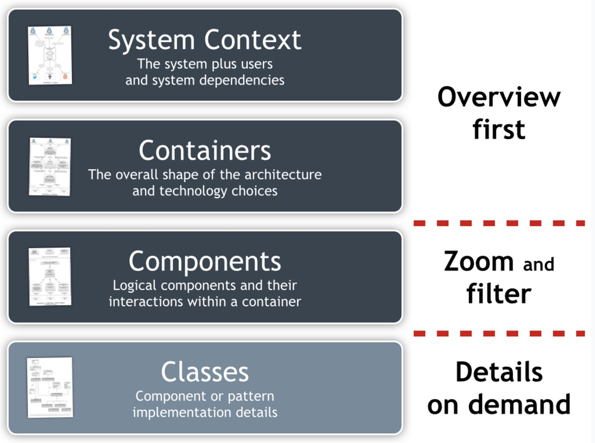
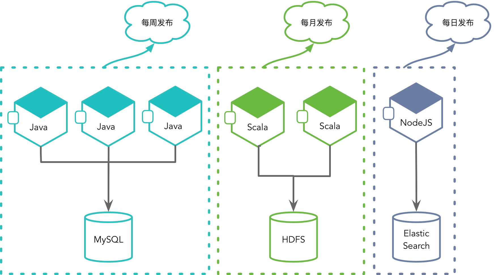
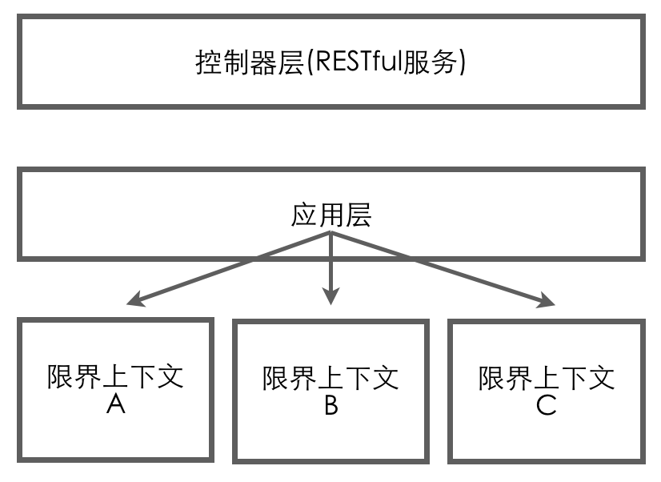

<!DOCTYPE html>
<!-- saved from url=(0046)https://kaiiiz.github.io/hexo-theme-book-demo/ -->
<html xmlns="http://www.w3.org/1999/xhtml">
<head>
    <head>
        <meta http-equiv="Content-Type" content="text/html; charset=UTF-8">
        <meta name="viewport" content="width=device-width, initial-scale=1, maximum-scale=1.0, user-scalable=no">
        <link rel="icon" href="../../static/favicon.png">
        <title>029 代码模型的架构决策.md</title>
        <!-- Spectre.css framework -->
        <link rel="stylesheet" href="../../static/index.css">
        <!-- theme css & js -->
        <meta name="generator" content="Hexo 4.2.0">
    </head>

<body>

    

        

            <a href="../../index.html">
                
                技术文章摘抄
            </a>
        

        

            <ul class="uncollapsible">
                <li><a href="../../index.html" class="current-tab">首页</a></li>
            </ul>

            <ul class="uncollapsible">
                <li><a href="../index.html">上一级</a></li>
            </ul>

            <ul class="uncollapsible">
                <li>

                    
                    <a href="001&#32;「战略篇」访谈&#32;&#32;DDD&#32;和微服务是什么关系？.md">001 「战略篇」访谈  DDD 和微服务是什么关系？.md</a>

                </li>
                <li>

                    
                    <a href="002&#32;「战略篇」开篇词：领域驱动设计，重焕青春的设计经典.md">002 「战略篇」开篇词：领域驱动设计，重焕青春的设计经典.md</a>

                </li>
                <li>

                    
                    <a href="003&#32;领域驱动设计概览.md">003 领域驱动设计概览.md</a>

                </li>
                <li>

                    
                    <a href="004&#32;深入分析软件的复杂度.md">004 深入分析软件的复杂度.md</a>

                </li>
                <li>

                    
                    <a href="005&#32;控制软件复杂度的原则.md">005 控制软件复杂度的原则.md</a>

                </li>
                <li>

                    
                    <a href="006&#32;领域驱动设计对软件复杂度的应对（上）.md">006 领域驱动设计对软件复杂度的应对（上）.md</a>

                </li>
                <li>

                    
                    <a href="007&#32;领域驱动设计对软件复杂度的应对（下）.md">007 领域驱动设计对软件复杂度的应对（下）.md</a>

                </li>
                <li>

                    
                    <a href="008&#32;软件开发团队的沟通与协作.md">008 软件开发团队的沟通与协作.md</a>

                </li>
                <li>

                    
                    <a href="009&#32;运用领域场景分析提炼领域知识（上）.md">009 运用领域场景分析提炼领域知识（上）.md</a>

                </li>
                <li>

                    
                    <a href="010&#32;运用领域场景分析提炼领域知识（下）.md">010 运用领域场景分析提炼领域知识（下）.md</a>

                </li>
                <li>

                    
                    <a href="011&#32;建立统一语言.md">011 建立统一语言.md</a>

                </li>
                <li>

                    
                    <a href="012&#32;理解限界上下文.md">012 理解限界上下文.md</a>

                </li>
                <li>

                    
                    <a href="013&#32;限界上下文的控制力（上）.md">013 限界上下文的控制力（上）.md</a>

                </li>
                <li>

                    
                    <a href="014&#32;限界上下文的控制力（下）.md">014 限界上下文的控制力（下）.md</a>

                </li>
                <li>

                    
                    <a href="015&#32;识别限界上下文（上）.md">015 识别限界上下文（上）.md</a>

                </li>
                <li>

                    
                    <a href="016&#32;识别限界上下文（下）.md">016 识别限界上下文（下）.md</a>

                </li>
                <li>

                    
                    <a href="017&#32;理解上下文映射.md">017 理解上下文映射.md</a>

                </li>
                <li>

                    
                    <a href="018&#32;上下文映射的团队协作模式.md">018 上下文映射的团队协作模式.md</a>

                </li>
                <li>

                    
                    <a href="019&#32;上下文映射的通信集成模式.md">019 上下文映射的通信集成模式.md</a>

                </li>
                <li>

                    
                    <a href="020&#32;辨别限界上下文的协作关系（上）.md">020 辨别限界上下文的协作关系（上）.md</a>

                </li>
                <li>

                    
                    <a href="021&#32;辨别限界上下文的协作关系（下）.md">021 辨别限界上下文的协作关系（下）.md</a>

                </li>
                <li>

                    
                    <a href="022&#32;认识分层架构.md">022 认识分层架构.md</a>

                </li>
                <li>

                    
                    <a href="023&#32;分层架构的演化.md">023 分层架构的演化.md</a>

                </li>
                <li>

                    
                    <a href="024&#32;领域驱动架构的演进.md">024 领域驱动架构的演进.md</a>

                </li>
                <li>

                    
                    <a href="025&#32;案例&#32;&#32;层次的职责与协作关系（图文篇）.md">025 案例  层次的职责与协作关系（图文篇）.md</a>

                </li>
                <li>

                    
                    <a href="026&#32;限界上下文与架构.md">026 限界上下文与架构.md</a>

                </li>
                <li>

                    
                    <a href="027&#32;限界上下文对架构的影响.md">027 限界上下文对架构的影响.md</a>

                </li>
                <li>

                    
                    <a href="028&#32;领域驱动设计的代码模型.md">028 领域驱动设计的代码模型.md</a>

                </li>
                <li>

                    <a class="current-tab" href="029&#32;代码模型的架构决策.md">029 代码模型的架构决策.md</a>
                    

                </li>
                <li>

                    
                    <a href="030&#32;实践&#32;&#32;先启阶段的需求分析.md">030 实践  先启阶段的需求分析.md</a>

                </li>
                <li>

                    
                    <a href="031&#32;实践&#32;&#32;先启阶段的领域场景分析（上）.md">031 实践  先启阶段的领域场景分析（上）.md</a>

                </li>
                <li>

                    
                    <a href="032&#32;实践&#32;&#32;先启阶段的领域场景分析（下）.md">032 实践  先启阶段的领域场景分析（下）.md</a>

                </li>
                <li>

                    
                    <a href="033&#32;实践&#32;&#32;识别限界上下文.md">033 实践  识别限界上下文.md</a>

                </li>
                <li>

                    
                    <a href="034&#32;实践&#32;&#32;确定限界上下文的协作关系.md">034 实践  确定限界上下文的协作关系.md</a>

                </li>
                <li>

                    
                    <a href="035&#32;实践&#32;&#32;EAS&#32;的整体架构.md">035 实践  EAS 的整体架构.md</a>

                </li>
                <li>

                    
                    <a href="036&#32;「战术篇」访谈：DDD&#32;能帮开发团队提高设计水平吗？.md">036 「战术篇」访谈：DDD 能帮开发团队提高设计水平吗？.md</a>

                </li>
                <li>

                    
                    <a href="037&#32;「战术篇」开篇词：领域驱动设计的不确定性.md">037 「战术篇」开篇词：领域驱动设计的不确定性.md</a>

                </li>
                <li>

                    
                    <a href="038&#32;什么是模型.md">038 什么是模型.md</a>

                </li>
                <li>

                    
                    <a href="039&#32;数据分析模型.md">039 数据分析模型.md</a>

                </li>
                <li>

                    
                    <a href="040&#32;数据设计模型.md">040 数据设计模型.md</a>

                </li>
                <li>

                    
                    <a href="041&#32;数据模型与对象模型.md">041 数据模型与对象模型.md</a>

                </li>
                <li>

                    
                    <a href="042&#32;数据实现模型.md">042 数据实现模型.md</a>

                </li>
                <li>

                    
                    <a href="043&#32;案例&#32;&#32;培训管理系统.md">043 案例  培训管理系统.md</a>

                </li>
                <li>

                    
                    <a href="044&#32;服务资源模型.md">044 服务资源模型.md</a>

                </li>
                <li>

                    
                    <a href="045&#32;服务行为模型.md">045 服务行为模型.md</a>

                </li>
                <li>

                    
                    <a href="046&#32;服务设计模型.md">046 服务设计模型.md</a>

                </li>
                <li>

                    
                    <a href="047&#32;领域模型驱动设计.md">047 领域模型驱动设计.md</a>

                </li>
                <li>

                    
                    <a href="048&#32;领域实现模型.md">048 领域实现模型.md</a>

                </li>
                <li>

                    
                    <a href="049&#32;理解领域模型.md">049 理解领域模型.md</a>

                </li>
                <li>

                    
                    <a href="050&#32;领域模型与结构范式.md">050 领域模型与结构范式.md</a>

                </li>
                <li>

                    
                    <a href="051&#32;领域模型与对象范式（上）.md">051 领域模型与对象范式（上）.md</a>

                </li>
                <li>

                    
                    <a href="052&#32;领域模型与对象范式（中）.md">052 领域模型与对象范式（中）.md</a>

                </li>
                <li>

                    
                    <a href="053&#32;领域模型与对象范式（下）.md">053 领域模型与对象范式（下）.md</a>

                </li>
                <li>

                    
                    <a href="054&#32;领域模型与函数范式.md">054 领域模型与函数范式.md</a>

                </li>
                <li>

                    
                    <a href="055&#32;领域驱动分层架构与对象模型.md">055 领域驱动分层架构与对象模型.md</a>

                </li>
                <li>

                    
                    <a href="056&#32;统一语言与领域分析模型.md">056 统一语言与领域分析模型.md</a>

                </li>
                <li>

                    
                    <a href="057&#32;精炼领域分析模型.md">057 精炼领域分析模型.md</a>

                </li>
                <li>

                    
                    <a href="058&#32;彩色&#32;UML&#32;与彩色建模.md">058 彩色 UML 与彩色建模.md</a>

                </li>
                <li>

                    
                    <a href="059&#32;四色建模法.md">059 四色建模法.md</a>

                </li>
                <li>

                    
                    <a href="060&#32;案例&#32;&#32;订单核心流程的四色建模.md">060 案例  订单核心流程的四色建模.md</a>

                </li>
                <li>

                    
                    <a href="061&#32;事件风暴与业务全景探索.md">061 事件风暴与业务全景探索.md</a>

                </li>
                <li>

                    
                    <a href="062&#32;事件风暴与领域分析建模.md">062 事件风暴与领域分析建模.md</a>

                </li>
                <li>

                    
                    <a href="063&#32;案例&#32;&#32;订单核心流程的事件风暴.md">063 案例  订单核心流程的事件风暴.md</a>

                </li>
                <li>

                    
                    <a href="064&#32;表达领域设计模型.md">064 表达领域设计模型.md</a>

                </li>
                <li>

                    
                    <a href="065&#32;实体.md">065 实体.md</a>

                </li>
                <li>

                    
                    <a href="066&#32;值对象.md">066 值对象.md</a>

                </li>
                <li>

                    
                    <a href="067&#32;对象图与聚合.md">067 对象图与聚合.md</a>

                </li>
                <li>

                    
                    <a href="068&#32;聚合设计原则.md">068 聚合设计原则.md</a>

                </li>
                <li>

                    
                    <a href="069&#32;聚合之间的关系.md">069 聚合之间的关系.md</a>

                </li>
                <li>

                    
                    <a href="070&#32;聚合的设计过程.md">070 聚合的设计过程.md</a>

                </li>
                <li>

                    
                    <a href="071&#32;案例&#32;&#32;培训领域模型的聚合设计.md">071 案例  培训领域模型的聚合设计.md</a>

                </li>
                <li>

                    
                    <a href="072&#32;领域模型对象的生命周期-工厂.md">072 领域模型对象的生命周期-工厂.md</a>

                </li>
                <li>

                    
                    <a href="073&#32;领域模型对象的生命周期-资源库.md">073 领域模型对象的生命周期-资源库.md</a>

                </li>
                <li>

                    
                    <a href="074&#32;领域服务.md">074 领域服务.md</a>

                </li>
                <li>

                    
                    <a href="075&#32;案例&#32;&#32;领域设计模型的价值.md">075 案例  领域设计模型的价值.md</a>

                </li>
                <li>

                    
                    <a href="076&#32;应用服务.md">076 应用服务.md</a>

                </li>
                <li>

                    
                    <a href="077&#32;场景的设计驱动力.md">077 场景的设计驱动力.md</a>

                </li>
                <li>

                    
                    <a href="078&#32;案例&#32;&#32;薪资管理系统的场景驱动设计.md">078 案例  薪资管理系统的场景驱动设计.md</a>

                </li>
                <li>

                    
                    <a href="079&#32;场景驱动设计与&#32;DCI&#32;模式.md">079 场景驱动设计与 DCI 模式.md</a>

                </li>
                <li>

                    
                    <a href="080&#32;领域事件.md">080 领域事件.md</a>

                </li>
                <li>

                    
                    <a href="081&#32;发布者—订阅者模式.md">081 发布者—订阅者模式.md</a>

                </li>
                <li>

                    
                    <a href="082&#32;事件溯源模式.md">082 事件溯源模式.md</a>

                </li>
                <li>

                    
                    <a href="083&#32;测试优先的领域实现建模.md">083 测试优先的领域实现建模.md</a>

                </li>
                <li>

                    
                    <a href="084&#32;深入理解简单设计.md">084 深入理解简单设计.md</a>

                </li>
                <li>

                    
                    <a href="085&#32;案例&#32;&#32;薪资管理系统的测试驱动开发（上）.md">085 案例  薪资管理系统的测试驱动开发（上）.md</a>

                </li>
                <li>

                    
                    <a href="086&#32;案例&#32;&#32;薪资管理系统的测试驱动开发（下）.md">086 案例  薪资管理系统的测试驱动开发（下）.md</a>

                </li>
                <li>

                    
                    <a href="087&#32;对象关系映射（上）.md">087 对象关系映射（上）.md</a>

                </li>
                <li>

                    
                    <a href="088&#32;对象关系映射（下）.md">088 对象关系映射（下）.md</a>

                </li>
                <li>

                    
                    <a href="089&#32;领域模型与数据模型.md">089 领域模型与数据模型.md</a>

                </li>
                <li>

                    
                    <a href="090&#32;领域驱动设计对持久化的影响.md">090 领域驱动设计对持久化的影响.md</a>

                </li>
                <li>

                    
                    <a href="091&#32;领域驱动设计体系.md">091 领域驱动设计体系.md</a>

                </li>
                <li>

                    
                    <a href="092&#32;子领域与限界上下文.md">092 子领域与限界上下文.md</a>

                </li>
                <li>

                    
                    <a href="093&#32;限界上下文的边界与协作.md">093 限界上下文的边界与协作.md</a>

                </li>
                <li>

                    
                    <a href="094&#32;限界上下文之间的分布式通信.md">094 限界上下文之间的分布式通信.md</a>

                </li>
                <li>

                    
                    <a href="095&#32;命令查询职责分离.md">095 命令查询职责分离.md</a>

                </li>
                <li>

                    
                    <a href="096&#32;分布式柔性事务.md">096 分布式柔性事务.md</a>

                </li>
                <li>

                    
                    <a href="097&#32;设计概念的统一语言.md">097 设计概念的统一语言.md</a>

                </li>
                <li>

                    
                    <a href="098&#32;模型对象.md">098 模型对象.md</a>

                </li>
                <li>

                    
                    <a href="099&#32;领域驱动设计参考过程模型.md">099 领域驱动设计参考过程模型.md</a>

                </li>
                <li>

                    
                    <a href="100&#32;领域驱动设计的精髓.md">100 领域驱动设计的精髓.md</a>

                </li>
                <li>

                    
                    <a href="101&#32;实践&#32;&#32;员工上下文的领域建模.md">101 实践  员工上下文的领域建模.md</a>

                </li>
                <li>

                    
                    <a href="102&#32;实践&#32;&#32;考勤上下文的领域建模.md">102 实践  考勤上下文的领域建模.md</a>

                </li>
                <li>

                    
                    <a href="103&#32;实践&#32;&#32;项目上下文的领域建模.md">103 实践  项目上下文的领域建模.md</a>

                </li>
                <li>

                    
                    <a href="104&#32;实践&#32;&#32;培训上下文的业务需求.md">104 实践  培训上下文的业务需求.md</a>

                </li>
                <li>

                    
                    <a href="105&#32;实践&#32;&#32;培训上下文的领域分析建模.md">105 实践  培训上下文的领域分析建模.md</a>

                </li>
                <li>

                    
                    <a href="106&#32;实践&#32;&#32;培训上下文的领域设计建模.md">106 实践  培训上下文的领域设计建模.md</a>

                </li>
                <li>

                    
                    <a href="107&#32;实践&#32;&#32;培训上下文的领域实现建模.md">107 实践  培训上下文的领域实现建模.md</a>

                </li>
                <li>

                    
                    <a href="108&#32;实践&#32;&#32;EAS&#32;系统的代码模型.md">108 实践  EAS 系统的代码模型.md</a>

                </li>
                <li>

                    
                    <a href="109&#32;后记：如何学习领域驱动设计.md">109 后记：如何学习领域驱动设计.md</a>

                </li>
            </ul>

        

    

    

        

    

    

    

        

            

                

                    <!-- For Responsive Layout -->
                    <header class="navbar">
                        <section class="navbar-section">
                            <a onclick="open_sidebar()">
                                <i class="icon icon-menu"></i>
                            </a>
                        </section>
                    </header>
                

                

                    

                        

                        
<h1>029 代码模型的架构决策</h1>

代码模型属于软件架构的一部分，它是设计模型的进化与实现，体现出了代码模块（包）的结构层次。在架构视图中，代码模型甚至会作为其中的一个视图，通过它来展现模块的划分，并定义运行时实体与执行视图建立联系，如下图所示：

确定软件系统的代码模型属于架构决策的一部分。在领域驱动设计背景下，代码模型的设计可以分为两个层次，具体如下。

<ul>
<li>系统层次：设计整个软件系统的代码模型。</li>
<li>限界上下文层次：设计限界上下文内部的代码模型。</li>
</ul>

在领域驱动设计中，限界上下文对整个系统进行了划分，以便于实现“分而治之”的架构设计思想。正如前面几课所述，我们可以将每个限界上下文视为一个<strong>自治单元</strong>，这个自治单元就像一个独立的子系统，可以有自己的架构。尤其是当我们将一个限界上下文视为一个微服务时，这种控制在边界内的独立架构就显得更加明显。上一课介绍的代码模型，其实是这样的模型设计层次。

针对整个软件系统，我们可以将这些限界上下文视为一个黑盒子。我们仅需关心限界上下文暴露的接口以及它们之间的协作关系。而对于整个软件系统，则需要保证其在架构风格上的一致性。所谓“风格”，可以参考 Roy Fielding 的定义：

<blockquote>

风格是一种用来对架构进行分类和定义它们的公共特征的机制。每一种风格都为组件的交互提供了一种抽象，并且通过忽略架构中其余部分的偶然性细节，来捕获一种交互模式（pattern of interation）的本质特征。

</blockquote>

Roy Fielding 对“风格”的定义突出了对架构的分类和公共特征的定义。无论是分类，还是识别公共特征，都是一种抽象。同时，定义中明确指出风格为组件的协作提供了抽象，这说明架构风格并不涉及实现细节。在架构设计时，需要找出那些稳定不变的本质特征，且这个特征与系统的目标还有需求是相匹配的。结合领域驱动设计，限界上下文以及上下文映射就是这样的一种抽象：

<ul>
<li>如果我们将限界上下文视为微服务，则该系统的架构风格就是<strong>微服务架构风格</strong>；</li>
<li>如果我们将上下文协作模式抽象为发布/订阅事件，则该系统的架构风格就是<strong>事件驱动架构风格</strong>；</li>
<li>如果在限界上下文层面将查询与命令分为两种不同的实现模式，则该系统的架构风格就是<strong>命令查询职责分离（CQRS）架构风格</strong>。</li>
</ul>

显然，这些架构风格适应于不同的应用场景，即这些风格的选择应与系统要解决的问题域相关。为了保证整个软件系统架构设计的一致性，我们可以结合 Simon Brown 提出的 C4 模型来考虑设计元素的粒度和层次：

自上而下，Simon Brown 将整个软件系统分为了四个层次，分别为系统上下文（System Context）、容器（Containers）、组件（Components）以及类（Classes），这些层次的说明如下所示。

<ul>
<li>系统上下文：是最高的抽象层次，代表了能够提供价值的东西。一个系统由多个独立的容器构成。</li>
<li>容器：是指一个在其内部可以执行组件或驻留数据的东西。作为整个系统的一部分，容器通常是可执行文件，但未必是各自独立的进程。从容器的角度理解一个软件系统的关键在于，任何容器间的通信可能都需要一个远程接口。</li>
<li>组件：可以想象成一个或多个类组成的逻辑群组。组件通常由多个类在更高层次的约束下组合而成。</li>
<li>类：在一个面向对象的世界里，类是软件系统的最小结构单元。</li>
</ul>

在系统上下文层次，我们需要考虑的架构因素是将系统作为一个完整单元，然后思考它和用户之间的交互方式是怎样的，需要集成的外部系统有哪些，采用怎样的通信协议？若在这个层次考虑架构风格，就更容易建立架构的抽象体系。例如：

<ul>
<li>倘若我们采用微服务的架构风格，意味着包括用户和外部系统在内的客户端都需要通过 API Gateway 实现微服务的调用；</li>
<li>倘若采用事件驱动架构风格，意味着系统与外部系统之间需要引入消息中间件，以便于事件消息的传递；</li>
<li>倘若采用 CQRS 架构风格，意味着系统暴露的 API 接口需要分解为命令接口和查询接口，接口类型不同，处理模式和执行方式都不相同。</li>
</ul>

C4 模型中的容器基本等同于微服务的概念，推而广之也就代表了限界上下文的概念。其实，容器与组件之间的边界很模糊，这取决于我们对限界上下文之间通信机制的决策。不仅限于此，即使采用了微服务架构风格，<strong>我们识别出来的限界上下文亦未必一定要部署为一个微服务</strong>。它们可能为整个系统提供公共的基础功能，因而在微服务架构中实际是以公共组件的形式而存在的。

在代码模型上，这些公共组件又分为两种。

一种公共组件具有业务价值，因而对应于一个限界上下文，可以视为是支撑子域（Supporting SubDomain）或通用子域（Generic SubDomain）在解决方案上的体现，如规则引擎、消息验证、分析算法等。那么，在微服务架构风格中，为何不将这样的限界上下文部署为微服务呢？这实际上是基于微服务的优势与不足来做出的设计决策。

如上图所示，微服务保证了技术选择的自由、发布节奏的自由、独立升级的自由以及自由扩展硬件配置资源的自由。为了获得这些自由，付出的代价自然也不少，其中就包括分布式系统固有的复杂度、数据的一致性问题以及在部署和运维时带来的挑战。除此之外，我们还需要考虑微服务协作时带来的网络传输成本。如果我们能结合具体的业务场景考虑这些优势与不足，就可以在微服务与公共组件之间做出设计权衡。

基于我个人的经验，我认为当满足以下条件时，应优先考虑设计为微服务：

<ul>
<li>实现经常变更，导致功能需要频繁升级；</li>
<li>采用了完全不一样的技术栈；</li>
<li>对高并发与低延迟敏感，需要单独进行水平扩展；</li>
<li>是一种端对端的垂直业务体现（即需要与外部环境或资源协作）。</li>
</ul>

当满足以下条件时，应优先考虑设计为公共组件：

<ul>
<li>需求几乎不会变化，提供了内聚而又稳定的实现；</li>
<li>在与其进行协作时，需要传输大量的数据；</li>
<li>无需访问外部资源。</li>
</ul>

如果找不到支持微服务的绝对理由，我们应优先考虑将其设计为公共组件。

另一种公共组件并非领域的一部分，仅仅提供了公共的基础设施功能，如文件读写、FTP 传输、Telnet 通信等。本质上，这些公共组件属于基础设施层的模块。如果是多个限界上下文都需要重用的公共模块，甚至可以将该公共组件视为一种基础的平台或框架。这时，它不再属于限界上下文中的代码模型，而是作为整个系统的代码模型。当然，倘若我们将这种公共组件视为基础平台或框架，还可以为其建立单独的模块（或项目），放在专有的代码库中，并以二进制依赖的形式被当前软件系统所使用。

整体而言，一个典型的微服务架构通常如下图所示：

采用微服务架构风格时，诸如 Spring Cloud 之类的微服务框架事实上间接地帮我们完成了整个系统架构的代码模型。例如：

<ul>
<li>API Gateway 作为所有微服务的访问入口，Euraka 或 Consul 提供的服务注册与发现，帮我们解决了微服务协作的访问功能；</li>
<li>Feign 提供的声明式服务调用组件让我们省去了编写防腐层中 Client 的代码实现；</li>
<li>Spring Cloud Config 提供了分布式的配置中心等。</li>
</ul>

这些组件在上面所示的架构中，作为微服务架构的基础设施而存在。当我们使用这样的微服务框架时，就可以让设计与开发人员只需要专注于微服务内部的设计，即领域逻辑的实现，实际上就是对软件复杂度的应对。通过限界上下文（微服务）实现对业务的分而治之，从而降低业务复杂度；而微服务架构自身虽然会带来技术复杂度的增加，但技术复杂度已经转移到了微服务框架来完成，从而整体降低了应用开发人员的开发难度。

倘若采用单体架构，我们也需<strong>保证其向微服务演化的可能</strong>。因此，这两种风格的选择对于限界上下文内部的代码模型并无影响。但我们还需要为整个系统建立一个一致的系统架构。为了保证关注点分离，整个系统的架构同样需要进行分层，并遵循整洁架构的思想。

在对整个系统架构进行分层架构设计时，需要考虑用户展现层、应用层和基础设施层与限界上下文内各层次之间的关系。我认为，限界上下文的范围包含了除用户展现层在外的其他各层。其中，应用层包含了应用服务，由它来完成领域对象的调用以及对其他横切关注点的调用。基础设施层的北向网关提供了对外公开的开放主机服务，通常被定义为 RESTful 服务。那么，对于整个系统架构而言，还需要定义系统层次的应用服务与 RESTful 服务么？如下图所示：

如果我们参考微服务架构风格，就会发现上图的控制器层暴露了所有的服务接口，相当于 API Gateway 的功能，上图的应用层用于管理各个限界上下文应用服务的协作，相当于服务注册与发现组件的功能。微服务框架提供的 API Gateway 和服务注册与发现组件仅仅是一个外观（Facade），内部并没有包含任何应用逻辑和领域逻辑。而在单体架构中，由于所有的限界上下文都部署在一个服务中，因而并不需要服务的注册与发现功能；每个限界上下文都有控制器定义了对外公开的 RESTful 服务，且所有的这些 RESTful 服务都绑定到唯一的入口（如 Spring Boot 要求定义的 Application 类）上，区别仅仅是代码模型的隔离罢了，自然也就不需要 API Gateway。故而在系统架构层次，保留二者并没有任何意义。

当然，也有例外。譬如说我们需要为整个单体架构提供一些与业务无关的 RESTful 服务，如健康检查、监控等。另外，倘若需要组合多个限界上下文的领域模型，似乎也有了保留应用层的必要。Vernon 在《实现领域驱动设计》一书中就提到了这种“组合多个限界上下文”的场景，如下图所示：

Vernon 认为：

<blockquote>

……应用层不是成了一个拥有内建防腐层的新领域模型吗？是的，它是一个新的、廉价的限界上下文。在该上下文中，应用服务对多个 DTO 进行合并，产生的结果有点像贫血领域模型。

</blockquote>

实际上，Vernon 在这里谈到的组合功能，目的是为了组装一个满足客户端调用的服务对象。但我认为定义这样专属的应用服务并非必须。归根结底，这个应用服务要做的事情就是对多个限界上下文领域模型的协调与组装。这种需求必然要结合具体的业务场景，例如订单对象需要组合来自不同限界上下文的商品信息、客户信息、店铺信息等。该业务场景虽然牵涉到多个限界上下文领域模型的协调，但<strong>必然存在一个主领域对应的限界上下文。这个限界上下文提供的应用服务才是该业务场景需要实现的业务价值</strong>，因此就应该将这个应用服务定义在当前限界上下文，而非整个系统架构的应用层，又或者为其建立一个新的廉价的限界上下文。而在该限界上下文内部，应用层或领域层可以通过防腐层与其他限界上下文协作，共同为这个业务提供支持。除非，这个业务场景要完成的业务目标不属于之前识别的任何一个限界上下文。

再来考虑用户展现层的场景。假设需要支持多种前端应用，且不同前端应用需要不同的视图模型和交互逻辑。考虑到前端资源有限，同时保证前端代码的业务无关性，我们可以在系统架构层面上，定义一个统一的接口层。这个接口层位于服务端，提供了与前端界面对应的服务端组件，并成为组成用户界面的一部分。在这个接口层中，我们可以为不同的前端提供不同的服务端组件。由于引入的这一接口层具有后端服务的特征，却又为前端提供服务，因而被称之为 <strong>BFF（Backends For Frontends，为前端提供的后端）</strong>。

引入的 BFF 往往是为了协调前端开发人员与后端开发人员的沟通协作问题。前端开发人员理解用户界面的设计，后端开发人员却只为垂直领域（即特性）设计服务接口，就使得二者并不能很好地实现模型之间的匹配。既然 BFF 是为前端 UI 提供的，最佳的做法就是让前端开发人员自己来定义。这也是在项目实践中 Node.js 扮演的重要作用，如下图所示：

图中为浏览器 UI 调用提供的 UI Layer，即 BFF，它实则是在服务器与浏览器之间增加了一个 Node.js 中间层。各层的职责如下表所示：

<table>
<thead>
<tr>
<th align="left">Java</th>
<th align="left">Node.js</th>
<th align="left">JS + HTML + CSS</th>
</tr>
</thead>
<tbody>
<tr>
<td align="left">服务层</td>
<td align="left">跑在服务器上的 JS</td>
<td align="left">跑在浏览器上的 JS</td>
</tr>
<tr>
<td align="left">提供数据接口</td>
<td align="left">转发数据，串接服务</td>
<td align="left">CSS、JS 加载与运行</td>
</tr>
<tr>
<td align="left">维持数据稳定</td>
<td align="left">路由设计，控制逻辑</td>
<td align="left">DOM 操作</td>
</tr>
<tr>
<td align="left">封装业务逻辑</td>
<td align="left">渲染页面，体验优化</td>
<td align="left">共用模板、路由</td>
</tr>
</tbody>
</table>

显然，BFF 的引入虽然是架构决策的一部分，但严格意义上讲，它并不属于后端架构。因而，BFF 的设计并不在领域驱动战略设计的考虑范围之内。

最后再来考虑基础设施层。除了限界上下文自身需要的基础设施之外，在系统架构层面仍然可能需要为这些限界上下文提供公共的基础设施组件，例如对 Excel 或 CSV 文件的导入导出，消息的发布与订阅、Telnet 通信等。这些组件往往是通用的，许多限界上下文都会使用它们，因而应该放在系统的基础设施层而被限界上下文重用，又或者定义为完全独立的与第三方框架同等级别的公共组件。理想状态下，这些公共组件的调用应由属于限界上下文自己的基础设施实现调用。倘若它们被限界上下文的领域对象或应用服务直接调用（即绕开自身的基础设施层），则应该遵循整洁架构思想，在系统架构层引入 interfaces 包，为这些具体实现定义抽象接口。

在运用领域驱动设计时，还需要提供遵照领域驱动设计尤其是战术设计要素提供的基本构造块（Building Block），例如对 Identity 的实现、值对象、实体以及领域事件的抽象、聚合根的构造型等。你可以理解为这些构造块组成了支持领域驱动设计的框架。如果没有单独剥离出这个框架，这些构造块也将作为系统代码模型的一部分。

综上所述，我们选择的架构风格会影响到系统的代码模型。假设我们要设计的系统为 ecommerce，选择单体架构风格，则系统架构与限界上下文的代码模型如下所示：

<pre><code>practiceddd
    - ecommerce
        - core
            - Identity
            - ValueObject
            - Entity
            - DomainEvent
            - AggregateRoot
        - controllers
            - HealthController
            - MonitorController
        - application（视具体情况而定）
        - interfaces
            - io
            - telnet
            - message
        - gateways
            - io
            - telnet
            - message
        - ordercontext
            - application
            - interfaces
            - domain
            - repositories
            - gateways
        - productcontext
            - application
            - interfaces
            - domain

</code></pre>

如果选择微服务架构风格，通常不需要建立一个大一统的代码模型，而是按照内聚的职责将这些职责分别封装到各自的限界上下文中，又或者定义为公共组件以二进制依赖的方式被微服务调用。这些公共组件应该各自构建为单独的包，保证重用和变化的粒度。如果选择 CQRS 架构风格，就可以在限界上下文的代码模型中为 command 和 query 分别建立 module（领域驱动设计中的设计要素），使得它们的代码模型可以独自演化，毕竟命令和查询的领域模型是完全不同的。基于质量因素的考虑，我们甚至可以为同一个领域的 command 和 query 各自建立专有的限界上下文。在 command 上下文中，除了增加了 command 类和 event 类以及对应的 handler 之外，遵循前面讲述的限界上下文代码模型，而 query 上下文的领域模型就可以简化，例如直接运用事务脚本或表模块模式。

                    

                    

                        

                            <a href="028&#32;领域驱动设计的代码模型.md">上一页</a>
                        

                        

                            <a href="030&#32;实践&#32;&#32;先启阶段的需求分析.md">下一页</a>
                        

                    

                

            

        

    

    

</body>
<!-- Global site tag (gtag.js) - Google Analytics -->

</html>
