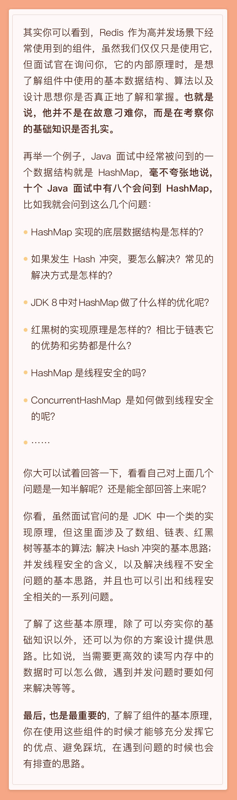
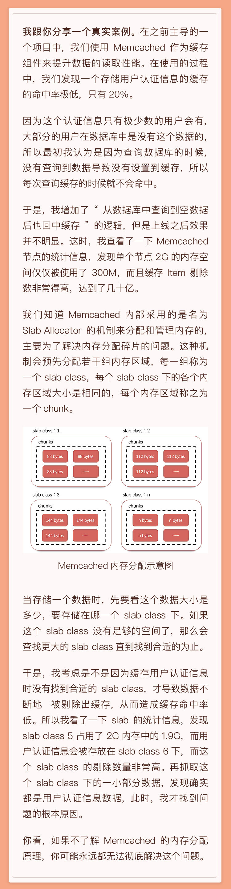
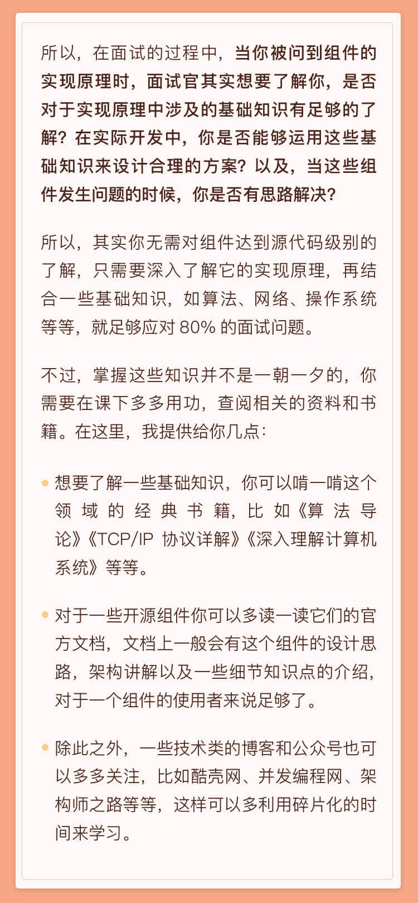

<!DOCTYPE html>
<!-- saved from url=(0046)https://kaiiiz.github.io/hexo-theme-book-demo/ -->
<html xmlns="http://www.w3.org/1999/xhtml">
<head>
    <head>
        <meta http-equiv="Content-Type" content="text/html; charset=UTF-8">
        <meta name="viewport" content="width=device-width, initial-scale=1, maximum-scale=1.0, user-scalable=no">
        <link rel="icon" href="../../static/favicon.png">
        <title>06  面试现场第一期：当问到组件实现原理时，面试官是在刁难你吗？.md</title>
        <!-- Spectre.css framework -->
        <link rel="stylesheet" href="../../static/index.css">
        <!-- theme css & js -->
        <meta name="generator" content="Hexo 4.2.0">
    </head>

<body>

    

        

            <a href="../../index.html">
                
                技术文章摘抄
            </a>
        

        

            <ul class="uncollapsible">
                <li><a href="../../index.html" class="current-tab">首页</a></li>
            </ul>

            <ul class="uncollapsible">
                <li><a href="../index.html">上一级</a></li>
            </ul>

            <ul class="uncollapsible">
                <li>

                    
                    <a href="00&#32;开篇词&#32;&#32;为什么你要学习高并发系统设计？.md">00 开篇词  为什么你要学习高并发系统设计？.md</a>

                </li>
                <li>

                    
                    <a href="01&#32;&#32;高并发系统：它的通用设计方法是什么？.md">01  高并发系统：它的通用设计方法是什么？.md</a>

                </li>
                <li>

                    
                    <a href="02&#32;&#32;架构分层：我们为什么一定要这么做？.md">02  架构分层：我们为什么一定要这么做？.md</a>

                </li>
                <li>

                    
                    <a href="03&#32;&#32;系统设计目标（一）：如何提升系统性能？.md">03  系统设计目标（一）：如何提升系统性能？.md</a>

                </li>
                <li>

                    
                    <a href="04&#32;&#32;系统设计目标（二）：系统怎样做到高可用？.md">04  系统设计目标（二）：系统怎样做到高可用？.md</a>

                </li>
                <li>

                    
                    <a href="05&#32;&#32;系统设计目标（三）：如何让系统易于扩展？.md">05  系统设计目标（三）：如何让系统易于扩展？.md</a>

                </li>
                <li>

                    <a class="current-tab" href="06&#32;&#32;面试现场第一期：当问到组件实现原理时，面试官是在刁难你吗？.md">06  面试现场第一期：当问到组件实现原理时，面试官是在刁难你吗？.md</a>
                    

                </li>
                <li>

                    
                    <a href="07&#32;&#32;池化技术：如何减少频繁创建数据库连接的性能损耗？.md">07  池化技术：如何减少频繁创建数据库连接的性能损耗？.md</a>

                </li>
                <li>

                    
                    <a href="08&#32;&#32;数据库优化方案（一）：查询请求增加时，如何做主从分离？.md">08  数据库优化方案（一）：查询请求增加时，如何做主从分离？.md</a>

                </li>
                <li>

                    
                    <a href="09&#32;&#32;数据库优化方案（二）：写入数据量增加时，如何实现分库分表？.md">09  数据库优化方案（二）：写入数据量增加时，如何实现分库分表？.md</a>

                </li>
                <li>

                    
                    <a href="10&#32;&#32;发号器：如何保证分库分表后ID的全局唯一性？.md">10  发号器：如何保证分库分表后ID的全局唯一性？.md</a>

                </li>
                <li>

                    
                    <a href="11&#32;&#32;NoSQL：在高并发场景下，数据库和NoSQL如何做到互补？.md">11  NoSQL：在高并发场景下，数据库和NoSQL如何做到互补？.md</a>

                </li>
                <li>

                    
                    <a href="12&#32;&#32;缓存：数据库成为瓶颈后，动态数据的查询要如何加速？.md">12  缓存：数据库成为瓶颈后，动态数据的查询要如何加速？.md</a>

                </li>
                <li>

                    
                    <a href="13&#32;&#32;缓存的使用姿势（一）：如何选择缓存的读写策略？.md">13  缓存的使用姿势（一）：如何选择缓存的读写策略？.md</a>

                </li>
                <li>

                    
                    <a href="14&#32;&#32;缓存的使用姿势（二）：缓存如何做到高可用？.md">14  缓存的使用姿势（二）：缓存如何做到高可用？.md</a>

                </li>
                <li>

                    
                    <a href="15&#32;&#32;缓存的使用姿势（三）：缓存穿透了怎么办？.md">15  缓存的使用姿势（三）：缓存穿透了怎么办？.md</a>

                </li>
                <li>

                    
                    <a href="16&#32;&#32;CDN：静态资源如何加速？.md">16  CDN：静态资源如何加速？.md</a>

                </li>
                <li>

                    
                    <a href="17&#32;&#32;消息队列：秒杀时如何处理每秒上万次的下单请求？.md">17  消息队列：秒杀时如何处理每秒上万次的下单请求？.md</a>

                </li>
                <li>

                    
                    <a href="18&#32;&#32;消息投递：如何保证消息仅仅被消费一次？.md">18  消息投递：如何保证消息仅仅被消费一次？.md</a>

                </li>
                <li>

                    
                    <a href="19&#32;&#32;消息队列：如何降低消息队列系统中消息的延迟？.md">19  消息队列：如何降低消息队列系统中消息的延迟？.md</a>

                </li>
                <li>

                    
                    <a href="20&#32;&#32;面试现场第二期：当问到项目经历时，面试官究竟想要了解什么？.md">20  面试现场第二期：当问到项目经历时，面试官究竟想要了解什么？.md</a>

                </li>
                <li>

                    
                    <a href="21&#32;&#32;系统架构：每秒1万次请求的系统要做服务化拆分吗？.md">21  系统架构：每秒1万次请求的系统要做服务化拆分吗？.md</a>

                </li>
                <li>

                    
                    <a href="22&#32;&#32;微服务架构：微服务化后，系统架构要如何改造？.md">22  微服务架构：微服务化后，系统架构要如何改造？.md</a>

                </li>
                <li>

                    
                    <a href="23&#32;&#32;RPC框架：10万QPS下如何实现毫秒级的服务调用？.md">23  RPC框架：10万QPS下如何实现毫秒级的服务调用？.md</a>

                </li>
                <li>

                    
                    <a href="24&#32;&#32;注册中心：分布式系统如何寻址？.md">24  注册中心：分布式系统如何寻址？.md</a>

                </li>
                <li>

                    
                    <a href="25&#32;&#32;分布式Trace：横跨几十个分布式组件的慢请求要如何排查？.md">25  分布式Trace：横跨几十个分布式组件的慢请求要如何排查？.md</a>

                </li>
                <li>

                    
                    <a href="26&#32;&#32;负载均衡：怎样提升系统的横向扩展能力？.md">26  负载均衡：怎样提升系统的横向扩展能力？.md</a>

                </li>
                <li>

                    
                    <a href="27&#32;&#32;API网关：系统的门面要如何做呢？.md">27  API网关：系统的门面要如何做呢？.md</a>

                </li>
                <li>

                    
                    <a href="28&#32;&#32;多机房部署：跨地域的分布式系统如何做？.md">28  多机房部署：跨地域的分布式系统如何做？.md</a>

                </li>
                <li>

                    
                    <a href="29&#32;&#32;Service&#32;Mesh：如何屏蔽服务化系统的服务治理细节？.md">29  Service Mesh：如何屏蔽服务化系统的服务治理细节？.md</a>

                </li>
                <li>

                    
                    <a href="30&#32;&#32;给系统加上眼睛：服务端监控要怎么做？.md">30  给系统加上眼睛：服务端监控要怎么做？.md</a>

                </li>
                <li>

                    
                    <a href="31&#32;&#32;应用性能管理：用户的使用体验应该如何监控？.md">31  应用性能管理：用户的使用体验应该如何监控？.md</a>

                </li>
                <li>

                    
                    <a href="32&#32;&#32;压力测试：怎样设计全链路压力测试平台？.md">32  压力测试：怎样设计全链路压力测试平台？.md</a>

                </li>
                <li>

                    
                    <a href="33&#32;&#32;配置管理：成千上万的配置项要如何管理？.md">33  配置管理：成千上万的配置项要如何管理？.md</a>

                </li>
                <li>

                    
                    <a href="34&#32;&#32;降级熔断：如何屏蔽非核心系统故障的影响？.md">34  降级熔断：如何屏蔽非核心系统故障的影响？.md</a>

                </li>
                <li>

                    
                    <a href="35&#32;&#32;流量控制：高并发系统中我们如何操纵流量？.md">35  流量控制：高并发系统中我们如何操纵流量？.md</a>

                </li>
                <li>

                    
                    <a href="36&#32;&#32;面试现场第三期：你要如何准备一场技术面试呢？.md">36  面试现场第三期：你要如何准备一场技术面试呢？.md</a>

                </li>
                <li>

                    
                    <a href="37&#32;&#32;计数系统设计（一）：面对海量数据的计数器要如何做？.md">37  计数系统设计（一）：面对海量数据的计数器要如何做？.md</a>

                </li>
                <li>

                    
                    <a href="38&#32;&#32;计数系统设计（二）：50万QPS下如何设计未读数系统？.md">38  计数系统设计（二）：50万QPS下如何设计未读数系统？.md</a>

                </li>
                <li>

                    
                    <a href="39&#32;&#32;信息流设计（一）：通用信息流系统的推模式要如何做？.md">39  信息流设计（一）：通用信息流系统的推模式要如何做？.md</a>

                </li>
                <li>

                    
                    <a href="40&#32;&#32;信息流设计（二）：通用信息流系统的拉模式要如何做？.md">40  信息流设计（二）：通用信息流系统的拉模式要如何做？.md</a>

                </li>
                <li>

                    
                    <a href="加餐&#32;&#32;数据的迁移应该如何做？.md">加餐  数据的迁移应该如何做？.md</a>

                </li>
                <li>

                    
                    <a href="期中测试&#32;&#32;10道高并发系统设计题目自测.md">期中测试  10道高并发系统设计题目自测.md</a>

                </li>
                <li>

                    
                    <a href="用户故事&#32;&#32;从“心”出发，我还有无数个可能.md">用户故事  从“心”出发，我还有无数个可能.md</a>

                </li>
                <li>

                    
                    <a href="结束语&#32;&#32;学不可以已.md">结束语  学不可以已.md</a>

                </li>
            </ul>

        

    

    

        

    

    

    

        

            

                

                    <!-- For Responsive Layout -->
                    <header class="navbar">
                        <section class="navbar-section">
                            <a onclick="open_sidebar()">
                                <i class="icon icon-menu"></i>
                            </a>
                        </section>
                    </header>
                

                

                    

                        

                        
<h1>06  面试现场第一期：当问到组件实现原理时，面试官是在刁难你吗？</h1>

                    

                    

                        

                            <a href="05&#32;&#32;系统设计目标（三）：如何让系统易于扩展？.md">上一页</a>
                        

                        

                            <a href="07&#32;&#32;池化技术：如何减少频繁创建数据库连接的性能损耗？.md">下一页</a>
                        

                    

                

            

        

    

    

</body>
<!-- Global site tag (gtag.js) - Google Analytics -->

</html>
