<!DOCTYPE html>
<!-- saved from url=(0046)https://kaiiiz.github.io/hexo-theme-book-demo/ -->
<html xmlns="http://www.w3.org/1999/xhtml">
<head>
    <head>
        <meta http-equiv="Content-Type" content="text/html; charset=UTF-8">
        <meta name="viewport" content="width=device-width, initial-scale=1, maximum-scale=1.0, user-scalable=no">
        <link rel="icon" href="../static/favicon.png">
        <title>Kafka 源码阅读笔记.md</title>
        <!-- Spectre.css framework -->
        <link rel="stylesheet" href="../static/index.css">
        <!-- theme css & js -->
        <meta name="generator" content="Hexo 4.2.0">
    </head>

<body>

    

        

            <a href="../index.html">
                
                技术文章摘抄
            </a>
        

        

            <ul class="uncollapsible">
                <li><a href="../index.html" class="current-tab">首页</a></li>
            </ul>

            <ul class="uncollapsible">
                <li><a href="../index.html">上一级</a></li>
            </ul>

            <ul class="uncollapsible">
                <li>

                    
                    <a href="AQS&#32;万字图文全面解析.md">AQS 万字图文全面解析.md</a>

                </li>
                <li>

                    
                    <a href="Docker&#32;镜像构建原理及源码分析.md">Docker 镜像构建原理及源码分析.md</a>

                </li>
                <li>

                    
                    <a href="ElasticSearch&#32;小白从入门到精通.md">ElasticSearch 小白从入门到精通.md</a>

                </li>
                <li>

                    
                    <a href="JVM&#32;CPU&#32;Profiler技术原理及源码深度解析.md">JVM CPU Profiler技术原理及源码深度解析.md</a>

                </li>
                <li>

                    
                    <a href="JVM&#32;垃圾收集器.md">JVM 垃圾收集器.md</a>

                </li>
                <li>

                    
                    <a href="JVM&#32;面试的&#32;30&#32;个知识点.md">JVM 面试的 30 个知识点.md</a>

                </li>
                <li>

                    
                    <a href="Java&#32;IO&#32;体系、线程模型大总结.md">Java IO 体系、线程模型大总结.md</a>

                </li>
                <li>

                    
                    <a href="Java&#32;面试题集锦（网络篇）.md">Java 面试题集锦（网络篇）.md</a>

                </li>
                <li>

                    
                    <a href="Java-直接内存&#32;DirectMemory&#32;详解.md">Java-直接内存 DirectMemory 详解.md</a>

                </li>
                <li>

                    
                    <a href="Java中的SPI.md">Java中的SPI.md</a>

                </li>
                <li>

                    
                    <a href="Java中的ThreadLocal.md">Java中的ThreadLocal.md</a>

                </li>
                <li>

                    
                    <a href="Java线程池实现原理及其在美团业务中的实践.md">Java线程池实现原理及其在美团业务中的实践.md</a>

                </li>
                <li>

                    
                    <a href="Java魔法类：Unsafe应用解析.md">Java魔法类：Unsafe应用解析.md</a>

                </li>
                <li>

                    <a class="current-tab" href="Kafka&#32;源码阅读笔记.md">Kafka 源码阅读笔记.md</a>
                    

                </li>
                <li>

                    
                    <a href="Kafka、ActiveMQ、RabbitMQ、RocketMQ&#32;区别以及高可用原理.md">Kafka、ActiveMQ、RabbitMQ、RocketMQ 区别以及高可用原理.md</a>

                </li>
                <li>

                    
                    <a href="MySQL&#32;·&#32;引擎特性&#32;·&#32;InnoDB&#32;Buffer&#32;Pool.md">MySQL · 引擎特性 · InnoDB Buffer Pool.md</a>

                </li>
                <li>

                    
                    <a href="MySQL&#32;·&#32;引擎特性&#32;·&#32;InnoDB&#32;IO子系统.md">MySQL · 引擎特性 · InnoDB IO子系统.md</a>

                </li>
                <li>

                    
                    <a href="MySQL&#32;·&#32;引擎特性&#32;·&#32;InnoDB&#32;事务系统.md">MySQL · 引擎特性 · InnoDB 事务系统.md</a>

                </li>
                <li>

                    
                    <a href="MySQL&#32;·&#32;引擎特性&#32;·&#32;InnoDB&#32;同步机制.md">MySQL · 引擎特性 · InnoDB 同步机制.md</a>

                </li>
                <li>

                    
                    <a href="MySQL&#32;·&#32;引擎特性&#32;·&#32;InnoDB&#32;数据页解析.md">MySQL · 引擎特性 · InnoDB 数据页解析.md</a>

                </li>
                <li>

                    
                    <a href="MySQL&#32;·&#32;引擎特性&#32;·&#32;InnoDB崩溃恢复.md">MySQL · 引擎特性 · InnoDB崩溃恢复.md</a>

                </li>
                <li>

                    
                    <a href="MySQL&#32;·&#32;引擎特性&#32;·&#32;临时表那些事儿.md">MySQL · 引擎特性 · 临时表那些事儿.md</a>

                </li>
                <li>

                    
                    <a href="MySQL&#32;主从复制&#32;半同步复制.md">MySQL 主从复制 半同步复制.md</a>

                </li>
                <li>

                    
                    <a href="MySQL&#32;主从复制&#32;基于GTID复制.md">MySQL 主从复制 基于GTID复制.md</a>

                </li>
                <li>

                    
                    <a href="MySQL&#32;主从复制.md">MySQL 主从复制.md</a>

                </li>
                <li>

                    
                    <a href="MySQL&#32;事务日志(redo&#32;log和undo&#32;log).md">MySQL 事务日志(redo log和undo log).md</a>

                </li>
                <li>

                    
                    <a href="MySQL&#32;亿级别数据迁移实战代码分享.md">MySQL 亿级别数据迁移实战代码分享.md</a>

                </li>
                <li>

                    
                    <a href="MySQL&#32;从一条数据说起-InnoDB行存储数据结构.md">MySQL 从一条数据说起-InnoDB行存储数据结构.md</a>

                </li>
                <li>

                    
                    <a href="MySQL&#32;地基基础：事务和锁的面纱.md">MySQL 地基基础：事务和锁的面纱.md</a>

                </li>
                <li>

                    
                    <a href="MySQL&#32;地基基础：数据字典.md">MySQL 地基基础：数据字典.md</a>

                </li>
                <li>

                    
                    <a href="MySQL&#32;地基基础：数据库字符集.md">MySQL 地基基础：数据库字符集.md</a>

                </li>
                <li>

                    
                    <a href="MySQL&#32;性能优化：碎片整理.md">MySQL 性能优化：碎片整理.md</a>

                </li>
                <li>

                    
                    <a href="MySQL&#32;故障诊断：一个&#32;ALTER&#32;TALBE&#32;执行了很久，你慌不慌？.md">MySQL 故障诊断：一个 ALTER TALBE 执行了很久，你慌不慌？.md</a>

                </li>
                <li>

                    
                    <a href="MySQL&#32;故障诊断：如何在日志中轻松定位大事务.md">MySQL 故障诊断：如何在日志中轻松定位大事务.md</a>

                </li>
                <li>

                    
                    <a href="MySQL&#32;故障诊断：教你快速定位加锁的&#32;SQL.md">MySQL 故障诊断：教你快速定位加锁的 SQL.md</a>

                </li>
                <li>

                    
                    <a href="MySQL&#32;日志详解.md">MySQL 日志详解.md</a>

                </li>
                <li>

                    
                    <a href="MySQL&#32;的半同步是什么？.md">MySQL 的半同步是什么？.md</a>

                </li>
                <li>

                    
                    <a href="MySQL中的事务和MVCC.md">MySQL中的事务和MVCC.md</a>

                </li>
                <li>

                    
                    <a href="MySQL事务_事务隔离级别详解.md">MySQL事务_事务隔离级别详解.md</a>

                </li>
                <li>

                    
                    <a href="MySQL优化：优化&#32;select&#32;count().md">MySQL优化：优化 select count().md</a>

                </li>
                <li>

                    
                    <a href="MySQL共享锁、排他锁、悲观锁、乐观锁.md">MySQL共享锁、排他锁、悲观锁、乐观锁.md</a>

                </li>
                <li>

                    
                    <a href="MySQL的MVCC（多版本并发控制）.md">MySQL的MVCC（多版本并发控制）.md</a>

                </li>
                <li>

                    
                    <a href="QingStor&#32;对象存储架构设计及最佳实践.md">QingStor 对象存储架构设计及最佳实践.md</a>

                </li>
                <li>

                    
                    <a href="RocketMQ&#32;面试题集锦.md">RocketMQ 面试题集锦.md</a>

                </li>
                <li>

                    
                    <a href="SnowFlake&#32;雪花算法生成分布式&#32;ID.md">SnowFlake 雪花算法生成分布式 ID.md</a>

                </li>
                <li>

                    
                    <a href="Spring&#32;Boot&#32;2.x&#32;结合&#32;k8s&#32;实现分布式微服务架构.md">Spring Boot 2.x 结合 k8s 实现分布式微服务架构.md</a>

                </li>
                <li>

                    
                    <a href="Spring&#32;Boot&#32;教程：如何开发一个&#32;starter.md">Spring Boot 教程：如何开发一个 starter.md</a>

                </li>
                <li>

                    
                    <a href="Spring&#32;MVC&#32;原理.md">Spring MVC 原理.md</a>

                </li>
                <li>

                    
                    <a href="Spring&#32;MyBatis和Spring整合的奥秘.md">Spring MyBatis和Spring整合的奥秘.md</a>

                </li>
                <li>

                    
                    <a href="Spring&#32;帮助你更好的理解Spring循环依赖.md">Spring 帮助你更好的理解Spring循环依赖.md</a>

                </li>
                <li>

                    
                    <a href="Spring&#32;循环依赖及解决方式.md">Spring 循环依赖及解决方式.md</a>

                </li>
                <li>

                    
                    <a href="Spring中眼花缭乱的BeanDefinition.md">Spring中眼花缭乱的BeanDefinition.md</a>

                </li>
                <li>

                    
                    <a href="Vert.x&#32;基础入门.md">Vert.x 基础入门.md</a>

                </li>
                <li>

                    
                    <a href="eBay&#32;的&#32;Elasticsearch&#32;性能调优实践.md">eBay 的 Elasticsearch 性能调优实践.md</a>

                </li>
                <li>

                    
                    <a href="不可不说的Java“锁”事.md">不可不说的Java“锁”事.md</a>

                </li>
                <li>

                    
                    <a href="互联网并发限流实战.md">互联网并发限流实战.md</a>

                </li>
                <li>

                    
                    <a href="从ReentrantLock的实现看AQS的原理及应用.md">从ReentrantLock的实现看AQS的原理及应用.md</a>

                </li>
                <li>

                    
                    <a href="从SpringCloud开始，聊微服务架构.md">从SpringCloud开始，聊微服务架构.md</a>

                </li>
                <li>

                    
                    <a href="全面了解&#32;JDK&#32;线程池实现原理.md">全面了解 JDK 线程池实现原理.md</a>

                </li>
                <li>

                    
                    <a href="分布式一致性理论与算法.md">分布式一致性理论与算法.md</a>

                </li>
                <li>

                    
                    <a href="分布式一致性算法&#32;Raft.md">分布式一致性算法 Raft.md</a>

                </li>
                <li>

                    
                    <a href="分布式唯一&#32;ID&#32;解析.md">分布式唯一 ID 解析.md</a>

                </li>
                <li>

                    
                    <a href="分布式链路追踪：集群管理设计.md">分布式链路追踪：集群管理设计.md</a>

                </li>
                <li>

                    
                    <a href="动态代理种类及原理，你知道多少？.md">动态代理种类及原理，你知道多少？.md</a>

                </li>
                <li>

                    
                    <a href="响应式架构与&#32;RxJava&#32;在有赞零售的实践.md">响应式架构与 RxJava 在有赞零售的实践.md</a>

                </li>
                <li>

                    
                    <a href="大数据算法——布隆过滤器.md">大数据算法——布隆过滤器.md</a>

                </li>
                <li>

                    
                    <a href="如何设计一个亿级消息量的&#32;IM&#32;系统.md">如何设计一个亿级消息量的 IM 系统.md</a>

                </li>
                <li>

                    
                    <a href="异步网络模型.md">异步网络模型.md</a>

                </li>
                <li>

                    
                    <a href="当我们在讨论CQRS时，我们在讨论些神马？.md">当我们在讨论CQRS时，我们在讨论些神马？.md</a>

                </li>
                <li>

                    
                    <a href="彻底理解&#32;MySQL&#32;的索引机制.md">彻底理解 MySQL 的索引机制.md</a>

                </li>
                <li>

                    
                    <a href="最全的&#32;116&#32;道&#32;Redis&#32;面试题解答.md">最全的 116 道 Redis 面试题解答.md</a>

                </li>
                <li>

                    
                    <a href="有赞权限系统(SAM).md">有赞权限系统(SAM).md</a>

                </li>
                <li>

                    
                    <a href="有赞零售中台建设方法的探索与实践.md">有赞零售中台建设方法的探索与实践.md</a>

                </li>
                <li>

                    
                    <a href="服务注册与发现原理剖析（Eureka、Zookeeper、Nacos）.md">服务注册与发现原理剖析（Eureka、Zookeeper、Nacos）.md</a>

                </li>
                <li>

                    
                    <a href="深入浅出Cache.md">深入浅出Cache.md</a>

                </li>
                <li>

                    
                    <a href="深入理解&#32;MySQL&#32;底层实现.md">深入理解 MySQL 底层实现.md</a>

                </li>
                <li>

                    
                    <a href="漫画讲解&#32;git&#32;rebase&#32;VS&#32;git&#32;merge.md">漫画讲解 git rebase VS git merge.md</a>

                </li>
                <li>

                    
                    <a href="生成浏览器唯一稳定&#32;ID&#32;的探索.md">生成浏览器唯一稳定 ID 的探索.md</a>

                </li>
                <li>

                    
                    <a href="缓存&#32;如何保证缓存与数据库的双写一致性？.md">缓存 如何保证缓存与数据库的双写一致性？.md</a>

                </li>
                <li>

                    
                    <a href="网易严选怎么做全链路监控的？.md">网易严选怎么做全链路监控的？.md</a>

                </li>
                <li>

                    
                    <a href="美团万亿级&#32;KV&#32;存储架构与实践.md">美团万亿级 KV 存储架构与实践.md</a>

                </li>
                <li>

                    
                    <a href="美团点评Kubernetes集群管理实践.md">美团点评Kubernetes集群管理实践.md</a>

                </li>
                <li>

                    
                    <a href="解读《阿里巴巴&#32;Java&#32;开发手册》背后的思考.md">解读《阿里巴巴 Java 开发手册》背后的思考.md</a>

                </li>
                <li>

                    
                    <a href="认识&#32;MySQL&#32;和&#32;Redis&#32;的数据一致性问题.md">认识 MySQL 和 Redis 的数据一致性问题.md</a>

                </li>
                <li>

                    
                    <a href="进阶：Dockerfile&#32;高阶使用指南及镜像优化.md">进阶：Dockerfile 高阶使用指南及镜像优化.md</a>

                </li>
                <li>

                    
                    <a href="铁总在用的高性能分布式缓存计算框架&#32;Geode.md">铁总在用的高性能分布式缓存计算框架 Geode.md</a>

                </li>
                <li>

                    
                    <a href="阿里云PolarDB及其共享存储PolarFS技术实现分析（上）.md">阿里云PolarDB及其共享存储PolarFS技术实现分析（上）.md</a>

                </li>
                <li>

                    
                    <a href="阿里云PolarDB及其共享存储PolarFS技术实现分析（下）.md">阿里云PolarDB及其共享存储PolarFS技术实现分析（下）.md</a>

                </li>
                <li>

                    
                    <a href="面试最常被问的&#32;Java&#32;后端题.md">面试最常被问的 Java 后端题.md</a>

                </li>
                <li>

                    
                    <a href="领域驱动设计在互联网业务开发中的实践.md">领域驱动设计在互联网业务开发中的实践.md</a>

                </li>
                <li>

                    
                    <a href="领域驱动设计的菱形对称架构.md">领域驱动设计的菱形对称架构.md</a>

                </li>
                <li>

                    
                    <a href="高效构建&#32;Docker&#32;镜像的最佳实践.md">高效构建 Docker 镜像的最佳实践.md</a>

                </li>
            </ul>

        

    

    

        

    

    

    

        

            

                

                    <!-- For Responsive Layout -->
                    <header class="navbar">
                        <section class="navbar-section">
                            <a onclick="open_sidebar()">
                                <i class="icon icon-menu"></i>
                            </a>
                        </section>
                    </header>
                

                

                    

                        

                        
<h1>Kafka 源码阅读笔记</h1>

作者：guolonglin，腾讯 IEG 后台开发工程师

<h3><strong>一、Kafka 总览</strong></h3>

1）kafka 集群是由 broker 组成，每个 borker 拥有一个 controller，基于 zookeeper 做集群 controller leader 选举，以及存储集群核心元数据，leader controller 负责管理整个集群；

2）以 Topic-&gt;partition-&gt; replication 来存储生产者数据，每个 partition 为一个 Log，log 分段存储于文件中；

3）kafka 集群管理消费者信息和消费者消费记录，这些信息也以内部 topic 形式存储；

4）Kafka Broker 结构。

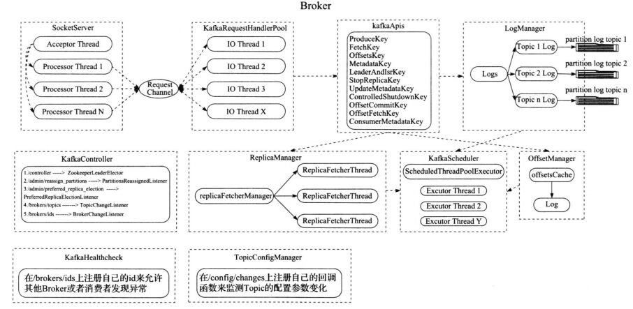

<h3><strong>二、Broker 结构</strong></h3>

1）

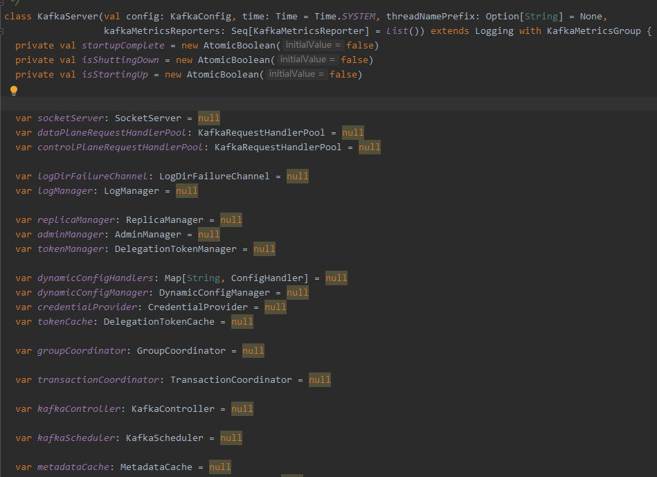

2）每个 borker 进程，都包含各个管理器，如 socketServer 网络处理，replicaManager 副本管理器，kafkaController 集群管理器，groupCoordinator 消息者数据管理器，LogManager 日志数据管理器，kafkaScheduler 定时器，zkClient 与 zookeeper 通信管理器，transactionCoordinator 事务协调器。

<h3><strong>三、通信框架</strong></h3>

1）

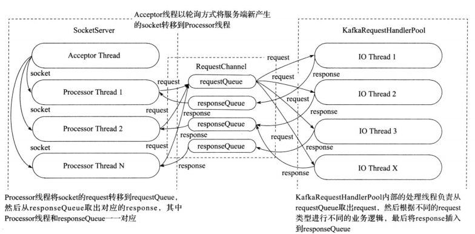

2）socketserver 会启动一个 acceptor 线程，用于接收和创建新 socket，并轮询安排给 processor thread 来处理后续的数据 io；

3）processor 接收到数据后包装成 request 请求放入单个 requestQueue 队列，并由多个 io 逻辑处理 thread 从 requestQueue 中取 request 处理；

4）根据 request 类型调用 kafkaapi 完成处理；

5）

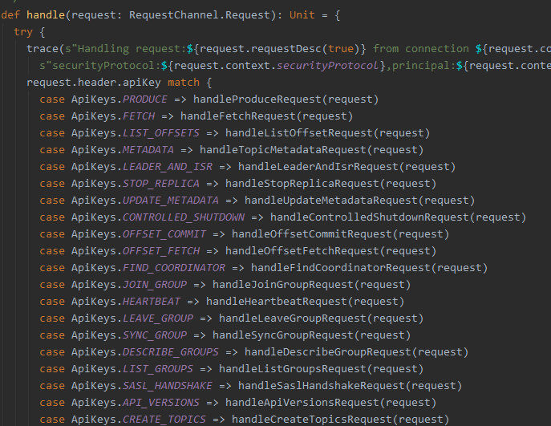

6）处理完请求后，封装成 reponse，根据 ProcessorID 放入对应的 responseQueue 由对应的 processor 线程完成回复。

<h3><strong>四、log 结构</strong></h3>

1）Topic、partition 和 replica 关系

2）

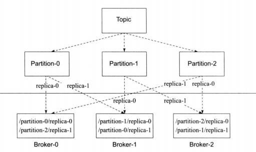

3）每个 topic 由很多个 partition 组成，由 key hash 值分配到不同的 partition，每个 partition 拥有多个副本 replica 做主从，确保数据的安全性。

4）每个 partition 或者 replica 由 log 存储数据，log 由 logsegment 组成，每个 logsegment 由索引文件和数据文件组成。

5）

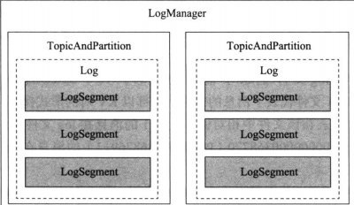

6）

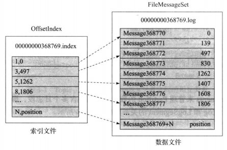

7）当在 Log 中需要查找获取一条消息时，会根据偏移首先定位到处于哪个 logsegment 文件，再根据索引文件定位，Logsegment 是由跳跃表组成的，便于搜索，再从数据文件读取消息；

8）

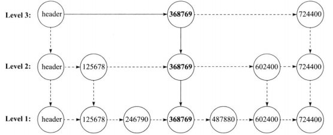

9）索引文件由 K,V 组成，K 是相对文件中第几条消息，V 是文件中的绝对位置，索引文件可以用来做二分查找，从索引文件中找到位置之后，再从数据文件中顺序查找，具体那条消息数据，为了避免索引文件太大，会相隔一定字节才写入一条索引；

10）每个 partition 会有多个 replica 进行同步，一个 Leader 多个 follower，这些副本主从地位是由 leader controller 负责处理，只有 leader replica 才能处理请求，其它 follower 同步数据。

<h3><strong>五、Controller</strong></h3>

1）每个 broker 都拥有一个 kafkacontroller，controller 主要负责管理整个集群，但是每个集群中都只有一个 leader controller 有资格来管理集群；

2）Leader controller 是借助 zookeeper 来选择的，每个 controller 初始化时都会向 zookeeper 注册竞争成为 leader 的路径的监听，第一个成功写入 zookeeper 的 controller 将会成为 leader，其它 controller 就会收到新 leader 的通知，将自己设为 follower；

3）当 controller 成为 leader 时，会向 zookeeper 注册相关监听； 4）

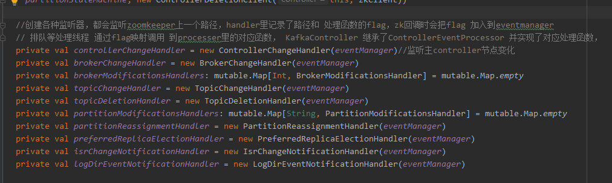

5）这些监听集群数据状态的变化，如 增加 topic partition replica 等，当监听到数据发生变化，leaderController 就会得到通知并处理，处理完成后会同步相关数据给其它 followerController；

6）controller 是以单工作线程形式运行的，其它请求通过封装为 job 投递到 controller 处理线程； 7）

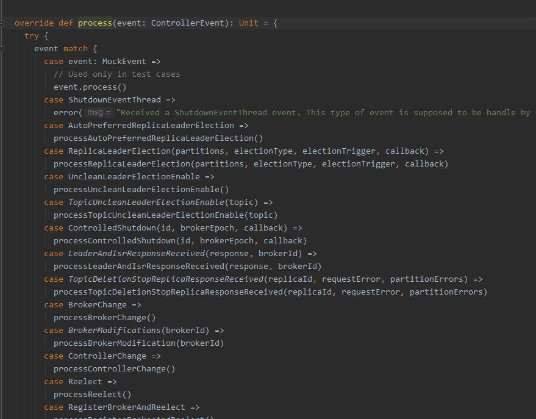

8）borker 上下线、副本增加重分配、topic 增加等，通过 zookeeper 通知并创建 job 投入 job 队列等待工作线程处理；

9）集群所有的元数据是存放在 zookeeper 上，当 zookeeper 数据发生变化时，通过通知到 leaderController，controller 处理数据，并在内存中保存一份副本，做差值处理。

<h3><strong>六、replica 管理</strong></h3>

1）所有 partition 都有多个 replica 来管理，这样使数据更安全，不容易丢失；

2）replica 的 leader follower 地位是由 leaderController 来管理的；

3）replica 有三种类型：无效的、已分配的（正在同步但是还没达到一致状态）和在线副本（正常同步的）；

4）replica 数据的同步是由 replicaManager 副本管理器来处理的，管理器会开启副本同步线程去 leader replica 抓取数据；

5）replica 下线时，leaderController 会收到 zookeeper 通知后会处理，如果是 leader replica 下线，则会重新选举，根据不同状态用不同选举策略选出新 Leader；

6）选 leader 有可能来自 replica 下线、需要改变 leader 或者为了负载均衡进行重分配。

<h3><strong>七、groupCoordinator 消费数据管理</strong></h3>

1）

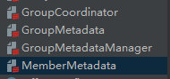

2）GroupCoordinator 提供访问消费者数据的接口，GroupMetadataManager 负责管理消费者组的数据，GroupMetadata 保存消费者组的数据，MemberMetadata 保存组里每个成员的数据；

3）Kafka 提供了两种存储消费者数据方式，一种是保存在 zookeeper 上，另一种是保存在 kafka log 系统中，由于 zookeeper 的频繁写性能不是很好，所以 kafka 提供保存的选择，也是默认选择；

4）用户需要访问消费者数据时，会通过 kafka client，随便找到一个比较空闲的 borker 通过其 GroupCoordinator，找到其 leader 副本所以在的地址，并返回给 client 去连接，只有 leader replica 才提供服务；

5）消费者数据是通过内置的一个写死的 topic 来管理，通过用户的（topic，partition，消费者组）做为内置的 topic 分区 hash 来保存到 log 中；

6）如用户加入、新增、删除消费者组信息时，会将创建消息保存致 Log 中，并在内存中运行生成数据存放于 2）中的数据结构。

<h3><strong>八、生产者发送数据</strong></h3>

1）生产者通过 topic 和 key 决定往哪个 partition 写入数据；

2）生产者需要携带 ack 用来决定应该什么时候回复，分别有 0,1,-1，当为 0 时说明不需要回复，当为 1 时表示集群接收了就回复，当为-1 时需要所有 isr（正常同步的）都接收确认了才能回复，接收数据后，会将这条消息存入延迟执行队列，当检测其它 isr 来抓取数据时，会更新并检查是否可以回复生产者。

<h3><strong>九、transactionCoordinator 事务处理</strong></h3>

1）kafka 支持事务操作，并支持消费者设定 read_commited 和 read_uncommited 读取级别；

2）用户提交的事务 log 会保存在内置写死的 topic 中，跟消费者数据相似的方法，依赖 replica 保证数据安全，执行的操作也会正常保存进消息 log（非事务 log），不过会有标志标示消息状态，如正在事务中还没提交，或者已经废弃还是提交了；

3）消费者数据中会记录当前已经完成事务处理的 Log 最大偏移量叫 LSO，即此偏移量前的数据要么是已经事务提交的，要么是事务放弃的；

4）通过 LSO 保证读已提交的消费者不会读到还没提交的事务数据；

5）kafka 当用户回滚事务时，会记录回滚信息至放弃 Log 跟事务 Log 一样由 replica 管理，这里面记录的信息是一个 log 偏移区域内的 produceid 集合（由 kafka 生成的全局唯一 ID），在消费者抓取数据时，携带过去，消费者可以利用这个数据过滤掉放弃的事务；

6）当用户提交事务时，事务协调器就会通知各个对应的 topic 所在的 borker 提交数据。

                    

                    

                        

                            <a href="Java魔法类：Unsafe应用解析.md">上一页</a>
                        

                        

                            <a href="Kafka、ActiveMQ、RabbitMQ、RocketMQ&#32;区别以及高可用原理.md">下一页</a>
                        

                    

                

            

        

    

    

</body>
<!-- Global site tag (gtag.js) - Google Analytics -->

</html>
