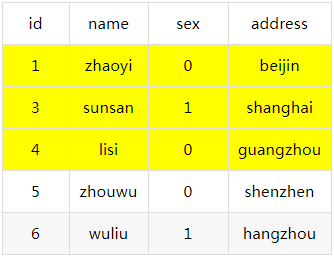
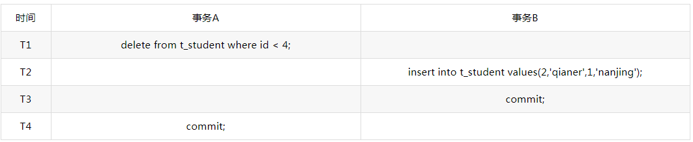

<!DOCTYPE html>
<!-- saved from url=(0046)https://kaiiiz.github.io/hexo-theme-book-demo/ -->
<html xmlns="http://www.w3.org/1999/xhtml">
<head>
    <head>
        <meta http-equiv="Content-Type" content="text/html; charset=UTF-8">
        <meta name="viewport" content="width=device-width, initial-scale=1, maximum-scale=1.0, user-scalable=no">
        <link rel="icon" href="../static/favicon.png">
        <title>MySQL共享锁、排他锁、悲观锁、乐观锁.md</title>
        <!-- Spectre.css framework -->
        <link rel="stylesheet" href="../static/index.css">
        <!-- theme css & js -->
        <meta name="generator" content="Hexo 4.2.0">
    </head>

<body>

    

        

            <a href="../index.html">
                
                技术文章摘抄
            </a>
        

        

            <ul class="uncollapsible">
                <li><a href="../index.html" class="current-tab">首页</a></li>
            </ul>

            <ul class="uncollapsible">
                <li><a href="../index.html">上一级</a></li>
            </ul>

            <ul class="uncollapsible">
                <li>

                    
                    <a href="AQS&#32;万字图文全面解析.md">AQS 万字图文全面解析.md</a>

                </li>
                <li>

                    
                    <a href="Docker&#32;镜像构建原理及源码分析.md">Docker 镜像构建原理及源码分析.md</a>

                </li>
                <li>

                    
                    <a href="ElasticSearch&#32;小白从入门到精通.md">ElasticSearch 小白从入门到精通.md</a>

                </li>
                <li>

                    
                    <a href="JVM&#32;CPU&#32;Profiler技术原理及源码深度解析.md">JVM CPU Profiler技术原理及源码深度解析.md</a>

                </li>
                <li>

                    
                    <a href="JVM&#32;垃圾收集器.md">JVM 垃圾收集器.md</a>

                </li>
                <li>

                    
                    <a href="JVM&#32;面试的&#32;30&#32;个知识点.md">JVM 面试的 30 个知识点.md</a>

                </li>
                <li>

                    
                    <a href="Java&#32;IO&#32;体系、线程模型大总结.md">Java IO 体系、线程模型大总结.md</a>

                </li>
                <li>

                    
                    <a href="Java&#32;面试题集锦（网络篇）.md">Java 面试题集锦（网络篇）.md</a>

                </li>
                <li>

                    
                    <a href="Java-直接内存&#32;DirectMemory&#32;详解.md">Java-直接内存 DirectMemory 详解.md</a>

                </li>
                <li>

                    
                    <a href="Java中的SPI.md">Java中的SPI.md</a>

                </li>
                <li>

                    
                    <a href="Java中的ThreadLocal.md">Java中的ThreadLocal.md</a>

                </li>
                <li>

                    
                    <a href="Java线程池实现原理及其在美团业务中的实践.md">Java线程池实现原理及其在美团业务中的实践.md</a>

                </li>
                <li>

                    
                    <a href="Java魔法类：Unsafe应用解析.md">Java魔法类：Unsafe应用解析.md</a>

                </li>
                <li>

                    
                    <a href="Kafka&#32;源码阅读笔记.md">Kafka 源码阅读笔记.md</a>

                </li>
                <li>

                    
                    <a href="Kafka、ActiveMQ、RabbitMQ、RocketMQ&#32;区别以及高可用原理.md">Kafka、ActiveMQ、RabbitMQ、RocketMQ 区别以及高可用原理.md</a>

                </li>
                <li>

                    
                    <a href="MySQL&#32;·&#32;引擎特性&#32;·&#32;InnoDB&#32;Buffer&#32;Pool.md">MySQL · 引擎特性 · InnoDB Buffer Pool.md</a>

                </li>
                <li>

                    
                    <a href="MySQL&#32;·&#32;引擎特性&#32;·&#32;InnoDB&#32;IO子系统.md">MySQL · 引擎特性 · InnoDB IO子系统.md</a>

                </li>
                <li>

                    
                    <a href="MySQL&#32;·&#32;引擎特性&#32;·&#32;InnoDB&#32;事务系统.md">MySQL · 引擎特性 · InnoDB 事务系统.md</a>

                </li>
                <li>

                    
                    <a href="MySQL&#32;·&#32;引擎特性&#32;·&#32;InnoDB&#32;同步机制.md">MySQL · 引擎特性 · InnoDB 同步机制.md</a>

                </li>
                <li>

                    
                    <a href="MySQL&#32;·&#32;引擎特性&#32;·&#32;InnoDB&#32;数据页解析.md">MySQL · 引擎特性 · InnoDB 数据页解析.md</a>

                </li>
                <li>

                    
                    <a href="MySQL&#32;·&#32;引擎特性&#32;·&#32;InnoDB崩溃恢复.md">MySQL · 引擎特性 · InnoDB崩溃恢复.md</a>

                </li>
                <li>

                    
                    <a href="MySQL&#32;·&#32;引擎特性&#32;·&#32;临时表那些事儿.md">MySQL · 引擎特性 · 临时表那些事儿.md</a>

                </li>
                <li>

                    
                    <a href="MySQL&#32;主从复制&#32;半同步复制.md">MySQL 主从复制 半同步复制.md</a>

                </li>
                <li>

                    
                    <a href="MySQL&#32;主从复制&#32;基于GTID复制.md">MySQL 主从复制 基于GTID复制.md</a>

                </li>
                <li>

                    
                    <a href="MySQL&#32;主从复制.md">MySQL 主从复制.md</a>

                </li>
                <li>

                    
                    <a href="MySQL&#32;事务日志(redo&#32;log和undo&#32;log).md">MySQL 事务日志(redo log和undo log).md</a>

                </li>
                <li>

                    
                    <a href="MySQL&#32;亿级别数据迁移实战代码分享.md">MySQL 亿级别数据迁移实战代码分享.md</a>

                </li>
                <li>

                    
                    <a href="MySQL&#32;从一条数据说起-InnoDB行存储数据结构.md">MySQL 从一条数据说起-InnoDB行存储数据结构.md</a>

                </li>
                <li>

                    
                    <a href="MySQL&#32;地基基础：事务和锁的面纱.md">MySQL 地基基础：事务和锁的面纱.md</a>

                </li>
                <li>

                    
                    <a href="MySQL&#32;地基基础：数据字典.md">MySQL 地基基础：数据字典.md</a>

                </li>
                <li>

                    
                    <a href="MySQL&#32;地基基础：数据库字符集.md">MySQL 地基基础：数据库字符集.md</a>

                </li>
                <li>

                    
                    <a href="MySQL&#32;性能优化：碎片整理.md">MySQL 性能优化：碎片整理.md</a>

                </li>
                <li>

                    
                    <a href="MySQL&#32;故障诊断：一个&#32;ALTER&#32;TALBE&#32;执行了很久，你慌不慌？.md">MySQL 故障诊断：一个 ALTER TALBE 执行了很久，你慌不慌？.md</a>

                </li>
                <li>

                    
                    <a href="MySQL&#32;故障诊断：如何在日志中轻松定位大事务.md">MySQL 故障诊断：如何在日志中轻松定位大事务.md</a>

                </li>
                <li>

                    
                    <a href="MySQL&#32;故障诊断：教你快速定位加锁的&#32;SQL.md">MySQL 故障诊断：教你快速定位加锁的 SQL.md</a>

                </li>
                <li>

                    
                    <a href="MySQL&#32;日志详解.md">MySQL 日志详解.md</a>

                </li>
                <li>

                    
                    <a href="MySQL&#32;的半同步是什么？.md">MySQL 的半同步是什么？.md</a>

                </li>
                <li>

                    
                    <a href="MySQL中的事务和MVCC.md">MySQL中的事务和MVCC.md</a>

                </li>
                <li>

                    
                    <a href="MySQL事务_事务隔离级别详解.md">MySQL事务_事务隔离级别详解.md</a>

                </li>
                <li>

                    
                    <a href="MySQL优化：优化&#32;select&#32;count().md">MySQL优化：优化 select count().md</a>

                </li>
                <li>

                    <a class="current-tab" href="MySQL共享锁、排他锁、悲观锁、乐观锁.md">MySQL共享锁、排他锁、悲观锁、乐观锁.md</a>
                    

                </li>
                <li>

                    
                    <a href="MySQL的MVCC（多版本并发控制）.md">MySQL的MVCC（多版本并发控制）.md</a>

                </li>
                <li>

                    
                    <a href="QingStor&#32;对象存储架构设计及最佳实践.md">QingStor 对象存储架构设计及最佳实践.md</a>

                </li>
                <li>

                    
                    <a href="RocketMQ&#32;面试题集锦.md">RocketMQ 面试题集锦.md</a>

                </li>
                <li>

                    
                    <a href="SnowFlake&#32;雪花算法生成分布式&#32;ID.md">SnowFlake 雪花算法生成分布式 ID.md</a>

                </li>
                <li>

                    
                    <a href="Spring&#32;Boot&#32;2.x&#32;结合&#32;k8s&#32;实现分布式微服务架构.md">Spring Boot 2.x 结合 k8s 实现分布式微服务架构.md</a>

                </li>
                <li>

                    
                    <a href="Spring&#32;Boot&#32;教程：如何开发一个&#32;starter.md">Spring Boot 教程：如何开发一个 starter.md</a>

                </li>
                <li>

                    
                    <a href="Spring&#32;MVC&#32;原理.md">Spring MVC 原理.md</a>

                </li>
                <li>

                    
                    <a href="Spring&#32;MyBatis和Spring整合的奥秘.md">Spring MyBatis和Spring整合的奥秘.md</a>

                </li>
                <li>

                    
                    <a href="Spring&#32;帮助你更好的理解Spring循环依赖.md">Spring 帮助你更好的理解Spring循环依赖.md</a>

                </li>
                <li>

                    
                    <a href="Spring&#32;循环依赖及解决方式.md">Spring 循环依赖及解决方式.md</a>

                </li>
                <li>

                    
                    <a href="Spring中眼花缭乱的BeanDefinition.md">Spring中眼花缭乱的BeanDefinition.md</a>

                </li>
                <li>

                    
                    <a href="Vert.x&#32;基础入门.md">Vert.x 基础入门.md</a>

                </li>
                <li>

                    
                    <a href="eBay&#32;的&#32;Elasticsearch&#32;性能调优实践.md">eBay 的 Elasticsearch 性能调优实践.md</a>

                </li>
                <li>

                    
                    <a href="不可不说的Java“锁”事.md">不可不说的Java“锁”事.md</a>

                </li>
                <li>

                    
                    <a href="互联网并发限流实战.md">互联网并发限流实战.md</a>

                </li>
                <li>

                    
                    <a href="从ReentrantLock的实现看AQS的原理及应用.md">从ReentrantLock的实现看AQS的原理及应用.md</a>

                </li>
                <li>

                    
                    <a href="从SpringCloud开始，聊微服务架构.md">从SpringCloud开始，聊微服务架构.md</a>

                </li>
                <li>

                    
                    <a href="全面了解&#32;JDK&#32;线程池实现原理.md">全面了解 JDK 线程池实现原理.md</a>

                </li>
                <li>

                    
                    <a href="分布式一致性理论与算法.md">分布式一致性理论与算法.md</a>

                </li>
                <li>

                    
                    <a href="分布式一致性算法&#32;Raft.md">分布式一致性算法 Raft.md</a>

                </li>
                <li>

                    
                    <a href="分布式唯一&#32;ID&#32;解析.md">分布式唯一 ID 解析.md</a>

                </li>
                <li>

                    
                    <a href="分布式链路追踪：集群管理设计.md">分布式链路追踪：集群管理设计.md</a>

                </li>
                <li>

                    
                    <a href="动态代理种类及原理，你知道多少？.md">动态代理种类及原理，你知道多少？.md</a>

                </li>
                <li>

                    
                    <a href="响应式架构与&#32;RxJava&#32;在有赞零售的实践.md">响应式架构与 RxJava 在有赞零售的实践.md</a>

                </li>
                <li>

                    
                    <a href="大数据算法——布隆过滤器.md">大数据算法——布隆过滤器.md</a>

                </li>
                <li>

                    
                    <a href="如何设计一个亿级消息量的&#32;IM&#32;系统.md">如何设计一个亿级消息量的 IM 系统.md</a>

                </li>
                <li>

                    
                    <a href="异步网络模型.md">异步网络模型.md</a>

                </li>
                <li>

                    
                    <a href="当我们在讨论CQRS时，我们在讨论些神马？.md">当我们在讨论CQRS时，我们在讨论些神马？.md</a>

                </li>
                <li>

                    
                    <a href="彻底理解&#32;MySQL&#32;的索引机制.md">彻底理解 MySQL 的索引机制.md</a>

                </li>
                <li>

                    
                    <a href="最全的&#32;116&#32;道&#32;Redis&#32;面试题解答.md">最全的 116 道 Redis 面试题解答.md</a>

                </li>
                <li>

                    
                    <a href="有赞权限系统(SAM).md">有赞权限系统(SAM).md</a>

                </li>
                <li>

                    
                    <a href="有赞零售中台建设方法的探索与实践.md">有赞零售中台建设方法的探索与实践.md</a>

                </li>
                <li>

                    
                    <a href="服务注册与发现原理剖析（Eureka、Zookeeper、Nacos）.md">服务注册与发现原理剖析（Eureka、Zookeeper、Nacos）.md</a>

                </li>
                <li>

                    
                    <a href="深入浅出Cache.md">深入浅出Cache.md</a>

                </li>
                <li>

                    
                    <a href="深入理解&#32;MySQL&#32;底层实现.md">深入理解 MySQL 底层实现.md</a>

                </li>
                <li>

                    
                    <a href="漫画讲解&#32;git&#32;rebase&#32;VS&#32;git&#32;merge.md">漫画讲解 git rebase VS git merge.md</a>

                </li>
                <li>

                    
                    <a href="生成浏览器唯一稳定&#32;ID&#32;的探索.md">生成浏览器唯一稳定 ID 的探索.md</a>

                </li>
                <li>

                    
                    <a href="缓存&#32;如何保证缓存与数据库的双写一致性？.md">缓存 如何保证缓存与数据库的双写一致性？.md</a>

                </li>
                <li>

                    
                    <a href="网易严选怎么做全链路监控的？.md">网易严选怎么做全链路监控的？.md</a>

                </li>
                <li>

                    
                    <a href="美团万亿级&#32;KV&#32;存储架构与实践.md">美团万亿级 KV 存储架构与实践.md</a>

                </li>
                <li>

                    
                    <a href="美团点评Kubernetes集群管理实践.md">美团点评Kubernetes集群管理实践.md</a>

                </li>
                <li>

                    
                    <a href="解读《阿里巴巴&#32;Java&#32;开发手册》背后的思考.md">解读《阿里巴巴 Java 开发手册》背后的思考.md</a>

                </li>
                <li>

                    
                    <a href="认识&#32;MySQL&#32;和&#32;Redis&#32;的数据一致性问题.md">认识 MySQL 和 Redis 的数据一致性问题.md</a>

                </li>
                <li>

                    
                    <a href="进阶：Dockerfile&#32;高阶使用指南及镜像优化.md">进阶：Dockerfile 高阶使用指南及镜像优化.md</a>

                </li>
                <li>

                    
                    <a href="铁总在用的高性能分布式缓存计算框架&#32;Geode.md">铁总在用的高性能分布式缓存计算框架 Geode.md</a>

                </li>
                <li>

                    
                    <a href="阿里云PolarDB及其共享存储PolarFS技术实现分析（上）.md">阿里云PolarDB及其共享存储PolarFS技术实现分析（上）.md</a>

                </li>
                <li>

                    
                    <a href="阿里云PolarDB及其共享存储PolarFS技术实现分析（下）.md">阿里云PolarDB及其共享存储PolarFS技术实现分析（下）.md</a>

                </li>
                <li>

                    
                    <a href="面试最常被问的&#32;Java&#32;后端题.md">面试最常被问的 Java 后端题.md</a>

                </li>
                <li>

                    
                    <a href="领域驱动设计在互联网业务开发中的实践.md">领域驱动设计在互联网业务开发中的实践.md</a>

                </li>
                <li>

                    
                    <a href="领域驱动设计的菱形对称架构.md">领域驱动设计的菱形对称架构.md</a>

                </li>
                <li>

                    
                    <a href="高效构建&#32;Docker&#32;镜像的最佳实践.md">高效构建 Docker 镜像的最佳实践.md</a>

                </li>
            </ul>

        

    

    

        

    

    

    

        

            

                

                    <!-- For Responsive Layout -->
                    <header class="navbar">
                        <section class="navbar-section">
                            <a onclick="open_sidebar()">
                                <i class="icon icon-menu"></i>
                            </a>
                        </section>
                    </header>
                

                

                    

                        

                        
<h1>MySQL共享锁、排他锁、悲观锁、乐观锁</h1>

<strong>一、相关名词</strong>

　　|--表级锁（锁定整个表）

　　|--页级锁（锁定一页）

　　|--行级锁（锁定一行）

　　|--共享锁（S锁，MyISAM 叫做读锁）

　　|--排他锁（X锁，MyISAM 叫做写锁）

　　|--间隙锁（NEXT-KEY锁）

　　|--悲观锁（抽象性，不真实存在这个锁）

　　|--乐观锁（抽象性，不真实存在这个锁）

<strong>二、InnoDB与MyISAM</strong>

　　Mysql 在5.5之前默认使用 MyISAM 存储引擎，之后使用 InnoDB 。查看当前存储引擎：

<pre><code>show variables like '%storage_engine%';
</code></pre>

　　MyISAM 操作数据都是使用的表锁，你更新一条记录就要锁整个表，导致性能较低，并发不高。当然同时它也不会存在死锁问题。

　　而 InnoDB 与 MyISAM 的最大不同有两点：<strong>一是 InnoDB 支持事务；二是 InnoDB 采用了行级锁</strong>。也就是你需要修改哪行，就可以只锁定哪行。

　　在 Mysql 中，行级锁并不是直接锁记录，而是锁索引。索引分为主键索引和非主键索引两种，如果一条sql 语句操作了主键索引，Mysql 就会锁定这条主键索引；如果一条语句操作了非主键索引，MySQL会先锁定该非主键索引，再锁定相关的主键索引。

　　InnoDB 行锁是通过给索引项加锁实现的，如果没有索引，InnoDB 会通过隐藏的聚簇索引来对记录加锁。也就是说：如果不通过索引条件检索数据，那么InnoDB将对表中所有数据加锁，实际效果跟表锁一样。因为没有了索引，找到某一条记录就得扫描全表，要扫描全表，就得锁定表。

<strong>三、共享锁与排他锁</strong>

　1.首先说明：数据库的<strong>增删改</strong>操作默认都会加<strong>排他锁</strong>，而查询不会加任何锁。

　　mysql InnoDB引擎默认的修改数据语句，<strong>update</strong>,<strong>delete</strong>,<strong>insert</strong>都会自动给涉及到的数据加上<strong>排他锁</strong>，<strong>select</strong>语句默认不会加任何锁类型，如果加排他锁可以使用select ...for update语句，加共享锁可以使用select ... lock in share mode语句。所以加过排他锁的数据行在其他事务种是不能修改数据的，也不能通过for update和lock in share mode锁的方式查询数据，但可以直接通过select ...from...查询数据，因为普通查询没有任何锁机制。

　　<strong>|--共享锁</strong>：对某一资源加共享锁，自身可以读该资源，其他人也可以读该资源（也可以再继续加共享锁，即 共享锁可多个共存），但无法修改。要想修改就必须等所有共享锁都释放完之后。语法为：

<pre><code>select * from table lock in share mode
</code></pre>

　　<strong>|--排他锁</strong>：对某一资源加排他锁，自身可以进行增删改查，其他人无法进行任何操作。语法为：

<pre><code>select * from table for update
</code></pre>

　2.下面援引例子说明 （援自：<a href="http://blog.csdn.net/samjustin1/article/details/52210125">http://blog.csdn.net/samjustin1/article/details/52210125</a>）：

　　<em>这里用T1代表一个数据库执行请求，T2代表另一个请求，也可以理解为T1为一个线程，T2 为另一个线程。</em>

例1：

　　T1:  <em>select * from table lock in share mode</em>（假设查询会花很长时间，下面的例子也都这么假设）

　　T2:  <em>update table set column1='hello'</em>

　　过程：

　　　　T1运行（并加共享锁)

　　　　T2运行

　　　　if T1还没执行完

　　　　T2等......

　　　　else 锁被释放

　　　　T2执行

　　　　end if

　　T2 之所以要等，是因为 T2 在执行 update 前，试图对 table 表加一个排他锁，而数据库规定同一资源上不能同时共存共享锁和排他锁。所以 T2 必须等 T1 执行完，释放了共享锁，才能加上排他锁，然后才能开始执行 update 语句。

例2：

　　T1:  select * from table lock in share mode

　　T2:  select * from table lock in share mode

　这里T2不用等待T1执行完，而是可以马上执行。

分析：

　　T1运行，则 table 被加锁，比如叫lockA，T2运行，再对 table 加一个共享锁，比如叫lockB，两个锁是可以同时存在于同一资源上的（比如同一个表上）。这被称为共享锁与共享锁兼容。这意味着共享锁不阻止其它人同时读资源，但阻止其它人修改资源。

例3：

　　T1:  <em>select * from table lock in share mode</em>

　　T2:  <em>select * from table lock in share mode</em>

　　T3:  <em>update table set column1='hello'</em>

　T2 不用等 T1 运行完就能运行，T3 却要等 T1 和 T2 都运行完才能运行。因为 T3 必须等 T1 和 T2 的共享锁全部释放才能进行加排他锁然后执行 update 操作。

例4 （死锁的发生）：

　　T1:begin tran

​     　　select * from table lock in share mode

​     　　update table set column1='hello'

　　T2:begin tran

​     　　select * from table lock in share mode

​     　　update table set column1='world'

　　假设 T1 和 T2 同时达到 select，T1 对 table 加共享锁，T2 也对 table 加共享锁，当 T1 的 select 执行完，准备执行 update 时，根据锁机制，T1 的共享锁需要升级到排他锁才能执行接下来的 update。在升级排他锁前，必须等 table 上的其它共享锁（T2）释放，同理，T2 也在等 T1 的共享锁释放。于是死锁产生了。

例5：

　　T1:<em>begin tran</em>

​     　　<em>update table set column1='hello' where id=10</em>

　　T2:<em>begin tran</em>

​     　　<em>update table set column1='world' where id=20</em>

　这种语句虽然最为常见，很多人觉得它有机会产生死锁，但实际上要看情况

　　|--如果id是主键（默认有主键索引），那么T1会一下子找到该条记录(id=10的记录），然后对该条记录加排他锁，T2，同样，一下子通过索引定位到记录，然后对id=20的记录加排他锁，这样T1和T2各更新各的，互不影响。T2也不需要等。

　　|--如果id是普通的一列，没有索引。那么当T1对id=10这一行加排他锁后，T2为了找到id=20，需要对全表扫描。但因为T1已经为一条记录加了排他锁，导致T2的全表扫描进行不下去（其实是因为T1加了排他锁，数据库默认会为该表加意向锁，T2要扫描全表，就得等该意向锁释放，也就是T1执行完成），就导致T2等待。

死锁怎么解决呢？一种办法是，如下：

例6：

　　T1:begin tran

​     　　select * from table for update

​     　　update table set column1='hello'

　　T2:begin tran

​     　　select * from table for update

​     　　update table set column1='world'

　　这样，当 T1 的 select 执行时，直接对表加上了排他锁，T2 在执行 select 时，就需要等 T1 事物完全执行完才能执行。排除了死锁发生。但当第三个 user 过来想执行一个查询语句时，也因为排他锁的存在而不得不等待，第四个、第五个 user 也会因此而等待。在大并发情况下，让大家等待显得性能就太友好了。

　　所以，有些数据库这里引入了更新锁（如Mssql，注意：Mysql不存在更新锁）。

例7：

T1:begin tran

​     select * from table [加更新锁操作]

​     update table set column1='hello'

T2:begin tran

​     select * from table [加更新锁操作]

​     update table set column1='world'

　　更新锁其实就可以看成排他锁的一种变形，只是它也允许其他人读（并且还允许加共享锁）。但不允许其他操作，除非我释放了更新锁。T1 执行 select，加更新锁。T2 运行，准备加更新锁，但发现已经有一个更新锁在那儿了，只好等。当后来有 user3、user4...需要查询 table 表中的数据时，并不会因为 T1 的 select 在执行就被阻塞，照样能查询，相比起例6，这提高了效率。

后面还有意向锁和计划锁：

　　计划锁，和程序员关系不大，就没去了解。
　　意向锁（innodb特有）分意向共享锁和意向排他锁。
　　意向共享锁：表示事务获取行共享锁时，必须先得获取该表的意向共享锁；
　　意向排他锁：表示事务获取行排他锁时，必须先得获取该表的意向排他锁；
　我们知道，如果要对整个表加锁，需保证该表内目前不存在任何锁。

　　因此，如果需要对整个表加锁，那么就可以根据：检查意向锁是否被占用，来知道表内目前是否存在共享锁或排他锁了。而不需要再一行行地去检查每一行是否被加锁。

<strong>四、乐观锁与悲观锁</strong>

　　首先说明，乐观锁和悲观锁都是针对读（select）来说的。

　案例：

　　某商品，用户购买后库存数应-1，而某两个或多个用户同时购买，此时三个执行程序均同时读得库存为“n”，之后进行了一些操作，最后将均执行update table set 库存数=n-1，那么，很显然这是错误的。

解决：

　使用悲观锁（其实说白了也就是排他锁）

　　|-- 程序A在查询库存数时使用排他锁（select * from table where id=10 for update）

　　|-- 然后进行后续的操作，包括更新库存数，最后提交事务。

　　|-- 程序B在查询库存数时，如果A还未释放排他锁，它将等待……

　　|-- 程序C同B……
　使用乐观锁（靠表设计和代码来实现）

　　|-- 一般是在该商品表添加version版本字段或者timestamp时间戳字段

　　|-- 程序A查询后，执行更新变成了：
　　 update table set num=num-1 where id=10 and version=23

　　这样，保证了修改的数据是和它查询出来的数据是一致的（其他执行程序肯定未进行修改）。当然，如果更新失败，表示在更新操作之前，有其他执行程序已经更新了该库存数，那么就可以尝试重试来保证更新成功。为了尽可能避免更新失败，可以合理调整重试次数（阿里巴巴开发手册规定重试次数不低于三次）。
总结：对于以上，可以看得出来乐观锁和悲观锁的区别：

　　悲观锁实际使用了排他锁来实现（select **** for update）。文章开头说到，innodb加行锁的前提是：必须是通过索引条件来检索数据，否则会切换为表锁。

　　因此，悲观锁在未通过索引条件检索数据时，会锁定整张表。导致其他程序不允许“加锁的查询操作”，影响吞吐。故如果在查询居多的情况下，推荐使用乐观锁。

　　“加锁的查询操作”：加过排他锁的数据行在其他事务中是不能修改的，也不能通过for update或lock in share mode的加锁方式查询，但可以直接通过select ...from...查询数据，因为普通查询没有任何锁机制。
　　乐观锁更新有可能会失败，甚至是更新几次都失败，这是有风险的。所以如果写入居多，对吞吐要求不高，可使用悲观锁。
　　　也就是一句话：<strong>读用乐观锁，写用悲观锁</strong>。

<strong>间隙锁</strong>

　1.什么叫间隙锁
　　当我们用范围条件而不是相等条件检索数据，并请求共享或排他锁时，InnoDB会给符合条件的已有数据记录的索引项加锁；对于键值在条件范围内但不存在的记录，叫做“间隙(GAP)”，InnoDB也会对这个“间隙”加锁，这种锁机制就是所谓的间隙锁(NEXT-KEY)锁。

　2.间隙锁的产生
　　上面的文字很抽象，现在举个栗子，介绍间隙锁是怎么产生的：

假设有以下表t_student：（其中id为PK，name为非唯一索引）

　这个时候我们发出一条这样的加锁sql语句：

　　select id,name from t_student where id &gt; 0 and id &lt; 5 for update;

　这时候，我们命中的数据为以下着色部分：

　　细心的朋友可能就会发现，这里缺少了条id为2的记录，我们的重点就在这里。

　　select ... for update这条语句，是会对数据记录加锁的，这里因为命中了索引，加的是行锁。从数据记录来看，这里排它锁锁住数据是id为1、3和4的这3条数据。

　　但是，看看前面我们的介绍——对于键值在条件范围内但不存在的记录，叫做“间隙(GAP)”，InnoDB也会对这个“间隙”加锁。

　　好了，我们这里，键值在条件范围但是不存在的记录，就是id为2的记录，这里会对id为2数据加上间隙锁。假设这时候如果有id=2的记录insert进来了，是要等到这个事务结束以后才会执行的

　3.间隙锁的作用
　　　总的来说，有2个作用：防止幻读和防止数据误删/改

　　<strong>(1)防止幻读</strong>
　　　　关于幻读的概念可以参考这篇文章 https://blog.csdn.net/mweibiao/article/details/80805031 ，这里就不多做解释了

　假设有下面场景

　　如果没有间隙锁，事务A在T1和T4读到的结果是不一样的，有了间隙锁，读的就是一样的了

<h2>　　<strong>(2)防止数据误删/改</strong></h2>

　　　这个作用比较重要，假设以下场景：

　　这种情况下，如果没有间隙锁，会出现的问题是：id为2的记录，刚加进去，就被删除了，这种情况有时候对业务，是致命性的打击。加了间隙锁之后，由于insert语句要等待事务A执行完之后释放锁，避免了这种情况

　4.使用间隙锁的隐患
　最大的隐患就是性能问题

　　前面提到，假设这时候如果有id=2的记录insert进来了，是要等到这个事务结束以后才会执行的，假设是这种场景

　　这种情况，对插入的性能就有很大影响了，必须等到事务结束才能进行插入，性能大打折扣

　　更有甚者，如果间隙锁出现死锁的情况下，会更隐晦，更难定位

<strong>怎样避免死锁</strong> 　　

　　1、以固定的顺序访问表和行。比如两个更新数据的事务，事务A 更新数据的顺序 为1，2；事务B更新数据的顺序为2，1。这样更可能会造成死锁。

　　2、大事务拆小。大事务更倾向于死锁，如果业务允许，将大事务拆小。

　　3、在同一个事务中，尽可能做到一次锁定所需要的所有资源，减少死锁概率。

　　4、降低隔离级别。如果业务允许，将隔离级别调低也是较好的选择，比如将隔离级别从RR调整为RC，可以避免掉很多因为gap锁造成的死锁。

　　5、为表添加合理的索引。可以看到如果不走索引将会为表的每一行记录添加上锁，死锁的概率大大增大。

                    

                    

                        

                            <a href="MySQL优化：优化&#32;select&#32;count().md">上一页</a>
                        

                        

                            <a href="MySQL的MVCC（多版本并发控制）.md">下一页</a>
                        

                    

                

            

        

    

    

</body>
<!-- Global site tag (gtag.js) - Google Analytics -->

</html>
