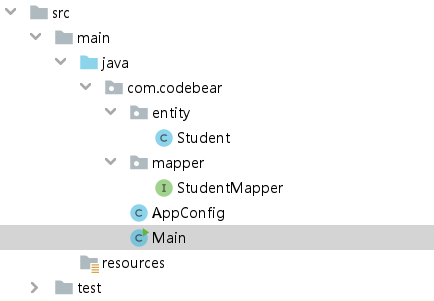
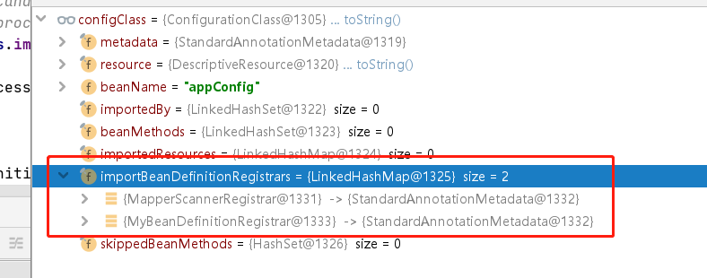

<!DOCTYPE html>
<!-- saved from url=(0046)https://kaiiiz.github.io/hexo-theme-book-demo/ -->
<html xmlns="http://www.w3.org/1999/xhtml">
<head>
    <head>
        <meta http-equiv="Content-Type" content="text/html; charset=UTF-8">
        <meta name="viewport" content="width=device-width, initial-scale=1, maximum-scale=1.0, user-scalable=no">
        <link rel="icon" href="../static/favicon.png">
        <title>Spring MyBatis和Spring整合的奥秘.md</title>
        <!-- Spectre.css framework -->
        <link rel="stylesheet" href="../static/index.css">
        <!-- theme css & js -->
        <meta name="generator" content="Hexo 4.2.0">
    </head>

<body>

    

        

            <a href="../index.html">
                
                技术文章摘抄
            </a>
        

        

            <ul class="uncollapsible">
                <li><a href="../index.html" class="current-tab">首页</a></li>
            </ul>

            <ul class="uncollapsible">
                <li><a href="../index.html">上一级</a></li>
            </ul>

            <ul class="uncollapsible">
                <li>

                    
                    <a href="AQS&#32;万字图文全面解析.md">AQS 万字图文全面解析.md</a>

                </li>
                <li>

                    
                    <a href="Docker&#32;镜像构建原理及源码分析.md">Docker 镜像构建原理及源码分析.md</a>

                </li>
                <li>

                    
                    <a href="ElasticSearch&#32;小白从入门到精通.md">ElasticSearch 小白从入门到精通.md</a>

                </li>
                <li>

                    
                    <a href="JVM&#32;CPU&#32;Profiler技术原理及源码深度解析.md">JVM CPU Profiler技术原理及源码深度解析.md</a>

                </li>
                <li>

                    
                    <a href="JVM&#32;垃圾收集器.md">JVM 垃圾收集器.md</a>

                </li>
                <li>

                    
                    <a href="JVM&#32;面试的&#32;30&#32;个知识点.md">JVM 面试的 30 个知识点.md</a>

                </li>
                <li>

                    
                    <a href="Java&#32;IO&#32;体系、线程模型大总结.md">Java IO 体系、线程模型大总结.md</a>

                </li>
                <li>

                    
                    <a href="Java&#32;面试题集锦（网络篇）.md">Java 面试题集锦（网络篇）.md</a>

                </li>
                <li>

                    
                    <a href="Java-直接内存&#32;DirectMemory&#32;详解.md">Java-直接内存 DirectMemory 详解.md</a>

                </li>
                <li>

                    
                    <a href="Java中的SPI.md">Java中的SPI.md</a>

                </li>
                <li>

                    
                    <a href="Java中的ThreadLocal.md">Java中的ThreadLocal.md</a>

                </li>
                <li>

                    
                    <a href="Java线程池实现原理及其在美团业务中的实践.md">Java线程池实现原理及其在美团业务中的实践.md</a>

                </li>
                <li>

                    
                    <a href="Java魔法类：Unsafe应用解析.md">Java魔法类：Unsafe应用解析.md</a>

                </li>
                <li>

                    
                    <a href="Kafka&#32;源码阅读笔记.md">Kafka 源码阅读笔记.md</a>

                </li>
                <li>

                    
                    <a href="Kafka、ActiveMQ、RabbitMQ、RocketMQ&#32;区别以及高可用原理.md">Kafka、ActiveMQ、RabbitMQ、RocketMQ 区别以及高可用原理.md</a>

                </li>
                <li>

                    
                    <a href="MySQL&#32;·&#32;引擎特性&#32;·&#32;InnoDB&#32;Buffer&#32;Pool.md">MySQL · 引擎特性 · InnoDB Buffer Pool.md</a>

                </li>
                <li>

                    
                    <a href="MySQL&#32;·&#32;引擎特性&#32;·&#32;InnoDB&#32;IO子系统.md">MySQL · 引擎特性 · InnoDB IO子系统.md</a>

                </li>
                <li>

                    
                    <a href="MySQL&#32;·&#32;引擎特性&#32;·&#32;InnoDB&#32;事务系统.md">MySQL · 引擎特性 · InnoDB 事务系统.md</a>

                </li>
                <li>

                    
                    <a href="MySQL&#32;·&#32;引擎特性&#32;·&#32;InnoDB&#32;同步机制.md">MySQL · 引擎特性 · InnoDB 同步机制.md</a>

                </li>
                <li>

                    
                    <a href="MySQL&#32;·&#32;引擎特性&#32;·&#32;InnoDB&#32;数据页解析.md">MySQL · 引擎特性 · InnoDB 数据页解析.md</a>

                </li>
                <li>

                    
                    <a href="MySQL&#32;·&#32;引擎特性&#32;·&#32;InnoDB崩溃恢复.md">MySQL · 引擎特性 · InnoDB崩溃恢复.md</a>

                </li>
                <li>

                    
                    <a href="MySQL&#32;·&#32;引擎特性&#32;·&#32;临时表那些事儿.md">MySQL · 引擎特性 · 临时表那些事儿.md</a>

                </li>
                <li>

                    
                    <a href="MySQL&#32;主从复制&#32;半同步复制.md">MySQL 主从复制 半同步复制.md</a>

                </li>
                <li>

                    
                    <a href="MySQL&#32;主从复制&#32;基于GTID复制.md">MySQL 主从复制 基于GTID复制.md</a>

                </li>
                <li>

                    
                    <a href="MySQL&#32;主从复制.md">MySQL 主从复制.md</a>

                </li>
                <li>

                    
                    <a href="MySQL&#32;事务日志(redo&#32;log和undo&#32;log).md">MySQL 事务日志(redo log和undo log).md</a>

                </li>
                <li>

                    
                    <a href="MySQL&#32;亿级别数据迁移实战代码分享.md">MySQL 亿级别数据迁移实战代码分享.md</a>

                </li>
                <li>

                    
                    <a href="MySQL&#32;从一条数据说起-InnoDB行存储数据结构.md">MySQL 从一条数据说起-InnoDB行存储数据结构.md</a>

                </li>
                <li>

                    
                    <a href="MySQL&#32;地基基础：事务和锁的面纱.md">MySQL 地基基础：事务和锁的面纱.md</a>

                </li>
                <li>

                    
                    <a href="MySQL&#32;地基基础：数据字典.md">MySQL 地基基础：数据字典.md</a>

                </li>
                <li>

                    
                    <a href="MySQL&#32;地基基础：数据库字符集.md">MySQL 地基基础：数据库字符集.md</a>

                </li>
                <li>

                    
                    <a href="MySQL&#32;性能优化：碎片整理.md">MySQL 性能优化：碎片整理.md</a>

                </li>
                <li>

                    
                    <a href="MySQL&#32;故障诊断：一个&#32;ALTER&#32;TALBE&#32;执行了很久，你慌不慌？.md">MySQL 故障诊断：一个 ALTER TALBE 执行了很久，你慌不慌？.md</a>

                </li>
                <li>

                    
                    <a href="MySQL&#32;故障诊断：如何在日志中轻松定位大事务.md">MySQL 故障诊断：如何在日志中轻松定位大事务.md</a>

                </li>
                <li>

                    
                    <a href="MySQL&#32;故障诊断：教你快速定位加锁的&#32;SQL.md">MySQL 故障诊断：教你快速定位加锁的 SQL.md</a>

                </li>
                <li>

                    
                    <a href="MySQL&#32;日志详解.md">MySQL 日志详解.md</a>

                </li>
                <li>

                    
                    <a href="MySQL&#32;的半同步是什么？.md">MySQL 的半同步是什么？.md</a>

                </li>
                <li>

                    
                    <a href="MySQL中的事务和MVCC.md">MySQL中的事务和MVCC.md</a>

                </li>
                <li>

                    
                    <a href="MySQL事务_事务隔离级别详解.md">MySQL事务_事务隔离级别详解.md</a>

                </li>
                <li>

                    
                    <a href="MySQL优化：优化&#32;select&#32;count().md">MySQL优化：优化 select count().md</a>

                </li>
                <li>

                    
                    <a href="MySQL共享锁、排他锁、悲观锁、乐观锁.md">MySQL共享锁、排他锁、悲观锁、乐观锁.md</a>

                </li>
                <li>

                    
                    <a href="MySQL的MVCC（多版本并发控制）.md">MySQL的MVCC（多版本并发控制）.md</a>

                </li>
                <li>

                    
                    <a href="QingStor&#32;对象存储架构设计及最佳实践.md">QingStor 对象存储架构设计及最佳实践.md</a>

                </li>
                <li>

                    
                    <a href="RocketMQ&#32;面试题集锦.md">RocketMQ 面试题集锦.md</a>

                </li>
                <li>

                    
                    <a href="SnowFlake&#32;雪花算法生成分布式&#32;ID.md">SnowFlake 雪花算法生成分布式 ID.md</a>

                </li>
                <li>

                    
                    <a href="Spring&#32;Boot&#32;2.x&#32;结合&#32;k8s&#32;实现分布式微服务架构.md">Spring Boot 2.x 结合 k8s 实现分布式微服务架构.md</a>

                </li>
                <li>

                    
                    <a href="Spring&#32;Boot&#32;教程：如何开发一个&#32;starter.md">Spring Boot 教程：如何开发一个 starter.md</a>

                </li>
                <li>

                    
                    <a href="Spring&#32;MVC&#32;原理.md">Spring MVC 原理.md</a>

                </li>
                <li>

                    <a class="current-tab" href="Spring&#32;MyBatis和Spring整合的奥秘.md">Spring MyBatis和Spring整合的奥秘.md</a>
                    

                </li>
                <li>

                    
                    <a href="Spring&#32;帮助你更好的理解Spring循环依赖.md">Spring 帮助你更好的理解Spring循环依赖.md</a>

                </li>
                <li>

                    
                    <a href="Spring&#32;循环依赖及解决方式.md">Spring 循环依赖及解决方式.md</a>

                </li>
                <li>

                    
                    <a href="Spring中眼花缭乱的BeanDefinition.md">Spring中眼花缭乱的BeanDefinition.md</a>

                </li>
                <li>

                    
                    <a href="Vert.x&#32;基础入门.md">Vert.x 基础入门.md</a>

                </li>
                <li>

                    
                    <a href="eBay&#32;的&#32;Elasticsearch&#32;性能调优实践.md">eBay 的 Elasticsearch 性能调优实践.md</a>

                </li>
                <li>

                    
                    <a href="不可不说的Java“锁”事.md">不可不说的Java“锁”事.md</a>

                </li>
                <li>

                    
                    <a href="互联网并发限流实战.md">互联网并发限流实战.md</a>

                </li>
                <li>

                    
                    <a href="从ReentrantLock的实现看AQS的原理及应用.md">从ReentrantLock的实现看AQS的原理及应用.md</a>

                </li>
                <li>

                    
                    <a href="从SpringCloud开始，聊微服务架构.md">从SpringCloud开始，聊微服务架构.md</a>

                </li>
                <li>

                    
                    <a href="全面了解&#32;JDK&#32;线程池实现原理.md">全面了解 JDK 线程池实现原理.md</a>

                </li>
                <li>

                    
                    <a href="分布式一致性理论与算法.md">分布式一致性理论与算法.md</a>

                </li>
                <li>

                    
                    <a href="分布式一致性算法&#32;Raft.md">分布式一致性算法 Raft.md</a>

                </li>
                <li>

                    
                    <a href="分布式唯一&#32;ID&#32;解析.md">分布式唯一 ID 解析.md</a>

                </li>
                <li>

                    
                    <a href="分布式链路追踪：集群管理设计.md">分布式链路追踪：集群管理设计.md</a>

                </li>
                <li>

                    
                    <a href="动态代理种类及原理，你知道多少？.md">动态代理种类及原理，你知道多少？.md</a>

                </li>
                <li>

                    
                    <a href="响应式架构与&#32;RxJava&#32;在有赞零售的实践.md">响应式架构与 RxJava 在有赞零售的实践.md</a>

                </li>
                <li>

                    
                    <a href="大数据算法——布隆过滤器.md">大数据算法——布隆过滤器.md</a>

                </li>
                <li>

                    
                    <a href="如何设计一个亿级消息量的&#32;IM&#32;系统.md">如何设计一个亿级消息量的 IM 系统.md</a>

                </li>
                <li>

                    
                    <a href="异步网络模型.md">异步网络模型.md</a>

                </li>
                <li>

                    
                    <a href="当我们在讨论CQRS时，我们在讨论些神马？.md">当我们在讨论CQRS时，我们在讨论些神马？.md</a>

                </li>
                <li>

                    
                    <a href="彻底理解&#32;MySQL&#32;的索引机制.md">彻底理解 MySQL 的索引机制.md</a>

                </li>
                <li>

                    
                    <a href="最全的&#32;116&#32;道&#32;Redis&#32;面试题解答.md">最全的 116 道 Redis 面试题解答.md</a>

                </li>
                <li>

                    
                    <a href="有赞权限系统(SAM).md">有赞权限系统(SAM).md</a>

                </li>
                <li>

                    
                    <a href="有赞零售中台建设方法的探索与实践.md">有赞零售中台建设方法的探索与实践.md</a>

                </li>
                <li>

                    
                    <a href="服务注册与发现原理剖析（Eureka、Zookeeper、Nacos）.md">服务注册与发现原理剖析（Eureka、Zookeeper、Nacos）.md</a>

                </li>
                <li>

                    
                    <a href="深入浅出Cache.md">深入浅出Cache.md</a>

                </li>
                <li>

                    
                    <a href="深入理解&#32;MySQL&#32;底层实现.md">深入理解 MySQL 底层实现.md</a>

                </li>
                <li>

                    
                    <a href="漫画讲解&#32;git&#32;rebase&#32;VS&#32;git&#32;merge.md">漫画讲解 git rebase VS git merge.md</a>

                </li>
                <li>

                    
                    <a href="生成浏览器唯一稳定&#32;ID&#32;的探索.md">生成浏览器唯一稳定 ID 的探索.md</a>

                </li>
                <li>

                    
                    <a href="缓存&#32;如何保证缓存与数据库的双写一致性？.md">缓存 如何保证缓存与数据库的双写一致性？.md</a>

                </li>
                <li>

                    
                    <a href="网易严选怎么做全链路监控的？.md">网易严选怎么做全链路监控的？.md</a>

                </li>
                <li>

                    
                    <a href="美团万亿级&#32;KV&#32;存储架构与实践.md">美团万亿级 KV 存储架构与实践.md</a>

                </li>
                <li>

                    
                    <a href="美团点评Kubernetes集群管理实践.md">美团点评Kubernetes集群管理实践.md</a>

                </li>
                <li>

                    
                    <a href="解读《阿里巴巴&#32;Java&#32;开发手册》背后的思考.md">解读《阿里巴巴 Java 开发手册》背后的思考.md</a>

                </li>
                <li>

                    
                    <a href="认识&#32;MySQL&#32;和&#32;Redis&#32;的数据一致性问题.md">认识 MySQL 和 Redis 的数据一致性问题.md</a>

                </li>
                <li>

                    
                    <a href="进阶：Dockerfile&#32;高阶使用指南及镜像优化.md">进阶：Dockerfile 高阶使用指南及镜像优化.md</a>

                </li>
                <li>

                    
                    <a href="铁总在用的高性能分布式缓存计算框架&#32;Geode.md">铁总在用的高性能分布式缓存计算框架 Geode.md</a>

                </li>
                <li>

                    
                    <a href="阿里云PolarDB及其共享存储PolarFS技术实现分析（上）.md">阿里云PolarDB及其共享存储PolarFS技术实现分析（上）.md</a>

                </li>
                <li>

                    
                    <a href="阿里云PolarDB及其共享存储PolarFS技术实现分析（下）.md">阿里云PolarDB及其共享存储PolarFS技术实现分析（下）.md</a>

                </li>
                <li>

                    
                    <a href="面试最常被问的&#32;Java&#32;后端题.md">面试最常被问的 Java 后端题.md</a>

                </li>
                <li>

                    
                    <a href="领域驱动设计在互联网业务开发中的实践.md">领域驱动设计在互联网业务开发中的实践.md</a>

                </li>
                <li>

                    
                    <a href="领域驱动设计的菱形对称架构.md">领域驱动设计的菱形对称架构.md</a>

                </li>
                <li>

                    
                    <a href="高效构建&#32;Docker&#32;镜像的最佳实践.md">高效构建 Docker 镜像的最佳实践.md</a>

                </li>
            </ul>

        

    

    

        

    

    

    

        

            

                

                    <!-- For Responsive Layout -->
                    <header class="navbar">
                        <section class="navbar-section">
                            <a onclick="open_sidebar()">
                                <i class="icon icon-menu"></i>
                            </a>
                        </section>
                    </header>
                

                

                    

                        

                        
<h1>Spring MyBatis和Spring整合的奥秘</h1>

<em>本篇博客源码分析基于Spring 5.1.16.RELEASE，mybatis-spring 2.0.0，较高版本的mybatis-spring源码有较大区别。</em>

Spring之所以是目前Java最受欢迎的框架，几乎所有的Java项目都在使用，就是因为它良好的生态，很多技术可以与之整合，为什么其他技术可以和Spring相整合，就是因为Spring拥有很多扩展点，阅读Spring源码，有一部分原因就是有必要清楚的知道Spring提供了哪些扩展点，而怎么合理的利用这些扩展点，就需要了解其他技术是如何利用这些扩展点的。

今天我就来带着大家看下，国内最流行的数据库框架MyBatis是如何利用Spring的扩展点的，从而双剑合璧，让Spring+MyBatis成为国内最流行的技术搭配。

<h3>前置知识</h3>

为了后面的故事可以顺利展开，很有必要先给大家介绍下，阅读mybatis-spring源码的前置知识，没有这些前置知识阅读mybatis-spring源码是寸步难行。

<h4>mybatis-spring使用</h4>

因为现在有了SpringBoot，所以Mybatis和Spring的整合变得非常简单，但是如果没有SpringBoot，该怎么整合呢？我翻阅了百度的前几页，不知道是不是搜索关键词问题，几乎全是用XML的方式去整合Mybatis和Spring的，零XML配置，它不香吗？

代码结构：

具体实现：

<pre><code> &lt;dependencies&gt;
        &lt;dependency&gt;
            &lt;groupId&gt;org.mybatis&lt;/groupId&gt;
            &lt;artifactId&gt;mybatis-spring&lt;/artifactId&gt;
            &lt;version&gt;2.0.0&lt;/version&gt;
        &lt;/dependency&gt;
        &lt;!-- https://mvnrepository.com/artifact/org.springframework/spring-context --&gt;
        &lt;dependency&gt;
        &lt;groupId&gt;org.springframework&lt;/groupId&gt;
            &lt;artifactId&gt;spring-context&lt;/artifactId&gt;
            &lt;version&gt;5.1.16.RELEASE&lt;/version&gt;
        &lt;/dependency&gt;
        &lt;!-- https://mvnrepository.com/artifact/org.mybatis/mybatis --&gt;
        &lt;dependency&gt;
            &lt;groupId&gt;org.mybatis&lt;/groupId&gt;
            &lt;artifactId&gt;mybatis&lt;/artifactId&gt;
            &lt;version&gt;3.4.0&lt;/version&gt;
        &lt;/dependency&gt;
        &lt;!-- https://mvnrepository.com/artifact/org.springframework/spring-jdbc --&gt;
        &lt;dependency&gt;
            &lt;groupId&gt;org.springframework&lt;/groupId&gt;
            &lt;artifactId&gt;spring-jdbc&lt;/artifactId&gt;
            &lt;version&gt;5.1.10.RELEASE&lt;/version&gt;
        &lt;/dependency&gt;
        &lt;!-- https://mvnrepository.com/artifact/mysql/mysql-connector-java --&gt;
        &lt;dependency&gt;
            &lt;groupId&gt;mysql&lt;/groupId&gt;
            &lt;artifactId&gt;mysql-connector-java&lt;/artifactId&gt;
            &lt;version&gt;6.0.5&lt;/version&gt;
        &lt;/dependency&gt;
    &lt;/dependencies&gt;
@MapperScan(&quot;com.codebear.mapper&quot;)
@ComponentScan
public class AppConfig {
    @Bean
    public SqlSessionFactory sqlSessionFactory() throws Exception {
        DriverManagerDataSource dataSource = new DriverManagerDataSource();
        dataSource.setDriverClassName(&quot;com.mysql.jdbc.Driver&quot;);
        dataSource.setUrl(&quot;jdbc:mysql://localhost:3306/test?useUnicode=true&amp;characterEncoding=UTF-8&amp;serverTimezone=UTC&quot;);
        dataSource.setUsername(&quot;root&quot;);
        dataSource.setPassword(&quot;123456&quot;);
        SqlSessionFactoryBean factoryBean = new SqlSessionFactoryBean();
        factoryBean.setDataSource(dataSource);
        return factoryBean.getObject();
    }
}
@Repository
public interface StudentMapper {
    @Select(&quot;select * from student&quot;)
    List&lt;Student&gt; getList();
}
public class Main {
    public static void main(String[] args) {
        ApplicationContext applicationContext = new AnnotationConfigApplicationContext(AppConfig.class);
        System.out.println(applicationContext.getBean(StudentMapper.class).getList());
    }
}
</code></pre>

运行结果：

<pre><code>[Student{id=1, name='疫苗王', age=20}, Student{id=2, name='阿修罗独角仙', age=18}, Student{id=3, name='地底王', age=18}]
</code></pre>
<h4>Import注解</h4>

如果我们想把一个类注册到Spring容器中，可以采用的方法有很多，其中一种是利用Import注解，Import注解有三种用法，mybatis-spring利用的是其中一种用法，Import了ImportBeanDefinitionRegistrar类，所以我们这里只看Import ImportBeanDefinitionRegistrar。

<h5>如何使用</h5>
<pre><code>public class MyBeanDefinitionRegistrar implements ImportBeanDefinitionRegistrar {
    public void registerBeanDefinitions(AnnotationMetadata annotationMetadata, BeanDefinitionRegistry beanDefinitionRegistry) {
        System.out.println(annotationMetadata.getAnnotationTypes());
    }
}
</code></pre>

写一个类实现ImportBeanDefinitionRegistrar ，重写其中的registerBeanDefinitions方法。

<pre><code>@Import(MyBeanDefinitionRegistrar.class)
@ComponentScan
@MapperScan(&quot;com.codebear.mapper&quot;)
public class AppConfig {
    @Bean
    public SqlSessionFactory sqlSessionFactory() throws Exception {
        DriverManagerDataSource dataSource = new DriverManagerDataSource();
        dataSource.setDriverClassName(&quot;com.mysql.jdbc.Driver&quot;);
        dataSource.setUrl(&quot;jdbc:mysql://localhost:3306/test?useUnicode=true&amp;characterEncoding=UTF-8&amp;serverTimezone=UTC&quot;);
        dataSource.setUsername(&quot;root&quot;);
        dataSource.setPassword(&quot;123456&quot;);
        SqlSessionFactoryBean factoryBean = new SqlSessionFactoryBean();
        factoryBean.setDataSource(dataSource);
        return factoryBean.getObject();
    }
}
</code></pre>

在配置上加上@Import注解，写上刚才写的MyBeanDefinitionRegistrar类。

运行结果：

<pre><code>[org.springframework.context.annotation.Import, org.springframework.context.annotation.ComponentScan, org.mybatis.spring.annotation.MapperScan]
</code></pre>

从registerBeanDefinitions两个入参的命名来看，第一个参数，Spring把注解元数据给你了，而第二个参数，Spring是直接把beanDefinition的注册器给你了。

<h5>追本溯源</h5>

下面我们来看看Spring在什么时候处理@Import注解的，又是什么时候调用registerBeanDefinitions方法的，当然这里不是Spring源码分析，我不会详细一行行翻译，而是简单的找到源头。

<pre><code>//AnnotationConfigApplicationContext#AnnotationConfigApplicationContext(Class&lt;?&gt;... componentClasses)
	public AnnotationConfigApplicationContext(Class&lt;?&gt;... componentClasses) {
		this();
		register(componentClasses);
		refresh();
	}
</code></pre>

进入第三行的refresh()方法。

refresh方法做了很多事情，我们只需要关心invokeBeanFactoryPostProcessors方法：

<pre><code>//AbstractApplicationContext#refresh
invokeBeanFactoryPostProcessors(beanFactory);
</code></pre>

执行invokeBeanFactoryPostProcessors方法，顾名思义，这个方法是执行BeanFactoryPostProcessor的。什么，你不知道什么是BeanFactoryPostProcessor？你可以简单的理解为Spring遵循插件化式的开发，其中有一个插件叫ConfigurationClassPostProcessor，实现了BeanDefinitionRegistryPostProcessor，同时BeanDefinitionRegistryPostProcessor又实现了BeanFactoryPostProcessor，通过ConfigurationClassPostProcessor的postProcessBeanDefinitionRegistry的方法，Spring完成了扫描。

<pre><code>//PostProcessorRegistrationDelegate#invokeBeanFactoryPostProcessors
invokeBeanDefinitionRegistryPostProcessors(currentRegistryProcessors, registry);
</code></pre>

这一步传入了BeanDefinitionRegistryPostProcessor的集合，要执行BeanDefinitionRegistryPostProcessor的postProcessBeanDefinitionRegistry方法，集合有一个元素是我们关心的，就是上面提到的ConfigurationClassPostProcessor。

<pre><code>//PostProcessorRegistrationDelegate#invokeBeanDefinitionRegistryPostProcessors
for (BeanDefinitionRegistryPostProcessor postProcessor : postProcessors) {
			postProcessor.postProcessBeanDefinitionRegistry(registry);
}
</code></pre>

循环传入的BeanDefinitionRegistryPostProcessor集合，调用postProcessBeanDefinitionRegistry方法，我们直接进入到ConfigurationClassPostProcessor的processConfigBeanDefinitions方法，找到关键解析代码：

<pre><code>//ConfigurationClassPostProcessor#processConfigBeanDefinitions
parser.parse(candidates);
//ConfigurationClassParser#parse
parse(((AnnotatedBeanDefinition) bd).getMetadata(), holder.getBeanName());
//ConfigurationClassParser#processConfigurationClass
doProcessConfigurationClass(configClass, sourceClass);
//ConfigurationClassParser#doProcessConfigurationClass
processImports(configClass, sourceClass, getImports(sourceClass), true);
</code></pre>

重点来了，终于找到了我们的目标：处理@Import注解。

<pre><code>//ConfigurationClassParser#processImports
configClass.addImportBeanDefinitionRegistrar(registrar, currentSourceClass.getMetadata());
//ConfigurationClass#addImportBeanDefinitionRegistrar
this.importBeanDefinitionRegistrars.put(registrar, importingClassMetadata);
</code></pre>

这个importBeanDefinitionRegistrars就是一个Map：

<pre><code>//ConfigurationClass
private final Map&lt;ImportBeanDefinitionRegistrar, AnnotationMetadata&gt; importBeanDefinitionRegistrars = new LinkedHashMap&lt;&gt;();
</code></pre>

让我们就监视下configClass：

可以看到我们写的MyBeanDefinitionRegistrar被放入了importBeanDefinitionRegistrars ，我们需要记住这个集合，至于还有一个什么，这里不用关心，当然，聪明的小伙伴肯定知道这是什么了。

我们写的MyBeanDefinitionRegistrar只是被放入了一个Map，并没有执行，下面我们要找找它是在哪里执行的。

我们需要回到ConfigurationClassPostProcessor的processConfigBeanDefinitions方法：

<pre><code>//ConfigurationClassPostProcessor#processConfigBeanDefinitions
this.reader.loadBeanDefinitions(configClasses);
//ConfigurationClassBeanDefinitionReader#loadBeanDefinitions
loadBeanDefinitionsForConfigurationClass(configClass, trackedConditionEvaluator);
//ConfigurationClassBeanDefinitionReader#loadBeanDefinitionsForConfigurationClass
loadBeanDefinitionsFromRegistrars(configClass.getImportBeanDefinitionRegistrars());
</code></pre>

这个集合是不是有点眼熟，就是我在上面让大家记住的集合，这个集合就存放着我们的写的MyBeanDefinitionRegistrar类，让我们继续点进去：

<pre><code>//ConfigurationClassBeanDefinitionReader#loadBeanDefinitionsFromRegistrars
	private void loadBeanDefinitionsFromRegistrars(Map&lt;ImportBeanDefinitionRegistrar, AnnotationMetadata&gt; registrars) {
		registrars.forEach((registrar, metadata) -&gt;
				registrar.registerBeanDefinitions(metadata, this.registry));
	}
</code></pre>

循环传入的ImportBeanDefinitionRegistrar集合，调用registerBeanDefinitions方法，我的天，终于找到执行方法了。

<h4>FactoryBean</h4>

Spring就像是一个魔术师的袋子，而FactoryBean就是被魔术师装进袋子的香蕉，当魔术师打开袋子，发现香蕉变成鸽子了。

<h5>如何使用</h5>
<pre><code>@Component
public class MyFactoryBean implements FactoryBean&lt;Teacher&gt; {
    public Teacher getObject() {
        Teacher teacher = new Teacher();
        teacher.setName(&quot;琦玉老师&quot;);
        return teacher;
    }

    public Class&lt;?&gt; getObjectType() {
        return Teacher.class;
    }
}
public class Main {
    public static void main(String[] args) {
        ApplicationContext applicationContext = new AnnotationConfigApplicationContext(AppConfig.class);
        System.out.println(applicationContext.getBean(MyFactoryBean.class));
        System.out.println(applicationContext.getBean(Teacher.class));

        System.out.println(applicationContext.getBean(&quot;&amp;myFactoryBean&quot;));
        System.out.println(applicationContext.getBean(&quot;myFactoryBean&quot;));

        System.out.println(applicationContext.getBean(&quot;myFactoryBean&quot;).hashCode());
        System.out.println(applicationContext.getBean(&quot;myFactoryBean&quot;).hashCode());
    }
}
</code></pre>

运行结果：

<pre><code><a href="../cdn-cgi/l/email-protection" class="__cf_email__" data-cfemail="9af9f5f7b4f9f5fefff8fffbe8b4d7e3dcfbf9eef5e8e3d8fffbf4daaeffffa8aaa9fff8">[email&#160;protected]</a>
Teacher{name='琦玉老师'}
<a href="../cdn-cgi/l/email-protection" class="__cf_email__" data-cfemail="395a5654175a565d5c5b5c584b1774407f585a4d564b407b5c5857790d5c5c0b090a5c5b">[email&#160;protected]</a>
Teacher{name='琦玉老师'}
442125849
442125849
</code></pre>

可以很清楚的看到从FactoryBean里面又生产出了一个Bean，生产出来的Bean就是FactoryBean中getObject方法返回的。

<h5>追本溯源</h5>

和上面一样，我们也要看看FactoryBean中的getObject是在哪里执行的，我们先来做个试验：

我们在getObject里面加上一句打印的代码：

<pre><code>@Component
public class MyFactoryBean implements FactoryBean&lt;Teacher&gt; {
    public Teacher getObject() {
        System.out.println(&quot;getObject&quot;);
        Teacher teacher = new Teacher();
        teacher.setName(&quot;琦玉老师&quot;);
        return teacher;
    }

    public Class&lt;?&gt; getObjectType() {
        return Teacher.class;
    }
}
</code></pre>

然后只保留main方法中的创建ApplicationContext方法：

<pre><code>public class Main {
    public static void main(String[] args) {
        ApplicationContext applicationContext = new AnnotationConfigApplicationContext(AppConfig.class);
    }
}
</code></pre>

运行后，你会发现，控制台没有任何输出，我们大胆的猜想，FactoryBean生产出来的Bean并不是预先加载的，而是采用懒加载的机制，也就是只有需要，才会去加载。

我们继续改下main方法：

<pre><code>    public static void main(String[] args) {
        ApplicationContext applicationContext = new AnnotationConfigApplicationContext(AppConfig.class);
        System.out.println(applicationContext.getBean(Teacher.class));
    }
</code></pre>

运行结果：

<pre><code>getObject
Teacher{name='琦玉老师'}
</code></pre>

所以我们的猜想是正确的，这次入口是getBean。

下面还是枯燥无味的寻找，这次的寻找之旅更复杂：

<pre><code>//org.springframework.beans.factory.support.DefaultListableBeanFactory#getBean(java.lang.Class&lt;T&gt;)
public &lt;T&gt; T getBean(Class&lt;T&gt; requiredType) throws BeansException {
		return getBean(requiredType, (Object[]) null);
}
// org.springframework.beans.factory.support.DefaultListableBeanFactory#getBean(java.lang.Class&lt;T&gt;, java.lang.Object...)
Object resolved = resolveBean(ResolvableType.forRawClass(requiredType), args, false);
//org.springframework.beans.factory.support.DefaultListableBeanFactory#resolveBean
NamedBeanHolder&lt;T&gt; namedBean = resolveNamedBean(requiredType, args, nonUniqueAsNull);
//org.springframework.beans.factory.support.DefaultListableBeanFactory#resolveNamedBean(org.springframework.core.ResolvableType, java.lang.Object[], boolean)
String[] candidateNames = getBeanNamesForType(requiredType);
//org.springframework.beans.factory.support.DefaultListableBeanFactory#getBeanNamesForType(org.springframework.core.ResolvableType)
return getBeanNamesForType(resolved, true, true);
//org.springframework.beans.factory.support.DefaultListableBeanFactory#getBeanNamesForType(java.lang.Class&lt;?&gt;, boolean, boolean)
resolvedBeanNames = doGetBeanNamesForType(ResolvableType.forRawClass(type), includeNonSingletons, true);
</code></pre>

这个方法里面有一步是循环beanDefinitionNames，当循环到myFactoryBean的时候，判断这是一个FactoryBean：

<pre><code>boolean isFactoryBean = isFactoryBean(beanName, mbd);
</code></pre>

随后执行isTypeMatch(beanName, type)方法：

<pre><code>//org.springframework.beans.factory.support.AbstractBeanFactory#isTypeMatch(java.lang.String, org.springframework.core.ResolvableType)
Class&lt;?&gt; type = getTypeForFactoryBean((FactoryBean&lt;?&gt;) beanInstance);
//org.springframework.beans.factory.support.FactoryBeanRegistrySupport#getTypeForFactoryBean
return factoryBean.getObjectType();
</code></pre>

当执行到这里，我们写的MyFactoryBean的getObjectType方法被调用了，返回Teacher.class，而我们现在要找的也是Teacher.class，所以匹配。

随后回到DefaultListableBeanFactory#doGetBeanNamesForType，把beanName放入一个集合中：

<pre><code>if (matchFound) {
	result.add(beanName);
}
</code></pre>

随后返回集合。

再回到DefaultListableBeanFactory#resolveNamedBean，会判断返回出来的集合的元素的个数，显然只返回一个，执行

<pre><code>//org.springframework.beans.factory.support.DefaultListableBeanFactory#resolveNamedBean
		if (candidateNames.length == 1) {
			String beanName = candidateNames[0];
			return new NamedBeanHolder&lt;&gt;(beanName, (T) getBean(beanName, requiredType.toClass(), args));
		}
</code></pre>

继续点开getBean方法：

<pre><code>//org.springframework.beans.factory.support.AbstractBeanFactory#getBean(java.lang.String, java.lang.Class&lt;T&gt;, java.lang.Object...)
return doGetBean(name, requiredType, args, false);
//org.springframework.beans.factory.support.AbstractBeanFactory#doGetBean
bean = getObjectForBeanInstance(sharedInstance, name, beanName, null);
//org.springframework.beans.factory.support.AbstractBeanFactory#getObjectForBeanInstance
object = getObjectFromFactoryBean(factory, beanName, !synthetic);
//org.springframework.beans.factory.support.FactoryBeanRegistrySupport#getObjectFromFactoryBean
doGetObjectFromFactoryBean(factory, beanName);
//org.springframework.beans.factory.support.FactoryBeanRegistrySupport#doGetObjectFromFactoryBean
object = factory.getObject();
</code></pre>

直到这里，才执行了我们写的MyFactoryBean的getObject方法，拿到了我们返回的Teacher对象后。

因为有缓存机制如果我们再去拿，就不会再次调用getObject方法了，这个缓存机制就不再继续分析了，比较复杂，就算不了解也不影响我们今天的主题。

<h4>JDK动态代理</h4>

我以前写过JDK动态代理的博客，大家可以找来看一看 ，这里就不阐述了。

<h3>mybatis-spring源码分析</h3>

前置知识介绍完成，有了上面的前置知识，我们就可以一探MyBatis和Spring整合的奥秘。

Mybatis和Spring整合的入口很好找，就是我们再配置上添加的@MapperScan注解，当我们点开@MapperScan：

<pre><code>@Retention(RetentionPolicy.RUNTIME)
@Target(ElementType.TYPE)
@Documented
@Import(MapperScannerRegistrar.class)
@Repeatable(MapperScans.class)
public @interface MapperScan {
}
</code></pre>

你会发现一个很熟悉的注解，就是我们上面讲的Import注解，Import了MapperScannerRegistrar。

通过上面的源码分析明白，Spring会执行到registerBeanDefinitions方法：

<pre><code>@Override
  public void registerBeanDefinitions(AnnotationMetadata importingClassMetadata, BeanDefinitionRegistry registry) {
   // 拿到我们写的MapperScan注解上带的东西，我们写的，只有一个Value字段。
    AnnotationAttributes mapperScanAttrs = AnnotationAttributes
        .fromMap(importingClassMetadata.getAnnotationAttributes(MapperScan.class.getName()));
    if (mapperScanAttrs != null) {
      registerBeanDefinitions(mapperScanAttrs, registry);
    }
  }
</code></pre>

继续深入registerBeanDefinitions方法：

<pre><code>// 创建了一个扫描器，这个扫描器继承了Spring定义的扫描器：ClassPathBeanDefinitionScanner，
// 扫描的主要是主要作用就是扫描，把bean放到map中去
ClassPathMapperScanner scanner = new ClassPathMapperScanner(registry);
//省略
    basePackages.addAll(
        Arrays.stream(annoAttrs.getStringArray(&quot;value&quot;))
            .filter(StringUtils::hasText)
            .collect(Collectors.toList()));
//省略
    scanner.registerFilters();
    scanner.doScan(StringUtils.toStringArray(basePackages));
</code></pre>

这里主要是创建了一个扫描器，传入了一些规则。

scanner.registerFilters()中有一行代码，比较重要：

<pre><code>// mybatis定义的扫描器最终的扫描任务是交给Spring的扫描器执行的，
// Spring的扫描器中定义了includeFilters，只有符合规则的最终才可以被扫描出来，
// 这里意味着mybatis告诉spring，任何东西你都要给我扫描出来。
  addIncludeFilter((metadataReader, metadataReaderFactory) -&gt; true);
</code></pre>

让我们看下 scanner.doScan(StringUtils.toStringArray(basePackages))方法：

<pre><code> @Override
  public Set&lt;BeanDefinitionHolder&gt; doScan(String... basePackages) {
    //交给Spring执行扫描任务，返回beanDefinition、beanName的包装对象，这里就把我们 
    //@MapperScan注解中给定的com.codebear.mapper包中所有的内容都扫描
    //并且返回出来了。
    Set&lt;BeanDefinitionHolder&gt; beanDefinitions = super.doScan(basePackages);

    if (beanDefinitions.isEmpty()) {
      LOGGER.warn(() -&gt; &quot;No MyBatis mapper was found in '&quot; + Arrays.toString(basePackages) + &quot;' package. Please check your configuration.&quot;);
    } else {
      processBeanDefinitions(beanDefinitions);
    }

    return beanDefinitions;
  }
</code></pre>

继续看processBeanDefinitions方法：

<pre><code>// 省略
 for (BeanDefinitionHolder holder : beanDefinitions) {
  definition.setBeanClass(this.mapperFactoryBean.getClass());
}
//省略
</code></pre>

这个循环中，有一行代码很是重要，把扫描出来的bean的BeanClass都设置成了mapperFactoryBean，这个mapperFactoryBean是何方神圣呢？没错，它就是我们上面分析过的FactoryBean，通过实验和分析，我们知道了最终产生的bean对象是FactoryBean中的getObject返回的对象。

<pre><code>  public T getObject() throws Exception {
    return getSqlSession().getMapper(this.mapperInterface);
  }
 public SqlSession getSqlSession() {
    return this.sqlSessionTemplate;
  }
//org.mybatis.spring.SqlSessionTemplate#getMapper
  public &lt;T&gt; T getMapper(Class&lt;T&gt; type) {
    return getConfiguration().getMapper(type, this);
  }
//org.apache.ibatis.binding.MapperRegistry#getMapper
    public &lt;T&gt; T getMapper(Class&lt;T&gt; type, SqlSession sqlSession) {
        MapperProxyFactory&lt;T&gt; mapperProxyFactory = (MapperProxyFactory)this.knownMappers.get(type);
        if (mapperProxyFactory == null) {
            throw new BindingException(&quot;Type &quot; + type + &quot; is not known to the MapperRegistry.&quot;);
        } else {
            try {
                return mapperProxyFactory.newInstance(sqlSession);
            } catch (Exception var5) {
                throw new BindingException(&quot;Error getting mapper instance. Cause: &quot; + var5, var5);
            }
        }
    }
//org.apache.ibatis.binding.MapperProxyFactory#newInstance(org.apache.ibatis.session.SqlSession)
//sqlSession是SqlSessionTemplate
    public T newInstance(SqlSession sqlSession) {
// 这里需要用到JDK动态代理的知识，传入了SqlSessionTemplate，Mapper类（接口）
        MapperProxy&lt;T&gt; mapperProxy = new MapperProxy(sqlSession, this.mapperInterface, this.methodCache);
        return this.newInstance(mapperProxy);
    }
// 生成了代理对象
    protected T newInstance(MapperProxy&lt;T&gt; mapperProxy) {
        return Proxy.newProxyInstance(this.mapperInterface.getClassLoader(), new Class[]{this.mapperInterface}, mapperProxy);
    }
</code></pre>

最终我们调用代理对象的方法，会执行到MapperProxy的invoke方法：

<pre><code> public Object invoke(Object proxy, Method method, Object[] args) throws Throwable {
    if (Object.class.equals(method.getDeclaringClass())) {
      try {
        return method.invoke(this, args);
      } catch (Throwable t) {
        throw ExceptionUtil.unwrapThrowable(t);
      }
    }
    final MapperMethod mapperMethod = cachedMapperMethod(method);
    return mapperMethod.execute(sqlSession, args);
  }
</code></pre>

当我们点开mapperMethod.execute方法，你会觉得一切是那么的熟悉。

                    

                    

                        

                            <a href="Spring&#32;MVC&#32;原理.md">上一页</a>
                        

                        

                            <a href="Spring&#32;帮助你更好的理解Spring循环依赖.md">下一页</a>
                        

                    

                

            

        

    

    

</body>
<!-- Global site tag (gtag.js) - Google Analytics -->

</html>
