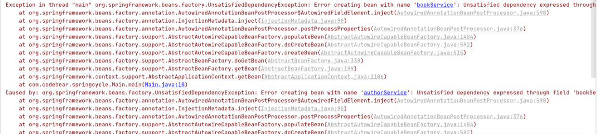

<!DOCTYPE html>
<!-- saved from url=(0046)https://kaiiiz.github.io/hexo-theme-book-demo/ -->
<html xmlns="http://www.w3.org/1999/xhtml">
<head>
    <head>
        <meta http-equiv="Content-Type" content="text/html; charset=UTF-8">
        <meta name="viewport" content="width=device-width, initial-scale=1, maximum-scale=1.0, user-scalable=no">
        <link rel="icon" href="../static/favicon.png">
        <title>Spring 帮助你更好的理解Spring循环依赖.md</title>
        <!-- Spectre.css framework -->
        <link rel="stylesheet" href="../static/index.css">
        <!-- theme css & js -->
        <meta name="generator" content="Hexo 4.2.0">
    </head>

<body>

    

        

            <a href="../index.html">
                
                技术文章摘抄
            </a>
        

        

            <ul class="uncollapsible">
                <li><a href="../index.html" class="current-tab">首页</a></li>
            </ul>

            <ul class="uncollapsible">
                <li><a href="../index.html">上一级</a></li>
            </ul>

            <ul class="uncollapsible">
                <li>

                    
                    <a href="AQS&#32;万字图文全面解析.md">AQS 万字图文全面解析.md</a>

                </li>
                <li>

                    
                    <a href="Docker&#32;镜像构建原理及源码分析.md">Docker 镜像构建原理及源码分析.md</a>

                </li>
                <li>

                    
                    <a href="ElasticSearch&#32;小白从入门到精通.md">ElasticSearch 小白从入门到精通.md</a>

                </li>
                <li>

                    
                    <a href="JVM&#32;CPU&#32;Profiler技术原理及源码深度解析.md">JVM CPU Profiler技术原理及源码深度解析.md</a>

                </li>
                <li>

                    
                    <a href="JVM&#32;垃圾收集器.md">JVM 垃圾收集器.md</a>

                </li>
                <li>

                    
                    <a href="JVM&#32;面试的&#32;30&#32;个知识点.md">JVM 面试的 30 个知识点.md</a>

                </li>
                <li>

                    
                    <a href="Java&#32;IO&#32;体系、线程模型大总结.md">Java IO 体系、线程模型大总结.md</a>

                </li>
                <li>

                    
                    <a href="Java&#32;面试题集锦（网络篇）.md">Java 面试题集锦（网络篇）.md</a>

                </li>
                <li>

                    
                    <a href="Java-直接内存&#32;DirectMemory&#32;详解.md">Java-直接内存 DirectMemory 详解.md</a>

                </li>
                <li>

                    
                    <a href="Java中的SPI.md">Java中的SPI.md</a>

                </li>
                <li>

                    
                    <a href="Java中的ThreadLocal.md">Java中的ThreadLocal.md</a>

                </li>
                <li>

                    
                    <a href="Java线程池实现原理及其在美团业务中的实践.md">Java线程池实现原理及其在美团业务中的实践.md</a>

                </li>
                <li>

                    
                    <a href="Java魔法类：Unsafe应用解析.md">Java魔法类：Unsafe应用解析.md</a>

                </li>
                <li>

                    
                    <a href="Kafka&#32;源码阅读笔记.md">Kafka 源码阅读笔记.md</a>

                </li>
                <li>

                    
                    <a href="Kafka、ActiveMQ、RabbitMQ、RocketMQ&#32;区别以及高可用原理.md">Kafka、ActiveMQ、RabbitMQ、RocketMQ 区别以及高可用原理.md</a>

                </li>
                <li>

                    
                    <a href="MySQL&#32;·&#32;引擎特性&#32;·&#32;InnoDB&#32;Buffer&#32;Pool.md">MySQL · 引擎特性 · InnoDB Buffer Pool.md</a>

                </li>
                <li>

                    
                    <a href="MySQL&#32;·&#32;引擎特性&#32;·&#32;InnoDB&#32;IO子系统.md">MySQL · 引擎特性 · InnoDB IO子系统.md</a>

                </li>
                <li>

                    
                    <a href="MySQL&#32;·&#32;引擎特性&#32;·&#32;InnoDB&#32;事务系统.md">MySQL · 引擎特性 · InnoDB 事务系统.md</a>

                </li>
                <li>

                    
                    <a href="MySQL&#32;·&#32;引擎特性&#32;·&#32;InnoDB&#32;同步机制.md">MySQL · 引擎特性 · InnoDB 同步机制.md</a>

                </li>
                <li>

                    
                    <a href="MySQL&#32;·&#32;引擎特性&#32;·&#32;InnoDB&#32;数据页解析.md">MySQL · 引擎特性 · InnoDB 数据页解析.md</a>

                </li>
                <li>

                    
                    <a href="MySQL&#32;·&#32;引擎特性&#32;·&#32;InnoDB崩溃恢复.md">MySQL · 引擎特性 · InnoDB崩溃恢复.md</a>

                </li>
                <li>

                    
                    <a href="MySQL&#32;·&#32;引擎特性&#32;·&#32;临时表那些事儿.md">MySQL · 引擎特性 · 临时表那些事儿.md</a>

                </li>
                <li>

                    
                    <a href="MySQL&#32;主从复制&#32;半同步复制.md">MySQL 主从复制 半同步复制.md</a>

                </li>
                <li>

                    
                    <a href="MySQL&#32;主从复制&#32;基于GTID复制.md">MySQL 主从复制 基于GTID复制.md</a>

                </li>
                <li>

                    
                    <a href="MySQL&#32;主从复制.md">MySQL 主从复制.md</a>

                </li>
                <li>

                    
                    <a href="MySQL&#32;事务日志(redo&#32;log和undo&#32;log).md">MySQL 事务日志(redo log和undo log).md</a>

                </li>
                <li>

                    
                    <a href="MySQL&#32;亿级别数据迁移实战代码分享.md">MySQL 亿级别数据迁移实战代码分享.md</a>

                </li>
                <li>

                    
                    <a href="MySQL&#32;从一条数据说起-InnoDB行存储数据结构.md">MySQL 从一条数据说起-InnoDB行存储数据结构.md</a>

                </li>
                <li>

                    
                    <a href="MySQL&#32;地基基础：事务和锁的面纱.md">MySQL 地基基础：事务和锁的面纱.md</a>

                </li>
                <li>

                    
                    <a href="MySQL&#32;地基基础：数据字典.md">MySQL 地基基础：数据字典.md</a>

                </li>
                <li>

                    
                    <a href="MySQL&#32;地基基础：数据库字符集.md">MySQL 地基基础：数据库字符集.md</a>

                </li>
                <li>

                    
                    <a href="MySQL&#32;性能优化：碎片整理.md">MySQL 性能优化：碎片整理.md</a>

                </li>
                <li>

                    
                    <a href="MySQL&#32;故障诊断：一个&#32;ALTER&#32;TALBE&#32;执行了很久，你慌不慌？.md">MySQL 故障诊断：一个 ALTER TALBE 执行了很久，你慌不慌？.md</a>

                </li>
                <li>

                    
                    <a href="MySQL&#32;故障诊断：如何在日志中轻松定位大事务.md">MySQL 故障诊断：如何在日志中轻松定位大事务.md</a>

                </li>
                <li>

                    
                    <a href="MySQL&#32;故障诊断：教你快速定位加锁的&#32;SQL.md">MySQL 故障诊断：教你快速定位加锁的 SQL.md</a>

                </li>
                <li>

                    
                    <a href="MySQL&#32;日志详解.md">MySQL 日志详解.md</a>

                </li>
                <li>

                    
                    <a href="MySQL&#32;的半同步是什么？.md">MySQL 的半同步是什么？.md</a>

                </li>
                <li>

                    
                    <a href="MySQL中的事务和MVCC.md">MySQL中的事务和MVCC.md</a>

                </li>
                <li>

                    
                    <a href="MySQL事务_事务隔离级别详解.md">MySQL事务_事务隔离级别详解.md</a>

                </li>
                <li>

                    
                    <a href="MySQL优化：优化&#32;select&#32;count().md">MySQL优化：优化 select count().md</a>

                </li>
                <li>

                    
                    <a href="MySQL共享锁、排他锁、悲观锁、乐观锁.md">MySQL共享锁、排他锁、悲观锁、乐观锁.md</a>

                </li>
                <li>

                    
                    <a href="MySQL的MVCC（多版本并发控制）.md">MySQL的MVCC（多版本并发控制）.md</a>

                </li>
                <li>

                    
                    <a href="QingStor&#32;对象存储架构设计及最佳实践.md">QingStor 对象存储架构设计及最佳实践.md</a>

                </li>
                <li>

                    
                    <a href="RocketMQ&#32;面试题集锦.md">RocketMQ 面试题集锦.md</a>

                </li>
                <li>

                    
                    <a href="SnowFlake&#32;雪花算法生成分布式&#32;ID.md">SnowFlake 雪花算法生成分布式 ID.md</a>

                </li>
                <li>

                    
                    <a href="Spring&#32;Boot&#32;2.x&#32;结合&#32;k8s&#32;实现分布式微服务架构.md">Spring Boot 2.x 结合 k8s 实现分布式微服务架构.md</a>

                </li>
                <li>

                    
                    <a href="Spring&#32;Boot&#32;教程：如何开发一个&#32;starter.md">Spring Boot 教程：如何开发一个 starter.md</a>

                </li>
                <li>

                    
                    <a href="Spring&#32;MVC&#32;原理.md">Spring MVC 原理.md</a>

                </li>
                <li>

                    
                    <a href="Spring&#32;MyBatis和Spring整合的奥秘.md">Spring MyBatis和Spring整合的奥秘.md</a>

                </li>
                <li>

                    <a class="current-tab" href="Spring&#32;帮助你更好的理解Spring循环依赖.md">Spring 帮助你更好的理解Spring循环依赖.md</a>
                    

                </li>
                <li>

                    
                    <a href="Spring&#32;循环依赖及解决方式.md">Spring 循环依赖及解决方式.md</a>

                </li>
                <li>

                    
                    <a href="Spring中眼花缭乱的BeanDefinition.md">Spring中眼花缭乱的BeanDefinition.md</a>

                </li>
                <li>

                    
                    <a href="Vert.x&#32;基础入门.md">Vert.x 基础入门.md</a>

                </li>
                <li>

                    
                    <a href="eBay&#32;的&#32;Elasticsearch&#32;性能调优实践.md">eBay 的 Elasticsearch 性能调优实践.md</a>

                </li>
                <li>

                    
                    <a href="不可不说的Java“锁”事.md">不可不说的Java“锁”事.md</a>

                </li>
                <li>

                    
                    <a href="互联网并发限流实战.md">互联网并发限流实战.md</a>

                </li>
                <li>

                    
                    <a href="从ReentrantLock的实现看AQS的原理及应用.md">从ReentrantLock的实现看AQS的原理及应用.md</a>

                </li>
                <li>

                    
                    <a href="从SpringCloud开始，聊微服务架构.md">从SpringCloud开始，聊微服务架构.md</a>

                </li>
                <li>

                    
                    <a href="全面了解&#32;JDK&#32;线程池实现原理.md">全面了解 JDK 线程池实现原理.md</a>

                </li>
                <li>

                    
                    <a href="分布式一致性理论与算法.md">分布式一致性理论与算法.md</a>

                </li>
                <li>

                    
                    <a href="分布式一致性算法&#32;Raft.md">分布式一致性算法 Raft.md</a>

                </li>
                <li>

                    
                    <a href="分布式唯一&#32;ID&#32;解析.md">分布式唯一 ID 解析.md</a>

                </li>
                <li>

                    
                    <a href="分布式链路追踪：集群管理设计.md">分布式链路追踪：集群管理设计.md</a>

                </li>
                <li>

                    
                    <a href="动态代理种类及原理，你知道多少？.md">动态代理种类及原理，你知道多少？.md</a>

                </li>
                <li>

                    
                    <a href="响应式架构与&#32;RxJava&#32;在有赞零售的实践.md">响应式架构与 RxJava 在有赞零售的实践.md</a>

                </li>
                <li>

                    
                    <a href="大数据算法——布隆过滤器.md">大数据算法——布隆过滤器.md</a>

                </li>
                <li>

                    
                    <a href="如何设计一个亿级消息量的&#32;IM&#32;系统.md">如何设计一个亿级消息量的 IM 系统.md</a>

                </li>
                <li>

                    
                    <a href="异步网络模型.md">异步网络模型.md</a>

                </li>
                <li>

                    
                    <a href="当我们在讨论CQRS时，我们在讨论些神马？.md">当我们在讨论CQRS时，我们在讨论些神马？.md</a>

                </li>
                <li>

                    
                    <a href="彻底理解&#32;MySQL&#32;的索引机制.md">彻底理解 MySQL 的索引机制.md</a>

                </li>
                <li>

                    
                    <a href="最全的&#32;116&#32;道&#32;Redis&#32;面试题解答.md">最全的 116 道 Redis 面试题解答.md</a>

                </li>
                <li>

                    
                    <a href="有赞权限系统(SAM).md">有赞权限系统(SAM).md</a>

                </li>
                <li>

                    
                    <a href="有赞零售中台建设方法的探索与实践.md">有赞零售中台建设方法的探索与实践.md</a>

                </li>
                <li>

                    
                    <a href="服务注册与发现原理剖析（Eureka、Zookeeper、Nacos）.md">服务注册与发现原理剖析（Eureka、Zookeeper、Nacos）.md</a>

                </li>
                <li>

                    
                    <a href="深入浅出Cache.md">深入浅出Cache.md</a>

                </li>
                <li>

                    
                    <a href="深入理解&#32;MySQL&#32;底层实现.md">深入理解 MySQL 底层实现.md</a>

                </li>
                <li>

                    
                    <a href="漫画讲解&#32;git&#32;rebase&#32;VS&#32;git&#32;merge.md">漫画讲解 git rebase VS git merge.md</a>

                </li>
                <li>

                    
                    <a href="生成浏览器唯一稳定&#32;ID&#32;的探索.md">生成浏览器唯一稳定 ID 的探索.md</a>

                </li>
                <li>

                    
                    <a href="缓存&#32;如何保证缓存与数据库的双写一致性？.md">缓存 如何保证缓存与数据库的双写一致性？.md</a>

                </li>
                <li>

                    
                    <a href="网易严选怎么做全链路监控的？.md">网易严选怎么做全链路监控的？.md</a>

                </li>
                <li>

                    
                    <a href="美团万亿级&#32;KV&#32;存储架构与实践.md">美团万亿级 KV 存储架构与实践.md</a>

                </li>
                <li>

                    
                    <a href="美团点评Kubernetes集群管理实践.md">美团点评Kubernetes集群管理实践.md</a>

                </li>
                <li>

                    
                    <a href="解读《阿里巴巴&#32;Java&#32;开发手册》背后的思考.md">解读《阿里巴巴 Java 开发手册》背后的思考.md</a>

                </li>
                <li>

                    
                    <a href="认识&#32;MySQL&#32;和&#32;Redis&#32;的数据一致性问题.md">认识 MySQL 和 Redis 的数据一致性问题.md</a>

                </li>
                <li>

                    
                    <a href="进阶：Dockerfile&#32;高阶使用指南及镜像优化.md">进阶：Dockerfile 高阶使用指南及镜像优化.md</a>

                </li>
                <li>

                    
                    <a href="铁总在用的高性能分布式缓存计算框架&#32;Geode.md">铁总在用的高性能分布式缓存计算框架 Geode.md</a>

                </li>
                <li>

                    
                    <a href="阿里云PolarDB及其共享存储PolarFS技术实现分析（上）.md">阿里云PolarDB及其共享存储PolarFS技术实现分析（上）.md</a>

                </li>
                <li>

                    
                    <a href="阿里云PolarDB及其共享存储PolarFS技术实现分析（下）.md">阿里云PolarDB及其共享存储PolarFS技术实现分析（下）.md</a>

                </li>
                <li>

                    
                    <a href="面试最常被问的&#32;Java&#32;后端题.md">面试最常被问的 Java 后端题.md</a>

                </li>
                <li>

                    
                    <a href="领域驱动设计在互联网业务开发中的实践.md">领域驱动设计在互联网业务开发中的实践.md</a>

                </li>
                <li>

                    
                    <a href="领域驱动设计的菱形对称架构.md">领域驱动设计的菱形对称架构.md</a>

                </li>
                <li>

                    
                    <a href="高效构建&#32;Docker&#32;镜像的最佳实践.md">高效构建 Docker 镜像的最佳实践.md</a>

                </li>
            </ul>

        

    

    

        

    

    

    

        

            

                

                    <!-- For Responsive Layout -->
                    <header class="navbar">
                        <section class="navbar-section">
                            <a onclick="open_sidebar()">
                                <i class="icon icon-menu"></i>
                            </a>
                        </section>
                    </header>
                

                

                    

                        

                        
<h1>Spring 帮助你更好的理解Spring循环依赖</h1>

网上关于Spring循环依赖的博客太多了，有很多都分析的很深入，写的很用心，甚至还画了时序图、流程图帮助读者理解，我看了后，感觉自己是懂了，但是闭上眼睛，总觉得还没有完全理解，总觉得还有一两个坎过不去，对我这种有点笨的人来说，真的好难。当时，我就在想，如果哪一天，我理解了Spring循环依赖，一定要用自己的方式写篇博客，帮助大家更好的理解，等我理解后，一直在构思，到底怎么应该写，才能更通俗易懂，就在前几天，我想通了，这么写应该更通俗易懂。在写本篇博客之前，我翻阅了好多关于Spring循环依赖的博客，网上应该还没有像我这样讲解的，现在就让我们开始把。

<h3>什么是循环依赖</h3>

一言以蔽之：两者相互依赖。

在开发中，可能经常出现这种情况，只是我们平时并没有注意到原来我们写的两个类、甚至多个类相互依赖了，为什么注意不到呢？当然是因为没有报错，而且一点问题都木有，如果报错了，或者产生了问题，我们还会注意不到吗？这一切都是Spring的功劳，它在后面默默的为我们解决了循环依赖的问题。

如下所示：

<pre><code>@Configuration
@ComponentScan
public class AppConfig {
}
@Service
public class AuthorService {
    @Autowired
    BookService bookService;
}
@Service
public class BookService {
    @Autowired
    AuthorService authorService;
}
public class Main {
    public static void main(String[] args) {
        ApplicationContext annotationConfigApplicationContext = new AnnotationConfigApplicationContext(AppConfig.class);

        BookService bookService = (BookService) annotationConfigApplicationContext.getBean(&quot;bookService&quot;);
        System.out.println(bookService.authorService);

        AuthorService authorService = (AuthorService) annotationConfigApplicationContext.getBean(&quot;authorService&quot;);
        System.out.println(authorService.bookService);
    }
}
</code></pre>

运行结果：

<pre><code><a href="../cdn-cgi/l/email-protection" class="__cf_email__" data-cfemail="d2b1bdbffcb1bdb6b7b0b7b3a0fca1a2a0bbbcb5b1abb1beb7fc93a7a6babda081b7a0a4bbb1b792e4e1e1e5e4b0b7b6">[email&#160;protected]</a>
<a href="../cdn-cgi/l/email-protection" class="__cf_email__" data-cfemail="f2919d9fdc919d969790979380dc8182809b9c95918b919e97dcb09d9d99a19780849b9197b2c6c3c6c7909396ca">[email&#160;protected]</a>
</code></pre>

可以看到BookService中需要AuthorService，AuthorService中需要BookService，类似于这样的就叫循环依赖，但是神奇的是竟然一点问题没有。

当然有些小伙伴可能get不到它的神奇之处，至于它的神奇之处在哪里，我们放到后面再说。

<h3>任何循环依赖，Spring都能解决吗</h3>

不行。

如果是原型 bean的循环依赖，Spring无法解决：

<pre><code>@Service
@Scope(BeanDefinition.SCOPE_PROTOTYPE)
public class BookService {
    @Autowired
    AuthorService authorService;
}
@Service
@Scope(BeanDefinition.SCOPE_PROTOTYPE)
public class AuthorService {
    @Autowired
    BookService bookService;
}
</code></pre>

启动后，令人恐惧的红色字体在控制台出现了：

如果是构造参数注入的循环依赖，Spring无法解决：

<pre><code>@Service
public class AuthorService {
    BookService bookService;

    public AuthorService(BookService bookService) {
        this.bookService = bookService;
    }
}
@Service
public class BookService {

    AuthorService authorService;

    public BookService(AuthorService authorService) {
        this.authorService = authorService;
    }
}
</code></pre>

还是讨厌的红色字体：

<h3>循环依赖可以关闭吗</h3>

可以，Spring提供了这个功能，我们需要这么写：

<pre><code>public class Main {
    public static void main(String[] args) {
        AnnotationConfigApplicationContext applicationContext = new AnnotationConfigApplicationContext();
        applicationContext.setAllowCircularReferences(false);
        applicationContext.register(AppConfig.class);
        applicationContext.refresh();
    }
}
</code></pre>

再次运行，就报错了：

需要注意的是，我们不能这么写：

<pre><code>        AnnotationConfigApplicationContext applicationContext = new AnnotationConfigApplicationContext(AppConfig.class);
        applicationContext.setAllowCircularReferences(false);
</code></pre>

如果你这么写，程序执行完第一行代码，整个Spring容器已经初始化完成了，你再设置不允许循环依赖，也于事无补了。

<h3>可以循环依赖的神奇之处在哪</h3>

有很多小伙伴可能并不觉得可以循环依赖有多么神奇，那是因为不知道矛盾点在哪，接下来就来说说这个问题：
当beanA，beanB循环依赖：

<ol>
<li>创建beanA，发现依赖beanB；</li>
<li>创建beanB，发现依赖beanA；</li>
<li>创建beanA，发现依赖beanB；</li>
<li>创建beanB，发现依赖beanA。
...
好了，死循环了。</li>
</ol>

循环依赖的矛盾点就在于要创建beanA，它需要beanB，而创建beanB，又需要beanA，然后两个bean都创建不出来。

<h3>如何简单的解决循环依赖</h3>

如果你曾经看过Spring解决循环依赖的博客，应该知道它其中有好几个Map，一个Map放的是最完整的对象，称为singletonObjects，一个Map放的是提前暴露出来的对象，称为earlySingletonObjects。

在这里，先要解释下这两个东西：

<ul>
<li>singletonObjects：单例池，其中存放的是经历了Spring完整生命周期的bean，这里面的bean的依赖都已经填充完毕了。</li>
<li>earlySingletonObjects：提前暴露出来的对象的map，其中存放的是刚刚创建出来的对象，没有经历Spring完整生命周期的bean，这里面的bean的依赖还未填充完毕。</li>
</ul>

我们可以这么做：

<ol>
<li>当我们创建完beanA，就把自己放到earlySingletonObjects，发现自己需要beanB，然后就去屁颠屁颠创建beanB；</li>
<li>当我们创建完beanB，就把自己放到earlySingletonObjects，发现自己需要beanA，然后就去屁颠屁颠创建beanA；</li>
<li>创建beanA前，先去earlySingletonObjects看一下，发现自己已经被创建出来了，把自己返回出去；</li>
<li>beanB拿到了beanA，beanB创建完毕，把自己放入singletonObjects；</li>
<li>beanA可以去singletonObjects拿到beanB了，beanA也创建完毕，把自己放到singletonObjects。
整个过程结束。</li>
</ol>

下面让我们来实现这个功能：
首先，自定义一个注解，字段上打上这个注解的，说明需要被Autowired：

<pre><code>@Retention(RetentionPolicy.RUNTIME)
public @interface CodeBearAutowired {
}
</code></pre>

再创建两个循环依赖的类：

<pre><code>public class OrderService {
    @CodeBearAutowired
    public UserService userService;
}
public class UserService {
    @CodeBearAutowired
    public OrderService orderService;
}
</code></pre>

然后就是核心，创建对象，填充属性，并解决Spring循环依赖的问题：

<pre><code>public class Cycle {
    // 单例池，里面放的是完整的bean，已完成填充属性
    private final Map&lt;String, Object&gt; singletonObjects = new ConcurrentHashMap&lt;&gt;();

    // 存放的是提前暴露出来的bean，没有经历过spring完整的生命周期，没有填充属性
    private final Map&lt;String, Object&gt; earlySingletonObjects = new HashMap&lt;&gt;();

    // 在Spring中，这个map存放的是beanNam和beanDefinition的映射关系
    static Map&lt;String, Class&lt;?&gt;&gt; map = new HashMap&lt;&gt;();
    static {
        map.put(&quot;orderService&quot;, OrderService.class);
        map.put(&quot;userService&quot;, UserService.class);
    }
    // 如果先调用init方法，就是预加载，如果直接调用getBean就是懒加载，两者的循环依赖问题都解决了
    public void init() {
        for (Map.Entry&lt;String, Class&lt;?&gt;&gt; stringClassEntry : map.entrySet()) {
            createBean(stringClassEntry.getKey());
        }
    }

    public Object getBean(String beanName) {
        // 尝试从singletonObjects中取，
        Object singletonObject = this.singletonObjects.get(beanName);
        if (singletonObject != null) {
            return singletonObject;
        }

        // 尝试从earlySingletonObjects取
        singletonObject = this.earlySingletonObjects.get(beanName);
        if (singletonObject != null) {
            return singletonObject;
        }

        return createBean(beanName);
    }

    private Object createBean(String beanName) {
        Object singletonObject;

        try {
            // 创建对象
            singletonObject = map.get(beanName).getConstructor().newInstance();

            // 把没有完成填充属性的半成品 bean 放入earlySingletonObjects
            earlySingletonObjects.put(beanName, singletonObject);

            // 填充属性
            populateBean(singletonObject);

            // bean创建成功，放入singletonObjects
            this.singletonObjects.put(beanName, singletonObject);

            return singletonObject;
        } catch (Exception ignore) {
        }
        return null;
    }

    private void populateBean(Object object) {
        Field[] fields = object.getClass().getDeclaredFields();
        for (Field field : fields) {
            if (field.getAnnotation(CodeBearAutowired.class) != null) {
                Object value = getBean(field.getName());
                try {
                    field.setAccessible(true);
                    field.set(object, value);
                } catch (IllegalAccessException ignored) {
                }
            }
        }
    }
}
</code></pre>

预加载调用：

<pre><code>public class Main {
    public static void main(String[] args) {
        Cycle cycle = new Cycle();
        cycle.init();
        UserService userService = (UserService) cycle.getBean(&quot;userService&quot;);
        OrderService orderService = (OrderService) cycle.getBean(&quot;orderService&quot;);
        System.out.println(userService.orderService);
        System.out.println(orderService.userService);
    }
}
</code></pre>

运行结果：

<pre><code><a href="../cdn-cgi/l/email-protection" class="__cf_email__" data-cfemail="a6c5c9cb88c5c9c2c3c4c3c7d488c5dfc5cac3c3c7d5df88e9d4c2c3d4f5c3d4d0cfc5c3e69097c4c7c79e9f92">[email&#160;protected]</a>
<a href="../cdn-cgi/l/email-protection" class="__cf_email__" data-cfemail="82e1edeface1ede6e7e0e7e3f0ace1fbe1eee7e7e3f1fbacd7f1e7f0d1e7f0f4ebe1e7c2e0b2b4b7e1b4b1">[email&#160;protected]</a>
</code></pre>

懒加载调用：

<pre><code>public class Main {
    public static void main(String[] args) {
        Cycle cycle = new Cycle();
        UserService userService = (UserService) cycle.getBean(&quot;userService&quot;);
        OrderService orderService = (OrderService) cycle.getBean(&quot;orderService&quot;);
        System.out.println(userService.orderService);
        System.out.println(orderService.userService);
    }
}
</code></pre>

运行结果：

<pre><code><a href="../cdn-cgi/l/email-protection" class="__cf_email__" data-cfemail="accfc3c182cfc3c8c9cec9cdde82cfd5cfc0c9c9cddfd582e3dec8c9deffc9dedac5cfc9ec9a9dcecdcd949598">[email&#160;protected]</a>
<a href="../cdn-cgi/l/email-protection" class="__cf_email__" data-cfemail="cfaca0a2e1aca0abaaadaaaebde1acb6aca3aaaaaebcb6e19abcaabd9caabdb9a6acaa8fadfff9faacf9fc">[email&#160;protected]</a>
</code></pre>
<h3>为什么无法解决原型、构造方法注入的循环依赖</h3>

在上面，我们自己手写了解决循环依赖的代码，可以看到，核心是利用一个map，来解决这个问题的，这个map就相当于缓存。

为什么可以这么做，因为我们的bean是单例的，而且是字段注入（setter注入）的，单例意味着只需要创建一次对象，后面就可以从缓存中取出来，字段注入，意味着我们无需调用构造方法进行注入。

<ul>
<li>如果是原型bean，那么就意味着每次都要去创建对象，无法利用缓存；</li>
<li>如果是构造方法注入，那么就意味着需要调用构造方法注入，也无法利用缓存。</li>
</ul>
<h3>需要aop怎么办？</h3>

我们上面的方案看起来很美好，但是还有一个问题，如果我们的bean创建出来，还要做一点加工，怎么办？也许，你没有理解这句话的意思，再说的明白点，如果beanA和【beanB的代理对象】循环依赖，或者【beanA的代理对象】和beanB循环依赖，再或者【beanA的代理对象】和【beanB的代理对象】循环依赖，怎么办？

<em>这里说的创建代理对象仅仅是“加工”的其中一种可能。</em>

遇到这种情况，我们总不能把创建完的对象直接扔到缓存把？我们这么做的话，如果【beanA的代理对象】和【beanB的代理对象】循环依赖，我们最终获取的beanA中的beanB还是beanB，并非是beanB的代理对象。

聪明的你，一定在想，这还不简单吗：
我们创建完对象后，判断这个对象是否需要代理，如果需要代理，创建代理对象，然后把代理对象放到earlySingletonObjects不就OJ8K了？
就像这样：

<pre><code>    private Object createBean(String beanName) {
        Object singletonObject;

        try {
            // 创建对象
            singletonObject = map.get(beanName).getConstructor().newInstance();

            // 创建bean的代理对象
            /**
             * if( 需要代理){
             *     singletonObject=创建代理对象;
             *
             * }
             */

            // 把没有完成填充属性的半成品 bean 放入earlySingletonObjects
            earlySingletonObjects.put(beanName, singletonObject);

            // 填充属性
            populateBean(singletonObject);

            // bean创建成功，放入singletonObjects
            this.singletonObjects.put(beanName, singletonObject);

            return singletonObject;
        } catch (Exception ignore) {
        }
        return null;
    }
</code></pre>

这确实可以，但是，这违反了Spring的初衷，Spring的初衷是希望在bean生命周期的最后几步才去aop，如果像上面说的这么做，就意味着一旦创建完对象，Spring就会去aop了，这就违反了Spring的初衷，所以Spring并没有这么做。

但是如果真的出现了aop bean循环依赖，就没办法了，只能先去aop，但是如果没有出现循环依赖，Spring并不希望在这里就进行aop，所以Spring引入了Map&lt;String, ObjectFactory&lt;?&gt;&gt;，ObjectFactory是一个函数式接口，可以理解为工厂方法，当创建完对象后，把【获得这个对象的工厂方法】放入这个map，等真的发生循环依赖，就去执行这个【获得这个对象的工厂方法】，获取加工完成的对象。

下面直接放出代码：

<pre><code>public class Cycle {
    // 单例池，里面放的是完整的bean，已完成填充属性
    private final Map&lt;String, Object&gt; singletonObjects = new ConcurrentHashMap&lt;&gt;();

    // 存放的是 加工bean的工厂方法
    private final Map&lt;String, ObjectFactory&lt;?&gt;&gt; singletonFactories = new HashMap&lt;&gt;();

    // 存放的是提前暴露出来的bean，没有经历过spring完整的生命周期，没有填充属性
    private final Map&lt;String, Object&gt; earlySingletonObjects = new HashMap&lt;&gt;();

    private final Set&lt;String&gt; singletonsCurrentlyInCreation = new HashSet&lt;&gt;();

    static Map&lt;String, Class&lt;?&gt;&gt; map = new HashMap&lt;&gt;();

    static {
        map.put(&quot;orderService&quot;, OrderService.class);
        map.put(&quot;userService&quot;, UserService.class);
    }

    public void init() {
        for (Map.Entry&lt;String, Class&lt;?&gt;&gt; stringClassEntry : map.entrySet()) {
            createBean(stringClassEntry.getKey());
        }
    }

    private Object createBean(String beanName) {
        Object instance = null;
        try {
            instance = map.get(beanName).getConstructor().newInstance();
        } catch (Exception ex) {
        }

        Object finalInstance = instance;
        this.singletonFactories.put(beanName, () -&gt; {
            // 创建代理对象
            return finalInstance;
        });

        populateBean(instance);

        this.singletonObjects.put(beanName, instance);
        return instance;
    }

    public Object getBean(String beanName) {
        // 尝试从singletonObjects中取，
        Object singletonObject = this.singletonObjects.get(beanName);
        if (singletonObject != null) {
            return singletonObject;
        }

        // 尝试从earlySingletonObjects取
        singletonObject = this.earlySingletonObjects.get(beanName);
        if (singletonObject != null) {
            return singletonObject;
        }

        // 尝试从singletonFactories取出工厂方法
        ObjectFactory&lt;?&gt; objectFactory = this.singletonFactories.get(beanName);
        if (objectFactory != null) {
            singletonObject = objectFactory.getObject();
            this.earlySingletonObjects.put(beanName, singletonObject);
            return singletonObject;
        }

        return createBean(beanName);
    }

    private void populateBean(Object object) {
        Field[] fields = object.getClass().getDeclaredFields();
        for (Field field : fields) {
            if (field.getAnnotation(CodeBearAutowired.class) != null) {
                Object value = getBean(field.getName());
                try {
                    field.setAccessible(true);
                    field.set(object, value);
                } catch (IllegalAccessException ignored) {
                }
            }
        }
    }
}
</code></pre>

调用方法：

<pre><code> public static void main(String[] args) {
        Cycle cycle = new Cycle();
        cycle.init();
        System.out.println(((UserService) cycle.getBean(&quot;userService&quot;)).orderService);
        System.out.println(((OrderService) cycle.getBean(&quot;orderService&quot;)).userService);
    }
</code></pre>

运行结果：

<pre><code><a href="../cdn-cgi/l/email-protection" class="__cf_email__" data-cfemail="15767a783b767a7170777074673b766c767970663b5a67717067467067637c767055212c702176772d20">[email&#160;protected]</a>
<a href="../cdn-cgi/l/email-protection" class="__cf_email__" data-cfemail="f3909c9edd909c979691969281dd908a909f9680dda6809681a09681859a9096b3c1c2c0c090cb95cb">[email&#160;protected]</a>
</code></pre>
<h3>二级缓存能不能解决循环依赖，三级循环到底有什么用？</h3>

我的观点可能和网上的主流观点有很大的出入，至于我的观点是对是错，请各位自行判断。

二级缓存可以解决循环依赖，哪怕aop bean循环依赖，上面我们已经提到了，我们可以创建完对象，直接创建代理对象，把代理对象放入二级缓存，这样我们从二级缓存获得的一定是aop bean，并非是bean本身。

三级缓存有什么用？网上的主流观点是为了解决循环依赖，还有就是为了效率，为了解决循环依赖，我们上面已经讨论过了，我的观点是二级缓存已经可以解决循环依赖了，下面就让我们想想，和效率是否有关系？

我的观点是没有关系，理由如下：
我们把【获得对象的工厂方法】放入了map

<ul>
<li>如果没有循环依赖，这个map根本没有用到，和效率没有关系；</li>
<li>如果是普通bean循环依赖，三级缓存直接返回了bean，和效率还是没有关系；</li>
<li>如果是aop bean循环依赖，如果没有三级缓存，直接创建代理对象，放入二级缓存，如果有三级缓存，还是需要创建代理对象，只是两者的时机不同，和效率还是没有关系。</li>
</ul>

有了这篇博客的基础，当你再看其他关于Spring循环依赖的博客，应该会轻松的多，因为我们毕竟自己解决了循环依赖，Spring的循环依赖只是在我们之上做了进一步的封装与改进。

                    

                    

                        

                            <a href="Spring&#32;MyBatis和Spring整合的奥秘.md">上一页</a>
                        

                        

                            <a href="Spring&#32;循环依赖及解决方式.md">下一页</a>
                        

                    

                

            

        

    

    

</body>
<!-- Global site tag (gtag.js) - Google Analytics -->

</html>
