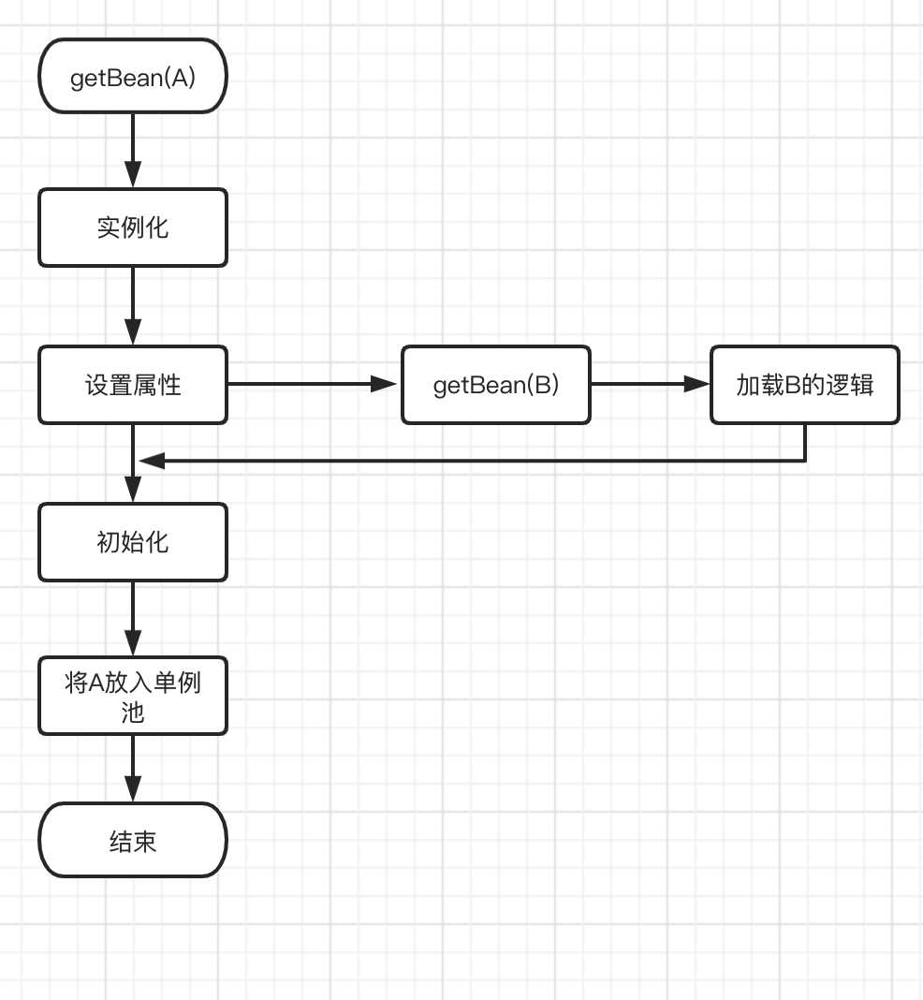

<!DOCTYPE html>
<!-- saved from url=(0046)https://kaiiiz.github.io/hexo-theme-book-demo/ -->
<html xmlns="http://www.w3.org/1999/xhtml">
<head>
    <head>
        <meta http-equiv="Content-Type" content="text/html; charset=UTF-8">
        <meta name="viewport" content="width=device-width, initial-scale=1, maximum-scale=1.0, user-scalable=no">
        <link rel="icon" href="../static/favicon.png">
        <title>Spring 循环依赖及解决方式.md</title>
        <!-- Spectre.css framework -->
        <link rel="stylesheet" href="../static/index.css">
        <!-- theme css & js -->
        <meta name="generator" content="Hexo 4.2.0">
    </head>

<body>

    

        

            <a href="../index.html">
                
                技术文章摘抄
            </a>
        

        

            <ul class="uncollapsible">
                <li><a href="../index.html" class="current-tab">首页</a></li>
            </ul>

            <ul class="uncollapsible">
                <li><a href="../index.html">上一级</a></li>
            </ul>

            <ul class="uncollapsible">
                <li>

                    
                    <a href="AQS&#32;万字图文全面解析.md">AQS 万字图文全面解析.md</a>

                </li>
                <li>

                    
                    <a href="Docker&#32;镜像构建原理及源码分析.md">Docker 镜像构建原理及源码分析.md</a>

                </li>
                <li>

                    
                    <a href="ElasticSearch&#32;小白从入门到精通.md">ElasticSearch 小白从入门到精通.md</a>

                </li>
                <li>

                    
                    <a href="JVM&#32;CPU&#32;Profiler技术原理及源码深度解析.md">JVM CPU Profiler技术原理及源码深度解析.md</a>

                </li>
                <li>

                    
                    <a href="JVM&#32;垃圾收集器.md">JVM 垃圾收集器.md</a>

                </li>
                <li>

                    
                    <a href="JVM&#32;面试的&#32;30&#32;个知识点.md">JVM 面试的 30 个知识点.md</a>

                </li>
                <li>

                    
                    <a href="Java&#32;IO&#32;体系、线程模型大总结.md">Java IO 体系、线程模型大总结.md</a>

                </li>
                <li>

                    
                    <a href="Java&#32;面试题集锦（网络篇）.md">Java 面试题集锦（网络篇）.md</a>

                </li>
                <li>

                    
                    <a href="Java-直接内存&#32;DirectMemory&#32;详解.md">Java-直接内存 DirectMemory 详解.md</a>

                </li>
                <li>

                    
                    <a href="Java中的SPI.md">Java中的SPI.md</a>

                </li>
                <li>

                    
                    <a href="Java中的ThreadLocal.md">Java中的ThreadLocal.md</a>

                </li>
                <li>

                    
                    <a href="Java线程池实现原理及其在美团业务中的实践.md">Java线程池实现原理及其在美团业务中的实践.md</a>

                </li>
                <li>

                    
                    <a href="Java魔法类：Unsafe应用解析.md">Java魔法类：Unsafe应用解析.md</a>

                </li>
                <li>

                    
                    <a href="Kafka&#32;源码阅读笔记.md">Kafka 源码阅读笔记.md</a>

                </li>
                <li>

                    
                    <a href="Kafka、ActiveMQ、RabbitMQ、RocketMQ&#32;区别以及高可用原理.md">Kafka、ActiveMQ、RabbitMQ、RocketMQ 区别以及高可用原理.md</a>

                </li>
                <li>

                    
                    <a href="MySQL&#32;·&#32;引擎特性&#32;·&#32;InnoDB&#32;Buffer&#32;Pool.md">MySQL · 引擎特性 · InnoDB Buffer Pool.md</a>

                </li>
                <li>

                    
                    <a href="MySQL&#32;·&#32;引擎特性&#32;·&#32;InnoDB&#32;IO子系统.md">MySQL · 引擎特性 · InnoDB IO子系统.md</a>

                </li>
                <li>

                    
                    <a href="MySQL&#32;·&#32;引擎特性&#32;·&#32;InnoDB&#32;事务系统.md">MySQL · 引擎特性 · InnoDB 事务系统.md</a>

                </li>
                <li>

                    
                    <a href="MySQL&#32;·&#32;引擎特性&#32;·&#32;InnoDB&#32;同步机制.md">MySQL · 引擎特性 · InnoDB 同步机制.md</a>

                </li>
                <li>

                    
                    <a href="MySQL&#32;·&#32;引擎特性&#32;·&#32;InnoDB&#32;数据页解析.md">MySQL · 引擎特性 · InnoDB 数据页解析.md</a>

                </li>
                <li>

                    
                    <a href="MySQL&#32;·&#32;引擎特性&#32;·&#32;InnoDB崩溃恢复.md">MySQL · 引擎特性 · InnoDB崩溃恢复.md</a>

                </li>
                <li>

                    
                    <a href="MySQL&#32;·&#32;引擎特性&#32;·&#32;临时表那些事儿.md">MySQL · 引擎特性 · 临时表那些事儿.md</a>

                </li>
                <li>

                    
                    <a href="MySQL&#32;主从复制&#32;半同步复制.md">MySQL 主从复制 半同步复制.md</a>

                </li>
                <li>

                    
                    <a href="MySQL&#32;主从复制&#32;基于GTID复制.md">MySQL 主从复制 基于GTID复制.md</a>

                </li>
                <li>

                    
                    <a href="MySQL&#32;主从复制.md">MySQL 主从复制.md</a>

                </li>
                <li>

                    
                    <a href="MySQL&#32;事务日志(redo&#32;log和undo&#32;log).md">MySQL 事务日志(redo log和undo log).md</a>

                </li>
                <li>

                    
                    <a href="MySQL&#32;亿级别数据迁移实战代码分享.md">MySQL 亿级别数据迁移实战代码分享.md</a>

                </li>
                <li>

                    
                    <a href="MySQL&#32;从一条数据说起-InnoDB行存储数据结构.md">MySQL 从一条数据说起-InnoDB行存储数据结构.md</a>

                </li>
                <li>

                    
                    <a href="MySQL&#32;地基基础：事务和锁的面纱.md">MySQL 地基基础：事务和锁的面纱.md</a>

                </li>
                <li>

                    
                    <a href="MySQL&#32;地基基础：数据字典.md">MySQL 地基基础：数据字典.md</a>

                </li>
                <li>

                    
                    <a href="MySQL&#32;地基基础：数据库字符集.md">MySQL 地基基础：数据库字符集.md</a>

                </li>
                <li>

                    
                    <a href="MySQL&#32;性能优化：碎片整理.md">MySQL 性能优化：碎片整理.md</a>

                </li>
                <li>

                    
                    <a href="MySQL&#32;故障诊断：一个&#32;ALTER&#32;TALBE&#32;执行了很久，你慌不慌？.md">MySQL 故障诊断：一个 ALTER TALBE 执行了很久，你慌不慌？.md</a>

                </li>
                <li>

                    
                    <a href="MySQL&#32;故障诊断：如何在日志中轻松定位大事务.md">MySQL 故障诊断：如何在日志中轻松定位大事务.md</a>

                </li>
                <li>

                    
                    <a href="MySQL&#32;故障诊断：教你快速定位加锁的&#32;SQL.md">MySQL 故障诊断：教你快速定位加锁的 SQL.md</a>

                </li>
                <li>

                    
                    <a href="MySQL&#32;日志详解.md">MySQL 日志详解.md</a>

                </li>
                <li>

                    
                    <a href="MySQL&#32;的半同步是什么？.md">MySQL 的半同步是什么？.md</a>

                </li>
                <li>

                    
                    <a href="MySQL中的事务和MVCC.md">MySQL中的事务和MVCC.md</a>

                </li>
                <li>

                    
                    <a href="MySQL事务_事务隔离级别详解.md">MySQL事务_事务隔离级别详解.md</a>

                </li>
                <li>

                    
                    <a href="MySQL优化：优化&#32;select&#32;count().md">MySQL优化：优化 select count().md</a>

                </li>
                <li>

                    
                    <a href="MySQL共享锁、排他锁、悲观锁、乐观锁.md">MySQL共享锁、排他锁、悲观锁、乐观锁.md</a>

                </li>
                <li>

                    
                    <a href="MySQL的MVCC（多版本并发控制）.md">MySQL的MVCC（多版本并发控制）.md</a>

                </li>
                <li>

                    
                    <a href="QingStor&#32;对象存储架构设计及最佳实践.md">QingStor 对象存储架构设计及最佳实践.md</a>

                </li>
                <li>

                    
                    <a href="RocketMQ&#32;面试题集锦.md">RocketMQ 面试题集锦.md</a>

                </li>
                <li>

                    
                    <a href="SnowFlake&#32;雪花算法生成分布式&#32;ID.md">SnowFlake 雪花算法生成分布式 ID.md</a>

                </li>
                <li>

                    
                    <a href="Spring&#32;Boot&#32;2.x&#32;结合&#32;k8s&#32;实现分布式微服务架构.md">Spring Boot 2.x 结合 k8s 实现分布式微服务架构.md</a>

                </li>
                <li>

                    
                    <a href="Spring&#32;Boot&#32;教程：如何开发一个&#32;starter.md">Spring Boot 教程：如何开发一个 starter.md</a>

                </li>
                <li>

                    
                    <a href="Spring&#32;MVC&#32;原理.md">Spring MVC 原理.md</a>

                </li>
                <li>

                    
                    <a href="Spring&#32;MyBatis和Spring整合的奥秘.md">Spring MyBatis和Spring整合的奥秘.md</a>

                </li>
                <li>

                    
                    <a href="Spring&#32;帮助你更好的理解Spring循环依赖.md">Spring 帮助你更好的理解Spring循环依赖.md</a>

                </li>
                <li>

                    <a class="current-tab" href="Spring&#32;循环依赖及解决方式.md">Spring 循环依赖及解决方式.md</a>
                    

                </li>
                <li>

                    
                    <a href="Spring中眼花缭乱的BeanDefinition.md">Spring中眼花缭乱的BeanDefinition.md</a>

                </li>
                <li>

                    
                    <a href="Vert.x&#32;基础入门.md">Vert.x 基础入门.md</a>

                </li>
                <li>

                    
                    <a href="eBay&#32;的&#32;Elasticsearch&#32;性能调优实践.md">eBay 的 Elasticsearch 性能调优实践.md</a>

                </li>
                <li>

                    
                    <a href="不可不说的Java“锁”事.md">不可不说的Java“锁”事.md</a>

                </li>
                <li>

                    
                    <a href="互联网并发限流实战.md">互联网并发限流实战.md</a>

                </li>
                <li>

                    
                    <a href="从ReentrantLock的实现看AQS的原理及应用.md">从ReentrantLock的实现看AQS的原理及应用.md</a>

                </li>
                <li>

                    
                    <a href="从SpringCloud开始，聊微服务架构.md">从SpringCloud开始，聊微服务架构.md</a>

                </li>
                <li>

                    
                    <a href="全面了解&#32;JDK&#32;线程池实现原理.md">全面了解 JDK 线程池实现原理.md</a>

                </li>
                <li>

                    
                    <a href="分布式一致性理论与算法.md">分布式一致性理论与算法.md</a>

                </li>
                <li>

                    
                    <a href="分布式一致性算法&#32;Raft.md">分布式一致性算法 Raft.md</a>

                </li>
                <li>

                    
                    <a href="分布式唯一&#32;ID&#32;解析.md">分布式唯一 ID 解析.md</a>

                </li>
                <li>

                    
                    <a href="分布式链路追踪：集群管理设计.md">分布式链路追踪：集群管理设计.md</a>

                </li>
                <li>

                    
                    <a href="动态代理种类及原理，你知道多少？.md">动态代理种类及原理，你知道多少？.md</a>

                </li>
                <li>

                    
                    <a href="响应式架构与&#32;RxJava&#32;在有赞零售的实践.md">响应式架构与 RxJava 在有赞零售的实践.md</a>

                </li>
                <li>

                    
                    <a href="大数据算法——布隆过滤器.md">大数据算法——布隆过滤器.md</a>

                </li>
                <li>

                    
                    <a href="如何设计一个亿级消息量的&#32;IM&#32;系统.md">如何设计一个亿级消息量的 IM 系统.md</a>

                </li>
                <li>

                    
                    <a href="异步网络模型.md">异步网络模型.md</a>

                </li>
                <li>

                    
                    <a href="当我们在讨论CQRS时，我们在讨论些神马？.md">当我们在讨论CQRS时，我们在讨论些神马？.md</a>

                </li>
                <li>

                    
                    <a href="彻底理解&#32;MySQL&#32;的索引机制.md">彻底理解 MySQL 的索引机制.md</a>

                </li>
                <li>

                    
                    <a href="最全的&#32;116&#32;道&#32;Redis&#32;面试题解答.md">最全的 116 道 Redis 面试题解答.md</a>

                </li>
                <li>

                    
                    <a href="有赞权限系统(SAM).md">有赞权限系统(SAM).md</a>

                </li>
                <li>

                    
                    <a href="有赞零售中台建设方法的探索与实践.md">有赞零售中台建设方法的探索与实践.md</a>

                </li>
                <li>

                    
                    <a href="服务注册与发现原理剖析（Eureka、Zookeeper、Nacos）.md">服务注册与发现原理剖析（Eureka、Zookeeper、Nacos）.md</a>

                </li>
                <li>

                    
                    <a href="深入浅出Cache.md">深入浅出Cache.md</a>

                </li>
                <li>

                    
                    <a href="深入理解&#32;MySQL&#32;底层实现.md">深入理解 MySQL 底层实现.md</a>

                </li>
                <li>

                    
                    <a href="漫画讲解&#32;git&#32;rebase&#32;VS&#32;git&#32;merge.md">漫画讲解 git rebase VS git merge.md</a>

                </li>
                <li>

                    
                    <a href="生成浏览器唯一稳定&#32;ID&#32;的探索.md">生成浏览器唯一稳定 ID 的探索.md</a>

                </li>
                <li>

                    
                    <a href="缓存&#32;如何保证缓存与数据库的双写一致性？.md">缓存 如何保证缓存与数据库的双写一致性？.md</a>

                </li>
                <li>

                    
                    <a href="网易严选怎么做全链路监控的？.md">网易严选怎么做全链路监控的？.md</a>

                </li>
                <li>

                    
                    <a href="美团万亿级&#32;KV&#32;存储架构与实践.md">美团万亿级 KV 存储架构与实践.md</a>

                </li>
                <li>

                    
                    <a href="美团点评Kubernetes集群管理实践.md">美团点评Kubernetes集群管理实践.md</a>

                </li>
                <li>

                    
                    <a href="解读《阿里巴巴&#32;Java&#32;开发手册》背后的思考.md">解读《阿里巴巴 Java 开发手册》背后的思考.md</a>

                </li>
                <li>

                    
                    <a href="认识&#32;MySQL&#32;和&#32;Redis&#32;的数据一致性问题.md">认识 MySQL 和 Redis 的数据一致性问题.md</a>

                </li>
                <li>

                    
                    <a href="进阶：Dockerfile&#32;高阶使用指南及镜像优化.md">进阶：Dockerfile 高阶使用指南及镜像优化.md</a>

                </li>
                <li>

                    
                    <a href="铁总在用的高性能分布式缓存计算框架&#32;Geode.md">铁总在用的高性能分布式缓存计算框架 Geode.md</a>

                </li>
                <li>

                    
                    <a href="阿里云PolarDB及其共享存储PolarFS技术实现分析（上）.md">阿里云PolarDB及其共享存储PolarFS技术实现分析（上）.md</a>

                </li>
                <li>

                    
                    <a href="阿里云PolarDB及其共享存储PolarFS技术实现分析（下）.md">阿里云PolarDB及其共享存储PolarFS技术实现分析（下）.md</a>

                </li>
                <li>

                    
                    <a href="面试最常被问的&#32;Java&#32;后端题.md">面试最常被问的 Java 后端题.md</a>

                </li>
                <li>

                    
                    <a href="领域驱动设计在互联网业务开发中的实践.md">领域驱动设计在互联网业务开发中的实践.md</a>

                </li>
                <li>

                    
                    <a href="领域驱动设计的菱形对称架构.md">领域驱动设计的菱形对称架构.md</a>

                </li>
                <li>

                    
                    <a href="高效构建&#32;Docker&#32;镜像的最佳实践.md">高效构建 Docker 镜像的最佳实践.md</a>

                </li>
            </ul>

        

    

    

        

    

    

    

        

            

                

                    <!-- For Responsive Layout -->
                    <header class="navbar">
                        <section class="navbar-section">
                            <a onclick="open_sidebar()">
                                <i class="icon icon-menu"></i>
                            </a>
                        </section>
                    </header>
                

                

                    

                        

                        
<h1>Spring 循环依赖及解决方式</h1>
<h3>循环依赖</h3>

Spring 有一个经典的问题，就是如何解决循环依赖，话不多说，直接开始，

<pre><code>@Component
public Class A { 
  @Autowired private B b;
}
@Component
public Class B { 
  @Autowired private A b;
}
</code></pre>
<h3>spring bean 的生命周期</h3>

获取一个 Bean 的操作从 getBean(String name) 开始主要步骤为

1、getBean(String name)

2、实例化对象 A a = new A(); 此时执行构造方法的依赖注入

3、设置对象属性 populateBean(beanName, mbd, instanceWrapper); 此时执行属性的依赖注入

4、执行初始化方法 initializeBean(beanName, exposedObject, mbd); 此时执行 bean 的 initialize 方法

5、将生成好的 bean 对象添加到 单例池（一个 hashMap，保证单例 bean 在 context 仅仅存在一个对象）

6、结束

伪代码如下：

<pre><code>public Object getBean(String name) {
	//省略根据name获取A的过程
	A a = new A();
	a.initialze();
	singletonObjects.put(name, a);
	return a;
}
</code></pre>
<h5>A 依赖 B 的情况下的加载流程</h5>

伪代码如下：

<pre><code class="language-java">public Object getBean(String name) {
	//省略根据name获取A的过程
	A a = new A(); //实例化A
	a.setB(getBean(&quot;B&quot;)); //设置属性，发现a依赖于b，所以先加载b，加载B完成以后再继续加载a
	a.initialze(); //执行初始化方法
	singletonObjects.put(name, a); //将a放入单例池中
	return a;
}
</code></pre>
<h5>A、B 互相依赖的加载流程</h5>

以上就会出现一个问题，由于 a、b 都是单例 Bean，加载 b 的时候，到了上图中标红的阶段后，b 依赖注入的 a 的引用应该是通过 getBean(A) 得到的引入，如果还是以上的逻辑，又再一次走入了 A 的创建逻辑，此时就是发生了循环依赖。下面我们就开始介绍 Spring 是如何解决循环依赖的。

<h3>一级缓存：单例池 singletonObjects</h3>
<pre><code>private final Map&lt;String, Object&gt; singletonObjects = new ConcurrentHashMap&lt;&gt;(256);
</code></pre>

我们都知道如果是单例的 Bean，每次 getBean(beanName)返回同一个 bean，也就是在整个 ApplicationContext 里面，仅有一个单例 Bean，单例 Bean <strong>创建完成后</strong>就放在 singletonObjects 这个 Map 里面，这就是一级缓存。此时说的“创建完成”指的是图一的第 6 步骤，图三中 getBean(&quot;B&quot;) 的过程中，a 是没有加入到一级缓存中，所以在 getBean(&quot;B&quot;) 的流程中，b 依赖了 a，此时 b 是找不到 a 对象的。依然会无法解决循环引用的问题。

<h3>二级缓存：earlySingletonObjects</h3>
<pre><code>private final Map&lt;String, Object&gt; earlySingletonObjects = new HashMap&lt;&gt;(16);
</code></pre>

这个时候我们考虑再引入一个 Map 存放引用，earlySingletonObjects 这个 map 我们打算存放提前暴露 bean 的引用，实例化以后，我们就把对象放入到 earlySingletonObjects 这个 map 中，这样在 加载 b 的过程中，b.setA(getBean(&quot;a&quot;)),我们就可以在 earlySingletonObjects 拿到 a 的引用，此时 a 仅仅经过了实例化，并没有设置属性。流程如下：

1、getBean(A)

2、A a = new A();

3、earlySingletonObjects.put(&quot;a&quot;, a); 将 A 放入二级缓存

3、设置 A 的属性

4、getBean(B)

5、设置 B 的属性，发现 B 依赖 A，从二级缓存中获取 A

6、加载 B 成功

7、将 B 放入一级缓存

8、继续加载 A

9、加载 A 完成，将 A 放入单例池

到目前为止，发现使用二级缓存似乎就能解决我们的问题。看起来很美好，这是 Spring IOC 的特性，Spring 的另一大特性是 AOP 面向切面编程，动态增强对象，不管使用 JDK 的动态代理和 Cglib 动态代理，都会生成一个全新的对象。下图中我标出了 AOP 动态增强的位置。

此时就会出现一个问题，因为经过 AOP 以后，生成的是增强后的 bean 对象，也就是一个全新的对象，我们可以看到经过图中的流程后，单例池中会存在两个 bean：增强后的 a、b 对象，此时 a 对象中依赖的 b 为增强后的，而 b 对象依赖的 a 是为原始对象，未增强的。所以使用二级缓存解决不了循环依赖中发生过 aop 的引用问题。

<h3>三级缓存：singletonFactories</h3>
<pre><code>private final Map&lt;String, ObjectFactory&lt;?&gt;&gt; singletonFactories = new HashMap&lt;&gt;(16);
</code></pre>

为了解决二级缓存中 AOP 生成新对象的问题，Spring 中的解决方案是：提前 AOP，如果我们能够提前 AOP 就能解决上面的问题了，提前 AOP 指的就是，在 加载 B 的流程中，如果发生了循环依赖，就是说 b 又依赖了 a，我们就要对 a 执行 aop，提前获取增强以后的 a 对象，这样 b 对象依赖的 a 对象就是增强以后的 a 了。三级缓存的 key 是 beanName，value 是一个 lambda 表达式，这个 lambda 表达式的作用就是进行提前 AOP。

下面是加入了三级缓存和 AOP 的流程图，PS：可能会有点乱。。。。。。

上面就是三级缓存的作用，其中有个三级缓存到二级缓存的升级过程，这个非常重重要，这个主要是防止重复 aop。好的，写到这里，我们对 Spring 如何使用三级缓存解决循环依赖的流程已经大概清楚了，下面分析一下源码。

<h3>源码解析：</h3>
<h5>1、 doGetBean</h5>
<pre><code>protected &lt;T&gt; T doGetBean(final String name, @Nullable final Class&lt;T&gt; requiredType,@Nullable final Object[] args, boolean typeCheckOnly) throws BeansException {
    Object bean;
    //首先先尝试获取bean，如果加载过就不会在重复加载了
    Object sharedInstance = getSingleton(beanName);
    //省略细节
    if(sharedInstance != null) {
        bean = getObjectForBeanInstance(sharedInstance, name, beanName, null);
    } else {
         //根据beanName获取 beanDefinition 对象
        final RootBeanDefinition mbd = getMergedLocalBeanDefinition(beanName);
        if (mbd.isSingleton()) {
            //单例bean的加载逻辑
           sharedInstance = getSingleton(beanName, () -&gt; {
              try {
                 return createBean(beanName, mbd, args);
              }
              catch (BeansException ex) {
                 // Explicitly remove instance from singleton cache: It might have been put there
                 // eagerly by the creation process, to allow for circular reference resolution.
                 // Also remove any beans that received a temporary reference to the bean.
                 destroySingleton(beanName);
                 throw ex;
              }
           });
           else if (mbd.isPrototype()) {
               //原型域bean的加载逻辑
               Object prototypeInstance = null;
               try {
                  beforePrototypeCreation(beanName);
                  prototypeInstance = createBean(beanName, mbd, args);
               }
               finally {
                  afterPrototypeCreation(beanName);
               }
               bean = getObjectForBeanInstance(prototypeInstance, name, beanName, mbd);
            }
           bean = getObjectForBeanInstance(sharedInstance, name, beanName, mbd);
        }
    }
    return (T)bean;
}
</code></pre>
<h5>2、 第 1 步中 getSingleton(beanName)</h5>
<pre><code>public Object getSingleton(String beanName) {
   return getSingleton(beanName, true);
}

protected Object getSingleton(String beanName, boolean allowEarlyReference) {
   //首先去一级缓存中获取如果获取的到说明bean已经存在，直接返回
   Object singletonObject = this.singletonObjects.get(beanName);
   //如果一级缓存中不存在，则去判断该bean是否在创建中，如果该bean正在创建中，就说明了，这个时候发生了循环依赖
   if (singletonObject == null &amp;&amp; isSingletonCurrentlyInCreation(beanName)) {
      synchronized (this.singletonObjects) {
         //如果发生循环依赖，首先去二级缓存中获取，如果获取到则返回，这个地方就是获取aop增强以后的bean
         singletonObject = this.earlySingletonObjects.get(beanName);
         //如果二级缓存中不存在，且允许提前访问三级引用
         if (singletonObject == null &amp;&amp; allowEarlyReference) {
            //去三级缓存中获取
            ObjectFactory&lt;?&gt; singletonFactory = this.singletonFactories.get(beanName);
            if (singletonFactory != null) {
               //如果三级缓存中的lambda表达式存在，执行aop，获取增强以后的对象，为了防止重复aop，将三级缓存删除，升级到二级缓存中
               singletonObject = singletonFactory.getObject();
               this.earlySingletonObjects.put(beanName, singletonObject);
               this.singletonFactories.remove(beanName);
            }
         }
      }
   }
   return singletonObject;
}
</code></pre>
<h5>3、 第 1 步中 单例 bean 的加载逻辑</h5>
<pre><code>sharedInstance = getSingleton(beanName, () -&gt; {
  try {
     return createBean(beanName, mbd, args);
  }
  catch (BeansException ex) {
     // Explicitly remove instance from singleton cache: It might have been put there
     // eagerly by the creation process, to allow for circular reference resolution.
     // Also remove any beans that received a temporary reference to the bean.
     destroySingleton(beanName);
     throw ex;
  }
});

//获取bean
public Object getSingleton(String beanName, ObjectFactory&lt;?&gt; singletonFactory) {
   Assert.notNull(beanName, &quot;Bean name must not be null&quot;);
   synchronized (this.singletonObjects) {
      Object singletonObject = this.singletonObjects.get(beanName);
      if (singletonObject == null) {
          //将当前bean加入到 singletonsCurrentlyInCreation 这个map中，这个map里面是正在创建中的bean，用于判断循环依赖
          beforeSingletonCreation(beanName);
          //执行上面方法的lambda表达式，创建bean
          singletonObject = singletonFactory.getObject();
          //将 singletonsCurrentlyInCreation 里面的这个bean删除
          afterSingletonCreation(beanName);
          //bean创建完成，将bean加入到单例池中
          addSingleton(beanName, singletonObject); 
      }
      return singletonObject;
   }
}
</code></pre>
<h5>4、核心方法，加载 bean</h5>
<pre><code>//createBean(beanName, mbd, args); 方法 创建bean的核心逻辑
// 最终调用的是 AbstractAutowiredCapableBeanFactory.createBean 这个方法
protected Object doCreateBean(final String beanName, final RootBeanDefinition mbd, final @Nullable Object[] args)
      throws BeanCreationException {
   // Instantiate the bean.
   BeanWrapper instanceWrapper = null;
   if (mbd.isSingleton()) {
      instanceWrapper = this.factoryBeanInstanceCache.remove(beanName);
   }
   if (instanceWrapper == null) {
      instanceWrapper = createBeanInstance(beanName, mbd, args);
   }
   //实例化，操作等同于 new 一个bean对象
   final Object bean = instanceWrapper.getWrappedInstance();
   Class&lt;?&gt; beanType = instanceWrapper.getWrappedClass();

   //是否允许提前暴露对象，如果当前bean为单例，且允许循环引用，与当前bean正在创建中，则允许提前暴露
   boolean earlySingletonExposure = (mbd.isSingleton() &amp;&amp; this.allowCircularReferences &amp;&amp;
         isSingletonCurrentlyInCreation(beanName));
   if (earlySingletonExposure) {
      //将当前bean放入三级缓存中
      addSingletonFactory(beanName, () -&gt; getEarlyBeanReference(beanName, mbd, bean));
   }

   // Initialize the bean instance.
   Object exposedObject = bean;
   try {
      //开始设置属性，当前bean依赖于其它bean，则需要 doGetBean 创建以来的bean，如果依赖的bean不存在，则首先创建依赖的bean，循环依赖发生的位置
      populateBean(beanName, mbd, instanceWrapper);
      //执行初始化方法和aop增强，此时如果有aop，exposedObject就是增强以后的对象了,但是有一点需要注意，如果提前执行了aop，则exposedObject不会再次执行aop了
      exposedObject = initializeBean(beanName, exposedObject, mbd);
   }
   catch (Throwable ex) {
      throw ex;
   }

   if (earlySingletonExposure) {
      //这个我们可以看上面getSingleton方法，该方法的参数为false，就说明只允许去一级缓存和二级缓存获取，此时bean在创建中，一级缓存一定没有，就看二级缓存能不能获取到了
      Object earlySingletonReference = getSingleton(beanName, false);
      if (earlySingletonReference != null) {
         //如果二级缓存获取到了，则说明提前执行了aop
         if (exposedObject == bean) {
             //exposedObject就是要放入单例池中的对象，如果提前执行了aop，则将exposedObject对象替换为aop以后的对象
             //这个地方可能有一些疑问，exposedObject是原始对象执行过 依赖注入，而earlySingletonReference是提前执行aop的对象，没有执行过依赖注入，是不是有什么问题呢？
             //答案是不会，因为earlySingletonReference作为exposedObject的增强对象，内部是持有原对象的引用的
            exposedObject = earlySingletonReference;
         }
         else if (!this.allowRawInjectionDespiteWrapping &amp;&amp; hasDependentBean(beanName)) {
            String[] dependentBeans = getDependentBeans(beanName);
            Set&lt;String&gt; actualDependentBeans = new LinkedHashSet&lt;&gt;(dependentBeans.length);
            for (String dependentBean : dependentBeans) {
               if (!removeSingletonIfCreatedForTypeCheckOnly(dependentBean)) {
                  actualDependentBeans.add(dependentBean);
               }
            }
            if (!actualDependentBeans.isEmpty()) {
               throw new BeanCurrentlyInCreationException(beanName,
                     &quot;Bean with name '&quot; + beanName + &quot;' has been injected into other beans [&quot; +
                     StringUtils.collectionToCommaDelimitedString(actualDependentBeans) +
                     &quot;] in its raw version as part of a circular reference, but has eventually been &quot; +
                     &quot;wrapped. This means that said other beans do not use the final version of the &quot; +
                     &quot;bean. This is often the result of over-eager type matching - consider using &quot; +
                     &quot;'getBeanNamesOfType' with the 'allowEagerInit' flag turned off, for example.&quot;);
            }
         }
      }
   }

   // Register bean as disposable.
   try {
      registerDisposableBeanIfNecessary(beanName, bean, mbd);
   }
   catch (BeanDefinitionValidationException ex) {
      throw new BeanCreationException(
            mbd.getResourceDescription(), beanName, &quot;Invalid destruction signature&quot;, ex);
   }

   return exposedObject;
}

//下面我们看一下 上面方法中的 将bean放入三级缓存提前暴露的方法
//addSingletonFactory(beanName, () -&gt; getEarlyBeanReference(beanName, mbd, bean));
protected void addSingletonFactory(String beanName, ObjectFactory&lt;?&gt; singletonFactory) {
   Assert.notNull(singletonFactory, &quot;Singleton factory must not be null&quot;);
   synchronized (this.singletonObjects) {
      if (!this.singletonObjects.containsKey(beanName)) {
         this.singletonFactories.put(beanName, singletonFactory);
         this.earlySingletonObjects.remove(beanName);
         this.registeredSingletons.add(beanName);
      }
   }
}
</code></pre>

通过对上面源码的解析，看到了 bean 加载的整个生命周期，和三级缓存的作用。

比如：

1、如何判断是否存在循环依赖：使用 isSingletonCurrentlyInCreation(beanName) 这个方法

2、三级缓存如何升级到二级缓存的：参考第二步

3、提前执行 AOP：这个东西是在 获取三级缓存的时候执行的，里面有一个 getEarlyBeanReference(beanName, mbd, bean) 这个 lambda 表达式，这个方法就是提前执行 aop，具体可以参考 AbstractAutoProxyCreator

4、如果提前执行 AOP，则需要替换原对象

<h3>文字总结 A、B 循环依赖</h3>

1、getBean(A) 先去单例池获取，单例池不存在，二级缓存获取，二级缓存不存在且允许提前访问，三级缓存中取，此时返回为空，开始加载 A

2、singletonsCurrentlyInCreation(A) 将 A 放入正在创建的 Map 中

3、new A(); 实例化 A

4、提前暴露 A，将 A 放入三级缓存，addSingletonFactory(beanName, () -&gt; getEarlyBeanReference(beanName, mbd, bean));

5、设置属性 populateBean(beanName, mbd, instanceWrapper);

6、发现 A 依赖 B，需要先创建 B

7、getBean(B)

8、先去单例池获取 B，单例池不存在，二级缓存获取，二级缓存不存在且允许提前访问，三级缓存中取，此时返回为空，开始加载 B

9、将 B 放入 singletonsCurrentlyInCreation() 的 Map 中

10、new B() 实例化 B

11、将 B 放入三级缓存 addSingletonFactory(beanName, () -&gt; getEarlyBeanReference(beanName, mbd, bean));

12、设置属性 populateBean(beanName, mbd, instanceWrapper);

13、发现 B 依赖 A

14、getBean(A)

15、发现三级缓存中存在 A，getEarlyBeanReference(A, mbd, bean) 获取 A，同时把 A 放入二级缓存，删除三级缓存

16、执行 B 的 initializeBean 方法，执行 aop，获取增强以后的引用

17、B 创建完了，将 B 放入单例池冲

18、继续执行第 7 步，返回的 getBean(B)就是创建好的 B

19、接下来 A 初始化

20、因为 A 的三级缓存中的 getEarlyBeanReference(beanName, mbd, bean) 被 B 已经执行过了

21、A 就能从二级缓存中获取自己的引用

22、如果发现引用变了，此时 A 就指向二级缓存中的引用

23、将 A 放出单例池中

24、删除二级缓存和三级缓存

                    

                    

                        

                            <a href="Spring&#32;帮助你更好的理解Spring循环依赖.md">上一页</a>
                        

                        

                            <a href="Spring中眼花缭乱的BeanDefinition.md">下一页</a>
                        

                    

                

            

        

    

    

</body>
<!-- Global site tag (gtag.js) - Google Analytics -->

</html>
