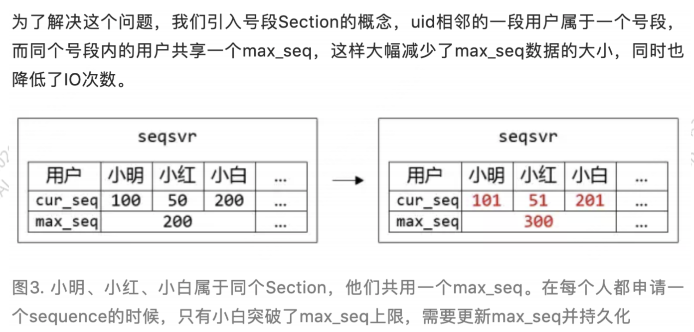
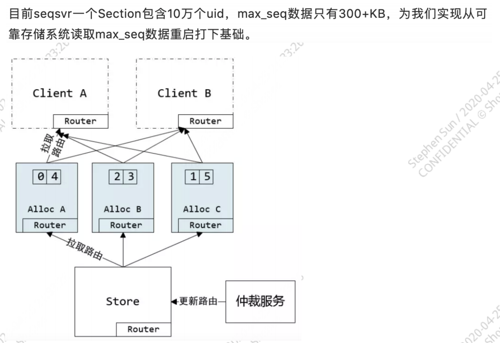
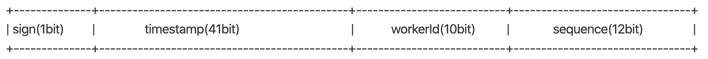

<!DOCTYPE html>
<!-- saved from url=(0046)https://kaiiiz.github.io/hexo-theme-book-demo/ -->
<html xmlns="http://www.w3.org/1999/xhtml">
<head>
    <head>
        <meta http-equiv="Content-Type" content="text/html; charset=UTF-8">
        <meta name="viewport" content="width=device-width, initial-scale=1, maximum-scale=1.0, user-scalable=no">
        <link rel="icon" href="../static/favicon.png">
        <title>分布式唯一 ID 解析.md</title>
        <!-- Spectre.css framework -->
        <link rel="stylesheet" href="../static/index.css">
        <!-- theme css & js -->
        <meta name="generator" content="Hexo 4.2.0">
    </head>

<body>

    

        

            <a href="../index.html">
                
                技术文章摘抄
            </a>
        

        

            <ul class="uncollapsible">
                <li><a href="../index.html" class="current-tab">首页</a></li>
            </ul>

            <ul class="uncollapsible">
                <li><a href="../index.html">上一级</a></li>
            </ul>

            <ul class="uncollapsible">
                <li>

                    
                    <a href="AQS&#32;万字图文全面解析.md">AQS 万字图文全面解析.md</a>

                </li>
                <li>

                    
                    <a href="Docker&#32;镜像构建原理及源码分析.md">Docker 镜像构建原理及源码分析.md</a>

                </li>
                <li>

                    
                    <a href="ElasticSearch&#32;小白从入门到精通.md">ElasticSearch 小白从入门到精通.md</a>

                </li>
                <li>

                    
                    <a href="JVM&#32;CPU&#32;Profiler技术原理及源码深度解析.md">JVM CPU Profiler技术原理及源码深度解析.md</a>

                </li>
                <li>

                    
                    <a href="JVM&#32;垃圾收集器.md">JVM 垃圾收集器.md</a>

                </li>
                <li>

                    
                    <a href="JVM&#32;面试的&#32;30&#32;个知识点.md">JVM 面试的 30 个知识点.md</a>

                </li>
                <li>

                    
                    <a href="Java&#32;IO&#32;体系、线程模型大总结.md">Java IO 体系、线程模型大总结.md</a>

                </li>
                <li>

                    
                    <a href="Java&#32;面试题集锦（网络篇）.md">Java 面试题集锦（网络篇）.md</a>

                </li>
                <li>

                    
                    <a href="Java-直接内存&#32;DirectMemory&#32;详解.md">Java-直接内存 DirectMemory 详解.md</a>

                </li>
                <li>

                    
                    <a href="Java中的SPI.md">Java中的SPI.md</a>

                </li>
                <li>

                    
                    <a href="Java中的ThreadLocal.md">Java中的ThreadLocal.md</a>

                </li>
                <li>

                    
                    <a href="Java线程池实现原理及其在美团业务中的实践.md">Java线程池实现原理及其在美团业务中的实践.md</a>

                </li>
                <li>

                    
                    <a href="Java魔法类：Unsafe应用解析.md">Java魔法类：Unsafe应用解析.md</a>

                </li>
                <li>

                    
                    <a href="Kafka&#32;源码阅读笔记.md">Kafka 源码阅读笔记.md</a>

                </li>
                <li>

                    
                    <a href="Kafka、ActiveMQ、RabbitMQ、RocketMQ&#32;区别以及高可用原理.md">Kafka、ActiveMQ、RabbitMQ、RocketMQ 区别以及高可用原理.md</a>

                </li>
                <li>

                    
                    <a href="MySQL&#32;·&#32;引擎特性&#32;·&#32;InnoDB&#32;Buffer&#32;Pool.md">MySQL · 引擎特性 · InnoDB Buffer Pool.md</a>

                </li>
                <li>

                    
                    <a href="MySQL&#32;·&#32;引擎特性&#32;·&#32;InnoDB&#32;IO子系统.md">MySQL · 引擎特性 · InnoDB IO子系统.md</a>

                </li>
                <li>

                    
                    <a href="MySQL&#32;·&#32;引擎特性&#32;·&#32;InnoDB&#32;事务系统.md">MySQL · 引擎特性 · InnoDB 事务系统.md</a>

                </li>
                <li>

                    
                    <a href="MySQL&#32;·&#32;引擎特性&#32;·&#32;InnoDB&#32;同步机制.md">MySQL · 引擎特性 · InnoDB 同步机制.md</a>

                </li>
                <li>

                    
                    <a href="MySQL&#32;·&#32;引擎特性&#32;·&#32;InnoDB&#32;数据页解析.md">MySQL · 引擎特性 · InnoDB 数据页解析.md</a>

                </li>
                <li>

                    
                    <a href="MySQL&#32;·&#32;引擎特性&#32;·&#32;InnoDB崩溃恢复.md">MySQL · 引擎特性 · InnoDB崩溃恢复.md</a>

                </li>
                <li>

                    
                    <a href="MySQL&#32;·&#32;引擎特性&#32;·&#32;临时表那些事儿.md">MySQL · 引擎特性 · 临时表那些事儿.md</a>

                </li>
                <li>

                    
                    <a href="MySQL&#32;主从复制&#32;半同步复制.md">MySQL 主从复制 半同步复制.md</a>

                </li>
                <li>

                    
                    <a href="MySQL&#32;主从复制&#32;基于GTID复制.md">MySQL 主从复制 基于GTID复制.md</a>

                </li>
                <li>

                    
                    <a href="MySQL&#32;主从复制.md">MySQL 主从复制.md</a>

                </li>
                <li>

                    
                    <a href="MySQL&#32;事务日志(redo&#32;log和undo&#32;log).md">MySQL 事务日志(redo log和undo log).md</a>

                </li>
                <li>

                    
                    <a href="MySQL&#32;亿级别数据迁移实战代码分享.md">MySQL 亿级别数据迁移实战代码分享.md</a>

                </li>
                <li>

                    
                    <a href="MySQL&#32;从一条数据说起-InnoDB行存储数据结构.md">MySQL 从一条数据说起-InnoDB行存储数据结构.md</a>

                </li>
                <li>

                    
                    <a href="MySQL&#32;地基基础：事务和锁的面纱.md">MySQL 地基基础：事务和锁的面纱.md</a>

                </li>
                <li>

                    
                    <a href="MySQL&#32;地基基础：数据字典.md">MySQL 地基基础：数据字典.md</a>

                </li>
                <li>

                    
                    <a href="MySQL&#32;地基基础：数据库字符集.md">MySQL 地基基础：数据库字符集.md</a>

                </li>
                <li>

                    
                    <a href="MySQL&#32;性能优化：碎片整理.md">MySQL 性能优化：碎片整理.md</a>

                </li>
                <li>

                    
                    <a href="MySQL&#32;故障诊断：一个&#32;ALTER&#32;TALBE&#32;执行了很久，你慌不慌？.md">MySQL 故障诊断：一个 ALTER TALBE 执行了很久，你慌不慌？.md</a>

                </li>
                <li>

                    
                    <a href="MySQL&#32;故障诊断：如何在日志中轻松定位大事务.md">MySQL 故障诊断：如何在日志中轻松定位大事务.md</a>

                </li>
                <li>

                    
                    <a href="MySQL&#32;故障诊断：教你快速定位加锁的&#32;SQL.md">MySQL 故障诊断：教你快速定位加锁的 SQL.md</a>

                </li>
                <li>

                    
                    <a href="MySQL&#32;日志详解.md">MySQL 日志详解.md</a>

                </li>
                <li>

                    
                    <a href="MySQL&#32;的半同步是什么？.md">MySQL 的半同步是什么？.md</a>

                </li>
                <li>

                    
                    <a href="MySQL中的事务和MVCC.md">MySQL中的事务和MVCC.md</a>

                </li>
                <li>

                    
                    <a href="MySQL事务_事务隔离级别详解.md">MySQL事务_事务隔离级别详解.md</a>

                </li>
                <li>

                    
                    <a href="MySQL优化：优化&#32;select&#32;count().md">MySQL优化：优化 select count().md</a>

                </li>
                <li>

                    
                    <a href="MySQL共享锁、排他锁、悲观锁、乐观锁.md">MySQL共享锁、排他锁、悲观锁、乐观锁.md</a>

                </li>
                <li>

                    
                    <a href="MySQL的MVCC（多版本并发控制）.md">MySQL的MVCC（多版本并发控制）.md</a>

                </li>
                <li>

                    
                    <a href="QingStor&#32;对象存储架构设计及最佳实践.md">QingStor 对象存储架构设计及最佳实践.md</a>

                </li>
                <li>

                    
                    <a href="RocketMQ&#32;面试题集锦.md">RocketMQ 面试题集锦.md</a>

                </li>
                <li>

                    
                    <a href="SnowFlake&#32;雪花算法生成分布式&#32;ID.md">SnowFlake 雪花算法生成分布式 ID.md</a>

                </li>
                <li>

                    
                    <a href="Spring&#32;Boot&#32;2.x&#32;结合&#32;k8s&#32;实现分布式微服务架构.md">Spring Boot 2.x 结合 k8s 实现分布式微服务架构.md</a>

                </li>
                <li>

                    
                    <a href="Spring&#32;Boot&#32;教程：如何开发一个&#32;starter.md">Spring Boot 教程：如何开发一个 starter.md</a>

                </li>
                <li>

                    
                    <a href="Spring&#32;MVC&#32;原理.md">Spring MVC 原理.md</a>

                </li>
                <li>

                    
                    <a href="Spring&#32;MyBatis和Spring整合的奥秘.md">Spring MyBatis和Spring整合的奥秘.md</a>

                </li>
                <li>

                    
                    <a href="Spring&#32;帮助你更好的理解Spring循环依赖.md">Spring 帮助你更好的理解Spring循环依赖.md</a>

                </li>
                <li>

                    
                    <a href="Spring&#32;循环依赖及解决方式.md">Spring 循环依赖及解决方式.md</a>

                </li>
                <li>

                    
                    <a href="Spring中眼花缭乱的BeanDefinition.md">Spring中眼花缭乱的BeanDefinition.md</a>

                </li>
                <li>

                    
                    <a href="Vert.x&#32;基础入门.md">Vert.x 基础入门.md</a>

                </li>
                <li>

                    
                    <a href="eBay&#32;的&#32;Elasticsearch&#32;性能调优实践.md">eBay 的 Elasticsearch 性能调优实践.md</a>

                </li>
                <li>

                    
                    <a href="不可不说的Java“锁”事.md">不可不说的Java“锁”事.md</a>

                </li>
                <li>

                    
                    <a href="互联网并发限流实战.md">互联网并发限流实战.md</a>

                </li>
                <li>

                    
                    <a href="从ReentrantLock的实现看AQS的原理及应用.md">从ReentrantLock的实现看AQS的原理及应用.md</a>

                </li>
                <li>

                    
                    <a href="从SpringCloud开始，聊微服务架构.md">从SpringCloud开始，聊微服务架构.md</a>

                </li>
                <li>

                    
                    <a href="全面了解&#32;JDK&#32;线程池实现原理.md">全面了解 JDK 线程池实现原理.md</a>

                </li>
                <li>

                    
                    <a href="分布式一致性理论与算法.md">分布式一致性理论与算法.md</a>

                </li>
                <li>

                    
                    <a href="分布式一致性算法&#32;Raft.md">分布式一致性算法 Raft.md</a>

                </li>
                <li>

                    <a class="current-tab" href="分布式唯一&#32;ID&#32;解析.md">分布式唯一 ID 解析.md</a>
                    

                </li>
                <li>

                    
                    <a href="分布式链路追踪：集群管理设计.md">分布式链路追踪：集群管理设计.md</a>

                </li>
                <li>

                    
                    <a href="动态代理种类及原理，你知道多少？.md">动态代理种类及原理，你知道多少？.md</a>

                </li>
                <li>

                    
                    <a href="响应式架构与&#32;RxJava&#32;在有赞零售的实践.md">响应式架构与 RxJava 在有赞零售的实践.md</a>

                </li>
                <li>

                    
                    <a href="大数据算法——布隆过滤器.md">大数据算法——布隆过滤器.md</a>

                </li>
                <li>

                    
                    <a href="如何设计一个亿级消息量的&#32;IM&#32;系统.md">如何设计一个亿级消息量的 IM 系统.md</a>

                </li>
                <li>

                    
                    <a href="异步网络模型.md">异步网络模型.md</a>

                </li>
                <li>

                    
                    <a href="当我们在讨论CQRS时，我们在讨论些神马？.md">当我们在讨论CQRS时，我们在讨论些神马？.md</a>

                </li>
                <li>

                    
                    <a href="彻底理解&#32;MySQL&#32;的索引机制.md">彻底理解 MySQL 的索引机制.md</a>

                </li>
                <li>

                    
                    <a href="最全的&#32;116&#32;道&#32;Redis&#32;面试题解答.md">最全的 116 道 Redis 面试题解答.md</a>

                </li>
                <li>

                    
                    <a href="有赞权限系统(SAM).md">有赞权限系统(SAM).md</a>

                </li>
                <li>

                    
                    <a href="有赞零售中台建设方法的探索与实践.md">有赞零售中台建设方法的探索与实践.md</a>

                </li>
                <li>

                    
                    <a href="服务注册与发现原理剖析（Eureka、Zookeeper、Nacos）.md">服务注册与发现原理剖析（Eureka、Zookeeper、Nacos）.md</a>

                </li>
                <li>

                    
                    <a href="深入浅出Cache.md">深入浅出Cache.md</a>

                </li>
                <li>

                    
                    <a href="深入理解&#32;MySQL&#32;底层实现.md">深入理解 MySQL 底层实现.md</a>

                </li>
                <li>

                    
                    <a href="漫画讲解&#32;git&#32;rebase&#32;VS&#32;git&#32;merge.md">漫画讲解 git rebase VS git merge.md</a>

                </li>
                <li>

                    
                    <a href="生成浏览器唯一稳定&#32;ID&#32;的探索.md">生成浏览器唯一稳定 ID 的探索.md</a>

                </li>
                <li>

                    
                    <a href="缓存&#32;如何保证缓存与数据库的双写一致性？.md">缓存 如何保证缓存与数据库的双写一致性？.md</a>

                </li>
                <li>

                    
                    <a href="网易严选怎么做全链路监控的？.md">网易严选怎么做全链路监控的？.md</a>

                </li>
                <li>

                    
                    <a href="美团万亿级&#32;KV&#32;存储架构与实践.md">美团万亿级 KV 存储架构与实践.md</a>

                </li>
                <li>

                    
                    <a href="美团点评Kubernetes集群管理实践.md">美团点评Kubernetes集群管理实践.md</a>

                </li>
                <li>

                    
                    <a href="解读《阿里巴巴&#32;Java&#32;开发手册》背后的思考.md">解读《阿里巴巴 Java 开发手册》背后的思考.md</a>

                </li>
                <li>

                    
                    <a href="认识&#32;MySQL&#32;和&#32;Redis&#32;的数据一致性问题.md">认识 MySQL 和 Redis 的数据一致性问题.md</a>

                </li>
                <li>

                    
                    <a href="进阶：Dockerfile&#32;高阶使用指南及镜像优化.md">进阶：Dockerfile 高阶使用指南及镜像优化.md</a>

                </li>
                <li>

                    
                    <a href="铁总在用的高性能分布式缓存计算框架&#32;Geode.md">铁总在用的高性能分布式缓存计算框架 Geode.md</a>

                </li>
                <li>

                    
                    <a href="阿里云PolarDB及其共享存储PolarFS技术实现分析（上）.md">阿里云PolarDB及其共享存储PolarFS技术实现分析（上）.md</a>

                </li>
                <li>

                    
                    <a href="阿里云PolarDB及其共享存储PolarFS技术实现分析（下）.md">阿里云PolarDB及其共享存储PolarFS技术实现分析（下）.md</a>

                </li>
                <li>

                    
                    <a href="面试最常被问的&#32;Java&#32;后端题.md">面试最常被问的 Java 后端题.md</a>

                </li>
                <li>

                    
                    <a href="领域驱动设计在互联网业务开发中的实践.md">领域驱动设计在互联网业务开发中的实践.md</a>

                </li>
                <li>

                    
                    <a href="领域驱动设计的菱形对称架构.md">领域驱动设计的菱形对称架构.md</a>

                </li>
                <li>

                    
                    <a href="高效构建&#32;Docker&#32;镜像的最佳实践.md">高效构建 Docker 镜像的最佳实践.md</a>

                </li>
            </ul>

        

    

    

        

    

    

    

        

            

                

                    <!-- For Responsive Layout -->
                    <header class="navbar">
                        <section class="navbar-section">
                            <a onclick="open_sidebar()">
                                <i class="icon icon-menu"></i>
                            </a>
                        </section>
                    </header>
                

                

                    

                        

                        
<h1>分布式唯一 ID 解析</h1>
<h1>业界常见解决方案</h1>
<h2>UUID</h2>

[uuid](https://en.wikipedia.org/wiki/Universally_unique_identifier#:~:text=A universally unique identifier (UUID,are for practical purposes unique.))

1 个 UUID 是 1 个 16 字节（128 位）的数字； 为了方便阅读，通常将 UUID 表示成如下的方式：

<pre><code>123e4567-e89b-12d3-a456-426614174000
</code></pre>

缺点：

<ul>
<li>ID 太长，占用空间较大</li>
<li>索引效率低</li>
<li>不能保证趋势递增，不适合做 DB 主键（MySQL 聚簇索引下插入不是顺序的，会导致随机 IO 增多，性能下降）</li>
</ul>
<h2>Snowflake</h2>

缺点：

<ul>
<li>强依赖机器时间，如果时间回拨 Id 可能会重复</li>
<li>不是严格的趋势递增，极端情况在机器时间不同步的情况下后生成的 Id 可能会小于先生成的 Id，即只能在 worker 级别保证递增</li>
<li>服务需要保证 workerId 唯一（如果需要保证严格唯一的话会比较麻烦，简单可以基于服务 IP 跟 Port 来生成，但由于 workerId 只有 10 位，因此 workerId 可能会重复）</li>
</ul>
<h2>Redis 生成 Id</h2>

可以使用 Redis 的原子操作 <code>INCR</code> 或者 <code>INCRBY</code> 来实现

优点：

<ul>
<li>性能较好</li>
<li>Redis 单线程，没有线程安全问题，能保证 ID 趋势递增</li>
</ul>

缺点：

<ul>
<li>如果 Redis 需要迁移的话，需要保证迁移过程中的数据一致性，难度较大</li>
<li>Redis 持久化如果使用 RDB，因此 Redis 重启会丢数据，导致 ID 重复</li>
</ul>
<h2>美团 Leaf</h2>

原文：<a href="https://tech.meituan.com/2017/04/21/mt-leaf.html">https://tech.meituan.com/2017/04/21/mt-leaf.html</a>

<h3>Leaf Segment</h3>

使用 DB 号段保证唯一，Leaf Node 启动时或者在号段快用完时会从 DB 重新申请一段号段。

缺点：

<ul>
<li>只能保证在 Leaf Node 级别趋势递增，不能保证全局趋势递增</li>
<li>ID 不够随机，能够泄露发号数量的信息，不太安全</li>
<li>DB 宕机会造成整个系统不可用</li>
</ul>
<h3>Leaf Snowflake</h3>

ID 生成方式类似 Snowflake。

workerId 使用 Zookeeper 顺序结点的特性来实现，保证 workerId 唯一。

周期性上报时间给 Zookeeper，启动时做时间检验，时间回拨则告警。

<h2>微信序列号生成器</h2>

原文：<a href="https://mp.weixin.qq.com/s/JqIJupVKUNuQYIDDxRtfqA">https://mp.weixin.qq.com/s/JqIJupVKUNuQYIDDxRtfqA</a>

可以看出，微信序列号生成器是在用户级别趋势递增。像微信这么大的消息量，如果像美团 Leaf Segment 一样在业务级别递增的话，那么序列号生成器肯定会成为性能瓶颈；而且美团 Leaf Segment 并不能保证全局趋势递增，并不能适用 IM Timeline 模型。

优点：

<ul>
<li>Section 级别的并发，大大提高了并发</li>
<li>完美解决了 IM Timeline 模型下需要严格趋势递增 ID 的问题</li>
</ul>

缺点：

<ul>
<li>重客户端，架构复杂，开发维护成本大</li>
</ul>
<h2>百度 UidGenerator</h2>

原文：<a href="https://github.com/baidu/uid-generator/blob/master/README.zh_cn.md">https://github.com/baidu/uid-generator/blob/master/README.zh_cn.md</a>

基于 Snowflake

使用 RingBuffer 缓存 UID，并通过双 RingBuffer+CacheLine 补齐方式提高并发，解决了伪共享问题

workerId 由 MySQL 自增 Id 分配。

通过借用未来时间来解决 Sequence 的并发限制，即每秒只能有 8192 个并发，超过则需要使用未来的时间来生成。

时间不是取的机器时间，而是用启动时间自增来实现。

缺点：

<ul>
<li>默认可用时间太少，只有 8.7 年，如果加大时间，workerId 又太少（因为 workerId 用完就丢弃，目前还没提供复用策略）</li>
<li>如果重启的时候时间回拨，虽然能保证 ID 唯一，但 ID 可能会变小，不是严格的趋势递增</li>
<li>timeBits &amp; workerBits 规则固定，如果不同业务需要不同生成规则需要重新搭建一套</li>
<li>以库的形式提供，使用配置复杂</li>
</ul>
<h2><a href="https://docs.mongodb.com/v3.2/reference/method/ObjectId/">MongoDB ObjectID</a></h2>

原文：<a href="https://docs.mongodb.com/v3.2/reference/method/ObjectId/">https://docs.mongodb.com/v3.2/reference/method/ObjectId/</a>

<ul>
<li>1 ~ 4：时间戳</li>
<li>5 ~ 7：机器 Host Name 的 MD5 值</li>
<li>8 ~ 9：进程 Id</li>
<li>10 ~ 12：递增计数器</li>
</ul>

缺点：

<ul>
<li>占用存储空间多</li>
<li>不能保证趋势递增</li>
</ul>
<h1>解决分布式唯一 ID 的一个想法</h1>

本方案参考百度 UidGenerator，解决了 workerId 无法复用的问题

使用 Snowflake，利用 MySQL 自增 Id 分配 workerId，并复用 workerId；同时利用时间号段保证时间趋势递增

使用 Snowflake，64bit 的 Id 设计如下：

因此，最多有 2^10 = 1024 个 workerId，分配 WorkerId 的 DB Schema 设计如下：

<pre><code class="language-sql">CREATE TABLE IF NOT EXISTS `worker_node_tab`
(
	id BIGINT NOT NULL AUTO_INCREMENT COMMENT 'worker id',
	ip CHAR(64) NOT NULL COMMENT 'host IP',
	port CHAR(64) NOT NULL COMMENT 'host port',
	last_timestamp TIMESTAMP NOT NULL COMMENT 'last timestamp',
	duration_step TIMESTAMP NOT NULL COMMENT 'duration',
	mtime TIMESTAMP NOT NULL COMMENT 'modified time',
	ctime TIMESTAMP NOT NULL COMMENT 'created time',
	PRIMARY KEY(id)
) COMMENT='WorkerID Assigner for UID Generator',ENGINE = INNODB;

</code></pre>

服务启动流程：

<ol>
<li>往 worker_node_tab 插入自己的 IP&amp;Port 等信息，获取 DB 自增 id，设置 workerId = id % 1024</li>
<li>从 worker_node_tab 获取最大的 last_timestamp(max_last_timestamp)，并设置 timestamp = max_last_timestamp + duration_step</li>
</ol>

备注：因为百度 UidGenerator workerId 不会重复，因此不用担心 timestamp 重复；我们需要复用 workerId，因此必须要保证 timestamp 是趋势递增的

生成 Id 流程：

<ol>
<li>sequence += 1</li>
<li>如果 sequence 还没超过 MAX_SEQUENCE(2^12)，则跳到(3)直接生成 Id；如果 sequence 大于等于 MAX_SEQUENCE，则设置 timestamp += 1, sequence = 0，然后跳到(3)生成 Id（timestamp 在本地自增，因此不用担心时间回拨的问题）</li>
<li>生成 Id：Id = timestamp &lt;&lt; (10 + 12) | workerId &lt;&lt; 12 | sequence</li>
</ol>

duration_step 可以设置为两天（或更长），每隔一天异步到 DB 申请一个时间号段（即设置 DB last_timestamp += duration_step）；可以做到弱依赖 DB

<h1>参考</h1>

[Universally unique identifier](https://en.wikipedia.org/wiki/Universally_unique_identifier#:~:text=A universally unique identifier (UUID,are for practical purposes unique.))

<a href="https://developer.twitter.com/en/docs/basics/twitter-ids">Twitter IDs (snowflake)</a>

<a href="https://tech.meituan.com/2017/04/21/mt-leaf.html">Leaf——美团点评分布式ID生成系统</a>

<a href="https://mp.weixin.qq.com/s/JqIJupVKUNuQYIDDxRtfqA">万亿级调用系统：微信序列号生成器架构设计及演变</a>

<a href="https://github.com/baidu/uid-generator/blob/master/README.zh_cn.md">百度UidGenerator</a>

<a href="https://docs.mongodb.com/v3.2/reference/method/ObjectId/">MongoDB ObjectID</a>

                    

                    

                        

                            <a href="分布式一致性算法&#32;Raft.md">上一页</a>
                        

                        

                            <a href="分布式链路追踪：集群管理设计.md">下一页</a>
                        

                    

                

            

        

    

    

</body>
<!-- Global site tag (gtag.js) - Google Analytics -->

</html>
