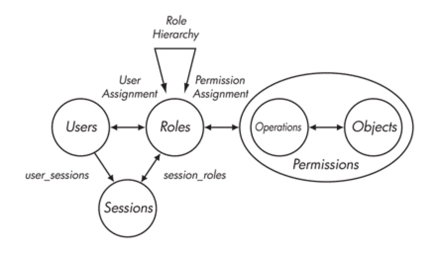
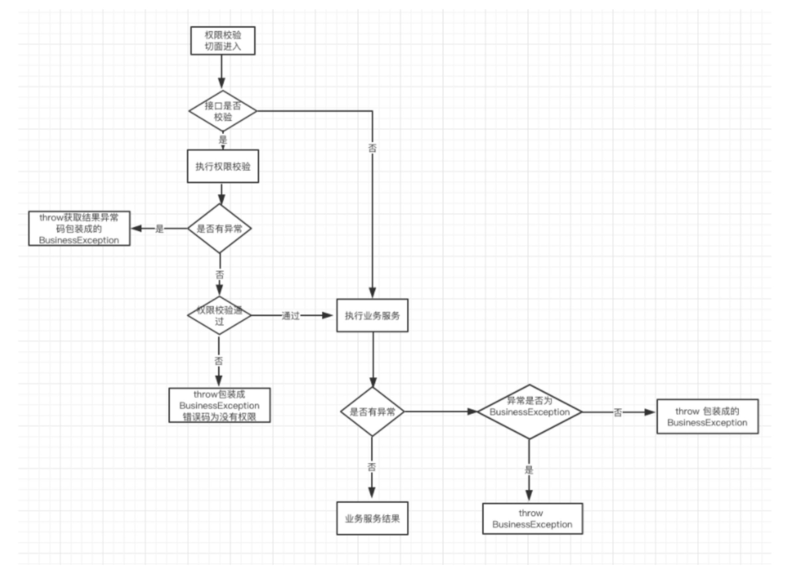

<!DOCTYPE html>
<!-- saved from url=(0046)https://kaiiiz.github.io/hexo-theme-book-demo/ -->
<html xmlns="http://www.w3.org/1999/xhtml">
<head>
    <head>
        <meta http-equiv="Content-Type" content="text/html; charset=UTF-8">
        <meta name="viewport" content="width=device-width, initial-scale=1, maximum-scale=1.0, user-scalable=no">
        <link rel="icon" href="../static/favicon.png">
        <title>有赞权限系统(SAM).md</title>
        <!-- Spectre.css framework -->
        <link rel="stylesheet" href="../static/index.css">
        <!-- theme css & js -->
        <meta name="generator" content="Hexo 4.2.0">
    </head>

<body>

    

        

            <a href="../index.html">
                
                技术文章摘抄
            </a>
        

        

            <ul class="uncollapsible">
                <li><a href="../index.html" class="current-tab">首页</a></li>
            </ul>

            <ul class="uncollapsible">
                <li><a href="../index.html">上一级</a></li>
            </ul>

            <ul class="uncollapsible">
                <li>

                    
                    <a href="AQS&#32;万字图文全面解析.md">AQS 万字图文全面解析.md</a>

                </li>
                <li>

                    
                    <a href="Docker&#32;镜像构建原理及源码分析.md">Docker 镜像构建原理及源码分析.md</a>

                </li>
                <li>

                    
                    <a href="ElasticSearch&#32;小白从入门到精通.md">ElasticSearch 小白从入门到精通.md</a>

                </li>
                <li>

                    
                    <a href="JVM&#32;CPU&#32;Profiler技术原理及源码深度解析.md">JVM CPU Profiler技术原理及源码深度解析.md</a>

                </li>
                <li>

                    
                    <a href="JVM&#32;垃圾收集器.md">JVM 垃圾收集器.md</a>

                </li>
                <li>

                    
                    <a href="JVM&#32;面试的&#32;30&#32;个知识点.md">JVM 面试的 30 个知识点.md</a>

                </li>
                <li>

                    
                    <a href="Java&#32;IO&#32;体系、线程模型大总结.md">Java IO 体系、线程模型大总结.md</a>

                </li>
                <li>

                    
                    <a href="Java&#32;面试题集锦（网络篇）.md">Java 面试题集锦（网络篇）.md</a>

                </li>
                <li>

                    
                    <a href="Java-直接内存&#32;DirectMemory&#32;详解.md">Java-直接内存 DirectMemory 详解.md</a>

                </li>
                <li>

                    
                    <a href="Java中的SPI.md">Java中的SPI.md</a>

                </li>
                <li>

                    
                    <a href="Java中的ThreadLocal.md">Java中的ThreadLocal.md</a>

                </li>
                <li>

                    
                    <a href="Java线程池实现原理及其在美团业务中的实践.md">Java线程池实现原理及其在美团业务中的实践.md</a>

                </li>
                <li>

                    
                    <a href="Java魔法类：Unsafe应用解析.md">Java魔法类：Unsafe应用解析.md</a>

                </li>
                <li>

                    
                    <a href="Kafka&#32;源码阅读笔记.md">Kafka 源码阅读笔记.md</a>

                </li>
                <li>

                    
                    <a href="Kafka、ActiveMQ、RabbitMQ、RocketMQ&#32;区别以及高可用原理.md">Kafka、ActiveMQ、RabbitMQ、RocketMQ 区别以及高可用原理.md</a>

                </li>
                <li>

                    
                    <a href="MySQL&#32;·&#32;引擎特性&#32;·&#32;InnoDB&#32;Buffer&#32;Pool.md">MySQL · 引擎特性 · InnoDB Buffer Pool.md</a>

                </li>
                <li>

                    
                    <a href="MySQL&#32;·&#32;引擎特性&#32;·&#32;InnoDB&#32;IO子系统.md">MySQL · 引擎特性 · InnoDB IO子系统.md</a>

                </li>
                <li>

                    
                    <a href="MySQL&#32;·&#32;引擎特性&#32;·&#32;InnoDB&#32;事务系统.md">MySQL · 引擎特性 · InnoDB 事务系统.md</a>

                </li>
                <li>

                    
                    <a href="MySQL&#32;·&#32;引擎特性&#32;·&#32;InnoDB&#32;同步机制.md">MySQL · 引擎特性 · InnoDB 同步机制.md</a>

                </li>
                <li>

                    
                    <a href="MySQL&#32;·&#32;引擎特性&#32;·&#32;InnoDB&#32;数据页解析.md">MySQL · 引擎特性 · InnoDB 数据页解析.md</a>

                </li>
                <li>

                    
                    <a href="MySQL&#32;·&#32;引擎特性&#32;·&#32;InnoDB崩溃恢复.md">MySQL · 引擎特性 · InnoDB崩溃恢复.md</a>

                </li>
                <li>

                    
                    <a href="MySQL&#32;·&#32;引擎特性&#32;·&#32;临时表那些事儿.md">MySQL · 引擎特性 · 临时表那些事儿.md</a>

                </li>
                <li>

                    
                    <a href="MySQL&#32;主从复制&#32;半同步复制.md">MySQL 主从复制 半同步复制.md</a>

                </li>
                <li>

                    
                    <a href="MySQL&#32;主从复制&#32;基于GTID复制.md">MySQL 主从复制 基于GTID复制.md</a>

                </li>
                <li>

                    
                    <a href="MySQL&#32;主从复制.md">MySQL 主从复制.md</a>

                </li>
                <li>

                    
                    <a href="MySQL&#32;事务日志(redo&#32;log和undo&#32;log).md">MySQL 事务日志(redo log和undo log).md</a>

                </li>
                <li>

                    
                    <a href="MySQL&#32;亿级别数据迁移实战代码分享.md">MySQL 亿级别数据迁移实战代码分享.md</a>

                </li>
                <li>

                    
                    <a href="MySQL&#32;从一条数据说起-InnoDB行存储数据结构.md">MySQL 从一条数据说起-InnoDB行存储数据结构.md</a>

                </li>
                <li>

                    
                    <a href="MySQL&#32;地基基础：事务和锁的面纱.md">MySQL 地基基础：事务和锁的面纱.md</a>

                </li>
                <li>

                    
                    <a href="MySQL&#32;地基基础：数据字典.md">MySQL 地基基础：数据字典.md</a>

                </li>
                <li>

                    
                    <a href="MySQL&#32;地基基础：数据库字符集.md">MySQL 地基基础：数据库字符集.md</a>

                </li>
                <li>

                    
                    <a href="MySQL&#32;性能优化：碎片整理.md">MySQL 性能优化：碎片整理.md</a>

                </li>
                <li>

                    
                    <a href="MySQL&#32;故障诊断：一个&#32;ALTER&#32;TALBE&#32;执行了很久，你慌不慌？.md">MySQL 故障诊断：一个 ALTER TALBE 执行了很久，你慌不慌？.md</a>

                </li>
                <li>

                    
                    <a href="MySQL&#32;故障诊断：如何在日志中轻松定位大事务.md">MySQL 故障诊断：如何在日志中轻松定位大事务.md</a>

                </li>
                <li>

                    
                    <a href="MySQL&#32;故障诊断：教你快速定位加锁的&#32;SQL.md">MySQL 故障诊断：教你快速定位加锁的 SQL.md</a>

                </li>
                <li>

                    
                    <a href="MySQL&#32;日志详解.md">MySQL 日志详解.md</a>

                </li>
                <li>

                    
                    <a href="MySQL&#32;的半同步是什么？.md">MySQL 的半同步是什么？.md</a>

                </li>
                <li>

                    
                    <a href="MySQL中的事务和MVCC.md">MySQL中的事务和MVCC.md</a>

                </li>
                <li>

                    
                    <a href="MySQL事务_事务隔离级别详解.md">MySQL事务_事务隔离级别详解.md</a>

                </li>
                <li>

                    
                    <a href="MySQL优化：优化&#32;select&#32;count().md">MySQL优化：优化 select count().md</a>

                </li>
                <li>

                    
                    <a href="MySQL共享锁、排他锁、悲观锁、乐观锁.md">MySQL共享锁、排他锁、悲观锁、乐观锁.md</a>

                </li>
                <li>

                    
                    <a href="MySQL的MVCC（多版本并发控制）.md">MySQL的MVCC（多版本并发控制）.md</a>

                </li>
                <li>

                    
                    <a href="QingStor&#32;对象存储架构设计及最佳实践.md">QingStor 对象存储架构设计及最佳实践.md</a>

                </li>
                <li>

                    
                    <a href="RocketMQ&#32;面试题集锦.md">RocketMQ 面试题集锦.md</a>

                </li>
                <li>

                    
                    <a href="SnowFlake&#32;雪花算法生成分布式&#32;ID.md">SnowFlake 雪花算法生成分布式 ID.md</a>

                </li>
                <li>

                    
                    <a href="Spring&#32;Boot&#32;2.x&#32;结合&#32;k8s&#32;实现分布式微服务架构.md">Spring Boot 2.x 结合 k8s 实现分布式微服务架构.md</a>

                </li>
                <li>

                    
                    <a href="Spring&#32;Boot&#32;教程：如何开发一个&#32;starter.md">Spring Boot 教程：如何开发一个 starter.md</a>

                </li>
                <li>

                    
                    <a href="Spring&#32;MVC&#32;原理.md">Spring MVC 原理.md</a>

                </li>
                <li>

                    
                    <a href="Spring&#32;MyBatis和Spring整合的奥秘.md">Spring MyBatis和Spring整合的奥秘.md</a>

                </li>
                <li>

                    
                    <a href="Spring&#32;帮助你更好的理解Spring循环依赖.md">Spring 帮助你更好的理解Spring循环依赖.md</a>

                </li>
                <li>

                    
                    <a href="Spring&#32;循环依赖及解决方式.md">Spring 循环依赖及解决方式.md</a>

                </li>
                <li>

                    
                    <a href="Spring中眼花缭乱的BeanDefinition.md">Spring中眼花缭乱的BeanDefinition.md</a>

                </li>
                <li>

                    
                    <a href="Vert.x&#32;基础入门.md">Vert.x 基础入门.md</a>

                </li>
                <li>

                    
                    <a href="eBay&#32;的&#32;Elasticsearch&#32;性能调优实践.md">eBay 的 Elasticsearch 性能调优实践.md</a>

                </li>
                <li>

                    
                    <a href="不可不说的Java“锁”事.md">不可不说的Java“锁”事.md</a>

                </li>
                <li>

                    
                    <a href="互联网并发限流实战.md">互联网并发限流实战.md</a>

                </li>
                <li>

                    
                    <a href="从ReentrantLock的实现看AQS的原理及应用.md">从ReentrantLock的实现看AQS的原理及应用.md</a>

                </li>
                <li>

                    
                    <a href="从SpringCloud开始，聊微服务架构.md">从SpringCloud开始，聊微服务架构.md</a>

                </li>
                <li>

                    
                    <a href="全面了解&#32;JDK&#32;线程池实现原理.md">全面了解 JDK 线程池实现原理.md</a>

                </li>
                <li>

                    
                    <a href="分布式一致性理论与算法.md">分布式一致性理论与算法.md</a>

                </li>
                <li>

                    
                    <a href="分布式一致性算法&#32;Raft.md">分布式一致性算法 Raft.md</a>

                </li>
                <li>

                    
                    <a href="分布式唯一&#32;ID&#32;解析.md">分布式唯一 ID 解析.md</a>

                </li>
                <li>

                    
                    <a href="分布式链路追踪：集群管理设计.md">分布式链路追踪：集群管理设计.md</a>

                </li>
                <li>

                    
                    <a href="动态代理种类及原理，你知道多少？.md">动态代理种类及原理，你知道多少？.md</a>

                </li>
                <li>

                    
                    <a href="响应式架构与&#32;RxJava&#32;在有赞零售的实践.md">响应式架构与 RxJava 在有赞零售的实践.md</a>

                </li>
                <li>

                    
                    <a href="大数据算法——布隆过滤器.md">大数据算法——布隆过滤器.md</a>

                </li>
                <li>

                    
                    <a href="如何设计一个亿级消息量的&#32;IM&#32;系统.md">如何设计一个亿级消息量的 IM 系统.md</a>

                </li>
                <li>

                    
                    <a href="异步网络模型.md">异步网络模型.md</a>

                </li>
                <li>

                    
                    <a href="当我们在讨论CQRS时，我们在讨论些神马？.md">当我们在讨论CQRS时，我们在讨论些神马？.md</a>

                </li>
                <li>

                    
                    <a href="彻底理解&#32;MySQL&#32;的索引机制.md">彻底理解 MySQL 的索引机制.md</a>

                </li>
                <li>

                    
                    <a href="最全的&#32;116&#32;道&#32;Redis&#32;面试题解答.md">最全的 116 道 Redis 面试题解答.md</a>

                </li>
                <li>

                    <a class="current-tab" href="有赞权限系统(SAM).md">有赞权限系统(SAM).md</a>
                    

                </li>
                <li>

                    
                    <a href="有赞零售中台建设方法的探索与实践.md">有赞零售中台建设方法的探索与实践.md</a>

                </li>
                <li>

                    
                    <a href="服务注册与发现原理剖析（Eureka、Zookeeper、Nacos）.md">服务注册与发现原理剖析（Eureka、Zookeeper、Nacos）.md</a>

                </li>
                <li>

                    
                    <a href="深入浅出Cache.md">深入浅出Cache.md</a>

                </li>
                <li>

                    
                    <a href="深入理解&#32;MySQL&#32;底层实现.md">深入理解 MySQL 底层实现.md</a>

                </li>
                <li>

                    
                    <a href="漫画讲解&#32;git&#32;rebase&#32;VS&#32;git&#32;merge.md">漫画讲解 git rebase VS git merge.md</a>

                </li>
                <li>

                    
                    <a href="生成浏览器唯一稳定&#32;ID&#32;的探索.md">生成浏览器唯一稳定 ID 的探索.md</a>

                </li>
                <li>

                    
                    <a href="缓存&#32;如何保证缓存与数据库的双写一致性？.md">缓存 如何保证缓存与数据库的双写一致性？.md</a>

                </li>
                <li>

                    
                    <a href="网易严选怎么做全链路监控的？.md">网易严选怎么做全链路监控的？.md</a>

                </li>
                <li>

                    
                    <a href="美团万亿级&#32;KV&#32;存储架构与实践.md">美团万亿级 KV 存储架构与实践.md</a>

                </li>
                <li>

                    
                    <a href="美团点评Kubernetes集群管理实践.md">美团点评Kubernetes集群管理实践.md</a>

                </li>
                <li>

                    
                    <a href="解读《阿里巴巴&#32;Java&#32;开发手册》背后的思考.md">解读《阿里巴巴 Java 开发手册》背后的思考.md</a>

                </li>
                <li>

                    
                    <a href="认识&#32;MySQL&#32;和&#32;Redis&#32;的数据一致性问题.md">认识 MySQL 和 Redis 的数据一致性问题.md</a>

                </li>
                <li>

                    
                    <a href="进阶：Dockerfile&#32;高阶使用指南及镜像优化.md">进阶：Dockerfile 高阶使用指南及镜像优化.md</a>

                </li>
                <li>

                    
                    <a href="铁总在用的高性能分布式缓存计算框架&#32;Geode.md">铁总在用的高性能分布式缓存计算框架 Geode.md</a>

                </li>
                <li>

                    
                    <a href="阿里云PolarDB及其共享存储PolarFS技术实现分析（上）.md">阿里云PolarDB及其共享存储PolarFS技术实现分析（上）.md</a>

                </li>
                <li>

                    
                    <a href="阿里云PolarDB及其共享存储PolarFS技术实现分析（下）.md">阿里云PolarDB及其共享存储PolarFS技术实现分析（下）.md</a>

                </li>
                <li>

                    
                    <a href="面试最常被问的&#32;Java&#32;后端题.md">面试最常被问的 Java 后端题.md</a>

                </li>
                <li>

                    
                    <a href="领域驱动设计在互联网业务开发中的实践.md">领域驱动设计在互联网业务开发中的实践.md</a>

                </li>
                <li>

                    
                    <a href="领域驱动设计的菱形对称架构.md">领域驱动设计的菱形对称架构.md</a>

                </li>
                <li>

                    
                    <a href="高效构建&#32;Docker&#32;镜像的最佳实践.md">高效构建 Docker 镜像的最佳实践.md</a>

                </li>
            </ul>

        

    

    

        

    

    

    

        

            

                

                    <!-- For Responsive Layout -->
                    <header class="navbar">
                        <section class="navbar-section">
                            <a onclick="open_sidebar()">
                                <i class="icon icon-menu"></i>
                            </a>
                        </section>
                    </header>
                

                

                    

                        

                        
<h1>有赞权限系统(SAM)</h1>

有赞作为一个商家服务公司，通过产品和服务，帮助互联网时代的生意人成功。在新零售的浪潮下，有赞零售为商家提供不同规模的门店和网店经营解决方案，帮助零售商家们快速进入新零售时代。与传统网上商城场景不同，零售面对着全新的业务场景和难题，一家运转成熟的新零售店铺，通常需要包括老板、店长、客服、收银员、核销员、仓管、财务等十余个不同能力的角色分工、搭配。摆在零售商家们眼前的一大难题是，如何优雅的管理各个员工，自由分配角色，无痛又润滑地解决员工角色管理问题。在充分分析零售行业业务场景，员工角色管理方案的不断探索讨论后，权限系统SAM(Security Access Manager)应运而生，SAM是有赞零售在员工角色权限管理道路上探索的里程碑，支持着零售PC、App和Pad产品的权限业务，任何一家使用了有赞零售的零售店都可以通过SAM权限系统提供的服务来灵活的给店里员工灵活分配角色，责任到人，以此提高店铺运转效率；支撑零售业务的同时，抽象出了一套权限管理框架，对其他业务线产品(微商城)进行同样支持。

在介绍SAM系统之前，首先以几个案例来理解权限系统的概念和设计。

计算机世界中的许多事物是现实世界的一个阴影，现实中所见的许多模式/概念在计算机世界里都能找到，权限作为现实世界随处可见的概念，在我们谈论私有制、所有权时，时常会谈及权限，在计算机世界中，权限在许多系统中举足轻重。一切皆文件的Linux操作系统，为大多技术人员所熟悉，在这样一个多用户操作系统里，每个用户有自己的工作空间，通过把权限落在文件上实现对资源的管理。曾记否，qq里隐身对她可见，怕她看不见，下线又上线，却依旧被视而不见；曾记否，亲密无间的恋人们，分手后变成了最熟悉的陌生人，悲痛伤心之余，微信、电话、 qq拉黑。上述这些，都是计算机中利用权限系统的典型案例，在qq隐身案例中，你对女神隐身可见，实际上是赋予了她可以看到你的隐身状态（真实状态）的权限，当然你也赋予了人家伤害你的权限；恋人的案例中，恋人们把对方拉到了黑名单用户组，这样一来，他们就看不见相互动态，成为最熟悉的陌生人；从此，从你的全世界路过。

<h2>RBAC</h2>

上面例子，我们可以抽象出这样的模式：“Who对What(Which)进行How的操作” 。例如，恋人们的例子，在你拉黑对方后，在朋友圈中你(Who)将看不到(How)对方的消息(What)。这是一个经典的RBAC（基于角色的权限访问控制）权限模型。RBAC认为权限授权实际上是Who、What、How的问题。在RBAC模型中，Who、What、How构成了访问权限三元组,也就是“Who（权限的拥用者或主体）对What(Which)（权限针对的对象或资源）进行How（具体的权限）的操作”。

RBAC模型引入了“角色”的概念。所谓“角色”就是一个或一群用户在系统中可执行操作的集合，它是一个用户的集合，又是一个授权许可的集合。通过将角色指派给用户，为角色赋予权限的方式，使用户和权限通过角色间接相联系。RBAC基本模型如图所示：

在RBAC中，用户与角色之间、角色与权限之间都是多对多的关系。会话是一个用户对多个角色的映射，此时的用户权限可以为激活角色权限的并集。RBAC对资源授权管理过程分为两个部分，首先实现访问权限与角色相关联，然后再实现角色与用户相关联，从而实现了用户与访问权限的逻辑分离。

<h2>权限系统SAM</h2>
<h3>SAM权限系统模型设计</h3>

RBAC模型不同于强制存取控制以及自由选定存取控制直接赋予使用者权限，是将权限赋予角色。在RBAC中，权限与角色相关联，用户通过成为适当角色成员而得到这些角色的权限，角色可依新的需求和系统的合并而赋予新的权限，而权限也可根据需要而从某角色中回收。RBAC相对于传统访问控制更为中性且更具灵活性的存取控制技术。从一家零售店铺员工角色管理角度看，设置角色是为了完成各种工作而创造，员工则根据它的责任和资格来被指派相应的角色，员工应该可以很容易地从一个角色被指派到另一个角色。因此，零售选择了基于RBAC模型来实现权限系统解决商家们管理员工角色问题。

依据RBAC模型思想，SAM权限系统业务模型设计为员工管理和权限管理两部分，员工管理主要指管理员工以及为员工指派角色，权限管理主要指管理菜单、页面、按钮、API等资源，通过定义最基本的业务功能点作为权限点，实现管理角色对资源主体的请求，构成“用户-角色-权限-资源”的授权模型。

下面是SAM权限系统模型中的一些通用语言：

<ul>
<li>员工：角色的载体，权限的实行者</li>
<li>角色：角色是权限集进一步映射。业务系统可动态管理角色,各业务为方便用户使用可提供给默认角色列表，满足不同的员工权限</li>
<li>权限点：全局唯一的用来表示某一个功能点对应的权限的状态</li>
<li>功能点：逻辑上定义的用来描述系统资源的最小基本单位，每一个功能点都对应唯一一个权限点</li>
<li>功能集(权限集)：即功能点的集合，有一组功能点按照特定格式进行组合</li>
<li>API：请求系统资源的通道和动作，拥有功能集属性</li>
<li>菜单：将系统资源组织后展示给请求者的入口，拥有功能集属性</li>
<li>页面：被当做一种特殊的菜单，拥有URL属性</li>
<li>按钮：页面中更细粒度的资源入口，被当作一种特殊的菜单</li>
</ul>
<h3>SAM权限系统模型的实现</h3>

在传统的RBAC模型中，通常通过一张关系表来保存角色与权限集的对应关系，实现权限与角色相关联。可以预见的是，随着零售业务的不断发展会积累下不计其数的功能点，导致关联表的数据极难维护和使用。SAM权限系统利用进制转换的策略解决了这个问题 ，同时提高了存储效率以及权限判定效率。一个基本类型为Long的十进制数字，它也可以看做是由64位0或1组成的二进制。在SAM系统模型设计中，每一个功能点定义为一个权限点，该权限点由idx和pos两个属性确保是全局唯一的权限点。idx表示第几个Long型空间，pos表示Long型对应的二进制数中所处的位置，64位长度即可代表64个不同能功能点。当64位满时无法再容放更多的功能点，这时idx属性会自增，重新申请一个Long型空间。如此一个64位的Long数字，通过0或1的组合，即可表示最多对64个不同的功能点所拥有权限的状态描述。

例如：权限集{1}表示拥有idx=0,pos=0对应功能点的权限，权限集{-1,1}表示拥有idx=0,pos∈[0,1,2,..,63]与idx=1,pos=0对应功能点的权限。

SAM权限系统将资源与所代表的功能点的关联关系通过进制的方式管理起来，采用计算机进制的思想，抽象出功能集换算公式来完成资源与二进制之间的映射，以及角色与二进制的映射。

权限集换算公式：
{(idx0,pos0),(idx0,pos1)…(idxN,posM)} =&gt; {Long0,Long1…LongN}

SAM权限系统同样通过进制思想实现“Who对What进行了How的操作”，角色请求某个资源（菜单/API）时，通过权限校验计算公式——进制按位“与”运算操作的思想（见下）得出该角色是否拥有访问资源的权限。采用进制来实现运算，权限判定的效率会变得更加的高效。例如，一个仓管在点击一个商品库存菜单时，背后的权限校验计算公式，其实是将角色的权限集与资源的权限集进行按位与计算，任意一对序号为idx的Long算得不为0，即两集合有公共的功能集，认为该角色拥有对资源访问的权限。

权限校验计算公式：
{Long0,Long1…LongN} &amp; {Long0,Long1…LongM}

SAM权限系统模型的实现遵循RBAC模型中的最小权限原则，责任分离原则和数据抽象原则三大原则，通过最小权限原则可以将角色配置成其完成任务所需要的最小的功能集；有了责任分离原则可以通过调用相互独立互斥的角色来共同完成敏感的任务而体现，比如要求一个仓管和商品管理员共同参与一个商品。数据抽象则可以通过权限的抽象来体现，如仓管操作商品发货，库存管理等抽象权限，而不用操作系统提供的典型的读、写、执行权限。

<h3>SAM权限系统架构</h3>

零售通过PC、App和Pad来满足不同商家的终端需求，因此SAM权限系统需要满足零售不同客户端权限业务场景，同时也要支持微商城产品权限业务。SAM权限系统采用微服务的方式对外提供服务，采用分布式分层架构实现，主要包括客户端和服务端两部分，客户端以轻量的方式嵌入在业务系统，提供给不同业务系统实现角色访问资源的控制；服务端通过提供Dubbo服务，Nova服务跟客户端进行交互。服务端主要对员工，菜单，角色，API，功能点进行数据管理。SAM作为基础服务，每天的请求量巨大，通过Redis缓存来解决性能问题，选用Druid作为数据库连接池，管理着数据库的连接以及释放。同时，通过对接天网监控平台来观察系统运行状态，提高系统的稳定性。有赞零售系统基于SAM实现的角色对于资源的访问控制主要是API校验和菜单渲染，任何一家零售店登入有赞零售系统后，点击页面中的某一个菜单或者页面元素（按钮，链接...），都会进行菜单渲染以及API接口的校验。由于两部分调用量巨大，同时不同的客户端请求量不同，防止相互之间干扰，因此将菜单渲染，API校验等能力在不同的客户端中各自实现。

<h4>菜单渲染</h4>

SAM通过客户端的方式进行接入，菜单渲染在客户端一侧进行。目前SAM已经提供了php/node js两套客户端，供web层进行接入和渲染。
菜单渲染的过程可以分为三点：
一、结点定位
按照系统功能的划分，菜单通常以一棵树的形式进行展现。以零售PC后台为例，所有在页面中展示的元素，都认为是一种菜单，这样的菜单元素包括：菜单、页面、按钮。在后台访问时，用户停留的菜单通常是页面，页面有一个全局唯一的属性：URL，往上：可以通过父菜单找到根结点，往下，页面下可能包含一些子菜单——按钮。因此SAM只需要根据当前请求的URL，即可在后台菜单树中定位到唯一的页面菜单，同时获得该菜单的结点路径以及拥有的按钮。
二、权限计算
我们已经获得了用户的角色权限和完整的菜单树，根据每个菜单结点的权限集，可以计算出当前用户对结点的访问权。根据计算结果，客户端对菜单可以进行区分渲染，比如：用户通过拼URL访问一个无权限页面时会提示非法，无权限访问的菜单和按钮会自动置灰不可点击。
三、属性传递
默认菜单不具备URL属性。菜单的URL属性通过子菜单的URL传递生成，SAM会选择第一个有权限的子菜单的URL作为父结点的属性，并逐级传递到一级菜单。

<h4>API权限校验</h4>

零售系统中除了菜单外，API是另一种被请求的资源类型。API校验是除了菜单渲染外另一道权限控制的保障。通过卡门（API网关）的API请求转发到具体业务系统时，嵌入在业务系统中的SAM API校验客户端会首先通过上面的权限校验计算公式对该角色是否具有权限访问这个API进行判定，若权限校验通过则执行后面业务逻辑。具体流程如下图所示

API权限校验的伪代码实现:

<pre><code class="language-java">#权限不通过错误码提示信息
AUTHPERM_ERROR(231000401,&quot;您没有权限执行该操作!&quot;)  
# 织入点
@Before(&quot;@annotation(com.youzan.sam.common.Auth)&quot;)
# 切面处理方法
def handle(JoinPoint pjp):  
    # 可以启动时或者运行时控制该开关是否对API进行权限校验
    if(!enable):
         return
    # 权限校验结果包装对象
    def pass=checkPermission()
    # 权限校验执行成功
    if (pass.isSuccess()):
       # 权限校验通过
       if(pass.getData().get(&quot;isSuccess&quot;)):
         return
       # 权限校验不通过
       else:
         throw new BusinessException(AUTHPERM_ERROR.getCode,AUTHPERM_ERROR.getMessage());
    # 权限校验执行失败
    else:
       throw BusinessException(pass.getCode(), pass.getMessage())

# 权限校验方法
def checkPermission():  
    # 判断是否需要走权限校验，对于某些内部调用可以直接跳过
    {...}
    # 获取卡门（API网关）隐式参数,运用了dubbo的隐式传参的能力
    def kdt_id=RpcContext.getContext().getAttachment(Constants.KDT_ID_KEY)
    def admin_id=RpcContext.getContext().getAttachment(Constants.ADMIN_ID_KEY)
    def service = RpcContext.getContext().getAttachment(Constants.SERVICE_KEY)
    def method = RpcContext.getContext().getAttachment(Constants.METHOD_KEY)
    def version = RpcContext.getContext().getAttachment(Constants.VERSION_KEY)
    # 上述参数的校验
    {...}
    # 通过StaffPermServiceProxy获取角色的权限集
    def staffPerm=StaffPermServiceProxy.getStaffPerms(adminId, kdtId)
    # 通过APIPermServiceProxy获取API的权限集
    def apiPerm=APIPermServiceProxy.getServicePerms(service, version, method)
    # 运用权限校验计算公式判定该角色是否可以访问此API
    {...}
    # 返回结果
    return pass
</code></pre>

API权限校验流程可以总结如下：

<ol>
<li>业务方在对应需要权限校验的API上标注@Auth注解，Spring框架会在初始化创建业务bean的时候，扫描该bean是否有@Auth注解标注的方法，对于有@Auth注解标注的，会创建代理类，然后会将该权限切面织入到代理类中；</li>
<li>业务调用有@Auth注解标注的方法时，会执行该权限校验切面逻辑，首先检查权限校验开关，判断是否需要权限校验，该开关可以在运行时动态设置；</li>
<li>如果需要，再调用AuthService的权限校验方法，AuthService会根据店铺id与用户id从SAM服务端获取员工角色权限信息，根据卡门（API网关）隐式参数中service，method，version去SAM服务端获取对应API权限(相对于在对应API上直接标注权限点，这种方式更加的灵活，而且可以随着业务API版本的升级，进行很方便的升级，同时结合卡门（API网关）可以对API进行分流，不同的商家可以对应不同API的权限校验);</li>
<li>在获取到角色权限集和API权限集后，基于上面的角色与权限校验逻辑进行权限校验。校验通过，则正式发起API请求。校验不过，则提示无权限。</li>
</ol>
<h2>SAM权限系统抽象模型</h2>

产品在分析完需求后，将需求交由开发去完成。SAM权限系统支撑着零售业务的同时，也支撑着微商城业务。 零售各个模块就有不同的产品支撑着，为了更好的满足服务商家的需求，以及方便产品们的分析。SAM权限系统可以抽象成如下模型，商家和产品可以从各自不同的视角，去对接SAM权限系统。例如，下图所示商家想要一个运营的角色需要有新建商品，以及查看订单的能力，同时需要一个收银员只有查看订单的能力。产品从自己的设计角度分析，对应的就是商品管理，订单管理的模块，对应的模块下有对应的商品，订单菜单，最后将角色的权限体现在页面元素和API上，例如新建商品的按钮，以及查看订单的按钮会呈现不同的渲染样式；按钮触发对应的是与后端交互的不同API，不同的角色具有API的不同执行能力。

<h2>未来展望</h2>
<h3>自定义角色</h3>

在了解商家需求后，零售提供了8大默认角色来支持单店版的员工角色问题。零售业务错综复杂，默认角色很多时候并不能对付所有场景，现在一些自定义角色已经在某些零售店使用。未来自定义角色将全线支持各个商家，定制任意权限的任意角色。

<h3>多角色</h3>

有些零售商家为了缩减人力成本，一个员工常常担任多个角色，因此需要提供一个员工多角色的能力。零售业务已经在使用多角色的能力。

<h3>零售中台的支持</h3>

零售中台是有赞零售的一个旗舰型产品，旨在为商家提供一个覆盖线上多渠道线下多门店的全渠道解决方案，并利用数据化运营思路帮助商家拉新获客、提高复购。其业务形态非常复杂，涉及到多种角色和权限的组合，而且每个商家可能存在一些个性化需求，如何提供灵活的适配能力是SAM系统的一个挑战。

<h3>自定义菜单</h3>

过去后台功能的发布上线，往往是由发布系统控制，发布则功能即刻上线，一旦发现故障立时回滚。SAM通过菜单管理，可以实时控制线上的任意菜单、页面和按钮的渲染状态，从容地上下线页面和功能。

<h3>技术改造</h3>

SAM作为零售以及其他业务的公共基础组件，需要打造成一个高可用，高性能，易扩展，可伸缩且安全的系统。随着业务的不断接入，通过对系统的不断改造来支撑业务的不断发展。

<h2>结语</h2>

权限系统目前归属有赞零售技术团队，对外开放权限接入和员工服务化能力。

                    

                    

                        

                            <a href="最全的&#32;116&#32;道&#32;Redis&#32;面试题解答.md">上一页</a>
                        

                        

                            <a href="有赞零售中台建设方法的探索与实践.md">下一页</a>
                        

                    

                

            

        

    

    

</body>
<!-- Global site tag (gtag.js) - Google Analytics -->

</html>
